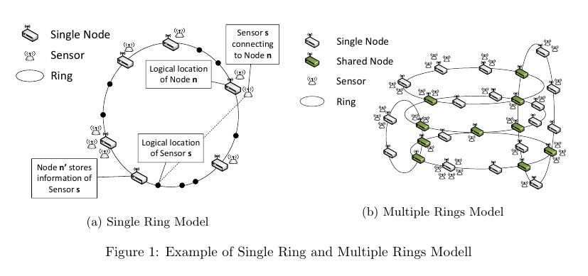

# Multi-ring DHT Chord Approach for Device Discovery in IoT Environment

## Phần 1: Giới thiệu

Hiện nay, các hệ thống IoT - Internet of Things đã và đang được phát triển để phục vụ cho các nhu cầu đa dạng trong đời sống xã hội. Các ứng dụng IoT được áp dụng cho rất nhiều lĩnh vực, với rất nhiều quy mô khác nhau, từ quản lý một ngôi nhà, cho đến hệ thống smart IoT cho một trường học, rộng hơn nữa là cho một thành phố, một khu vực vv... Chính vì vậy, nên một trong những yếu tố chính liên quan tới hiệu quả của các hệ thống IoT hiện nay, đó là khả năng scale của hệ thống - tính scalability, khả năng này quyết định hệ thống IoT được xây dựng có thể áp dụng được cho nhiều nhu cầu, nhiều phạm vi sử dụng của xã hội hay không.

Để một hệ thống IoT có tính scalability, chúng ta phải tạo cho người sử dụng hệ thống khả năng quản lý và điều khiển các thành phần trong hệ thống một cách hiệu quả, với hiệu năng cao nhất. Đối với các hệ thống IoT có quy mô nhỏ như một văn phòng hay một ngôi nhà, thì vấn đề quản lý và điều khiển hệ thống thường được tiếp cận theo mô hình phân cấp - hierarchical model. Khi sử dụng mô hình này, các thành phần trong hệ thống sẽ được sắp xếp trên một cây phân cấp có nhiều tầng, các thành phần ở tầng trên (parent) sẽ quản lý các thành phần ở tầng dưới (child). Cách tiếp cận này khá phù hợp với các hệ thống quy mô nhỏ, khi bài toán về hiệu năng chưa phải là một vấn đề lớn, và số lượng thành phần trong hệ thống ít và như mô hình kết nối của hệ thống đơn giản. Tuy nhiên, trong một môi trường hệ thống IoT có quy mô lớn, khi số lượng các thiết bị trong hệ thống là rất lớn (hàng triệu thiết bị), mô trường kết nối giữa các thành phần trong hệ thống phức tạp và không còn đồng nhất, một thiết bị trong hệ thống có thể kết nối tới nhiều thiết bị khác nhau trong nhiều khối khác nhau của hệ thống, thì mô hình phân cấp không còn phù hợp cho hệ thống IoT của chúng ta nữa. Lý do là vì mô hình kết nối phức tạp và đan xen của hệ thống, nên chúng ta không thể phân chia các thiết bị vào các lớp phân cấp, cũng như không thể xác định chính xác thiết bị nào sẽ quản lý thiết bị nào trong hệ thống nữa. Thêm vào đó, số lượng thiết bị trong hệ thống quy mô lớn sẽ khiến cho bài toán hiệu năng trở thành một vấn đề lớn, mà mô hình phân cấp thường không thể giải quyết hiệu quả các vấn đề liên quan tới hiệu năng ( như các vấn đề xác định - điều khiển các thiết bị, quản lý thiết bị và lưu trữ thông tin các thiết bị, vv... ), và hiệu năng của các bài toán trên giữa các tầng là không đồng đều với nhau (ví dụ như tìm kiếm các thiết bị ở các tầng phía trên sẽ nhanh chóng hơn nhiều việc tìm kiếm thiết bị ở tầng phía dưới. Chính vì lý do như vậy, nên chúng ta cần thiết kế một mô hình mới cho các hệ thống IoT đáp ứng được các các yêu cầu về hiệu năng, sử dụng và quản lý hệ thống đặt ra trong thời điểm hiện nay.

Bài viết sẽ trình bày một hướng tiếp cận để xây dựng một mô hình hệ thống mới, cho phép  quản lý và điều khiển các hệ thống IoT quy mô lớn - Chord multi-ring model, được xây dựng dựa trên nền tảng là Chord protocol. Trong mô hình mới này, hệ thống IoT được nhìn nhận như một hệ thống bao gồm nhiều thành phần nhỏ kết nối giao thoa với nhau, mỗi một thành phần nhỏ là một **Chord logic ring**, các Chord logic ring kết nối/giao thoa với nhau tại các điểm **share node**. Trong mỗi một Chord logic ring là một tập hợp các gateway ngang hàng với nhau, mỗi một  gateway quản lý một tập các sensor xung quanh nó. Mỗi một sensor chỉ kết nối với một gateway trong hệ thống. Mô hình mới quản lý hệ thống bằng cách sử dụng Distributed Hash Table - DHT: Các thực thể trong hệ thống như ring, gateway và sensor đều được gán một Identifier - hash ID để định danh thực thể đó trong hệ thống. Cùng với đó, một loạt các cơ chế quản lý như: Thêm các thiết bị (sensor/gateway) mới vào hệ thống, gỡ bỏ một số thiết bị khỏi hệ thống, tìm kiếm, quản lý các thiết bị trong hệ thống cũng được xây dựng trong mô hình mới này. Với các đặc điểm này, mô hình mới sẽ giúp chúng ta quản lý, điều kiển một hệ thống IoT lớn, có kiến trúc phức tạp, có số lượng kết nối lớn và đa dạng một cách hiệu quả, qua đó giải quyết được bài toán scalability cho các hệ thống IoT.

Các đặc điểm quan trọng của mô hình mới mà bài viết đề xuất là:

- Dựa trên Chord protocol xây dựng một mô hình hệ thống bao gồm nhiều **logic ring** kết nối với nhau để quản lý và tìm kiếm các thực thể trong hệ thống, với một kiến trúc thống nhất cho tất cả mọi thành phần.
- Sử dụng các thực thể shared node để kết nối các logic ring trong hệ thống.
- Kiểm soát quá trình các thực thể gia nhập hệ thống và rời khỏi hệ thống.
- Có cơ chế truy vấn và tìm kiếm các thiết bị rộng khắp trên mọi thành phần trong hệ thống.

Phần còn lại của bài viết bao gồm các thành phần sau:

- Phần 2 sẽ cho chúng ta thấy một kịch bản thực tế dẫn tới sự hình thành mô hình mới
- Phần 4 trình bài về thiết kế kiến trúc của mô hình multi peer Chord ring. Trong phần này, chúng ta cũng sẽ xây dựng các cơ chết tìm kiếm, thêm thiết bị vào hệ thống và gỡ bỏ thiết bị khỏi hệ thống. Các lý thuyết thảo luận và phân tích về hoạt động của hệ thống cũng sẽ được trình bày trong chương này.

## Phần 2: Một số kịch bản về các môi trường IoT

Trong phần này, chúng ta sẽ xem xét một kịch bản triển khai hệ thống IoT trong môi trường thực tế là một tòa nhà cao tầng có số lượng tầng lớn, mỗi tầng bao gồm có các phòng và các hành lang. Các đặc điểm của hệ thống IoT được triển khai cho tòa nhà này là:

- Số lượng sensor và thiết bị điện được triển khai trong tòa nhà là rất lớn và đa dạng về chủng loại như: sensor đo nhiệt độ, độ ẩm, ánh sáng, điều hòa, smart TV, Quạt, đồng hồ, thiết bị đóng/ mở cửa, đóng mở cửa sổ, đèn chiếu sáng, vv...

- Môi trường mạng kết nối các thiết bị và sensor nêu trên có tính không đồng nhất và bao gồm nhiều mạng ad-hoc con bên trong. Một số thiết bị sử dụng mạng không dây (wireless), một số thiết bị khác sử dụng PLC hoặc dây cáp để truyền nhận dữ liệu, và một số lượng lớn các sensors sử dụng bluetooth để kết nối. Do vậy, đa số các thiết bị (đặc biệt là các sensor nhỏ) sẽ không kết nối trực tiếp tới internet và cloud để xử lý dữ liệu. Do vậy, chúng ta cần có một thiết bị đứng trung gian giữa cloud và các sensor để làm nhiệm vụ thu nhận dữ liệu từ các sensor rồi gửi lên cloud, cũng như điều khiển các sensor đó. Thiết bị trung gian đó có thể là các smart TV, các router hoặc các thiết bị thông minh như điện thoại, máy tính bảng, yêu cầu chung đối với các thiết bị này là chúng phải có khả năng kết nối tới các sensor cũng như với hệ thống internet, và khả năng tính toán, lưu trữ dữ liệu. Chúng ta sẽ gọi các thiết bị trung gian với một tên gọi chung là **gateway**. Sau khi xây dựng xong các gateway, các gateway sẽ được sử dụng để quản lý các sensor xung quanh nó, cũng như lưu trữ các thông tin của các sensor.
- Các thành phần có tính độc lập trong tòa nhà (như 1 phòng, một hành lang) tạo ra một không gian điều phối chung (smart context) cho phép tất cả các thiết bị cùng nằm trong thành phần đó có thể tương tác và truyền thông với nhau. Ví dụ như với smart-context là một phòng làm việc: Khi một người bước vào phòng, doot sensor sẽ phát hiện ra sự xuất hiện của người trong phòng. Tiếp theo, door sensor sẽ tương tác với light sensor để kiểm tra mức độ sáng trong phòng. Nếu door sensor thấy độ sáng chưa đủ, nó sẽ yêu cầu light-controller-device bật đèn trong phòng lên. Các thiết bị nằm trong 2 thành phần khác nhau ( 2 smart- context khác nhau) trong hệ thống vẫn có thể tương tác và điều khiển nhau, mặc dù chúng không cùng năm trong một smart-context. Ví dụ, từ một máy tính trong phòng quản lý điều hòa, chúng ta có thể yêu cầu tất cả các điều hòa ở tất cả các phòng trong tầng 1 và tầng 2 giảm nhiệt độ xuống 25 độ, khi nhiệt độ bên ngoài tăng cao.

Từ kịch bản đã mô tả, chúng ta có thể thấy rằng, trong một hệ thống IoT quy mô lớn, sẽ tồn tại rất nhiều các smart context hoạt động cùng một lúc, các smart context này giao thoa và kết nối với nhau tạo ra tính liên tục trong hệ thống. Môi trường IoT phức tạp này cần có một mô hình kiến trúc phù hợp để người dùng có thể quản lý và tương tác hiệu quả với các thành phần trong hệ thống. Khi xây dựng mô hình mới, các câu hỏi sau đây sẽ được đặt ra:

- Làm thế nào để chúng ta có thể quản lý được tất cả các thiết bị trong một hệ thống lớn có tính không đồng nhất, bao gồm nhiều IoT context đan xen nhau ?
- Làm sao để xử lý các sự kiện một thiết bị gia nhập và rời khỏi hệ thống?
- Làm sao để chúng ta có thể xác định hiệu quả vị trí của một thiết bị trong hệ thống, để từ đó có thể đưa ra các yêu cầu tới thiết bị đó ?

Chúng ta cùng xem mô hình mới mà bài viết đề xuất sẽ xử lý các câu hỏi trên như thế nào

## Phần 4: Thiết kế mô hình hệ thống logic cho hệ thống IoT quy mô lớn

Trong phần này, chúng ta sẽ mô tả chi tiết về thiết kế và phương thức hoạt động của mô hình hệ thống mới - Multi Chord Ring. Đầu tiên, chúng ta sẽ xem lại các thông tin về Chord protocol, protocol được sử dụng làm nền tảng cơ bản để phát triển mô hình Multi Chord Ring.

### 4.1 Chord Protocol

Chord protocol là một DHT protocol phổ biến được sử dụng trong các hệ thống ngan hàng - peer-to-peer(P2P) network. Khi sử dụng Chord protocol, tất cả các node trong hệ thống đều được định danh bằng Identifier, Identifier này được tạo ra bằng consistent hashing. Sau đó, Chord sắp xếp các node lên một logic ring dựa vào identifier của chúng. Một ring có thể có một lượng lớn các node (với SHA-1 160 bit là ```2^160``` node. Mỗi một node có 1 bảng dữ liệu, gồm một tập các entry chứa thông tin định tuyến để di chuyển từ node đó tới các node khác trong ring, được gọi là **Finger Table - FT**. Mỗi một node có chứa 1 FT chứa ```O(log N)``` entry lưu định tuyến tới ```O(log N)``` node trong ring. Trong một hệ thống sử dụng Chord protocol, độ phức tạp của thao tác phân giải key là ```O(log N)```, và cần ```O(log^2(N))``` thông điệp để xử lý sự kiện 1 node gia nhập hoặc rời khỏi hệ thống.

Chord có những ưu điểm phù hợp với các ứng dụng phân tán ngang hàng: cân bằng tải - load balance, phân tán - decentralization, tính scalability, duy trì khả năng phục vụ kể cả khi môi trường hệ thống thay đổi - availability, và thiết kế phẳng ngang hàng - flat naming. Chính vì những ưu điểm trên, nên Chord protocol được lựa chọn làm nền tảng đề phát triển mô hình hệ thống mới của chúng ta.

Chúng ta sẽ xem mô hình hệ thống của chúng ta sẽ được xây dựng trên nền tảng Chord protocol như thế nào.

### 4.2 Mô hình kiến trúc Multi Chord Ring

Mô hình Multi Chord Ring mà bài viết đề xuất thiết kế một hệ thống IoT bao gồm 3 thành phần là ring, node và sensor. Ba thành phần này được định nghĩa như sau:

- Ring - là một đối tượng trừu tượng logic, thể hiện một mạng local network quản lý các Node chứa trong ring đó. Ring trong mô hình đề xuất sử dụng Chord protocol để quản lý, sắp xếp các node cũng như để truy xuất thông tin trên các node.
- Node: Node là đối tượng nằm trong các Ring, do Ring quản lý. Ánh xạ với thực tế, 1 node đại điện cho 1 gateway trong thực tế trên ring logic. Có 2 loại node trong mô hình Multi Chord Ring:
  - Single Node: là node chỉ tham gia vào duy nhất 1 Ring trong hệ thống.
  - Shared Node: là node cùng 1 lúc tham gia vào 2 hay nhiều Ring trong hệ thống.
- Sensor - là đối tượng đại diện cho một sensor trong hệ thống thực tế. Sensor không gia nhập trực tiếp vào các ring như là các node. Lý do là trong thực tế, sensor có những khả năng hạn chế trong truyền thông, lưu trữ và xử lý nên không thể thực thi các nhiệm vụ của một node trong Chord protocol. Để tham gia vào hệ thống, sensor sẽ kết nối tới một gateway - node, và chỉ kết nối duy nhất với node đó. Lúc này, node được sensor kết nối tới sẽ làm nhiệm vụ thiết bị kết nối trung gian giữa sensor và phần còn lại của hệ thống. Để phục vụ yêu cầu quản lý và tìm kiếm các thiết bị trên hệ thống, thông tin về sensor sẽ được lưu trữ, dưới dạng một cặp **key-value**. Tuy nhiên, cặp **key - value** này không phải luôn luôn được lưu trữ trên node mà sensor đó kết nối tới, mà node trên ring lưu trữ cặp key-value này sẽ được xác định bằng cơ chế lưu trữ của Chord protocol.

Như vậy, nhìn một cách tổng quan, khi áp dụng mô hình Multi Chord Ring, hệ thống IoT sẽ là một tập các *Ring*, các Ring giao thoa và kết nối với nhau thông qua các *shared node*. Mỗi một Ring lại là một tập các *node* - gateway kết nối với nhau, các node trong một Ring được tổ chức và quản lý dựa trên Chord protocol. Các node được sử dụng để truyền thông mới các *sensor*, mỗi sensor chỉ kết nối với một node trong hệ thống. Thông tin về một sensor được lưu trữ trên hệ thống bằng cơ chế lưu trữ của Chord protocol.

Hình vẽ dưới đây mô tả ví dụ thực tế về một ring trong hệ thống và một hệ thống bao gồm nhiều ring kết nối với nhau thông qua các shared node.



Qua ví dụ trên, ta thấy rằng single node và sensor sẽ được đặt ở trong local ring, trong khi đó share node sẽ được đặt trong nhiều ring khác nhau với cùng một identifier.

Trong thực tế, trong mô hình multi-ring của chúng ta, các thao tác quản lý và tìm kiếm trong từng ring đơn lẻ là độc lập với nhau, và được thực hiện dựa trên các nguyên lý của Chord protocol. Tuy nhiên, như đã trình bày hệ thống của chúng là sự kết nối/ gia thoa của nhiều Chord logic ring với nhau, do đó chúng ta cần tạo ra cơ chế tìm kiếm và điều khiển các thiết bị trên toàn bộ hệ thống, thông qua nhiều ring, chứ không chỉ giới hạn hoạt động tìm kiếm và điều khiển trong 1 ring đơn lẻ.

Để tạo ra khả năng này, trên mỗi node ngoài các thông tin định tuyến của Chord protocol như Successor, Predessor, Finger Table, chúng ta sẽ tạo ra thêm một thông tin định tuyến mới được gọi là Ring Talble (RT). Vai trò của Ring Table là cung cấp các thông tin định tuyến hỗ trợ việc chuyển tiếp yêu cầu phân giải (lookup_request) từ ring  này sang các ring khác có kết nối với ring đó. Ring Table được thiết kế tương tự như Finger Table và được phân tán trên tất cả các node trong hệ thống. Số lượng entry trong Ring Table bằng với số lượng các successor node không trùng nhau xuất hiện trong các entry của Finger Table. Mỗi một entry trong Routable có chứa 2 trường dữ liệu sau:

- NodeID: Là ID của các successor node phân biệt xuất hiện trong Finger Table
- Ring ID: Là ID của các ring mà các successor node trên cùng tham gia vào trong thời điểm hiện tại.

Lý do để chúng ta tạo ra một bảng RingTable thay vì thêm trường RingIDs vào các entry trong Finger Table, đó là vì trong Finger Table có thể có rất nhiều entry có cùng một Successor Node. Nếu chúng ta sử dụng cách thêm các RingID vào các entry trong Finger Table, thì sẽ có nhiều cặp giá trị NodeID-RingID sẽ bị trùng lặp trong bảng Finger Table. Khi đó, việc kiểm tra và update các giá trị Ring Table trùng lặp khi hệ thống thay đổi là lãng phí và không hiệu quả.

Như vậy, trong mô hình Multi Chord Ring, các thông tin về một ring trên một node sẽ được sử dụng để xây dựng các cơ chế tìm kiếm và điêu khiển các thiết bị trong hệ thống: ringID, Successor, Predecessor, FT và RT. Các thông tin về ring được lưu trong một structure được gọi là ring_data. Trong trường hợp một node tham gia nhiều ring (shared_node), thì trên một node sẽ nhiều ring_data, mỗi ring_data sẽ là thông tin của một ring mà node đó tham gia.

Tiếp theo, chúng ta sẽ xem Multi Chord Ring sử dụng các cơ chế nào để quản lý, tìm kiếm và điều khiển các thiết bị trong hệ thống.

### 4.3 Các cơ chế được sử dụng trong mô hình Multi Chord Ring

Trong phần này, chúng ta sẽ làm rõ các cơ chế sau của mô hình Multi Chord Ring:

- Định danh cho các thực thể ring - node - sensor trong hệ thống.
- Thao tác chèn/xóa thông tin của sensor (cặp dữ liệu key-value) vào hệ thống,
- Thao tác **key look-up** - tìm kiếm node chứa thông tin của sensor có identifier *k*.
- Thao tác xử lý sự kiện node join/leave.

#### 4.3.1 Định danh cho các thực thể ring - node - sensor

Như đã nói, trong mô hình Multi Chord Ring, mỗi thực thể trong hệ thống đều cần phải có một Identifier - ID riêng biệt. Tuy nhiên trong thực tế, các định danh nguyên bản - **origin device ID**  của các thiết bị như gateway và sensor thường không đồng nhất, không cùng một định dạng với nhau do các tiêu chuẩn định danh khác nhau, chủng loại cũng như nhà sản xuất khác nhau, nên chúng ta không thể sử dụng trực tiếp các định danh nguyên bản này trong Multi Chord Ring. Vì vậy, chúng ta sẽ chuyển đổi các định danh nguyên bản của các thiết bị khác nhau sang một định dạng đồng nhất. Theo đó, các **origin device ID** sẽ được chuyển sang định danh **m-bit identifier** bằng cách sử dụng hàm băm cố định - **consistent hashing**. Chúng ta sẽ sử dụng thuật toán SHA-1 để làm consistent hashing cho hệ thống, m-bit identifier của các **sensor device** sẽ được tạo ra theo công thức  **key = hash(SensorID)**, còn m-bit identifier của các node - gateway device sẽ được tạo ra theo công thức  **key = hash(NodeID)**. Các m-bit identifier sau khi được tạo ra sẽ là đinh danh chính thức của các thiết bị này trên hệ thống.

Thêm vào đó, khi một node trong hệ thống có thể  cùng 1 lúc gia nhập 2 hay nhiều ring, nên chúng ta cần phải phân biệt các logic ring trong hệ thống với nhau. Như đã trình bày ở phần đầu, ring là 1 đối tượng trừu tượng, do đó chúng không có định danh nguyên bản như các node và sensor. Do đó, chúng ta sẽ tạo ra một thuộc tính mới cho đối tượng **ring** là **RingID** để định danh cho chúng. Theo Chord DHT protocol, thì ring được tạo ra khi một node đầu tiên gia nhập vào ring.  Do đó, node đầu tiên gia nhập vào ring sẽ được sử dụng để tạo ra **RingID** theo công thức sau: **RingID = hash(NodeID| timestamp)**. Lý do để ta sử dụng cả NodeID và timestamp trong công thức tạo ra RingID, đó là để tránh xung đột trong hệ thống khi có 2 ring được tạo ra ở cùng 1 khoảng thời gian, hoặc 1 node lần lượt tạo ra liên tiếp 2 ring (tất nhiên 1 node không thể tạo ra 2 ring cùng 1 lúc !). Với công thức trên, mỗi *ring* trên hệ thống sẽ có một **RingID** riêng biệt và duy nhất - **uniqueID**, giúp chúng ta có thể định danh ring đó trên hệ thống.

#### 4.3.2 Key-Value Insertion/Removal Operation

Thao tác thêm xóa cặp key-value vào hệ thống là thao tác được thực thi khi một sensor kết nối / ngắt kết nối vào một node trong hệ thống. Thao tác này được thực hiện dựa trên cơ chế lưu trữ key-value của Chord Protocol. Theo đó, khi một sensor *s* bắt đầu kết nối tới node *n*, chúng ta cần thực hiện thao tác thêm cặp key-value đại diện cho sensor *s* vào hệ thống theo 3 bước sau:

1. Node *n* tạo ra 1 key *s_id* - m-bit ID đại diện cho sensor *s*.
1. Node *n* tìm succesosr node của *s_id* trên hệ thống, node này được gọi là node *n_s_id_successor*. Sau đó, node *n* sẽ gửi 1 thông điệp tới node *n_s_id_successor*, yêu cầu *n_s_id_successor* lưu trữ cặp *key-value* với key là sensor m-bit ID *s_id*, và value là thông tin của sensor.
1. Node *n_s_id_successor* xử lý thông điệp do node *n* gửi tới bằng cách lưu trữ cặp *key-value* mà node *n* gửi tới vào bộ nhớ của nó.

Trong mô hình của chúng ta, khi một sensor kết nối tới 1 node, sẽ có 2 trường hợp xảy ra. Nếu node *n* mà sensor kết nối tới là một single node, thì chỉ có 1 succesor node lưu trữ cặp key-value do node *n* tạo ra. Nếu node *n* là 1 shared node kết nối tới *x* ring, thì node *n* sẽ có nhiều successor node, mỗi successor node lưu trữ 1 bản sao của cặp key-value do node *n* tạo ra.
Theo các định lý trong Chord protocol, thì trong thao tác **Key Insertion/Removal Operation**, hệ thống sẽ cần kết nối tới ```O(log N)``` node trong trường hợp node _n_ kết nối với sensor là single node, và ```O(sum[i = 1 to m](log N_i))``` node trong trường hợp node _n_ kết nối với sensor là shared node, với m là số lượng ring mà node _n_ kết nối tới.

#### 4.3.3 Các thao tác xử lý sự kiện 1 node gia nhập/ rời khỏi 1 ring trên hệ thống

Thao tác xử lý sự kiện 1 node gia nhập hệ thống trong cơ chế mới được xây dựng dựa trên Chord node join operation protocol. Tuy nhiên, điểm mới trong mô hình của chúng ta, đó là thao tác **node join** của chúng ta có thể rơi vào 1 trong 2 trường hợp sau:

- Node *n* được gia nhập vào một ring **r\_join**  chưa nằm trong bất kỳ 1 ring nào trong hệ thống
- Node *n* được gia nhập vào một ring **r\_join** trước đó đã nằm ở một số ring khác **r\_ext**  trong hệ thống.

Trong trường hợp 1, phương thức xử lý tương tự như phương thức trong Chord protocol, phương thức này bao gồm 3 bước:

1. Xác định identifier của node *n* và lưu trữ trong node *n* một structure **single-ring-data-structure** gồm các thuộc tính sau:
    - ringID
    - predeccessor
    - successor
    - finger-table
    - route table
1. Cập nhật finger-table cho các node đã có trong ring trước node n
1. Di chuyển các thông tin - các cặp **key-value** trong node **n's successor** mà không đúng vị trí trong trạng thái mới của hệ thống sang node *n*

Ý nghĩa của việc sử dụng **single-ring-data-structure** sẽ được làm rõ khi ta mô tả phương thức xử lý cho trường hợp thứ 2, còn ý nghĩa của **route-table** sẽ được trình bày ở phần 4.3.4

Đối với trường hợp thứ 2, vì *n* trước đó đã nằm trong các ring khác của hệ thống, do đó trong node n hiện tại đã tồn tại các structure **single-ring-data-structure**  chứa thông tin về node *n* trong các ring mà node *n* đã tham gia trước đó, nên chúng ta sẽ tạo ra một  **single-ring-data-structure** mới cho các thông tin về ring  **r_join** mà nó sắp gia nhập. Tất cả các struct chứa thông tin về các ring mà *n* tham gia sẽ nằm trong *n* dưới dạng 1 danh sách có tên là  **multiple-ring-data-structure**.

Trong trường hợp này, thao tác xử lý sự kiện **node join** bao gồm 4 bước sau:

1. Khởi tạo một  **single-ring-data-structure** tương ứng với ring **r_join** mà *n* sắp gia nhập và thêm nó vào danh sách  **multiple-ring-data-structure** trên n.
1. Cập nhật finger-table và route table cho các node đã có trong ring **r_join**.
1. Cập nhật route table cho các node  nằm trong các ring mà *n* đã gia nhập trước đó.
1. Di chuyển các thông tin - các cặp **key-value** trong node **n's successor** trong ring mới **r_join** mà không đúng vị trí trong trạng thái mới của hệ thống sang node *n*

(Ý nghĩa của việc cập nhật các route-table ở bước 2 và bước 3 liên quan tới việc thông báo rằng n là **share node** cho các node còn lại trong các ring.)

Thao tác xử lý sự kiện 1 node rời khỏi hệ thống được thực hiện tương tự như thao tác gia nhập. Khi 1 node n muốn rời khỏi ring, nó sẽ thông báo cho các successor node của nó để di chuyển các cặp **key-value**không nằm đúng vị trí trong trạng thái mới sang vị trí đúng của các cặp **key-value** đó - **n's successor node**, đồng thời thực hiện việc cập nhật lại các finger-table và route-table trên các node trên các ring mà *n* gia nhập để đảm bảo tính ổn định cho các ring sau khi *n* rời khỏi ring.

Theo lý thuyết, thì trong trường hợp 1 số lượng node cần cập nhật finger-table là ```O(log N)``` node và số lượng node sẽ được liên lạc là ```O( (log N)^2 )``` với N là số lượng node trên ring. trong trường hợp 2 số lượng node cần cập nhật finger-table và ring table là ```O( sum[i = 1 to m](log N_i) )```với ```m``` là số lượng node của ring *i*. Và số lượng node cần liên lạc là tổng của  ```O(sum[i = 1 to m](log N_i)^2)```


#### 4.3.4 Key Look Up Operation

*Key lookup operation* - Thao tác tìm kiếm vị trí lưu trữ thông tin của một thiết bị có ID là *k* là thao tác quan trọng nhất trong mô hình Multi Chord Ring. Thao tác này bắt đầu được thực hiện khi một node *x* bất kỳ trên hệ thống nhận được request key Lookup từ một Client, với tham số truyền vào request là ID *k*.

Thao tác key-lookup trong Multi Chord Ring bắt đầu khi một client *c* gửi tới một node *x* bất kỳ trong hệ thống request *client_lookup()* yêu cầu *x* cung cấp thông tin của thiết bị có id là *k*, với tham số truyền vào request trên chính là ID *k*. Sau khi nhận được request từ client, *x* sẽ thực hiện bước đầu tiên trong thao tác key-lookup, đó là *x* sẽ bắt đầu lần lượt xét từng ring một trong danh sách các ring mà *x* tham gia . Trong mỗi ring *x_join_i* được xét, *x* sẽ tìm tới successor node của *k* trên ring *x_join_i* , rồi kiểm tra xem thông tin về sensor có ID là *k* ( hay cặp  key - value  với key = *k*) có được lưu trữ trên *x_join_i* hay không ? Nếu thông tin về sensor có ID = *k* không được lưu trữ trên successor node đó, tức là thông tin về sensor có ID = *k* không được lưu trữ trên ring đang xét, lúc này node *x* sẽ xét tiếp ring tiếp theo với nguyên tắc tương tự.

Trong trường hợp *x* không tìm thấy thông tin của sensor có ID = *k* trên tất cả các ring mà *x* tham gia, *x* sẽ kiểm tra xem các ring mà *x* tham gia đang kết nối vào các ring nào khác không có trong tập ring mà *x* đã duyệt qua hay không. Gọi x_external_ring_list là tập các ring giao thoa với các ring mà *x* tham gia và không nằm trong tập các ring đã được x duyệt qua, chúng ta đi tìm xem các ring trong x_external_ring_list giao với các ring đã duyệt tại các node nào, tập các node này được gọi là *external_shared_node_list*.

Node *x* sẽ lấy ra node *shared_node_i* từ *external_shared_node_list*. Sau đó, *x* sẽ gửi tới *i_shared_node* request *system_node_lookup()*, yêu cầu *shared_node_i* thực hiện *key_lookup* để tìm ra node nào trên hệ thống đang lưu trữ thông tin về sensor có ID = *k*, đây chính là bước *forward key-lookup request*. Các tham số được truyền vào request *system_node_lookup()* là  ID *k*, danh sách các ring đã được duyệt qua trong quá trình lookup. Node *i_shared_node* nhận được request, sẽ thực hiện việc tìm kiếm các successor node trên các ring mà nó tham gia mà chưa thuộc danh sách các ring đã được duyệt. Sau đó nó kiểm tra xem các ring này có chứa thông tin về ID *k* hay không, tương tự như các bước thực hiện trên *x*. Nếu tất cả các ring mà *shared_node_i* tham gia đều không có chứa thông tin về ID *k*, *shared_node_i* sẽ thực hiện công việc tương tự như x, đó là tìm kiếm xem các ring mà *shared_node_i* tham gia có liên kết với các ring khác mà chưa có trong danh sách các ring đã duyệt hay không, và các ring đó kết nối với các ring mà *shared_node_i* tham gia thông qua các node nào ? (*shared_node_external_list*). Tương tự như các thao tác thực hiện trên node *x*, *shared_node_i* thực hiện việc gửi request *system_node_lookup()* tới các node có trong *shared_node_external_list*, và tại các node này công việc lookup trên các ring tiếp theo được tiếp tục thực hiện, quá trình này tạo thành một quy trình đệ quy. Trong trường hợp tại một bước trong chu trình đệ quy, node *i_shared_node* nào đó không tìm ra thêm được một ring mới nào nữa, nó sẽ phản hồi cho node đã gửi request đến cho nó, với nội dung là không tìm thấy thông tin tương ứng với *k*, cùng với đó là danh sách ring đã được duyệt qua tính từ node đó. Nếu tìm thấy, nó sẽ gửi phản hồi với nội dung là vị trí của node đang lưu trữ thông tin của sensor có id là *k*.

Trong trường hợp không có ring nào trong hệ thống lưu trữ thông tin về sensor có id = *k*, hệ thống trả về phản hồi *False* cho client.

Thuật toán key lookup mô tả quá trình tìm kiếm thông tin trên hệ thống sử dụng Multi Chord Ring được mô tả như sau:

Algorithm 1: Lookup algorithm

```python

Function n.client_Lookup(id_k):

    k_information = system_node_lookup(id_k, [])
    if k_information is not None:
        return k_information
    else:
        return False


def n.system_node_lookup(id_k, passed_ring_list):
    k_information = None
    not_passed_ring_list = minus(n.ring_list, passed_ring_list)
    for joined_ring in not_passed_ring_list:
        k_information = n.lookup_key(joined_ring, id_k)
        if k_information is None:
            passed_ring_list.append(joined_ring)
        else:
            break
    # if k_information is not found in all ring which n is joined
    if k_information is None:
        for shared_node in n.external_shared_node_list:
            # n foward request to shared_node if shared_node have
            # at least one ring which has not been passed
            if minus(shared_node.ring_list, passed_ring_list) is not None:
                k_information, passed_external_ring_list = shared_node.system_node_lookup(id_k, passed_ring_list)
                if k_information is None:
                    passed_ring_list.append(passed_external_ring_list)
                else:
                    break
    return k_information, passed_ring_list


def minus(check_ring_list, passed_ring_list):
    result_ring_list = []
    for ring in check_ring_list:
        if ring not in passed_ring_list:
            result_ring_list.append(ring)
    return result_ring_list

# check if joined_ring have id_k information
def n.lookup_key(joined_ring, id_k):
    successor_node = n.find_successor_node(joined_ring, id_k)
    k_infor = successor_node.check_id_is_stored(id_k)
    return k_infor

```


## References

- Binh Minh Nguyen, Hong-Nhat Quoc Hoang, Giang Nguyen, Tuyet-Trinh Vu, and Hieu Le: Multiple Peer Chord Rings Approach for Device Discovery in IoT Environment