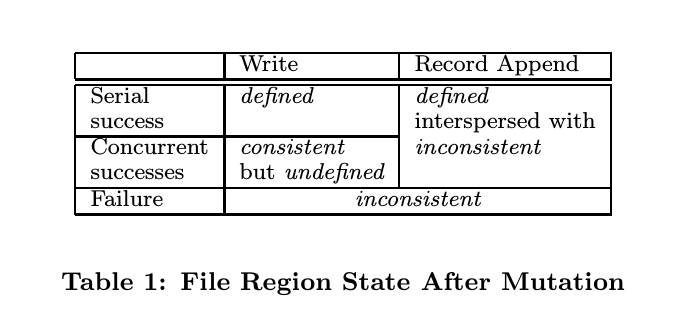
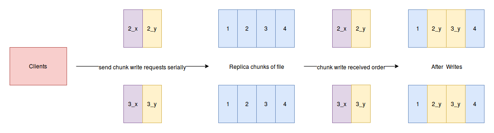
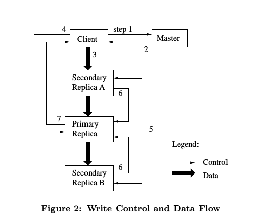

# The Gooogle File System

<!-- TOC -->

- [The Gooogle File System](#the-gooogle-file-system)
    - [Giới thiệu nội dung bài viết](#giới-thiệu-nội-dung-bài-viết)
    - [Phần 1. Giới thiệu](#phần-1-giới-thiệu)
    - [Phần2. Tổng quan về thiết kế của GFS](#phần2-tổng-quan-về-thiết-kế-của-gfs)
        - [2.1 Các giả thiết được sử dụng làm cơ sở để xây dựng GFS](#21-các-giả-thiết-được-sử-dụng-làm-cơ-sở-để-xây-dựng-gfs)
        - [2.2 Giao diện tương tác giữa các application Client với GFS](#22-giao-diện-tương-tác-giữa-các-application-client-với-gfs)
        - [2.3 Kiến trúc của GFS](#23-kiến-trúc-của-gfs)
        - [2.4 Master Node và thao tác đọc dữ liệu của Client application](#24-master-node-và-thao-tác-đọc-dữ-liệu-của-client-application)
        - [2.5 Chunk size](#25-chunk-size)
        - [2.6 Metadata](#26-metadata)
            - [2.6.1 Cấu trúc của các thông tin lưu trữ trong RAM của master node](#261-cấu-trúc-của-các-thông-tin-lưu-trữ-trong-ram-của-master-node)
            - [2.6.2 Vị trí của chunk](#262-vị-trí-của-chunk)
            - [2.6.3 Operation log](#263-operation-log)
        - [2.7 Mô hình consistency của GFS](#27-mô-hình-consistency-của-gfs)
            - [2.7.1 Cách thức đảm bảo tính tin cậy của dữ liệu của GFS](#271-cách-thức-đảm-bảo-tính-tin-cậy-của-dữ-liệu-của-gfs)
            - [2.7.2 Các điều chỉnh ở phía các ứng dụng Client](#272-các-điều-chỉnh-ở-phía-các-ứng-dụng-client)
    - [3 Các tương tác trong hệ thống GFS](#3-các-tương-tác-trong-hệ-thống-gfs)
        - [3.1 Leases và thứ tự thực hiện các thay đổi lên một file trong GFS](#31-leases-và-thứ-tự-thực-hiện-các-thay-đổi-lên-một-file-trong-gfs)
        - [3.2 Data Flow](#32-data-flow)
        - [3.3 Thao tác ghi record vào cuối file (append)](#33-thao-tác-ghi-record-vào-cuối-file-append)
        - [3.4 Snapshot](#34-snapshot)
    - [4. MASTER OPERATION](#4-master-operation)
        - [4.1 Quản lý namespace và locking](#41-quản-lý-namespace-và-locking)
        - [4.2 Replica Placement](#42-replica-placement)

<!-- /TOC -->

## Giới thiệu nội dung bài viết

Bài viết này giới thiệu về nền tảng lưu trữ của google, hệ thống Google File System. Google File System (GFS) là một hệ thống file lưu trữ phân tán - Distributed File System (DFS), được thiết kế và xây dựng để phục vụ một số lượng lớn các ứng dụng phân tán có cường độ trao đổi dữ liệu cao. GFS có tính chịu lỗi - fault tolerance ngay cả khi nó được triển khai trên môi trường phần cứng phổ thông, không chuyên dụnng, đồng thời, Hệ thống GFS cung cấp một hiệu năng tổng thể cao cho cho một lượng lớn các ứng dụng đóng vai trò client, sử dụng GFS để lưu trữ dữ liệu.

GFS được thiết kế với các mục đích giống với các hệ thống File System đã có trước đó, tuy nhiên, sự khác biệt của GFS so với các hệ thống cũ là ở chỗ, GFS được thiết kế dựa trên các đặc điểm hoạt động - trao đổi dữ liệu của các ứng dụng trong các hệ thống khác của Google có sử dụng GFS để lưu trữ dữ liệu. Bên cạnh đó, cơ sở thiết kế GFS cũng được dựa trên các đặc điểm của môi trường  công nghệ sẽ triển khai GFS của Google. Điều này có nghĩa rằng, GFS được thiết kế để phù hợp với môi trường hoạt động của Google, và được thiết kế nhằm phục vụ tốt nhất cho các ứng dụng của Google, chứ không phải nhằm hướng tới phục vụ cho mọi loại ứng dụng.

GFS được triển khai trên một quy mô lớn, phục vụ cho việc lưu trữ và xử lý dữ liệu của các Service trong hệ thống của Google. Bên cạnh đó, GFS cũng phục vụ cho các công việc nghiên cứu và phát triển các công nghệ có liên quan tới dữ liệu lớn. Cụm GFS cluster lớn nhất (tính tới thời điểm xuất bản bài báo) có kích thước hàng trăm terabyte, phân tán trên hàng ngàn ổ đĩa của hàng ngàn máy tính vật lý, và GFS cluster này có khả năng cùng một lúc cung cấp dịch vụ lưu trữ cho hàng trăm client, đáp ứng nhu cầu lưu trữ và xử lý dữ liệu của Google.

Bài viết này sẽ trình bày và thảo luận các khía cạnh khác nhau trong thiết kế của GFS, các tính năng mở rộng của GFS được thiết kế để phục vụ cho các ứng dụng phân tán. Sau đó, bài viết sẽ trình bày báo cáo về các đánh giá hiệu năng trên quy mô thử nghiệm - micro-benchmarks cũng như đánh giá hiệu năng trên môi trường sử dụng thực tế của Google.

## Phần 1. Giới thiệu

GFS được xây dựng để phục vụ nhu cầu lưu trữ và xử lý dữ liệu đang ngày càng gia tăng nhanh chóng của Google. Với mục đích này, GFS được thiết kế với các mục tiêu giống như các hệ thống Disttributed File System trước đó. Các mục tiêu mà GFS cần đạt được là hiệu năng, khả năng scaling, tính tin cậy, và tính sẵn sàng. Tuy nhiên, GFS được thiết kế để phục vụ cho Google, do đó GFS được thiết kế dựa trên cơ sở là các đặc điểm riêng của các ứng dụng Client trong hệ thống của Google, cũng như dựa trên các đặc điểm môi trường hệ thống phần cứng hiện có của Google. Chúng ta sẽ tìm hiểu chi tiết các đặc điểm riêng của các ứng dụng Client của Google là gì, để hiểu được tại sao những đặc điểm này lại tạo ra  những sự khác biệt giữa thiết kế của GFS với các hệ thống DFS trước đó.

Đầu tiên, thiết kế của GFS được dựa trên đặc điểm bất cứ thành phần nào ( kể cả phần cứng lẫn phần mềm) trong hệ thống GFS có thể xảy ra hỏng hóc, và sự hỏng hóc của các thành phần trong hệ thống được coi là một sự kiện thường xuyên xảy ra, và có thể xảy ra tại bất kỳ thời điểm nào, chứ không phải là một sự cố đặc biệt. GFS được thiết kế để triển khai trên môi trường phần cứng bao gồm hàng nghìn máy tính vật lý được dùng để lưu trữ dữ liệu. Các máy tính này có cấu hình phần cứng phổ thông, do đó chúng ta khồng đảm bảo về chất lượng của phần cứng các máy tính này. Điều này dẫn tới việc một số phần cứng, phần mềm trên các máy tính này có thể xảy ra sự cố và hỏng hóc. Và khi sự cố xảy ra, những dữ liệu lưu trữ trên các máy tính bị hỏng sẽ có khả năng bị mất và không thể phục hồi được. Các lỗi phần cứng, phần mềm trên các máy tính của hệ thống có thể xảy ra do nhiều nguồn khác nhau gây ra như: Bug của phần mềm, hệ điều hành gặp sự cố, lỗi do con người gây ra, lỗi ổ đĩa cứng, lỗi RAM, lỗi mạng và lỗi do hệ thống điện. Để giải quyết vấn đề các thành phần trên hệ thống gặp sự cố, hệ thống GFS phải xây dựng và tích hợp các cơ chế kiểm soát, theo dõi toàn bộ các thành phần trong hệ thống, cơ chế phát hiện lỗi, cơ chế chống lỗi, cũng như cơ chế phục hồi các thành phần bị lỗi khi sự cố xảy ra.

Thứ hai, đa số các file được lưu trữ và xử lý trong hệ thống GFS có đặc điểm là có kích thước rất lớn, lên tới kích cỡ hàng GB. Mỗi một file có nội dung bao gồm rất nhiều các object của các ứng dụng, ví dụ như một file dữ liệu có thể chứa tới hàng nghìn các trang web. Lý do để gom hàng nghìn object vào một file như vậy, là vì khi làm việc với hàng tỉ object có kích thước hàng nghìn TB như vậy, việc lưu trữ mỗi một object vào một file làm giảm hiệu năng của hệ thống, vì quá trình quản lý cũng như băng thông I/O của hệ thống có hàng tỉ file có kích thước nhỏ là chậm và không hiệu quả bằng một hệ thống có các file có kích thước lớn và số lượng file nhỏ.

Thứ ba, nội dung của đa số các file trong hệ thống GFS được thay đổi bằng cách chèn thêm dữ liệu mới (append) thay vì ghi đè (overwriting) dữ liệu cũ. Việc thay đổi file bằng cách ghi ngẫu nhiên là hầu như không xảy ra. Đồng thời, hoạt động chủ yếu của hệ thống khi tương tác với các file là hoạt động đọc dữ liệu của file, và hầu hết các Client khi đọc các file lưu trữ trong GFS đều đọc theo kiểu đọc tuần tự - sequentially read. GFS có đặc điểm trên, là do nhiều ứng dụng xử lý dữ liệu của Google đọc dữ liệu bằng cách quét tuần tự qua một file. Đồng thời, rất nhiều file trong hệ thống của Google được tạo ra bằng cách streamming dữ liệu, ví dụ như truyền video, hay crawl web,... Một số lượng lớn dữ liệu tồn tại dưới dạng file nén, một số file là kết quả của việc nhiều máy tính cùng ghi dữ liệu vào file đó một lúc, hoặc được ghi vào trong nhiều thời điểm khác nhau. Với các đặc điểm về phương thức tương tác, sử dụng các file trong hệ thống GFS của các ứng dụng Client trong hệ thống Google như vậy, cùng với việc các file trong GFS thường có kích thước rất lớn, thì việc thiết kế hệ thống sẽ tập trung vào thao tác nạp thêm dữ liệu vào file (data append) cho phép hệ thống đạt được hiện năng tối ưu, cũng như đảm bảo tính toàn vẹn (atomicity) của record dữ liệu được append vào. Đồng thời, việc sử dụng thao tác append để thêm dữ liệu vào một file cho phép chúng ta không cần thiết kế các bộ đệm dữ liệu ở phía Client nữa.

Thứ tư, song song với việc GFS được thiết kế để phục vụ tốt nhất cho các ứng dụng của Google, thì Google cũng thiết kế các thư viện, API riêng cho các ứng dụng Client, để hỗ trợ các ứng dụng Client này có thể tương tác, trao đổi dữ liệu với GFS một cách hiệu quả, đồng thời tăng tính mềm dẻo của toàn bộ hệ thống (bao gồm cả GFS lẫn các Client application). Bên cạnh đó, việc GFS sử dụng mô hình nhất quán có tính mềm dẻo là relaxed consistency model (sẽ được trình bày ở phần 2.7) cho phép chúng ta đơn giản hóa thiết kế của hệ thống GFS mà không làm phần xử lý bên phía Client phức tạp lên, nhưng vẫn đảm bảo dữ liệu của chúng ta có mức độ nhất quán phù hợp với yêu cầu của ứng dụng Client. Bên cạnh đó, so với các hệ thống file trước kia, GFS có thêm một thao tác thay đổi dữ liệu mới, đó là thao tác record append. Với thao tác này, GFS cho phép nhiều ứng dụng có thể chèn thêm các record dữ liệu vào cùng một file đồng thời với nhau mà không cần phải thực hiện thêm việc đồng bộ hóa giữa các ứng dụng này. Thao tác data append trong GFS sẽ còn được thảo luận thêm trong phần sau của bài viết.

Hàng loạt GFS cluster đã được triển khai để phục vụ các mục đích khác nhau của Google. GFS cluster lớn nhất có hơn 1000 node, chứa 300 TB dữ liệu và phục vụ cho hàng trăm ứng dụng client cùng một lúc.

## Phần2. Tổng quan về thiết kế của GFS

### 2.1 Các giả thiết được sử dụng làm cơ sở để xây dựng GFS

 Để thực hiện việc thiết kế hệ thống GFS, các nhà phát triển của Google đã đặt ra một số giả thiết làm điều kiện tiền đề cho hệ thống. Các giả thiết này được đặt ra dựa trên những đặc điểm về ứng dụng sử dụng cũng như các đặc điểm về hệ thống phần cứng triển khai GFS mà chúng ta đã nêu ra ở phần giới thiệu. Sự có mặt của các giả thiết này vừa đặt ra những thách thức, vừa đem tới các yếu tố thuận lợi cho việc thiết kế GFS. Các giả thiết ở đây là:

- GFS được triển khai trên môi trường hệ thống được xây dựng từ các thành phần phần cứng phổ thông, vì vậy các thành phần trong hệ thống có thể thường xuyên xảy ra lỗi. GFS phải có khả năng thao dõi và phát hiện ra các thành phần nào trong hệ thống đang gặp lỗi, đồng thời GFS vẫn phải có khả năng hoạt động bình thường ngay cả khi một số hoạt động đang gặp lỗi, và sau khi phát hiển ra các thành phần lỗi GFS phải nhanh chóng phục hồi các dữ liệu đã bị mất trên các thành phần này.
- Phần lớn các file được lưu trữ và xử lý bởi GFS là các file có kích thước lớn. Số lượng file được lưu trữ trong hệ thống là khoảng vài triệu file, với kích thước của một file thường lớn hơn 100 MB. Do số lượng các file có kích cỡ hàng GB trong hệ thống GFS là lớn, do đó chúng ta có thể thấy GFS sẽ cần tập trung để tối ưu hóa cho việc quản lý, truy cập và xử lý các file có kích thước lớn. Bên cạnh đó, GFS vẫn cho phép các client application làm việc với các file có kích thước nhỏ, tuy nhiên hệ thống GFS sẽ không tối ưu cho các file có kích thước nhỏ này.
- Khối lượng công việc (workload) mà các Client application đặt lên hệ thống lưu trữ GFS do chủ yếu 2 thao tác sau gây ra: Streaming read - đọc theo luồng và random read - đọc ngẫu nhiên. Thao tác streaming read được sử dụng để đọc một lượng nhỏ dữ liệu một lần (vài trăm KB - 1MB), nhưng số lần đọc là rất lớn, và dữ liệu ở các lần đọc liên tiếp nhau cũng nằm liên tiếp nhau ( do vậy thao tác đọc này được gọi là streaming). Thao tác random read thường đọc một lượng nhỏ dữ liệu ở một vị trí nào đó trong file. Các ứng dụng cần có hiệu năng trao đổi dữ liệu cao thường gom nhóm các yêu cầu đọc của nó vào và sắp xếp các yêu cầu đọc đó theo thứ tự rồi mới gửi lần lượt các yêu cầu đọc tới GFS, việc này giúp thao tác đọc dữ liệu của ứng dụng đó diễn ra theo cách tuần tự - sequential read, qua đó giúp hiệu năng của thao tác đọc dữ liệu qua GFS tăng lên.
- Bên cạnh 2 thao tác đọc trên, các ứng dụng client cũng trao đổi một khối lượng lớn dữ liệu với GFS thông qua một lượng lớn các thao tác write-append. Điểm đặc biệt của thao tác write-append là thao tác này nạp dữ liệu vào cuối của file, chứ không phải là ghi đè dữ liệu vào một offset trước đó của file. Kích thước dữ liệu mà mỗi thao tác write-append ghi thêm vào cuối file tương tự như kích thước dữ liệu mà thao tác streaming read đọc được mỗi lần (vài trăm KB - 1 MB). Thao tác ghi dữ liệu vào một vị trí trong file (write) vẫn được được GFS hỗ trợ, tuy nhiên GFS sẽ không tối ưu hiệu năng cho thao tác này.
- Hệ thống GFS cần xây dựng cơ chế cho phép một số lượng lớn các client có thể đồng thời (concurrently) thực hiện thao tác write-append vào cùng một file với nhau. Yêu cầu này được đặt ra,vì trong qúa trình sử dụng thực tế, trong hệ thống Google, sẽ thường xuyên xảy ra trường hợp có hàng trăm client cùng 1 lúc thực hiện thao tác write-append vào một file trong GFS. Bên cạnh việc cho phép các thao tác trên được thực hiện đồng thời, chúng ta vẫn cần đảm bảo các thao tác write-append này được đồng bộ hóa với nhau,vơi điều kiện là khi thực hiện việc đồng bộ các thao tác append, sự quá tải gây ra trên hệ thống là nhỏ nhất.
- Trong hệ thống sử dụng GFS, hệ thống mạng sẽ ưu tiên tối ưu sao cho băng thông của mạng cao, hơn là tạo ra độ trễ thấp, vì đa số các ứng dụng sử dụng GFS cần tốc độ xử lý - truyền tải dữ liệu cao (cần có băng thông cao) hơn là thời gian phản hồi của GFS cho một yêu cầu đọc/ghi thấp (cần có độ trễ thấp).

### 2.2 Giao diện tương tác giữa các application Client với GFS

GFS cung cấp một giao diện tương tác thân thiện cho các ứng dụng Client, cho dù giao diện này không được xây dựng theo một chuẩn API thông thường như POSIX. Các quy định được đặt ra trong giao diện mà GFS cung cấp cho các Client là: Các file trong hệ thống GFS được tổ chức theo thư mục phân cấp, và được định danh bằng đường dẫn tuyệt đối tới file đó. GFS hỗ trợ đầy đủ các thao tác tương tác với file thông thường như: Tạo mới file, xóa bỏ file, mở/đóng file và đọc/ghi file.

Bên cạnh các thao tác thông thường trên, GFS cung cấp thêm 2 thao tác: tạo snapshot cho file và thao tác record-append. Thao tác snapshot tạo ra một bản sao cho một file hoặc một thư mục trong GFS với chi phí nhỏ nhất. Thao tác record-append cho phép  hàng loạt các client đồng thời append dữ liệu vào một file cùng 1 lúc, trong khi vẫn đảm bảo tính toàn vẹn (atomicity) của từng thao tác chèn dữ liệu riêng lẻ của từng client. Thao tác record-append đặc biệt rất có ích trong trường hợp nhiều ứng dụng client muốn tổng hợp kết quả với nhau trong một file, hoặc trong trường hợp chúng ta cần xây dựng một hệ thống producer-consumer bằng file trong GFS, vì GFS cho phép nhiều Client thực hiện thao tác appeng đồng thời vào cùng một file mà không cần sử dụng các cơ chế đồng bộ phức tạp và tốn kém như locking. Thao tác snapshot và record-append sẽ được thảo luận thêm trong phần 3.4 và 3.3

### 2.3 Kiến trúc của GFS

Một GFS cluster được thiết kế bao gồm một master node và một số lượng lớn các chunkserver, và được truy cập, sử dụng bởi rất nhiều client cùng một lúc. Hệ điều hành được sử dụng trên các Master node cũng như các chunkserverlà Linux,và các tiến trình cần thiết để tạo ra GFS cũng như các Client application sử dụng GFS cũng là các Linux process. Do đó chúng ta có thể có một máy vật lý đồng thời chạy cả chunkserver và Client application cùng một lúc, nếu chúng ta có thể chấp nhận rằng các máy vật lý này sẽ chia sẻ tài nguyên cho nhiều process, cũng như độ tin cậy giảm xuống.

Một file trong GFS được chia ra thành nhiều chunks. Chunk có kích thước cố định, và mỗi một chunk trong GFS là một đơn vị lưu trữ. Một chunk được định danh bởi một ID có độ dài 64 bit có tính chất bất biến cũng như có tính toàn cục, tức là trong toàn bộ GFS cluster ID này chỉ đại diện duy nhất cho một chunk xác định. ID của chunk được gọi là **chunk handle**, nó được gán cho chunk tại thời điểm tạo ra chunk đó. Các chunkserver sẽ lưu trữ các chunk trong các ổ đĩa cứng cục bộ - local disk như là một file thông thường trong hệ điều hành Linux,  và thao tác đọc/ghi trên chunk được ánh xạ tới các thao tác đọc/ghi trên các file này.Một thao tác đọc/ghi trên GFS cần xác định 2 thành phần sau: **chunk handle** - xác định chunk nào trên GFS sẽ được thao tác đó tương tác, và byte range - xác đinh khoảng dữ liệu nào trên chunk sẽ được tương tác. Để đảm bảo độ tin cậy và khả năng chống lỗi, một chunk trên hệ thống sẽ được sao lưu thành 3 bản sao (replica) lưu trữ trên 3 chunkserver khác nhau. Bên cạnh đó, user cũng có thể thiết lập số lượng bản sao khác nhau cho từng file.

Master node là nơi lưu trữ tất cả các thông tin metadata của một GFS cluster. Các metadata của một GFS Cluster được lưu trữ trên Master node bao gồm các namespace, thông tin về quyền truy cập tới các file trong GFS của các Client và bảng ánh xạ giữa file - chunks (xác định chunk handle của một chunk trong một file trong GFS) và vị trí của các chunk trên hệ thống ( một chunk có _chunk handle_ là **x** nằm ở chunkserver nào trên hệ thống ?). Bên cạnh đó, master node quản lý các thao tác đồng bộ hóa và quản lý hệ thống như quản lý **chunk lease** (khái niệm và vai trò, nhiệm vụ của chunk lease sẽ được trình bày ở phần sau), thao tác thu gom các chunk lỗi và thao tác đồng bộ hóa và di chuyển dữ liệu giữa các chunk servers. Master node kết nối với các chunkserver thông qua **HeartBeat** message, các message này được dùng để điều khiển các chunkserver cũng như thu thập trạng thái hiện tại của các chunkserver trong cluster.

GFS Client application sẽ sử dụng các thư viện, API mà Google cung cấp để kết nối tới master node và các chunkserver để đọc/ghi dữ liệu trên các file nằm trogn GFS. Client kết nối tới master node để truy cập vào metadata của các file, tuy nhiên các tương tác với dữ liệu với các file trên GFS được Client thực hiện trực tiếp với Chunkserver (mà không cần đi qua master node).

Client và chunkserver đều không cache lại dữ liệu của file. Client cache không có nhiều tác dụng, lý do là vì kích thước các file mà client tương tác thường là rất lớn, đồng thời working set của các clien application lớn, không thể chứa vừa trong cache. Việc không cache lại dữ liệu trên Client cho phép chúng ta đơn giản hóa thiết kế của client application, cũng như tránh khỏi các vấn đề liên quan tới việc cache dữ liệu .Tuy nhiên, khi client tương tác với master node, metadata của các file sẽ được cache lại client.  Còn lý do các chunkserver không cache lại các file, là do thực chất các chunk chính là các local file trên các chunkserver, do đó khi client tương tác với các file, hệ thống Linux của chunkserver đã tự động thực hiện việc tạo ra cache lưu trữ các file được thường xuyên truy cập trên bộ nhớ chính.

### 2.4 Master Node và thao tác đọc dữ liệu của Client application

Một GFS Cluser được thiết kế với chỉ một master node duy nhất trong toàn bộ Cluster đó. Lý do chỉ có 1 master node trong cluster, đó là khi chỉ có một master node, thì thiết kế hệ thống sẽ đơn giản, vì chỉ có một node duy nhất chứa các thông tin toàn cục của hệ thống, để master node có thể thực hiện các công việc đồng bộ và sao lưu dữ liệu dễ dàng hơn. Tuy nhiên, với việc chỉ có một master node trong cluster, chúng ta phải tối ưu hóa hiệu suất của master node, để node này không trở thành bottleneck trên hệ thống. Client sẽ không đọc/ghi dữ liệu của file thông qua master node. Thay vào đó, client sẽ chỉ yêu cầu master node cung cấp metadata của file, qua đó biết được file/chunk mà nó muốn tương tác đang nằm ở chunkserver nào. Sau đó vị trí của chunk/file sẽ được client cache lại trong một khoảng thời gian nhỏ, và client sử dụng thông tin này để tương tác trực tiếp với các chunkserver trong các hoạt động tiếp theo của quá trình client đọc ghi dữ liệu trên GFS mà không cần tương tác với master node nữa.

Quá trình client đọc dữ liệu từ một chunk trên một file được mô tả cụ thể theo sơ đồ sau:

Đầu tiên, do một chunk có kích thước xác định (64MB), Client sẽ tính toán ra tại 1 offset xác định trong file sẽ nằm trong chunk thứ mấy - chunk index của file(một file được ánh xạ thành một danh sách các chunk trên GFS). Sau đó, client gửi lên master node một request yêu cầu phân giải địa chỉ của chunk, với tham số đầu vào chứa bên trong request là tên file và chunkindex. Master node  phản hồi client với dữ liệu trả về là ChunkID - **x** của chunk mà người dùng muốn truy cập và chunk location - Địa chỉ của các chunkserver chứa các bản sao -replica của chunk có ChunkID là **x** này (vì như đã nói ở phần trước, một chunk trên hệ thống GFS được lưu trữ dưới dạng nhiều bản sao - replica trên các chunkserver khác nhai). Client cache lại thông tin địa chỉ của các replica này, và sử dụng chunkindex như là key để truy cập.

Sau đó, client lựa chọn một trong số các chunkserver chứa replica của x - thường là chunkserver gần với client nhất, rồi gửi tới chunkserver được chọn yêu cầu tương tác (đọc nội dung) với chunk x, với tham số truyền vào là **chunk handle** của x và **byte range** - Khoảng vị trí trong chunk mà Client muốn đọc (điều này có nghĩa là Client không muốn chunk server gửi về toàn bộ nội dung của chunk, mà chỉ gửi về một phần nội dung của chunk - xác định bởi **byte range**. Trong các request đọc tới chunk x tiếp theo. client có thể tiếp tục sử dụng thông tin của x đã được cache lại để tiếp tục truy cập cho tới khi cache bị hết hạn - expired hoặc file bị mở lại. Trong thực tế, client thường yêu cầu master node gửi lại địa chỉ của một loạt các chunk trong cùng 1 request.

### 2.5 Chunk size

Một trong những thông số quan trọng nhất cần xác định trong quá trình thiết kế GFS là kích thước của một chunk. Google chọn kích thước của một chunk là 64 MB, lớn hơn nhiều kích thước thông thường của một block - cluster trong các hệ thống File System khác. Trên các chunkserver, một replica của một chunk trên thực tế là một file trên hệ thống file Linux,và các chunk có kích thước không đủ 64MB (các chunk nằm ở cuối file) sẽ chỉ tăng kích thước khi Client nạp thêm dữ liệu vào file đó. Việc chỉ mở rộng chunk cuối cùng của file khi client nạp thêm dữ liệu mà không giữ cố định kích thước 64 MB của chunk cho phép hệ thống tránh được lãng phí, vì khi sử dụng kích thước cố định cho toàn bộ các chunk trong file, thì có một phần bộ nhớ trong file cuối cùng sẽ không chứa thông tin gì, dẫn tới lãng phí bộ nhớ của chunk server.

Kích thước lớn của một chunk mang lại nhiều lợi ích quan trọng cho GFS: Vì chunk có kích thước lớn, nên một chunk có thể chứa được nhiều dữ liệu, do đó giảm số lần tương tác giữa Client với master node. Ví dụ nếu chunk có kích thước là 16 MB, và các dữ liệu mà Client cần đọc nằm ở 4 chunk liên tiếp nhau, thì Client sẽ phải gửi lên master node request 4 yêu cầu phân giải địa chỉ của 4 chunk đó. Nhưng nếu như chúng ta sử dụng chunk có kích thước là 64MB, thì các dữ liệu mà Client muốn đọc sẽ nằm gọn trong 1 chunk, và Client sẽ chỉ cần gửi 1 yêu cầu phân giải tới master node. Hơn thế nữa, do đặc điểm đọc/ghi đữ liệu của các Client sử dụng GFS là thường đọc ghi một lượng lớn dữ liệu tuần tự, nên chunk càng có kích thước lớn sẽ càng cải thiện hiệu năng đọc ghi cho ứng dụng Client. Một ưu điểm nữa của chunk có kích thước lớn, đó là do chunk có kích thước lớn, và Client thường đọc các khối dữ liệu liên tiếp nhau, nên nếu chunk có kích thước lớn, thì Client thường chỉ phải tương tác dữ liệu với một chunk xác định trên một chunkserver, vị vậy chúng ta có thể giữ kết nối TCP từ Client tới chunkserver cố định và không cần thay đổi trong một khoảng thời gian dài. Khi kết nối TCP giữa Client và chunkserver được giữ cố đinh, chúng ta có thể giảm đi nhiều lượng tương tác cần thực hiện giữa Client và chunkserver, cũng như làm giảm khối lượng dữ liệu cần di chuyển qua hệ thống mạng, nên hệ thống mạng sẽ được giảm tải. Ưu điểm thứ 3 của chunk có kích thước lớn, đó là khi một chunk có kích thước lớn, thì số lượng chunk cần có cho một file trong GFS là nhỏ, nên số lượng metadata cần cho các file lưu trữ trên master node sẽ giảm đi, vì mỗi một chunk cần có một metadata tương ứng để phân giải tên cho chunk đó. Khi số lượng metadata cần có giảm xuống, thì kích thước dữ liệu metadata trên master node sẽ có kích thước nhỏ vừa phải để cho phép chúng ta có thể lưu trữ trực tiếp lượng metadata này trên RAM, qua đó tăng hiệu năng của master node lên đáng kể.

Tuy nhiên, bên cạnh các ưu điểm trên, kích thước lớn của chunk cũng có một nhược điểm. Đó là do kích thước chunk lớn, do đó các file nhỏ sẽ có ít chunks, do đó nội dung của file này chỉ được phân bố trên một số lượng nhỏ chunkserver. Nếu các file này có nhu cầu truy cập lớn từ các Client, thì các chunkserver chứa các chunk của file này sẽ có khả năng bị quá tải. Tuy nhiên, nhược điểm này không phải là vấn đề quá nghiêm trọng, do đa số các Client thường làm việc với các file có kích thước lớn theo phương thức đọc tuần tự - sequentialy read, và nhu cầu của các Client với các file có kích thước nhỏ thường là thấp.

Tuy nhiên, nhược điểm nêu trên vẫn có khả năng xảy ra đối với một số file đặc biệt, ví dụ như file của hệ thống batch-queue system. File này có kích thước nhỏ, chỉ được chứa trong một chunk, tuy nhiên lại được hàng trăm client sử dụng đồng thời, do đó các chunkserver chứa replica của file này có thể bị quá tải. Để giải quyết vấn đề này, chúng ta có thể tăng hệ số sao chép replica của file này lên, giúp cho nội dung của file này được lưu trữ trên nhiều chunkserver hơn, để phân tán tải lên các chunkserver. Một giải pháp khác, đó là cho phép một Client có thể đọc dữ liệu của file từ một Client khác có nội dung file này, mà không thông qua chunkserver.

### 2.6 Metadata

Thông tin được lưu trữ Master node gồm 3 thành phần chính sau: namespace của các file và các chunk trong GFS, ánh xạ giữa file - chunk và địa chỉ vật lý của từng replica của một chunk (chỉ ra các replica của một chunk đang nằm trên các chunkserver nào). Trong ba thành phần trên thì hai thành phần: Namespace của các file và các chunk trong GFS, ánh xạ giữa file - chunk được lưu trữ trong  **operation log**. Operation log là một file lưu lại các thay đổi đã xảy ra trên file namespace, chunk namespace và ánh xạ file - chunk. Khi Client thực hiện một thay đổi nào đó tới một trong các thành phần trên, một **logging mutation** sinh ra và được lưu vào **operation log**. Để đề phòng trường hợp mất mát thông tin khi master node xảy ra sự cố, **operation log** được lưu trữ trên master node và trên một số máy server khác - được gọi là các **shadow master**. Bằng cách sử dụng file log để lưu trữ thông tin, chúng ta có thể cập nhật trạng thái master node đơn giản, tin cậy, hiệu quả và phòng tránh được nguy cơ thông tin lưu trữ trên master node mất tính nhất quán, tức là kể cả khi master node gặp sự cố thì thông tin của master node vẫn an toàn, do các thông tin này được backup được dự phòng trên các shadow master.

Master node không lưu trữ thông tin về địa chỉ vật lý của các replica của một chunk. Thông tin về địa chỉ của các replica của một chunk được các chunkserver đẩy lên master node tại thời điểm master node bắt đầu khởi động, và tại thời điểm một chunkserver mới gia nhập vào GFS cluster.

#### 2.6.1 Cấu trúc của các thông tin lưu trữ trong RAM của master node

Các thông tin nằm trên master node được lưu trữ trên bộ nhớ RAM giúp cho các thao tác của master node được thực hiện một cách nhanh chóng, đồng thời điều này cho phép master node thực hiện thao tác kiểm tra định kỳ toàn bộ trạng thái của các thông tin này, cũng như trạng thái của bản thân master node một cách dễ dàng. Các công việc được master node thực hiện khi thao tác kiểm tra định kỳ được khởi động, đó là thực hiện việc thu gom các chunk nằm trong garbage, tạo ra các bản sao khác cho một chunk trên một chunkserver, trong trường hợp một chunkserver nào đó chứa một replica của chunk đó bị lỗi, và thực hiện việc di chuyển một số replica của một chunk từ chunkserver này sang chunkserver khác để cân bằng tải và cân bằng dữ liệu lưu trữ giữa các chunk server trên Cluster, trong trường hợp một số chunkserver trên cluster chứa quá nhiều chunk replica, trong khi đó một số chunkserver khác lại chứa quá ít chunkserver. Các thao tác vừa được nêu ra sẽ được thảo luận chi tiết tại các phần 4.3 và 4.4

Khi chúng ta sử dụng phương thức lưu trữ thông tin của master node trên RAM, một vấn đề quan trọng mà chúng ta cần lưu ý, đó là bộ nhớ RAM của master node có đủ lớn để lưu trữ tất cả các thông tin metadata của các chunk hay không. Kích thước lớn của chunk cho phép ta chỉ cần một lượng nhỏ thông tin metadata để quản lý một lượng lớn dữ liệu lưu trên các chunk. Trong thực tế, chúng ta cần sử dụng 64 byte để quản lý metadata của một chunk, do đó khi chunk có kích thước 64 MB, có nghĩa là chúng ta chỉ cần 64 byte trên master node để quản lý 64MB dữ liệu. Vì vậy, bộ nhớ RAM của master node vẫn đủ kích thước để chứa tất cả mọi thông tin cần lưu trữ trên master node, và trên thực tế, đây không phải là là vấn đề quá lớn trong GFS. Bên cạnh metadata của các chunk, thì một thông tin khác mà chúng ta cần lưu trữ, đó là file namespace. Tương tự chunk, kích thước bộ nhớ mà chúng ta cần sử dụng để lưu trữ file namespace là nhỏ, do chúng ta chỉ cần ít hơn 64 byte để lưu trữ thông tin của một file trong namespace, vì trong hệ thống GFS, chúng ta có thể nén phần đầu của tên một file.

Trong trường hợp hệ thống GFS cần mở rộng, thì chi phí cần thiết để mở rộng bộ nhớ RAM của master node vẫn là rất nhỏ so với các lợi ích mang lại khi chúng ta sử dụng RAM để lưu trữ thông tin metadata trên master node.

#### 2.6.2 Vị trí của chunk

Master node không lưu trữ cố định thông tin về vị trí của các chunk - thông tin chỉ ra các chunkserver nào đang lưu trữ các replica của một chunk có chunk handle (ID) là **x**. Thay vào đó, thông tin này sẽ được các chunkserver gửi lên master node trong lúc các node trên cluster khởi động. Sau đó, trong quá trình cluster hoạt động, master node có thể tự động cập nhật thông tin về vị trí của các chunk, vì master node là nơi duy nhất trong cluster quản lý và thực hiện các hoạt động như: xếp chỗ cho các chunk mới (xác định các chunkserver nào sẽ chứa các replica của một chunk mới, theo dõi trạng thái của các chunkserver... Master node quản lý các chunk thông qua việc tương tác với các chunkserver bằng **HeartBeat** message.

Vào thời điểm bắt đầu thiết kế GFS, các nhà thiết kế đã từng thử phương án đặt thông tin về vị trí của chunk cố định trên master node. Tuy nhiên, trong quá trình thử nghiệm sau đó, các nhà thiết kế đã nhận ra rằng, thông tin về vị trí của chunk có thể được duy trì và cập nhật dễ dàng hơn trên master node thông qua phương thức sau: Tại thời điểm cluster khởi động, Master node khởi tạo thông tin về vị trí của chunk bằng cách gửi request tới các chunkserver, sau đó trong quá trình cluster hoạt động, master node định kỳ gửi request xuống các chunkserver để cập nhật vị trí của các chunk. Phương thức này cho phép xử lý vấn đề đồng bộ thông tin giữa master và các chunkserver hiệu quả, đặc biệt trong các trường hợp chunkserver gia nhập hoặc rời khỏi cluster, tên folder/file thay đổi, chunkserver gặp lỗi hoặc khởi động lại,... Trong một cluster có hàng trăm server, các sự kiện này thường xuyên xảy ra.

Một lý do khác để Google quyết định sử dụng phương thức đã trình bày để lưu trữ và cập nhật thông tin về vị trí của các chunk trong GFS, đó là chỉ có chunkserver mới có thể biết rõ nhất chunkserver đó đang giữ các chunk nào trong hệ thống. Thông tin về vị trí của một chunk trên hệ thống GFS không có tính chất cố định, bất biến, do các sự cố trên hệ thống xảy ra có thể làm thay đổi thông tin này bất kỳ lúc nào. Ví dụ, như tại một thời điểm xác định, chúng ta có thể có được thông tin chunk **k** có replica nằm trên các server **c1**, **c2**, **c3**. Nhưng sau đó một thời gian, chunkserver **c2** bị hỏng 1 ổ cứng, và ổ cứng đó chứa replica của **k**, lúc này thông tin về vị trí của **k** bị thay đổi, trở thành: **k** có 2 replica nằm trên các server **c1** và **c3**. Sự thay đổi thường xuyên của thông tin này chính là lý do mà việc lưu trữ cố định thông tin này trên master node là không hiệu quả trên thực tế.

#### 2.6.3 Operation log

Operation log là thành phần lưu trữ các bản ghi lịch sử ghi lại các thay đổi của metadata trên cluster. Operation log là một trong các thành phần trung tâm trong GFS, nó không chỉ là nơi lưu trữ các thông tin metadata của GFS, mà còn là thành phần đóng vai trò như một đồng hồ logic (logical time line) xác đinh thứ tự thực thi các thao tác xảy ra đồng thời (concurrent operations) trong hệ thống. Nhờ có đồng hồ logic này, mà các file, chunk và version của chúng, có tính duy nhất trong toàn bộ Cluster, tính duy nhất này được xác định bằng thời điểm logic mà chúng được tạo ra. Phần 4.5 sẽ trình bày chi tiết về các nội dung này.

Vì operation log có vai trò quan trọng với hoạt động trong GFS cluster, nên chúng ta phải duy trì tính tin cậy và đúng đắn của operation log bằng cách không cho phép Client application nhìn thấy được các thay đổi của các thông tin metadata, cho tới khi các thay đổi này được thực hiện xong và đã được lưu vào operation log. Bên cạnh đó, chúng ta cần sao lưu operation log sang các máy khác (remote machine), để đảm bảo thông tin lưu trữ trong operation log được an toàn ngay cả trong trường hợp master node gặp sự cố. Để đảm bảo tính đúng đắn của thông tin trong operation log, chúng ta cần đảm bảo rằng, hệ thống chỉ phản hồi cho client biết được một thao tác mà client vừa thực hiện có thành công hay không, sau khi mọi thay đổi trên các thông tin metadata (tạo ra khi thao tác của của client được thực thi) đã được lưu lại trên operation log của master node và trên operation log của các máy giữ bản sao.

Trong trường hợp master node gặp sự cố (ví dụ như mất điện), thì sau khi khởi động lại, nó có thể phục hồi lại thông tin metadata của file system của hệ thống bằng cách duyệt lại operation log. Để tổi thiểu hóa thời gian duyệt lại operation log, chúng ta cần đảm bảo kích thước của các log được lưu trong operation log là nhỏ.  Master node sẽ tạo ra checkpoint trên operation log bất cứ khi nào operation log mở rộng tới một kích thước xác định. Khi đã có các checkpoint, thì khi master node muốn phục hồi lại metadata, nó chỉ cần nap lại checkpoint cuối cùng mà nó tạo ra trong operation log, rồi replay lại các log được lưu lại sau checkpoint lên checkpoint đó là sẽ có được metadata mới nhất của hệ thống. Chúng ta có được điều này, vì bản thân một checkpoint là một bản sao của metadata của hệ thống tại thời điểm checkpoint đó được tạo ra. Việc replay lại các thay đổi lưu trên log được hiểu như là việc áp dụng các thay đổi đó lên checkpoint mới nhất để tạo ra trạng thái hiện tại của hệ thống.

Checkpoint trong operation log được tạo ra dưới dạng một B-tree, đo đó chúng ta có thể ánh xạ trực tiếp checkpoint này vào bộ nhớ và sử dụng nó để tìm kiếm tên, định danh của file/chunk trong các namespace mà không cần làm thêm các thao tác phân tích (parsing). Tính chất này giúp cho GFS có thể thực hiện quá trình phục hồi hệ thống nhanh chóng, đồng thời cải thiện tính sẵn sàng của hệ thống.

Vì thao tác xây dựng một check point có thể tốn một thời gian khá lớn, do đó master node cần có phương thức xây dựng checkpoint sao cho thao tác xây dựng một checkpoint không làm ảnh hưởng tới các hoạt động khác của hệ thống, tức là trong khi một checkpoint mới được xây dựng, thì hệ thống vẫn có thể tiếp nhận các request và thực hiện các thay đổi lên metadata. Để làm được điều này, phương thức được sử dụng trong GFS, đó là chúng ta sẽ copy các log file và tạo checkpoint trong một tiến trình độc lập. Checkpoint được tạo ra sẽ chứa tất cả các thay đổi trước thời điểm nó được tạo ra. Một checkpoint trong một cluster có khoảng vài triệu file sẽ được tạo ra trong khoảng một phút. Sau khi checkpoint mới được tạo ra, nó sẽ được ghi lên đĩa của master node và copy sang các máy remote.

Thao tác phục hồi metadata của hệ thống chỉ cần 2 thông tin để thực hiện, đó là checkpoint cuối cùng được ghi lại và các log file được tạo ra sau checkpoint đó. Các checkpoint và log file cũ hơn checkpoint cuối cùng hoàn toàn có thể được xóa bỏ khỏi hệ thống, mặc dù chúng ta có thể giữ lại một số thành phần để đảm bảo tính toàn vẹn của hệ thống. Nếu quá trình checkpoint gặp sự cố, quá trình phục hồi của hệ thống vẫn có thể được thực hiện, vì thao tác recovery có thể phát hiện ra checkpoint bị lỗi và loại bỏ nó và sử dụng một checkpoint cũ hơn để thực hiện quá trình phục hồi.

### 2.7 Mô hình consistency của GFS

Như các hệ thống phân tán khác, GFS cũng xây dựng một mô hình đảm bảo tính nhất quán của dữ liệu - data consistency model. Mô hình consistency của GFS có tính đơn giản và hiệu quả, trong điều kiện mức độ phân tán cao của GFS. Trong phần này, chúng ta sẽ thảo luận cách mà GFS đảm bảo tính nhất quán của dữ liệu trong hệ thống, và ý nghĩa của tính nhất quán của dữ liệu đối với các ứng dụng trong GFS. Tuy nhiên chi tiết về cách mà GFS thực hiện việc này sẽ được nói tới ở các phần sau của bài viết.

Trước hết, chúng ta sẽ làm rõ về mô hình consistency mà GFS sử dụng, mô hình **relax consistency**.

Mô hình nhất quán (consistency model) trong một hệ thống phân tán là tập hợp các cơ chế, phương thức được sử dụng để duy trì tính nhất quán của hệ thống phân tán đó. Một hệ thống được gọi là có tính nhất quán, nếu như dữ liệu/thông tin trong các bộ nhớ (bao gồm cả bộ nhớ trong - RAM và bộ nhớ ngoài - Hard Disk) của hệ thống phân tán đó được xử lý theo một quy luật xác định. Mô hình nhất quán xác lập một thỏa thuận giữa hệ thống và những người lập trình ứng dụng Client, trong đó hệ thống đảm bảo cho Client sử dụng hệ thống rằng, nếu Client tuân thủ các nguyên tắc xử lý dữ liệu trong thỏa thuận, thì dữ liệu lưu trữ trong hệ thống sẽ có tính nhất quán, và Client có thể xác định trước được kết quả đầu ra của quá trình xử lý một dữ liệu/thông tin trong hệ thống.

Consistency model mà GFS sử dụng là relax consistency. Mô hình này được xây dựng dựa trên định lý sau về các tính chất của một hệ thống phân tán: Định lý CAP (Consistency-Availability-Partition tolerance) của Eric Brewer.

Nội dung của định lý CAP  là:

Thứ nhất, có 3 yêu cầu  cơ bản mà lập trình viên cần quan tâm tới khi thiết kế và triển khai một hệ thống phân tán, đó là tính nhất quán của hệ thống (**C**onsistency), mức độ sẵn sàng của hệ thống(**A**vailability) và khả năng chịu lỗi của hệ thống trong trường hợp một số thành phần của hệ thống không thể kết nối được với nhau (**P**artition Tolerance). Trong đó:

#### 2.7.1 Cách thức đảm bảo tính tin cậy của dữ liệu của GFS

Thông tin dữ liệu được lưu trữ trong GFS chủ yếu bao gồm 2 thành phần: Thông tin metadata của các file và chunk được lưu trữ tại master node, và nội dung thông tin của các file được lưu trong các chunk trên các chunkserver. Phương thức mà GFS sử dụng để đảm bảo tính tinh cậy của dữ liệu - tính consistency của 2 thành phần trên là khác nhau:

Đối với thành phần thông tin metadata trên master node, tính consistency của thông tin được đảm bảo theo phương thức sau: Các thay đổi trong không gian tên của GFS cluster (ví dụ hành động tạo một file mới) có tính nguyên tử. Những thay đổi này được xử lý bởi master theo phương thức sau: Các sự thay đổi trong không gian tên sẽ cần tới các khóa (locking) để đảm bảo sự tin cậy, các khóa này được tạo ra trong không gian tên ở mức độ đơn vị (sẽ nói rõ hơn ở phần 4.1), đổng thời để đảm bảo tính đúng đắn, operation log trên master node sẽ định nghĩa và lưu lại thứ tự của các thay đổi được thực hiện ở phạm vi toàn cục (global) trên cluster.

Đối với dữ liệu của các file trên chunkserver, tính consistency của thông tin được đảm bảo bằng cách theo dõi trạng thái của **file region**, sau khi file region đó bị thay đổi dữ liệu bởi các thao tác thay đổi dữ liệu của Client:

**note**:

- Một thao tác thay đổi dữ liệu được gọi là có tính nguyên tử (atomic), nếu như khi thực hiện thao tác đó, hệ thống chỉ có thể trả về một trong hai kết quả: Hoặc là thao tác đó thực hiện thất bại, hoặc là thao tác đó được thực hiện thành công. Trong trường hợp thao tác thực hiện thất bại, thì cho dù thao tác bao gồm nhiều hành động, thì cũng không có một hành động nào của thao tác được áp dụng lên hệ thống. Còn trong trường hợp thao tác thực hiện thành công, thì tất cả mọi hành động của thao tác đều phải được áp dụng thành công lên hệ thống. (Ta cần hiểu là thực chất một thao tác có thể bao gồm nhiều hành động).
- **file region** được hiểu là một phần (dữ liệu) của một file, và một file region có thể bao gồm 1 chunk hoặc nhiều chunk.

Trạng thái của một file region trong GFS sau một thao tác thay đổi dữ liệu phục thuộc vào các yếu tố: loại thay đổi được thực hiện, việc thực hiện thay đổi có thành công hay không, và tại thời điểm thực hiện thay đổi có bao nhiêu thao tác thay đổi được thực hiện đồng thời trên file region này. Các khả năng có thể xảy ra đối với trạng thái của một file region sau khi chúng ta thực hiện một hoặc một loạt các thao tác thay đổi lên file region đó được tổng hợp ở bảng sau:

Một file region trong GFS có tính chất **consistent** - nhất quán, nếu như mọi client trên hệ thống đều đọc được cùng một nội dung khi truy cập tới file region này, bất kể là trong trường hợp nội dung của file region được đọc từ replica nào. Điều này tương đương với việc: sau khi thực hiện các thao tác thay đổi dữ liệu, nội dung trong tất cả các replica của các chunk của file region đó là giống nhau.

Môt file region có tính chất **defined** sau khi các thao tác thay đổi được thực hiện, nếu như file region đó có tính chất **consistent**, và các client có thể xác định được những thay đổi dữ liệu nào đã được thực hiện lên file region này. Một file region có được tính chất này trong trường hợp các thay đổi được thực hiện lần lượt (serial write), vì trong trường hợp này các thay đổi lên file region này được thực hiện độc lập, không bị giao thoa,ảnh hưởng bởi các thay đổi khác. Một file region có tính chất **defined** cho phép các client biết được thay đổi nào đã được thực hiện, và được thực hiện vào thời điểm nào (theo thứ tự thực hiện các thay đổi).

Khi chúng ta thực hiện đồng thời nhiều thao tác thay đổi dữ liệu lên file region trong cùng một khoảng thời gian (concurrent mutations), thì khi tất cả mọi thay đổi được thực hiện thành công, file region đó sẽ có tính **consistent**, nhưng không có tính **defined** - **undefined**: Tất cả các replica của file region đó có nội dung giống nhau - người dùng nhận được cùng 1 nội dung khi đọc từ bất kỳ replica nào, nhưng dữ liệu của file region sau khi thực hiện các thay đổi sẽ không phản ánh được các thay đổi nào đã được thực hiện trên file region đó. Thông thường, sau khi một loạt các thay đổi được đồng thời thực hiện lên cùng một file region thành công, thì nội dung của file region là sự kết hợp, giao thoa của nhiều thay đổi vào nhau.

Để giải thích tại sao các serial write cho ra một file region có tính chất **defined**, còn các concurrent write cho ra một file region có tính chất **consistent-undefined**, chúng ta xét ví dụ sau:

Một file region trong hệ thống GFS có kích thước 4 chunk, được đánh số 1,2,3,4. Trong 4 chunk trên, mỗi chunk được nhân bản 2 lần, do đó chúng ta có thể coi như file region trên có 2 bản sao trên hệ thống. Chúng ta thực hiện 2 hành động write lên file region này. Một hành động write thực hiện thiết lập nội dung của 2 chunk 2 và 3: chunk2 - 2\_x, chunk 3 - 3\_x. Một hành động write thực hiện thiết lập nội dung của 2 chunk 2 và 3: chunk2: 2\_y, chunk 3: 3\_y. Xét các trường hợp sau:

Trường hợp 1 - **Serial write**, các thay đổi được thực hiện lần lượt:

Trong trường hợp này, file region sau thay đổi có tính chất defined. Vì trong trường hợp này, các thay đổi lên 2 chunk 2 và 3 được thực hiện đồng bộ và lần lượt, do đó sau lần đầu tiên thay đổi, nội dung của chunk 2 và 3 trong file region là 2\_x và 3\_x, sau đó một thời gian, thay đổi thứ 2 mới được áp dụng, nội dung của chunk 2 và 3 được chuyển thành 2\_y và 3\_y

Trường hợp 2 - **Concurrent write**, các thay đổi được thực hiện đồng thời:

Trong trường hợp này, file region sau thay đổi có tính chất consistency - undefined.

Chúng ta thu được kết quả ở 2 trường hợp là khác nhau do: Trong thực tế, một hành động write trong ví dụ bao gồm 2 lệnh wirte lên 2 chunk của file region. Tính chất atomic write quy định đơn vị (atomic) của việc ghi dữ liệu trên GFS là lệnh **chunk write** chứ không phải là lệnh **file write**. Vì vậy, khi các client thực hiện 2 hành động write lên GFS, thì trên thực tế mỗi một hành động write tạo ra 2 **chunk write request** độc lập với nhau, do đó trên thực tế GFS nhận được 4 chunk write request 2\_x, 3\_x, 2\_y và 3\_y.

Trong trường hợp đầu tiên, do là serial write, nên 2\_x và 3_x được quy định là đến trước 2\_y và 3\_y (**serial chunk write**), do đó file region sau khi thay đổi có tính chất **defined**, và nội dung file region phản ánh các thay đổi nào đã được áp dụng lên hệ thống, theo thứ tự nào.

Còn trong trường hợp concurrent write, các chunk write request được gửi lên GFS đồng thời, do đó GFS nhận được các chunk write request lên một chunk theo một thứ tự bất kỳ không đoán trước. Và trong trường hợp 2 ở trên, thứ tự chunk write request mà  GFS nhận được ở 2 chunk 2 và 3 là: 2\_x trước 2\_y, và 3\_y trước 3\_x, do đó 2\_x được áp dụng vào file region trước, sau đó đến 2\_y và 3\_y được áp dụng vào file region trước, sau đó đến 3\_x. Kết quả là sau 2 thay đổi, nội dung ở các replica là giống nhau, tuy nhiên nội dung của các replica lại là kết quả của sự tổng hợp đan xen các phần của cả 2 thay đổi, đo các thay đổi được thực hiện đồng thời, không theo thứ tự. Do đó chúng ta nói file region trong trường hợp này có tính chất **consistency-undefined**.

Trong trường hợp file region chỉ có kích thước là một chunk, thì trường hợp concurrent write vẫn có thể xảy ra, nếu như một lệnh write từ client bao gồm nhiều lệnh write nhỏ hơn.

Trở lại với các trường hợp xảy ra khi thực hiện thay đổi lên một file region trong hệ thống GFS. Trong trường hợp một thay đổi lên một file region trên hệ thống bị thực hiện thất bại, thì file region đó có thể rơi vào tình trạng **inconsistency**: Các replica của cùng 1 chunk của file region đó có thể có nội dung khác nhau. Các file region bị rơi vào tình trạng **inconsistency** cũng sẽ có tính chất **undefined**.

Trong phần tiếp theo, chúng ta sẽ biết được làm sao để các ứng dụng Client trong GFS có thể phân biệt được các file region có tính chất  **undefined** với các file region có tính chất **defined**. Các Client trong GFS không cần thiết phải phân biệt thêm các loại **undefined** file region khác nhau ( như **inconsistency** và **consistency-undefined** region).

Có 2 loại thao tác thay đổi dữ liệu là **write** và **append**. Thao tác **write** ghi dữ liệu lên một offset xác định trên file, offset này do ứng dụng Client lựa chọn. Thao tác **append** sẽ ghi dữ liệu (được gọi là **record**) vào cuối file **ít nhất một lần**, ngay cả khi các thay đổi trong hệ thống được thực hiện đồng thời trong cùng một khoảng thời gian (concurrent mutations). Tuy nhiên, trong thao tác **append**, vị trí offset mà dữ liệu sẽ được ghi vào file là do GFS lựa chọn. (Lưu ý, thao tác **append** trong GFS khác với thao tác **append** thông thường. Trong thao tác **append** thông thường, vị trí offset mà dữ liệu sẽ được ghi vào file sẽ vẫn là do Client chọn, với offset này là offset mà Client **tin rằng** đây hiện tại là vị trí cuối cùng của file.) Nếu như không có vấn đề gì xảy ra khi GFS xử lý thao tác append (thao tác append được thực hiện thành công), vị trí offset mà dữ liệu trong thao tác append được ghi vào file sẽ được GFS trả về cho Client. Vị trí offset mà dữ liệu được 1 thao tác append thành công ghi vào một chunk/file sẽ là như nhau ở mọi replica của chunk đó, và do đó offset này cũng đánh dấu sự bắt đầu của một **file region** có tính **defined**, với dữ liệu đầu tiên chứa trong file region này chính là dữ liệu được thao tác append trên ghi vào file. Do GFS không đảm bảo tính consistent chặt, do đó để đảm bảo dữ liệu của một thao tác append được ghi vào cùng 1 offset trên tất cả các replica của một chunk, GFS có thể sẽ phải thực hiện một số thao tác như padding (thêm một vùng nhớ trống vào file) hoặc duplicate record trong một số trường hợp. Lý do các thao tác này được thực hiện, là do trong một số trường hợp, độ dài/ điểm offset kết thúc của các replica của một file là khác nhau (padding) hoặc khi một thao tác append bị thất bại tại một số replica và thành công tại một số replica, và Client thực hiện lại thao tác append bị thất bại (duplicate record). Các vùng nhớ padding hoặc duplicate record sẽ được đánh dấu là các **inconsistent region**. Thao tác **append** sẽ được làm rõ chi tiết hơn ở phần 3.3.

Sau một chuỗi **lần lượt** các thao tác thay đổi dữ liệu (mutations) thành công, **file region** mà các thao tác thay đổi trên ghi vào hệ thống sẽ được GFS đảm bảo là một **defined file region**(\*). GFS đạt được tính chất (\*) bằng một trong 2 cách: (1) - áp dụng các thay đổi do Client tạo ra trên một chunk theo cùng một thứ tự ở tất cả các replica của chunk đó (được trình bày ở section 3.1) và (2) - sử dụng chunk version number để phát hiện ra replica nào của một chunk đó bị lỗi dữ liệu - **stale data** và mất tính consistency với các replica còn lại của chunk. Một replica của một chunk bị rơi vào trạng thái **stale data** nếu như nó bỏ qua mất một số thay đổi Client gửi lên GFS, vì chunkserver chứa replica này bị trục trặc. Hệ thống sau khi phát hiện ra chunk **x** có một **stale replica**, sẽ đánh dấu **stale replica** đó và không tiếp tục áp dụng các thay đổi dữ liệu của chunk lên replica này nữa, cũng như không bao giờ trả về replica này khi client hỏi master node về các replica của chunk **x**. Sau đó, hệ thống GFS sẽ xử lý các stale replica này bằng **garbage collector** tại một thời điểm thích hợp.

Tuy nhiên, do client có cache lại vị trí các replica của một chunk trên bộ nhớ đệm của nó, nên trên hệ thống GFS có thể xảy ra trường hợp client vô tình đọc dữ liệu của một chunk từ một stale replica của chunk đó trước khi hệ thống GFS phát hiện ra stale replica đó và refresh thông tin về chunk(đồng nghĩa với việc stale replica không được trả lại Client trong danh sacsch các replica của chunk chứ trong response của master node gửi cho Client). Xác suất mà trường hợp trên xảy ra được giới hạn bởi thời gian mà cache của chunk đó trên client quá hạn (timeout) và thời điểm tiếp theo file được mở lại, vì hành động mở lại một file của client cũng xóa bỏ cache về các chunk của file đó trên client.

Sau khi một thao tác thay đổi dữ liệu được thực hiện thành công,các chunkserver bị lỗi trong hệ thống GFS vẫn có thể làm lỗi dữ liệu. GFS phát hiện ra các chunkserver bị lỗi bằng phương pháp kết nối tới các chunkserver và phát hiện lỗi dữ liệu thông qua checksumming (phương pháp này sẽ được trình bày trong phần 5.2). Một khi các lỗi được phát hiện, dữ liệu bị lỗi sẽ được phục hồi từ các chunkserver chứa các replica có dữ liệu hợp lệ (sẽ trình bày trong phần 4.3). Một chunk chỉ mất toàn bộ dữ liệu khi tất cả các replica của chunk đó trong GFS đều bị lỗi. Tuy nhiên, kể cả trong trường hợp này, thì hệ thống sẽ báo lại cho người dùng thông báo lỗi không thể truy cập được chunk (unavailable chunk), thay vì trả về dữ liệu bị lỗi (corrupt data).

#### 2.7.2 Các điều chỉnh ở phía các ứng dụng Client

Vì GFS sử dụng mô hình **relax consistency**, do đó các application bên phía Client cần xây dựng các cơ chế để thích ứng với mô hình consistency này. Các cơ chế được xây dựng trong các GFS Client là: thay đổi dữ liệu bằng thao tác **append** là chủ yếu và hạn chế thao tác ghi đè (**write**), đánh dấu (**checkpointing**), kiểm tra kết quả sau khi thao tác được thực hiện (self-validating),  self-identifying records.

Trên thực tế, tất cả mọi application trong GFS thay đổi dữ liệu bằng thao tác **append** nhiều hơn thao tác **overwriting**. Trong một trường hợp sử dụng cụ thể, một ứng dụng Client sẽ tạo ra một file tạm trên hệ thống, ghi dữ liệu vào file tạm, sau đó nó đổi tên file tạm vừa tạo ra thành một tên cố định sau ghi đã ghi toàn bộ dữ liệu vào, hoặc định kỳ tạo ra các checkpoint để đánh dấu bao nhiêu dữ liệu đã được ghi thành công vào file này. Các application Client cũng sẽ thực hiện việc kiểm tra lỗi dữ liệu bằng cách checksum trước khi thực hiện việc tạo ra checkpoint. Dữ liệu được các writer client ghi vào các file sẽ chỉ được hệ thống cho phép các reader client khác sử dụng, sau khi các reader client này xác nhận rằng các dữ liệu mà client đó muốn đọc nằm trước last checkpoint, cũng có nghĩa là các dữ liệu này nằm trong **file region** có tính chất **defined**. Như vậy, các reader client sẽ chỉ làm việc với các file region có tính chất **defined** và chính các checkpoint do các writer client có tác dụng đánh dấu - xác các vùng dữ liệu trong file có tính chất **defined**. Phương pháp tiếp cận và xử lý vấn đề consistency của dữ liệu bằng checkpoint này đã được chứng minh là hiệu quả trong thực tế sử dụng của các GFS application. Bên cạnh đó, phương pháp sử dụng nhiều appending cũng hiệu quả và mềm dẻo hơn nhiều việc sử dụng random wirte để thay đổi dữ liệu trong file. Phương pháp checkpoint còn cho phép tách biệt / ngăn các reader client đọc các vùng dữ liệu mà vẫn chưa được các writer thực hiện xong thay đổi, đồng thời cho phép các writer thực hiện lại các thao tác thay đổi dữ liệu, nếu như trong quá trình thực hiện thay đổi dữ liệu xảy ra sự cố.

Trong một số trường hợp sử dụng thực tế, có thể xảy ra trường hợp hàng loạt các writer application đồng thời thực hiện thao tác append lên một file để tổng hợp các kết quả thực hiện từ các writer gửi tới, hoặc file được thiết lập như một **producer-consumer queue**. Khi xử lý các thao tác append record vào một chunk do các writer gửi lên, GFS đảm bảo rằng record đó sẽ được ghi lại ít nhất 1 lần trên các replica của chunk đó trên cùng một offset. Nhữ đã nói ở phần trước, để đản bảo được điều này, trong các replica của chunk đó có thể xuất hiện đoạn dữ liệu trống (padding) trước khi tới offset của record, hoặc một record có thể bị ghi nhiều lần lên một file (duplicates). Các reader client xử lý các trường hợp này bằng cách sau: Mỗi một record trước khi được writer application append vào file sẽ được gắn kèm với một thông tin checksum, thông tin checksum được sử dụng để xác nhận record đó đã được append thành công vào các replica của chunk.  Các reader có thể nhận ra và bỏ qua các đoạn padding cũng như các record fragment bằng cách sử dụng checksum. Đối với các record bị duplicate ở một replica, nếu như một application không thể cho phép đọc nhiều duplicate của một record, nó có thể nhận ra các duplicate của một record và lọc bỏ các duplicate bằng cách sử dụng identifier của record (các duplicate record sẽ có identifier giống nhau) - một số ứng dụng sẽ đánh dấu một số loại record đặc biệt bằng id, ví dụ như các record chứa tài liệu web sẽ được các application gán identifier. Các phương thức được sử dụng để tương tác với record - record I/O (trừ các phương thức dùng để phát hiện và lọc bỏ các duplicate của record) được đưa vào các thư viện mà được mọi application của Google sử dụng chung, đồng thời các thư viện này cũng được sử dụng để xây dựng các giao diện tương tác với các file của Google (ví dụ như các file API cho ứng dụng bên thứ 3). Với phương pháp này, GFS đảm bảo rằng các client sẽ đọc được các record theo cùng một thứ tự từ bất cứ các replica nào của cùng 1 chunk (trong một số trường hợp, có thể có một số các record trong tập các record bị duplicated). Các vấn đề liên quan tới thao tác append sẽ được tiếp tục thảo luận ở phần 3.3

## 3 Các tương tác trong hệ thống GFS

Chúng ta sẽ thiết kế hệ thống GFS theo hướng sao cho tải đặt vào master node là nhỏ nhất trong mọi thao tác của hệ thống. Với hướng thiết kế đã được đặt ra như vậy,  chúng ta sẽ xem hệ thống GFS đã được thiết kế như thế nào, các thành phần trong hệ thống GFS tương tác, trao đổi với nhau ra sao để thực hiện các thao tác tương tác với dữ liệu như: thay đổi dữ liệu trong một file (data mutation), ghi record vào cuồi file (atomic record append) và tạo bản sao cho một chunk /file (snapshot).

### 3.1 Leases và thứ tự thực hiện các thay đổi lên một file trong GFS

Một thao tác thay đổi trên GFS được hiểu là một thao tác làm thay đổi metadata hoặc thay đổi nội dung của một chunk của một file ( như các thao tác **write** và **append**). Như chúng ta đã biết, một chunk trên GFS thực tế có nhiều replica trên các chunkserver khác nhau, do đó khi client thực hiện một thao tác thay đổi lên một chunk, thì thay đổi đó phải được thực hiện lên tất cả các replica của chunk đó. Chúng ta điều khiển việc thực hiện các thay đổi lên các replica của chunk thông qua cơ chế sử dụng lease. Việc sử dụng lease để điều khiển việc thực hiện các thay đổi trên một chunk trong GFS giúp chúng ta nhất quán thứ tự thực hiện các thay đổi trên các replica của chunk đó. Điều này có nghĩa là khi sử dụng cơ chế lease, các thay đổi sẽ được áp dụng lên các replica của chunk theo cùng một thứ tự. Theo cơ chế lease, một trong số các replica của chunk sẽ được master node gửi **chunk lease**, lúc này replica này được gọi là **primary**. Primary replica sẽ lựa chọn một thứ tự thực hiện các thao tác thay đổi dữ liệu tác động lên chunk này trong thời gian replica đó được chỉ định làm primary, sau đó tất cả các replica sẽ áp dụng các thao tác thay đổi dữ liệu theo thứ tự đã được primary replica chọn ra. Như vậy, thứ tự thực hiện các thao tác thay đổi dữ liệu lên chunk được bắt đầu từ việc master node chọn replica nào của chunk làm primary, rồi primary replica sẽ chọn ra thứ tự thực hiện các thay đổi dữ liệu lên các replica.

Cơ chế chunk lease được thiết kế nhằm giảm thiểu tối đa các thao tác quản lý mà master node phải thực hiện để phục vụ các yêu cầu thay đổi dữ liệu trên các chunk từ các Client, vì như chúng ta đã thấy, để phục vụ thao tác thay đổi dữ liệu trên chunk, việc duy nhất mà master node phải làm là chọn ra replica nào của chunk sẽ được làm primary replica. Tuy nhiên, một replica chỉ được chỉ định làm primary replica trong một khoảng thời gian, vì một lần trao chunk lease chỉ có hiệu lực (timeout) trong 60 giây. Tuy nhiên, sau khi một replica được chỉ định làm primary replica, thì trước khi hết thời gian timeout, primary replica này có thể gửi lên master node một request để yêu cầu master node tiếp tục chỉ định replica này làm primary replica trong thời gian tiếp theo. Các thông điệp giữa master node và các chunkserver như: gửi chunk lease cho một replica của chunk, cũng như các thông điệp replica gửi lên master node yêu cầu được tiếp tục làm primary chunk và thông điệp xác nhận của master node được gửi đi thông qua các **HeartBeat** message.

Bên cạnh việc chỉ định một replica làm primary replica thông qua việc trao chunk lease cho replica đó, master node cũng có thể thu hồi lại chunk lease trước khi chunk lease đó hết hiệu lực, để tạm ngừng cho phép các client được thực hiện thao tác thay đổi dữ liệu lên một chunk trong một số trường hợp. Ví dụ, như khi GFS cần thực hiện thao tác thay đổi tền file chứa chunk đó. Đồng thời, nếu như master node mất kết nối với primary replica, thì sau khi chunk lease hết hiệu lực (hết timeout), master node sẽ trao chunk lease cho một replica khác của chunk.

Sau đây, chúng ta sẽ xem các thao tác thay đổi dữ liệu của một chunk được thực hiện theo phương thức nào với ác bước thực hiện như thế nào, tính từ lúc một client yêu cầu GFS cho phép thay đổi nội dung của một chunk:

1. Client gửi cho master node yêu cầu được thay đổi nội dung của một chunk **x**, với thông tin mà client muốn nhận được là chunkserver nào đang giữ chunk lease (chứa primary replica), và vị trí các replica khác của chunk **x**(các chunkserver nào đang chứa các replica còn lại của **x**). Master node xử lý request này, nếu như chưa có chunkserver nào chứa chunk lease của **x**, master node sẽ chọn ra một chunkserver trong số các chunkserver chứa replica của **x**, rồi gửi chunk lease cho chunkserver được chọn.
1. Master node trả về thông tin cho Client, Client sẽ lưu lại thông tin mà master node gửi về trong cache để phục vụ cho các thao tác thay đổi dữ liệu lên **x** tiếp theo. Các thao tác sau đó, Client sẽ không cần tương tác với master node nữa, trừ khi xảy ra trường hợp Client không thể kết nối được với chunkserver được chọn làm primary, hoặc chunkserver được chọn làm primary phản hồi với Client rằng nó không còn giữ chunk lease nữa.
1. Client sử dụng **Data Flow** để chuyển dữ liệu cần thay đổi lên các chunkserver chứa replica của **x**. Dữ liệu này sẽ được các chunkserver lưu vào bộ nhớ đệm cho tới khi dữ liệu này được ghi lên các replica của **x**, hoặc hết hạn (trong trường hợp client gặp sự cố). Bằng cách tách biệt bước truyền dữ liệu tới các chunkserver với bước điều khiển ghi dữ liệu này lên các chunkserver, chúng ta có thể tự chọn cách tốt nhất để gửi dữ liệu cần ghi lên các chunkserver dựa theo topology mà không cần quan tâm tới việc chunkserver nào đang làm primary, từ đó cải thiện hiệu năng của thao tác ghi dữ liệu. Cách mà client chọn ra con đường gửi dữ liệu lên các chunkserver chứa các replica của **x** sẽ được trình bày chi tiết ở phần 3.2.
1. Sau khi tất cả các chunkserver chứa replica của **x** đã xác nhận với Client rằng chúng đã nhận được dữ liệu, Client sẽ gửi yêu cầu ghi dữ liệu này lên các replica của chunk **x** cho chunkserver chứa primary replica. Primary chunkserver sẽ xác định những dữ liệu nào đã được gửi lên các chunkserver chứa các replica của **x** (các dữ liệu này sau đó sẽ được các chunkserver ghi vào các replica). Sau khi đã xác định được nguồn dữ liệu, primary chunkserver sẽ gán cho mỗi một thao tác thay đổi mà các client gửi đến cho nó một số **serial number** xác định thứ tự, và thời điểm logic mà thay đổi đó sẽ được áp dụng lên các replica.
1. Primary chunkserver gửi write request tới chunkserver chứa replica của **x**, cùng với tham số gửi cùng request là thứ tự thực hiện các thay đổi mà trước đó primary chunkserver đã tạo ra. Các chunkserver còn lại sẽ thực hiện các thay đổi theo đúng thứ tự mà primary chunkserver đã gửi cho nó.
1. Sau khi thực hiện xong các thay đổi, các secondary chunkserver sẽ gửi kết quả thực hiện thay đổi đó về cho primary chunkserver.
1. Primary chunkserver sau khi nhận được đủ các kết quả thực hiện thay đổi từ tất cả các secondary chunkserver sẽ tổng hợp lại và phản hồi cho client. Mọi lỗi xảy ra trong quá trình thực hiện thay đổi sẽ đều được báo lại cho client. Trong trường hợp client nhận được thông báo lỗi, thì các thay đổi vẫn có thể đã được thực hiện thành công ở primary replica và một số replica khác của **x** (trong trường hợp thay đổi thực hiện thất bại ở primary replica, thì yêu cầu thay đổi dữ liệu sẽ không dược primary chunkserver gán thứ tự gửi tới các secondary chunkserver để yêu cầu thực hiện nữa.). Client sau khi nhận được thông báo lỗi do primary node gửi về sẽ hiểu ràng thao tác thay đổi dữ liệu đó đã thất bại, và sẽ xử lý trường hợp này bằng cách thử thực hiện lại thao tác thay đổi dữ liệu bị thất bại thông qua các bước từ (3) tới (7) (Do client đã cache lại thông tin về primary chunkserver và secondary chunkserver nên bước 1 và 2 không cần thực hiện lại nữa).

Trở lại với các tính chất của một file region sau khi thực hiện các thay đổi. Ở phần trước, chúng ta có nói rằng, khi nhiều client đồng thời áp dụng một loạt các thao tác write (conccurent write) lên một file region, thì nếu tất cả cac thay đổi được thực hiện thành công, thì file region sẽ có tính consistency, nhưng không có tính defined. Một trong số các trường hợp xảy ra kết quả này, đó là khi một thao tác thay đổi dữ liệu của client chứa quá nhiều dữ liệu, hoặc được thực hiện trên nhiều chunk. Trong các trường hợp này, thao tác thay đổi dữ liệu của Client sẽ không có tính nguyên tử (atomic) nữa, mà thao tác thay đổi dữ liệu này sẽ phải tách ra thành nhiều thao tác **write** độc lập với nhau, và chúng ta không có cách nào để đảm bảo rằng các thao tác write trên được thực hiện theo thứ tự mà chúng ta muốn. Lúc này các thao tác **write** vẫn sẽ được thực hiện theo luồng thực hiện từ (1) tới (7) như đã được mô tả phía bên trên, tuy nhiên lúc này các thao tác này có thể sẽ xen kẽ hoặc bị ghi đè bởi các thao tác thay đổi tới từ các client khác được thực hiện đồn thời với các thao tác **write** này. Do đó, chúng ta nói rằng các **file region** sau khi được áp dụng các thay đổi đồng thời (concurrent write) sẽ có nội dung là sự tổng hợp kết quả là sự đan xen của các hành động write đến từ các client khác nhau, cho dù nếu xét trên từng chunk, thì các thao tác thay đổi được thực hiện cùng một thứ tự trên tất cả các replica của chunk đó. Ở phần 2.7 chúng ta đã minh họa cho trường hợp một file region có tính consistent nhưng không có tính defined, nếu như file region đó bao gồm nhiều (>2) chunkserver. Trong phàn này chúng ta sẽ minh họa cho trường hợp file region chỉ có một chunk, được ảp dụng một thao tác thay đổi lớn nhưng bị tách thành nhiều thao tác thay đổi nhỏ, rồi bị thực hiện xen kễ bởi các thao tác thay đổi tới từ các client khác, cuối cùng tạo ra một file region có tính **consistency** nhưng không có tính **defined**:

### 3.2 Data Flow

Từ phương thức thay đổi dữ liệu của một chunk với các bước đã được trình bày ở bên trên, chúng ta có thể thấy rằng, các thành phần tham gia vào thao tác thay đổi dữ liệu lên chunk **x** trong hệ thống GFS là Client, master node, primary chunkserver và các secondary chunkserver. Giữa các thành phần này sẽ tồn tại 2 luồng thông tin : Control flow và data flow (chính là 2 luồng thông tin được mô tả trên Figure 2). Nhiệm vụ của 2 luồng thông tin này trong thao tác thay đổi dữ liệu là khác nhau:

- Nhiệm vụ của Control flow là xác định các message **chứa các lệnh điều khiển việc thay đổi dữ liệu** (các message ở các bước 1,2,4,5,6,7) giữa các thành phần sẽ được di chuyển theo quy tắc nào, từ thành phần nào tới thành phần nào. Control flow là cố định và luồng di chuyển của các message chứa các lệnh điều khiển tuân theo quy tắc sau: từ Client tới master node, Client tới primary chunkserver, primary chunkserver tới các secondary chunkserver.

- Data flow là luồng di chuyển của các message chứa dữ liệu sẽ được **write** lên tất cả các replica của chunk **x** . Nhiệm vụ của data flow là bằng phương pháp hiệu quả nhất, sử dụng các message này đưa được dữ liệu lên tất cả các chunkserver chứa các replica của chunk **x**, sao cho băng thông các máy trên mạng được sử dụng tối đa và dữ liệu được chuyển đến các chunkserver một cách nhanh nhất, hiệu quả nhất, với băng thông cần sử dụng là tối thiểu, tránh được tắc nghẽn mạng và tránh việc sử dụng các tuyến đường có độ trễ cao trong mạng.

Để sử dụng tối đa băng thông của các máy trên mạng mạng, trên GFS data sẽ được đẩy lên các chunkserver đích bằng cách sử dụng **linearly topology**, tức là dữ liệu sẽ được gửi qua lần lượt một chuỗi các chunkserver để đi tới các chunkserver đích, thay vì được phân phối thông qua một số topology khác (ví dụ như tree). Việc sử dụng linear topology cho phép sử dụng tối đa băng thông các máy trên đường truyền, để truyền dữ liệu đến các chunk server đích một cách nhanh nhất có thể.

Để giảm thiểu tắc nghẽn trên mạng cũng như tránh được việc dữ liệu phải truyền trên các kết nối có độ trễ cao trên mạng nhiều nhất có thể, từng máy trên đường truyền của linearly topology sẽ chuyển tiếp dữ liệu tới máy gần nó nhất trên hệ thống mạng. Giả sử rằng client cần gửi dữ liệu từ nó tới 2 chunkserver S2 và S4 trên một mạng có sơ đồ (topology), với khoảng cách giữa các node như sau:

Theo phương thức trình bày ở trên chúng ta sẽ thấy, client sẽ chuyển tiếp dữ liệu cho chunkserver gần nó nhất là S3, rồi S3 gửi tới S4, S4 chuyển tiếp tới S5, S5 chuyển tiếp tới S2. Sau khi nhận được dữ liệu, S4 và S2 sẽ gửi ACK về cho Client để xác nhận chunkserver đó đã nhận được dữ liệu.

Để hỗ trợ cho việc xác đinh khoảng cách giữa các thực thể trong GFS, hệ thống mạng trong GFS sẽ được thiết kế đơn giản, để các thực thể trong hệ thống có thể xác định khoảng cách từ nó tới các thực thể khác thông qua địa chỉ IP của các thực thể.

Cuối cùng, để giảm độ trễ trong quá trình truyền dữ liệu, dữ liệu gửi tới các chunkserver đích sẽ được gửi đi thông qua phương pháp pipelining(phương pháp gửi dữ liệu liên tục mà không cần chờ phản hồi từ máy nhận, tương tự như kỹ thuật HTTP pipelining [http pipelining document](http://www-archive.mozilla.org/projects/netlib/http/pipelining-faq.html) ) giao thức TCP. Ngay khi một chunkserver nhận được dữ liệu, nó sẽ chuyển tiếp dữ liệu nhận được ngay lập tức. Phương pháp pipelining còn đặc biệt hiệu quả trong trường hợp chúng ta sử dụng mạng có hạ tầng vật lý là các switch có chế độ **full-duplex**. Chế độ này của các switch cho phép hoạt động gửi dữ liệu  trên các node không làm ảnh hưởng tới tốc độ nhận dữ liệu, vì chế độ **full-duplex** cho phép dữ liệu được truyền tải trên cả 2 chiều cùng 1 lúc trên một đường truyền ([full-duplex document](http://www.tcpipguide.com/free/t_SimplexFullDuplexandHalfDuplexOperation.htm)).

Trong trường hợp không có tắc nghẽn mạng trong hệ thống GFS, thì trong điều kiện lý tưởng, thời gian cần thiết để chúng ta truyền **B** bytes tới **R** chunkserver chứa **R** replica của một chunk **x** trên hệ thống là **B/T + RL**, trong đó T là băng thông của mạng, và L là độ trễ của mạng giữa 2 máy trong GFS. Trong hệ thống thực tế, với T = 100 Mb/s và L nhỏ hơn 1 ms, thì theo lý thuyết để truyền tải 1 MB tới các chunkserver chứa các replica sẽ cần khoảng 80 ms.

### 3.3 Thao tác ghi record vào cuối file (append)

GFS cho phép các Client application thực hiện thao tác ghi dữ liệu vào cuối file, đây là một thao tác thay đổi dữ liệu có tính nguyên tử và được gọi là thao tác **record append**. Như đã nói ở phần 2.7, thao tác record append là một trong 2 thao tác thay đổi dữ liệu của một file trong GFS, thao tác còn lại là thao tác write.

Để hiểu rõ hơn mục đích cũng như cách hoạt động của thao tác append, chúng ta sẽ so sánh thao tác này với thao tác thay đổi dữ liệu của một file truyền thống trong GFS - thao tác **file region write**. Thao tác **file region write** sẽ thay đổi dữ liệu của file ở một vị trí offset xác định trong file, vị trí offset này là do Client sử dụng file lựa chọn. Như chúng ta đã nói ở phần trước, trong GFS, một thao tác write không có tính nguyên tử: Một thao tác **file region write** có thể bị tách ra thành nhiều thao tác chunk write độc lập với nhau, nếu như lượng dữ liệu cần ghi quá lớn, hoặc **file region** bị thao tác này tác động bao gồm nhiều chunk. Chính vì không có tính nguyên tử, do đó khi một file region đồng thời bị nhiều Client thực hiện thao tác **file region write** trong cùng 1 lúc (concurrent), thì nếu tất cả mọi thao tác write này được thực hiện thành công, thì file region đó sẽ vẫn giữ được tính consistency, nhưng sẽ không giữ được tính defined, và dữ liệu của file region sau ki một loạt các thao tác trên, sẽ là sự tổng hợp kết quả của tất cả các thao tác đó dưới dạng các mảnh dữ liệu độc lập, rời rạc trong file region (điều này đã được trình bày ở phần 2.7).

Khác với thao tác **file region write** được mô tả phía trên, thao tác **record append**, người dùng chỉ xác định những dữ liệu gì sẽ được thêm vào cuối file. Sau khi nhận được dữ liệu từ Client, GFS sẽ thêm dữ liệu này vào các file ít nhất 1 lần, tại vị trí offset mà GFS lựa chọn. Vị trí offset mà dữ liệu được append vào là như nhau ở tất cả các replica của file đó. Sau khi GFS append xong dữ liệu cần thêm vào các replica thành công, GFS sẽ trả về cho client kết quả là dữ liệu cần thêm vào file đã được GFS ghi vào file ở vị trí offset nào.Thao tác append trong GFS gần giống với chế độ **O_APPEND** khi làm việc vơi file trong Linux, tuy nhiên trong GFS, dữ liệu sẽ được bảo đảm tránh được các tình huống lỗi - race condition xảy ra khi nhiều Client muốn append dữ liệu vào file cùng một lúc.

Thao tác record append được rất nhiều các ứng dụng phân tán của Google với nhiều client ở các máy khác nhau sử dụng để đồng thời ghi thêm dữ liệu vào file cùng một lúc, vì thao tác này cho hiệu quả cao hơn nhiều so với thao tác file region write. Hiệu quả này có được là do, khi nhiều client đồng thời sử dụng thao tác file region write để tác động vào cùng một file region, file region đó sẽ bị **undefined**. Do vậy, nếu như chúng ta muốn sử dụng thao tác write để thay đổi dữ liệu của file, thì để file region không bị undefined sau thay đổi, chúng ta phải sử dụng các phương pháp đồng bộ hóa giữa các thao tac write, như là phương pháp distributed lock manager. Tuy nhiên, các phương pháp đồng bộ hóa này triển khai rất phức tạp, đồng thời cũng không mang lại hiệu quả cao. Chính vì vậy, mà thao tác record append là thao tác phổ biến trong GFS để các Client thay đổi dữ liệu của file. Thao tác record append được sử dụng nhiều trong GFS vì một lý do nữa, đó là do vai trò của các GFS file trong các ứng dụng phân tán của Google thường là  các queue trong mô hình multiple-producer/single-consumer, hoặc đóng vai trò là nơi tổng kết quả dữ liệu của nhiều client cùng một lúc, và với các vai trò này thì thao tác append (ghi thêm dữ liệu) được sử dụng nhiều hơn thao tác write (thường là ghi đè dữ liệu).

Do record append cũng là một thao tác thay đổi dữ liệu, do đó thao tác này cũng được thực hiện theo các bước trong cơ chế **lease** được trình bày ở phần 3.1, tuy nhiên trong thao tác append chúng ta sẽ cần thực hiện thêm một số tương tác cũng và xử lý trên primary chunkserver. Đó là, khi một Client muốn thực hiên thao tác record append lên file **x**, Client đó sẽ thực hiện việc sử dụng **Data Flow** để đẩy dữ liệu mà Client muốn append vào file **x** lên các chunkserver chứa replica của chunk cuối cùng của file **x** - chunk **y** (bước 3 trong sơ đồ). Sau đó, tại bước 4, Client sẽ gửi request chứa yêu cầu thực hiện thao tác record append lên Primary Chunkserver. Primary chunkserver sẽ thực hiện việc kiểm tra xem, nếu thêm rercord này vào chunk **y**, thì kích thước của chunk **y** có vượt quá kích thước tối đa của một chunk hay không (có nghĩa là kiểm tra xem kích thước của chunk **y** hiện tại cộng với kích thước của record có vượt quá 64MB hay không). Nếu điều này xảy ra, primary chunk sẽ tự động "thêm khoảng trắng" - padding, để mở rộng kích thước của prmiary replica lên mức tối đa (64MB), đồng thời yêu cầu các secondary chunkserver của **y** cũng thực hiện việc padding. Sau hành động này, chunk **y** sẽ có kích thước tối đa. Sau đó, primary chunkserver sẽ gửi lại phản hồi cho Client, yêu cầu Client thực hiện lại thao tác append trên một chunk mới tiếp theo. Để đảm bảo thao tác record append không tạo ra quá nhiều "khoảng trắng" khiến cho dữ liệu trên file bị phân mảnh - fragment, GFS giới hạn kích thước của một record tối đa là 1/4 kích thước tối đa của 1 chunk (16MB). Trong trường hợp tổng của kích thước chunk hiện tại và kích thước của record không vượt quá kích thước tối đa của một chunk, primary server sẽ append record vào primary replica, sau đó gửi request yêu cầu các secondary thực hiện công việc append record lên các replica của chunk **y**. Lưu ý ở đây, là record sẽ được ghi tại cùng một offset trên tất cả các replica, và offset này do primary chunkserver chọn. Cuối cùng, primary chunkserver phản hồi cho client thao tác record append được thực hiện thành công và vị trí offset trên chunk mà record được ghi vào.

Nếu thao tác append record bị lỗi ở bất cứ các replica nào, primary sẽ thông báo cho Client, và lúc này Client sẽ phải thực hiện lại thao tác append. Nếu thao tác record append ở lần thực hiện đầu tiên chỉ bị lỗi ở một số replica, và đã thực hiện thành công ở các replica còn lại, thì sau khi Client thực hiện lại thao tác append (lần thứ hai) thành công, trong số các replica của chunk được append record sẽ có một số replica sẽ có 2 bản ghi của record (nếu tại replica này lần append đầu tiên thành công), và một số replica sẽ có một bản ghi của record (tại các replica mà lần append đầu tiên thất bại). Như vậy, chúng ta có thể thấy sau khi thực hiện các thao tác append, nội dung của các replica của chunk được append record có thể không giống nhau, và một số replica có thể chứa nhiều hơn một record (duplicate record). Vì tính chất này, GFS sẽ không đảm bảo rằng tất cả các replica của một chunk đều có nội dung giống hệt nhau. GFS chỉ đảm bảo rằng nếu thao tác record append được thực hiện thành công trên chunk **x**, thì mỗi một replica của chunk **x** sẽ chứa ít nhất một bản ghi của record. Đồng thời, để một thao tác record append trên chunk **x** được thực hiện thành công, thì record đó sẽ phải được ghi vào cùng một offset trên tất cả các replica của chunk **x**. Do vậy, nếu sau đó hệ thống nhận thêm được một thao tác record append mới lên chunk **x**, thì record của thao tác record append sau sẽ được ghi vào một offset cao hơn offset của thao tác record append trước, hoặc được ghi vào một chunk mới, kể cả trong trường hợp master node đổi primary chunkserver sang chunkserver khác chunkserver hiện tại.

Sau khi một thao tác record append được thực hiện thành công, thì vùng dữ liệu - file region mà record của thao tác được ghi vào được GFS đánh dấu là có tính defined, dù một số vùng khác của file sẽ có thể có tính undefined-unconsisten được sinh ra từ các sự cố, ví dụ nhu các vùng chứa các record lặp. Điều này là tất yếu xảy ra, khi chúng ta sử dụng mô hình relax-consistency, chúng ta phải chấp nhận khi thực hiện record append thất bại một số vùng inconsistent sẽ được tạo ra trên file. Tuy nhiên, như đã giới thiệu ở phần 2.7.2, các Client của Google có cách để nhận biết và xử lý các vùng dữ liệu trên file có tính inconsistent.

### 3.4 Snapshot

Thao tác snapshot là thao tác tạo ra một bản sao của một file hoặc một thư mục trong GFS. Thao tác snapshot được thiết kế, sao cho hệ thống có thể đảm bảo rằng, sự gián đoạn và ảnh hưởng của việc thực hiện thao tác snapshot tới việc thực hiện các thao tác thay đổi trên file tiếp theo là tối thiểu. Các Client application sử dụng thao tác snapshot để tạo ra nhanh chóng các bản sao của các tập dữ liệu lớn , hoặc để tạo ra checkpoint cho trạng thái hiện tại của file, trước khi Client đó thực hiện một thao tác thay đổi nào đó lên file. Ý nghĩa của việc này là, khi một file đã có checkpoint, thì nếu như sau đó thao tác thay đổi nội dung của file (write) bị thực hiện thất bại, thì chúng ta có thể sử dụng checkpoint đã tạo ra trước đó để phục hồi lại nội dung của file về thời điểm trước khi thực hiện thao tác thay đổi.

Như hệ thống AFS, GFS sử dụng kỹ thuật copy-on-write để tạo ra thao tác snapshot. Với kỹ thuật copy-on-write, khi master node nhận được request yêu cầu tạo ra snapshot cho một file **x** trong hệ thống, thì đầu tiên, master node sẽ thu hồi mọi lease của các chunk của file **x**, tức là trong thời gian thực hiện thao tác snapshot, các client sẽ không thể thực hiện các thao tác thay đổi nội dung file thông qua các chunkserver nữa, mà phải gửi request tới master node trước khi thực hiện thao tác thay đổi. Lúc này, nếu như thao tác snapshot được thực hiện, master node sẽ xem thao tác thay đổi được thực hiện lên chunk nào của file, thì chunk đó sẽ được tạo bản sao bằng snapshot trước. Sau khi các lease của file đã được thu hồi hoặc hết hạn, thao tác tạo snapshot cho file/thư mục **x** được bắt đầu thực hiện. Master node sẽ ghi lại thao tác snapshot vào disk. Sau đó, master node áp dụng thao tác snapshot vào metadata được lưu trên bộ nhớ RAM, bằng cách tạo ra một bản sao của metadata của file hoặc thư mục được snapshot, bản sao được tạo ra được gọi là snapshot metadata. Snapshot metadata của **x** trỏ tới cùng một chunk với metadata gốc.

Sau khi thao tác snapshot được thực hiện xong, trong lần đầu tiên sau thời điểm đó mà client muốn thực hiện thao tác thay đổi dữ liệu lên một chunk C trong file, Client sẽ gửi lên master node yêu cầu master node chỉ ra chunkserver nào đang chứa lease (primary chunkserver) của chunk C. Master node nhận được request này và thực hiện kiểm tra metadata của chunk C, nó nhận thấy rằng chunk C đang được nhiều hơn một metadata trỏ tới. Do vậy nó không trả lời Client ngay lập tức mà thay vào đó, master node thực hiện việc chọn ra một chunkID (chunk handle) C' mới. Sau đó, master node gửi request tới các chunkserver đang chứa các replica của chunk C để yêu cầu các chunkserver này tạo ra các replica cho chunk C' từ các replica của chunk C. Bằng cách tạo ra các replica của chunk C' nằm cùng một chunk server với các replica của chunk C', chúng ta đảm bảo rằng trong quá chình sao chép dữ liệu từ các replica của chunk C sang các replica của chunk C', dữ liệu sẽ chỉ di chuyển trong nội bộ chunkserver đó mà không cần đi ra ngoài hệ thống mạng. Điều này giúp cho việc tạo ra các replica cho chunk C' được thực hiện nhanh chóng, cũng như giảm lượng tải không cần thiết cho hệ thống mạng. Sau thao tác này, snapshot metadata sẽ trỏ tới chunk C, và metadata gốc của file sẽ trỏ tới chunk C', và mọi thao tác thay đổi dữ liệu sẽ được thực hiện trên chunk C', tức là master node sẽ tạo ra lease cho chunk C' và gửi về cho Client chunk handle cũng như địa chỉ các chunkserver chứa các replica của chunk C', và việc thực hiện thao tác thay đổi dữ liệu được tiếp tục diễn ra theo trình tự của cơ chế chunk lease.

Như vậy, chúng ta có thể thấy rằng, kỹ thuật **copy-on-write** sẽ không sao chép tất cả thông tin của file tại thời điểm thực hiện thao tác snapshot, mà chỉ sao chép thông tin metadata của file, còn dữ liệu của file không sao chép, và metadata vẫn trỏ tới dữ liệu gốc. Chỉ khi nào file đó nhận được yêu cầu thay đổi (write) thì GFS mới thực hiện việc sao chép dữ liệu (copy-on). Việc sử dụng kỹ thuật này nhằm mục đích cho phép thao tác snapshot được thực hiện xong trong thời gian ngắn nhất có thể (vì việc sao chép thông tin metadata là nhanh hơn nhiều so với việc phải sao chép cả metadata cả dữ liệu).

## 4. MASTER OPERATION

Master node thực hiện mọi thao tác tương tác với các thông tin chứa trong file namespace và chunk namespace. Thêm vào đó, master node cũng thực hiện việc quản lý các replica của các chunk thông qua các thao tác sau: Quyết định xem các replica của một chunk **x** sẽ nằm trên các chunkserver nào, Thao tác tạo chunk mới và tạo các replica cho chunk mới đó, các thao tác điều pối hoạt động trên hệ thống để đảm bảo các chunk luôn được sao lưu đầy đủ, kỹ thuật cân bằng tải giữa các chunkserver, kỹ thuật thu hồi các vùng dữ liệu không còn được sử dụng. Phần này sẽ trình bày về các thao tác, kỹ thuật này.

### 4.1 Quản lý namespace và locking

Trong số các thao tác của hệ thống được thực hiện trên master node, có một số thao tác mất khá nhiều thời gian để thực hiện: Ví dụ, như khi thực hiện thao tác snapshot một file/folder, master node phải thực hiện việc thu hồi tất cả các lease của các chunk của file/folder đó. Chúng ta sẽ không muốn các thao tác có độ trễ lớn này này ảnh hưởng tới các thao tác khác trong hệ thống, vì vậy trong hệ thống GFS, các nhà phát triển đã sử dụng một kỹ thuật cho phép nhiều thao tác master operation được thực hiện đồng thời trên master node, đó là kỹ thuật sử dụng lock trên các khu vực khác nhau của namespace. Kỹ thuật locking đảm bảo rằng các thao tác được thực hiện trên các vùng khác nhau của namespace thì sẽ được thực hiện đồng thời - song song với nhau, còn các thao tác được thực hiện trên cùng một vùng của namespace thì sẽ được thực hiện tuần tự theo một thứ tự thích hợp.

Một trong các điểm chúng ta cần lưu ý khi xem xét kỹ thuật locking trong GFS, đó là GFS không quản lý các thư mục bằng cách lưu trữ các cấu trúc dữ liệu ghi lại danh sách các file có trong một folder (như một số hệ thống file trên ổ đĩa cứng như FAT, FAT32,..), và GFS cũng không hỗ trợ kiểu tên tham chiếu (aliases) cho phép nhiều tên riêng cùng tham chiếu tới một file ( như là hard link, symbolic link trong Unix). Về mặt logic, GFS biểu diễn các tên của file/folder trong không gian tên namespace dưới dạng tên đầy đủ (full pathname), và để biểu diễn ánh xạ giữa file và chunk, namespace trong GFS được biểu diễn dưới dạng một bảng ánh xạ (table mapping). Bảng ánh xạ này được biểu diễn bằng cấu trúc dạng cây (tree) trong bộ nhớ RAM để có thể tiết kiệm bộ nhớ lưu trữ. Khi sử dụng kỹ thuật locking, mỗi node trên lookup table tree này sẽ được gán một read-write lock. Các read-write lock dùng để xác định các file/folder nào trong hệ thống đang được các Client đọc/ghi dữ liệu.

Mỗi một thao tác trước khi được thực hiện trên master node đều cần phải được trao một tập các lock tương ứng với các file/folder mà thao tác đó tác động tới. Ví dụ, nếu một thao tác có tác động tới một file hoặc một folder có tên tuyệt đối là **/d1/d2/.../dn/leaf**, thì thao tác đó cần được trao các read-lock của các thư mục **/d1**, **/d1/d2**, **/d1/d2/.../dn**, và read-lock hoặc write-lock của file/thư mục **/d1/d2/.../dn/leaf**, tùy thuộc vào thao tác đó là read hay write.

Chúng ta sẽ trình bày một ví dụ cụ thể, để xem xem làm thế nào cơ chế locking có thể ngăn thao tác tạo file mới có tên tuyệt đối là **/home/user/foo** được thực hiện, nếu như tại thời điểm thao tác tạo file mới được gọi, hệ thống đang thực hiện thao tác snapshot thư mục **/home/user** thành thư mục **/save/user**:

Để được thực thi, thao tác snapshot cần được hệ thống trao read-lock tại các thư mục **/home** và **/save**, và các write-lock tại các file **/home/user** và **/save/user**. Thao tác tạo file mới **/home/user/foo** cần được hệ thống trao read-lock tại thư mục **/home** và **/home/user**, và write-lock tại **/home/user/foo**. Hai thao tác này xung đột tại lock **/home/user** (một thao tác cần lock-read, còn một thao tác cần lock-wirte, do đó chúng xung đột với nhau), do đó hai thao tác này không thể được thực hiện cùng một lúc, mà phải thực hiện lần lượt. Ở đây có một lưu ý, là thao tác tạo file mới không yêu cầu phải có lock-write tại thư mục cha của tệp/thư mục mới, do như đã nói ở phần trước, trong GFS không tồn tại các cấu trúc dữ liệu lưu trữ danh sách các file có trong một thư mục cần phải bảo vệ, hay nói cách khác là GFS không có các "directory" như các hệ thống file thông thường. Tuy vậy, thao tác tạo file mới vẫn cần phải có lock-read ở thư mục cha của file/thư mục mới, để ngăn hành động xóa thư mục cha khi file/thư mục mới đang được tạo ra.

Một trong những ưu điểm của kỹ thuật locking trong GFS, đó là kỹ thuật locking vẫn cho phép nhiều thao tác thay đổi file/thư mục được thực hiện đồng thời tại các file/thư mục nằm trong cùng một thư mục cha. Ví dụ, nhiều Client có thể đồng thời thực hiện việc tạo ra các file mới trong cùng một thư mục cha, vì các thao tác tạo file mới đều chỉ cần read-lock tại chung thư mục cha, và các write-lock tại các file mới khác nhau, do vậy chúng được phép thực hiện cùng một lúc trên GFS (điều này không giống với trường hợp trước, khi mà 2 thao tác snapshot và thao tác tạo file mới xung đột nhau vì một thao tác cần read-lock, còn một thao tác lại cần write-lock). Trong ví dụ đang xét này, read-lock dùng để bảo vệ thư mục cha khỏi các hành động xóa/đổi tên hoặc tạo snapshot. Còn write-lock được sử dụng để tuần tự hóa các thao tác thay đổi dữ liệu thực hiện trên cùng một file.

Khi thao tác tương tác với file/folder được thực hiện xong, lock trên các file/folder tương ứng sẽ được thu hồi. Bên cạnh đó, việc trao lock cho các thao tác trên master node được thực hiện theo một trình tự cố định, nhằm phòng ngừa trường hợp xảy ra deadlock. Theo đó, việc trao lock cho các thao tác sẽ được thực hiện trên từng level trên namespace, và trong cùng một level, thì lock sẽ được trao theo thứ tư từ điểm của tên file/thư mục trong level đó.

### 4.2 Replica Placement
