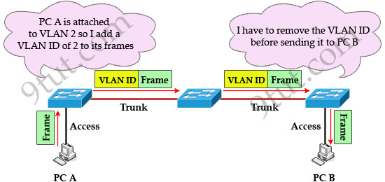
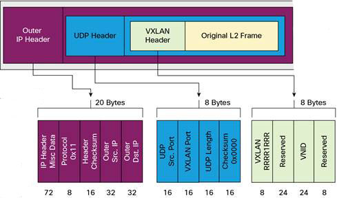
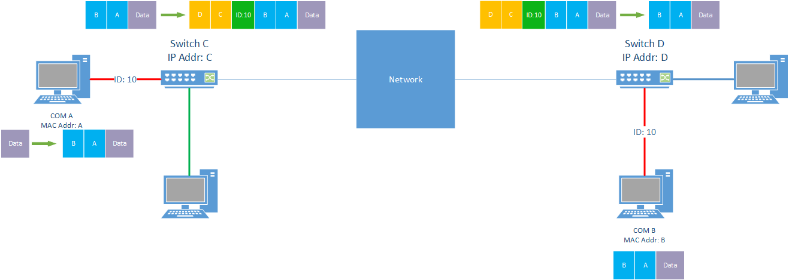
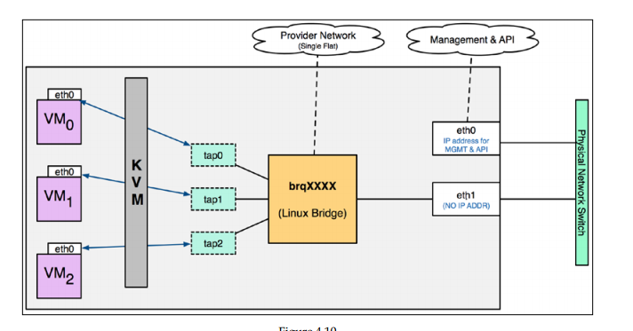
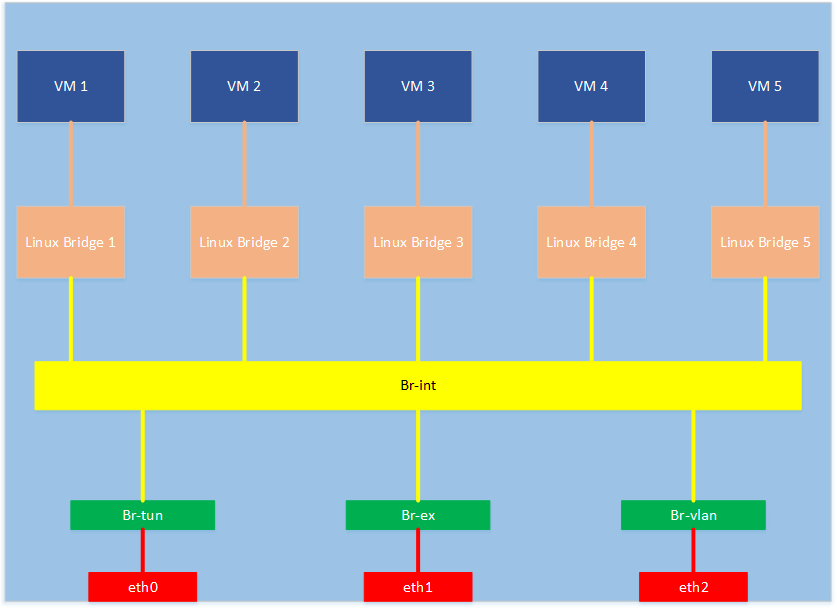
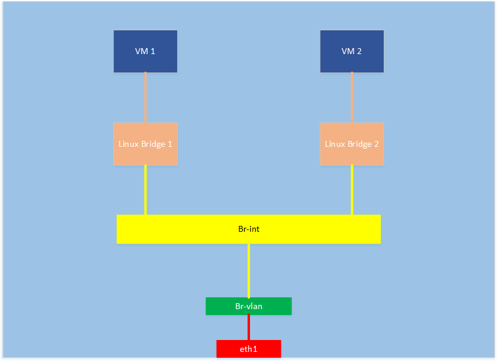

#Giới thiệu về Layer 2 networking deployment trong OpenStack
Trong hệ thống OpenStack, các dịch vụ về OpenStack Networking có trách nhiệm xây dựng và quản lý hệ thống mạng ảo cho. Khi triển khai hạ tầng mạng ảo, chúng ta quan tâm tới việc triển khai hệ thống mạng ở Layer 2 và Layer 3. Ở bài viết này chúng ta sẽ tập trung tìm hiểu vấn đề triển khai Layer 2 với OpenStack Networking.

Ở Layer 2, vấn đề quan trọng nhất mà chúng ta quan tâm là xây dựng được hệ thống các mạng cục bộ (Local Area Network - LAN).Trên cloud có thể tồn tại nhiều mạng cục bộ, bao gồm mạng công khai chia sẻ, tất cả mọi project đều có thể sử dụng và mạng nội bộ mang tính riêng biệt, chỉ có project sở hữu mới có thể sử dụng. Các loại mạng cục bộ khác nhau có thể triển khai trên OpenStack cloud là: VLAN, VXLAN, GRE, Flat. 

Tuy cách thức hoạt động và khả năng của từng loại mạng là khác nhau, nhưng về cơ bản thì các mạng cục bộ đều có thành phần là các switch, dây dẫn và các máy khách kết nối vào mạng. Trong mạng cục bộ, thì switch là thành phần trung tâm, là thiết bị mà các máy khách kết nối đến, và kết nối với các switch khác để tạo thành một mạng lưới hoàn chỉnh. Vì vậy, khi xây dựng môi trường mạng ảo trong OpenStack, một điểm mà chúng ta cần chú trọng là việc lựa chọn công nghệ để xây dựng các switch ảo và lên kế hoạch cấu hình các switch ảo đó trong môi trường vật lý. Hiện tại OpenStack hỗ trợ rất nhiều plugin ảo hóa switch, tuy nhiên do thời gian tìm hiểu có hạn, trong bài viết này chúng ta sẽ tìm hiểu 2 plugin phổ biến là Linux-bridge plugin và Open vSwitch plugin

Nội dung bài viết gồm có 3 phần:

Phần 1: Giới thiệu về mạng cục bộ, các thiết bị trong mạng cục bộ và các loại mạng cục bộ

Phần 2: Giới thiệu về Linux bridge plugin và cách xây dựng các mạng cục bộ trong OpenStack sử dụng Linux bridge plugin

Phần 3: Giới thiệu về Open vSwitch plugin và cách xây dựng các mạng cục bộ trong OpenStack sử dụng Open vSwitch plugin

#Phần 1: Mạng cục bộ
##1.1 Giới thiệu về mạng cục bộ
###1.1.1 Mạng cục bộ là gì ?
Như chúng ta đã biết, mạng là khái niệm để chỉ một hệ thống các máy tính kết nối với nhau thông qua các phương tiện truyền dẫn. Trong mô hình phân Lớp của OSI, các máy tính kết nối với nhau chủ yếu thông qua 2 layer là layer 2 và layer 3. Mạng cục bộ là mạng được triển khai thông qua Layer 2, trong đó các máy tính được kết nối với nhau thông qua các switch.


Trong mạng cục bộ, các máy tính gửi nhận các gói tin thông qua địa chỉ MAC chứ không phải là địa chỉ IP. Để gửi một gói tin tới một máy tính khác, máy gửi cần phải biết được địa chỉ vật lý (MAC) của máy nhận. Sau đó máy gửi sẽ đóng gói bản tin vào một MAC frame và gửi đi. Các switch trong mạng có nhiệm vụ chuyển tiếp MAC frame này tới máy đích dựa trên địa chỉ MAC đích, việc chuyển tiếp này được thực hiện ở Layer 2 thông qua các công nghệ chuyển tiếp khác nhau. Các công nghệ chuyển tiếp này sẽ dẫn tới các loại mạng cục bộ khác nhau. 

Ở đây, chúng ta có thể hiểu, trong mạng cục bộ, máy gửi chỉ có trách nhiệm đánh địa chỉ gửi và địa chỉ nhận rồi gửi gói tin thông qua cổng mạng tới node tiếp theo trong mạng (thường là 1 switch). Còn phương pháp để gói tin đó gửi tới đích, hoặc làm thế nào để phân chia một hệ thống mạng vật lý ra thành nhiều mạng cục bộ  (multi segment local network), điều đó là phụ thuộc vào cách chúng ta sử dụng loại mạng cục bộ nào.
###1.1.2 Nguyên tắc chuyển tiếp dữ liệu trong mạng cục bộ
##1.2 Các loại mạng cục bộ
###1.2.1 Mạng Flat
Mạng flat là loại mạng cục bộ mà các switch truyền nhận gói tin mà không phải đóng gói thêm các thông tin chuyển tiếp. Gói tin được chuyển tiếp qua hệ thống switch mà không bị biến đổi, vẫn giữ nguyên trạng thái là một gói tin L2 frame.


Trên một miền quảng bá vật lý, không thể triển khai nhiều hơn một mạng flat, do tính chất của mạng flat không thể phân chia miền quảng bá ra thành nhiều mạng nhỏ hơn( điều này xuất phát từ bản chất của mạng flat là trong quá trình  chuyển tiếp gói tin từ máy gửi qua máy đích,các switch không đóng gói thêm thông tin định danh gì cho gói tin , do đó nếu trên một miền quảng bá triển khai nhiều hơn một mạng flat, thì các switch trên miền quảng bá không thể phân biệt được gói tin nào của máy nào trong mạng nào. Chính các thông tin định danh gắn liền với các gói tin sẽ cho biết gói tin đó thuộc mạng nào khi gói tin được chuyển tiếp giữa các switch trong miền quảng bá. Chúng ta sẽ làm rõ điều này ở các loại mạng khác).

Quá trình gửi tin trong mạng flat network được mô tả thông qua ví dụ sau:

Như trong hình vẽ, ta có 2 mạng ```flat network 1``` và ```flat network 2``` được xây dựng trên 2 miền quảng bá khác nhau. Trong mạng flat network 1, Máy ```Computer 1``` muốn gửi một gói tin L2 frame tới máy ```Computer 2``` thông qua layer 2. Quá trình chuyển tin xảy ra như sau:
- Computer 1 cấu hình L2 frame với địa chỉ nguồn là MAC của máy 1, địa chỉ đích là MAC của máy 2 
- Computer 1 gửi tới node kế tiếp (Switch 1) thông qua card mạng nối nó tới mạng  flat network 1. 

- Khi nhận được gói tin, Switch 1 kiểm tra địa chỉ của gói tin và tìm kiếm trong bảng định tuyến của nó. Sau đó nó chuyển tiếp gói tin tới ```Switch 2```.

-  Khi gói tin tới Switch 2, Switch 2 tra bảng định tuyến để tìm đích kế tiếp cho gói tin, vì vậy sau đó nó gửi gói tin tới ```Switch 4```. 

-  Khi gói tin tới Switch 4, vì Switch 4 kết nối trực tiếp với máy 2 nên sau khi tra bảng định tuyến, nó gửi gói tin tới Computer 2.

-  Gói tin tới Computer 2. Việc truyền gói tin L2 frame từ máy Computer 1 tới máy Computer 2 hoàn tất. 

Có thể thấy trong quá trình chuyển tiếp gói tin giữa các switch, gói tin được giữ nguyên, không thêm thông tin định dang mạng nào đính kèm vào gói tin. 
###1.2.2 Mạng VLAN
Một vấn đề thường xuyên gặp phải khi thiết kế hệ thống mạng là, cần phân chia một miền quảng bá lớn ra thành nhiều mạng cục bộ độc lập với nhau. Chúng ta có thể sử dụng công nghệ VLAN để giải quyết vấn đề này.


Công nghệ VLAN cho phép chúng ta chia một miền quảng bá vật lý ra thành nhiều mạng cục bộ logic. Mỗi mạng cục bộ được đặc trưng bởi một định danh, đó là VLAN ID. Khi sử dụng công nghệ VLAN, 2 máy trong cùng một mạng cục bộ có thể kết nối với nhau qua mạng cục bộ Layer 2 đó, nhưng nếu 2 máy ở hai mạng cục bộ khác nhau thì không thể kết nối với nhau qua Layer 2, cho dù 2 máy đó cùng nằm trên một mạng quảng bá.

Có rất nhiều cách thức để các switch xác định xem một máy thuộc VLAN nào, ví dụ theo cổng (port): trên Switch 1, từ port 1 -> 5 là VLAN 10, từ port 5 tới port 10 là VLAN 20,... Hoặc cũng có thể xác định theo địa chỉ IP của từng máy như sau:


Khi đã phân chia xong, các máy trên miền quảng bá sẽ được chia ra thành các mạng cục bộ. Việc tiếp theo cần phải làm là xác định cách thức để 2 máy trong cùng 1 mạng VLAN có thể kết nối với nhau. Để thực hiện quá trình này, các switch trên miền quảng bá phải hỗ trợ chuẩn 802.1Q. Chi tiết của chuẩn này có trong tài liệu của IEEE:
```sh
http://standards.ieee.org/getieee802/download/802-1Q-2014.pdf
```
Khi một máy tính gửi một bản tin L2 Frame thông qua layer 2 tới một máy khác trong cùng mạng, gói tin được gửi đi từ máy gửi tới node tiếp theo (switch) dưới dạng 1 L2 frame chuẩn


Khi tới switch, switch xác định xem gói tin được gửi từ máy thuộc mạng VLAN nào. Sau đó, gói tin được điều chỉnh để thêm thông tin định danh, trở thành 1 L2 Frame theo định dạng 802.1 Q


Chúng ta có thể thấy, 1 L2 Frame theo chuẩn 802.1 Q so với L2 Frame chuẩn có thêm thông tin định danh cho gói tin là phần 802.1 Q Tag, trong đó định danh cho gói tin thuộc mạng VLAN nào chính là ở phần VLAN ID. VLAN ID có 12 bit, do đó có thể có tối đa 2^12 = 4096 giá trị VLAN ID khác nhau, tương ứng với việc chúng ta có thể có tối đa 4096 mạng VLAN trong 1 miền quảng bá.

Dựa vào VLAN ID này và bảng định tuyến, gói tin được chuyển tiếp tới các switch tiếp theo trên đường đi tới máy đích. Tới switch trước máy đích, switch này nhận thấy máy đích kết nối tới mình nên sẽ thực hiện chuyển L2 Frame từ dạng 802.1 Q về  L2 Frame dạng chuẩn, sau đó chuyển L2 Frame chuẩn này tới máy đích. Quá trình truyền tin kết thúc. Cũng chính nhờ có VLAN ID mà switch có thể xác định máy gửi và máy đích có thuộc cùng 1 mạng nội bộ hay không, từ đó cho phép chuyển tiếp hoặc từ chối chuyển gói tin tới máy khách.



Thông tin thêm về VLAN
```sh
https://en.wikipedia.org/wiki/Virtual_LAN
```
###1.2.3 Mạng VXLAN
Chúng ta có thể thấy, với mô hình thiết kế của VLAN, bài toán chia miền quảng bá thành các mạng cục bộ con đã được giải quyết. Tuy nhiên mạng VLAN vẫn còn nhiều hạn chế như: Số lượng mạng nội bộ là khá nhỏ (tối đa 4096 mạng / 1 miền quảng bá), có thể không đáp ứng được nhu cầu phân chia trong tương lai; cơ chế định tuyến chưa tối ưu, lý do vì ở Layer 2 không tối ưu cho việc định tuyến mà chức năng chính của nó là chuyển tiếp gói tin, điều này có thể làm giảm hiệu năng  của mạng khi miền quảng bá mở rộng,...
Để giải quyết các hạn chế của mạng VLAN, mô hình mạng VXLAN ra đời như một sự phát triển tiếp theo của VLAN. Nhiệm vụ của VXLAN là tương tự VLAN, tuy nhiên với mô hình thiết kế mới, mạng VXLAN cung cấp những khả năng mới cho việc thiết kế hệ thống mạng. Các ưu điểm của mạng VXLAN có thể kể đến như:

- Khả năng thiết kế hệ thống mạng mềm dẻo hơn: Thiết kế theo mô hình VXLAN cho phép các mạng cục bộ có thể triển khai trên một hạ tầng mạng rộng lớn hơn so với VLAN, có thể triển khai VXLAN trên một hệ thống bao gồm nhiều miền quảng bá kết nối với nhau (thông qua router), nhờ đó việc triển khai mạng VXLAN trên hệ thống mạng trở nên mềm dẻo hơn so với mạng VLAN chỉ có thể triển khai hệ thống mạng trên một miền quảng bá sử dụng các thiết bị của Layer2 (switch, bridge, ...).
- Khả năng mở rộng tốt hơn VLAN: VLAN sử dụng 12 bit để định danh mạng cục bộ, nên chỉ có thể có tối đa 4096 mạng VLAN trong hệ thống, trong khi đó mạng VXLAN có tới 24 bit để định danh mạng cục bộ nên có thể có tới 16 triệu mạng cục bộ trong hệ thống.
- Khả năng định tuyến và hiệu suất của mạng tốt hơn: VXLAN sử dụng công nghệ định tuyến của Layer 3 trong việc truyền dữ liệu, do đó khả năng định tuyến và hiệu suất truyền tin tốt hơn hẳn VLAN trong các hệ thống lớn, do mạng VLAN chỉ sử dụng các switch để di chuyển dữ liệu, mà các switch thì không phù hợp cho việc định tuyến dữ liệu trong 1 hệ thống mạng lớn.

#### Kiến trúc và phương thức hoạt động của mạng VXLAN
Như đã nói ở trên, mạng VXLAN sử dụng Layer 3 để định tuyến. Để hiểu rõ điều này, chúng ta quay lại phần đầu tiên. Như chúng ta đã nói, các loại mạng cục bộ khác nhau chủ yếu ở cách định danh mạng và cách thức truyền gói tin L2 frame tới đích. Ở mạng VXLAN, chúng ta truyền gói tin L2 frame bằng cách sử dụng giao thức MAC-in-UDP (MAC Address-in-User Datagram Protocol). Tức là phương thức để truyền gói tin L2 frame trong mạng là sử dụng IP và UDP để truyền dẫn.

Trong giao thức MAC-in-UDP, gói tin L2 frame cần gửi sẽ được đóng thêm VXLAN header để định danh mạng nội bộ, sau đó được đóng vào UDP header rồi vào IP packet để chuyển đi. Format gói tin của giao thức MAC-in-UDP như sau:



Để sử dụng thiết kế của mạng VXLAN, thì các switch trên mạng phải hỗ trợ một công nghệ mới, đó là công nghệ VTEP (VXLAN Tunnel Endpoint). Với việc sử dụng công nghệ này, các switch được coi là các thiết bị VTEP. Các thiết bị VTEP có chức năng xác định các máy tính kết nối tới nó, máy nào thuộc mạng cục bộ VXLAN nào, thực hiện việc chuyển dữ liệu giữa các máy cùng một mạng VXLAN, đóng gói L2 frame vào gói tin của giao thức MAC-in-UDP rồi chuyển đi và chức năng nhận và  mở gói các gói tin của giao thức MAC-in-UDP để lấy gói tin L2 frame ban đầu và gửi tới máy đích.

Để thực hiện các chức năng trên, một thiết bị VTEP bao gồm 2 thành phần chính: thành phần thứ nhất là một switch kết nối và chuyển tiếp dữ liệu giữa các máy tính trong một mạng VXLAN cùng kết nối trực tiếp tới thiết bị VTEP, thành phần thứ 2 là thiết bị đóng gói, mở gói và truyền gói tin MAC-in-UDP thông qua giao thức IP. Thiết bị VTEP có địa chỉ IP xác định, do đó các thiết bị VTEP có thể gửi gói tin IP đến các thiết bị VTEP khách thông qua mạng IP để thực hiện chức năng gửi-nhận các gói tin IP.


#### Phương thức hoạt động của mạng VXLAN
Sau khi tìm hiểu được các thành phần và đơn vị dữ liệu của mạng VXLAN, chúng ta sẽ tìm hiểu cách mà các thiết bị trong mạng VXLAN thực hiện chức năng chuyển tiếp dữ liệu giữa 2 máy trong cùng 1 mạng nội bộ. Chúng ta xét ví dụ sau đây:


Ta có 3 máy A, B, C cùng thuộc một mạng cục bộ VXLANID 10. Ta xét 2 trường hợp:

Trường hợp 1, máy A muốn gửi cho máy C một gói tin L2 frame. Lúc này máy A sẽ đẩy lên thiết bị VTEP 1 gói tin L2 frame này với địa chỉ đích là MAC của máy C, thiết bị VTEP-1 nhận được gói tin từ A, xác định được địa chỉ đích của gói tin là C cũng kết nối trực tiếp vào thiết bị và cùng nằm trên 1 mạng cục bộ  VXLAN10 với A, do đó nó chuyển trực tiếp gói tin tới C. Trong trường hợp này chúng ta không cần phải đóng gói và mở gói  gói tin MAC-in-UDP. Thiết bị VTEP đóng vai trò như là 1 switch (mà thật ra thiết bị này là Switch hỗ trợ VXLAN mà thôi).

Trường hợp 2, máy A muốn gửi cho máy B một gói tin L2 frame. Lúc này máy A cũng đấy gói tin L2 frame với địa chỉ đích là MAC của máy B lên thiết bị VTEP 1. Tuy nhiên lúc này máy B không kết nối trực tiếp với VTEP 1, nên quá trình chuyển gói tin tới máy B xảy ra như sau:

Gói tin L2 frame nguyên bản (orginial) được máy A chuyển tới VTEP 1 thông qua mạng vật lý. VTEP 1 nhận được gói tin L2 frame này, nó hiểu được địa chỉ đích là máy B. Lúc này, tại VTEP 1, nó xác định xem máy B được kết nối trực tiếp với thiết bị VTEP nào bằng cách tra trong cơ sở dữ liệu của nó. Sau khi VTEP 1 biết được VTEP 2 là thiết bị kết nối trực tiếp với máy B, nó tiến hành đóng gói dữ liệu:

- Gói tin L2 frame ban đầu được thêm vào VXLAN header để định danh mạng cục bộ.

-  Sau đó đóng gói vào UDP packet với UDP port tương ứng với UDP port dành cho VXLAN.

-   Tiếp đó UDP packet này được đóng gói vào IP packet với địa chỉ IP đích là địa chỉ IP của VTEP 2. 

Sau khi tiến hành đóng gói xong, VTEP 1 thực hiện việc truyền gói tin IP này tới VTEP 2 thông qua hệ thống mạng bằng giao thức IP. 

Sau khi được chuyển tiếp, định tuyến, gói tin tới được VTEP 2. Tại VTEP 2, thiết bị này thực hiện giải nén theo các bước sau:

- Thực hiện việc mở gói tin IP mà nó nhận được ( vì địa chỉ đích là địa chỉ của nó), nó nhận được gói tin UDP. 

- Kiểm tra port của gói tin UDP, gói tin UDP này có UDP port là port dành cho VXLAN, đo đó  nó tiếp tục mở gói tin UDP và xử lý gói tin nhận được theo phương thức xử lý gói tin VXLAN.

-  Dữ liệu nhận trong gói tin UDP bao gồm bản tin L2 nguyên bản và phần VXLAN header. Dựa vào VXLAN header, VTEP 2 biết được máy đích thuộc mạng VXLAN nào nhờ vào VXLAN ID chứa trong VXLAN header (VNID). Đồng thời dựa vào địa chỉ đích của gói tin L2 nguyên bản, VTEP 2 biết được máy đích kết nối với nó ở cổng (port) nào. 

- VTEP 2 chuyển tiếp gói tin L2 nguyên bản của máy A tới máy B thông qua port mà máy B kết nối với nó. Lúc này máy B nhận được bản tin L2 từ máy A gửi tới ban đầu. Quá trình truyền tin kết thúc.

Như vậy có thể thấy ở VXLAN có 2 đặc điểm chính sau:

- Sử dụng VXLAN ID để xác định các mạng VXLAN cục bộ có trong hệ thống mạng. VLANID có độ dài là 24 bit, do đó có tối đa 16 triệu mạng VXLAN trong một hệ thống mạng. 
- Việc truyền bản tin L2 Frame giữa 2 máy cùng một mạng cục bộ nằm ở xa nhau sử dụng truyền tin trên mạng IP + UDP, có thực hiện việc đóng gói và mở gói ở các thiết bị đầu và cuối.

###1.2.4 Mạng GRE
Để hiểu được nguyên tắc hoạt động của Mạng GRE, trước tiên chúng ta cần hiểu về khái niệm GRE. Theo tài liệu ```rfc2784```, thì GRE - Generic Routing Encapsulation là một giao thức (protocol) cho phép đóng gói một gói tin của giao thức A cùng với GRE header vào trong một gói tin của giao thức B, sau đó vận chuyển đến một thiết bị đích có khả năng giải nén gói tin giao thức B, giải mã GRE header rồi chuyển tiếp gói tin của giao thức A đến đích. Format của giao thức GRE như sau:

```sh
   ---------------------------------
    |                               |
    |       Delivery Header         |
    |                               |
    ---------------------------------
    |                               |
    |       GRE Header              |
    |                               |
    ---------------------------------
    |                               |
    |       Payload packet          |
    |                               |
    ---------------------------------
```
Trong đó, format của GRE Header như sau:
```sh
 0 1 2 3 4 5 6 7 8 9 0 1 2 3 4 5 6 7 8 9 0 1 2 3 4 5 6 7 8 9 0 1
    +-+-+-+-+-+-+-+-+-+-+-+-+-+-+-+-+-+-+-+-+-+-+-+-+-+-+-+-+-+-+-+-+
    |C|       Reserved0       | Ver |         Protocol Type         |
    +-+-+-+-+-+-+-+-+-+-+-+-+-+-+-+-+-+-+-+-+-+-+-+-+-+-+-+-+-+-+-+-+
    |      Checksum (optional)      |       Reserved1 (Optional)    |
    +-+-+-+-+-+-+-+-+-+-+-+-+-+-+-+-+-+-+-+-+-+-+-+-+-+-+-+-+-+-+-+-+
```
(Lưu ý là các trường optional có thể được thay đổi tùy vào mục đích sử dụng của GRE. Ở đây chúng ta quan tâm nhất đến trường Protocol Type. Trường này cho biết giao thức được đóng gói (Giao thức A đã nói ở trên) vào trong gói tin của giao thức bên ngoài (Giao thức B) là giao thức nào.

Như vậy, chúng ta có thể hiểu mục đích của giao thức GRE là sử dụng một giao thức B để vận chuyển gói tin của giao thức A bằng các thiết bị phù hợp. Điều này giúp cho việc vận chuyển các gói tin trên một giao thức có thể trở nên linh hoạt hơn mà không phụ thuộc vào các đặc điểm của giao thức A. Chính ứng dụng này cho phép chúng ta sử dụng giao thức GRE để vận chuyển một bản tin MAC Frame ở layer2 thông qua giao thức IP, đây chính là phương thức mà mạng GRE hoạt động, điều mà chúng ta sẽ tìm hiểu ngay ở phần dưới.
####Sử dụng giao thức GRE để xây dựng mạng nội bộ GRE trong OpenStack
Mục tiêu chính của mạng nội bộ là chuyển tiếp được các gói tin MAC Frame giữa các thiết bị với nhau. Bằng việc sử dụng giao thức GRE, chúng ta có thể xây dựng mạng nội bộ  phân bố ở trên các miền quảng bá khác nhau bằng cách sử dụng GRE protocol để vận chuyển bản tin L2 Frame giữa các miền quảng bá khác nhau này. Mạng GRE trong OpenStack được xây dựng trên kiến trúc như sau:

Như đã nói ở phần trước, việc phân loại các mạng nội bộ là dựa trên cách các thiết bị trung gian (switch) phân chia các máy tính trong mạng vật lý thành các mạng nội bộ như thế nào, và cách chuyển tiếp L2 frame giữa các thiết bị trung gian này như thế nào. Ở mạng GRE, các vấn đề này được giải quyết bằng cách cụ thể hóa format của GRE protocol: Các mạng cục bộ trong cùng 1 hệ thống mạng vật lý được phân biệt với nhau bằng ID nằm trong GRE Header. Payload cần truyền đi là L2 Frame và giao thức được sử dụng để vận chuyển là IP protocol.Format của GRE Protocol như sau:


Quá trình chuyển tiếp gói tin L2 frame giữa 2 máy client ở 2 vùng mạng khác nhau diễn ra như sau:

Giả sử máy A cần gửi một L2 Frame tới máy B. Máy A sẽ đánh địa chỉ gửi là MAC của A, địa chỉ đích của Frame là MAC của B rồi gửi L2 Frame này qua đường truyền vật lý tới Swich kết nối trực tiếp với nó là Switch C. Tại Switch C, phân tích MAC đích cho thấy Máy B không kết nối trực tiếp tới Switch, nó đóng gói bản tin L2 Frame của A gửi tới theo các bước sau:

- Thêm GRE Header vào với ID của mạng nội bộ mà A và B là thành viên.
- Đóng gói dữ liệu vào IP packet với địa chỉ IP đích là địa chỉ của Switch D là Switch kết nối trực tiếp với máy B bằng cách tra trong cơ sở dữ liệu.

Sau đó, gói tin được gửi đi thông qua hệ thống mạng bằng giao thức IP tới Switch D. Tại Switch D thực hiện quá trình mở gói gói tin IP như sau:

- Sau khi mở gói tin IP Packet, Switch D kiểm tra ID của mạng nội bộ của gói tin và địa chỉ đích của L2 Frame, sau đó tra trong cơ sở dữ liệu để xác định cổng kết nối với máy B.

- Switch D tiến hành loại bỏ GRE Header, sau đó chuyển tiếp L2 Frame nguyên gốc từ Máy A qua cổng kết nối với Máy B. Gói tin được chuyển tới Máy B, quá trình chuyển gói tin kết thúc.

Có thể thấy mạng GRE rất giống với mạng VXLAN. Cả 2 loại mạng này đều sử dụng giao thức IP để chuyển tiếp các gói tin giữa các switch thuộc các miền mạng khác nhau, đồng thời cả 2 loại mạng này đều hỗ trợ tối đa 2^24 = 16 triệu mạng nội bộ. Sự khác biệt nằm ở chỗ, mạng VXLAN sử dụng 3 lớp VXLAN Header + UDP + IP để đóng gói gói tin, trong khi đó mạng GRE chỉ sử dụng 2 lớp là GRE Header + IP để đóng gói, do đó các thiết bị đầu cuối mạng GRE không phải đóng gói và mở gói tầng UDP, đồng thời kích thước gói tin chuyển tiếp mạng GRE sẽ nhỏ hơn kích thước gói tin chuyển tiếp của mạng VXLAN.

Sau khi đã tìm hiểu xong các loại mạng nội bộ, chúng ta cùng tìm hiểu xem cách thức các loại mạng này triển khai trên OpenStack như thế nào trên các nền tảng sử dụng Linux Bridge và Open vSwitch

#Phần 2: Linux bridge và triển khai của các loại mạng sử dụng Linux Bridge plugin trong OpenStack
##2.1 Giới thiệu về Linux Bridge plugin
Như đã giới thiệu ở phần trước, Linux Bridge là một loại switch ảo được thiết kế theo chuẩn 802.1D được sử dụng trong hệ điều hành Linux. Tuy nhiên, với các chức năng của 1 switch cơ bản, Một mình Linux brige là không đủ khả năng để xây dựng nên các mạng phức tạp như VLAN, VXLAN. Do đó, khi xây dựng hệ thống mạng trong OpenStack sử dụng Linux Bridge plugin, Neutron sẽ kết hợp các Linux bridge với các loại thiết bị ảo khác và cả các thiết bị phần cứng để tạo nên hệ thống mạng ảo phục vụ cho các máy ảo. Ta sẽ xem xem các thiết bị này được xây dựng như thế nào trong các loại mạng.
##2.2 Triển khai các loại mạng cục bộ với Linux Bridge plugin
###2.2.1 Mạng Flat
Chúng ta đã biết, trong mạng Flat, các gói tin được các switch chuyển tiếp mà không được gắn thêm các thông tin định danh. Chính vì lý do đó, mà trong môi trường OpenStack, mỗi một card mạng vật lý chỉ có thể triển khai được một mạng Flat. 

Khi triển khai mạng Flat, sẽ có một bridge ảo được tạo ra trên các node và nối trực tiếp tới card mạng vật lý. Các máy ảo sử dụng mạng Flat đó, mỗi máy sẽ nối 1 card mạng ảo vào bridge ảo này để kết nối với mạng Flat. Lưu ý, mạng Flat sẽ được triển khai các card mạng cùng thuộc một mạng vật lý. Tức là nếu ở máy A mạng flat X được triển khai trên card mạng A1, ở máy B mạng flat X được triển khai trên card mạng B1 thì A1 và B1 sẽ kết nối tới cùng một mạng vật lý, và các card mạng vật lý này không cần phải có địa chỉ IP


Kiểm tra trên compute node sau khi kết nối 3 máy ảo vào cùng 1 mạng Flat:
```sh
bridge name	bridge id					STP enabled		interfaces
brqdf517cb8-c4		8000.000c299ddd0d	no				eth1
														tap2ad6ce6e-84
														tap41e05531-0f
														tap5ba48d69-2b
```
Trong đó ```brqxxxx``` là bridge ảo được tạo ra, bridge ảo trên nối trực tiếp đến card mạng vật lý eth1, và nối với 3 máy ảo thông qua 3 tap device ```tapxxxx```

Nếu muốn triển khai nhiều hơn một mạng Flat trên hệ thống, thì trên mỗi máy phải có số lượng card vật lý phục vụ cho các mạng Flat bằng số lượng mạng Flat, vì mỗi một card mạng vật lý chỉ có thể triển khai 1 mạng Flat.
###2.2.2 Mạng VLAN
Để triển khai mạng VLAN bằng Linux Bridge plugin, Linux Bridge sẽ kết hợp với thiết bị VLAN-interface ảo có tên là ethx.VLAN_ID,trong đó VLAN_ID là ID của mạng VLAN. Mỗi một mạng VLAN sẽ tạo ra một Linux bridge và một VLAN-Device. Các máy ảo thuộc cùng một mạng VLAN trên cùng một node sẽ kết nối card mạng ảo của máy ảo đó với LinuxBridge quản lý VLAN đó

Linux bridge sẽ kết hợp với VLAN-Device để thực hiện được chức năng của 1 switch vật lý trong mạng VLAN, cụ thể như sau:

- Khi cần chuyển tiếp một gói tin L2 Frame từ một máy ảo qua một máy khác cùng thuộc VLAN nhưng thuộc node khác, Linux bridge sẽ chuyển tiếp gói tin đó qua VLAN-Device. VLAN-Device sẽ đóng thêm VLAN Header với ID là ID của mạng VLAN rồi chuyển tiếp ra mạng vật lý qua card vật lý eth1

- Khi tiếp nhận một gói tin L2 Frame từ mạng vật lý bên ngoài, gói tin này sẽ đi qua card eth1 vào các VLAN-Device. Các VLAN-Device sẽ kiểm tra VLAN ID của gói tin này, nếu gói tin này có VLAN ID hợp lệ, VLAN-Device sẽ loại bỏ phần VLAN header và chuyển L2 Frame tới Linux Bridge. Linux Bridge sẽ kiểm tra địa chỉ MAC đích rồi forward gói tin L2 Frame tới cổng kết nối với máy có MAC đích.

- Khi chuyển tiếp giữa các máy VLAN cùng nằm trong 1 node, Linux bridge hoạt động như một switch bình thường (không cần các hoạt động gắn-bỏ VLAN Header)
Kiểm tra bridge trên compute node sau khi kết nối 2 máy ảo vào cùng 1 mạng VLAN có id là 101:
```sh
root@compute:/home/cong# brctl show
bridge name			bridge id				STP enabled			interfaces
brq759532d6-47		8000.000c299ddd0d			no					eth1.101
																	tapb017d852-b1
																	tapbf90271c-cc

```
Lưu ý là tuy chỉ có thể triển khai một mạng Flat trên một card mạng vật lý, tuy nhiên nếu sau khi triển khai mạng Flat đó rồi, thì trên card mạng vật lý đó ta vẫn có thể triển khai thêm các mạng VLAN. 
###2.2.3 Mạng VXLAN
Khi triển khai mạng VXLAN bằng Linux Bridge plugin, các linux bridge sẽ kết hợp với VXLAN-Device để thực hiện các chức năng của một thiết bị VTEP. VXLAN-Device được đặt tên tương ứng với ID của mạng VXLAN mà nó được triển khai lên.
```sh
root@compute:/home/cong# brctl show
bridge name			bridge id				STP enabled		interfaces
brq06d9fc97-f8			8000.52480fb859f8		no				tap3cf57cad-23
																vxlan-57
```
Phương thức hoạt động của tổ hợp linux bridge + VXLAN-Device như sau:
- Khi cần chuyển tiếp một gói tin L2 Frame từ một máy ảo tới một máy ảo khác thuộc cùng mạng nội bộ nhưng nằm trên node khác, Linux bridge chuyển tiếp gói tin này tới VXLAN-Device. VXLAN-Device sẽ thực hiện công việc thêm VXLAN header với ID là ID của mạng VXLAN, rồiđóng gói gói tin vào UDP +IP packet. Cuối cùng gói tin IP packet này được vận chuyển với IP nguồn là IP của card vật lý mà mạng VXLAN được triển khai trên đó, IP đích là IP của card mạng vật lý triển khai VXLAN đó của node chứa máy ảo đích.

- Khi tiếp nhận một gói tin IP packet từ mạng bên ngoài gửi vào, gói tin sẽ đi qua các card mạng vật lý và vào các VXLAN-Device. VXLAN-Device sẽ mở gói và kiểm tra VXLAN ID của gói tin L2 Frame. Nếu gói tin có VXLAN ID hợp lệ với mạng VXLAN này, VXLAN-Device sẽ chuyển tiếp gói tin L2 Frame nguyên bản tới Linux-bridge. Ở đây dựa theo dữ liệu mà gói tin được chuyển tiếp tới cổng kết nối với máy có MAC đích.

Trong trường hợp chuyển tiếp giữa các máy cùng mạng nội bộ và cùng nằm trên một node, gói tin được chuyển tiếp thông qua Linux Bridge.

Trên một địa chỉ IP của một card mạng vật lý có thể triển khai nhiều mạng VXLAN. Khi cấu hình hệ thống mạng của OpenStack, chúng ta phải xác định địa chỉ IP cho card mạng vật lý sẽ triển khai các mạng VXLAN và sử dụng địa chỉ IP này để cấu hình mạng. Điều này là cần thiết, vì mạng VXLAN sử dụng giao thức IP để chuyển tiếp dữ liệu giữa các node.

Linux-bridge plugin hiện thời không hỗ trợ mạng GRE.
#Phần 3: Open vSwitch và triển khai của các loại mạng sử dụng Open vSwitch plugin trong OpenStack
##3.1 Giới thiệu về Open vSwitch
Open vSwitch là một service cho phép tạo ra và quản lý các đối tượng switch ảo trên môi trường Linux. Tuy cũng sử dụng các switch ảo kết nối với các máy ảo và hệ thống mạng vật lý để thiết lập hệ thống mạng ảo, tuy nhiên cách triển khai mạng ảo bằng Open vSwitch plugin có sự khác biệt so với sử dụng Linux Bridge plugin để triển khai mạng ảo. Chúng ta sẽ thấy sự khác biệt này khi nhìn vào cách sơ đồ chi tiết của các loại mạng khi sử dụng Open vSwitch để triển khai.
Chi tiết về Open vSwitch có thể được tìm thấy ở ```http://openvswitch.org/```
##3.2 Triển khai các loại mạng cục bộ với Open vSwitch plugin
Khi triển khai các loại mạng cục bộ với Open vSwitch plugin, mô hình chung của các mạng này sẽ là: Ở mỗi một node sẽ có 1 open vswitch ảo đóng vai trò switch trung tâm trong node đó, được đặt tên là br-int. Để kết nối với hệ thống mạng bên ngoài, mỗi một card vật lý sẽ được kết nối với một open vswitch, các switch  này lại nối với switch trung tâm. Node trung tâm kết nối với các máy ảo trong node thông qua một switch ảo khác thuộc loại linux bridge. Như vậy, chúng ta cần hiểu, khi sử dụng Open vSwitch plugin, trong hệ thống mạng ảo sẽ sử dụng 2 loại switch ảo là linux bridge và Open vSwitch. Ở đây, linux  bridge được sử dụng để triển khai các tường lửa cho các máy ảo trong node. Tuy cách thiết kế các mạng ảo đều theo mô hình như trên, nhưng cấu hình các switch sẽ khác nhau tùy thuộc vào loại mạng triển khai. 

Để tìm hiểu xem các switch ảo trong hệ thống mạng ảo được cấu hình như thế nào, chúng ta cần hiểu được một số vấn đề sau:
####Các openvswitch ảo có trong 1 node và các port của một openvswitch ảo
Để kiểm tra được mô hình mạng ảo trong 1 node, bước đầu tiên chúng ta cần kiểm tra được những switch nào đang được triển khai trên node đó.
Ta xét một mô hình mạng trên 1 node, node này có 3 card mạng eth0, eth1, eth2. Trên node triển khai 5 máy ảo, mỗi máy ảo kết nối với switch trung tâm qua 1 linux bridge. Khi đó ta có mô hình của node như sau

Kiểm tra các switch ảo, ta thấy được các switch kết nối với các thiết bị khác qua các cổng nào:
```sh
root@compute:/home/cong# ovs-vsctl show
    Bridge br-tun
        fail_mode: secure
        Port br-tun
            Interface br-tun
                type: internal
        Port patch-int
            Interface patch-int
                type: patch
                options: {peer=patch-tun}
        Port "vxlan-0a0a0a0a"
            Interface "vxlan-0a0a0a0a"
                type: vxlan
                options: {df_default="true", in_key=flow, local_ip="10.10.10.11", out_key=flow, remote_ip="10.10.10.10"}
    Bridge br-vlan
        Port "eth2"
            Interface "eth2"
        Port br-vlan
            Interface br-vlan
                type: internal
        Port phy-br-vlan
            Interface phy-br-vlan
                type: patch
                options: {peer=int-br-vlan}
    Bridge br-ex
        Port br-ex
            Interface br-ex
                type: internal
        Port phy-br-ex
            Interface phy-br-ex
                type: patch
                options: {peer=int-br-ex}
        Port "eth1"
            Interface "eth1"
    Bridge br-int
        fail_mode: secure
        Port "qvo1fed3e27-84"
            tag: 3
            Interface "qvo1fed3e27-84"
        Port int-br-provider
            Interface int-br-provider
                type: patch
                options: {peer=phy-br-provider}
        Port "qvo0fbe5cba-9e"
            tag: 4
            Interface "qvo0fbe5cba-9e"
        Port br-int
            Interface br-int
                type: internal
        Port "qvo7be3c33f-f4"
            tag: 2
            Interface "qvo7be3c33f-f4"
        Port int-br-ex
            Interface int-br-ex
                type: patch
                options: {peer=phy-br-ex}
        Port "qvo28447704-dc"
            tag: 3
            Interface "qvo28447704-dc"
        Port patch-tun
            Interface patch-tun
                type: patch
                options: {peer=patch-int}
        Port "qvob362bedf-c1"
            tag: 1
            Interface "qvob362bedf-c1"
        Port int-br-vlan
            Interface int-br-vlan
                type: patch
                options: {peer=phy-br-vlan}
    ovs_version: "2.5.0"
root@compute:/home/cong# brctl show
bridge name			bridge id		STP enabled		interfaces
qbr0fbe5cba-9e		8000.fe163e333534	no			qvb0fbe5cba-9e
														tap0fbe5cba-9e
qbr1fed3e27-84		8000.1207cb57696a	no			qvb1fed3e27-84
														tap1fed3e27-84
qbr28447704-dc		8000.9a6f234eba4f	no			qvb28447704-dc
														tap28447704-dc
qbr7be3c33f-f4		8000.62d8f048c2e5	no			qvb7be3c33f-f4
														tap7be3c33f-f4
qbrb362bedf-c1		8000.9686eedeba00	no			qvbb362bedf-c1
														tapb362bedf-c1

```
Như đã nói ở trên, mỗi card vật lý được triển khai mạng ảo sẽ được triển khai một openvswitch, do đó khi chúng ta sử dụng lệnh ```ovs-vsctl show``` để kiểm tra, chúng ta có thể thấy trên node sẽ có 4 open vswitch, bao gồm 3 switch liên kết với 3 node vật lý và 1 openvswitch trung tâm. Sử dụng lệnh ```brctl show```, chúng ta có thể thấy trên hệ thống có 5 Linux Bridge, mỗi bridge phục vụ cho 1 máy ảo.
1 switch có nhiều cổng để kết nối tới các máy khách, các card vật lý hoặc các switch khác. Khi kiểm tra xem một switch có các cổng nào, chúng ta đồng thời cũng có thể biết được switch đó đang kết nối với các thiết bị nảo qua cổng nào. Ví dụ như khi chúng ta sử dụng các câu lệnh trên để kiểm tra trên 1 node, chúng ta có thể thấy
```sh
 Bridge br-vlan
        Port "eth2"
            Interface "eth2"
        Port br-vlan
            Interface br-vlan
                type: internal
        Port phy-br-vlan
            Interface phy-br-vlan
                type: patch
                options: {peer=int-br-vlan}
```
openvswitch này có 3 port, trong đó có một port là internal, 2 port còn lại, port ```br-vlan``` kết nối trực tiếp tới card vật lý eth2, port ```phy-br-vlan```
nối với openvswitch br-int. Hoặc chúng ta xét openvswitch trung tâm
```sh
    Bridge br-int
        fail_mode: secure
        Port "qvo1fed3e27-84"
            tag: 3
            Interface "qvo1fed3e27-84"
        Port int-br-provider
            Interface int-br-provider
                type: patch
                options: {peer=phy-br-provider}
        Port "qvo0fbe5cba-9e"
            tag: 4
            Interface "qvo0fbe5cba-9e"
        Port br-int
            Interface br-int
                type: internal
        Port "qvo7be3c33f-f4"
            tag: 2
            Interface "qvo7be3c33f-f4"
        Port int-br-ex
            Interface int-br-ex
                type: patch
                options: {peer=phy-br-ex}
        Port "qvo28447704-dc"
            tag: 3
            Interface "qvo28447704-dc"
        Port patch-tun
            Interface patch-tun
                type: patch
                options: {peer=patch-int}
        Port "qvob362bedf-c1"
            tag: 1
            Interface "qvob362bedf-c1"
        Port int-br-vlan
            Interface int-br-vlan
                type: patch
                options: {peer=phy-br-vlan}
```
chúng ta có thể thấy openvswitch này kết nối tới openvswitch br-vlan qua port ```int-br-vlan``` , kết nối với openvswitch br-tun qua port ```patch-tun```, kết nối với openvswitch br-ex qua port ```int-br-ex```. Đồng thời openvswitch trung tâm kết nối với các linux bridge thông qua các port ```qvoxxxx```, tương ứng với chúng là các linux bridge có tên là ```qbrxxxx```

Để có thể xem rõ hơn về các port của một openvswitch, chúng ta có thể dùng lệnh ```ovs-ofctl show <tên openvSwitch>```, ví dụ
```sh
root@compute:/home/cong# ovs-ofctl show br-int
OFPT_FEATURES_REPLY (xid=0x2): dpid:00008abe90f05b41
n_tables:254, n_buffers:256
capabilities: FLOW_STATS TABLE_STATS PORT_STATS QUEUE_STATS ARP_MATCH_IP
actions: output enqueue set_vlan_vid set_vlan_pcp strip_vlan mod_dl_src mod_dl_dst mod_nw_src mod_nw_dst mod_nw_tos mod_tp_src mod_tp_dst
 1(int-br-provider): addr:12:78:40:51:11:b1
     config:     0
     state:      0
     speed: 0 Mbps now, 0 Mbps max
 2(int-br-vlan): addr:6a:22:c4:28:8d:d1
     config:     0
     state:      0
     speed: 0 Mbps now, 0 Mbps max
 3(int-br-ex): addr:86:0d:b4:1c:e7:83
     config:     0
     state:      0
     speed: 0 Mbps now, 0 Mbps max
 4(patch-tun): addr:c2:dd:86:2f:7d:1c
     config:     0
     state:      0
     speed: 0 Mbps now, 0 Mbps max
 5(qvob362bedf-c1): addr:22:f3:c9:17:20:10
     config:     0
     state:      0
     current:    10GB-FD COPPER
     speed: 10000 Mbps now, 0 Mbps max
 7(qvo7be3c33f-f4): addr:ca:c9:72:09:87:e6
     config:     0
     state:      0
     current:    10GB-FD COPPER
     speed: 10000 Mbps now, 0 Mbps max
 8(qvo1fed3e27-84): addr:5a:75:f5:84:81:30
     config:     0
     state:      0
     current:    10GB-FD COPPER
     speed: 10000 Mbps now, 0 Mbps max
 9(qvo0fbe5cba-9e): addr:4a:41:8f:03:d7:2a
     config:     0
     state:      0
     current:    10GB-FD COPPER
     speed: 10000 Mbps now, 0 Mbps max
 10(qvo28447704-dc): addr:46:9a:8c:4e:f8:48
     config:     0
     state:      0
     current:    10GB-FD COPPER
     speed: 10000 Mbps now, 0 Mbps max
 LOCAL(br-int): addr:8a:be:90:f0:5b:41
     config:     PORT_DOWN
     state:      LINK_DOWN
     speed: 0 Mbps now, 0 Mbps max
OFPT_GET_CONFIG_REPLY (xid=0x4): frags=normal miss_send_len=0

```

Như vậy, chúng ta có thể nhìn thấy được các switch ảo có trong một node và sự kết nối giữa chúng với các thiết bị khác qua các port như thế nào. Điều tiếp theo chúng ta cần xem xét là các switch ảo trên xử lý các gói tin vào ra bằng cách nào với từng loại mạng cục bộ. Để giải quyết việc này, các openvswitch sử dụng một cơ chế để xử lý các gói dữ liệu tương ứng với các thông tin định danh của gói dữ liệu đó, được gọi là ```flow-rules```. Do cơ chế hoạt động của openVswitch, cách xử lý thông tin định danh của open vSwitch có sự khác biệt so với hoạt động của các switch thông thường. Chúng ta sẽ làm rõ điều này hơn khi đi vào flow rules của từng loại mạng cụ thể. Ở đây chúng ta thử xem xét xem flow rules của một open vSwitch có dạng như thế nào. Sử dụng câu lệnh ```ovs-ofctl dump-flows <bridge>``` để xem flow rule của một bridge nào đó. Ở đây chúng ta thử xem flow rule của br-int

```sh
ovs-ofctl dump-flows --rsort  br-int
 cookie=0xb595b9f297d967e0, duration=476.373s, table=0, n_packets=78, n_bytes=8679, priority=3,in_port=2,dl_vlan=4 actions=mod_vlan_vid:1,NORMAL
 cookie=0xb595b9f297d967e0, duration=472.277s, table=0, n_packets=83, n_bytes=9209, priority=3,in_port=2,dl_vlan=104 actions=mod_vlan_vid:2,NORMAL
 cookie=0xb595b9f297d967e0, duration=471.938s, table=0, n_packets=61, n_bytes=6960, priority=3,in_port=3,dl_vlan=101 actions=mod_vlan_vid:3,NORMAL
 cookie=0xb595b9f297d967e0, duration=532.100s, table=0, n_packets=33, n_bytes=4782, priority=2,in_port=2 actions=drop
 cookie=0xb595b9f297d967e0, duration=529.854s, table=0, n_packets=610, n_bytes=42964, priority=2,in_port=3 actions=drop

```
Lưu ý là khi dữ liệu đi vào br-int sẽ được xử lý theo mức độ ưu tiên, nghĩa là dữ liệu nếu hợp với nhiều rule, thì rule có mức ưu tiên (priority) cao nhất sẽ được áp dụng để xử lý dữ liệu, còn các rule khác sẽ không được áp dụng

Một điểm quan trọng mà chúng ta cần lưu ý khi tìm hiểu hệ thống mạng ảo sử dụng open vSwitch, đó là vì trên một node có thể tồn tại rất nhiều máy ảo thuộc nhiều mạng nội bộ khác nhau, nên hệ thống các open vSwitch ảo cần có cơ chế quản lý các máy này, tức là cần phải có cơ chế để xác định máy ảo nào thuộc mạng nào. Để làm được điều này, bridge trung tâm sẽ thay thế mỗi một mạng  được triển khai trên hệ thống bằng một mạng VLAN nội bộ dùng riêng trong node đó. Ví dụ nếu trên 1 node triển khai 2 mạng VXLAN, 3 mạng VLAN, 1 mạng Flat thì sẽ có 6 mạng VLAN nội bộ trên node đó. Việc thay thế các gói tin đi từ bên ngoài vào thành các gói tin thuộc các mạng nội bộ bên trong  node hoặc chuyển các gói tin thuộc các mạng nội bộ bên trong node thành gói tin thuộc các mạng bên ngoài sẽ được thực hiện bằng các thao tác thay thế thẻ định danh. Chúng ta sẽ tìm hiểu các quy tắc thay thế thẻ định danh khi xem xét từng loại mạng ở phần dưới đây. 

Sau khi nắm được các khái niệm cơ bản trong một hệ thống mạng ảo sử dụng openvswitch plugin, chúng ta sẽ xem xem các khái niệm này được thể hiện như thế nào trong các loại mạng cục bộ.

###3.2.1 Mạng VLAN
Loại mạng đầu tiên chúng ta tìm hiểu là mạng VLAN. Để đơn giản hóa, chúng ta sẽ sử dụng một cấu hình đơn giản trên 1 node gồm 1 card vật lý và 2 mạng VLAN ảo, mỗi mạng VLAN ảo triển khai 1 máy ảo. Chúng ta cùng khảo sát xem luồng dữ liệu di chuyển trong hệ thống như thế nào.
Đầu tiên là sơ đồ khối trong hệ thống

Kiểm tra các port có trên br-int
```sh
root@compute:/home/cong# ovs-ofctl show br-int
OFPT_FEATURES_REPLY (xid=0x2): dpid:00008abe90f05b41
n_tables:254, n_buffers:256
capabilities: FLOW_STATS TABLE_STATS PORT_STATS QUEUE_STATS ARP_MATCH_IP
actions: output enqueue set_vlan_vid set_vlan_pcp strip_vlan mod_dl_src mod_dl_dst mod_nw_src mod_nw_dst mod_nw_tos mod_tp_src mod_tp_dst
 2(int-br-vlan): addr:26:20:af:8a:70:59
     config:     0
     state:      0
     speed: 0 Mbps now, 0 Mbps max
 10(qvoa1335f68-ff): addr:76:64:36:3e:57:4a
     config:     0
     state:      0
     current:    10GB-FD COPPER
     speed: 10000 Mbps now, 0 Mbps max
 11(qvo035618f7-c2): addr:e6:7f:b1:c5:8f:30
     config:     0
     state:      0
     current:    10GB-FD COPPER
     speed: 10000 Mbps now, 0 Mbps max
 LOCAL(br-int): addr:8a:be:90:f0:5b:41
     config:     PORT_DOWN
     state:      LINK_DOWN
     speed: 0 Mbps now, 0 Mbps max

```
như vậy ta thấy 2 instance gắn với br-int qua port 10 và 11, switch vlan gắn với br-int qua port 2

Kiểm tra các port có trên br-vlan
```sh
root@compute:/home/cong# ovs-ofctl show br-vlan
OFPT_FEATURES_REPLY (xid=0x2): dpid:0000000c299ddd17
n_tables:254, n_buffers:256
capabilities: FLOW_STATS TABLE_STATS PORT_STATS QUEUE_STATS ARP_MATCH_IP
actions: output enqueue set_vlan_vid set_vlan_pcp strip_vlan mod_dl_src mod_dl_dst mod_nw_src mod_nw_dst mod_nw_tos mod_tp_src mod_tp_dst
 2(phy-br-vlan): addr:ee:89:e8:e4:a5:73
     config:     0
     state:      0
     speed: 0 Mbps now, 0 Mbps max
 3(eth2): addr:00:0c:29:9d:dd:17
     config:     0
     state:      0
     current:    1GB-FD COPPER AUTO_NEG
     advertised: 10MB-HD 10MB-FD 100MB-HD 100MB-FD 1GB-FD COPPER AUTO_NEG
     supported:  10MB-HD 10MB-FD 100MB-HD 100MB-FD 1GB-FD COPPER AUTO_NEG
     speed: 1000 Mbps now, 1000 Mbps max
 LOCAL(br-vlan): addr:00:0c:29:9d:dd:17
     config:     PORT_DOWN
     state:      LINK_DOWN
     speed: 0 Mbps now, 0 Mbps max
```
như vậy ta thấy br-vlan gắn với br-int qua port 2, gắn với card vật lý qua port 3.

Ở đây trên hệ thống đang triển khai 2 vlan với vlan1 có id là 101, vlan2 có id là 102. Chúng ta khảo sát luồng dữ liệu đi qua br-int
```sh
root@compute:/home/cong# ovs-ofctl dump-flows --rsort  br-int
 cookie=0xb595b9f297d967e0, duration=1786.844s, table=0, n_packets=0, n_bytes=0, priority=10,icmp6,in_port=10,icmp_type=136 actions=resubmit(,24)
 cookie=0xb595b9f297d967e0, duration=1736.716s, table=0, n_packets=0, n_bytes=0, priority=10,icmp6,in_port=11,icmp_type=136 actions=resubmit(,24)
 cookie=0xb595b9f297d967e0, duration=1786.514s, table=0, n_packets=11, n_bytes=462, priority=10,arp,in_port=10 actions=resubmit(,24)
 cookie=0xb595b9f297d967e0, duration=1736.517s, table=0, n_packets=12, n_bytes=504, priority=10,arp,in_port=11 actions=resubmit(,24)
 cookie=0xb595b9f297d967e0, duration=1787.096s, table=0, n_packets=586, n_bytes=102793, priority=9,in_port=10 actions=resubmit(,25)
 cookie=0xb595b9f297d967e0, duration=1736.926s, table=0, n_packets=590, n_bytes=103101, priority=9,in_port=11 actions=resubmit(,25)
 cookie=0xb595b9f297d967e0, duration=1791.575s, table=0, n_packets=75, n_bytes=8430, priority=3,in_port=2,dl_vlan=101 actions=mod_vlan_vid:5,NORMAL
 cookie=0xb595b9f297d967e0, duration=1738.401s, table=0, n_packets=78, n_bytes=8698, priority=3,in_port=2,dl_vlan=102 actions=mod_vlan_vid:6,NORMAL
 cookie=0xb595b9f297d967e0, duration=12839.784s, table=0, n_packets=43, n_bytes=5720, priority=2,in_port=2 actions=drop
 cookie=0xb595b9f297d967e0, duration=1786.961s, table=24, n_packets=0, n_bytes=0,priority=2,icmp6,in_port=10,icmp_type=136,nd_target=fe80::f816:3eff:fe9a:654c actions=NORMAL
 cookie=0xb595b9f297d967e0, duration=1736.815s, table=24, n_packets=0, n_bytes=0,priority=2,icmp6,in_port=11,icmp_type=136,nd_target=fe80::f816:3eff:fe13:70ac actions=NORMAL
 cookie=0xb595b9f297d967e0, duration=1786.734s, table=24, n_packets=11, n_bytes=462, priority=2,arp,in_port=10,arp_spa=10.10.40.3 actions=resubmit(,25)
 cookie=0xb595b9f297d967e0, duration=1736.620s, table=24, n_packets=12, n_bytes=504, priority=2,arp,in_port=11,arp_spa=10.10.30.3 actions=resubmit(,25)
 cookie=0xb595b9f297d967e0, duration=1787.542s, table=25, n_packets=120, n_bytes=11326, priority=2,in_port=10,dl_src=fa:16:3e:9a:65:4c actions=NORMAL
 cookie=0xb595b9f297d967e0, duration=1737.153s, table=25, n_packets=123, n_bytes=11564, priority=2,in_port=11,dl_src=fa:16:3e:13:70:ac actions=NORMAL
 cookie=0xb595b9f297d967e0, duration=12841.451s, table=0, n_packets=336, n_bytes=48047, priority=0 actions=NORMAL
 cookie=0xb595b9f297d967e0, duration=12841.341s, table=23, n_packets=0, n_bytes=0, priority=0 actions=drop
 cookie=0xb595b9f297d967e0, duration=12841.224s, table=24, n_packets=0, n_bytes=0, priority=0 actions=drop
```
và luồng dữ liệu đi qua br-vlan
```
root@compute:/home/cong# ovs-ofctl dump-flows --rsort  br-vlan
 cookie=0xa82fee3418e6cbad, duration=687.647s, table=0, n_packets=120, n_bytes=11326, priority=4,in_port=2,dl_vlan=5 actions=mod_vlan_vid:101,NORMAL
 cookie=0xa82fee3418e6cbad, duration=634.468s, table=0, n_packets=119, n_bytes=11284, priority=4,in_port=2,dl_vlan=6 actions=mod_vlan_vid:102,NORMAL
 cookie=0xa82fee3418e6cbad, duration=11735.531s, table=0, n_packets=170, n_bytes=30575, priority=2,in_port=2 actions=drop
 cookie=0xa82fee3418e6cbad, duration=11736.502s, table=0, n_packets=359, n_bytes=41687, priority=0 actions=NORMAL
```
Đầu tiên, chúng ta xét luồng dữ liệu đi từ ngoài vào. Dữ liệu từ bên ngoài sẽ đi vào card eth2 đầu tiên, sau đó đi tới br-vlan thông qua port 3. Tại đây chúng ta tra bảng flow-rule của br-vlan. Do in_port của dữ liệu là 3 (đi qua port 3), do đó 3 rule đàue tiên có in_port=2 sẽ không được áp dụng. 
```sh
root@compute:/home/cong# ovs-ofctl dump-flows --rsort  br-vlan
 cookie=0xa82fee3418e6cbad, duration=687.647s, table=0, n_packets=120, n_bytes=11326, priority=4,in_port=2,dl_vlan=5 actions=mod_vlan_vid:101,NORMAL
 cookie=0xa82fee3418e6cbad, duration=634.468s, table=0, n_packets=119, n_bytes=11284, priority=4,in_port=2,dl_vlan=6 actions=mod_vlan_vid:102,NORMAL
 cookie=0xa82fee3418e6cbad, duration=11735.531s, table=0, n_packets=170, n_bytes=30575, priority=2,in_port=2 actions=drop
```
Dữ liệu đi vào sẽ được xử lý bằng rule cuối cùng
```sh
 cookie=0xa82fee3418e6cbad, duration=11736.502s, table=0, n_packets=359, n_bytes=41687, priority=0 actions=NORMAL
```
ta thấy  ```actions=NORMAL```, do đó dữ liệu được chuyển tiếp lên br-int qua port 2
tại br-vlan, ta tìm các rule ứng với ```in_port = 2``` (hoặc không có in_port, tức là chấp nhận mọi luồng dữ liệu). Ở đây các rule tương ứng là:
```sh
 cookie=0xb595b9f297d967e0, duration=1791.575s, table=0, n_packets=75, n_bytes=8430, priority=3,in_port=2,dl_vlan=101 actions=mod_vlan_vid:5,NORMAL
 cookie=0xb595b9f297d967e0, duration=1738.401s, table=0, n_packets=78, n_bytes=8698, priority=3,in_port=2,dl_vlan=102 actions=mod_vlan_vid:6,NORMAL
 cookie=0xb595b9f297d967e0, duration=12839.784s, table=0, n_packets=43, n_bytes=5720, priority=2,in_port=2 actions=drop
```
3 rule này cho thấy dữ liệu đi từ br-vlan vào  được br-int xử lý như thế nào. Với các gói tin của mạng vlan 101 ```dl_vlan=101```, br-int sẽ chuyển định danh gói tin từ vid=101 bên ngoài thành định danh bên trong node, gói tin sẽ là gói tin của mạng vlan nội bộ bên trong node có id=5 ```actions=mod_vlan_vid:5```
tương tự các gói tin từ mạng vlan102 sẽ được chuyển thành các gói tin của mạng vlan nội bộ có id =6. Các gói tin không phải thuộc 2 mạng vlan này sẽ bị hủy bỏ ``drop```. Ở đây chúng ta thấy thao tác ánh xạ gói tin của các mạng bên ngoài thành gói tin của các mạng nội bộ bên trong như đã trình bày ở phần trước.
Sau đó, như ta đã nói, 1 máy ảo trên node sẽ thuộc mạng vlan 101, 1 máy ảo trên node sẽ thuộc mạng vlan 102. Do đó khi được gắn vào br-int, máy ảo ở mạng 101 sẽ được br-int quản lý với thẻ vlan nội bộ là ```id=5``` và máy ảo ở mạng 102 sẽ được br-int quản lý với thẻ vlan nội bộ là ```id=6```. Do đó sau khi các gói tin được chuyển thành các gói tin nội bộ, các gói tin sẽ được forward về đúng các máy đích dựa trên bảng định tuyến cho các gói tin vlan nội bộ trong br-int (có thể ngầm hiểu trước khi đi vào máy ảo, thông tin về mạng nội bộ sẽ được br-int loại bỏ để gói tin chuyển tiếp tới là gói tin nguyên bản.)

Khi dữ liệu đi từ các máy ảo ra bên ngoài, đầu tiên chúng sẽ đi vào br-int thông qua các port 10 và 11. Các gói tin này sau khi đi vào sẽ được br-int gán nhãn vlan nội bộ, do như nói ở phần trước các máy ảo trên mạng được br-int sắp xếp vào các mạng vlan nội bộ để quản lý.
Xét các flow rule tương ứng với 2 port 10 và 11, các rules đầu tiên ứng với các gói tin thuộc các giao thức ICMP và ARP
```sh
 cookie=0xb595b9f297d967e0, duration=1786.844s, table=0, n_packets=0, n_bytes=0, priority=10,icmp6,in_port=10,icmp_type=136 actions=resubmit(,24)
 cookie=0xb595b9f297d967e0, duration=1736.716s, table=0, n_packets=0, n_bytes=0, priority=10,icmp6,in_port=11,icmp_type=136 actions=resubmit(,24)
 cookie=0xb595b9f297d967e0, duration=1786.514s, table=0, n_packets=11, n_bytes=462, priority=10,arp,in_port=10 actions=resubmit(,24)
 cookie=0xb595b9f297d967e0, duration=1736.517s, table=0, n_packets=12, n_bytes=504, priority=10,arp,in_port=11 actions=resubmit(,24)

```
chúng ta có thể thấy các rule này sẽ forward các gói tin này tới xử lý theo các rule tương ứng với table 24. Các rule tương ứng với các gói tin bình thường 
```sh
 cookie=0xb595b9f297d967e0, duration=1787.096s, table=0, n_packets=586, n_bytes=102793, priority=9,in_port=10 actions=resubmit(,25)
 cookie=0xb595b9f297d967e0, duration=1736.926s, table=0, n_packets=590, n_bytes=103101, priority=9,in_port=11 actions=resubmit(,25)
```
được forward tới xử lý theo các rule tương ứng với table 25. Quan sát các rule tương ứng với table 24 và table 25:
```sh
 cookie=0xb595b9f297d967e0, duration=1786.961s, table=24, n_packets=0, n_bytes=0,priority=2,icmp6,in_port=10,icmp_type=136,nd_target=fe80::f816:3eff:fe9a:654c actions=NORMAL
 cookie=0xb595b9f297d967e0, duration=1736.815s, table=24, n_packets=0, n_bytes=0,priority=2,icmp6,in_port=11,icmp_type=136,nd_target=fe80::f816:3eff:fe13:70ac actions=NORMAL
 cookie=0xb595b9f297d967e0, duration=1786.734s, table=24, n_packets=11, n_bytes=462, priority=2,arp,in_port=10,arp_spa=10.10.40.3 actions=resubmit(,25)
 cookie=0xb595b9f297d967e0, duration=1736.620s, table=24, n_packets=12, n_bytes=504, priority=2,arp,in_port=11,arp_spa=10.10.30.3 actions=resubmit(,25)
 cookie=0xb595b9f297d967e0, duration=1787.542s, table=25, n_packets=120, n_bytes=11326, priority=2,in_port=10,dl_src=fa:16:3e:9a:65:4c actions=NORMAL
 cookie=0xb595b9f297d967e0, duration=1737.153s, table=25, n_packets=123, n_bytes=11564, priority=2,in_port=11,dl_src=fa:16:3e:13:70:ac actions=NORMAL
```
ta thấy các gói tin xuất phát từ port 10 và port 11 đều được xử lý bình thường. Như vậy khi các gói tin đi từ các máy ảo ra bên ngoài thì br-int sẽ làm nhiệm vụ gắn thẻ vlan nội bộ cho các gói tin rồi chuyển chúng tới br-vlan.
Khi các gói tin đi vào br-vlan, chúng đi vào từ port 2, chúng ta xét các rule tương ứng với in_port = 2
```sh
cookie=0xa82fee3418e6cbad, duration=687.647s, table=0, n_packets=120, n_bytes=11326, priority=4,in_port=2,dl_vlan=5 actions=mod_vlan_vid:101,NORMAL
 cookie=0xa82fee3418e6cbad, duration=634.468s, table=0, n_packets=119, n_bytes=11284, priority=4,in_port=2,dl_vlan=6 actions=mod_vlan_vid:102,NORMAL
 cookie=0xa82fee3418e6cbad, duration=11735.531s, table=0, n_packets=170, n_bytes=30575, priority=2,in_port=2 actions=drop
```
Chúng ta có thể thấy các gói tin đi từ br-int vào br-vlan sẽ được thay thế các thẻ vlan nội bộ 5 và 6 bằng các thẻ vlan của các mạng bên ngoài là 101 và 102. Sau khi thay thế thẻ vlan xong,các gói tin cùng thông tin định danh vlan của các mạng bên ngoài sẽ được br-vlan chuyển ra hệ thống mạng vật lý để tới đích thông qua card mạng eth2.

Các chức năng khác của br-int như làm thế nào để xác định gói tin đi tới máy nào trong một mạng vlan nội bộ, vvv... chúng ta sẽ tìm hiểu trong 1 bài viết khác. Ở đây chúng ta chủ yếu tìm hiểu quá trình dữ liệu vào và ra các switch sẽ được gắn thẻ định danh như thế nào.
###3.2.2 Mạng Flat
Mạng Flat là mạng không sử dụng thêm bất kỳ thông tin gì để định danh gói tin khi truyền gói tin đi trong hệ thống mạng. Chính vì vậy mà một card mạng vật lý chỉ có thể triển khai nhiều nhất một mạng Flat. Tuy nhiên, sau khi triển khai mạng Flat, chúng ta vẫn có thể triển khai thêm nhiều mạng VLAN trên card mạng Flat đó. Mặt khác, như ở phần trước, chúng ta đã biết các gói tin ở mạng bên ngoài sẽ được ánh xạ vào thành các gói tin của các mạng vlan nội bộ bên trong 1 node. Quy trình xử lý các gói tin của mạng Flat cũng như vậy.
Ta xét một hệ thống mạng triển khai  1 mạng Flat và 2 mạng VLAN trên 1 card mạng vật lý. Vẫn với sơ đồ các switch như trên, hệ thống xử lý thêm các luồng dữ liệu của mạng flat


Các port trên br-int:
```sh
root@compute:/home/cong# ovs-ofctl show br-int
OFPT_FEATURES_REPLY (xid=0x2): dpid:00008abe90f05b41
n_tables:254, n_buffers:256
capabilities: FLOW_STATS TABLE_STATS PORT_STATS QUEUE_STATS ARP_MATCH_IP
actions: output enqueue set_vlan_vid set_vlan_pcp strip_vlan mod_dl_src mod_dl_dst mod_nw_src mod_nw_dst mod_nw_tos mod_tp_src mod_tp_dst
 2(int-br-vlan): addr:26:20:af:8a:70:59
     config:     0
     state:      0
     speed: 0 Mbps now, 0 Mbps max

 12(qvo23d0f2c7-c2): addr:b2:cf:8c:2d:1b:f2
     config:     0
     state:      0
     current:    10GB-FD COPPER
     speed: 10000 Mbps now, 0 Mbps max
 13(qvoe9feecdf-5d): addr:22:dc:d3:f6:ac:72
     config:     0
     state:      0
     current:    10GB-FD COPPER
     speed: 10000 Mbps now, 0 Mbps max
 14(qvodbe633c6-33): addr:6a:10:94:e7:3b:ac
     config:     0
     state:      0
     current:    10GB-FD COPPER
     speed: 10000 Mbps now, 0 Mbps max
 LOCAL(br-int): addr:8a:be:90:f0:5b:41
     config:     PORT_DOWN
     state:      LINK_DOWN
     speed: 0 Mbps now, 0 Mbps max
OFPT_GET_CONFIG_REPLY (xid=0x4): frags=normal miss_send_len=0
```
Ta có port 12 kết nối tới máy ảo của mạng flat, port 13 kết nối tới máy ảo của mạng vlan 101, port 14 kết nối tới máy ảo của mạng vlan102
Các port trên br-vlan:
```sh
root@compute:/home/cong# ovs-ofctl show br-vlan
OFPT_FEATURES_REPLY (xid=0x2): dpid:0000000c299ddd17
n_tables:254, n_buffers:256
capabilities: FLOW_STATS TABLE_STATS PORT_STATS QUEUE_STATS ARP_MATCH_IP
actions: output enqueue set_vlan_vid set_vlan_pcp strip_vlan mod_dl_src mod_dl_dst mod_nw_src mod_nw_dst mod_nw_tos mod_tp_src mod_tp_dst
 2(phy-br-vlan): addr:ee:89:e8:e4:a5:73
     config:     0
     state:      0
     speed: 0 Mbps now, 0 Mbps max
 3(eth2): addr:00:0c:29:9d:dd:17
     config:     0
     state:      0
     current:    1GB-FD COPPER AUTO_NEG
     advertised: 10MB-HD 10MB-FD 100MB-HD 100MB-FD 1GB-FD COPPER AUTO_NEG
     supported:  10MB-HD 10MB-FD 100MB-HD 100MB-FD 1GB-FD COPPER AUTO_NEG
     speed: 1000 Mbps now, 1000 Mbps max
 LOCAL(br-vlan): addr:00:0c:29:9d:dd:17
     config:     PORT_DOWN
     state:      LINK_DOWN
     speed: 0 Mbps now, 0 Mbps max
OFPT_GET_CONFIG_REPLY (xid=0x4): frags=normal miss_send_len=0
```
flow rules trên br-int
```sh
root@compute:/home/cong# ovs-ofctl dump-flows --rsort  br-int
 cookie=0xb595b9f297d967e0, duration=341.623s, table=0, n_packets=0, n_bytes=0, priority=10,icmp6,in_port=12,icmp_type=136 actions=resubmit(,24)
 cookie=0xb595b9f297d967e0, duration=256.519s, table=0, n_packets=0, n_bytes=0, priority=10,icmp6,in_port=13,icmp_type=136 actions=resubmit(,24)
 cookie=0xb595b9f297d967e0, duration=240.286s, table=0, n_packets=0, n_bytes=0, priority=10,icmp6,in_port=14,icmp_type=136 actions=resubmit(,24)
 cookie=0xb595b9f297d967e0, duration=341.384s, table=0, n_packets=11, n_bytes=462, priority=10,arp,in_port=12 actions=resubmit(,24)
 cookie=0xb595b9f297d967e0, duration=256.285s, table=0, n_packets=10, n_bytes=420, priority=10,arp,in_port=13 actions=resubmit(,24)
 cookie=0xb595b9f297d967e0, duration=240.014s, table=0, n_packets=11, n_bytes=462, priority=10,arp,in_port=14 actions=resubmit(,24)
 cookie=0xb595b9f297d967e0, duration=341.851s, table=0, n_packets=209, n_bytes=30069, priority=9,in_port=12 actions=resubmit(,25)
 cookie=0xb595b9f297d967e0, duration=256.849s, table=0, n_packets=211, n_bytes=30679, priority=9,in_port=13 actions=resubmit(,25)
 cookie=0xb595b9f297d967e0, duration=240.582s, table=0, n_packets=210, n_bytes=30715, priority=9,in_port=14 actions=resubmit(,25)
 cookie=0xb595b9f297d967e0, duration=344.561s, table=0, n_packets=76, n_bytes=8243, priority=3,in_port=2,vlan_tci=0x0000 actions=mod_vlan_vid:7,NORMAL
 cookie=0xb595b9f297d967e0, duration=258.775s, table=0, n_packets=74, n_bytes=8372, priority=3,in_port=2,dl_vlan=101 actions=mod_vlan_vid:8,NORMAL
 cookie=0xb595b9f297d967e0, duration=243.046s, table=0, n_packets=75, n_bytes=8436, priority=3,in_port=2,dl_vlan=102 actions=mod_vlan_vid:9,NORMAL
 cookie=0xb595b9f297d967e0, duration=17537.651s, table=0, n_packets=49, n_bytes=6193, priority=2,in_port=2 actions=drop
 cookie=0xb595b9f297d967e0, duration=17535.405s, table=0, n_packets=8286, n_bytes=504116, priority=2,in_port=3 actions=drop
 cookie=0xb595b9f297d967e0, duration=341.743s, table=24, n_packets=0, n_bytes=0, priority=2,icmp6,in_port=12,icmp_type=136,nd_target=fe80::f816:3eff:fe80:dbc8 actions=NORMAL
 cookie=0xb595b9f297d967e0, duration=256.694s, table=24, n_packets=0, n_bytes=0, priority=2,icmp6,in_port=13,icmp_type=136,nd_target=fe80::f816:3eff:fe1d:43ed actions=NORMAL
 cookie=0xb595b9f297d967e0, duration=240.433s, table=24, n_packets=0, n_bytes=0, priority=2,icmp6,in_port=14,icmp_type=136,nd_target=fe80::f816:3eff:fe93:1d4f actions=NORMAL
 cookie=0xb595b9f297d967e0, duration=341.505s, table=24, n_packets=11, n_bytes=462, priority=2,arp,in_port=12,arp_spa=10.10.25.3 actions=resubmit(,25)
 cookie=0xb595b9f297d967e0, duration=256.384s, table=24, n_packets=10, n_bytes=420, priority=2,arp,in_port=13,arp_spa=10.10.30.3 actions=resubmit(,25)
 cookie=0xb595b9f297d967e0, duration=240.152s, table=24, n_packets=11, n_bytes=462, priority=2,arp,in_port=14,arp_spa=10.10.40.3 actions=resubmit(,25)
 cookie=0xb595b9f297d967e0, duration=342.073s, table=25, n_packets=120, n_bytes=11326, priority=2,in_port=12,dl_src=fa:16:3e:80:db:c8 actions=NORMAL
 cookie=0xb595b9f297d967e0, duration=257.121s, table=25, n_packets=119, n_bytes=11284, priority=2,in_port=13,dl_src=fa:16:3e:1d:43:ed actions=NORMAL
 cookie=0xb595b9f297d967e0, duration=240.840s, table=25, n_packets=120, n_bytes=11326, priority=2,in_port=14,dl_src=fa:16:3e:93:1d:4f actions=NORMAL
 cookie=0xb595b9f297d967e0, duration=17539.318s, table=0, n_packets=391, n_bytes=58664, priority=0 actions=NORMAL
 cookie=0xb595b9f297d967e0, duration=17539.208s, table=23, n_packets=0, n_bytes=0, priority=0 actions=drop
 cookie=0xb595b9f297d967e0, duration=17539.091s, table=24, n_packets=0, n_bytes=0, priority=0 actions=drop
```
flow rules trên br-vlan
```sh
root@compute:/home/cong# ovs-ofctl dump-flows --rsort  br-vlan
 cookie=0xa82fee3418e6cbad, duration=382.007s, table=0, n_packets=120, n_bytes=11326, priority=4,in_port=2,dl_vlan=7 actions=strip_vlan,NORMAL
 cookie=0xa82fee3418e6cbad, duration=296.239s, table=0, n_packets=119, n_bytes=11284, priority=4,in_port=2,dl_vlan=8 actions=mod_vlan_vid:101,NORMAL
 cookie=0xa82fee3418e6cbad, duration=280.538s, table=0, n_packets=120, n_bytes=11326, priority=4,in_port=2,dl_vlan=9 actions=mod_vlan_vid:102,NORMAL
 cookie=0xa82fee3418e6cbad, duration=17574.771s, table=0, n_packets=225, n_bytes=41192, priority=2,in_port=2 actions=drop
 cookie=0xa82fee3418e6cbad, duration=17575.742s, table=0, n_packets=663, n_bytes=75439, priority=0 actions=NORMAL
```
Ở đây chúng ta quan tâm chủ yếu tới luồng dữ liệu của mạng flat.
Đầu tiên là luồng dữ liệu của mạng flat đi vào node. Luồng dữ liệu này sẽ đi qua card mạng vật lý eth2 vào br-vlan qua port 3. Chúng ta có thể thấy tương tự như vlan, luồng dữ liệu này được br-vlan xử lý với action là NORMAL và được chuyển tiếp lên br-int thông qua port 2. 

Tại br-int luồng dữ liệu này được xử lý với in_port=2.Xét các flow rules liên quan tới in_port=2
```sh
 cookie=0xb595b9f297d967e0, duration=344.561s, table=0, n_packets=76, n_bytes=8243, priority=3,in_port=2,vlan_tci=0x0000 actions=mod_vlan_vid:7,NORMAL
 cookie=0xb595b9f297d967e0, duration=258.775s, table=0, n_packets=74, n_bytes=8372, priority=3,in_port=2,dl_vlan=101 actions=mod_vlan_vid:8,NORMAL
 cookie=0xb595b9f297d967e0, duration=243.046s, table=0, n_packets=75, n_bytes=8436, priority=3,in_port=2,dl_vlan=102 actions=mod_vlan_vid:9,NORMAL
```
tại đây rule đầu tiên chính là rule để xử lý luồng dữ liệu của mạng flat đi vào node (do có vlan_tci=0x0000). Chúng ta có thể thấy br-int ánh xạ gói tin của mạng flat thành gói tin vlan của mạng nội bộ với id là 7. Cách xử lý này phản ánh quy ước của open vswitch là ánh xạ mọi gói tin thuộc các mạng bên ngoài thành gói tinc của các mạng nội bộ trong node.

Các máy thuộc mạng flat này sẽ được quản lý bởi br-int với góc nhìn của mạng vlan nội bộ với id =7, do đó khi sau khi chuyển đổi gói tin thành gói tin nội bộ với id =7, gói tin sẽ được chuyển tới đúng địa chỉ máy ảo cần đến trên mạng nội bộ có id =7. (có thể ngầm hiểu trước khi đi vào máy ảo, thông tin về mạng nội bộ sẽ được br-int loại bỏ để gói tin chuyển tiếp tới là gói tin nguyên bản.)

Xét luồng dữ liệu của máy thuộc mạng flat đi từ máy ảo trong node ra bên ngoài. máy ảo nối với br-int thông qua port 12. Chúng ta xét các rule tương ứng với in_port=12:
```sh
cookie=0xb595b9f297d967e0, duration=341.623s, table=0, n_packets=0, n_bytes=0, priority=10,icmp6,in_port=12,icmp_type=136 actions=resubmit(,24)
 cookie=0xb595b9f297d967e0, duration=341.384s, table=0, n_packets=11, n_bytes=462, priority=10,arp,in_port=12 actions=resubmit(,24)
 cookie=0xb595b9f297d967e0, duration=341.851s, table=0, n_packets=209, n_bytes=30069, priority=9,in_port=12 actions=resubmit(,25)
cookie=0xb595b9f297d967e0, duration=341.743s, table=24, n_packets=0, n_bytes=0, priority=2,icmp6,in_port=12,icmp_type=136,nd_target=fe80::f816:3eff:fe80:dbc8 actions=NORMAL
 cookie=0xb595b9f297d967e0, duration=341.505s, table=24, n_packets=11, n_bytes=462, priority=2,arp,in_port=12,arp_spa=10.10.25.3 actions=resubmit(,25)
 cookie=0xb595b9f297d967e0, duration=342.073s, table=25, n_packets=120, n_bytes=11326, priority=2,in_port=12,dl_src=fa:16:3e:80:db:c8 actions=NORMAL
```
tất cả các rule này đều xử lý gói tin theo chế độ NORMAL, tức là khi gói tin của máy ảo thuộc mạng flat đi vào br-int qua port 12 sẽ được gắn thông tin định danh nội bộ  id = 7 rồi chuyển tiếp tới đích dựa trên bảng định tuyến của mạng nội bộ id=7. Do gói tin đang đi ra bên ngoài nên gói tin sẽ được chuyển tiếp tới br-vlan qua in_port=2. Xét các flowrule liên quan tới in_port=2 trên br-vlan:
```
 cookie=0xa82fee3418e6cbad, duration=382.007s, table=0, n_packets=120, n_bytes=11326, priority=4,in_port=2,dl_vlan=7 actions=strip_vlan,NORMAL
 cookie=0xa82fee3418e6cbad, duration=296.239s, table=0, n_packets=119, n_bytes=11284, priority=4,in_port=2,dl_vlan=8 actions=mod_vlan_vid:101,NORMAL
 cookie=0xa82fee3418e6cbad, duration=280.538s, table=0, n_packets=120, n_bytes=11326, priority=4,in_port=2,dl_vlan=9 actions=mod_vlan_vid:102,NORMAL
```
ta thấy gói tin của mạng flat sẽ được đánh số định danh nội bộ là vlan=7, do đó rule đầu tiên được áp dụng vào gói tin. Rule này thực hiện việc gỡ bỏ thông tin định danh nội bộ của gói tin (action =strip_vlan). Do đó khi đi ra ngoài hệ thống mạng vật lý, gói tin không còn thông tin định danh vlan nội bộ trong node nữa mà trở thành một gói tin l2 nguyên bản như lúc bắt đầu gửi từ máy ảo.

###3.2.3 Mạng VXLAN
Chúng ta xem xét mạng VXLAN dưới một cấu hình đơn giản, gồm 1 card mạng eth0, một br-tun kết nối với card mạng eth0 và một máy ảo triển khai trên 1 mạng VXLAN có id = 101

Các cổng của bridge br-tun
```sh
root@compute:/home/cong# ovs-ofctl show br-tun
OFPT_FEATURES_REPLY (xid=0x2): dpid:0000be960c3d6448
n_tables:254, n_buffers:256
capabilities: FLOW_STATS TABLE_STATS PORT_STATS QUEUE_STATS ARP_MATCH_IP
actions: output enqueue set_vlan_vid set_vlan_pcp strip_vlan mod_dl_src mod_dl_dst mod_nw_src mod_nw_dst mod_nw_tos mod_tp_src mod_tp_dst
 1(patch-int): addr:3e:66:32:9c:e5:26
     config:     0
     state:      0
     speed: 0 Mbps now, 0 Mbps max
 2(vxlan-0a0a0a0a): addr:3e:b7:60:4d:3e:65
     config:     0
     state:      0
     speed: 0 Mbps now, 0 Mbps max
 LOCAL(br-tun): addr:be:96:0c:3d:64:48
     config:     PORT_DOWN
     state:      LINK_DOWN
     speed: 0 Mbps now, 0 Mbps max
OFPT_GET_CONFIG_REPLY (xid=0x4): frags=normal miss_send_len=0
```
br-tun kết nối với br-int qua port1, kết nối với card mạng eth0 qua port2.

Các cổng của br-int
```sh
root@compute:/home/cong# ovs-ofctl show br-int
OFPT_FEATURES_REPLY (xid=0x2): dpid:00008abe90f05b41
n_tables:254, n_buffers:256
capabilities: FLOW_STATS TABLE_STATS PORT_STATS QUEUE_STATS ARP_MATCH_IP
actions: output enqueue set_vlan_vid set_vlan_pcp strip_vlan mod_dl_src mod_dl_dst mod_nw_src mod_nw_dst mod_nw_tos mod_tp_src mod_tp_dst
 4(patch-tun): addr:9e:a7:19:ae:e8:17
     config:     0
     state:      0
     speed: 0 Mbps now, 0 Mbps max
 15(qvo098a9ccb-81): addr:ee:b5:4d:7a:57:6b
     config:     0
     state:      0
     current:    10GB-FD COPPER
     speed: 10000 Mbps now, 0 Mbps max
 LOCAL(br-int): addr:8a:be:90:f0:5b:41
     config:     PORT_DOWN
     state:      LINK_DOWN
     speed: 0 Mbps now, 0 Mbps max
OFPT_GET_CONFIG_REPLY (xid=0x4): frags=normal miss_send_len=0
```
br-int kết nối với br-tun qua port 4, kết nối với máy ảo qua port 15(qvoxxx)

Chúng ta khảo sát bảng flow rule của br-int và br-tun
```sh
root@compute:/home/cong# ovs-ofctl dump-flows --rsort  br-int
 cookie=0xb595b9f297d967e0, duration=54.226s, table=0, n_packets=0, n_bytes=0, priority=10,icmp6,in_port=15,icmp_type=136 actions=resubmit(,24)
 cookie=0xb595b9f297d967e0, duration=54.052s, table=0, n_packets=11, n_bytes=462, priority=10,arp,in_port=15 actions=resubmit(,24)
 cookie=0xb595b9f297d967e0, duration=54.418s, table=0, n_packets=143, n_bytes=17478, priority=9,in_port=15 actions=resubmit(,25)
 cookie=0xb595b9f297d967e0, duration=20784.131s, table=0, n_packets=50, n_bytes=6300, priority=2,in_port=2 actions=drop
 cookie=0xb595b9f297d967e0, duration=20781.885s, table=0, n_packets=9869, n_bytes=599170, priority=2,in_port=3 actions=drop
 cookie=0xb595b9f297d967e0, duration=54.315s, table=24, n_packets=0, n_bytes=0, priority=2,icmp6,in_port=15,icmp_type=136,nd_target=fe80::f816:3eff:fe30:9f8a actions=NORMAL
 cookie=0xb595b9f297d967e0, duration=54.142s, table=24, n_packets=11, n_bytes=462, priority=2,arp,in_port=15,arp_spa=10.10.60.3 actions=resubmit(,25)
 cookie=0xb595b9f297d967e0, duration=54.609s, table=25, n_packets=120, n_bytes=11326, priority=2,in_port=15,dl_src=fa:16:3e:30:9f:8a actions=NORMAL
 cookie=0xb595b9f297d967e0, duration=20785.798s, table=0, n_packets=483, n_bytes=70044, priority=0 actions=NORMAL
 cookie=0xb595b9f297d967e0, duration=20785.688s, table=23, n_packets=0, n_bytes=0, priority=0 actions=drop
 cookie=0xb595b9f297d967e0, duration=20785.571s, table=24, n_packets=0, n_bytes=0, priority=0 actions=drop
```
```sh
root@compute:/home/cong# ovs-ofctl dump-flows --rsort  br-tun
 cookie=0x97a54ecbc6c45d52, duration=2995.526s, table=22, n_packets=24, n_bytes=1816, dl_vlan=10 actions=strip_vlan,set_tunnel:0x65,output:2
 cookie=0x97a54ecbc6c45d52, duration=2995.677s, table=20, n_packets=118, n_bytes=10900, priority=2,dl_vlan=10,dl_dst=fa:16:3e:04:48:cc actions=strip_vlan,set_tunnel:0x65,output:2
 cookie=0x97a54ecbc6c45d52, duration=904.120s, table=20, n_packets=3, n_bytes=238, priority=2,dl_vlan=10,dl_dst=fa:16:3e:be:e2:f4 actions=strip_vlan,set_tunnel:0x65,output:2
 cookie=0x97a54ecbc6c45d52, duration=23722.584s, table=0, n_packets=774, n_bytes=93310, priority=1,in_port=1 actions=resubmit(,2)
 cookie=0x97a54ecbc6c45d52, duration=2995.677s, table=0, n_packets=97, n_bytes=9593, priority=1,in_port=2 actions=resubmit(,4)
 cookie=0x97a54ecbc6c45d52, duration=2998.835s, table=4, n_packets=97, n_bytes=9593, priority=1,tun_id=0x65 actions=mod_vlan_vid:10,resubmit(,10)
 cookie=0x97a54ecbc6c45d52, duration=23722.581s, table=10, n_packets=285, n_bytes=29295, priority=1 actions=learn(table=20,hard_timeout=300,priority=1,cookie=0x97a54ecbc6c45d52,NXM_OF_VLAN_TCI[0..11],NXM_OF_ETH_DST[]=NXM_OF_ETH_SRC[],load:0->NXM_OF_VLAN_TCI[],load:NXM_NX_TUN_ID[]->NXM_NX_TUN_ID[],output:NXM_OF_IN_PORT[]),output:1
 cookie=0x97a54ecbc6c45d52, duration=23722.583s, table=0, n_packets=0, n_bytes=0, priority=0 actions=drop
 cookie=0x97a54ecbc6c45d52, duration=23722.583s, table=2, n_packets=369, n_bytes=34634, priority=0,dl_dst=00:00:00:00:00:00/01:00:00:00:00:00 actions=resubmit(,20)
 cookie=0x97a54ecbc6c45d52, duration=23722.582s, table=2, n_packets=405, n_bytes=58676, priority=0,dl_dst=01:00:00:00:00:00/01:00:00:00:00:00 actions=resubmit(,22)
 cookie=0x97a54ecbc6c45d52, duration=23722.582s, table=3, n_packets=0, n_bytes=0, priority=0 actions=drop
 cookie=0x97a54ecbc6c45d52, duration=23722.582s, table=4, n_packets=0, n_bytes=0, priority=0 actions=drop
 cookie=0x97a54ecbc6c45d52, duration=23722.581s, table=6, n_packets=0, n_bytes=0, priority=0 actions=drop
 cookie=0x97a54ecbc6c45d52, duration=23722.581s, table=20, n_packets=0, n_bytes=0, priority=0 actions=resubmit(,22)
 cookie=0x97a54ecbc6c45d52, duration=23722.480s, table=22, n_packets=363, n_bytes=54500, priority=0 actions=drop

```
Khảo sát dữ liệu đi vào. Dữ liệu đi vào thông qua card vật lý vào qua port 2, chúng ta khảo sát các rule xử lý in_port=2:
```sh
cookie=0x97a54ecbc6c45d52, duration=87.965s, table=0, n_packets=75, n_bytes=8091, priority=1,in_port=2 actions=resubmit(,4)
 cookie=0x97a54ecbc6c45d52, duration=91.123s, table=4, n_packets=75, n_bytes=8091, priority=1,tun_id=0x65 actions=mod_vlan_vid:10,resubmit(,10)
 cookie=0x97a54ecbc6c45d52, duration=20814.869s, table=10, n_packets=263, n_bytes=27793, priority=1 actions=learn(table=20,hard_timeout=300,priority=1,cookie=0x97a54ecbc6c45d52,NXM_OF_VLAN_TCI[0..11],NXM_OF_ETH_DST[]=NXM_OF_ETH_SRC[],load:0->NXM_OF_VLAN_TCI[],load:NXM_NX_TUN_ID[]->NXM_NX_TUN_ID[],output:NXM_OF_IN_PORT[]),output:1
 cookie=0x97a54ecbc6c45d52, duration=14.282s, table=20, n_packets=0, n_bytes=0, hard_timeout=300, priority=1,vlan_tci=0x000a/0x0fff,dl_dst=fa:16:3e:be:e2:f4 actions=load:0->NXM_OF_VLAN_TCI[],load:0x65->NXM_NX_TUN_ID[],output:2
 cookie=0x97a54ecbc6c45d52, duration=6.919s, table=20, n_packets=0, n_bytes=0, hard_timeout=300, priority=1,vlan_tci=0x000a/0x0fff,dl_dst=fa:16:3e:04:48:cc actions=load:0->NXM_OF_VLAN_TCI[],load:0x65->NXM_NX_TUN_ID[],output:2


```
khi dữ liệu đi vào in_port=2, dữ liệu được forward sang rule tương ứng với table =4 để xử lý ```actions=resubmit(,4)```. Xét rule xử lý table=4, ta thấy rule này xử lý các gói dữ liệu của mạng vxlan có id=0x65 =101, dữ liệu được xử lý theo hướng chuyển từ gói tin thuộc mạng vxlan có id=101 sang gói tin vlan nội bộ có id = 10, đồng thời xử lý gói tin theo rule có table =10. 

xét rule xử lý table = 10, rule xử lý gói tin theo hướng học địa chỉ mac của thiết bị gửi gói tin (do hướng của gói tin là từ bên ngoài vào trong node) rồi lưu vào các entry thuộc table 20, sau đó thì chuyển tiếp gói tin qua port 1 (output:1). port 1 là port nối br-tun với br-int. do đó gói tin sau khi được gán nhãn vlan id nội bộ và được học địa chỉ MAC gửi gói tin thì được chuyển tiếp vào br-int để xử lý.
Các địa chỉ sau khi được học trở thành các entry ở table 20. Ở đây ta thấy table 20 tương ứng với 2 entry, với dl_dst là ```fa:16:3e:be:e2:f4 ``` và ```fa:16:3e:04:48:cc```, 2 giá trị này chính là 2 giá trị MAC của router và dhcp device trên network node cùng nằm trên mạng vxlan 101. Các entry này cho phép định tuyến gói tin ra cổng nào để đi ra ngoài.

Quay trở lại với luồng dữ liệu, khi gói tin đi vào br-int sẽ được xử lý theo các rule tương ứng với in_port=4 (do br-tun kết nối với br-int tại port 4 của br-int). Ta thấy các entry không gắn in_port sẽ xử lý các gói tin với in_port=4
```sh
cookie=0xb595b9f297d967e0, duration=20785.798s, table=0, n_packets=483, n_bytes=70044, priority=0 actions=NORMAL
 cookie=0xb595b9f297d967e0, duration=20785.688s, table=23, n_packets=0, n_bytes=0, priority=0 actions=drop
 cookie=0xb595b9f297d967e0, duration=20785.571s, table=24, n_packets=0, n_bytes=0, priority=0 actions=drop
``` 
ta thấy các gói tin này được xử lý theo action NORMAL, như vậy các gói tin này sẽ được xử lý như các gói tin vlan nội bộ, tức là sẽ được định tuyến đến cổng tương ứng với MAC đích của gói tin trong bảng định tuyến của từng mạng nội bộ, sau đó trước khi đi vào máy ảo sẽ được gỡ bỏ thông tin vlan id nội bộ.

Bây giờ chúng ta xét đến luồng dữ liệu đi từ máy ảo ra bên ngoài. Luồng dữ liệu này đi từ máy ảo vào br-int thông qua port 15. Xét các rule tương ứng với port 15 trên br-int:
```sh
cookie=0xb595b9f297d967e0, duration=54.226s, table=0, n_packets=0, n_bytes=0, priority=10,icmp6,in_port=15,icmp_type=136 actions=resubmit(,24)
 cookie=0xb595b9f297d967e0, duration=54.052s, table=0, n_packets=11, n_bytes=462, priority=10,arp,in_port=15 actions=resubmit(,24)
 cookie=0xb595b9f297d967e0, duration=54.418s, table=0, n_packets=143, n_bytes=17478, priority=9,in_port=15 actions=resubmit(,25)
cookie=0xb595b9f297d967e0, duration=54.315s, table=24, n_packets=0, n_bytes=0, priority=2,icmp6,in_port=15,icmp_type=136,nd_target=fe80::f816:3eff:fe30:9f8a actions=NORMAL
 cookie=0xb595b9f297d967e0, duration=54.142s, table=24, n_packets=11, n_bytes=462, priority=2,arp,in_port=15,arp_spa=10.10.60.3 actions=resubmit(,25)
 cookie=0xb595b9f297d967e0, duration=54.609s, table=25, n_packets=120, n_bytes=11326, priority=2,in_port=15,dl_src=fa:16:3e:30:9f:8a actions=NORMAL

```
các rule này đều forward xử lý gói tin theo rule 25. Trên rule 25, các gói tin có địa chỉ nguồn là ```dl_src=fa:16:3e:30:9f:8a``` sẽ được gắn thẻ vlan nội bộ vid=10 rồi chuyển tiếp qua br-tun. Địa chỉ nguồn này chính là MAC của máy ảo trên mạng VXLAN.

Khi đi tới br-tun qua port 1 (patch-int) gói tin được xử lý theo các rule tương ứng với in_port=1. Khảo sát các rule tương ứng với in_port=1:
```sh
 cookie=0x97a54ecbc6c45d52, duration=23722.584s, table=0, n_packets=774, n_bytes=93310, priority=1,in_port=1 actions=resubmit(,2)
cookie=0x97a54ecbc6c45d52, duration=23722.583s, table=2, n_packets=369, n_bytes=34634, priority=0,dl_dst=00:00:00:00:00:00/01:00:00:00:00:00 actions=resubmit(,20)
 cookie=0x97a54ecbc6c45d52, duration=23722.582s, table=2, n_packets=405, n_bytes=58676, priority=0,dl_dst=01:00:00:00:00:00/01:00:00:00:00:00 actions=resubmit(,22)
```
rule ở in_port=1 foward các gói tin tới rule ứng với table=2 để xử lý. rule tương ứng với table=2 forward gói tin tới các rule 20 và 22 để xử lý.
Các rule 20 và 22 xử lý các gói tin thuộc mạng nội bộ vlan=10:
```sh
cookie=0x97a54ecbc6c45d52, duration=2995.526s, table=22, n_packets=24, n_bytes=1816, dl_vlan=10 actions=strip_vlan,set_tunnel:0x65,output:2
 cookie=0x97a54ecbc6c45d52, duration=2995.677s, table=20, n_packets=118, n_bytes=10900, priority=2,dl_vlan=10,dl_dst=fa:16:3e:04:48:cc actions=strip_vlan,set_tunnel:0x65,output:2
 cookie=0x97a54ecbc6c45d52, duration=904.120s, table=20, n_packets=3, n_bytes=238, priority=2,dl_vlan=10,dl_dst=fa:16:3e:be:e2:f4 actions=strip_vlan,set_tunnel:0x65,output:2
```
Chúng ta có thể thấy các gói tin gửi ra ngoài không rõ địa chỉ đích hoặc địa chỉ đích là một trong các địa chỉ đã học đều được xử lý theo hướng bỏ thẻ định danh vlan nội bộ và gắn thẻ định danh của mạng VXLAN với id=0x65 =101 rồi đóng vào gói tin UDP +IP trước khi chuyển tiếp qua card vật lý eth0 qua port2.
Ở giai đoạn này, sau khi gắn thẻ định danh của mạng VXLAN, br-tun đồng thời xác định địa chỉ IP đích của node mà chứa địa chỉ MAC đích để xác định địa chỉ đích của gói tin IP sử dụng để chuyển gói tin L2 frame. Sau đó gói tin IP này được chuyển qua cho card mạng eth2 để gửi ra hệ thống mạng vật lý bên ngoài.
#Kết luận
Trên đây là một số kiến thức về các loại mạng nội bộ và các triển khai của các loại mạng nội bộ này trên môi trường OpenStack. Tuy đã cố gắng, tuy nhiên bài viết vẫn còn rất nhiều thiếu sót. Hy vọng những thiếu sót này sẽ được bổ sung trong tương lai với sự đào sâu tìm hiểu hơn về networking trong OpenStack
#Tài liệu tham khảo
- Learning OpenStack Networking (Neutron), 2nd Edition,  James Denton 

- https://wiki.openstack.org/wiki/Ovs-flow-logic

- http://www.opencloudblog.com

- OpenStack Networking Guide

- http://www.cisco.com/c/en/us/products/collateral/switches/nexus-9000-series-switches/white-paper-c11-729383.html

- https://disqus.com/home/discussion/packetpushers/tcpip_over_vxlan_bandwidth_overheads/- 

- http://docs.openstack.org/mitaka/install-guide-ubuntu/

- https://assafmuller.com/2013/10/14/gre-tunnels-in-openstack-neutron/

- https://tools.ietf.org/html/rfc2784

Và còn rất nhiều bài blog, bài viết về networking trong OpenStack trên internet...