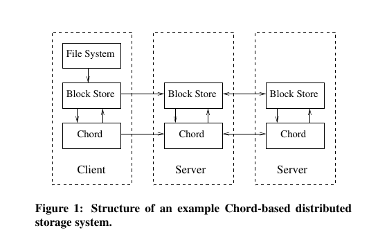
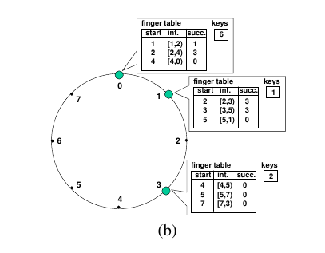
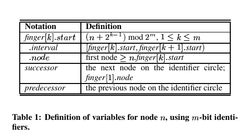

#Chord: A Scalable Peer-to-peer Lookup Service for Internet Applications

Author : Ion Stoica, Robert Morris, David Karger, M. Frans Kaashoek, Hari Balakrishnan
MIT Laboratory for Computer Science
chord@lcs.mit.edu
http://pdos.lcs.mit.edu/chord/

##Tóm tắt bài viết
Khi xây dựng một hệ thống phân tán theo mô hình ngang hàng (Peer-to Peer), chúng ta luôn phải giải quyết những vấn đề liên quan tới dữ liệu như sau: 

- Khi chúng ta muốn lưu một đối tượng dữ liệu - **data object** mới, thì data object mới đó sẽ nằm ở vị trí nào trong hệ thống ? (#)
- Khi chúng ta muốn lấy được một data object nào đó, làm thế nào để chúng ta biết được data object đó đang nằm ở vị trí nào trong hệ thống?
- Khi một node gia nhập hoặc rời khỏi hệ thống, chúng ta cần điều chỉnh lại vị trí lưu trữ các data object như thế nào?

(#): Đối tượng dữ liệu - data object là khái niệm chỉ một thực thể chứa thông tin được lưu dữ trong hệ thống. Ví dụ, trong hệ thống lưu trữ dữ liệu, data object có thể là 1 file, 1 thư mục, vv... Data object có thể coi là đơn vị lưu trữ cơ bản trong hệ thống lưu trữ dữ liệu.

Chord protocol, một trong những protocol giải quyết các vấn đề liên quan tới việc lưu trữ dữ liệu trên hệ thống phân tán sử dụng mô hình ngang, là một trong những prototcol giải quyết hiệu quả các vấn đề trên, bằng cách sử dụng mô hình bảng băm phân tán (Distributed Hash Table - DHT). Bài viết này sẽ giới thiệu về protocol này và cách protocol này giải quyết các vấn đề đã được đặt ra.
##Phần 1: Giới thiệu
Trong các mô hình phân tán, thì mô hình hệ thống ngang hàng (peer-to-peer system) là mô hình được sử dụng nhiều nhất khi xây dựng các ứng dụng liên quan đến lưu trữ dữ liệu phân tán. Mô hình peer-to-peer phù hợp cho các ứng dụng lưu trữ dữ liệu phân tán là nhờ vào các đặc điểm sau: Có khả năng scalable tốt, do các node trong hệ thống có vai trò như nhau, do đó đặc điểm tự nhiên của peer-to-peer system là khả năng cân bằng tải (load-balance), không bị hiện tượng ngẽn cổ chai, vv... 
 
 Khi xây dựng các hệ thống lưu trữ dữ liệu sử dụng mô hình peer-to-peer, một câu hỏi quan trọng mà chúng ta cần phải trả lời là: 
 
Trong hệ thống phân tán, một identifier *k* tham chiếu tới một data object được lưu trữ trên một trong các node của hệ thống. Làm sao để chúng ta tìm ra được node nào trên hệ thống đang lưu trữ data object này thông qua identifier *k* ?
 
Để giải thích tại sao câu hỏi trên lại quan trọng, chúng ta cần phải hiểu các khái niệm sau: Name, Indentifiers và Address
 
 **Name, Indentifiers và Address**
 Trong Distributed System, name là một đối tượng được dùng để định danh - đại diện - tham chiếu một thực thể trong hệ thống. Name có thể tồn tại dưới dạng một chuỗi ký tự, một chuỗi số, vv,... Thực thể được name đại diện có thể là một process, một nhóm các đối tượng, hoặc một thiết bị, một cảm biến nào đó trong bài toán về IoT, một data object vv...

Identifier là một name dùng để định danh đặc biệt cho thực thể. Identifier có tính chất sau:

- Một identifier chỉ đại diện cho tối đa một thực thể trong hệ thống.
- Một thực thể có ít nhất một identifier đại diện cho.
- Address là name có ý nghĩa như là cổng truy cập - access point của thực thể. Điều này nghĩa là, có được address của một thực thể, chúng ta có thể truy cập trực tiếp tới thực thể đó.

Bây giờ trở lại với vấn đề của chúng ta. Tham chiếu tới bài toán mà chúng ta đang giải quyết là xây dựng hệ thống lưu trữ dữ liệu, thì một data object được coi là một thực thể trong hệ thống, ví dụ như một tập tin, 1 file ảnh, một tệp văn bản,vv... Hay nói cách khác, trong hệ thống của chúng ta, các tệp/thư mục là các data object, và như đã nói ở phần trên, các data object được lưu trữ trên các node của hệ thống được đại diện bởi các identifier.

Lấy một trường hợp sử dụng thực tế về hệ thống lưu trữ, đó là khi người dùng mở một thư mục trên giao diện hệ thống, những gì người dùng nhìn thấy là tên của các tệp/thư mục chứa trong thư mục đó. Nhưng thực chất bên trong, dữ liệu mà hệ thống gửi về cho người dùng là các cặp **tên tệp/ tên thư mục**  - và **identifier của tệp/thư mục đó**. 

Tại sao chúng ta cần có identifier bên cạnh tên tệp/thư mục? Vì *identifier* đại diện cho têp/thư mục mà người dùng muốn truy cập, và nó có tính **duy nhất**- một identifier chỉ đại diện cho tối đa một thực thể trong hệ thống(#), còn trong hệ thống có thể có nhiều tệp/thư mục trùng tên nhau.
 
(#) Ý nghĩa của tính duy nhất này được hiểu theo ý nghĩa tương đối, ở trong hệ thống lưu trữ phân tán, tính duy nhất có nghĩa là không có 2 data-object trên hệ thống có chung 1 identifier. Ở phần sau các bạn sẽ thấy, node và và các data-object lưu trữ trên node đó được phép có cùng 1 identifier. 

Identifier của tệp/thư mục được sử dụng khi người dùng muốn xem nội dung một tệp/thư mục - data object nào đó, lúc này máy tính của người dùng sẽ gửi lên identifier của data object đó lên hệ thống và yêu cầu hệ thống gửi về nội dung của data object đó.  Để lấy được nội dung của một data object thông qua identifier của nó, chúng ta sẽ sử dụng identifer này để tìm ra địa chỉ của node đang lưu trữ data object đó.


Tại sao ở đây, chúng ta không lưu luôn địa chỉ của node trong hệ thống đang lưu trữ data object đó vào cùng với *identifier*, để hệ thống không mất thêm thao tác tìm kiếm địa chỉ của node đang lưu trữ data object mà chúng ta đang muốn lấy nội dung?

Lý do, là bởi vì trong hệ thống peer-to-peer system, *dữ liệu không nằm ở một vị trí cố định*. Khi nhu cầu sử dụng thay đổi, hệ thống có thể thêm vào một số node mới, hoặc tắt bớt một số node. Lúc này một số data object sẽ được di chuyển từ node bị tắt sang các node đang hoạt động, đồng nghĩa với việc địa chỉ truy cập tới data object đó bị thay đổi. Tuy nhiên, identifier của data object thì là duy nhất và không đổi, cho đến khi data object đó bị xóa khỏi hệ thống.

Nếu chúng ta lưu trữ địa chỉ data object cùng với identifier, thì mỗi lần thay đổi vị trí của data object, chúng ta lại phải cập nhật lại địa chỉ của data object. Thao tác này tốn rất nhiều thời gian để xử lý, do đó phương án lưu trữ địa chỉ của data object cùng với identifier là không hiệu quả.

Như vậy:

- 1 data object trong hệ thống luôn được đại diện bởi ít nhất một identifier
- Các ứng dụng truy cập vào nội dung của 1 data object thông qua identifier tham chiếu tới dữ liệu đó
- Một trong những nhiệm vụ của hệ thống lưu trữ dữ liệu phân tán, đó là tìm kiếm địa chỉ của node lưu trữ các data object dựa trên identifier của data object đó.

Nhu vậy, vấn đề chính cần phải giải quyết trong hệ thống lưu trữ phân tán, đó là khi chúng ta nhận được 1 identifier của một data object, chúng ta cần tìm ra vị trí lưu trữ data object này. Bên cạnh vấn đề này, một loạt các vấn đề khác xung quanh vấn đề trên cần được giải quyết, đó là:

- Chúng ta truy cập vào data object thông qua identifier, vậy nếu bây giờ ta có một data object mới cần được đưa vào hệ thống, làm sao để tạo ra một identifier cho data object đó? Và làm sao để chọn được 1 vị trí trên hệ thống (node nào) để lưu trữ data object mới này?
- Khi có nhiều node mới gia nhập hệ thống, thì số lượng node trên hệ thống tăng lên. Khi đó thời gian tìm kiếm vị trí lưu trữ data object trên hệ thống thay đổi như thế nào ? Chúng ta có cần di chuyển các data object từ các node hiện tại sang các node mới hay không ?
- Khi có một node rời khỏi hệ thống, chúng ta vẫn phải giữ lại những data object đang lưu trữ trong node đó trên hệ thống. Vậy những data object đó sẽ được di chuyển sang node nào trong những node còn lại, khi mà chúng ta đã nói, trong peer-to-peer các node có vai trò như  nhau?

Chord protocol được thiết kế để xử lý các vấn đề đã nêu ở trên - prototcol xử lý công việc lưu trữ và truy cập dữ liệu trong peer-to-peer system. Nguyên tắc hoạt động của Chord  là: 

- Chord sẽ gán cho mỗi một node trong hệ thống một identifier *m* xác định.
- Khi cần lưu trữ một data object mới, Chord sẽ tạo ra 1 identifier *k* tương ứng với data object này, identifier *k* và data object tạo thành 1 cặp **key-value**, trong đó  identifier *k* là **key**, còn nội dung của data object là **value**. Sau đó, hệ thống sẽ chọn ra node có identifier phù hợp với key *k* vừa được tạo ra, sau đó lưu trữ cặp **key-value**  trên node được chọn. Chord sử dụng một hàm băm cố định - **consistent hashing** để tạo ra identifier cho các node trên hệ thống và cho các data object. Nhờ việc sử dụng consistent hashing, Chord tạo ra tính chất cân bằng tải (balance load) trên hệ thống, có nghĩa là các node trên hệ thống sẽ lưu trữ số lượng data object gần như nhau, đồng thời, khi có node gia nhập hoặc rời khỏi  hệ thống, thì số lượng key phải điều chỉnh vị trí là nhỏ nhất.
- Yêu cầu truy cập một data object tương ứng với 1 identifier *k* từ người dùng có thể đến bất kỳ 1 trong các node của hệ thống. Để xác định node nào trên hệ thống đang lưu trữ data object ứng với identifier *k*, Chord sử dụng phương pháp điều hướng yêu cầu phân giải. Để điều hướng các yêu cầu, mỗi node trong chord sẽ có một bảng định tuyến (routing table). Trong trạng thái hệ thống ổn định, mỗi một node trong hệ thống N-node Chord có một bảng định tuyến có O(log N) dòng.

- Thao tác phân giải identifier *k* có độ phức tạp  O(log N). Khi có một node gia nhập hoặc rời đi trong hê thống, thì các bảng định tuyến trong các node phải điều chỉnh, sự điều chỉnh các bảng định tuyến tạo ra O((log N) ^2) thông điệp trên hệ thống.

Trên đây, chúng ta đã giới thiệu các nguyên tắc hoạt động cơ bản của Chord protocol, phần còn lại của bài báo sẽ giới thiệu một ví dụ về các hệ thống sử dụng Chord, đồng thời mô tả chi tiết về cách mà Chord thực hiện các nguyên tắc đã nêu ra như thế nào:

- Section 2 giới thiệu về các lợi ích khi sử dụng Chord protocol, và System model, là một số mô hình hệ thống phân tán sử dụng Chord.
- Section 3 giới thiệu Chord protocol và các mô tả của protocol này
- Section 4 giới thiệu các giải pháp Chord protocol sử dụng để xử lý các sự kiện nhiều node đồng thời gia nhập hệ thống và sự kiện 1 node rời đi hoặc gặp lỗi trong hệ thống.

##Phần 2: Mô hình hệ thống sử dụng Chord
Việc sử dụng Chord Protocol giúp peer-to-peer system có được các tính chất sau:

- Load balance: Chord là một trong các implementation của DHTs, do đó protocol này hoạt động như một hàm băm phân tán. Hàm băm này phân bố đều số lượng key lên tất cả các node trong hệ thống, vì vậy Chord sẽ phân bố đều lượng dữ liệu cần lưu trữ lên các node trên hệ thống, giúp cho hệ thống có được tính chất cân băng tải một cách tự nhiên.
- Decentralization: Chord là protocol phân tán, điều này có nghĩa là trong Chord, các node có vai trò tương đương nhau. 
- Scalability: Chi phí cho các thao tác trong Chord protocol chỉ là logarit của số lượng node. Do vậy, khi kích thước hệ thống thay đổi, thì chi phí để thực thi các thao tác trong Chord không thay đổi nhiều, do vậy, các implement của Chord trong hệ thống không cần phải điều chỉnh - thay đổi khi chúng ta thực hiện scale system.
- Availability: Chord tự động điều chỉnh các thông tin khi một node mới gia nhập, cũng như khi một node bị lỗi hoặc có một node rời khỏi hệ thống. Do vậy Chord đảm bảo tính sẵn sàng của hệ thống, tức là hệ thống luôn phân giải được một key bất kỳ tại bất kỳ thời điểm nào, cho dù trạng thái hệ thống liên tục thay đổi. 
- Flexible naming: Chord sử dụng Flat Naming, do đó các key sử dụng trong Chord không cần phải có cấu trúc.

 Khi một hệ thống sử dụng Chord Protocol, Chord sẽ tồn tại trong hệ thống dưới dạng một thư viện cung cấp các phương phục vụ việc tìm kiếm và sao lưu dữ liệu. Chord cung cấp 2 chức năng chính sau cho hệ thống: Thứ nhất, Chord cung cấp phương thức ```lookup(key)``` cho phép phần mềm xác định địa chỉ IP của node đang lưu trữ data object có identifier là ```key```. Thứ 2, Chord thông báo cho hệ thống các data object cần thay đổi vị trí khi có một node mới tham gia hoặc rời khỏi hệ thống. Việc di chuyển các data object từ node này sang node kia sẽ do hệ thống đảm nhận.
 
 Bên cạnh các chức năng tìm kiếm và lưu trữ dữ liệu, hệ thống có thể mở rộng cho Chord các chức năng mới như **caching**, **replication**, và **user-friendly naming data**. Tính chất flat-naming của Chord-identifier dễ dàng thực hiện các tính năng này. Ví dụ, một ứng dụng có thể nhân bản và sao lưu (replicate) các data object tại các node khác nhau băng cách tạo ra 2 identifier key cho data object, qua đó tạo ra 2 cặp **key-value** để lưu trữ 2 bản sao của dữ liệu vào 2 node khác nhau trên hệ thống.
Dưới đây là một số ví dụ thực tế về các hệ thống mà Chord sẽ là một giải pháp tốt:

- Cooperative Mirroring: Đây là hệ thống cho phép phân phối cân băng dữ liệu trên một loạt các server. Hãy tưởng tượng, chúng ta có một loạt các nhà phát triển phần mềm muốn đưa dữ liệu là các bản cài đặt phần mềm của hộ lên các server để phân phối. Trong đó, nhu cầu với từng phần mềm là rất khác nhau, trong từng giai đoạn nhu cầu đối với 1 phần mềm cũng khác nhau, có bản cài đặt phần mềm được tải rất nhiều ở phiên bản đầu, nhưng các lần cập nhật sau thì lại ít được tải về. Một cách tiếp cận hiệu quả cho việc phân phối các bản cài đặt này trên server, đó là các nhà phát triển phần mềm sẽ cùng hợp tác với nhau tạo ra một hệ thống phân tán peer-to-peer, trong đó server của từng nhà phát triển sẽ là các node trong hệ thống. Khi đó, hệ thống sẽ đảm bảo sự cân bằng tải của các server, cũng như phục vụ việc tạo ra các bản sao dữ liệu. Việc sử dụng hệ thống peer-to-peer tạo ra sự công bằng giữa các nhà phát triển, không ai có vai trò quan trọng hơn ai trong hệ thống.

- Time-Shared Storage: Là hệ thống lưu trữ dữ liệu cho các node có kết nối không ổn định. Hệ thống này được sử dụng khi chúng ta muốn một vài dữ liệu luôn luôn có mặt trên hệ thống, tuy nhiên các node trên hệ thống chỉ có mặt trên hệ thống vào một số khoảng thời gian, không có node nào liên tục có mặt trên hệ thống. Lúc này, giải pháp là, khi một node gia nhập vào hệ thống, nó sẽ nhận lưu trữ một phần dữ liệu từ node khác chuyển qua. Và khi nó rời khỏi hệ thống, nó sẽ chuyển dữ liệu mà nó đang lưu trữ sang một node khác trong hệ thống. Sử dụng Chord giúp giải quyết được bài toán thay đổi địa điểm lưu trữ trên hệ thống này, lúc này identifier của dữ liệu được lưu trữ sẽ đóng vai trò là key, và sử dụng key này ta sẽ luôn luôn biết được node nào đang lưu trữ dữ liệu của chúng ta vào bất kỳ thời gian nào. Các vấn đề đối với Time-Shared Storage cũng rất giống với các vấn đề của hệ thống Cooperative Mirroring, tuy nhiên Cooperative Mirroring tập trung vào sự cân băng tải giữa các dữ liệu lưu trên hệ thống, còn Time-Shared Storage tập trung vào tính sẵn sàng của dữ liệu trên hệ thống ( nghĩa là dữ liệu luôn có mặt trên hệ thống vào bất kỳ thời điểm nào, trong bất kỳ hoàn cảnh nào)

- Distributed Indexes
- Large-Scale Combinatorial Search

Sơ đồ dưới đây thể hiện kiến trúc three-layered cho một Cooperative Mirroring System. 

 

Cooperative Mirroring System là một hệ thống lưu trữ dữ liệu bao gồm 2 tầng, trong đó, File System Layer là tầng cao nhất, cung cấp giao diện sử dụng cho người dùng, giống như là một phần mềm quản lý file, cung cấp tương tác cho người dùng và xác thực . File System Layer này sẽ thể hiện các file và thư mục cho người dùng. Và khi người dùng muốn xem nội dung file hoặc thư mục nào đó trên hệ thống, nó sẽ truyền yêu cầu xuống tầng  “block storage” layer, với các tham số truyền vào yêu cầu là key của file - thư mục mà người dùng muốn xem nội dung ( Việc ánh xạ giữa key của file -thư mục với tên mà file - thư mục hiển thi là nhiệm vụ của File System Layer).

Block Storage Layer có nhiệm vụ là lưu trữ các block chứa nội dung của các file và thư mục và thực hiện việc truy xuất dữ liệu bằng cách sử dụng Chord. Khi nó nhận được yêu cầu đọc nội dung của file/thư mục tương ứng với key *k* được truyền tới, nó sẽ sử dụng Chord để xác định xem node nào trong hệ thống đang lưu trữ block dữ liệu tương ứng với *k*, sau đó nó sẽ gọi tới node này và yêu cầu node này cung cấp nội dung chứa trong block đó - nội dung của block dữ liệu này cũng chính là nội dung của file hoặc thư mục tương ứng với identifier key *k*. Sau đó, Block Storage Layer sẽ trả về nội dung file/thư mục cho File System Layer, và File System Layer sẽ hiển thị nội dung file/thư mục lên cho người dùng.

Tiếp theo, chúng ta cùng xem mô tả chi tiết về Chord protocol
##Phần 3: The Base Chord Protocol
Chord Protocol xác định phương thức giải quyết các vấn đề sau:
- Với một key **k**, tìm ra địa chỉ của node đang lưu trữ cặp key-value với key = k
- Phương thức xử lý sự kiện một node gia nhập vào hệ thống
- Phương thức xử lý để phục hồi hệ thống khi có một node trong hệ thống bị lỗi.
- Phương thức xử lý sự kiện một node rời khỏi hệ thống

Chương này trình bày version đơn giản của Chord Protocol. Version được trình bày trong chương này sẽ không trình bày phương thức xử lý khi có nhiều node gia nhập hoặc nhiều node gặp lỗi trên hệ thống đồng thời cùng một lúc (cocurrent joins or failures) Vấn đề này sẽ được trình bày trong section 5 
###Overview

Chúng ta cùng nhìn lại các tính chất của một hệ thống lưu trữ dữ liệu sử dụng Chord protocol:

- Trong hệ thống lưu trữ dữ liệu, thì **key** ở đây là identifier, còn **value** là data object
- Trong một thời điểm bất kỳ, các node trong hệ thống sẽ lưu trữ số lượng **key-value** gần như tương đương nhau
- Khi một node thứ n nào đó trong hệ thống gia nhập hoặc rời đi, số lượng các cặp **key-value** cần di chuyển vị trí là O(1/N)

- Chord protocol không yêu cầu điều kiện một node trong hệ thống phải biết được tất cả các node còn lại. Mỗi một node chỉ cần duy trì một lượng nhỏ thông tin định tuyến tới các node khác trong hệ thống, thông tin định tuyến này được sử dụng để phục vụ thao tác tìm kiếm của Chord. Thông tin định tuyến là một bảng định tuyến có kích thước O (log N) trường
- Thao tác tìm kiếm  địa chỉ của node đang lưu trữ cặp key-value (với value là data object cần truy cập) khi biết key = identifier *k* cần O(log N) thông điệp.

- Hệ thống sử dụng Chord cần phải cập nhật bảng định tuyến khi có một node gia nhập hoặc rời khỏi hệ thống. Sự kiện 1 node gia nhập hoặc rời khỏi hệ thống tạo ra O(log^2 N) thông điệp trên hệ thống.
 
Theo các nguyên tắc của Chord, thì các node trong hệ thống và các dữ liệu được lưu trữ trong hệ thống đều được gán một identifier xác định bằng cách sử dụng **Consistent Hashing**. Chúng ta sẽ tìm hiểu xem Chord sử dụng **Consistent Hashing** nào để tạo ra identifier cho các thực thể dữ liệu và các node, và sau đó sắp xếp dữ liệu vào lưu trữ tại các node trên hệ thống.
###Consistent Hashing

Hàm băm cố định được sử dụng trong Chord sẽ gán cho các node và các cặp **key-value** sử dụng trong hệ thống một **m-bit identifier** bằng cách sử dụng các hàm băm như SHA-1. m-bit identifier của một node được tạo ra bằng cách hashing địa chỉ IP của node đó, trong khi đó m-bit identifier của cặp **key-value** được tạo ra bằng cách hashing **value** hoặc một phần của **value** . Điều quan trọng khi sử dụng Chord protocol, đó là m phải đủ lớn để không xảy ra trường hợp có 2 node hoặc key sau khi hashing có cùng chung một m-bit identifier.

Sau khi kết thúc quá trình hashing, các **m-bit identifer** tương ứng với các node được xếp lên một ring logic.  Saud đó, mỗi khi ta muốn lưu trữ một dữ liệu mới lên hệ thống, việc đầu tiên cần làm là sử dụng **consistent hashing** để tạo ra một **m-bit identifier** cho dữ liệu đó. Sau đó, cặp key-value (m-bit identifier và dữ lệu) sẽ được lưu trữ trên node có m-bit identifier là **n** có tính chất: Hoặc m bằng k, hoặc m là identifier đầu tiên nằm phía sau giá trị **k** trên ring logic, ta gọi node **n** là **succ(k)**.

Để đáp ứng các tính chất yêu cầu đặt ra với Chord protocol, consitent hashing được thiết kế để cho phép các node gia nhập hoặc rời khỏi hệ thống mà không tạo ra quá nhiều xáo trộn và thay đổi. Để duy trì tính chất này, khi một node *n* ra nhập hệ thống, nó sẽ trao đổi và điều chỉnh các cặp **key-value** với node succ(n). Khi node *n* rời khỏi hệ thống, nó sẽ chuyển toàn bộ các cặp **key-value** mà nó đang lưu trữ sang node succ(n).
 
 
 Các tính chất dưới đây đã chứng minh, đối với **consistent hashing**:
 
 **Định lý 1**
*
Với một hệ thống có **N** node và **K** cặp key-value, thì hệ thống sẽ có các tính chất sau với xác suất cao (high-probability) :
 - Mỗi một node trong hệ thống lưu trữ tối đa (1+*e*)K/N cặp key-value
 - Khi node (n+1) gia nhập hoặc rời khỏi hệ thống, hệ thống cần di chuyển  O(K/N) cặp (key-value) giữa các node trong hệ thống.
 *
 Định lý 1 chỉ ra rằng cận trên của *e* là O(log N).  Chúng ta có thể giảm *e* tới hằng số, nếu như mỗi một node thật trên hệ thống triển khai O(log N) node ảo - (virtual node) cùng với O(log N) identifier ảo tương ứng. 
 
 Trong đa số các trường hợp, chúng ta sẽ chọn hàm **consisten-hashing** là hàm standard SHA-1. 

Sau khi tìm hiểu được quá trình đánh tạo identifier cho các node, các dữ liệu và cách lưu trữ cặp identifier-dữ liệu lên **successor node**, chúng ta cùng xem một hệ thống sử dụng Chord protocol sẽ dùng phương pháp nào để tìm kiếm node nào trên hệ thống đang lưu trữ dữ liệu tương ứng với một identifier *k* cho trước. 
###Scalable Key Location
Một trong những thao tác chính mà Chord Protocol phục vụ, đó là thao tác tìm kiếm. Thao tác tìm kiếm trong Chord được bắt đầu, khi một node trong hệ thống nhận được yêu cầu phân giải một identifier *k* từ đối tượng *x* trong hệ thống. Lúc này thuật toán định tuyến của Chord sẽ điều hướng yêu cầu qua một số node trong hệ thống cho đến khi yêu cầu phân giải tới node succ(k). Lúc này node succ(k) sẽ phân giải identifier *k* và trả kết quả phân giải về đối tượng *x*. 

Thuật toán điều hướng yêu cầu cơ bản của Chord được thực hiện nhờ vào tính chất : mỗi node i trong hệ thống đều lưu trữ vị trí của node tiếp theo nó - successor của nó, node succ(i). Do đó, nguyên tắc đơn giản của thuật toán điều hướng cơ bản, là nó sẽ điều hướng yêu cầu sang node succ(i), nếu như nó không phải là node phân giải được identifier **k** (không phải succ(k)). Tuy nhiên thuật toán cơ bản này không hiệu quả, vì chi phí để thực hiện yêu cầu phân giải lúc này là O(N), tức là yêu cầu truy vấn trong trường hợp xấu nhất sẽ đi qua N node để tìm ra node phân giải cho identifier **k**.

Để quá trình phân giải identifier trở nên nhanh chóng, Chord duy trì các thông tin điều hướng trên các node, như ta đã nói ở phần trước, là routing table, routing table chứa O(log N) trường. Thông tin trong routing table không cần thiết phải luôn luôn chính xác, tuy nhiên thông tin về successor của một node bất kỳ thì luôn luôn cần chính xác.

Ta biết rằng m là số lượng bit của key/node identifier. Routing table của mỗi node trong hệ thống có kích thước là m entry (m dòng). entry thứ *i* (1<=i<=m)trong routing table sẽ lưu trữ thông tin của node có identifier là *s*, với ```s = succ([n+2^(i-1)] mod 2^m). ```. Node *s* được gọi  là finger thứ *i* của node n, được ký hiệu *n. finger[i].node. Thông tin của node *s* lưu trên entry bao gồm: identifier của node (s), đia chỉ IP + port của node s. Chúng ta có thể thấy rằng, trên bảng định tuyến thì finger đầu tiên **n.finger[1]** cũng chính là **succ(n)**, và chúng ta sẽ sử dụng thuật ngữ **succ(n**) nhiều hơn là **n.finger[1]**

Xét một ví dụ sau: ta có sơ đồ logic ring của một hệ thống với m =3 như sau:

 

Theo sơ đồ trên, trên hệ thống đang có 3 node 0,1,3. Trên node 1, bản finger table có 3 entry, 3 entry này chỉ ra các successor node của 3 identifier là 2, 3 và 5. Nhìn vào sơ đồ, ta thấy được, succ(2) =3, succ(3)=3, succ(5)=0. Routing table của node 3 có 3 interval là [4,5), [5,7) và [7,3)

Nhờ sử dụng phương thức định tuyến này, Chord protocol có 2 thuộc tính quan trọng: Thứ nhất, trên mỗi node chỉ lưu trữ một bảng định tuyến chứa thông tin về một số lượng nhỏ (m) node trên hệ thống. Thứ 2, bảng định tuyến không có đủ thông tin để chỉ ra successor của *identifier k* là node nào. Ví dụ, theo sơ đồ phía trên, *node 3* không xác định trực tiếp được successor của *identifier 1*

Với các tính chất trên, việc tìm kiếm succ(k) từ node n sẽ sử dụng phuong pháp sau: Nếu node n biết được nó không phải succ(k), nó sẽ bắt đầu tìm kiếm node có identifier gần *k* hơn so với nó, node gần với k hơn sẽ biết nhiều về khu vực ring logic chứa k trong đó. Do vậy, n sẽ tìm trên bảng định tuyến node *j* gần *k* nhất và hỏi *j* về node nằm gần *k* nhất là node nào. Quá trình trên được lặp lại cho đến khi chúng ta tìm được *precedessor(k)* - là node phía sau *identifier k* trên logic ring, *precedessor(k)*!=*k*. Ví dụ precedessor(6) = 3, precedessor(3) = 1, precedessor(0) = 3.

Chúng ta cùng xem implement của thuật toán tìm kiếm succ(k) trên hệ thống. Một số ký hiệu được sử dụng trong thuật toán được mô tả ở bảng sau:
 
Thuật toán giải quyết quá trình tìm kiếm succ(k):

```python
#ask n to find id's successor
n.find_successor(id):
	x = n.find_predecessor(id)
	return x.succesosr

#function which search predecessor of identifier id
n.find_predecessor(id):
	x=n
	while( id not_belong (x, x.successor]  ):
		 x = x.closest_preceding_finger(id)
		 return x 
#find closest node to id in finger table of a node
n.closest_preceding_finger(id):
	for i = m downto 1:
		if( finger[i].node belong (n, id) ):
			return finger[i].node
	return n
```

Giải thích thuật toán:
Thuật toán đi tìm ra successor của id bằng cách tìm ra predecessor của id, sau đó tìm node x =  successor( predecessor(id)). x cũng chính là successor(id).

để tìm ra predecessor(id), thuật toán sử dụng hàm n.find_predecessor(id). Nhiệm vụ của hàm này là: Đầu tiên kiểm tra xem n có phải là  predecessor của id hay không ? Nếu không phải,  nó gọi hàm *closest_preceding_finger(id)*. Hàm này sẽ làm nhiệm vụ tìm ra xem trong routing table của n node x nào thỏa mãn 2 điều kiện:
- Đứng sau *id* trên logic ring so với *n* theo chiều kim đồng hồ. (#)
- Gần nhất với id so với các entry khác trên routing table. 

Ở đây, xuất hiện 1 câu hỏi, tại sao trong hàm *closest_preceding_finger(id)*, ta lại xét điều kiện 
*finger[i].node belong (n, id)* ?
Lý do là điều kiện này tương đương với điều kiện *finger[i].node* đứng sau *id* so với *n*, vì nếu 
 *x* = *finger[i].node* đứng sau *id* so với *n* thì một vòng xoay thứ tự tương đối giữa 3 identifier này được vẽ ra : x->id->n->x->id->n->... Rõ ràng ta thấy rằng, x nằm trong *khoảng logic (n, id)*
Vậy tại sao lại là *khoảng logic (n,id)* mà không có n và id ?

Lý do là theo tính chất của routing table, không có bất cứ finger[i].node nào có giá trị = n. Thứ 2, là id có trong khoảng chỉ có ý nghĩa khi ta xét tới trường hợp x=id. Nhưng khi x=id, thì x lại chính là successor của id, mà ta đang tìm kiếm predecessor của id, do vậy không thể đưa giá trị id vào khoảng.

Câu hỏi thứ 2, là tại sao ta lại xét vòng lặp trong hàm *closest_preceding_finger(id)* từ m về 1 mà không xét từ 1 tới m như bình thường ?

Nếu xét từ m về 1, thì nếu finger[m].node thỏa mãn điều kiện (#) thì chăc chắn finger[m].node sẽ là node có khoảng cách nhỏ nhất, vì trên ring logic, thứ tự sắp xếp của các node trong routing table như sau:
```
 n-> finger[1]-> finger[2]-> finger[3]-> ... -> finger[m]-> n-> finger[1]...
``` 
 Nếu finger[m] thỏa mãn (#) thì id nằm giữa finger[m] và n, và nhìn vào thứ tự sắp xếp các node ở trên chúng ta chăc chắn rằng m thỏa mãn điều kiện node gần nhất. Trong trường hợp m không thỏa mãn điều kiện #, chúng ta tiếp tục xét tới m-1, và cũng với lý do tương tự như trên, nếu m-1 thỏa mãn #, thì chăc chắn m-1 thỏa mãn điều kiện node gần nhất ... các node còn lại trong routing table cũng tương tự như vậy khi vòng for downto được thực hiện.
 
 Sau khi giải thích rõ ràng nguyên tắc hoạt động của hàm  *closest_preceding_finger(id)*, chúng ta xét tiếp phần còn lại của thuật toán. 
 
 Lúc này, sau khi tìm được node gần nhất với id trên routing table, thuật toán kiểm tra xem nó có phải là predecessor của id hay không ? Nếu nó là predecessor của id, thuật toán hoàn thành. Nếu không phải, thì thuật toán gọi đệ quy tiếp tục (chính là vòng lặp ```while( id not_belong (x, x.successor]  )```, n gửi hàm remote RPC tới node này, yêu cầu node này **tìm node gần nhất với id trên bảng định tuyến của nó,** ,vv..., và khi chu trình tìm node gần nhất này lặp lại, thì chúng ta càng ngày càng  gần id, cho đến khi chúng ta tìm được predecessor của id, thuật toán hoàn thành.
 
**Định lý 2**
*Trong một hệ thống sử dụng Chord protocol thì tính chất sau được đảm bảo với xác suất cao: Tổng số node mà chúng ta phải đi qua để tìm ra successor node của identifier k là O(log N)*

Chứng minh:
Giả sử node *n* nhận được một yêu cầu phân giải identifier *k*. Ta đặt *p* là  predecessor node của *k*. Chúng ta sẽ phân tích để xem số lượng các thao tác cần thiết để tìm ra *p*.

Với n = p, thuật toán đi qua 1 node. Với n != p, n sẽ chuyển tiếp yêu cầu tới closest predecessor *k* trên bảng định tuyến của nó. Do tổng tất cả các interval trên bảng định tuyến của n phủ kín hết các giá trị trong logic ring (trừ giá trị n, nhưng ở điều kiện trước n!=p), do đó node p cần tìm sẽ nằm trong 1 trong các interval trong bảng định tuyến của n. Giả sử interval thứ i trong bảng định tuyến của node n chứa p (1<=i<=m). Do interval này không thể là interval trống (chắc chắn có node p trong interval này), do đó *closest_preceding_finger(id)* sẽ là một node nằm trong interval n. Đặt *f* = *closest_preceding_finger(id)*, khoảng cách bé nhất giữa *n* và *f* là ```2^(i-1)```. Nhưng do f và p cùng nằm trong interval thứ i, do đó khoảng cách giữa f và p lớn nhất là ```2^(i-1)```. Ta có thể thấy ```d(n->f)>d(f->p)```, nên ```d(f->p) < 1/2 d(n->p)```. Như vậy khi chuyển yêu cầu phân giải từ n tới f, khoảng cách giảm đi 2 lần. Tiếp tục như vậy, f lại chuyển yêu cầu tới một node ```f'``` theo phương thức tương tự,vv... Thì sau m lần, trong trường hợp xấu nhất khoảng cách giữa node chuyển tiếp với node p sẽ giảm khoảng ```2^m``` lần, khi đó khoảng cách giữa node chuyển tiếp tới p là ```N/2^m -->1```. Lúc này hệ thống đơn giản là thực hiện 1 bước nhảy tới node *p*. Ta lại có ```log N <= log(2^m) =m```, do đó chúng ta có thể kết luận sau O(log N) node, hệ thống sẽ tìm ra predecessor node của *k*, và sau O(log N) + 1 = O(log N) node, hệ thống tìm ra successor nde của *k*. Vậy định lý 2 là đúng.

Tiếp theo, chúng ta sẽ xem Chord protocol làm thế nào để xử lý sự kiện một node mới gia nhập hệ thống.
###Node Joins

Trong một hệ thống thực, môi trường hệ thống thường xuyên bị biến động, các node có thể gia nhập hoặc rời khỏi hệ thống vào bất kỳ thời gian nào. Do vậy, chúng ta phải xây dựng các phương thức di chuyển vị trí các dữ liệu, các cặp **key-value**  giữa các node trong hệ thống khi các sự kiện trên xảy ra, để đảm bảo rằng chúng ta luôn đảm bảo được rằng, xác định được vị trí của mọi key trên hệ thống - tính nhất quán của hệ thống. Tính chất này chỉ được đảm bảo khi 2 điều kiện sau luôn được giữ nguyên:
1. Successor của các node luôn được duy trì đúng (tức là cần cập nhật successor cho các node khi xảy ra sự thay đổi trong hệ thống).
2. Với mọi key *k*, thì *successor(k)* luôn luôn là nơi lưu trữ cặp *key-value* tương ứng với *k*

Đây là 2 điều kiện cần thiết để đảm bảo tính nhất quán của hệ thống sử dụng Chord protocol. Còn để hệ thống luôn đảm bảo phân giải identifier trong thời gian O(log N), chúng ta phải đảm bảo luôn duy trì sự đúng đắn của các bảng định tuyến - khi có sự thay đổi về node trong hệ thống, bảng định tuyến trên các node cần được cập nhật lại.

Phần này trình bày phương thức Chord protocol xử lý sự kiện có một node mới gia nhập hệ thống. Phương thức xử lý trường hợp có nhiều node cùng gia nhập vào hệ thống một lúc và trường hợp khi một node trong hệ thống bị lỗi (failure) sẽ được trình bày trong chương 5.

*Định lý 3*
Trong hệ thống sử dụng Chord protocol, tính chất sau được đảm bảo với xác suất cao: Khi xảy ra sự kiện một node gia nhập hoặc rời khỏi hệ thống, hệ thống sẽ tạo ra O( (log N)^2 ) thông điệp để điều chỉnh các bảng định tuyến và xây dựng lại tính nhất quán của hệ thống.

Để đơn giản hóa cơ chế xử lý sự kiện 1 node gia nhập hoặc rời khỏi hệ thống, mỗi một node trên hệ thống sẽ lưu trữ thông tin về predecessor node của node đó -  là node nằm phía sau node đó trên ring logic. Thông tin lưu trữ là Identifier và địa chỉ IP của predecessor node, thông tin này được sử dụng để từ một node ta có thể đi ngược tới các node còn lại trên ring logic.

Khi một node *n* mới gia nhập hệ thống, để đảm bảo tính nhất quán của hệ thống, Chord protocol sẽ phải thực hiện 3 công việc sau:
- Khởi tạo predecessor và bảng định tuyến cho node *n*
- Cập nhật các bảng định tuyến và predecessor của các node còn lại trong hệ thống tương ứng với identifier của n.
- Thông báo cho software layer ở tầng trên Chord protocol sự thay đổi của hệ thống để tầng này tiến hành di chuyển các cặp key-value bị ảnh hưởng sang node n

Chúng ta giả sử node ```n``` mới gia nhập hệ thống đã biết được định danh và địa chỉ IP của một node ```n_ext``` đang tồn tại trên hệ thống. Node ```n``` sẽ sử dụng node ```n_ext``` để thực thi việc khởi tạo trạng thái cho bản thân nó, sau đó node ```n``` sẽ tự thêm nó vào hệ thống bằng cách thực hiện các công việc sau:

- **Khởi tạo bảng định tuyến và xác định predecessor node cho node mới gia nhập**: Node ```n```sẽ xác định predecessor của nó và tạo ra bảng bảng định tuyến bằng cách sử dụng thuật toán *init_finger_table*. Trong thuật toán này,  node ```n``` sẽ phải tìm ra successor cho từng entry trong bảng định tuyến, với phương pháp mặc định, mỗi thao tác tìm successor tương ứng với 1 entries sẽ có độ phức tạp là O(log N), do đó độ phức tạo của thao tác khởi tạo tất cả các entry trong bảng định tuyến là O( (log N)^2 ).

Để tối ưu hóa hiệu năng thuật toán, node ```n``` có thể sử dụng các thông tin trong node lân cận của nó để trợ giúp quá trình khởi tạo bảng định tuyến và xác định predecessor, vì các thông tin trong bảng định tuyến của n sẽ tương tự thông tin trong bảng định tuyến của các node lân cận nó.

-**Cập nhật bảng định tuyến của một số node trong hệ thống**: Do sự kiện node *n* gia nhập làm thay đổi cấu trúc của ring logic trong hệ thống, chúng ta cần cập nhật một số bảng định tuyến của một số node. Hàm *update_finger_table* sẽ thể hiện thao tác cập nhật lại các bảng định tuyến trên các node. Node *n* sẽ trở thành trường thứ *i* trong bảng định tuyến của node *p*, nếu như: (1) *p* cách *n* ít nhất ```2^(i-1)```, và (2) node trong trường thứ *i* hiện tại của *p* là successor của *n*. Node đầu tiên trong hệ thống sẽ gặp 2 điều kiện này là predecessor node của identifier ```n- 2^(i-1)```. Do vậy, khi cho trước n, thuật toán sẽ bắt đầu tại entry thứ i của node *n*, và tiếp tục đi theo chiều kim đồng hồ trên logic ring cho đến khi gặp node có **finger thứ i** là predecessor của *n*

Thực nghiệm chỉ ra rằng, số lượng node trên hệ thống cần cập nhật khi có một node mới gia nhập hệ thống là O(log N) node. Tìm kiếm các node cần cập nhật và cập nhật bảng định tuyến cho các node này mất tổng thời gian là ```O( (log N)^2 )```. Một thuật toán khác giúp giảm thời gian này xuống ```O(log N)```, thuật toán này sẽ được trình bày ở chương sau.
_**Di chuyển các cặp key-value tới vị trí mới trong hệ thống**: Công việc cuối cùng cần thực hiện  khi một node *n* gia nhập hệ thống, đó là chúng ta cần di chuyển mọi key *i* đã có trong hệ thống thỏa mãn điều kiện: *n* là successor node của key *i*. Công việc di chuyển này phụ thuộc vào tầng sortware layer phía trên tầng Chord protocol, tầng này sẽ thực hiện nhiệm vụ di chuyển các cặp *key-value* không đúng vị trí trong hệ thống sang node mới. Theo đó, node *n* sẽ là node successor của tất cả các key *i* thỏa mãn 2 điều kiện: (1) trước đó nằm ở node successor của n  trên ring logic và (2) *n* phía sau *i* theo chiều kim đồng hồ trên ring logic. Việc di chuyển key được thực hiện khi *n* yêu cầu successor node của nó di chuyển các cặp key-value ở không đúng vị trí qua *n*.

Đây là pseudo code của quá trình xử lý sự kiện 1 node gia nhập hệ thống.

```python
#define successor finger[1].node

def n.join(n_ext):
	#if system has at least 1 node before node n join system 
	if(n_ext):
		n.init_finger_table(n_ext)
		n.update_others()
		#move_keys in range (predecessor,n] from successor to n
	
	else:#if n is first node in network
		for i = 1 to m:
			n.finger[i].node = n
		n.predecessor = n

def n.init_finger_tale(n_ext):
	n.finger[1].node =  n_ext.find_successor(finger[1].start) # n.finger[1].node == n.successor
	n.predecessor =  n.successor.predecessor
	n.successor.predecessor = n
	for i = 1 to m-1:
		if n.finger[i+1].start  belong [n,n.finger[i].node):#[n, n.finger[i].node) or [n, n.finger[i].node] ???
			n.finger[i+1].node = finger[i].node
		else:
			n.finger[i+1].node = n_ext.find_successor(n.finger[i+1].start)
	
#update all nodes whose finger table may be contain n
def n.update_others():
	for i =1 to m:
		#find last node p whose i th finger might be n
			p = find_predecessor( n - 2^(i-1) )
			p.update_finger_table(n,i)

#if s is i th finger node of n, update n's finger table with s
def n.update_finger_table(s,i):
	if s belong [n, n.finger[i].node):
		n.finger[i].node = s	
		p = n.predecessor	#get predecessor node of n
		p.update_finger_table(s,i)
```
Giải thích phương thức ```n.update_others()```:
Nhiệm vụ của phương thức này là: khi n gia nhập hệ thống, phương thức này sẽ update bảng định tuyến của các node đã tồn tại trong hệ thống. Như đã giới thiệu bảng định tuyến của hệ thống chỉ ra các successor của các identifier ```x+ 2^(i-1)``` trong node *x* (1<=i<=m). Khi một node *x* trên hệ thống thay đổi bảng định tuyến vì sự xuất hiện của node *n*, thì *n* phải nằm trong ít nhất một entry trong bảng định tuyến của node đó. Giả sử entry đó là entry thứ i, thì khi đó *n* là successor của identifier ```x+2^(i-1)```. Lúc này, khoảng cách giữa *n* và node *x* ít nhất là ```2^(i-1)```, nên node *x* nằm sau giá trị ```n- 2^(i-1)``` trên ring logic. Vì vậy, node x đầu tiên **có thể có** entry thứ *i* trên bảng định tuyến chứa *n* sẽ là predecessor node của identifer ```n - 2^(i-1)```. 

Để kiểm tra xem node *x* này có thực sự nhận *n* làm  entry thứ *i* trên bảng định tuyến hay không, chúng ta kiểm tra xem *n* có **đứng giữa** *x* và **identifier của node hiện tại** đang nằm trên entry thứ *i* trên bảng định tuyến của *x* - **x.finger[i].node** hay không ( trên thuật toán, ký hiệu *n* sẽ  tương ứng với *x*).
Ở đây xảy ra 2 trường hợp:

- Nếu điều này đúng, *n* sẽ thay thế *x.finger[i].node* hiện tại, và sẽ xảy ra khả năng node phía sau x cũng nhận *n* làm entry thứ i trên bảng định tuyến của nó. Lúc này chúng ta sẽ chuyển sang xét predecessor của *x*. Nếu điều
- Nếu điều này sai, thì các entry thứ i trên bảng định tuyến của x và các node phía sau nó vẫn sẽ giữ nguyên giá trị hiện tại.

Ở đây tại sao chúng ta không cần xét các node đứng trước x, với x là predecessor node của identifier ```n - 2^(i-1)``` ? Vì x là node đầu tiên đứng sau identifier ```n - 2^(i-1)```, do đó node đứng trước x sẽ đứng trước identifier này, hay khoảng cách giữa node đứng trước x và n sẽ nhỏ hơn *2^(i-1)*, do đó n sẽ không thể nào là entry thứ i trên bảng định tuyến của các node đứng trước x.

##Phần 4: Concurrent Operations and Failures
Trong thực tế, khi sử dụng các hệ thống phân tán, chúng ta phải xử lý các trường hợp nhiều node đồng thời cùng gia nhập hệ thống vào cùng 1 lúc, và trường hợp 1 node trong hệ thống rời đi hoặc gặp lỗi (#). Chương này mô tả cách thức Chord protocol xử lý các trường hợp trên.

###Stabilization
Thuật toán xử lý sự kiện node mới gia nhập vào hệ thống được trình bày ở phần 4 cho thấy, khi 1 node gia nhập vào hệ thống, chúng ta cần cập nhật bảng định tuyến của tất cả các node, để đảm bảo tính chính xác của các bảng định tuyến, vì chỉ khi các bảng định tuyến có tính chính xác, thì quá trình phân giải identifier trên hệ thống mới đạt được tốc độ O(log N). Tuy nhiên, tính chính xác của các bảng định tuyến rất khó có thể được duy trì trong trường hợp nhiều node mới đồng thời gia nhập vào hệ thống lớn cùng một lúc. Lúc này, nếu duy trì được tính chính xác của bảng định tuyến trên các node, thì khối lượng tính toán để điều chỉnh các bảng định tuyến trên các node là rất lớn, dẫn tới việc hệ thống mất rất nhiều thời gian để đạt được trạng thái ổn định (stabilization). Vì vậy, khi xử lý trường hợp này, chúng ta cần phải cân bằng giữa 2 yếu tố sau: mức độ chính xác của hệ thống và hiệu năng của hệ thống. 

Để xử lý các sự kiện (#), chúng ta sẽ xây dựng một thuật toán xử lý node join mới, mở rộng Chord theo hướng tập trung ổn định hệ thống trong trường hợp các sự kiện (#) xảy ra, thay vì đảm bảo cả 2 yếu tố như thuật toán trước đó: (1) ổn định hệ thống và (2) thuật toán tìm kiếm có độ phức tạp O(log N). Yêu cầu đối với protocol này, đó là phải đảm bảo tính đúng đắn của quá trình lookup trên hệ thống. Để thực hiện yêu cầu này, thì thuật toán phải đảm bảo rằng:

**Với mọi node trong hệ thống, successor pointer ở 1 node x bất kỳ luôn trỏ đúng vào successor node của x, kể cả trong trường hợp cấu hình hệ thống thay đổi. (##**)

 
 Điều kiện (##) vừa được nêu ra có liên quan gì tới vấn đề mà chúng ta đã nêu ra: cân bằng giữa mức độ chính xác của hệ thống với hiệu năng của hệ thống ?
 
Khi (##) được thực hiện, thì hệ thống đạt được tính ổn định - tức là quá trình lookup trên hệ thống diễn ra chính xác. Việc thực hiện (##) tốn ít thời gian hơn nhiều so với việc phải đảm bảo cả 2 điều kiện của thuật toán xử lý node join mà ta trình bày lúc trước: (1)Đảm bảo successor pointer của mọi node luôn chính xác và (2) đảm bảo các entries trong bảng định tuyến của mọi node chính xác. Vì vậy, khi sử dụng hướng tiếp cận mới, hệ thống đảm bảo được: (1) hệ thống xác lập lại được tính ổn định và (2)thời gian để ổn định lại hệ thống từ, lúc sự kiện các node đồng thời gia nhập xảy ra, là ngắn nhất.

Khi đảm bảo điều kiện (##) được thực hiện, hệ thống sẽ đạt được tính ổn định sau một khoảng thời gian ngắn. Lúc này, hệ thống sẽ tiến hành kiểm tra và điều chỉnh lại các bảng định tuyến bị sai lệch bằng cách sử dụng các successor pointer trên các node. Sau khi các bảng định tuyến được điều chỉnh thành công, thuật toán lookup trên hệ thống sẽ có thể tiếp tục sử dụng bảng định tuyến để phục vụ quá trình lookup, thao tác lookup sẽ lại có độ phức tạp là O(log N). 

Khi các node mới gia nhập hệ thống thì một vùng trên ring logic nơi có các node mới đó sẽ bị ảnh hưởng, và trước khi hệ thống trở lại trạng thái ổn định, quá trình tìm kiếm 1 key nào đó trên hệ thống sẽ rơi vào 1 trong 3 trường hợp sau:
- Hệ thống tìm được đúng **successor node** của key đó bằng các bảng định tuyến sau *O( log N)* bước.
- Hệ thống vẫn tìm đúng **successor node** của key đó bằng cách sử dụng successor pointer, nhưng các bảng định tuyến thì khong còn đúng nữa. Lúc này quá trình tìm kiếm mất *O(log N)* bước. 
- Hệ thống chưa tạo lại được **succeesor pointer** đúng cho một số node trên hệ thống trong vùng ảnh hưởng, hoặc cặp **key-value** cần thay đổi vị trí chưa kịp được chuyển sang node mới. Lúc này quá trình tìm kiếm thất bại, và Phần mềm ở tầng phía trên Chord sẽ được thông báo rằng dữ liệu không được tìm thấy, và nó có thể thử tìm kiếm lại sau khi hệ thống ổn định trở lại.

Thuật toán mới được trình bày dưới đây sẽ được sử dụng để xử lý sự kiện nhiều node cùng gia nhập hệ thống cùng 1 lúc, thay cho thuật toán xử lý node join đã trình bày ở phần trước:

**Alogrithm handle_concurrent_joins**
```python
def n.join(n_ext):
	n.predecessor = null
	n.successor = n_ext.find_successor(n)

#periodically verify n's immediate successor,
#and tell the successor about n.
def n.stabilize():
	x = successor.predecessor
	if x belong (n, n.successor):
		n.successor = x
	n.successor.notify(n) # this mean x will be notified about n, because x== n.successor
#n_ext think it might be n's predecessor
def n.notify(n_ext):
	if n.predecessor is nil or n_ext belong (predecessor, n):
	 	n.predecessor = n_ext
#periodically refresh finger table entries
def n.fix_fingers():
	i = random_index > 1 into finger[] #because finger[1] is n's successor, we don't need check it
	finger[i].node = n.find_successor(finger[i].start);
```

Khi một node *n* gia nhập hệ thống, đầu tiên nó thực hiện phương thức **n.join(n_ext)**, với n_ext là một node đã tồn tại trên hệ thống. Phương thức **join** sẽ sử dụng node *n_ext* để tìm immediate succesosr node của node *n*. Khi phương thức join được thực thi, các node còn lại trong hệ thống sẽ chưa biết về sự tồn tại của *n*. 
 
Trong thuật toán mới này, các node trong hệ thống sẽ định kỳ thực thi phương thức **stabilize**. Khi node **n_ext** nào đó trong hệ thống thực thi phương thức **stabilize**, ta gọi **n_ext_succ** là node đang được  **n_ext successor pointer** trỏ tới.  Node **n_ext** sẽ hỏi **n_ext_succ** xem predecessor của nó hiện tại là node nào. Giả sử **n_ext_succ** phản hồi node **p**, lúc này **n_ext** sẽ kiểm tra xem **p** có phải là successor node thật sự của nó hay không, trường hợp này xảy ra khi node p mới gia nhập hệ thống. Ngoài ra,  phương thức **stabilize** sẽ thông báo cho **n_ext_succ** sự tồn tại của node **n**, lúc này **n_ext_succ** sẽ kiểm tra lại xem **n** có phải là predecessor thực sự của nó hay không, trong trường hợp n gần với nó hơn predecessor hiện tại của nó .

Sau đây là một ví dụ đơn giản: Giả sử node n gia nhập hệ thống, và ID của nó - **n** nằm giữa 2 node **n_p** và **n_s**. Lúc này, successor của **n** sẽ là **n_s**. Đồng thời, lúc này **n** sẽ thông báo cho **n_s** về sự có mặt của nó, và **n_s** sẽ kiểm tra để nhận **n** làm predecessor của nó. Khi node n_p thực hiện phương thức **stablilize**, successor pointer của **n_p** đang trỏ vào ** n_s**.** n_p** sẽ hỏi **n_s** predecessor hiện tại của **n_s** là node nào, sau đó **n_p** sẽ nhận **n** làm successor node mới. Cuối cùng **n_p** sẽ thông báo cho **n** biết về nó, và **n** sẽ nhận **n_p** làm predecessor. Tại thời điểm này, successor pointer và predecessor pointer của 3 node đều được điều chỉnh chính xác. 

Ngay sau khi successor pointer trên các node được xác định chính xác, các phương thức ```n.find_predecessor(id)``` và ```n.find_successor(id)``` sẽ hoạt động. Tại sao điều này lại xảy ra? Vì tại các node mới, cho dù bảng định tuyến chưa được điền đầy đủ, tuy nhiên trong bảng định tuyến chúng ta đã có n.finger[1]  =successor(n). Do đó, chúng ta có đủ điều kiện để thực hiện các câu lệnh điều kiện như  ```id not_belong (x, x.successor] ``` và ```finger[i].node belong (n, id) ```, do đó thuật toán lookup key trên hệ thống vẫn sẽ hoạt động, các vòng loop vẫn sẽ chạy và thuật toán sau mỗi vòng lặp sẽ càng tiến tới node gần với key *id*, cho đến khi thuật toán gặp predecessor node của identifier id - với các node mới gia nhập, đơn giản là nếu node đó không phải là predecessor node của *id*, thì thông điệp phân giải sẽ nhảy tới finger[1].node của node đó. Điều này có được là do nguyên tắc thiết kế của thuật toán lookup của Chord: Khi yêu cầu phân giải đi từ node này sang node khác, khoảng cách từ node mang thông điệp tới predecessor node của *id* ngày càng ngắn lại, cho đến khi hệ thống đi tới predecessor node của *id*. Chính nguyên tắc thiết kế này cho phép hệ thống chỉ cần thiết lập các successor pointer của các node chính xác, là sẽ luôn đảm bảo được thuật toán *lookup_key(id)* trả về chính xác successor node của *id*. Bên cạnh đó, các bảng định tuyến trên các node sẽ được cấu hình chính xác khi phương thức  *fix_fingers* được chạy, qua đó giảm thời gian thực hiện của *lookup_key(id)* xuống tiến tới gần O(log N).

Các định lý dưới đây chỉ ra rằng, khi chúng ta sử dụng thuật toán **handle_concurrent_joins** để xử lý sự kiện nhiều node cùng đồng thời tham gia vào hệ thống cùng 1 lúc, thì các vấn đề gây ra bởi concurrent joins sẽ chỉ có tính tạm thời, và các vấn đề đó sẽ biến mất sau một khoảng thời gian ngắn. Các định lý sau được chứng minh với điều kiện 2 node bất kỳ trong hệ thống luôn có thể truyền thông với nhau:
**Định lý 4:**
*Nếu một node trên hệ thống có thể phân giải thành công một identifier key, thì những lần tiếp theo node đó luôn có thể phân giải thành công*
**Định lý 5**
*Sau một khoảng thời gian ngắn kề từ khi node cuối cùng gia nhập hệ thống, mọi successor pointer của các node trên hệ thống sẽ được cấu hình đúng*

Các định lý trên được chứng minh dựa trên  các tính bất biến và tính kết thúc. Tính bất biến chỉ ra rằng, một khi node *n* có thể đi tới node *r* thông qua successor pointer, nó luôn có thể đi tới *r*. Còn đối với các tính kết thúc, chúng ta cần dựa trên trường hợp khi mà 2 node *x1* và *x2* cùng nghĩ rằng chúng có chung successor node *s*. Trong trường hợp này, lần lượt từng node sẽ thông báo tới s, và cuối cùng s sẽ chọn node gần nó nhất làm predecessor node của nó. Giả sử node *x2* sau cùng được chọn làm predecessor node của *s*, Sau đó 1 khoảng thời gian, 2 node lại liên lạc một lần nữa tới s ( các node sẽ thông báo cho successor bằng câu lệnh ```x= successor.predecessor```, phương thức n.stabilize được thực hiện theo chu kỳ - periodically). Lúc này s thông báo cho cả 2 node biết được node nào là predecessor của *s* -*x2*, có nghĩa là x2 nằm giữa *x1* và *s*. Khi *x1* được *s* thông báo *x2* là successor node của *s*, phần còn lại của thuật toán (```if x belong (n, n.successor)```) sẽ giúp *x1* xác nhận *x2* là successor node mới của nó. Quá trình này sẽ giúp mọi node tìm ra các successor node tốt hơn qua thời gian. Quá trình ổn định hệ thống kết thúc khi mọi node xác định được chính xác successor node của nó.

Chúng ta sẽ không thảo luận về quá trình điều chỉnh các bảng định tuyến khi sự kiện các node mới tham gia vào hệ thống xảy ra, vì thực tế sự kiện này không ảnh hưởng quá lớn tới hiệu năng tìm kiếm khi sử dụng bảng định tuyến. Nếu 1 node đã xác định được node ứng với entry thứ i trong bảng định tuyến, thì thực ra chúng ta vẫn có thể sử dụng các entry này để chuyển tiếp thông điệp, ngay cả khi trong hệ thống có các node mới được gia nhập vào. Tất nhiên thời gian lookup sẽ vẫn không thay đổi, chúng ta vẫn sẽ chỉ mất O(log N) lần chuyển tiếp thông điệp để đi tới predecessor của identifier *id*. Tất nhiên quá trình định tuyến vẫn sẽ bị ảnh hưởng đôi chút, nếu như trong trạng thái mới của hệ thống, predecessor và successor của *id* là các node mới gia nhập. Lúc này các node mới sẽ phải được chuyển tiếp tuần tự (linearly), nếu như bảng định tuyến trên các node này chưa được điều chỉnh chính xác. Tuy nhiên, trừ khi có một số lượng rất lớn các node mới gia nhập vào hệ thống cùng một lúc, nếu không số lượng các node mới xung quanh id sẽ chỉ là 1 con số rất nhỏ, và số lượng nhỏ các node phải chuyển tiếp tuần tự này sẽ không ảnh hưởng nhiều đến thời gian thực thi thao tác **look_up(id)** của hệ thống. Chúng ta có thể chỉ ra rằng:

**Định lý 6:** 
Nếu chúng ta thiết lập lại được tính ổn định (stabilize) của hệ thống có N nodes, và sau khi chúng ta xử lý các node mới gia nhập vào hệ thống, sao successor pointer trên tất cả các node đều được xác định chính xác (correct successor pointers), thì cho dù các bảng định tuyến trên các node chưa được điều chỉnh chính xác, thao tác *look_up(id)* trên hệ thống vẫn sẽ chỉ có độ phức tạp là O(log N) với phần lớn các trường hợp.

Định lý 6 chỉ ra rằng, sau khi chúng ta thực hiện xong thuật toán **handle_concurrent_joins**, hệ thống có thể tiếp tục thực hiện thao tác *look_up_id* 1 cách chính xác với độ phức tạp là O(log N), cho dù chúng ta chưa điều chỉnh xong các bảng định tuyến trên các node.

###Failures and Replication
Khi một node n trong hệ thống bị hỏng, các node có n nằm trong 1trong các entry trên bảng định tuyến sẽ phải cập nhật lại bảng định tuyến, bằng cách tìm tới successor node của n, node này sẽ thay thế n trong bảng định tuyến. Thêm vào đó, sự kiện node n bị hỏng không được phép làm gián đoạn các yêu cầu tìm kiếm trong quá trình hệ thống đang thiết lập lại sự ổn định.

Chìa khóa để hệ thống phục hồi lại trạng thái ổn định sau khi 1 node trong hệ thống bị hỏng, đó là hệ thống cần phải duy trì tính chính xác của các successor pointer trên các node. Trong trường hợp xấu nhất, thao tác *look_up(id)* trên hệ thống sẽ được thực hiện tuần tự chỉ nhờ vào các successor pointer này. Để đạt được điều này, từng node *n* trong Chord sẽ cần phải duy trì một "successor list" lưu lại **r successor node** gần với *n*nhất trên ring logic. Một phiên bản sửa đổi của phương thức **n.stabilize()** sẽ được sử dụng để duy trì và chỉnh sửa successor list này. Nếu node *n* được thông báo rằng successor node của nó đã bị hỏng, nó sẽ tìm theo thứ tự gần nó nhất ra ngoài, trong successor list, node nào còn đang hoạt động. Node đó sẽ trở thành successor mới của *n*. Lúc này, node *n* có thể tiếp tục phục vụ thao tác *look_up(id)* bằng cách sử dụng successor node mới thay cho successor node cũ đã bị hỏng. Sau một thời gian, phương thức **n.stabilize()** sẽ điều chỉnh lại các bảng định tuyến và các **successor list** bị ảnh hưởng bởi sự kiện node trên hệ thống bị hỏng.

Trong khoảng thời gian từ khi 1 node trong hệ thống bị hỏng cho đến khi hệ thống ổn định trở lại, các node khác trong hệ thống vẫn có thể cố gắng gửi các yêu cầu tới node *k* bị hỏng khi thực hiện thao tác look_up(id) - phương thức **n.find_successor(id)** . Khi các node đang thực hiện truy vấn chờ qua khoảng thời gian time-out và nhận ra *k* bị hỏng, trong nhiều trường hợp, node đó vẫn có thể tiếp tục thực hiện thao tác look_up bằng cách chọn một node khác thay vì *k* để chuyển tiếp yêu cầu. Node được chọn này thường sẽ là node nằm ở duới *k* trong các entry trong bảng định tuyến. Nếu như *k* nằm ở các entry rất thấp trên bảng định tuyến (ví dụ như entry =1,2,3, vv...), thì node được chọn để chuyển tiếp sẽ là mộ trong các node trong **successor list**.
Chúng ta có 2 định lý sau đây chứng minh rằng, khi chúng ta thêm vào các node successor-list, thì quá trình lookup vẫn có thể diễn ra thành công và hiệu quả, kể cả trong lúc hệ thống đang tiến hành ổn định trở lại:

**Định lý 7:**

Nếu chúng ta duy trì trên các node một successor list có độ dài *r = O(log N)* trên 1 hệ thống đã được ổn định, thì trong khoảng thời gian hệ thống hoạt động sau đó, nếu xác suất để 1 node trên hệ thống bị hỏng là 1/2, thì thao tác *look_up(id)* thực hiện trên hệ thống vẫn có thể trả về successor node còn hoạt động gần nhất với identifier *id* - closest living successor.

**Định lý 8:**

Nếu chúng ta sử dụng một successor list có độ dài là  *r = O(log N)* trên 1 hệ thống đã được ổn định, thì nếu như xác suất 1 node trên hệ thống bị hỏng là 1/2, thì khi có các node trên hệ thống bị hỏng, thời gian để hệ thống thực thi thao tác *look_up(id)* trong trạng thái hệ thống chưa ổn định trở lại vẫn là O(log N)
 
 Tư tưởng phía sau 2 định lý trên rất rõ ràng: xác suất để tất cả r node trong successor list của 1 node bị hỏng là 2^(-r) = 1/N, do đó với xác suất cao, một node vẫn có thể chuyển tiếp yêu cầu phân giải id tới closest living successor của nó.
 
 Bên cạnh đó, cơ chế  **successor list** còn giúp cho các phần mềm ở các layer phía trên Chord layer có thể sao lưu dữ liệu - replicate data. Lúc này, các phần mềm ở layer phía trên, khi muốn replicate data, sẽ lưu các bản sao dữ liệu đi kèm với key của dữ liệu đó tại *k* node phía sau key đó -  sao lưu *k* lần. Sau đó, khi một node trong hệ thống thông báo cho phần mềm ở layer phía trên biết sự gia nhập hoặc rời đi của 1 node trong succesor list của nó, phần mềm sẽ sinh thêm các bản sao mới  để lưu trữ trên các node mới trong successor list.
 
##Tài liệu thao khảo
- Ion Stoica, Robert Morris, David Karger, M. Frans Kaashoek, Hari Balakrishnan - Chord: A Scalable Peer-to-peer Lookup Service for Internet Applications
- Binh Minh Nguyen: Distributed System Slide.
 
