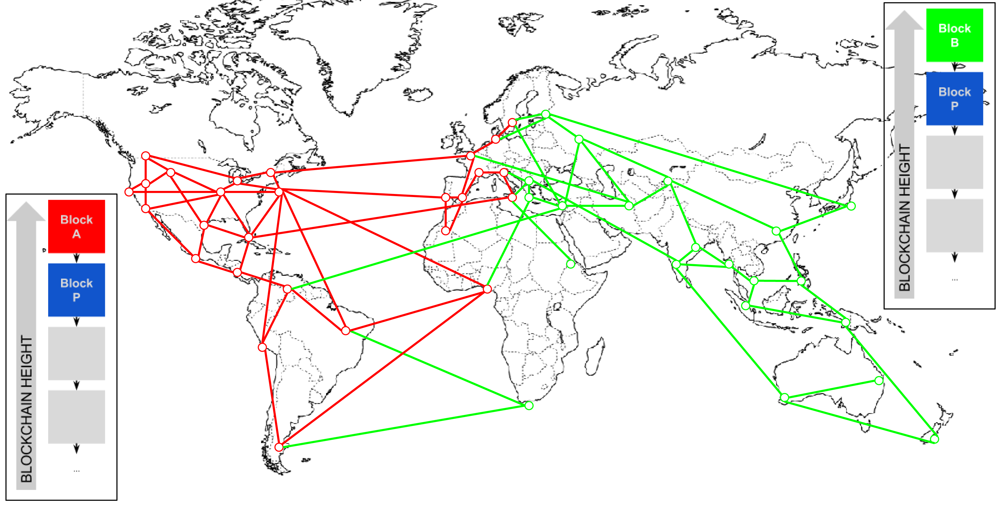

# Kiến thức cơ bản về Blockchain 

## Blockchain là gì?

* 

### A distributed databases

* Durability and robustness (Bền vững và khó có thể làm hỏng)

* Transparent and incorruptible

* A network of nodes

### Smart contracts

### Consensus

## Blockchain Data Structure

### Hashing and data structures

* What is hashing?

* Cryptographic hash functions

## Mining Process a Bitcoin

### Mining Nodes

### Aggregating Transactions into Blocks

* Priority Transaction 
    ```c
    Priocrity = Sum (Value of input * Input Age) / Transaction Size
    ```

### The Generation Transaction (Coinbase transaction)

    ```c
    Total coins = Coinbase Reward + Transaction Fees
    ```

* 

### Mining the Block - Proof of Work Algorithm

    ```c
    eg: 0x1903a30c
    target = coefficient * 2^(8 * (exponent – 3))
    => target = 0x0000000000000003A30C00000000000000000000000000000000000000000000
    ```
    
### Validating a New Block

### Assembling and Selecting Chains of Blocks

* 
* 
* 

## References

* [what-is-blockchain-technology](https://blockgeeks.com/guides/what-is-blockchain-technology/)
* [Hashing in blockchain](https://blockgeeks.com/guides/what-is-hashing/)
* [The Blockchain Data Structure](http://chimera.labs.oreilly.com/books/1234000001802/ch07.html)
* [UTXO](https://www.r3.com/blog/2017/07/18/what-is-a-utxo/)
* [Mining Process](http://chimera.labs.oreilly.com/books/1234000001802/ch08.html#difficulty_target)
