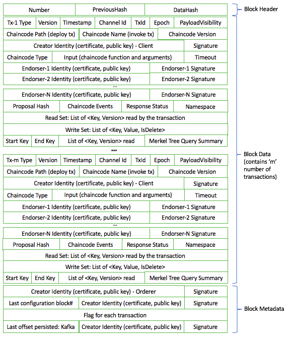

# Architecture Explained

* Tài liệu này giải thích một cách cơ bản về kiến trúc trong HyperLedger Fabric (HLF). Tài liệu được trình bày gồm 3 mục. Mục 1 - **System architecture** trình bày về các thành phần cơ bản trong HLF blockchain. Mục 2 - Transaction Flow trình bày về workflow cơ bản của 1 valid transaction trong HLF. Mục 3 - Endorsement policies, giới thiệu về chức năng và cấu trúc của các Endorsement policies trong HLF.

## Mục lục

1. [System architecture](#system_arch)
1. [Transaction Flow](#tx_flow)
1. [Endorsement policies](#endr_policy)
1. [References](#ref)

## System architecture <a id="system_arch"></a>

* Blockchain là một hệ thống phân tán gồm nhiều các **nodes** giao tiếp với nhau. Hệ thống blockchain có nhiệm vụ lưu trữ ledger data, xử lí transactions thông qua một chương trình được gọi là **chaincode** (hay **smart contract**). **Chaincode** là thành phần trung tâm trong HLF (HyperLedger Fabric) vì các **transactions** muốn được thực thi đều cần thông qua **chaincode**. Để transactions có hiệu lực thì chúng cần phải được chứng thực, và chỉ có những transactions đã được chứng thực mới được lưu vào ledger database. 

* Trong phần này, ta sẽ tìm hiểu về các thành phần, kiến trúc cơ bản nhất trong nền tảng HyperLedger Fabric. 

### Transactions

* Có 2 loại transactions trong HLF:
    * **Deploy transactions**: Là transaction khởi tạo chaincode (**install chaincode**) và đưa chaincode vào hệ thống blockchain
    * **Invoke transactions**: Là transaction thực hiện một hành động nào đó dựa trên bối cảnh của một chaincode đã được triển khai. Nếu thành công, chaincode sẽ thực thi một hàm cụ thể nào đó - có thể chỉ đơn giản là lời gọi hàm đọc dữ liệu từ database (_query chaincode_), hoặc đi xa hơn 1 chút là yêu cầu modifying dữ liệu trong database (_invoke chaincode_). 
* Hiểu 1 cách đơn giản thì **deploy transactions** có nhiệm vụ khởi tạo chaincode, còn **invoke transactions** là tập những transactions được thực hiện phía sau **deploy transactions**. 

### Blockchain datastructures

#### State

* Là trạng thái mới nhất của blockchain (được gọi là `state` hay `world state`) được collect từ ledger database. Trong HLF, `state` được lưu trữ dưới dạng key/value store (KVS). Và việc thay đổi các trạng thái này là thông qua thực thi chaincode. 
* Lưu ý là: State chỉ được maintained bởi các peers, không phải bởi các orderers hay clients (ta sẽ nói rõ hơn về các khái niệm peers, orderers, clients ở bên dưới). 
* **State partitioning (phân vùng trạng thái)**: Các keys trong KVS có thể được nhận biết từ tên của chúng là thuộc về 1 chaincode nào. Điều này nhằm hướng tới mục đích là: chỉ những transactions mà thuộc về 1 chaincode nào đó mới có thể thay đổi được giá trị trong keys thuộc về chaincode đó. Bên cạnh đó thì bất kì một chaincode nào cũng có thể đọc được giá trị của keys thuộc về một chaincode khác. Hiện tại thì HLF chưa support _cross-chaincode transactions_, tức là việc thay đổi trạng thái (values trong keys) thuộc về 1 hay nhiều chaincode.

#### Block structure (V1.0) <a id="block_str"></a>

* Dưới đây ta sẽ nói qua về cấu trúc của một block trong HLF - v1.0



* Dựa vào hình trên ta có thể thấy, block structure của HLF gồm 3 phần: _Header, Data và Metadata_
* **Header**: 
    1. **Number**: là số thứ tự của block hiện tại. Số này được gán tuần tự bắt đầu từ genesis block (block đầu tiên) có Number = 0
    1. **PreviousHash**: Lưu trữ _SHA256 Hash_ (giá trị băm) của block trước
    1. **DataHash**: Lưu trữ _SHA256 Hash_ của phần **Data** trong block
    * SizeOf(BlockHeader) = 8 bytes for Number + 32 bytes for PreviousHash + 32 bytes for  DataHash = 72 bytes

* **Metadata**: gồm 4 trường
    1. **SIGNATURES**: Là chữ kí của thành phần tạo block.  
    1. **LAST_CONFIG**: Là các configs định nghĩa ra các members, policies cho một channel. (Nói cách khác channels được định nghĩa bởi **configuration block**)
    1. **FLAGS**: 1 FLAG là một validation code gắn cho mỗi transaction. (Để biết thêm về các loại Flags, [đọc thêm ở đây](https://godoc.org/github.com/hyperledger/fabric/protos/peer) - phần _TxValidationCode_ )
    1. **ORDERER**: Chứa các _kafka ordering metadata_ (Về _kafka consensus alg_ bạn vui lòng tìm thêm ở tài liệu ngoài) 

    * Một lưu ý nhỏ rằng SIGNATURE, LAST_CONFIG và ORDERER metadata thì được tạo bởi ordering service, còn TRANSACTION_FILTER thì được thêm bởi committer sau khi validating transactions dựa vào các endorsement policies.

* **Data**: Là thành phần chứa tập các transactions. Độ dài của trường Data = số lượng các transactions lưu trên block. 
    * Transaction data được encoded dưới dạng byte array. Ta hình dung mỗi 1 transaction giống như 1 lá thư gồm có 2 thành phần quan trọng là chữ kí - Signature và nội dung lá thư - Payload data. 
    * Để tìm hiểu chi tiết về cấu trúc dữ liệu trong một transaction, bạn vui lòng xem hình minh họa và [đọc thêm ở đây](https://blockchain-fabric.blogspot.com/2017/04/under-construction-hyperledger-fabric.html)

#### Ledger

* Ledger database lưu trữ những thay đổi hợp lệ trong hệ thống (lưu trữ tập các valid transactions). Mỗi block trong ledger được tạo dựng từ ordering service. 
* Ledger database được lưu trữ trên tất cả các peer node, và có thể được lưu trữ trên ordering serivce node. Ledger lưu trữ trên orderers được gọi là `OrdererLedger`, ledger lưu trữ trên peer node gọi là `PeerLedger`. `PeerLedger` được lưu trữ 1 cách cục bộ trên peer node, đảm bảo an toàn về mặt dữ liệu. `OrdererLeger` đảm bảo các nhiệm vụ về tính chịu lỗi (fault-tolerance) và sẵn sàng (availability) của hệ thống. 

#### Nodes

* Nodes là những thực thể giao tiếp với nhau trong hệ thống blockchain. Một node đóng vai trò là một logical function, do đó, người ta có thể chạy multiple nodes isolated với nhau trên một physical server. Có 3 loại nodes trong HLF:
    1. **Client (submitting-client) node**: một client sẽ propose một transaction từ các endorsers và broadcast transaction đã được proposed cho ordering service. 
    1. **Peer node**: có nhiệm vụ commit transactions để đưa vào ledger database, lưu giữ state và ledger database. Bên cạnh đó, peer node còn đóng vai trò là một endorser - chứng thực transactions. 
    1. **Orderer (Ordering-service) node**: đóng vai trò tương tự như mining node trong bitcoin hay ethereum
* Ta sẽ nói kĩ hơn về các loại nodes trong kiến trúc của HLF.

1. **Client**

* Một _client node_ đại diện cho hành động của một end-user. Client cần phải kết nối với các core node để tương tác với hệ thống blockchain. Client sẽ kết nối với cả orderer node và peer node, ta sẽ nói rõ hơn về communicating của client trong phần [Transaction Flow](#tx_flow).

1. **Peer**

* Một peer node nhận message cập nhật dữ liệu dưới dạng các blocks từ ordering service và đóng vai trò maintain state và ledger database. 
* Bên cạnh đó, mỗi peer node còn đóng vai trò là một **endorsing peer** (Sẽ được nói rõ trong phần [Transaction Flow](#tx_flow) ). 

1. **Ordering service nodes (Orderers)** 

* Ordering service nodes cung cấp một kênh giao tiếp giữa client với các peers, cung cấp một broadcast service cho các message có chứa transactions. Client được kết nối với channel và có thể broadcast message trên channel, và sau đó message được chuyển tới các peers. 

* Channel hỗ trợ _atomic delivery_ trên tất cả các messages. _Atomic delivery_ hay còn gọi _total-order delivery_ là 1 cách thức truyền messages trong hệ thống phân tán. Nó đảm bảo rằng, thứ tự các messages được gửi tới 1 peer cũng chính là thứ tự các messages được gửi cho tất cả các peers. 

* **Partitioning (ordering service channels)**: Ordering service hỗ trợ multiple channels. Ordering service đảm bảo rằng client được kết nối tới 1 channel, gửi nhận message với peer nodes thông qua channel mà không biết đến sự có mặt của 1 channel khác. Nhưng client có thể kết nối tới multiple channels và client sẽ chỉ biết đến những channel mà nó kết nối tới thôi.

## Transaction Flow <a id="tx_flow"></a>

* Trong phần này ta tìm hiểu về workflow ở mức cơ bản nhất của một transaction hợp lệ trong HLF. Kịch bản đưa ra là ta có 2 client A và B, họ là những người muốn mua và bán củ cải. Mỗi client đều sở hữu 1 peer node trong network giúp họ tương tác với ledger thông qua gửi nhận transactions. 
    
* Giả sử rằng có 1 channel đã được tạo giữa 2 client, mỗi client đều đăng ký thành công và đã được chứng thực trong hệ thống thông qua các **CAs**, chaincode đã được cài đặt (installed) trên các peer và khởi tại (instantiated) trên channel. Chaincode này gồm 1 tập các hướng dẫn giao dịch và giá thỏa thuận cho củ cải. Một endorsement policy cũng được thiết lập cho chaincode để đảm bảo rằng, mỗi client A và B khi thực hiện giao dịch đều phải được chứng thực thông qua endorsement policy này. 

1. _Bước 1: Client A khởi tạo transaction mua củ cải_

* Client A khởi tạo transaction mua củ cải bằng việc gửi 1 `PROPOSE` message tới 1 tập các endorsing peer mà nó kết nối.
    
* Ta sẽ xem xét kĩ hơn về `PROPOSE` message format dưới đây:
    * Format của một `PROPOSE` message có dạng như sau: `<PROPOSE,tx,[anchor]>`, trong đó `tx` (_trong blockchain người ta thường viết tắt transaction là tx_) là trường bắt buộc,  `anchor` là không bắt buộc. 
    * Tx format: `tx=<clientID,chaincodeID,txPayload,timestamp,clientSig>`, trong đó:
        * `ClientID`: ID client A
        * `ChaincodeID`: tham chiếu tới chaincode mà tx sẽ được thực thi
        * `txPayload`: nội dung của transaction mà client A muốn thực hiện
        * `timestamp`: thời gian client A gửi `PROPOSE` message
        * `clientSig`: chữ ký của client A
    * `txPayload` của deploy transaction và invoke transaction có sự khác nhau. Đối với 1 **invoke transaction - thực thi chaincode**, `txPayload = <operation, metadata>`:
        * `operation`: biểu thị function và các arguments truyền vào function
        * `metadata`: biểu thị các thuộc tính liên quan đến lời gọi hàm
    * Đối với 1 **deploy transaction - khởi tạo chaincode**, `txPayload = <source, metadata, policies>`:
        * `source`: source code của chaincode
        * `metadata`: các thuộc tính liên quan đến chaincode và application
        * `policies`: chứa các policies được áp dụng cho chaincode, và những policies này sẽ được chứng thực bởi peer node. Chú ý rằng, `txPayload` không tạo ra các `policies`, mà chỉ truyền vào policies ID và các tham số của các policies đã được định sẵn. (xem thêm phần [Endorsement policies](#endr_policy)) 
    * `anchor`: 
* Sau khi tạo `PROPOSE` message, client A thông qua một SDK sẽ gửi message tới các peers mà nó kết nối. Ngoài ra, việc thực hiện băm mật mã cho `tx` được thực hiện trên tất cả các node, sẽ thu được một `tid = HASH(tx)`. Client A sẽ lưu trữ `tid` này vào bộ nhớ và đợi phản hồi từ các endorsing peers và sau đó sẽ dùng `tid` này để so sánh với các peers.  

1. _Bước 2: Endorsing peers xác nhận chữ ký và thực thi transaction trên chaincode_

* Endorsing peers nhận được `PROPOSE` message sẽ verify transaction, xác nhận chữ kí của client A là valid (sử dụng MSP), và cấp quyền thi hành (_Writers policy_) cho client A trên channel của mình. Endorsing peers nhận inputs (function + arguments) từ transaction để thực thi chaincode từ trạng thái hiện tại của ledger database. Kết quả trả về từ chaincode function sẽ được dùng cùng với chữ kí của endorsing peers để trả lại cho Client A. **Lưu ý rằng: ledger database không được cập nhật tại thời điểm này.**
    
* _Lưu ý: MSP (Membership Service Provider) là service có nhiệm vụ verify chữ ký từ client A, và kí chữ kí xác thực (endorsements) của endorsing peers để gửi lại cho client. Writing policy được định nghĩa ngay khi tạo channel và là biến sẽ quyết định xem client A có được submit transaction trên channel đó hay không._

1. _Bước 3: Kiểm tra proposal response message broadcast cho ordering service_

* Client A sẽ verify tất cả các chữ kí của endorsing peers và đối chiếu các proposal response messages với nhau để biết chắc rằng chúng là giống nhau.
    
* Nếu lời gọi tới chaincode function chỉ đơn giản là query dữ liệu từ database ledger thì client A sẽ lấy ra kết quả để hiển thị. Vậy là kết thúc một _query transaction_. Nhưng ở đây, phức tạp hơn 1 chút là client A muốn giao dịch với client B, tức là ghi dữ liệu vào ledger database (_invoke transaction_), do đó, client A sẽ cần phải thực hiện thêm 1 thao tác.

* Client A broadcast transaction đã được chứng thực (endorsements) cho các orderer nodes. Transaction gửi đi bao gồm read/write sets (quyền đọc/ghi vào ledger), chữ kí của các endorsing peers và Channel ID.   
    
* _Orderer node không cần phải kiểm tra toàn bộ nội dung bên trong transaction. Nó đơn giản là nhận toàn bộ transactions từ tất cả các channels trong network và sắp xếp chúng theo thứ tự thời gian theo channel và tạo blocks của các transactions trên mỗi channel_ 

1. _Bước 4: Ordering service gửi blocks cho peers_

* Transactions sau khi được đóng vào blocks sẽ được gửi cho tất cả các peers trong channel. Tất cả các transactions bên trong block một lần nữa được các peers validate để chắc chắn rằng _endorsement policies_ đã được áp dụng và đảm bảo rằng sẽ không có sự thay đổi nào trong ledger database nếu transaction chỉ có read set (quyền đọc dữ liệu). Transaction sẽ được gắn tag là valid hay invalid (được lưu vào trường FLAG trong Metadata block - xem lại phần [Block Structure](#block_str) )
    

1. _Bước 5: Update ledger database_
    

* Block mới sẽ được nối vào chuỗi của channel (channel's chain) trên các peers. Và với mỗi valid transaction, write sets (quyền ghi dữ liệu) sẽ được thực thi từ trạng thái hiện tại của ledger database. Vậy là transaction đã được **commited**.  Một sự kiện được khởi tạo để thông báo cho client A, transaction đã được ghi vào blockchain cũng như thông báo rằng transaction của A là valid hay invalid.

* Workflow cơ bản của một valid transaction được minh họa bằng biểu đồ trình tự bên dưới
    

## Endorsement policies <a id="endr_policy"></a>

* Trong phần số 3 này ta sẽ tìm hiểu về vai trò của các `Endorsement policies` trong hệ thống blockchain của HLF. 

* Một endorsement policy là một điều kiện để chứng thực 1 transaction. Trên các _peer nodes_ sẽ được ấn định trước 1 tập các  endorsement policies, và chúng sẽ được tham chiếu bởi các `deploy transaction` (Xem phần [Block Structure](#block_str) - **deploy transaction** để dễ hình dung).

* Để đảm bảo tính an toàn bảo mật cho blockchain, HLF tạo ra 1 tập các endorsement policies đã được kiểm chứng, nhằm đảm bảo giới hạn thời gian thực thi transaction, hay các vấn đề vể performance, sercurity. Hiện tại, HLF chưa hỗ trợ trong việc tạo ra các addition endorsement policies từ phía developers. 

* Lưu ý: Việc Endorsing policies trên các peer nodes được thực hiện 1 cách độc lập và cô lập, các peer nodes không cần tương tác với nhau, vì chúng đều kiểm chứng các policies theo 1 cách giống nhau. 

* Bây giờ ta sẽ đi xem xét syntax của Endorsement policy. Mỗi Endorsement policy gồm 2 thành phần: một principal - một threshold gate. 

* Principal `P`: định danh cho 1 thực thể sẽ kí chữ kí

* Ta có một threshold gate `T` như sau: `T(2, 'A', 'B', 'C')` - tức là threshold gate này yêu cầu chữ kí từ 2 principals bất kì trong 3 principal A, B hoặc C. Tương tự: `T(1, 'A', T(2, 'B', 'C'))` - yêu cầu hoặc 1 chữ kí từ principals A, hoặc 1 chữ kí từ cả 2 principal B và C. 

* Syntax của Endorsement Policies được biểu diễn như sau: 
    `EXPR(E[, E...])`

* Trong đó `EXPR` là theshold gate `AND` hoặc `OR`, còn `E` là principals.
* Ví dụ: `AND('Org1.member', 'Org2.member', 'Org3.member')` - yêu cầu 1 chứ kí từ cả 3 principals, hay `OR('Org1.member', 'Org2.member')` - yêu cầu 1 chữ kí từ 1 trong 2 principal. 

* Trong thực tế, khi deploy chaincode thông qua cli, ta thực hiện câu lệnh tương tự như sau:
    ```sh
    peer chaincode deploy -C testchainid -n mycc -p github.com/hyperledger/fabric/examples/chaincode/go/chaincode_example02 -c '{"Args":["init","a","100","b","200"]}' -P "AND('Org1.member', 'Org2.member')"
    ```
* Câu lệnh này deploy chaincode có tên là `mycc`, trên `testchainid` channel với policy là `AND('Org1.member', 'Org2.member')` - tức là lời gọi thực thi chaincode sau này sẽ cần 1 chữ kí từ cả 2 principals. 

## References <a id="ref"></a>

* http://hyperledger-fabric.readthedocs.io/en/release-1.0/endorsement-policies.html
* http://hyperledger-fabric.readthedocs.io/en/release-1.0/arch-deep-dive.html
* http://hyperledger-fabric.readthedocs.io/en/release-1.0/txflow.html
* https://blockchain-fabric.blogspot.com/2017/04/under-construction-hyperledger-fabric.html
