# OpenStack Networking (Neutron)

## Preparing the Network for OpenStack

* OpenStack Networking (Neutron) là một hệ thống có khả năng "cắm rút", khả năng mở rộng và có các API để quản lý mạng và địa chỉ IP trong một hệ thống OpenStack Cloud. OpenStack Networking services có thể triển khai trên nhiều máy trạm để đảm bảo được tính "resiliency - co dãn" và "redundancy - dự phòng", hoặc có thể triển khai trên một nút.  
* Users được cung cấp các API để định nghĩa các kết nối mạng trên hệ thống cloud và phát triển các hệ thống mạng khác nhau nhằm cải thiện và tăng hiệu quả cho hệ thống của họ.
* Giống như các service khác của OpenStack, Neutron cũng sử dụng Database để lưu trữ các cấu hình mạng của mình.
* **Các tính năng của OpenStack Networking**: OpenStack Networking sử dụng rất nhiều công nghệ như Switching, Routing, Load Balancing, Firewalling hay Virtual Private networks. Các tính năng này có thể được cấu hình để thúc đẩy việc phát triển mã nguồn mở hoặc cho mục đích thương mại. 
    * **Switching**: Một Switch ảo (virtual Switch) là một phần mềm kết nối các máy ảo với các mạng ảo tại L2 (Data-link layer trong mô hình OSI). Neutron hỗ trợ nhiều nền tảng virtual switch, như _Linux Brigde_ - cung cấp bởi _bridge kernel module_,  _Open vSwitch (OVS)_ là một open source virtual switch hỗ trợ cho việc quản lý các interfaces và protocols, hỗ trợ cho việc giao tiếp giữa các VMs với các thiết bị bên ngoài hệ thống quản lý của OpenStack. 
    * **Routing**: Neutron cung cấp khả năng routing và NAT thông qua sử dụng IP forwarding, Iptables, và network namespaces. Bên trong một network namespace, ta có thể thấy có các sockets, ports và các interfaces (cấu hình mạng). Mỗi một network namespace đều có cho mình một bảng routing table, các interfaces và NAT. Bằng cách sử dụng network namespaces cho các mạng riêng biệt, sẽ không cần phải lo lắng về vấn đề overlapping subnet giữa các mạng được tạo bởi các tenants. 
    * **Load balancing**: _Load Balancing as a Service (LBaaS)_ cho phép users có thể phân tải các requests của clients tới các instances (VMs) khác nhau. Users có thể tạo ra các monitors, thiết lập các kết nối và giữ ổn định lưu lượng truy cập qua các Virtual Load Balancer
    * **Firewalling**: Trong hệ thông OpenStack, có 2 cách để tăng cường tính bảo mật cho các instances: sử dụng _security groups_ và _firewalls_. Sử dụng security groups, các instances sẽ được nhóm vào trong một groups, chia sẻ các chức năng và bộ quy tắc chung, traffic trao đổi với các instances được quản lý bằng Iptables trên compute note. Sử dụng virtual firewalls (Firewall as a Service - FWaaS), vấn đề bảo mật sẽ được xử lý trên Neutron router thay vì trên compute note.
    * **Virtual private networks (VPN)**: Mạng riêng ảo mở rộng một private network qua một public network, vd như internet. Một VPN cho phép một máy gửi và nhận data thông qua public networks như thể nó đang ở trong một private network. 

* Các loại _network trafic_
    * Management network: sử dụng cho mạng nội bộ bên trong hệ thống phân tán, được dùng để giao tiếp giữa các máy trạm cho các dịch vụ như messaging service, database service. Trong nhiều trường hợp, cấu hình mạng này có thể sử dụng để trao đổi các Glance images giữa các hosts hoặc một số truy vấn tốn nhiều traffic. Management network có thể cấu hình thành 1 mạng riêng hoặc gộp với các mạng khác. 
    * _API network_: Users sử dụng cloud và các service bên trong cloud có thể truy cập vào OpenStack API thông qua API Network . Các điểm cuối của dịch vụ như Keystone, Neutron, Glance, hay Horizon là thu được từ API network. Một khuyến cáo, nhưng không bắt buộc, đó là ta nên tách management network và api network thành 2 mạng riêng biệt, để tránh các vấn đề về network congestion. 
    * _External network_: cung cấp các Neutron routers với khả năng truy cập ra mạng bên ngoài. Khi các router được cấu hình và gắn vào mạng bên ngoài, các IP trong network sẽ trở thành floating IP address source cho các instances, IP trong external network có thể được truy cập bởi các clients trên mạng internet.
    * _Guest network_: là một mạng riêng biệt cho các instance traffic. Guest network có thể là local network bị hạn chế ở 1 node nào đó, hoặc flat, VLAN networks hay virtual overlay network như VXLAN, GRE.

* Kết nối máy chủ vật lý
    * Single interface: Các máy chủ vật lý sử dụng 1 interface (NIC), tất cả traffic đến và từ các instances như traffic bên trong OpenStack, SSH management, API traffic đều sử dụng chung 1 interface. Cấu hình kiểu này có thể dẫn đến sự suy giảm về performance một cách nghiêm trọng vì máy khách có thể tạo ra một cuộc tấn công từ chối dịch vụ máy chủ bằng cách chiếm toàn bộ băng thông có sẵn.
    * Multiple interface: Để giảm khả năng chiếm băng thông của máy khách làm ảnh hưởng đến khả năng quản lý giữa các máy chủ và đế nâng cao tính bảo mật, ta nên sử dụng nhiều interface trên 1 máy chủ vật lý. Tối thiểu là 2: Một sử dụng cho management và API traffic và một cho external và guest traffic.
    * Bonding: NIC bonding cung cấp cho người dùng khả năng nhân rộng băng thông sẵn có bằng cách kết hợp các liên kết. 2 hoặc nhiều interfaces có thể kết hợp thành một virtual interface hoặc bond, sau đó được đặt trong một brigde và sử dụng như một interface bình thường. 
* Phân tách các service trên các nodes riêng biệt
    * Giống như các services khác trong OpenStack, người ta cũng có thể đặt các Networking services trên nhiều nodes khác nhau. Với quy mô deploy nhỏ, có thể sử dụng single node để cài đặt tất cả các service bao gồm networking, compute, database, và messaging. Một số khác thấy lợi ích của việc sử dụng một compute node riêng và một network node riêng là để quản lý lưu lượng khách truy cập được định tuyến qua các software routers trên compute node và giảm tải các metadata service và Neutron DHCP trên network node.
    * Sử dụng trên một _controller node_: Trong môi trường sử dụng 1 controller node và nhiều compute nodes, controller node sẽ quản lý toàn bộ các networking services và các service khác trong OpenStack, trong khi các compute nodes khác sẽ chỉ làm 1 nhiệm vụ riêng mình nó là phân phối tài nguyên.
        * 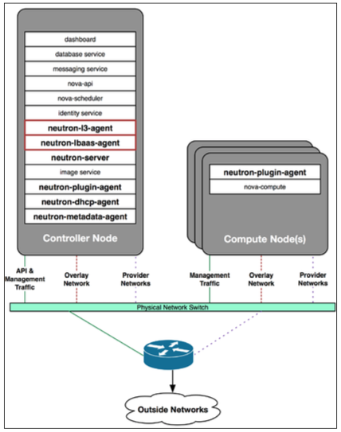
        * Với hình minh họa bên trên, ta đã gộp controller và network node. Các software routers trong Neutron sẽ được đặt trên controller node và điều khiển định tuyến giữa các connected tenants networks với external provider networks - nhiệm vụ trên tần L3, ngoài ra nó còn phải thực hiện nhiệm vụ trên tầng L2 đó là xử lý các kết nối giữa các instances với external gateway devices
    * Sử dụng một _network node_ riêng biệt
        * 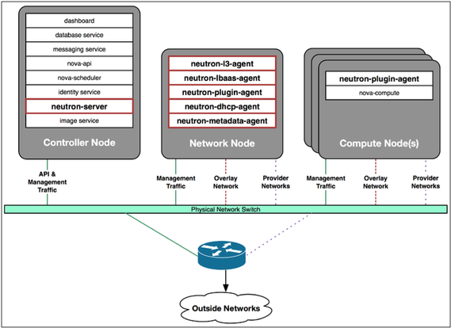
        * Network node này thực thi gần như toàn bộ các Networking service, chỉ trừ neutron-server được đặt trên controller node. Lợi ích của việc sử dụng thêm network node là để tăng tính bảo mật và tính co dãn của hệ thống, vì controller node sẽ ít gặp rủi ro hơn trong các vấn đề về liên quan đến network.

## Một số thành phần được cài đặt trong Neutron

### Cơ bản về networking elements trong Neutron

* Neutron xây dựng các virtual network sử dụng các elements như: networks, subnets, ports, routers, load balancers ...  Neutron cho phép người dùng có khả năng build một nền tảng mạng với các thực thể như:
    * Network: Một network là một broadcast domain riêng biệt trên L2. Thường được giành riêng để tenants tạo ra chúng, networks có thể được chia sẻ giữa các tenants nếu được cấu hình phù hợp. Network là thực thể cốt lõi của Neutron API. Các subnets và ports phải luôn đi liền với networks.
    * Subnets: Một subnet là một khối địa chỉ IPv4 hoặc IPv6, từ đó các địa chỉ IP có thể gán cho các instances. Một network có thể có nhiều subnets. Một subnet có thể được cấu hình bằng một dải phân bố DHCP nhằm giới hạn địa chỉ IP được cung cấp cho các instances.
    * Ports: Một port trong Netron đại diện cho một virtual switch port trên một logical virtual switch. Các cấu hình mạng (interfaces) trên các instances được gắn với các ports và trên port sẽ định nghĩa địa chỉ MAC và địa chỉ IP cho interface được gắn với nó, các thông số này sẽ được lưu vào Neutron database, sau đó được sử dụng bởi các plugins tương ứng để xây dựng và kết nối các virtual switching infrastructure. 
* Các cloud operators và users có thể cấu hình cho các network topologies bằng việc tạo và cấu hình các networks, subnets và cho phép các services kết nối tới các virtual devices thông qua các ports trong networks. Users có thể tạo ra nhiều networks, tuy nhiên sẽ bị giới hạn số lượng, phụ thuộc vào cấu hình của người quản trị (cloud administrator). 

* **Modular Layer 2 plugin (ML2 plugin)**: một core plugin trong Neutron. ML2 giới thiệu 2 khái niệm là _type drivers_ và _mechanism drivers_ nhằm phân biệt loại network được triển khai và các  mechanisms được sử dụng để triển khai các loại networks đó.   
    * **Type drivers**: Một ML2 type drive duy trì trạng thái cụ thể của network, xác nhận các thuộc tính của provider network và mô tả các network segments sử dụng provider attributes. Provider attributes bao gồm network interface labels, segmentation IDs và network types. Các network types được hỗ trợ trong ML2 gồm local, flat, vlan, gre, và vxlan.
    * **Mechanism drivers**: Một ML2 mechanism driver chịu trách nhiệm nhận thông tin được thiết lập từ type drivers và đảm bảo rằng nó được thực hiện chính xác. Ở đây, ta sẽ chỉ nghiên cứu các Mechanism drivers là: LinuxBridge, Open vSwitch và L2 Population.
        * LinuxBridge và Open vSwitch được sử dụng để cấu hình cho các hệ thống mạng, nhằm giao tiếp giữa các instances. LinuxBridge chỉ support mạng local, flat, vlan, và vxlan; Open vSwitch ngoài các loại mạng trên còn support cả gre network type. 
        * L2 population được sử dụng để giới hạn số lượng broadcast traffic được forward qua overlay network. 
    * Sơ đồ tương tác của Neutron API với các plugins (trong đó có ML2 plugins) được thể hiện trong hình bên dưới: 
        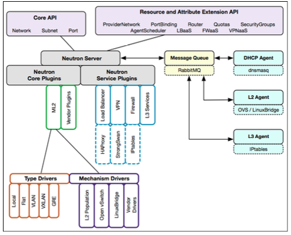

* **Network namespaces**
    * Neutron cho phép mỗi tenants có khả năng tạo ra nhiều private networks, routers, firewalls, load balancers, và các tài nguyên mạng khác. Để nhóm các đối tượng này lại với nhau người ta sử dụng Network namespace. Các loại namespaces bao gồm:
        * DHCP namespace: qdhcp-[network UUID]
        * Router namespace: qrouter-[router UUID]
        * Load Balancer namespace: qlbaas-[load balancer UUID] 
    * _qdhcp namespace_ chứa một DHCP service cung cấp địa chỉ IP cho các instances sử dụng DHCP protocol
    * _qrouter namespace_ đại diện cho một virtual router, chịu trách nhiệm cho routing traffic ra và vào các instances. Giống như qdhcp, qrouter namespace cũng có thể kết nối với 1 hoặc nhiều virtual switches.
    * _qlbaas namespace_ đại diện cho một virtual load balancer, có thể chạy 1 service ví dụ như HAProxy - load balances traffic tới các instances và các thiết bị khác trên cùng 1 mạng hoặc subnet. 
    * Chữ q là viết tắt của Quantum - tên gọi đầu tiên của Networking service
    * Neutron namespaces chỉ có trên các node triển khai Neutron DHCP, L3, và LBaaS agents. Các service này được triển khai hoặc trên controller node hoặc trên một network node riêng biệt.
    
## Xây dựng kiến trúc Virtual Switching

* Virtual network interfaces
* Virtual network devices
    * _Tap interface_: OpenStack sử dụng KVM/QEMU driver để cung cấp sự ảo hóa nền tảng trong cấu hình mặc định của Nova. Khi một instance được boot lần đầu, Neutron sẽ gán 1 virtual port tới mỗi network interface của instance đó. KVM sẽ tạo một virtual network interface gọi là _tap interface_ trên compute node, nơi quản lý instance. Tap interface này sẽ được kết nối trực tiếp với instance. Do đó, thông qua 1 bridge máy chủ vật lý (host) có thể kết nối instance đó với physical network
* Virtual network switches
    * Linux bridge: là một virtual switch trong 1 host, có thể kết nối với nhiều network interfaces. Trong Neutron, 1 bridge cho phép kết nối một physical interface với 1 hoặc nhiều virtual/tap interface. Một physical interface có thể là 1 Ethernet interface hoặc một _bonded interface_. Một LinuxBridge cho phép kết nối với nhiều physical interfaces và nhiều virtual network interfaces. [Xem thêm ...](#linux-bridge)
    * Open vSwitch (OVS): là một phần mềm sử dụng các virtual network bridges và các quy tắc để forward gói tin giữa các hosts. Các virtual bridges này được kết nối với nhau giống như các physical bridges được kết nối với nhau thông qua cable. [Xem thêm ...](#OVS)

* Sử dụng ML2 plugin với các Mechanism drivers:
    * **Sử dụng ML2 với LinuxBridge** [Xem thêm ...](#linux-bridge) 
        * LinuxBridge được sử dụng phổ biến nhờ tính tin cậy và dễ dàng xử lý sự cố nhưng lại không được hỗ trợ nhiều tính năng nâng cao trong Neutron vd như hệ thống virtual routers phân tán. Trong một LinuxBridge-based network, Neutron quản lý các loại interfaces sau:
            * Tap interfaces: được tạo và sử dụng bởi hypervisor chẳng hạn như QEMU/KVM (Kernel-based Virtual Machine), để kết nối các instances với các host.
            * Physical interfaces
            * VLAN interfaces
            * VXLAN interfaces
            * Linux bridges
    * **Sử dụng ML2 với Open vSwitch (OVS)** [Xem thêm ...](#OVS)
        * Các loại virtual devices được sử dụng trong Open vSwitch-based network:
            * Tap devices
            * Linux bridges
            * Virtual Ethernet cables (veth cables)
            * OVS bridges: giống như 1 physical switch chỉ có điều nó là ảo. Neutron kết nối các interfaces (sử dụng DHCP hoặc router namespaces) và instance tap interfaces tới các cổng trên OVS bridge. Các port này được cấu hình giống như các physical switch port.
            * OVS patch ports: Để kết nối 2 Open vSwitch bridges với nhau người ta sử dụng patch port. Patch port được cấu hình với peer name là tên của switch kết nối tới switch hiện tại. Trông nó sẽ giống như hình bên dưới.   
            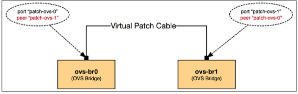

## Creating Networks with Neutron

* Mỗi một network trong Neutron dù được tạo bởi admin hay tenants thì đều có các thuộc tính để mô tả mạng đó gọi là _provider attributes_. Attributes mô tả 1 network bao gồm network type (vd như flat, vlan, gre, vxlan, hay local), physical network interfaces và segmentation ID (để xác định tính duy nhất của mạng). Sự khác biệt giữa provider net và tenants net là ai hay cái gì sẽ cài đặt cho các attributes và các cách attributes này được quản lý trong OpenStack là ntn?

* Provider networks: provider net chỉ có thể được tạo và quản lý bởi OpenStack admin. Để tạo một provider net, admin phải cấu hình thủ công các provider attributes cho network, provider net cho phép các VM instances và các virtual routers được tạo bởi tenants kết nối tới chúng. Khi một provider net được cấu hình để sử dụng làm externet network cho Neutron routers, provider net được gọi là _external provider network_. Các provider nets thường được cấu hình thành loại flat hoặc VLAN, và sử dụng một thiết bị định tuyến ngoại để định tuyến trafffic ra và vào trong hệ thống cloud

* Tenant networks: Không giống với provider net, tenant net được tạo bởi người dùng và cô lập với các network khác trong hệ thống cloud. Vì không có khả năng cấu hình physical interfaces vì thế khi muốn kết nối ra bên ngoài hệ thống cloud, tenant nets sẽ kết nối với Neutron routers. 

* Neutron ports
    * Một port trong Neutron là một logical connection của một virtual network interface tới một subnet. Port có thể đi với VM instances hoặc DHCP servers, routers, Load balancers ... Port có thể tạo một cách đơn giản dựa vào địa chỉ IP trong subnet. Neutron lưu trữ thông tin về port trong Neutron database và sử dụng thông tin này để xây dựng kết nối ở physical hoặc virtual switch layer thông qua networking plugin và networking agent. 

## Security Groups trong OpenStack 

* Neutron có 2 cách để cung cấp tính bảo mật về network cho các instances, sử dụng _security groups_ và _virtual firewalls_. Security groups sử dụng _[iptable rules](#ip-table)_ để filter các traffic tới các instaces trong compute node. Virtual firewalls được cung cấp bới một service trong Neutron là Firewall as a Service (FWaaS), sử dụng [iptables](#ip-table) để filter traffics bên trong Neutron router (chứ không phải bên trong compute node). 

* **Security Groups**: còn gọi là _security group rules_, là một tập các quy tắc để truy cập trong một mạng, nó giúp giới hạn các loại traffics mà một instance có thể nhận hoặc gửi đi. Trong thực tế, security group rules chính là các _[iptable rules](#ip-table)_ sẽ được áp đặt lên các instances nằm trong compute node. Mỗi một tenant đều được cung cấp một default security group mà có thể được thay đổi bởi các users của tenant(project). Đương nhiên là  Neutron sẽ cung cấp các API để giúp các users có thể tạo, xóa, apply và thay đổi các security group rules. 
    * Có nhiều cách để gán các security group cho các instaces: 
        * Một hoặc nhiều instance với chung chức năng hoặc vai trò có thể đặt vào trong một security group. Các rules trong một security group được gán vào các port trong compute node như hình minh họa bên dưới  
            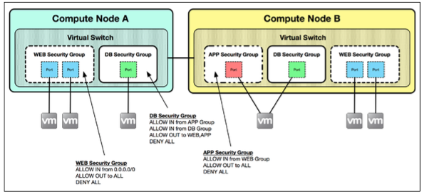
            * Trong hình minh họa bên trên, 1 port thuộc về 1 trong 3 groups: WEB, DB hoặc APP. Khi có một sự thay đổi bên trong security group, vd như thêm hoặc xóa rules, thì các iptable rules tương ứng cũng sẽ tự động thay đổi bên trong mỗi compute node. 
        * Một số users có thể sử dụng các security groups để mô tả chính xác các loại rules được đưa vào trong một port cụ thể nào đó trong các instance. Vd như 1 security group có thể sử dụng để phân loại các host nào hay subnet nào được quyền truy cập vào một port. Ta có thể sử dụng nhiều security groups để áp đặt vào 1 port, và đương nhiên tất cả các rules trong các groups đó sẽ được áp đặt vào port. Lúc này có thể xảy ra xung đột giữa các rule trong các security groups, ta chỉ cần nhớ rằng 1 traffic nào đó đã bị deny bởi 1 rule thì không thể được allow bởi 1 rule nào khác. Hình bên dưới minh họa cho 1 port có thể sử dụng nhiều security groups  
            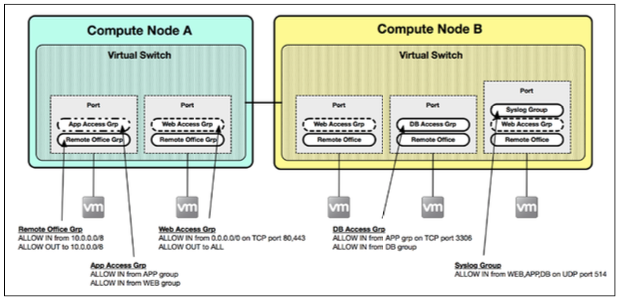
    * Khi một port được tạo trong Neutron, nó sẽ được gán cho _default security group_ nếu như ta ko gán security group nào cho nó. Default security group cho phép tất cả các kết nối có thể đi tới instance. Các rule cũng có thể thêm vào hoặc xóa đi ở defautl security group.
    * Khi một security group được gán cho một port, Neutron sẽ translate các rules bên trong group đó vào iptable rules, nơi sẽ áp đặt trực tiếp các rule đó tới các instances bên trong compute node. 

* **Iptables** 
    * Iptables là một firewall được xây dựng trong Linux cho phép một người quản trị hệ thống định nghĩa ra các tables bao gồm một chuỗi các rules mà nó sẽ quyết định xem một network packet sẽ được xử lý như thế nào khi đi qua nó. Các packets được xử lý sẽ đi liên tiếp qua các rules trong các _chain (mắt xích)_ bên trong các tables sau đây:
        * _Raw table_: là một default table sẽ filter packet trước các table khác, được dùng để cấu hình cho các loại gói tin sẽ không bị kiểm tra khi đi qua nó, và Raw table không được sử dụng trong security groups hay FaaS.
        * _Filter table_: sử dụng để filter packet
        * _NAT table_: table được sử dụng cho NAT
        * _Mangle table_: sử dụng cho sự thay đổi của các gói tin đặc biệt và nó không được dùng trong security groups hay FaaS
    * Trong mỗi iptable đều có các _chain_ và nếu iptable được sử dụng, thì mỗi packet tới và đi sẽ ít nhất phải qua 1 chain. Có 5 loại chain và nguồn gốc của gói tin sẽ quyết định chain nào nó sẽ đi qua. Có 5 loại chain sau:
        * _PREROUTING_: Packets sẽ đi qua chain này trước khi được quyết định routing được đưa ra. Chain này không được dùng trong security groups nhưng được dùng cho chức năng floating IP bên trong một router namespace. PREROUTING được dùng trong Raw, Mangle và NAT table
        * _INPUT_: được sử dụng khi packets được vận chuyển 1 cách cụ bộ bên trong host machine. INPUT chain đươc dùng trong Mangle và Filter tables
        * _FORWARD_: Tất cả các packets đã được routing và chưa được vận chuyển bên trong host machine sẽ đi qua chain này. FORWARD chain được dùng trong Mangle và Filter tables.
        * _OUTPUT_: Packets được gửi từ bên trong host machine sẽ qua chain này. OUTPUT chain được dùng bởi Raw, Filter, Nat và Mangle tables
        * _POSTROUTING_: Packet sẽ vào chain này nếu quyết định routing được đưa ra. Chain này ko dùng trong security group nhưng dùng trong Floating IP. POSTROUTING dùng trong Mangle và NAT tables. 
    * Mỗi 1 packet đi qua 1 chain sẽ được kiểm tra bởi các rule. Nếu rule không khớp với packet, nó sẽ được chuyển đến rule tiếp theo. Và nếu rule khớp với packet, sẽ có các quyết định sau được đưa ra: 
        * ACCEPT: packet được chấp nhận
        * DROP: packet bị loại bỏ
        * REJECT: packet bị loại bỏ và 1 error message sẽ được gửi cho sender
        * LOG: hiển thị thông tin về packet
        * DNAT: viết lại destination IP của packet
        * SNAT: viết lại source IP của packet
        * RETURN: returns the processing to the calling chain
    
## Firewall as a Service - FaaS

* FaaS là một advanced service trong Neutron, cho phép users tạo và quản lý các firewall, cung cấp khả năng filtering packets ở layer 3 và layer 4 trong phạm vi của network. Sử dụng Neutron API, users có thể:
    * Áp đặt firewall rules cho traffic vào và ra trong tenant network được gắn trong Neutron router
    * Tạo và chia sẻ các firewall policies(là một tập sắp theo thứ tự các firewall rules)
    * Kiểm tra firewall rules và policies.
* FaaS cung cấp các network resources sau 
    * Firewall: là một logical firewall mà một tenant có thể khởi tạo và quản lý. Một firewall phải luôn đi với một firewall policy. Và 1 firewall có thể áp đặt cho nhiều router.
    * Firewall policy: Là một tập sắp thứ tự các firewall rules và có thể chia sẻ giữa các tenants
    * Firewall rule: Một tập các thuộc tính, chẳng hạn như địa chỉ L3, ports L4, cho phép hoặc loại bỏ truy cập qua một interface.
* Giống với security groups, Firewalls trong Neutron sử dụng iptables để thực hiện filtering các traffic. Tuy nhiên, thay vì được cấu hình trên compute node, firewall rules được sử dụng bên trong [Neutron router namespace](#network_namespace).

## Router trong Neutron

* Neutron cho phép users tạo các virtual routers nhằm cung cấp kết nối giữa các instances với external network. _Neutron L3 agent (neutron-l3-agent) service_ cung cấp IP routing và NAT cho các VM instances bên trong hệ thống cloud thông qua sử dụng các [Network namespaces](#network_namespace). Bằng viêc tạo và attach các instances tới routers, users có thể kết nối các VM instaces của họ ra external networks và trên Internet.

* Routing traffic trong cloud
    * Các virtual routers được tạo trong Neutron tồn tại giống như các _network namespaces_ nằm bên trong các node sử dụng neutron-l3-agent service. Một virtual router thường được kết nối với 1 external provider network và 1 hoặc nhiều tenant networks. Các kết nối Router interfaces có các loại sau:
        * qg - gateway interface
        * qr - router interface
    * Neutron routers chịu trách nhiệm cho các kết nối vào và ra tenant networks thông qua sử dụng _NAT_. Hình vẽ bên dưới mô tả 1 router namespace kết nối tới 2 bridges sử dụng LinuxBridge driver.
        * 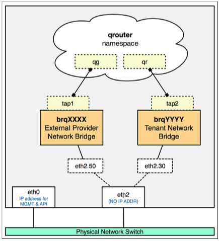
        * Traffic trong tenant networks đi vào từ qr và đi ra external network thông qua qg.
        * Routing table bên trong namespace sẽ quyết định đường đi của traffic và iptable rules sẽ quyết định xem traffic có cần được ánh xạ hay không (sử dụng NAT table) trong trường hợp cần thiết. 
* Cài đặt router
    * Cài đặt và cấu hình _Neutron L3 agent_
    * Cài đặt và quản lý router bằng CLI

## Linux Bridge 

* **Linux Bridge** là một loại virtual switch được thiết kế theo chuẩn 802.1D được sử dụng trong hệ điều hành Linux. Linux Bridge được đặt trong 1 host, có thể kết nối với nhiều network interfaces. Trong Neutron, 1 bridge cho phép kết nối một physical interface với 1 hoặc nhiều virtual/tap interface. Một physical interface có thể là 1 Ethernet interface hoặc một _bonded interface_. Một LinuxBridge cho phép kết nối với nhiều physical interfaces và nhiều virtual network interfaces.
    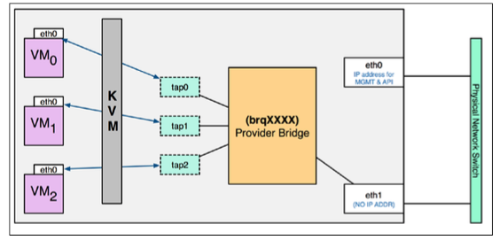
    * Hình minh họa bên trên, là hình ảnh một Linux Bridge - **brqXXXX** kết nối tới một physical interface và 3 tap interfaces - tap0, tap1, tap2. Traffic từ các VMs được kết nối với các tap interfaces tương ứng để có thể giao tiếp được với mạng bên ngoài

* Linux Bridge được sử dụng rộng rãi vì tính tin cậy và tính dễ bảo trì của nó. Trong một mạng sử dụng hệ thống Linux Bridge, nó có khả năng quản lý các thành phần sau: 
    1. Tap interfaces
    1. Physical interfaces
    1. VLAN interfaces
    1. VXLAN interfaces
    1. Linux bridges
    Trừ VLAN và VXLAN interfaces sẽ được nói đến sau, 3 thành phần còn lại ta có thể thấy rõ trong hình minh họa.
* Bây giờ ta sẽ xem luồng hoạt động của các traffics khi sử dụng Linux Bridge trong các kiến trúc mạng là như thế nào. 

1. **VLAN**
    * Hình minh họa bên dưới ta có 2 mạng VLAN với VID là 100 và 101. Ta giả sử xét traffic qua mạng 101. Khi một instance được chạy và kết nối với VLAN 101, Neutron sẽ khởi tạo một virtual interface có tên là eth1.101 và kết nối tới Linux bridge. Tên eth1.101 được gắn với physical interface là 101.
    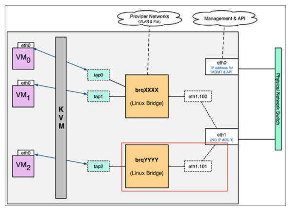
    * Khi chuyển một L2 Frame đi từ VM2 đi qua **brqYYYY Linux bridge**, eth1.101 sẽ gắn VLAN header vào Frame này, trong đó có VID = 101. Và forward tới physical interface
    * Khi một VLAN Frame đi vào VM2 từ bên ngoài, qua eth1.101 interface sẽ kiểm tra xem VID có phù hợp với ID trên interface không. Nếu phù hợp, nó sẽ loại bỏ VLAN header và forward tới brqYYYY, brqYYYY kiểm tra D-MAC và trả về cho VM2. 
    * Dựa vào hình vẽ trên ta có thể thấy, trên một physical interface ta có thể triển khai nhiều mạng VLAN.
1. **FLAT**
    * Trong Flat network, L2 Frame sẽ không sử dụng **VLAN tagging** như trong mạng VLAN. Vì Flat networks yêu cầu kết nối trực tiếp virtual bridge với physical interface, vậy là sẽ chỉ có _1 mạng flat trong 1 Linux Bridge và 1 physical interface_. Bạn có thể xem hình minh họa bên dưới, ta có 2 mạng Flat khác nhau do đó chúng sẽ sử dụng các bridge khác nhau và các physical interface khác nhau. 
    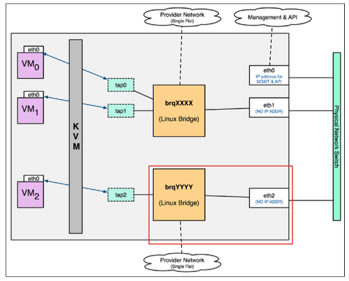

1. **VXLAN**
    * Khi tạo một mạng VXLAN, một VXLAN interface sẽ được tạo và gắn trên Linux Bridge thay vì physical interface như VLAN. VLXAN interface này có nhiệm vụ thêm vào L2 Frame VXLAN header, đóng gói vào UDP packet, rồi IP packet (với S-IP là IP của physical interface nó gắn vào và D-IP và IP của physical interface nơi packet cần chuyển tới) cho traffic đi từ VMs ra ngoài và tháo IP packet, UDP packet, VXLAN header để trả về L2 Frame về cho LinuxBridge.
    * Giống như mạng VLAN, ta cũng có thể triển khai nhiều mạng VXLAN trên một physical interface.

1. Linux Bridge không hỗ trợ mạng GRE 

## Open vSwitch (OVS) 

* Open vSwitch là một phần mềm quản lý các virtual network bridges và thiết lập các quy tắc cho phép traffic được flow trên các hosts. Trong một hệ thống triển khai OVS có thể có các loại virtual networking devices sau: 
    1. Tap devices
    1. Linux bridges
    1. Virtual Ethernet cables (còn gọi là **veth**): giống như một Ethernet cable vật lý thông thường, chỉ có điều nó là ảo.
    1. OVS bridges: nó cũng vậy, hoạt động giống như một physical switch thông thường
    1. OVS patch ports: Để kết nối 2 Open vSwitch bridges với nhau người ta sử dụng patch port. Patch port được cấu hình với peer name là tên của switch kết nối tới switch hiện tại. Trông nó sẽ giống như hình bên dưới.   
        

* Hình minh họa bên dưới triển khai hệ thống mạng sử dụng Open vSwitch, ta sẽ giải thích nó sau đây  
    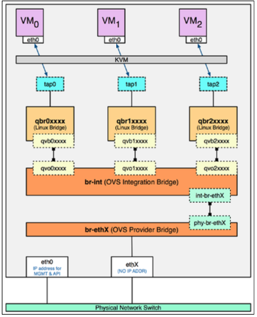
* Hình trên ta triển khai 1 hệ thống mạng để vận chuyển các traffic từ VMs ra physical interface sử dụng OVS ta cần phải có các loại thiết bị 
    * The tap interface: tapXXXX
    * The Linux bridge: qbrXXXX
    * The veth pair: vbXXXX, qvoXXXX
    * The OVS integration bridge: br-int, đây là thiết bị switch trung tâm, hầu hết các thiết bị khác sẽ kết nối với nó, bao gồm các instances, DHCP servers, routers... Chỉ có điều với hình trên là hơi khác một chút, đó là do Neutron sử dụng security groups, do đó các VMs sẽ không kết nối trực tiếp với br-int (integration bridge) mà thông qua các LinuxBridge tương ứng, và các bridge này sẽ kết nối với br-int thông qua việc sử dụng các veth pairs.
    * OVS patch ports: int-br-ethX và phy-br-ethX, có nhiệm vụ kết nối các OVS bridges
    * The OVS provider bridge: br-ethX, đây là loại bridge sẽ cung cấp các kết nối ra mạng physical thông qua các physical interface. Provider bridge cũng sẽ kết nối với integration bridge thông qua các virtual patch ports.
    * The physical interface: ethX
    * The OVS tunnel bridge: br-tun, có nhiệm vụ kết nối các GRE và VXLAN tunnel endpoints. Luồng traffic qua bridge này sẽ được đóng gói và mở gói phù hợp với giao thức của từng loại mạng. 
