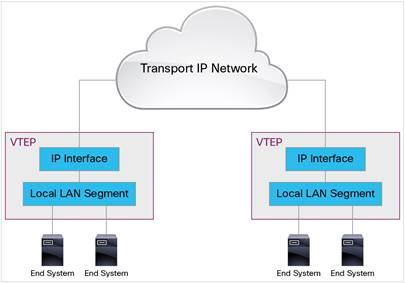

# OpenStack

## Kiến thức nền

### Các loại mạng

1. Flat Network
    * Flat Networks là một thiết kế mạng với mục đích giảm thiểu chi phí, bảo trì và quản lý. Flat Networks được thiết kế để giảm thiểu số lượng Router và Switch trong cùng 1 mạng bằng cách kết nối tất cả các thiết bị tới 1 Switch duy nhất, thay vì nhiều Switch. => Tất cả các thiết bị trong mạng sẽ sử dụng chung một _broadcast area_
    * Mô hình này phù hợp với sử dụng trong hộ gia đình, hoặc trong khu vực kinh doanh nhỏ, không đòi hỏi yêu cầu cao về network. 
    * Flat network có 1 số mặt hạn chế:
        * Bảo mật kém: Vì tất cả đường đường truyền đều qua 1 Switch nên rất khó để ngăn chặn 1 user nào đó truy cập vào một data không cho phép trong mạng.
        * Khả năng chịu lỗi kém: Vì tất cả devices đều kết nối tới cùng 1 switch, do đó nếu switch hỏng thì coi như toàn bộ hệ thống mạng sẽ mất và toàn bộ máy tính sẽ mất kết nối
        * Khả năng mở rộng và tốc độ: Khi số lượng devices kết nối càng nhiều thì sẽ tăng khả năng đụng độ (collisions), giảm tốc độ đường truyền, tăng thời gian xử lý ở switch trung tâm. Do đó, đương nhiên khả năng mở rộng của flat network là rất kém.

1. VLAN (`Virtual Local Area Network`)
    * Với mạng LAN thông thường, các máy tính trong cùng một địa điểm (cùng phòng...) có thể được kết nối với nhau thành một mạng LAN, chỉ sử dụng một thiết bị tập trung như hub hoặc switch. Có nhiều mạng LAN khác nhau cần rất nhiều bộ hub, switch. Tuy nhiên thực tế số lượng máy tính trong một LAN thường không nhiều, ngoài ra nhiều máy tính cùng một địa điểm (cùng phòng) có thể thuộc nhiều LAN khác nhau vì vậy càng tốn nhiều bộ hub, switch khác nhau. Do đó vừa tốn tài nguyên số lượng hub, switch lại lãng phí số lượng port Ethernet.
    * VLAN là một kỹ thuật cho phép tạo lập các mạng LAN độc lập một cách logic trên cùng một kiến trúc hạ tầng vật lý. Việc tạo lập nhiều mạng LAN ảo trong cùng một mạng cục bộ (giữa các khoa trong một trường học, giữa các cục trong một công ty,...) giúp giảm thiểu miền quảng bá (broadcast domain) cũng như tạo thuận lợi cho việc quản lý một mạng cục bộ rộng lớn. 

    * Có 3 loại VLAN:
        * Port-based VLAN: Mỗi cổng Ethernet được gắn với một VLAN xác định. Do đó mỗi máy tính/thiết bị host kết nối với một cổng của switch đều thuộc một VLAN nào đó. Đây là cách cấu hình VLAN đơn giản và phổ biến nhất. 
        * MAC address based VLAN: Mỗi địa chỉ MAC sẽ được khai báo trong Switch và được gán tới một VLAN nhất định. Cách cấu hình này rất phức tạp và khó khăn trong việc quản lý.
        * Protocol based VLAN: tương tự với VLAN dựa trên địa chỉ MAC nhưng sử dụng địa chỉ IP thay cho địa chỉ MAC. Cách cấu hình này không được thông dụng.

    * Ưu điểm của VLAN:
        * Performance - tiết kiệm băng thông của mạng: Khi một gói tin quảng bá, nó sẽ được truyền chỉ trong một VLAN duy nhất, không truyền ở các VLAN khác nên giảm được lưu lượng quảng bá, tiết kiệm được băng thông đường truyền. 
        * Tăng khả năng bảo mật: Các VLAN khác nhau không truy cập được vào nhau (trừ khi có khai báo định tuyến).
        * Dễ dàng thêm hay bớt các máy tính vào VLAN: Trên một switch nhiều cổng, có thể cấu hình VLAN khác nhau cho từng cổng, do đó dễ dàng kết nối thêm các máy tính với các VLAN.
        * Giảm giá thành: VLANs có thể tạo ra các broadcast domains mà không cần phải tốn chi phí đầu tư vào các con routers.
    
    * Cấu tạo 1 VLAN Frame:
        * **IEEE 802.1Q** là một chuẩn mạng support VLANs trong mạng Ethernet, chuẩn này định nghĩa một hệ thống **VLAN tagging** cho các Ethernet Frames và các thủ tục kèm theo sẽ được sử dụng bởi các Bridges và Switches trong việc xử lý cho các Frames dạng này.
        * 
        * Dựa vào hình minh họa, ta có thể thấy, VLAN Frame được thêm vào 32-bit giữa phần Source MAC và EtherType trong Frame gốc. Kích thước tối thiểu của gói tin vẫn không đồi là 64 byte ( 4 bytes trong Payload đã giành cho **802.1Q Header**), và kích thước tối đa từ 1518 bytes tăng lên thành 1522 bytes. 
        * Cấu tạo của một **802.1Q tag**
        
        * _Tag protocol identifier (TPID)_: Gồm 16 bit để định danh Frame là một _IEEE 802.1Q-tagged_ frame và để phân biệt với các frames không phải là IEEE 802.1Q-tagged.
        * _Tag control information (TCI)_
            * _Priority code point (PCP)_: dùng để xác định độ ưu tiên của Frame. Giá trị PCP được sắp xếp theo thứ tự là:  1 (background), 0 (best effort, default), 2 (excellent effort), 3 (critical application), 4 (video), 5 (voice), 6 (internetwork control), 7 (network control)
            * _Drop eligible indicator (DEI)_: Có thể sử dụng riêng rẽ hoặc cùng với giá trị PCP để xác định Frame này có thể bị bỏ đi hay không trong trường hợp gặp tắc nghẽn.
            * _VLAN identifier (VID)_: 12bit, để xác định VLAN cho Frame. Các giá trị 0x000 và 0xFFF được giành riêng vì thế 4094 giá trị còn lại có thể đặt làm VLAN ID. Giá trị 0x000 cho biết Frame không có VLAN ID, giá trị 0xFFF được dự trữ để sử dụng, nó không được cấu hình hoặc truyền đi.

    * Ta xét 2 topo mạng dưới đây để hiểu rõ hơn cách thức hoạt động của VLAN khi các máy trạm trong 1 VLAN nằm trên các Switchs khác nhau, thì làm sao để các máy trong cùng 1 VLAN có thể trao đổi gói tin cho nhau: 
        * 
        * Với topo trên ta thấy rằng cả 2 switch đang nằm trên cùng 1 VLAN, Router thì được kết nối với tất cả các node thông qua 1 cổng trên switch 1. Như vậy các node có thể kết nối với nhau mà không có khó khăn gì vì source address table trên cả 2 switch cho biết rằng chúng đều đang trong cùng 1 VLAN -> Điều này cho phép các gói tin unicast, multicast and broadcast có thể hoạt động tốt. 
        * 
        * Với topo mạng 2 xảy ra vấn đề là: Các máy trên cùng 1 dải mạng, nhưng lại nằm ở các VLAN khác nhau. Ngoài ra, Router kết nối với VLAN 1 và nó đang bị cô lập hoàn toàn với các máy tính. Và cuối cùng, 2 Switch lại kết nối với nhau qua 2 VLAN khác nhau -> Các máy trong mạng này đang cô lập với nhau. Ta sẽ sửa lại topo mạng:
        * 
            * PC1 và PC2 nằm trong mạng VLAN 2 với địa chỉ mạng 192.168.1.0
            * PC3 và PC4 trong mạng VLAN 3 với địa chỉ mạng 192.168.2.0
            * Router được kết nối với VLAN 2 và VLAN 3
            * 2 Switch sẽ có 1 kết nối `Trunk line` và lúc này `Trunk port` nằm ở VLAN 1, các port còn lại nối với các máy được gọi là `access ports`.
        * Lúc này các máy trong cùng 1 VLAN đã có thể kết nối với nhau và kết nối ra ngoài internet. Bây giờ ta sẽ xem cách thức 1 gói tin sẽ được đi như thế nào qua topo kiểu này. 
        
        * Khi ta sử dụng kết nối `trunk line`, 1 `trunk protocol` sẽ được sử dụng để thay đổi **Ethernet frames** khi chúng đi qua trunk line. Vậy tại trunk port, trunk protocol sẽ đưa vào frame thông tin về VLAN nguồn và đưa nó lên trunk line. Trên hình là minh họa 1 gói tin gửi từ PC1 đến PC2 trong VLAN2. Basic process là:  
            * Ethernet frame rời PC1 và được nhận bởi Switch 1
            * Switch 1 chỉ ra rằng điểm đến là đầu kia của trunk line
            * Switch 1 sử dụng trunk protocol để thay đổi Ethernet frame bằng cách thêm vào nó VLAN Id
            * Frame mới rời trunk port và tới Switch 2
            * Switch 2 đọc VLAN Id và loại bỏ trunk protocol
            * Frame gốc sẽ được forward tới PC4 trên Switch 2
       
1. VXLAN (Virtual Extensible LAN)
    * VLANs cung cấp sự phân chia về mặt logic trong phạm vi tầng L2 hoặc miền broadcast domain. Tuy nhiên sự phân chia này chỉ đạt được tối đa **4094 VLAN** trong một miền quản lý, do đó không thể giải quyết được các vấn đề của các nhà cung cấp cloud, khi họ phải phục vụ rất nhiều tenents. Để giải quyết vấn đề này, người ta sử dụng VXLAN. VXLAN có những đặc điểm nổi bật hơn VLAN ở chỗ:
        * VXLAN có khả năng mở rộng (extensibility) và linh hoạt (flexibility) hơn. VLAN chỉ sử dụng 12 bit cho VLAN ID, trong khi VXLAN sử dụng 24bit cho VXLAN network identifier (VNID) -> 16 triệu VXLAN cùng tồn tại trên cùng một miền quản lý.
        * VLAN hoạt động trên L2, còn VXLAN hoạt động trên L3 do đó có thể tận dụng được các tính năng định tuyến của L3. Trong khi với VLAN, nếu số lượng hosts trong một miền broadcast mở rộng thì hiệu năng sẽ bị giảm (vì về bản chất VLAN hoạt động ở L2)
    * **Cấu tạo VXLAN Packet:** 
        * 
        * VXLAN định nghĩa 1 sơ đồ đóng gói, mà gói tin L2 gốc sẽ chứa thêm cả VXLAN Header -> tức là VXLAN Header sẽ được đặt trong UDP packet, người ta gọi đây là MAC-in-UDP encapsulation
        * Dựa vào hình vẽ ta có thể thấy VXLAN Header giành 24bit cho VXLAN (VNID) để định danh cho LAN segments và để cô lập các segments với nhau. VXLAN hỗ trợ lên đến 16 triệu LAN segments. 
    * **`VXLAN Tunnel Endpoint (VTEP)`**
        * VXLAN sử dụng VTEP để kết nối các thiết bị đầu cuối của tenants tới VXLAN segments và thực hiện đóng gói và mở gói (encapsulation and de-encapsulation) VXLAN. Mối thiết bị VTEP gồm 2 thành phần: Local LAN segment hỗ trợ kết nối giữa các End system thông qua bridge/switch và một IP interface để kết nối ra transport IP network.
        * IP interface là địa chỉ IP duy nhất định danh cho thiết bị VTEP trong transport IP network. VTEP sử dụng IP này để đóng gói packet và định tuyến trong transport IP network. 
        * 
    * **VXLAN Unicast Packet Forwarding Flow:**
        
        * Với hình minh họa trên Host-A và Host-B nằm trong segment có VXLAN ID là 10 và chúng giao tiếp với nhau thông qua VTEP-1 và VTEP-2. Ta giả sử rằng 2 máy đã biết địa chỉ MAC của nhau và MAC-to-VTEP mappings bên trong các VTEP đã tồn tại. 
        * Khi Host-A gửi traffic tới Host-B, sẽ tạo Ethernet Frame nguyên bản với địa chỉ MAC-B của Host B làm D-MAC address, và gửi frame tới VTEP-1.
        * VTEP-1 kiểm tra địa chỉ MAC-B trong mapping table thì thấy địa chỉ này kết nối với VTEP-2. VTEP-1 thực hiện đóng gói VXLAN header vào packets với việc thêm vào VXLAN ID, UDP header, và outer IP header. Trong outer IP header, Source IP là IP của VTEP-1, và Des IP là của VTEP-2 mà nó vừa tìm thấy trong mapping table.
        * VTEP-1 thực hiện lúc này cần gửi packet tới Router-1 bằng giao thức tầng L2, do đó nó cần đóng gói packet vào Ethernet Frame với D-MAC là địa chỉ MAC của Router-1 và gửi tới Router-1. Router-1 loại bỏ Header Frame và bắt đầu định tuyến.
        * Packets được chuyển tới VTEP-2 thông qua _transport network based on outer IP address header_ với địa chỉ đích là địa chỉ IP của VTEP-2
        * VTEP-2 nhận gói tin, loại bỏ Outer Ethernet, IP, UDP, và VXLAN headers và forward packet tới Host-B dựa vào địa chỉ MAC trong Ethernet Frame.
    * Với thí dụ bên trên ta giả sử rằng 2 Host-A và Host-B đã biết địa chỉ MAC của nhau, vậy bằng cách nào để 2 Host có thể biết được địa chỉ MAC của đối phương và VTEP có thể có MAC-to-VTEP. Trước tiên, ta cần hiểu thế nào là **VXLAN Multicast Group**:
        * Mỗi một VXLAN segment (hay VNID) đều được mapping tới một IP multicast group bên trong hệ thống public IP. Mỗi một thiết bị VTEP đều được cấu hình và join vào multicast group này và nó tương ứng với một IP host.    
        
        * Multicast group có nhiệm vụ vận chuyển VXLAN broadcast, unknown unicast và multicast traffic bằng giao thức L3, để hạn chế xung đột ở L2 cho các máy trạm trong cùng một VXLAN segment. 
    * Gửi nhận ARP FRAME trong VXLAN, Address Learning  
        
        1. Hình vẽ trên ta có một VXLAN với VNID là 10 và IP của Multicast group là 239.1.1.1. Ta có 3 VTEPs và giả sử chưa có sự học địa chỉ (Address Learning) giữa các VTEPs. Host A cần trao đổi dữ liệu với Host B thông qua giao thức tầng L2 VXLAN, trước tiên nó cần biết MAC của Host B. 
        1. A sẽ gửi một ARP request cho IP-B với S-MAC là MAC-A và D-MAC là địa chỉ quảng bá
        1. VTEP-1 nhận ARP request, trong mapping table chưa có sự mapping nào giữa IP-B và 1 VTEP nào đó. Lúc này, nó đóng gói ARP request vào MAC-in-UDP packet và forward packet tới VXLAN multicast group. Multicast packet này có S-IP là IP-1 của VTEP-1 và D-ID là 239.1.1.1. 
        1. Packet được phân tán tới tất cả các VTEP trong cùng Multicast group. VTEP-2 và VTEP-3 nhận được gói tin, chúng tháo Header và check VNID trong VXLAN header. Nếu VNID khớp với segment nào nó sẽ forwark ARP request tới segment đó. Bên cạnh đó 2 VTEP cũng sẽ thêm vào mapping table IP-1 (IP của VTEP-1), MAC-A và VNID (Address Learning) 
        1. B nhận ARP request được forward từ VTEP-2. Gửi lại ARP respone với địa chỉ MAC của nó (MAC-B) và nó cũng "học" mapping IP-A-to-MAC-A. 
        1. VTEP-2 nhận ARP response, lúc này nó biết MAC-A được mapping với IP-1, do đó nó có gửi packet tới VTEP-1 thông qua unicast tunnel. Nó đóng gói unicast packet với S-IP là IP-2 (IP của VTEP-2)và D-IP là IP-1. Packet được đóng gói trong UDP payload.
        1. VTEP-1 nhận ARP response, mở gói và forward tới Host A. Và nó cũng "học" luôn MAC-B-to-IP-2
        1. Host A nhận ARP request và bắt đầu gửi dữ liệu tới B giống như thí dụ bên trên đã trình bày.

1. GRE (Generic Routing Encapsulation)
    * GRE là giao thức được phát triển đầu tiên bởi Cisco. GRE thiết lập 1 kết nối private, an toàn để vận chuyển packets thông qua public network bằng cách đóng gói (hay tunneling) packets. Cơ chế đóng gói packets đó là: 1 packet thông thường (ta gọi là Payload Packet), được đóng gói vào GRE packet, sau đó GRE packet này lại được đóng gói vào 1 packet ngoài khác (ta gọi là Delivery Packet) và được forward ra mạng ngoài. Đây là cấu tạo một packet dùng giao thức GRE: 
    

    * Cấu tạo một GRE header sẽ có dạng sau  
          
        * **Checksum Present (bit 0)**: Nếu `checksum present` = 1 , sẽ cho biết là trường checksum và Reserved1 là có mặt và trường checksum chứa thông tin hợp lệ
        * **Reserved0 (bit 1 - 12)**: bên nhận sẽ loại bỏ gói tin nếu có bất kì bit nào từ 1-5 là khác 0. Bit từ 6-12 được giành riêng cho sau này, các bit này được gán = 0 và bị ignored ở phía bên nhận
        * **Version Number (bit 13 - 15)**
        * **Protocol Type**: Chứa loại giao thức của Payload packet. 

    * Tunneling: là một cơ chế vận chuyển các giao thức nền (giao thức trong Payload packet) mà không được hỗ trợ vì một số lý do như: 
        * Trên hệ thống mạng không hỗ trợ giao thức trong Payload packet
        * Router không thể định tuyến vì không có đủ thông tin về định tuyến hoặc loại địa chỉ (public, private address)
        * Network không hỗ trợ traffic (multicast hoặc broadcast traffic)

    * Vì sao sử dụng GRE Tunnels: GRE hỗ trợ rất nhiều giao thức và các loại packet khi xử lý các vấn đề về xảy ra trong một VPNs khi các traffics truyền qua Internet. Ví dụ như vấn đề địa chỉ private IP được sử dụng ở các công ty không thể định tuyến ở mạng ngoài, GRE xử lý nó bằng cách thêm packet vào một outer IP header là một public IP. 

    * Encapsulation & De-Encapsulation trên Switchs: 
        * Encapsulation: Switch đóng vai trò local tunnel router sẽ đóng gói và forward GRE packets như sau
            * Khi Switch nhận một L2 Frame để đóng gói, nó sẽ gửi Frame tới tunnel interface
            * Tunnel interface sẽ đóng gói Frame vào GRE packet và thêm outer IP header
            * Packet được chuyển tiếp trên cơ sở địa chỉ đích trong outer IP header. Địa chỉ đích này là địa chỉ của remote S
        * De-encapsulation: Switch đóng vai trò remote router sẽ xử lý GRE packet như sau
            * Khi nhận được gói tin, outer IP header và GRE header sẽ được loại bỏ
            * Packet lúc này sẽ được định tuyến dựa vào inner IP header.

### Kiến trúc Microservices

1. Kiến trúc ứng dụng  
        
    * **`Monolithic`**: tất cả các module, service đều được tích hợp vào trong một project duy nhất. Với kiến trúc này chúng ta có thể dễ dàng xây dựng với các ứng dụng nhỏ. Nhưng vấn đề xảy ra khi hệ thống lớn lên:
        * Phân chia Team code
        * Muốn maintain phải hiểu cả hệ thống
        * Hệ thống chạy nặng nề và khó khăn khi muốn thay đổi công nghệ
    * **`SOA (Service oriented architecture)`**: Trong kiểu kiến trúc này hệ thống được chia thành nhiều module nhỏ. Mỗi module được cung cấp dưới dạng gói service với nhiệm vụ riêng như: service payment, sso, ... Tuy nhiên nó vẫn gặp phải một vấn đề là khả năng khắc phục lỗi khi 1 service gặp vấn đề, cũng như khả năng mở rộng hệ thống.
    * **`Microservice`**: Là một kiến trúc phần mềm chia nhỏ các tính năng phần mềm thành các service nhỏ và riêng biệt. Giúp cho việc phát triển phần mềm giữa các tính năng độc lập với nhau và làm cho quá trình duy trì và nâng cấp sản phẩm dễ dàng hơn.

1. Ưu - nhược điểm của kiến trúc **`Microservice`**
   1. Ưu điểm:
        * **Microservices giúp giảm thiểu quá trình phức tạp hóa, rối rắm hóa:** trong các hệ thống lớn, với tổng số chức năng không đổi, kiến trúc microservices chia nhỏ hệ thống cồng kềnh ra làm nhiều dịch vụ nhỏ lẻ dể dàng quản lý và triển khai từng phần so với kiến trúc monolithic
            * Trong microservice, các dịch vụ giao tiếp với nhau thông qua Remote Procedure Call (RPC) hay Message-driven API. Ngoài ra, kiến trúc microservices thúc đẩy việc phân tách rạch ròi modules/services (loose coupling – high cohension), việc khó có thể làm nếu xây dựng theo kiến trúc `monolithic`. 
                * `High cohesion`: Khi nói đến cohesion chúng ta nghĩ đến nhiệm vụ của từng module. Nhiệm vụ của từng module càng rõ ràng và tách biệt thì cohesion càng cao. 
                * `Loose coupling`: Coupling là khái niệm chỉ độ phụ thuộc giữa các module với nhau khi thực hiện một chức năng nào đó và một thiết kế tốt sẽ cho coupling thấp.
        * **Kiến trúc này cho phép mỗi service được phát triển độc lập:** Các team khác nhau có thể làm việc độc lập, tự do chọn công nghệ mới phù hợp mà không cần phải quan tâm đến các công nghệ lỗi thời còn tồn tại do nguyên nhân lịch sử của dự án.
        * **Cho phép mỗi service được đóng gói và triển khai độc lập:** Vd. Mỗi service có thể được đóng gói vào một docker container độc lập, giúp giảm tối đa thời gian deploy
        * **Cho phép mỗi service có thể được scale một cách độc lập:** Việc scale có thể được thực hiện dễ dàng bằng cách tăng số instance cho mỗi service rồi phân tải bằng load balancer. Ngoài ra, chúng ta còn có thể triển khai mỗi service lên server có tài nguyên thích hợp để tối ưu hóa chi phí vận hành (việc mà không thể làm được trong kiến trúc monolithic).  
    1. Nhược điểm:    
        * Microservice khuyến khích làm nhỏ gọn các service -> chia quá nhiều sẽ dẫn đến vụn vặt, khó kiểm soát.
        * Đặc tính Phân tán (distributed) của Microservices: 
            * Kiến trúc sư cần phải đánh giá phương thức giao tiếp của các service trong hệ thống: message queue hay RPC (Remote Procedure Call). Hơn thế nữa, các developer phải handle các trường hợp kết nối chậm, lỗi khi message không gửi được hoặc message gửi đến nhiều đích đến vào các thời điểm khác nhau.
            * Ngoài ra, tính toàn vẹn, nhất quán của dữ liệu trong hệ thống phân tán. Theo `CAP` theorem, thì giao dịch phân tán sẽ không thể thỏa mãn cả 3 điều kiện:
                * Consistency (dữ liệu ở điểm khác nhau trong mạng phải giống nhau)
                * Availability (yêu cầu gửi đi phải có phản hồi)
                * Partition tolerance (hệ thống vẫn hoạt động được ngay cả khi một/nhiều thành phần bị lỗi)
        * Testing một service trong kiến trúc microservices đôi khi yêu cầu phải chạy cả các services khác: khi phân rã ứng dụng một khối thành microservices cần luôn kiểm tra mức độ ràng buộc giữa các service. Nếu một mắt xích nào đó thay đổi API interface, liệu các mắt xích khác có phải thay đổi theo không? Nếu có thì việc maintaining và testing sẽ phức tạp. Thiết kế tốt sẽ giảm tối đa ảnh hưởng domino đến các service khác trong ứng dụng

### `Load Balancing` (Cân Bằng Tải)

* `Vertical Scaling`
    * Scale theo chiều dọc (Vertical) có nghĩa là tăng cường khả năng phục vụ của server bằng cách nâng cấp Memory, CPU, HDD -> Tiết kiệm thời gian và không cần thay đổi cấu trúc code. Scale theo cách này tức sẽ đòi hỏi chi phí phần cứng cao, không khác gì đi đầu tư để nó trở thành 1 Super Computer
* `Horizontal Scaling`
    * Scale theo chiều ngang dựa vào việc bổ sung thêm máy tính vào mạng để tăng khả năng phục vụ của hệ thống. Scale bằng cách này không cần phải sở hữu những con server mạnh, quan trọng là giá cả phù hợp, ổn định và có thể mua nhiều server đồng dạng để giúp hệ thống đồng bộ phần cứng, tránh các rủi ro do trong một mạng có quá nhiều dòng thiết bị khác nhau
* `Load Balancer` đơn giản là một hệ thống (phần mềm, thiết bị chuyên dụng…) hỗ trợ việc chia tải trong trường hợp bạn có nhiều server có vai trò ngang nhau (giữa các web server) hoặc vai trò khác nhau (giữa các web server và database server) 
* Ngoài ra, các hệ thống Load balancer còn có khả năng phát hiện các node (server) bị chết để cách ly không điều hướng truy vấn tới server này, và tự động điều hướng lại khi server này “sống” trở lại.  
    *   
    * Với mô hình cân bằng tải bên trên ta cũng có thể thấy rõ nó có điểm single point failure, đó là nếu con load balancer bị hỏng -> hệ thống sẽ ngừng hoạt động.
* Load Balancer hoạt động ở L7 và L4 trong mô hình OSI, quản trị viên cân bằng tải trọng có thể tạo ra các quy tắc chuyển tiếp cho 4 loại traffic:
    * L4 load balancer xử lý dữ liệu tìm thấy trong các giao thức TCP, UDP. Load balancing theo cách này sẽ forward traffic user dựa trên IP và Port đến server phù hợp
    * L7 load balancer phân phối yêu cầu dựa trên dữ liệu tìm thấy trong tầng ứng dụng, nó sẽ forward traffic user tới server chứa nội dung phù hợp
         

* `Load Balancing Algorithms`: Mục đích của các giải thuật là để chọn server phù hợp nhất cho người dùng
    * **Random:** Phương pháp này phân phối tải trọng trên các máy chủ có sẵn một cách ngẫu nhên, chọn một máy chủ thông qua thế hệ số ngẫu nhiên và gửi kết nối hiện thời cho nó
    * **Round Robin:** các servers sẽ được chọn tuần tự, Load Balancer sẽ chọn server đầu tiên cho yêu cầu đầu tiên, sau đó sẽ di chuyển xuống theo thứ tự.
    * **Weighted Round Robin:** Về cơ bản nó giống với Round Robin nhưng chỉ khác ở 1 vài điểm. Giả sử như bạn có 2 servers, con 1 mạnh gấp 5 lần con 2, nếu bạn dùng Round robin thì có vẻ như sẽ không tối ưu cho lắm. Bạn có thể config trước trong Load Balancer, rằng cứ số request gửi đến con 1 sẽ gấp 5 lần con 2, và sau 6 request, 2 con server của bạn sẽ trong như hình dưới
        
    Và tiếp tục, các request thứ 7,8,9,10,11 sẽ được gửi đến Server 1 và request thứ 12 sẽ tới Sever 2
    * **Least Connections:** Load Balancer sẽ chọn servers có kết nối ít nhất. Nhưng trong thực tế xảy ra là, số kết nối nhiều hơn nhưng chưa chắc đã đòi hỏi tài nguyên nhiều hơn. Biểu đồ bên dưới là 1 ví dụ.
        
    * **Weighted Least Connections:** Giải thuật này không chỉ chú trọng vào số lượng kết nối (capacities) mà còn xem xét về lượng yêu cầu tài nguyên của mỗi kết nối. Để biết được server nào đang tải ít nhất thì cần phải thu thập dữ liệu về CPU và bộ nhớ đang sử dụng trên mỗi server -> cần phải có cơ chế giám sát điều này
* `Redundant Load Balancers`: Ta đã biết rằng, với các mô hình sử dụng 1 Load Balancer như các minh họa bên trên thì đều có single point failure là ở bản thân Load balancer đó, để giải quyết vấn đề này ta có thể sử dụng 2 Load Balancers cùng đặt trong 1 `Cluster`, Cluster này có nhiệm vụ forward traffic user tới Primary Load Balancer(LB), và giám sát trạng thái của LBs, nếu Primary LB gặp gián đoạn traffic sẽ được forward sang Sencodary LB
    

### Openstack

* OpenStack là một nền tảng phần mềm tự do nguồn mở điện toán đám mây. được sử dụng chủ yếu để triển khai IAAS. Công nghệ này bao gồm một nhóm các dự án liên quan đến nhau mà kiểm soát xử lý,lưu trữ và tài nguyên mạng thông qua một trung tâm dữ liệu - trong đó người sử dụng quản lý thông qua một bảng điều khiển dựa trên nền web,các công cụ dòng lệnh,hoặc thông qua một API RESTful.

1. OpenStack service overview
    * 
    * OPS bao hàm một kiến trúc module để cung cấp một bộ các dịch vụ cốt lõi nhằm cung cấp khả năng mở rộng và co giãn của các tài nguyên thiết kế lõi.
    * `Compute service (Nova)`: cung cấp các dịch vụ để hỗ trợ cho việc quản lý các VM instances theo khả năng mở rộng, các instances quản lý các ứng dụng đa lớp (multi-tiered applications), hay cung cấp môi trường với yêu cầu về hiệu năng tính toán cao.
    * `Object Storage service (Swift)`: Hỗ trợ lưu trữ và truy xuất dữ liệu tùy ý trong cloud, ngoài ra Swift còn cung cấp mức độ phục hồi dữ liệu cao thông qua replica data và có thể xử lý hàng PB(Petabyte) dữ liệu.
        * Vấn đề Object security đó là kiểm soát truy cập và mã hóa dữ liệu trên đường đi và lúc nghỉ ngơi. Ngoài ra nó còn quan tâm đến việc lạm dụng hệ thống để lưu trữ nội dung bất hợp pháp hoặc độc hại.
    * `Block Storage service (Cinder)`: Cung cấp các khối lưu trữ nhất quán cho Compute instances. Block Storage service có trách nhiệm quản lý life-circle của các thiết bị khối, từ việc khởi tạo và gắn kết các  khối tới các instances, cho tới việc giải phóng chúng.
        * Vấn đề bảo mật mà Cinder quan tâm giống với Swift
    * `Networking service (Neutron)`: Cung cấp đa dạng các dịch vụ mạng cho người dùng cloud như: IP address management, DNS, DHCP, load balancing, security groups. Nó cung cấp framework cho phép tích hợp đa dạng các giải pháp mạng với nhau
    * `Dashboard (horizon)`: Cung cấp một web-based interface cho cả admin và tenants, thông qua giao diện đó họ có thể cung cấp, quản lý và giám sát các tài nguyên cloud
    * `Image service (glance)`: Cung cấp các dịch vụ về quản lý các disk image ảo. Bạn có thể thực hiện: cập nhật thêm các virtual disk images, cấu hình các public và private image và điều khiển việc truy cập vào chúng, và tất nhiên là có thể tạo và xóa chúng
    * `Identity service (keystone)`: Cung cấp các dịch vụ xác thực và ủy quyền trên toàn bộ hệ thống cloud. Identity Service hỗ trợ cài cắm cho nhiều hình thức xác thực.   

## Tài liệu tham khảo

* [VXLAN](https://www.cisco.com/c/en/us/products/collateral/switches/nexus-9000-series-switches/white-paper-c11-729383.html)
* [GRE - Generic Routing Encapsulation](https://learningnetwork.cisco.com/blogs/vip-perspectives/2017/03/14/anatomy-of-gre-tunnels) 
* [VLAN](https://www.safaribooksonline.com/library/view/packet-guide-to/9781449311315/ch04.html)
* [OVERVIEW OPENSTACK](https://docs.openstack.org/security-guide/introduction/introduction-to-openstack.html)
* Wikipedia
* Google