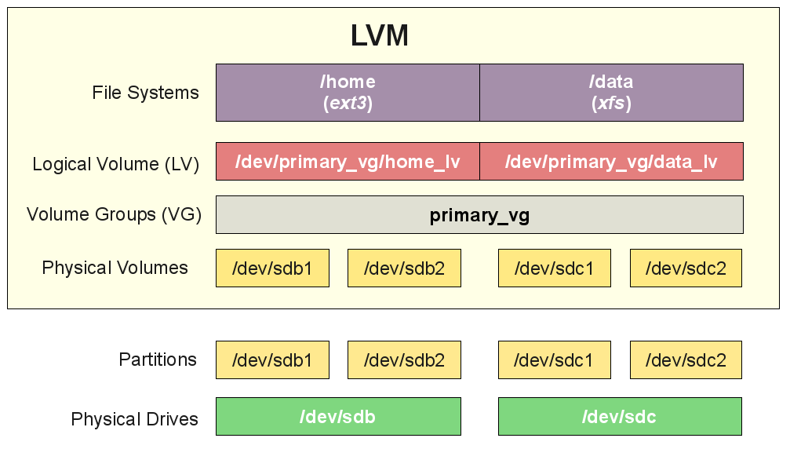

# Introduction to the Block Storage service

* Volume drivers
    * LVM
    * NFS driver (Network file systems driver)

1. LVM (Logical Volume Manager)
* LVM là một phương pháp cho phép ấn định không gian đĩa cứng (Phisical Volume) thành những Logical Volume, giúp cho bạn thay đổi kích thước phân vùng trở nên dễ dàng. 
* Thông thường khi bạn muốn thay đổi kích thước của 1 phân vùng trên ổ đĩa vật lý, bạn cần phải sửa lại partition tables. Thao tác này khá mất công và có vẻ cứng nhắc, nhiều khi còn xảy ra mất mát dữ liệu. Điểm lợi của LVM ở chỗ là, khi phân vùng của bạn bị đầy, bạn có thể tăng kích thước một cách dễ dàng, thay vì phải động vào phần cứng bên dưới, tránh các nguy cơ về mất mát dữ liệu
* Hình bên dưới giúp bạn hình dung rõ hơn về cách LVM hoạt động:
    
* Như vậy LVM như một tầng trung gian giữa ổ đĩa cứng và OS bên trên. OS sẽ chỉ làm việc với LVM, và nhìn LVM như ổ đĩa mà nó đang có
* Điểm lợi nữa ta có thể thấy là: trong trường hợp bạn có nhiều hơn 1 thiết bị lưu trữ phần cứng, nhưng dung lượng của chúng lại không đủ lớn cho nhu cầu của bạn. Bạn hoàn toàn có thể ghép nối nhiều ổ cứng lại với nhau thông qua LVM
* Một số thành phần trong LVM:
    1. Phisical Volumes (PV): là thành phần đại diện cho đĩa cứng của bạn, nó chính là các partitions.
    1. Volume Groups (VG): là thành phần có nhiệm vụ masking PV với OS. 
    1. Logical Volumes (LV): là các ổ đĩa ảo, được tạo ra trên nền Volume Groups. 
* Tham khảo về cách thao tác với LVM: [xem ở đây](https://vinahost.vn/ac/knowledgebase/226/Cac-thao-tac-qun-ly-a-tren-LVM.html)
