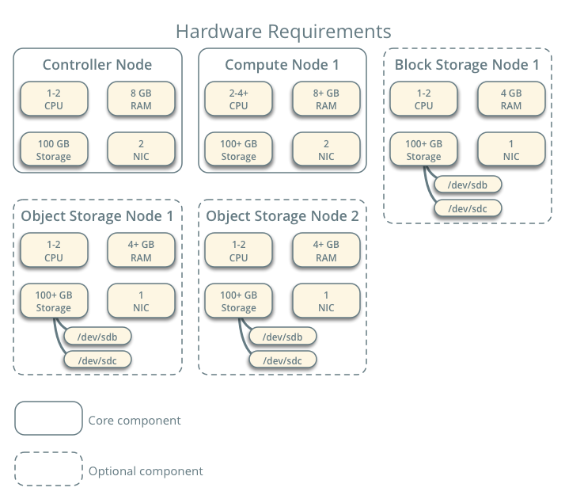

# Cài đặt OpenStack

  

* **Hardware requirements**
    1. Controller
    1. Compute
    1. Block Storage
    1. Object Storage
    1. Networking
        * Networking Option 1: Provider networks
        * Networking Option 2: Self-service networks
* **Environtment**
    1. Security
    1. Host networking
    1. Network Time Protocol (NTP)
    1. OpenStack packages
        * Enable the OpenStack repository
    1. SQL database
    1. Message queue
        * RabbitMQ, Qpid, and ZeroMQ.
    1. Memcached
* `Identity service (keystone)`
    1. The Identity service contains these components
        * Server
        * Drivers
        * Modules
    1. Create "Keystone" database
    1. Create a domain, projects, users, and roles  
        
* `Compute service`
    * OpenStack Compute consists of the following areas and their components:
        1. `nova-api` service
        1. `nova-api-metadata` service
        1. `nova-compute` service
        1. `nova-placement-api` service
        1. `nova-scheduler` service  
        .... 
* `Networking service`
    * Networking (neutron) concepts

## Sử dụng Horizon

1. Administration Guide
    1. `Customize and configure the Dashboard`
    1. `Set up session storage for the Dashboard`
        * The Dashboard uses Django sessions framework to handle user session data. However, you can use any available session back end. You customize the session back end through the SESSION_ENGINE setting in your local_settings.py file
        1. **Local memory cache**: Local memory storage is the quickest and easiest session back end to set up, as it has no external dependencies whatsoever. It has the following significant drawbacks:
            * No shared storage across processes or workers.        
            * No persistence after a process terminates.
            * The local memory back end is enabled as the default for Horizon solely because it has no dependencies. It is not recommended for production use, or even for serious development work.
        1. **Memcached**: Memcached is a high-performance and distributed memory object caching system providing in-memory key-value store for small chunks of arbitrary data.
        1. **Redis**: Redis is an open source, BSD licensed, advanced key-value store. It is often referred to as a data structure server.
        1. **Database-backed sessions**: 
            * Database-backed sessions are scalable, persistent, and can be made high-concurrency and highly available.
            * However, database-backed sessions are one of the slower session storages and incur a high overhead under heavy usage. Proper configuration of your database deployment can also be a substantial undertaking and is far beyond the scope of this documentation.
        1. **Cached database**: To mitigate the performance issues of database queries, you can use the Django `cached_db` session back end, which utilizes both your database and caching infrastructure to perform write-through caching and efficient retrieval.

        1. **Cookies**: This back end stores session data in a cookie, which is stored by the user’s browser. The back end uses a cryptographic signing technique to ensure session data is not tampered with during transport. This is not the same as encryption; session data is still readable by an attacker.
    1. `Create and manage images`
        1. [What is a virtual machine image?](https://docs.openstack.org/image-guide/introduction.html) : A virtual machine image is a single file which contains a virtual disk that has a bootable operating system installed on it. Virtual machine images come in different formats, some of which are described below.
            * AKI/AMI/ARI: 
                * **AKI (Amazon Kernel Image)**  
                A kernel file that the hypervisor will load initially to boot the image. For a Linux machine, this would be a vmlinuz file.
                * **AMI (Amazon Machine Image)**  
                This is a virtual machine image in raw format, as described above.
                * **ARI (Amazon Ramdisk Image)**  
                An optional ramdisk file mounted at boot time. For a Linux machine, this would be an initrd file.
            * ISO: The ISO format is a disk image formatted with the read-only ISO 9660 (also known as ECMA-119) filesystem commonly used for CDs and DVDs. While we do not normally think of ISO as a virtual machine image format, since ISOs contain bootable filesystems with an installed operating system, you can treat them the same as you treat other virtual machine image files.
            * RAW: The raw image format is the simplest one, and is natively supported by both KVM and Xen hypervisors. You can think of a raw image as being the bit-equivalent of a block device file, created as if somebody had copied, say, /dev/sda to a file using the dd command.
            * ...
    1. `Create and manage roles`: A role is a personality that a user assumes to perform a specific set of operations. A role includes a set of rights and privileges. A user assumes that role inherits those rights and privileges.
        * Using the dashboard, you can edit only the name assigned to a role.
    1. `Manage projects and users`: OpenStack administrators can create projects, and create accounts for new users using the OpenStack Dasboard. Projects own specific resources in your OpenStack environment. You can associate users with roles, projects, or both.
    1. `Manage instances`:Instances are virtual machines that run inside the cloud. As an administrative user, you can manage instances for users in various projects. You can view, terminate, edit, perform a soft or hard reboot, create a snapshot from, and migrate instances. You can also view the logs for instances or launch a VNC console for an instance.
    1. `Manage flavors`: In OpenStack, a flavor defines the compute, memory, and storage capacity of a virtual server, also known as an instance. As an administrative user, you can create, edit, and delete flavors.
    1. `View and manage quotas`: Để ngăn chặn khả năng của hệ thống khỏi bị cạn kiệt mà không có thông báo, bạn có thể thiết lập quotas. Quotas là các giới hạn hoạt động.
    1. `View services information`
        * `System Information` category:
            * `Services`: : Displays the internal name and the public OpenStack name for each service, the host on which the service runs, and whether or not the service is enabled.
            * `Compute Services`:  Displays information specific to the Compute service. Both host and zone are listed for each service, as well as its activation status.
            * `Network Agents`: Displays the network agents active within the cluster, such as L3 and DHCP agents, and the status of each agent.
1. User Documentation
    1. `Configure access and security for instances`
        * What are Key pairs? And how to use it?
            * Key pairs are SSH credentials that are injected into an instance when it is launched. To use key pair injection, the image that the instance is based on must contain the cloud-init package. Each project should have at least one key pair
        * Add a rule to the default security group?: Before you launch an instance, you should add security group rules to enable users to ping and use SSH to connect to the instance. Security groups are sets of IP filter rules that define networking access and are applied to all instances within a project
        * floating IP & fixed IP
            * When an instance is created in OpenStack, it is automatically assigned a fixed IP address in the network to which the instance is assigned. This IP address is permanently associated with the instance until the instance is terminated.
            * Floating IP address can also be attached to an instance. Unlike fixed IP addresses, floating IP addresses can have their associations modified at any time, regardless of the state of the instances involved.

    1. Launch and manage instances
        * Instances are virtual machines that run inside the cloud. You can launch an instance from the following sources:
            * Images uploaded to the Image service.
            * Image that you have copied to a persistent volume. The instance launches from the volume, which is provided by the cinder-volume API through iSCSI.
            * Instance snapshot that you took.
        * Availability Zone
            * By default, this value is set to the availability zone given by the cloud provider (for example, us-west or apac-south). For some cases, it could be nova.
        * Security Groups
            * Security groups are a kind of cloud firewall that define which incoming network traffic is forwarded to instances.
    1. Create and manage networks
        * Create a network
        * Create a router
