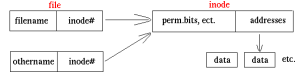
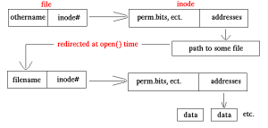

# Basic Linux

## Sơ lược về linux

* Linux là một hệ điều hành máy tính dựa trên Unix được phát triển và phân phối qua mô hình phần mềm tự do mã nguồn mở.
* Nhiều người gọi Linux là GNU/Linux, lý do là bản thân Linux chỉ là phần nhân hệ điều hành. Rất nhiều phần mềm, ứng dụng khác như hệ thống đồ họa, trình biên dịch, soạn thảo, các công cụ phát triển cũng cần được gắn vào nhân để tạo nên một HĐH hoàn chỉnh. Hầu hết những phần mềm này được phát triển bởi cộng đồng GNU.
* Unix là HĐH  có khả năng đa người dùng (vài người có thể dùng máy tính chạy Unix tại cùng một thời điểm) và đa nhiệm (chạy nhiều chương trình một lúc). Được viết bằng ngôn ngữ C nên Unix có thể cài đặt trên nhiều loại máy tính khác nhau.

## Các lệnh cơ bản trong Linux

### Các lệnh liên quan đến hệ thống

* exit: thoát khỏi cửa sổ dòng lệnh.
* reboot: khởi động lại hệ thống.
* halt: tắt máy.
* mount: gắn hệ thống tập tin từ một thiết bị lưu trữ vào cây thư mục chính.
* unmount: ngược với lệnh mount.

### Các lệnh thao tác với tệp tin

* ls [option]:lấy danh sách tất cả các file và thư mục trong thư mục hiện hành 
    * -l option: hiện file/đường dẫn, ngày thay đổi, tên file, permission...
    * -a option: hiện tất cả các file/thư mục, bao gồm các file/thư mục ẩn 
    * -F option: thêm ký tự / vào cuối mỗi thư mục
    * -r: hiển thị theo thứ tự ngược (abc)
    * -R: hiển thị toàn bộ danh sách cây thư mục với nút cha là thư mục hiện tại
    * --help: trợ giúp lệnh ls
* pwd: hiển thị đường dẫn thư mục hiện tại
* cd: thay đổi thư mục làm việc đến một thư mục mới
* mkdir: tạo thư mục 
* rmdir: xoá thư mục rỗng
* cp: copy một hay nhiều tập tin đến thư mục mới.
* mv: đổi tên hay di chuyển tập tin, thư mục
* rm: xóa tập tin
* cat: xem nội dung tập tin
* head [OPTION] [FILE]: xem các dòng đầu của tập tin (mặc định = 10 dòng)
* tail [OPTION] [FILE]: xem các dòng cuối của tập tin (mặc định = 10 dòng)

### Lệnh khi làm việc trên terminal

* clear: xoá trắng cửa sổ dòng lệnh.
* date: xem ngày, giờ hệ thống.
* cal: xem lịch hệ thống

### Lệnh quản lí hệ thống

* who: cho biết ai đang đăng nhập hệ thống
* **man: xem hướng dẫn về dòng lệnh** 
* nano: chương trình để xem và chỉnh sửa tệp trong Terminal

## Quản lý User, Group và phân quyền trong Linux

### User

* Có 2 loại: _super user(root user)_ và _regular user_
* Mỗi user còn có một định danh riêng gọi là UID. Định danh của người dùng bình thường sử dụng giá trị bắt đầu từ 500.
* Tạo USER: 
    * useradd [option] [username]
* Thay đổi thông tin cá nhân: 
    * usermod [option] [username]
    -c: “Thông tin người dùng”  
    -d: [Thư mục cá nhân]  
    -m: Tạo thư mục cá nhân nếu chưa tồn tại  
    -g: [nhóm của người dùng]  
    vd:$ useradd –c “Nghia duong trung – Server Admin” –g serveradmin nghiadt
* Xoá USER
    * userdel [option] [username]

### Group

* Group là tập hợp nhiều user lại. Group là tập hợp nhiều user lại.
* Khi tạo một user thì mặc định một group được tạo ra. Mỗi group còn có một định danh riêng gọi là GID. Định danh của group thường sử dụng giá trị bắt đầu từ 500.
* Tạo group: 
    * groupadd [groupname]
* Xoá group
    * groupdel [groupname]
* Xem thông tin về User và Group
    * id [option] [username]
    
## Quyền trong Linux

* Trong Linux có 3 dạng đối tượng:
    * Owner (người sở hữu).
    * Group owner (nhóm sở hữu).
    * Other users (những người khác).
* Các quyền hạn
    * Read – r  : cho phép đọc nội dung.
    * Write – w : dùng để tạo, thay đổi hay xóa.
    * Execute – x  : thực thi chương trình.
* Các lệnh liên quan đến quyền hạn
    * **chmod: cấp quyền hạn**  
     Chỉ có user có quyền root, hoặc user là owner của file mới có thể thay đổi quyền của file đó.  
        * chmod mode file     
        Trong mode này chúng ta có thể thêm (+), bớt (-), gán (=) các quyền (r w x) cho từng nhóm (u g o) hoặc cho cả 3 nhóm (a).
        ```linux
        vd: chmod g-w myfile : bỏ quyền write trên group.  
            chmod u+x,go+r myfile : thêm quyền thực thi cho owner, quyền đọc cho group và other. 
        ``` 
        * chmod octal_mode file
         ```linux
        vd: chmod 777 myfile : gán toàn quyền cho owner, group và other
            chmod 666 myfile : gán quyền đọc, ghi cho owner, quyền đọc cho group và other. 
        ```   
          
    * chown -R [user_name]:[group_name] [file/folder]: thay đổi chủ sở hữu file/ folder

## Tạo Links

* Mục đích của links trên Linux là tạo ra nhiều tên hoặc alias cho file và thư mục. Có 2 loại links: **hard link** và **soft link (symbolic link)**
* Inote (index node): Trong hệ thống, file được phân biệt bằng chỉ số index node, viết tắt là inode. Mỗi file name có 1 inode đi kèm. Chỉ số inode tham chiếu đến 1 vùng nhớ trong đó có chứa địa chỉ vùng nhớ lưu trữ data
* Hard link:  
      
    * File gốc có tên là _filename_, số inode là inode#, vùng dữ liệu là data.
    * Khi tạo hard link với tên là _othername_ thì inode đi kèm với nó = inode#. Do đó cả _othername_ và _filename_ đều cùng tham chiếu đến vùng dữ liệu data. 
* Soft link:   
   
    * Khi tạo soft link với tên là _othername_ thì inode đi kèm sẽ là 1 inode## khác. Inode## này tham chiếu đến vùng nhớ chứa địa chỉ dẫn đến vùng data của soft link. Trong data này chứa đường dẫn đến file gốc.
* Tạo  link: ln [-s] filename linkname
    * -s: tạo soft link
    
## Cấu trúc thư mục trên Linux

1. /: Thư mục root
1. /bin - User Binaries (Các tập tin nhị phân của người dùng)
    * Lệnh Linux phổ biến sử dụng ở chế độ Singer-user mode nằm trong thư mục này  
    * Các lệnh được sử dụng bởi tất cả người dùng của hệ thống được đặt ở đây.
    Ví dụ: ps, ls, ping, grep, cp.
1. /sbin – System Binaries (Các tập tin nhị phân của hệ thống )
    * Cũng giống như /bin, /sbin cũng chứa các tập tin thực thi nhị phân. Tuy nhiên, các lệnh đặt trong thư mục này được sử dụng thường bởi người quản trị hệ thống, với mục đích bảo trì hệ thống.   
1. /etc – Configuration Files
    * Chứa cấu hình các tập tin cấu hình của hệ thống, các tập tin lệnh để khởi động các dịch vụ của hệ thống
    ```linux
    - /etc/shadow: lưu trữ mật khẩu đã được mã hóa và chỉ có superuser mới có quyền đọc. 
    - /etc/passwd: lưu thông tin về tất cả các user 
    - /etc/group: lưu trữ danh sách các grou
    ```
1. /dev – Files device
    * Chứa các tập tin để nhận biết cho các thiết bị của hệ thống (device files).
    * Bao gồm thiết bị đầu cuối, USB hoặc các thiết bị được gắn trên hệ thống
1. /proc – Process Information (Thông tin về tiến trình)
    * Chứa các thông tin về System Process.
1. /var – Variable Files (Các tập tin tham biến)
    * Các tập tin mà nội dung được dự kiến sẽ thay đổi thì được đặt trong thư mục này. Bao gồm – các tập tin đăng nhập hệ thống (/var/log); các gói và các tập tin cơ sở dữ liệu (/var/lib), email (thư mục /var/mail); hàng đợi in (/var/spool), tập tin khóa (/var/lock) ; các tập tin tạm cần thiết để khởi động lại (/var/tmp)
1. /tmp – Temporary Files (Các tập tin tạm thời)
    * Thư mục chứa các tập tin tạm thời được tạo ra bởi hệ thống và người dùng.
    * Các tập tin trong thư mục này sẽ bị xóa khi hệ thống khởi động lại
1. /usr – User Programs  
    Bao gồm các tập tin nhị phân, thư viện, tài liệu, và mã nguồn cho các chương trình cấp thứ hai.
    * **/usr/bin**:  chứa các tập tin nhị phân cho các chương trình cấp người dùng. Nếu bạn không thể tìm thấy một tập tin nhị phân cấp người dùng trong /bin, hãy tìm trong /usr/bin.
    * **/usr/sbin**: chứa các tập tin nhị phân cho người quản trị hệ thống. Nếu bạn không thể tìm thấy một tập tin nhị phân cấp hệ thống trong /sbin, hãy tìm trong /usr/sbin. Ví dụ: atd, cron, sshd, useradd, userdel
    * **/usr/lib**: chứa các thư viện cho /usr/bin và /usr/sbin
    * **/usr/local**: bao gồm các chương trình user mà đã được cài đặt từ mã nguồn. Ví dụ, khi bạn cài đặt apache từ mã nguồn, nó được đặt trong /usr/local/apache2
1. /home – thư mục Home
    * Thư mục chính lưu trữ các tập tin cá nhân của tất cả user.
1. /boot – Boot Loader Files
    * Chứa các tập tin cấu hình cho quá trình khởi động hệ thống.
1. /lib - System Libraries
    * Chứa các file thư viện hỗ trợ các thư mục nằm dưới /bin và /sbin.
    
## Quản lý tiến trình trong Linux

* Một tiến trình = một sự thực thi của một chương trình
* Mỗi tiến trình sẽ tương ứng với một tập các thông tin
  sau: 
    * Một định danh (pid) 
    * Một tiến trình cha (ppid) 
    * Người sở hữu (uid) và nhóm (gid) 
    * Một đầu vào chuẩn (stdin), một đầu ra chuẩn (stdout), một kênh
      báo lỗi chuẩn (stderr) 
    * Thời gian sử dụng CPU (CPU time) và mức độ ưu tiên 
    * Thư mục hoạt động hiện tại của tiến trình
    * Bảng các tham chiếu đến các file được tiến trình sử dụng. 
* Các kiểu tiến trình:
    * Các tiến trình hệ thống:
        * Thường thuộc về quyền root 
        * Không có giao diện tương tác
        * Thường được chạy dưới dạng các tiến trình ngầm (daemon)
        ```linux
        vd: cron: tự động thực hiện một lệnh/chương trình vào một thời
            gian xác định trước. 
        ```
    * Các tiến trình của người sử dụng:
        * Thực hiện các nhiệm vụ của một người dùng cụ thể
        * Thường được thực hiện, quản lý bằng một terminal 
* Các thao tác lệnh với tiến trình: 
    * ps [option]: Hiển thị thông tin tiến trình
        * -e: hiển thị thông tin về mỗi tiến trình
        * -l: hiển thị thông tin đầy đủ tiến trình
        * -f: hiển thị thông tin về tiến trình cha
        * -a: hiển thị tất cả các tiến trình
        ```linux
         vd: ps –aux: liệt kê tất cả tiến trình đang chạy.
        ``` 
    * top [option]: Hiển thị một danh sách các tiến trình hệ thống theo thời gian thực
    * kill [signal] [PID]: Dừng một tiến trình
        * signal: tên của tín hiệu được gởi tới tiến trình.
        * PID: mã số nhận diện tiến trình muốn dừng.
        * Super-user mới có quyền dừng tất cả các tiến trình, còn người sử dụng chỉ được dừng các tiến trình của mình
        * Các signal thường dùng lệnh kill bao gồm:
            * SIGHUP 1 – Hangup (gọi lại tiến trình)
            * SIGINT 2 – Ngắt từ bàn phím (Ctrl+C)
            * SIGKILL 9 – Hủy tiến trình
            * SIGTERM 15 – Kết thúc tiến trình
            

