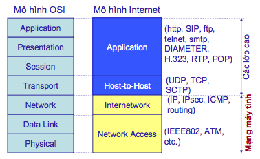

# Mạng máy tính

* Mạng máy tính hay hệ thống mạng (computer network hay network system) là sự kết hợp các máy tính lại với nhau thông qua các thiết bị nối kết mạng và phương tiện truyền thông (giao thức mạng, môi trường truyền dẫn) theo một cấu trúc nào đó và các máy tính này trao đổi thông tin qua lại với nhau.

## Phân loại mạng

1. LAN (`Local Area Network`)
    * Là mạng tư nhân trong một toà nhà, một khu vực (trường học hay cơ quan chẳng hạn) có cỡ chừng vài km. Chúng nối các máy chủ và các máy trạm trong các văn phòng và nhà máy để chia sẻ tài nguyên và trao đổi thông tin. LAN có 3 đặc điểm:
        1. Giới hạn về tầm cỡ phạm vi hoạt động từ vài mét cho đến 1 km.
        1. Thường dùng kỹ thuật đơn giản chỉ có một đường dây cáp (cable) nối tất cả máy. Vận tốc truyền dữ liệu thông thường là 10 Mbps, 100 Mbps, 1 Gbps, 100 Gbps
        1. Kiến trúc mạng kiểu LAN thông dụng bao gồm:
            * Mạng bus
            * Mạng ring (Mạng vòng)
            * Mạng star (Mạng sao)
            * Mesh (Mạng lưới)
1. MAN (`Metropolitan Area Network`)
    * Là mạng có cỡ lớn hơn LAN, phạm vi vài km. Nó có thể bao gồm nhóm các văn phòng gần nhau trong thành phố, nó có thể là công cộng hay tư nhân và có đặc điểm:
        1. Phạm vi kết nối tương đối lớn (> 1km và < 50km)
        1. Chi phí cao và quản trị phức tạp hơn LAN
        1. Có thể hỗ trợ chung vận chuyển dữ liệu, đàm thoại, hay ngay cả truyền hình. Ngày nay người ta có thể dùng kỹ thuật cáp quang (fiber optical) để truyền tín hiệu. Vận tốc có hiện nay thể đạt đến 10 Gbps.
1. WAN (`Wide Area Network`)  
    * Dùng trong vùng địa lý lớn thường cho quốc gia hay cả lục địa, phạm vi vài trăm cho đến vài ngàn km. Chúng bao gồm tập hợp các máy nhằm chạy các chương trình cho người dùng. Các máy này thường gọi là máy chủ(host), máy đầu cuối (end system). Các máy chính được nối nhau bởi các mạng truyền thông con (**communication subnet**) hay gọn hơn là mạng con (**subnet**). Nhiệm vụ của mạng con là chuyển tải các thông điệp (message) từ máy chủ này sang máy chủ khác.

## Các phương pháp truyền tin

1. Chuyển mạch kênh (`Circuit Switching`)

    * Khi có hai trạm cần trao đổi thông tin với nhau thì giữa chúng sẽ được thiết lập một "kênh" cố định và được duy trì cho đến khi một trong hai bên ngắt kết nối. Dữ liệu chỉ được truyền theo con đường cố định này
    * Phương thức hoạt động cơ bản: 
        * Mạng chuyển mạch có thể bao gồm nhiều nút (hay trạm nối dây). Mỗi nút và mỗi đầu cuối đều được địa chỉ hoá
        * Nguồn gửi thông tin sẽ yêu cầu nối mạng tới một địa chỉ đích.
        * Các nút mạng sẽ tự động tìm ra các nút trung gian để nối thành một mạch dẫn từ nguồn tới đích một cách liên tục theo thuật toán đã định sẵn (quá trình này sẽ lâu hơn nếu hai máy nguồn và máy đích cách nhau qua nhiều nút trung gian hơn). Trường hợp một trong các nút trung gian không thể hoàn tất việc nối mạch thì tín hiệu bận (busy) có thể được chuyển về từ nút đó.
        * Trong thực tế, mỗi nút đều có sẵn một bảng ghi nhận các địa chỉ và các nút tương ứng gọi là bảng chuyển tiếp (**forwarding table**). Bảng này được cập nhật mỗi khi có thêm nút mới hay địa chỉ mới. Do đó, các nút chỉ việc yêu cầu nối dây với đường ra thích hợp dựa vào bảng này mỗi khi có lệnh thiết lập đường nối từ ngõ vào tới một địa chỉ bất kì.
        * Nếu máy đích chấp thuận, và việc nối mạch với máy đích hoàn tất thì tín hiệu thông mạch (hay tính hiệu chấp thuận) sẽ được trả về. Ngược lại tín hiệu hết thời lượng (timeout) sẽ được gửi về máy chủ.
        * Máy chủ bắt đầu trao đổi thông tin hay hủy bỏ việc trao đổi. Các nút mạng cũng sẽ tự hủy bỏ đường nối, giải phóng các nút cho các yêu cầu nối-chuyển khác.
    * Ví dụ về mạng chuyển mạch kênh: mạng điện thoại
    * Ưu điểm: kênh truyền được dành riêng trong suốt quá trình giao tiếp do đó tốc độ truyền dữ liệu được bảo đảm.
    * Nhược điểm: phải tốn thời gian để thiết lập đường truyền cố định giữa hai trạm; hiệu suất sử dụng đường truyền không cao, vì có lúc trên kênh không có dữ liệu truyền của hai trạm kết nối, nhưng các trạm khác không được sử dụng kênh truyền này.

1. Chuyển mạch thông báo (`Message Switching`)
    * Mỗi thông báo được xem như một khối độc lập bao gồm cả địa chỉ nguồn và địa chỉ đích. Mỗi thông báo sẽ được truyền qua các trạm trong mạng cho đến khi nó đến được địa chỉ đích, mỗi trạm trung gian sẽ nhận và lưu trữ thông báo cho đến khi trạm trung gian kế tiếp sẵn sàng để nhận thông báo sau đó nó chuyển tiếp thông báo đến trạm kế tiếp, chính vì lý do này mà mạng chuyển mạch thông báo còn có thể được gọi là mạng lưu và chuyển tiếp (Store and Forward Network)
    * Một ví dụ điển hình về kỹ thuật này là dịch vụ thư điện tử (e-mail), nó được chuyển tiếp qua các trạm cho đến khi tới được đích cần đến.
    * Ưu điểm: cung cấp một sự quản lý hiệu quả hơn đối với sự lưu thông của mạng, bằng cách gán các thứ tự ưu tiên cho các thông báo và đảm bảo các thông báo có độ ưu tiên cao hơn sẽ được lưu chuyển thay vì bị trễ do quá trình lưu thông trên mạng; giảm sự tắc nghẽn trên mạng, các trạm trung gian có thể lưu giữ các thông báo cho đến khi kênh truyền rảnh mới gửi thông báo đi; tăng hiệu quả sử dụng kênh truyền, với kỹ thuật này các trạm có thể dùng chung kênh truyền.
    * Nhược điểm: độ trễ do việc lưu trữ và chuyển tiếp thông báo là không phù hợp với các ứng dụng thời gian thực, Các trạm trung gian phải có dung lượng bộ nhớ rất lớn để lưu giữ các thông báo trước khi chuyển tiếp nó tới một trạm trung gian khác (kích thước của các thông báo không bị hạn chế).

1. Chuyển mạch gói (`Packet Switching`)  
    Kỹ thuật này được đưa ra nhằm tận dụng các ưu điểm và khác phục những nhược điểm của hai kỹ thuật trên
    * Dữ liệu cần vận chuyển được chia nhỏ ra thành các gói (packets) có kích thước (size), định dạng (format) xác định và sẽ được đánh số thứ tự.
    * Mỗi gói như vậy sẽ được chuyển riêng rẽ và có thể đến nơi nhận bằng các đường truyền (router) khác nhau. Như vậy, chúng có thể dịch chuyển trong cùng thời điểm
    * Khi toàn bộ các gói dữ liệu đã đến nơi nhận thì chúng sẽ được hợp lại thành dữ liệu ban đầu theo đúng thứ tự gửi đi.  
    * Mỗi gói dữ liệu có kích thước được định nghĩa từ trước (đối với giao thức TCP/IP thì kích thước tối đa của nó là 1500 bytes) và thường bao gồm 3 phần:
        * Header: chứa địa chỉ máy gửi, địa chỉ máy nhận và các thông tin về loại giao thức sử dụng và số thứ tự của gói.
        * Data (Payload): một trong những đoạn dữ liệu gốc đã được cắt nhỏ.
        * Cách thức chuyển tiếp gói tin: 
            * Unicast: chuyển tiếp gói tin tới 1 nút mạng
            * Multicast: chuyển tiếp gói tin tới một nhóm các nút mạng
            * Broadcast: chuyển tiếp gói tin tới tất cả các nút trong mạng

## Thông số mạng

1. Băng thông (Bandwidth - B)
    * Băng thông ≡ Tốc độ truyền tin ≡ Dung lượng
    * Băng thông là độ rộng dải tần, tức độ chênh lệch giữa tần số cao nhất với tần số thấp nhất trên cùng một kênh truyền thông hay giữa các bước sóng.
    * Thường được dùng để chỉ một khối lượng dữ liệu có thể truyền tải được trong một thời gian nhất định. Đối với các thiết bị kỹ thuật số, băng thông được tính với đơn vị bps (bit mỗi giây) hay Bps (byte mỗi giây). Còn đối với các thiết bị analog, băng thông được thể hiện bằng chu kỳ mỗi giây, hay Hertz (Hz).
    * Băng thông là đo lường mức độ thông tin hay bit có thể chạy từ nơi này sang nơi khác trong một khoảng thời gian cho trước tính theo giây.
1. Độ trễ (Latency - L)
    * Là khoảng thời gian chuyển một thông điệp từ nút này đến nút khác trong hệ thống mạng.
1. Thông lượng (Throughput – T)
    * Thông lượng là lượng dữ liệu đi qua đường truyền trong một đơn vị thời gian. Hay thông lượng là băng thông thực sự mà các ứng dụng mạng được sử dụng trong một thời gian cụ thể
    * Thông lượng thường nhỏ hơn nhiều so với băng thông tối đa có thể có của môi trường truyền dẫn được sử dụng (Throughput ≤ Bandwidth).
    * Thông lượng của mạng máy tính phụ thuộc vào các yếu tố như khoảng cách liên kết, môi trường truyền dẫn, các công nghệ mạng, dạng dữ liệu được truyền, số lượng người dùng trên mạng, máy tính người dùng, máy chủ, …

## Protocol là gì

* Protocol là một giao thức mạng được tập hợp tất cả các quy ước, quy tắc điều khiển việc trao đổi thông tin của người dùng giữa các hệ thống máy tính với nhau.
* Ví dụ một số giao thức như: TCP/IP, SPX/IPX, v.v…   
    _**(SPX/IPX ?????)**_
* Các dạng liên kết:
    * **Connectionless & Connection- Oriented protocols**: Giao thức hướng kết nối và giao thức không kết nối
    * **Routable & non-Routable protocols**: Giao thức có khả năng định tuyến và giao thức không có khả năng định tuyến
    * Giao thức không kết nối:
        * Không thiết lập liên kết, chỉ có giai đoạn truyền dữ liệu
        * “Best effort”: truyền ngay với khả năng tối đa
        * Không tin cậy
    * Giao thức hướng kết nối
        * Dữ liệu được truyền qua một liên kết đã được thiết lập
        * Ba giai đoạn: Thiết lập liên kết, Truyền dữ liệu, Hủy liên kết
        * Tin cậy
    * Giao thức có khả năng định tuyến:   
        Là các giao thức cho phép đi qua các thiết bị liên mạng như Router để xây dựng các mạng lớn có qui mô lớn hơn
    * Giao thức không có khả năng định tuyến:   
        Các giao thức này không cho phép đi qua các thiết bị liên mạng như Router để xây dựng các mạng lớn.

## Mô hình OSI và TCP/IP

### Sơ lược về 2 mô hình

1. Mô hình OSI 
    * 
    * Tầng Vật lý (`Physical`): Chuyển dữ liệu (bit) thành tín hiệu và truyền
    * Tầng Liên kết dữ liệu (`Data link`): Truyền dữ liệu trên các liên kết vật lý giữa các nút mạng kế tiếp nhau
    * Tầng Mạng (`Network`): Chọn đường (định tuyến), chuyển tiếp gói tin từ nguồn đến đích
    * Tầng Giao vận (`Transport`): Xử lý việc truyền-nhận dữ liệu cho các ứng dụng chạy trên nút mạng đầu cuối
    * Tầng Phiên(`Session`): quản lý phiên làm việc, đồng bộ hóa phiên, khôi phục quá trình trao đổi dữ liệu
    * Tầng Trình diễn (`Presentation`): dịch dữ liệu được gửi từ tầng Application sang dạng Fomat chung. Và tại máy tính nhận, lớp này lại chuyển từ Fomat chung sang định dạng của tầng Application. Tầng trình diễn thực hiện các chức năng: dịch các mã ký tự từ ASCII sang EBCDIC. - Chuyển đổi dữ liệu, ví dụ từ số interger sang số dấu phảy động. - Nén dữ liệu để giảm lượng dữ liệu truyền trên mạng. - Mã hoá và giải mã dữ liệu để đảm bảo sự bảo mật trên mạng.
    * Tầng Ứng dụng (`Application`): cung cấp các ứng dụng trên mạng (web, email, truyền file…)

1. Mô hình TCP/IP
    * 
    * Trong mô hình TCP/IP (Internet), chức năng 3 tầng trên được phân định cho một tầng duy nhất

1. Triền khai
    * Mô hình OSI được coi là mô hình tham chiếu chức năng. Các mô hình khác phải tham chiếu từ mô hình này.
    * Mô hình OSI không được sử dụng trên thực tế.
    * Mô hình TCP/IP: mô hình Internet, được sử dụng trên hầu hết các hệ thống mạng.
    