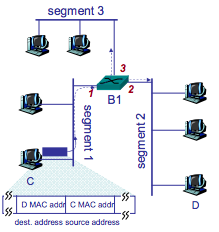
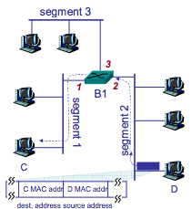
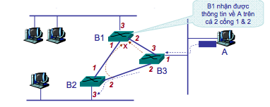
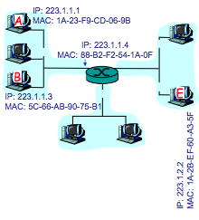
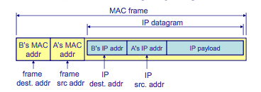
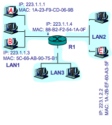
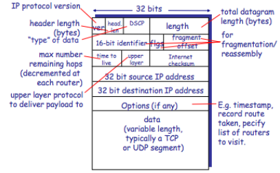

# Mạng máy tính - Cơ bản (2)

## Tầng Liên kết dữ liệu ( `L2 - Data Link Layer`)

1. Nhiệm vụ của lớp con MAC  
    Ta nhắc lại nhiệm vụ của tầng MAC trong tầng L2 là:
    * Quy định việc đánh địa chỉ MAC cho các thiết bị mạng 
    * Đưa ra cơ chế chia sẻ môi trường vật lý kết nối nhiều máy tính
    * Phỏng tạo kênh truyền song công (duplex channel) - truyền tín hiệu theo cả 2 hướng tại cùng một thời điểm, đa điểm (multipoint)

1. Cấu trúc MAC Frame chuẩn IEEE 802.3 
    1. Cấu trúc Frame  
        
        * MAC Header: 
            * Mỗi Frame sẽ thường được bắt đầu bởi một synchronization pattern. Pattern này bao gồm Preamble Pattern + 1 flag byte hoặc chỉ đơn giản là 1 flag byte
            * The Preamble: Ta có thể hiểu 1 cách đơn giản là: đây như là 1 bộ phận giúp đồng bộ clock của người gửi và người nhận, sự đồng bộ này được cung cấp ở mức bit. Vd. Ethernet sử dụng 7 bytes preamble
            * The SFD (Start Frame Delimiter) Flag: Có giá trị 1 byte, giúp bên nhận biết được nội dung thực sự, đó là ngay sau SFD này.
            Ví dụ: Ethernet sử dụng byte SFD với giá trị 10101011 
        * MAC Address: theo ngay sau SFD
        * LLC(Logical Link Control) Header: đóng vai trò là định danh duy nhất cho phần data được giữ trong frame này. 
        * Frame Data (Payload): 
            * Là nơi chứa nội dung gói tin cho L3 (Network Layer), sau LLC Header và trước MAC Trailer
        * MAC Trailer: 
            * CRC/checksum: Là mã 32 bit để check gói tin bên nhận nhận được có lỗi hay không.

    1. Cấu trúc địa chỉ MAC
        * Địa chỉ MAC được quản lý bởi IEEE
        * 6 bytes ~ 48 bits và  được biểu diễn bằng 1 nhóm 6 số hex, vd: **01:23:45:67:89:ab**
        * Là địa chỉ _duy nhất_ và _cố định_. Nhà sản xuất sẽ mua dải địa chỉ và gán cho giao diện mạng (Network Interface Card - NIC)
        * Địa chỉ MAC _không có cấu trúc_ (flat address)
        * Địa chỉ MAC dùng để: nhận biết trạm gửi (tại bên gửi) và kiểm tra địa chỉ đích để biết các frame có phải đang được gủi đến cho mình hay không (bên nhận)
        * Địa chỉ quảng bá (broadcast) trong mạng LAN: FF-FF-FF-FF-FF-FF

    1. Các tạo Mã CRC - Cyclic Redundancy Check
        * Phía gửi
            * Chọn 1 đa thức sinh bậc k
            * Biểu diễn đa thức dưới dạng chuỗi bit P
            * Thêm k bit 0 vào frame dữ liệu F được Fk
            * Chia Fk cho P, lấy phần dư R
            * Ghép phần dư vào chuỗi dữ liệu được FR
        * Phía nhận : lấy FR chia cho P
            * Nếu chia hết -> truyền đúng
            * Nếu chia có dư, căn cứ vào số dư (syndrom) để phát hiện và sửa lỗi (nếu được)  
        ```frame
        Vd. Frame : 1101011011
        Đa thức : G(x) = x4 + x + 1 => P = 10011
        Nối vào Frame : Fk = 11010110110000
        R = Fk mod P = 1110
        Gửi : 11010110111110
        ```
1. Miền quảng bá (broadcast domain) & Miền đụng độ (Collision domain)
    * Collision domain: Miền đụng độ được định nghĩa là các đoạn mạng Ethernet hay Fast Ethernet nằm giữa một cặp Bridge hay các thiết bị lớp 2 khác. Vì lý do đó toàn bộ lưu lượng chia sẻ chung đường truyền kết nối đến thiết bị lớp 2. Trong miền đụng độ một thiết bị gửi tín hiệu đến Hub (bộ tập trung) thì tất cả các thiết bị khác đều nhận được. Các Hub mở rộng Collision domain, trong khi đó các Bridge và Switch tạo ra các Collision domain.

    * Broadcast domain: Gọi là miền quảng bá, nó là một vùng trong đó thông tin được gửi tới tất cả các thiết bị được kết nối. Thiết bị giới hạn miền quảng bá là các Router. Và cũng chính Router tạo ra các miền quảng bá. Như vậy mỗi một giao diện của Router là một Broadcast domain. Một Broadcast domain có thể gồm nhiều Collision domain.

    * Ví dụ: Ethernet LANs là các miền quảng bá, mọi thiết bị kết nối vào mạng LAN đều có thể gửi thông tin tới các thiết bị khác trong mạng. Ngoài ra các thiết bị như Repeater, Hub chúng mở rộng mạng LAN tức là mở rộng miền quảng bá. Các thiết bị như Bridge, Switch làm nhiệm vụ kết nối các LAN với nhau nên chỉ mở rộng miền quảng bá chứ không ngăn được các bản tin phát quảng bá.

1. KẾT NỐI MẠNG Ở TẦNG MAC
* Vấn đề gì sẽ xảy ra nếu xây dựng một mạng LAN với số nút lớn và bảo phủ một vùng địa lý rộng?
    * VĐ1: Do chiều dài kênh truyền lớn -> chất lượng tín hiệu không đảm bảo do suy hao
    * VĐ2: Chiều dài kênh truyền càng lớn, hiệu suất kênh truyền càng giảm do xác suất va đập tăng
    * VĐ3: Trong một miền quảng bá, số nút lớn dẫn đến băng thông chia sẻ cho một nút giảm

* Các thiết bị kết nối trong mạng LAN
    * Tầng vật lý: Repeater và Hub
    * Tầng liên kết dữ liệu: Bridge và Switch
    * Tầng mạng: router (sẽ được nhắc đến ở tầng Mạng)

    1. Repeater (bộ lặp)
        * Tín hiệu vật lý ở đầu vào sẽ được khuếch đại, từ đó cung cấp tín hiệu ổn định và mạnh hơn cho đầu ra, để có thể đến được những vị trí xa hơn
        * <= 4 repeater/1 đoạn mạng
        * Giải quyết được **VĐ1** nhưng không giải quyết được 2 vấn đề còn lại.
    1. Hub
        * Hub được coi như là một Repeater nhiều cổng. Nó chỉ khác biệt với Repeater ở chỗ là Repeater thì khuếch đại âm thanh, Hub thường là không.
        * Khi nhận được gói tin, hub lưu trữ và chuyển tiếp gói tin tới các cổng khác.
        * Không thể tạo virtual LAN khi sử dụng Hub
        * Chỉ truyền tính hiệu điện hoặc các bit (Vì hoạt động ở tầng vật lý)
        * Cách thức hoạt động:
            * Khi tất cả các máy tính gửi các gói tin, những gói tin đó được sao chép tới tất cả các port khác của Hub. Điều đó có nghĩa, các Hub chỉ đơn giản là sao chép các tín hiệu và dự định rằng người nhận sẽ nhận được các gói tin đó. Tức là, Hub không có khái niệm lọc và chuyển tiếp (filtering and forwarding) các gói tin nên việc xảy ra tranh chấp trong hub là điều không thể tránh khỏi.
        * **Active Hub**: loại Hub này thường được sử dụng phổ biến, cần được cấp nguồn khi hoạt động. **Active Hub** dùng để khuếch đại tín hiện đến và chia ra những cổng còn lại để đảm bảo tốc độ tín hiệu cần thiết khi sử dụng.
        * **Smart Hub**: hay còn gọi là **Intelligent Hub** cũng có chức năng làm việc tương tự như Active Hub, nhưng được tích hợp thêm chip có khả năng tự động dò lỗi trên mạng.
    1. Bridge
        * Dùng để kết nối giữa hai mạng LAN có topology khác nhau để tạo thành một mạng lớn
        * Cho phép phân mảnh một mạng LAN lớn thành nhiều segment hay nhiều vùng Collision domain nhỏ
    1. Switch
        * Được coi như một Bridge nhiều cổng.
        * Có thể tạo virtual LAN
        * Nhận xét: Vì địa chỉ MAC có dạng phẳng (flat address), không có cấu trúc -> không định tuyến được bằng địa chỉ MAC khi gửi MAC frame liên mạng LAN. Do đó Switch cần có một cơ chế khác để trao đổi MAC Frame giữa các máy.
        * Nguyên tắc hoạt động:
            * "Store-and-Forward", kiểm tra trạng thái kênh trước khi gửi gói sang một segment khác (no-frill bridge)
            * Tự "học" (learning bridge)
            * Cho phép tạo cây bắc cầu tối thiểu (MST – minimum spanning tree)
        * **No-frill bridge**
            * Khi nhận được một frame trên một interface, bridge kiểm tra trạng thái các kênh nằm trên các interface còn lại, nếu kênh truyền rỗi -> gửi dữ liệu
        * **Learning bridge**
            * Để tăng hiệu suất kênh truyền, learning bridge sử dụng cơ chế lọc gói (frame filtering). Nguyên tắc lọc là: _Frame tới một trạm trong cùng 1 segment sẽ không được gửi sang các segment khác_ Vậy làm sao để biết địa chỉ đích của 1 frame nằm ở segment nào? 
            * Bridge “ghi nhớ” vị trí của một trạm với cổng tương ứng
                * Khi nhận một Frame, bridge liền ghi nhớ vị trí của máy gửi bằng cách là lưu giữ vị trí của máy gửi vào bảng chuyển tiếp (_forwarding table_)
                * Cấu trúc của _Forwarding table_ là: {Địa chỉ MAC của trạm, số cổng tương ứng, thời gian sống }
            ```ma gia
            if địa chỉ đích nằm trong cùng Segment LAN
            then bỏ Frame
            else { 
                tìm địa chỉ đích trong Forwarding table;
                if tìm thấy địa chỉ đích
                then chuyển tiếp Frame tới cổng tương ứng;
                else gửi Frame tới tất cả các cổng; 
                /* trừ cổng trên đó bridge nhận được khung*/
            }
            ```
            * Cơ chế gửi & nhận một Frame qua 2 segments khác nhau trong LAN: 
                * 
                * C gửi Frame
                * Switch B1 nhận Frame tại cổng 1. B1 không có thông tin về vị trí của D -> B1 chuyển tiếp frame qua cổng 2 và 3
                * B1 cập nhật vị trí của C ở cổng 1 vào Forwarding table
                * Segment 3 bỏ qua Frame do không có địa chỉ MAC nào phù hợp với des MAC trong Frame, D nhận khung          
                * 
                * D gửi Frame
                * B1 nhận frame tại cổng 2. B1 tìm được vị trí của C ở Forwarding table -> chuyển Frame qua cổng 1
                * B1 cập nhật vị trí của D ở cổng 2 vào Forwarding table. C nhận frame.
        * **Spanning tree**
            * Vì cơ chế lọc gói chỉ hoạt động khi đồ hình mạng (topology) không xuất hiện vòng lặp.   
                
            * Để giải quyết cho các mô hình vòng lặp người ta sử dụng Spanning tree protocol
    1. Router (Sẽ được nói đến trong `Tầng Mạng`)
    
## Tầng mạng ( `L3 - Network Layer`)

1. Khái quát về L3
    * Điều khiển truyền dữ liệu giữa các nút mạng qua môi trường liên mạng
    * Cài đặt trên mọi hệ thống cuối và bộ định tuyến
    * Truyền dữ liệu từ host-host
    * Đơn vị truyền: datagram
        * Mỗi datagram gồm 2 thành phần là: Header Data (Payload)
        
    * Bên gửi: nhận dữ liệu từ tầng giao vận, đóng gói
    * Bên nhận: mở gói, chuyển phần dữ liệu trong payload cho tầng giao vận
    * Bộ định tuyến (Router): đóng vai trò định tuyến và chuyển tiếp
1. Các chức năng chính của L3
    * `Định tuyến (Routing)`: Tìm đường đi (qua các nút trung gian) để gửi dữ liệu từ nguồn tới đích
    * `Chuyển tiếp (Forwarding)`: Chuyển gói tin từ cổng vào tới cổng ra
        * Bảng chuyển tiếp xác định cổng ra (outgoing port) để chuyển dữ liệu tới đích
    * `Định địa chỉ (Addressing)`: Định danh cho các nút mạng
    * `Đóng gói dữ liệu (Encapsulating)`: Nhận dữ liệu từ **tầng giao vận**, thêm tiêu đề mang thông tin điều khiển quá trình truyền dữ liệu từ nguồn tới đích
    * `Đảm bảo chất lượng dịch vụ (QoS)`: đảm bảo các thông số phù hợp của đường truyền theo từng dịch vụ
1. Giao thức IP
    1. Đặc điểm
        * Là giao thức được định tuyến (routed protocol), để xác định trước đường đi cho dữ liệu
        * Giao thức hướng không liên kết (**Connectionless- Oriented protocols**), là giao thức không tin cậy và nhanh
            * Truyền dữ liệu theo phương thức "best effort"
            * Khi cần, sẽ sử dụng dịch vụ tầng trên để đảm bảo độ tin cậy (TCP)
        * Các gói tin được xử lý độc lập
    1. Địa chỉ IPv4
        * Một số 32-bit để định danh cổng giao tiếp mạng trên nút đầu cuối (PC,server, smart phone),bộ định tuyến 
        * Mỗi địa chỉ IP được gán cho một cổng duy nhất
        * Địa chỉ IP có tính duy nhất trong mạng
        * Cấp phát địa chỉ IP ntn?
            * Cấp phát cố định (Static IP): với Linux, sẽ được cấu hình trong file  **/etc/network/interfaces**
            * Cấp phát động: sử dụng giao thức DHCP - Dynamic Host Configuration Protocol
        * Các dạng địa chỉ IP:
            * Địa chỉ mạng (`Network Address`):
                * Định danh cho một mạng
                * Tất cả các bit phần HostID là 0
            * Địa chỉ quảng bá (`Broadcast Address`):
                * Địa chỉ dùng để gửi dữ liệu cho tất cả các máy trạm trong mạng
                * Tất cả các bit phần HostID là 1
            * Địa chỉ máy trạm (`Unicast Address`): được gán cho 1 cổng mạng
            * Địa chỉ nhóm (`Multicast address`): định danh cho 1 nhóm
        * Cấu tạo: 2 phần là **Network ID** và **Host ID**
            * Host ID – phần địa chỉ máy trạm
            * Network ID – phần địa chỉ mạng
            * Vậy làm sao để phân biệt được 2 thành phần này trong 1 địa chỉ IP
        * Cách 1: Phân lớp địa chỉ
            * Có 5 lớp mạng (A, B, C, D và E) được định nghĩa. Lớp A sử dụng 8 bits cho phần network, 24 bits được sử dụng cho phần host. Lớp B dùng 16 bits cho network, 16 bit dành cho host. 24 bits được sử dụng để xác định phần network cho lớp C, do đó, mỗi network của lớp C chỉ còn 8 bit để đánh địa chỉ host. Lớp D được dùng cho địa chỉ Multicast còn lớp E để dự trữ.
            * 
            * Dễ dàng nhận thấy:  việc phân chia cứng thành các lớp (A, B, C, D, E) làm hạn chế việc sử dụng toàn bộ không gian địa chỉ 
        * Cách 2: Không phân lớp – CIDR (Classless Inter Domain Routing)
            * Phần địa chỉ mạng sẽ có độ dài bất kỳ
            * Dạng địa chỉ: m1.m2.m3.m4 /n, trong đó n (**mặt nạ mạng**) là số bit trong phần ứng với địa chỉ mạng
            * Cách tính địa chỉ mạng  
            
            * Với việc sử dụng địa chỉ kiểu này thì IP và submask sẽ phải luôn đi cùng nhau.
        * Mạng con - `subnet`: Là một phần của một mạng nào đó
            * Để tạo subnet: Ta sẽ sử dụng 1 mặt nạ dài hơn
        * Địa chỉ IP đặc biệt 
        
    1. Địa chỉ IPv6
1. Router
    * Router hay còn gọi là thiết bị định tuyến hoặc bộ định tuyến, là thiết bị mạng máy tính dùng để chuyển các gói dữ liệu qua một liên mạng và đến các đầu cuối, thông qua việc định tuyến và chuyển tiếp (_Định tuyến và chuyển tiếp đã được nói ở trên_).
    * Router dựa vào bảng định tuyến (routing table) để tìm đường đi cho gói dữ liệu
    * Bảng định tuyến được quản trị mạng cấu hình tĩnh (`static`), nghĩa là được thiết lập 1 lần và thường do quản trị mạng nhập bằng tay, hoặc động (`dynamic`), nghĩa là bảng tự học đường đi và nội dung tự động thay đổi theo sự thay đổi của topo mạng

1. Giao thức ARP - Address Resolution Protocol
    * ARP được sử dụng để từ một địa chỉ mạng (vd một địa chỉ IPv4) tìm ra địa chỉ MAC, hay còn có thể gọi là phân giải địa chỉ IP sang địa chỉ máy
    * Tại sao cần ARP?
        * Truyền tin trên tầng mạng dùng địa chỉ IP
        * Truyền tin trên tầng liên kết dữ liệu dùng địa chỉ MAC
        * Khi gửi: dữ liệu chuyển từ tầng mạng xuống tầng liên kết dữ liệu
            * Dữ liệu gửi trong mạng LAN: Máy nguồn cần phải biết địa chỉ MAC của máy đích
            * Dữ liệu gửi ra ngoài mạng LAN: Máy nguồn phải biết địa chỉ MAC của router
    * Hoạt động của ARP
        * Mỗi nút trong mạng LAN sử dụng bảng ARP Table
            * Ánh xạ <Địa chỉ IP, Địa chỉ MAC, TTL)
            * TTL: Thời gian giữ ánh xạ trong bảng
        * Với hình vẽ bên dưới A sẽ làm như thế nào để lấy được địa chỉ MAC của B?   
            
            * A kiểm tra IP của B -> nhận ra B nằm trong cùng một LAN với A. A tìm địa chỉ MAC của B trong bảng ARP (tương ứng với IP của B)
            * Nếu tìm thấy: A đóng gói IP vào khung MAC với địa chỉ MAC nguồn của A và địa chỉ MAC đích của B
            * Nếu không tìm thấy: A quảng bá bản tin ARP request với địa chỉ MAC đích là địa chỉ quảng bá (FF-FF-FF-FF-FF-FF) kèm theo địa chỉ IP của máy cần tìm B 
            * Các máy trạm trong LAN nhận được bản tin _ARP request_. Chỉ B trả lời bằng bản tin ARP reply tới A có chứa địa chỉ MAC của B
            * A nhận được bản tin _ARP reply_ từ B -> cập nhật bảng ARP, gửi gói IP trong khung MAC
            * Hình dạng MAC Frame sẽ giống như hình bên dưới  
            
        * Trong trường hợp các máy không cùng một mạng LAN, A chỉ có thể biết IP của E, mà không biết được địa chỉ MAC của E, vậy làm sao A có thể gửi tin cho E?  
            
            * A kiểm tra địa chỉ IP của E -> nhận ra E nằm trên mạng khác (LAN2)  -> quyết định gửi gói tới default router (R1) thông qua IP gateway được cấu hình sẵn trong máy A. Nhưng để gửi gói tin tới R1, A cần biết MAC của R1. 
            * A tìm địa chỉ MAC của R1 trong bảng ARP (tương ứng với địa chỉ IP của B)
            * Nếu tìm thấy: A đóng gói IP vào MAC Frame với địa chỉ MAC đích là R1
            * Nếu không tìm thấy: A quảng bá bản tin _ARP request_ với địa chỉ MAC đích là địa chỉ quảng bá (FF-FF-FF-FF-FF-FF) kèm theo địa chỉ IP của máy cần tìm R1
            * Các máy trạm trong LAN nhận được bản tin ARP request. Chỉ R1 trả lời bằng bản tin _ARP reply_ tới A có chứa địa chỉ MAC của R1
            * A nhận được bản tin _ARP reply_ từ R1 -> cập nhật bảng ARP, gửi gói tin IP trong MAC Frame
            * R1 nhận được khung MAC từ A -> lấy gói IP, tìm chặng tiếp theo để gửi gói (LAN2) 
            * R1 lại thực hiện cơ chế ARP trên LAN 2 như các bước 1 - 6
            
1. **NAT (Network address translation)**
    * NAT là 1 kỹ thuật chuyển tiếp các gói tin giữa những lớp mạng khác nhau trên một mạng lớn. NAT thay đổi một (IP) hoặc cả hai địa chỉ (IP + port) bên trong một gói tin khi gói tin đó đi qua một router, hay một số thiết bị khác. Thông thường, NAT thường thay đổi IP (thường là private IP) được dùng bên trong một mạng sang public IP.
    * NAT cũng có thể coi như một firewall cơ bản. Để thực hiện được công việc đó, NAT duy trì một bảng thông tin về mỗi gói tin được gửi qua. Khi một PC trên mạng kết nối đến 1 website trên Internet, header của địa chỉ IP nguồn được thay đổi và thay thế bằng địa chỉ Public mà đã được cấu hình sẵn trên NAT server, sau khi có gói tin trở về NAT dựa vào bảng record mà nó đã lưu về các gói tin, thay đổi địa chỉ IP đích thành địa chỉ của PC trong mạng và chuyển tiếp vào trong mạng.
    * NAT tĩnh (`Static NAT`)
        * Với NAT tĩnh, địa chỉ IP thường được ánh xạ tĩnh với nhau thông qua các lệnh cấu hình. Trong NAT tĩnh, một địa chỉ Inside Local luôn luôn được ánh xạ vào địa chỉ Inside Global. Nếu được sử dụng, mỗi địa chỉ Outside Local luôn luôn ánh xạ vào cùng địa chỉ Outside Global => NAT tĩnh không có tiết kiệm địa chỉ thực
    * NAT động (`Dynamic NAT`)
        * Dynamic NAT ánh xạ toàn bộ private IP thành một nhóm public IP (nhiều - nhiều). Cho phép một nhóm IP trong LAN có thể truy cập mạng ngoài.
        * => Dẫn tới 1 điểm yếu là: Giả sử trong LAN có 10 IP đồng thời cần truy cập mạng ngoài và ta chỉ có 4 public IP, tức là chỉ có tối đa 4 host được truy cập mạng ngoài cùng 1 lúc => 6 host khác sẽ phải chờ => Điểm bất lợi này khiến loại NAT này ít được sử dụng.
    * Overload NAT (`PAT`)
        * Bản chất PAT là kết hợp IP Public và số hiệu cổng (port) trước khi đi ra Internet. Lúc này mỗi IP trong LAN khi đi ra Internet sẽ được ánh xạ ra một IP Public kết hợp với số hiệu cổng
        * Nat overload – PAT là giải pháp được dùng nhiều nhất đặc biệt là trong các Modem ADSL, đây là giải pháp mang lại cả hai ưu điểm của NAT đó là:
            * Ẩn địa chỉ IP trong hệ thống mạng nội bộ trước khi gói tin đi ra Internet giằm giảm thiểu nguy cơ tấn công trên mạng
            * Tiết kiệm không gian địa chỉ IP
    * NAT giải quyết những vấn đề nào ?
        1. Ban đầu, NAT được đưa ra nhằm giải quyết vấn đề thiếu hụt địa chỉ của IPv4.
        1. NAT giúp chia sẻ kết nối Internet (hay 1 mạng khác) với nhiều máy trong LAN chỉ với 1 IP duy nhất. (Overload NAT - PAT)
        1. NAT che giấu IP bên trong LAN
        1. NAT giúp quản trị mạng lọc các gói tin được gửi đến hay gửi từ một địa chỉ IP và cho phép hay cấm truy cập đến một port cụ thể.

1. Internet Protocol (IP)
    * Định dạng gói tin IP  
    
    * Phân mảnh gói tin:
        * Vì mỗi các mạng đều giới hạn kích thước lớn nhất mỗi gói tin (vd. với Ethernet là 1500 bytes), nên để truyền 1 gói tin lớn đi, router nguồn cần phân mảnh IP datagram thành nhiều datagram ngắn hơn. Việc ghép mảnh sẽ được thực hiện ở thiết bị đầu cuối
        * Phân mảnh sử dụng các trường: identification, flags, fragment offset
            * _Identification_: 16bit - các offset của cùng 1 gói lớn có cùng 1 ID
            * _Flags_: 3bit
                * #1 bit: không sử dụng
                * #2 bit - Don't fragment (DF) bit  
                    DF = 1: Không được phân mảnh   
                    DF = 0: Được phép phân mảnh
                * #3 bit - More fragment (MF) bit: Nếu DF = 0  
                    MF = 1: còn phân mảnh tiếp theo  
                    MF = 0: phân mảnh cuối cùng.  
        * Offset: 13 bit
            * Vị trí của gói tin phân mảnh trong gói ban đầu.  
    * Một số trường trong IP header
        * Total length: 16 bit - Độ dài toàn bộ, tính cả phần đầu. Max = 65536
        * Protocol: 8 bit - cho biết các giao thức đóng gói vào IP datagram  
            Giao thức L2: TCP (6), UDP (17)  
            Giao thức L3: ICMP (1), IP (IP in IP)(4)
            
## Tầng giao vận (`Transport Layer - L4`)

1. Tổng quan
    * Cung cấp phương tiện truyền giữa các ứng dụng cuối
    * Bên gửi: 
        * Nhận dữ liệu từ ứng dụng
        * Đặt dữ liệu vào các gói tin và chuyển cho tầng mạng
        * Nếu dữ liệu quá lớn, nó sẽ được chia làm nhiều phần và đặt vào nhiều đoạn tin khác nhau
    * Bên nhận:
        * Nhận các đoạn tin từ tầng mạng
        * Tập hợp dữ liệu và chuyển lên cho tầng ứng dụng
    * Được cài đặt trên các hệ thống cuối
    * Hai dạng dịch vụ giao vận: `TCP và UDP`
    * Đơn vị truyền: datagram (UDP), segment (TCP)

1. Các chức năng chung
    * Dồn kênh/phân kênh - Mux/Demux
        * Gửi - Dồn kênh: Nhận dữ liệu từ các tiến trình tầng ứng dụng khác nhau (`qua socket`), đóng gói theo giao thức tầng giao vận và gửi trên liên kết mạng
        * Nhận - Phân kênh: Sử dụng thông tin trên tiêu đề gói tin để gửi dữ liệu tới đúng socket
            * Nút mạng nhận gói tin với các địa chỉ:
                1. Địa chỉ IP nguồn
                1. Địa chỉ IP đích
                1. Số hiệu cổng nguồn
                1. Số hiệu cổng đích
            * Địa chỉ IP và số hiệu cổng được sử dụng để xác định socket nhận dữ liệu
    * Checksum: Phát hiện lỗi bit trong các đoạn tin/gói tin
        * Gửi:
            1. Chia dữ liệu thành các phần có kích thước n bit
            1. Tính tổng các phần. Nếu kết quả tràn quá n bit, cộng các bit tràn vào phần kết quả
            1. Đảo bit kết quả cuối cùng được checksum
            1. Truyền checksum kèm theo dữ liệu
        * Nhận:
            1. Tách dữ liệu và checksum
            1. Chia dữ liệu thành các phần có kích thước n bit
            1. Tính tổng các phần và checksum. Nếu kết quả tràn quá n bit, cộng các bit tràn vào phần kết quả
            1. Nếu kết quả cuối xuất hiện bit 0 =>  dữ liệu bị lỗi

1. UDP (User Datagram Protocol)
    * Giao thức hướng không kết nối (connectionless)
    * Truyền tin “best-effort”: chỉ gửi 1 lần, không phát lại
    * Vì sao cần UDP? 
        * Không cần thiết lập liên kết => giảm độ trễ
        * Đơn giản: Không cần lưu lại trạng thái liên kết ở bên gửi và bên nhận
        * Phần đầu đoạn tin nhỏ
        * Không có quản lý tắc nghẽn: UDP cứ gửi dữ liệu nhanh nhất, nhiều nhất nếu có thể
    * => Sử dụng cho các ứng dụng cần chuyển dữ liệu nhanh, có khả năng chịu lỗi, vd: VoIP, Video Streaming

1. TCP (Transmission Control Protocol)
    * Giao thức hướng kết nối (connection): cơ chế `Bắt tay ba bước`
    * Giao thức truyền dữ liệu theo dòng byte, tin cậy: kênh có lỗi bit, không bị mất tin
        1. Phát hiện lỗi: Checksum
        1. Báo cho bên gửi: ACK (acknowledgements) - gói tin được nhận thành công hoặc NAK (negative acknowledgements) - gói tin bị lỗi
        1. Phản ứng của bên gửi: ACK hoặc NAK
    * Truyền theo kiểu pipeline: tăng hiệu quả
        * Gửi liên tục một lượng hữu hạn các gói tin mà không cần chờ ACK
    * Kiểm soát luồng: Bên gửi không làm quá tải bên nhận
    * Kiểm soát tắc nghẽn: Việc truyền dữ liệu không nên làm tắc nghẽn mạng
    * => Sử dụng cho các dịch vụ tin cậy như: web, gửi mail

## Tài liệu tham khảo

1. Slide Mạng máy tính thầy Bùi Trọng Tùng, Slide Mạng máy tính thầy Nguyễn Hữu Thanh
1. Google
1. Wikipedia
