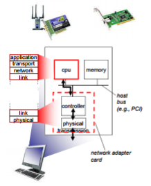
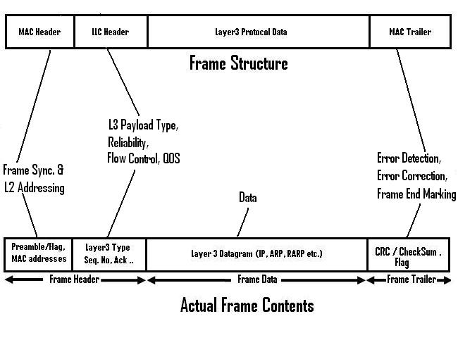
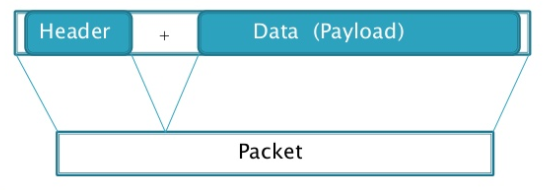
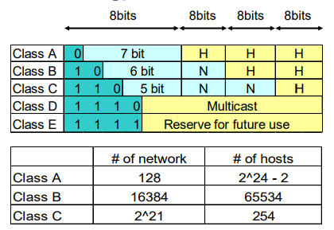
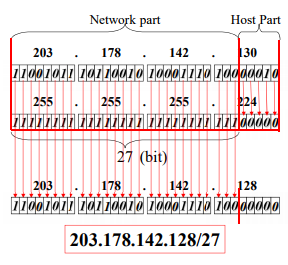
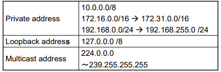

# Mạng máy tính - Cơ bản (2)

## Tầng Liên kết dữ liệu ( `L2 - Data Link Layer`)

1. Các chức năng chính
    * Đóng gói:
        * Đơn vị dữ liệu: khung tin (frame)
        * Bên gửi: thêm header, trailer cho gói tin nhận được từ tầng mạng
        * Bên nhận: bỏ header và trailer, đẩy lên tầng mạng
    * Địa chỉ hóa: sử dụng địa chỉ MAC
    * Điều khiển truy nhập đường truyền
    * Kiểm soát luồng: đảm bảo bên nhận không bị quá tải
    * Kiểm soát lỗi: phát hiện và sửa lỗi bit trong các khung tin  
        * Kiểm soát lỗi ntn? : Sử dụng mã phát hiện lỗi: (Mã CRC - Cyclic Redundancy Check)
        * Phía gửi
            * Chọn 1 đa thức sinh bậc k
            * Biểu diễn đa thức dưới dạng chuỗi bit P
            * Thêm k bit 0 vào frame dữ liệu F được Fk
            * Chia Fk cho P, lấy phần dư R
            * Ghép phần dư vào chuỗi dữ liệu được FR
        * Phía nhận : lấy FR chia cho P
            * Nếu chia hết -> truyền đúng
            * Nếu chia có dư, căn cứ vào số dư (syndrom) để phát hiện và sửa lỗi (nếu được)  
        ```frame
        Vd. Frame : 1101011011
        Đa thức : G(x) = x4 + x + 1 => P = 10011
        Nối vào Frame : Fk = 11010110110000
        R = Fk mod P = 1110
        Gửi : 11010110111110
        ```
    * Chế độ truyền: simplex, half-duplex, full-duplex

1. Triển khai trên các nút mạng
    * 
    * Tầng liên kết dữ liệu được đặt trên cạc mạng (NIC - Network Interface Card) hoặc trên chip tích hợp 
    * Cùng với tầng vật lý
    * NIC được kết nối với hệ thống bus

1. Triển khai trên hệ thống mạng
    * Điều khiển truyền dữ liệu trên liên kết vật lý giữa 2 nút mạng kế tiếp
    * Triển khai trên mọi nút mạng
    * Cách thức triển khai và cung cấp dịch vụ phụ thuộc vào đường truyền(WiFi, Wimax, 3G, cáp quang, cáp đồng...)
    * Truyền thông tin cậy (cơ chế giống TCP nhưng đơn giản hơn) hoặc không
    * Đơn vị truyền: frame (khung tin)

1. Các thiết bị kết nối trong mạng LAN
    1. Repeater (bộ lặp)
        * Đảm nhiệm chức năng tầng 1
        * Tín hiệu vật lý ở đầu vào sẽ được khuếch đại, từ đó cung cấp tín hiệu ổn định và mạnh hơn cho đầu ra, để có thể đến được những vị trí xa hơn
        * <= 4 repeater/1 đoạn mạng
    1. Hub
        * Hub sở hữu nhiều cổng từ 4 lên tới 24 cổng, và được coi như là một Repeater nhiều cổng.
        * Khi nhận được gói tin, hub lưu trữ và chuyển tiếp gói tin tới các cổng khác.
        * Không thể tạo virtual LAN khi sử dụng Hub
        * Chỉ truyền tính hiệu điện hoặc các bit (Vì hoạt động ở tầng vật lý)
        * Cách thức hoạt động:
            * Khi tất cả các máy tính gửi các gói tin, những gói tin đó được sao chép tới tất cả các port khác của Hub. Điều đó có nghĩa, các Hub chỉ đơn giản là sao chép các tín hiệu và dự định rằng người nhận sẽ nhận được các gói tin đó. Tức là, Hub không có khái niệm lọc và chuyển tiếp (filtering and forwarding) các gói tin nên việc xảy ra tranh chấp trong hub là điều không thể tránh khỏi.
        * **Active Hub**: loại Hub này thường được sử dụng phổ biến, cần được cấp nguồn khi hoạt động. **Active Hub** dùng để khuếch đại tín hiện đến và chia ra những cổng còn lại để đảm bảo tốc độ tín hiệu cần thiết khi sử dụng.
        * **Smart Hub**: hay còn gọi là **Intelligent Hub** cũng có chức năng làm việc tương tự như Active Hub, nhưng được tích hợp thêm chip có khả năng tự động dò lỗi trên mạng.
    1. Bridge
        * Đảm nhiệm chức năng tầng 2
        * Dùng để kết nối giữa hai mạng để tạo thành một mạng lớn, chẳng hạn cầu nối giữa hai mạng Ethernet
        * Khi có một máy tính này truyền tín hiệu tới một máy khác với hai mạng hoàn toàn khác nhau, thì **Bridge** sẽ sao chép lại gói tin và gửi nó tới mạng đích.
    1. Switch
        * Được coi như một Bridge nhiều cổng.
        * Có thể tạo virtual LAN
        * Khi gói một gói tin được gói tới một port của switch, các bước sau đây sẽ được xử lý:
            * Switch kiểm tra địa chỉ bên trong gói tin (nằm trong frame – dữ liệu của lớp 2 trong mô hình OSI)
            * Switch có bảng CAM (content-addressable memory, bảng CAM thường chứa 3 thông tin: địa chỉ MAC, port đích và VLAN) và sử dụng bảng này để so khớp thông tin địa chỉ MAC và port. Do đó, switch sẽ biết được chính xác một máy tính đang kết nối với port nào (trong switch) để gửi gói tin đi. Thao tác này thường được gọi bằng thuật ngữ “filter and forwarding” (lọc và chuyển gói tin).
            * Bởi vì có tính năng “filter and forwarding” cho nên switch không có xuất hiện việc tranh chấp gói tin
    1. Router (Sẽ được nói đến trong `Tầng Mạng`)

1. Địa chỉ MAC
    * Địa chỉ MAC: 48 bit, được quản lý bởi IEEE
    * Mỗi cổng mạng được gán một MAC
    * Không phân cấp, có tính di động
        * Không cần thay đổi địa chỉ MAC khi host chuyển sang mạng khác
        * (Không như địa chỉ IP có tính di động)
    * Địa chỉ quảng bá (broadcast) trong mạng LAN: FF-FF-FF-FF-FF-FF
1. Cấu trúc 1 `Frame` trong Tầng Liên kết dữ liệu
    * 
    * MAC Header: 
        * Mỗi Frame sẽ thường được bắt đầu bởi một synchronization pattern. Pattern này bao gồm Preamble Pattern + 1 flag byte hoặc chỉ đơn giản là 1 flag byte
        * The Preamble: Ta có thể hiểu 1 cách đơn giản là: đây như là 1 bộ phận giúp đồng bộ clock của người gửi và người nhận, sự đồng bộ này được cung cấp ở mức bit. Vd. Ethernet sử dụng 7 bytes preamble
        * The SFD (Start Frame Delimiter) Flag: Có giá trị 1 byte, giúp bên nhận biết được nội dung thực sự, đó là ngay sau SFD này.
        Ví dụ: Ethernet sử dụng byte SFD với giá trị 10101011 
        * MAC Address: theo ngay sau SFD
    * LLC(Logical Link Control) Header: đóng vai trò là định danh duy nhất cho phần data được giữ trong frame này. 
    * Frame Data (Payload): 
        * Là nơi chứa nội dung gói tin cho L3 (Network Layer), sau LLC Header và trước MAC Trailer
    * MAC Trailer: 
        * CRC/checksum: Là mã để check gói tin bên nhận nhận được có lỗi hay không.

## Tầng mạng ( `L3 - Network Layer`)

1. Khái quát về L3
    * Điều khiển truyền dữ liệu giữa các nút mạng qua môi trường liên mạng
    * Cài đặt trên mọi hệ thống cuối và bộ định tuyến
    * Truyền dữ liệu từ host-host
    * Đơn vị truyền: datagram
        * Mỗi datagram gồm 2 thành phần là: Header Data (Payload)
        
    * Bên gửi: nhận dữ liệu từ tầng giao vận, đóng gói
    * Bên nhận: mở gói, chuyển phần dữ liệu trong payload cho tầng giao vận
    * Bộ định tuyến (Router): đóng vai trò định tuyến và chuyển tiếp
1. Các chức năng chính của L3
    * `Định tuyến (Routing)`: Tìm đường đi (qua các nút trung gian) để gửi dữ liệu từ nguồn tới đích
    * `Chuyển tiếp (Forwarding)`: Chuyển gói tin từ cổng vào tới cổng ra
        * Bảng chuyển tiếp xác định cổng ra (outgoing port) để chuyển dữ liệu tới đích
    * `Định địa chỉ (Addressing)`: Định danh cho các nút mạng
    * `Đóng gói dữ liệu (Encapsulating)`: Nhận dữ liệu từ **tầng giao vận**, thêm tiêu đề mang thông tin điều khiển quá trình truyền dữ liệu từ nguồn tới đích
    * `Đảm bảo chất lượng dịch vụ (QoS)`: đảm bảo các thông số phù hợp của đường truyền theo từng dịch vụ
1. Giao thức IP
    1. Đặc điểm
        * Là giao thức được định tuyến (routed protocol), để xác định trước đường đi cho dữ liệu
        * Giao thức hướng không liên kết (**Connectionless- Oriented protocols**), là giao thức không tin cậy và nhanh
            * Truyền dữ liệu theo phương thức "best effort"
            * Khi cần, sẽ sử dụng dịch vụ tầng trên để đảm bảo độ tin cậy (TCP)
        * Các gói tin được xử lý độc lập
    1. Địa chỉ IPv4
        * Một số 32-bit để định danh cổng giao tiếp mạng trên nút đầu cuối (PC,server, smart phone),bộ định tuyến 
        * Mỗi địa chỉ IP được gán cho một cổng duy nhất
        * Địa chỉ IP có tính duy nhất trong mạng
        * Cấp phát địa chỉ IP ntn?
            * Cấp phát cố định (Static IP): với Linux, sẽ được cấu hình trong file  **/etc/network/interfaces**
            * Cấp phát động: sử dụng giao thức DHCP - Dynamic Host Configuration Protocol
        * Các dạng địa chỉ IP:
            * Địa chỉ mạng (`Network Address`):
                * Định danh cho một mạng
                * Tất cả các bit phần HostID là 0
            * Địa chỉ quảng bá (`Broadcast Address`):
                * Địa chỉ dùng để gửi dữ liệu cho tất cả các máy trạm trong mạng
                * Tất cả các bit phần HostID là 1
            * Địa chỉ máy trạm (`Unicast Address`): được gán cho 1 cổng mạng
            * Địa chỉ nhóm (`Multicast address`): định danh cho 1 nhóm
        * Cấu tạo: 2 phần là **Network ID** và **Host ID**
            * Host ID – phần địa chỉ máy trạm
            * Network ID – phần địa chỉ mạng
            * Vậy làm sao để phân biệt được 2 thành phần này trong 1 địa chỉ IP
        * Cách 1: Phân lớp địa chỉ
            * Có 5 lớp mạng (A, B, C, D và E) được định nghĩa. Lớp A sử dụng 8 bits cho phần network, 24 bits được sử dụng cho phần host. Lớp B dùng 16 bits cho network, 16 bit dành cho host. 24 bits được sử dụng để xác định phần network cho lớp C, do đó, mỗi network của lớp C chỉ còn 8 bit để đánh địa chỉ host. Lớp D được dùng cho địa chỉ Multicast còn lớp E để dự trữ.
            * 
            * Dễ dàng nhận thấy:  việc phân chia cứng thành các lớp (A, B, C, D, E) làm hạn chế việc sử dụng toàn bộ không gian địa chỉ 
        * Cách 2: Không phân lớp – CIDR (Classless Inter Domain Routing)
            * Phần địa chỉ mạng sẽ có độ dài bất kỳ
            * Dạng địa chỉ: m1.m2.m3.m4 /n, trong đó n (**mặt nạ mạng**) là số bit trong phần ứng với địa chỉ mạng
            * Cách tính địa chỉ mạng  
            
            * Với việc sử dụng địa chỉ kiểu này thì IP và submask sẽ phải luôn đi cùng nhau.
        * Mạng con - `subnet`: Là một phần của một mạng nào đó
            * Để tạo subnet: Ta sẽ sử dụng 1 mặt nạ dài hơn
        * Địa chỉ IP đặc biệt 
        
    1. Địa chỉ IPv6
1. Router
    * Router hay còn gọi là thiết bị định tuyến hoặc bộ định tuyến, là thiết bị mạng máy tính dùng để chuyển các gói dữ liệu qua một liên mạng và đến các đầu cuối, thông qua việc định tuyến và chuyển tiếp (_Định tuyến và chuyển tiếp đã được nói ở trên_).
    * Router dựa vào bảng định tuyến (routing table) để tìm đường đi cho gói dữ liệu
    * Bảng định tuyến được quản trị mạng cấu hình tĩnh (`static`), nghĩa là được thiết lập 1 lần và thường do quản trị mạng nhập bằng tay, hoặc động (`dynamic`), nghĩa là bảng tự học đường đi và nội dung tự động thay đổi theo sự thay đổi của topo mạng
1. Giao thức ARP - Address Resolution Protocol
    * ARP được sử dụng để từ một địa chỉ mạng (vd một địa chỉ IPv4) tìm ra địa chỉ MAC, hay còn có thể gọi là phân giải địa chỉ IP sang địa chỉ máy
    * Tại sao cần ARP?
        * Truyền tin trên tầng mạng dùng địa chỉ IP
        * Truyền tin trên tầng liên kết dữ liệu dùng địa chỉ MAC
        * Khi gửi: dữ liệu chuyển từ tầng mạng xuống tầng liên kết dữ liệu
            * Dữ liệu gửi trong mạng LAN: Máy nguồn cần phải biết địa chỉ MAC của máy đích
            * Dữ liệu gửi ra ngoài mạng LAN: Máy nguồn phải biết địa chỉ MAC của router
    * Hoạt động của ARP
        * Mỗi nút trong mạng LAN sử dụng bảng ARP Table
            * Ánh xạ <Địa chỉ IP, Địa chỉ MAC, TTL)
            * TTL: Thời gian giữ ánh xạ trong bảng
        * • Khi cần biết địa chỉ MAC tương ứng với địa chỉ IP không có trong ARP Table, nút mạng gửi quảng bá gói tin ARP Request lên trên mạng để hỏi
        * Nút mạng mang địa chỉ IP được hỏi sẽ gửi ARP Reply trả lời
    * Thí dụ:
        * Host to host: Hai máy tính trong một văn phòng (M1 và M2) được kết nối với nhau trong một mạng cục bộ (LAN) bằng cáp Ethernet và Switch, không có Gateway hoặc Router đứng giữa. M1 có một gói tin để gửi tới M2. Thông qua DNS, nó xác định rằng M2 có địa chỉ IP 192.168.0.55. Để gửi tin nhắn, nó cũng cần địa chỉ MAC của M2. Đầu tiên, M1 sử dụng một bảng ARP lưu trữ để tìm kiếm địa chỉ 192.168.0.55 cho bất kỳ ghi nhận nào hiện có của địa chỉ MAC của M2 (00: eb: 24: b2: 05: ac). Nếu địa chỉ MAC được tìm thấy, nó sẽ gửi một khung Ethernet (Frame Ethernet) với địa chỉ đích 00: eb: 24: b2: 05: ac, chứa gói tin IP. Nếu bảng ARP không có kết quả cho 192.168.0.55, M1 phải gửi một ARP broadcast (đích FF: FF: FF: FF: FF: FF MAC address), được chấp nhận bởi tất cả các máy tính, yêu cầu địa chỉ 192.168.0.55 trả lời. M2 trả lời với địa chỉ MAC và địa chỉ IP của nó. M 2 có thể ghi một mục vào bảng ARP của nó cho M1 để sử dụng trong tương lai. M1 lưu trữ các thông tin phản hồi trong bảng ARP của nó và bây giờ có thể gửi gói tin
        * Router to router: Router dùng routing table để tìm ra địa chỉ IP của router đích, rồi từ đó tìm ra địa chỉ MAC.
1. **NAT (Network address translation)**
    * NAT là 1 kỹ thuật chuyển tiếp các gói tin giữa những lớp mạng khác nhau trên một mạng lớn. NAT thay đổi một (IP) hoặc cả hai địa chỉ (IP + port) bên trong một gói tin khi gói tin đó đi qua một router, hay một số thiết bị khác. Thông thường, NAT thường thay đổi IP (thường là private IP) được dùng bên trong một mạng sang public IP.
    * NAT cũng có thể coi như một firewall cơ bản. Để thực hiện được công việc đó, NAT duy trì một bảng thông tin về mỗi gói tin được gửi qua. Khi một PC trên mạng kết nối đến 1 website trên Internet, header của địa chỉ IP nguồn được thay đổi và thay thế bằng địa chỉ Public mà đã được cấu hình sẵn trên NAT server, sau khi có gói tin trở về NAT dựa vào bảng record mà nó đã lưu về các gói tin, thay đổi địa chỉ IP đích thành địa chỉ của PC trong mạng và chuyển tiếp vào trong mạng.
    * NAT tĩnh (`Static NAT`)
        * Với NAT tĩnh, địa chỉ IP thường được ánh xạ tĩnh với nhau thông qua các lệnh cấu hình. Trong NAT tĩnh, một địa chỉ Inside Local luôn luôn được ánh xạ vào địa chỉ Inside Global. Nếu được sử dụng, mỗi địa chỉ Outside Local luôn luôn ánh xạ vào cùng địa chỉ Outside Global => NAT tĩnh không có tiết kiệm địa chỉ thực
    * NAT động (`Dynamic NAT`)
        * Dynamic NAT ánh xạ toàn bộ private IP thành một nhóm public IP (nhiều - nhiều). Cho phép một nhóm IP trong LAN có thể truy cập mạng ngoài.
        * => Dẫn tới 1 điểm yếu là: Giả sử trong LAN có 10 IP đồng thời cần truy cập mạng ngoài và ta chỉ có 4 public IP, tức là chỉ có tối đa 4 host được truy cập mạng ngoài cùng 1 lúc => 6 host khác sẽ phải chờ => Điểm bất lợi này khiến loại NAT này ít được sử dụng.
    * Overload NAT (`PAT`)
        * Bản chất PAT là kết hợp IP Public và số hiệu cổng (port) trước khi đi ra Internet. Lúc này mỗi IP trong LAN khi đi ra Internet sẽ được ánh xạ ra một IP Public kết hợp với số hiệu cổng
        * Nat overload – PAT là giải pháp được dùng nhiều nhất đặc biệt là trong các Modem ADSL, đây là giải pháp mang lại cả hai ưu điểm của NAT đó là:
            * Ẩn địa chỉ IP trong hệ thống mạng nội bộ trước khi gói tin đi ra Internet giằm giảm thiểu nguy cơ tấn công trên mạng
            * Tiết kiệm không gian địa chỉ IP
    * NAT giải quyết những vấn đề nào ?
        1. Ban đầu, NAT được đưa ra nhằm giải quyết vấn đề thiếu hụt địa chỉ của IPv4.
        1. NAT giúp chia sẻ kết nối Internet (hay 1 mạng khác) với nhiều máy trong LAN chỉ với 1 IP duy nhất. (Overload NAT - PAT)
        1. NAT che giấu IP bên trong LAN
        1. NAT giúp quản trị mạng lọc các gói tin được gửi đến hay gửi từ một địa chỉ IP và cho phép hay cấm truy cập đến một port cụ thể.

## Tầng giao vận (`Transport Layer - L4`)

1. Tổng quan
    * Cung cấp phương tiện truyền giữa các ứng dụng cuối
    * Bên gửi: 
        * Nhận dữ liệu từ ứng dụng
        * Đặt dữ liệu vào các gói tin và chuyển cho tầng mạng
        * Nếu dữ liệu quá lớn, nó sẽ được chia làm nhiều phần và đặt vào nhiều đoạn tin khác nhau
    * Bên nhận:
        * Nhận các đoạn tin từ tầng mạng
        * Tập hợp dữ liệu và chuyển lên cho tầng ứng dụng
    * Được cài đặt trên các hệ thống cuối
    * Hai dạng dịch vụ giao vận: `TCP và UDP`
    * Đơn vị truyền: datagram (UDP), segment (TCP)

1. Các chức năng chung
    * Dồn kênh/phân kênh - Mux/Demux
        * Gửi - Dồn kênh: Nhận dữ liệu từ các tiến trình tầng ứng dụng khác nhau (`qua socket`), đóng gói theo giao thức tầng giao vận và gửi trên liên kết mạng
        * Nhận - Phân kênh: Sử dụng thông tin trên tiêu đề gói tin để gửi dữ liệu tới đúng socket
            * Nút mạng nhận gói tin với các địa chỉ:
                1. Địa chỉ IP nguồn
                1. Địa chỉ IP đích
                1. Số hiệu cổng nguồn
                1. Số hiệu cổng đích
            * Địa chỉ IP và số hiệu cổng được sử dụng để xác định socket nhận dữ liệu
    * Checksum: Phát hiện lỗi bit trong các đoạn tin/gói tin
        * Gửi:
            1. Chia dữ liệu thành các phần có kích thước n bit
            1. Tính tổng các phần. Nếu kết quả tràn quá n bit, cộng các bit tràn vào phần kết quả
            1. Đảo bit kết quả cuối cùng được checksum
            1. Truyền checksum kèm theo dữ liệu
        * Nhận:
            1. Tách dữ liệu và checksum
            1. Chia dữ liệu thành các phần có kích thước n bit
            1. Tính tổng các phần và checksum. Nếu kết quả tràn quá n bit, cộng các bit tràn vào phần kết quả
            1. Nếu kết quả cuối xuất hiện bit 0 =>  dữ liệu bị lỗi

1. UDP (User Datagram Protocol)
    * Giao thức hướng không kết nối (connectionless)
    * Truyền tin “best-effort”: chỉ gửi 1 lần, không phát lại
    * Vì sao cần UDP? 
        * Không cần thiết lập liên kết => giảm độ trễ
        * Đơn giản: Không cần lưu lại trạng thái liên kết ở bên gửi và bên nhận
        * Phần đầu đoạn tin nhỏ
        * Không có quản lý tắc nghẽn: UDP cứ gửi dữ liệu nhanh nhất, nhiều nhất nếu có thể
    * => Sử dụng cho các ứng dụng cần chuyển dữ liệu nhanh, có khả năng chịu lỗi, vd: VoIP, Video Streaming

1. TCP (Transmission Control Protocol)
    * Giao thức hướng kết nối (connection): cơ chế `Bắt tay ba bước`
    * Giao thức truyền dữ liệu theo dòng byte, tin cậy: kênh có lỗi bit, không bị mất tin
        1. Phát hiện lỗi: Checksum
        1. Báo cho bên gửi: ACK (acknowledgements) - gói tin được nhận thành công hoặc NAK (negative acknowledgements) - gói tin bị lỗi
        1. Phản ứng của bên gửi: ACK hoặc NAK
    * Truyền theo kiểu pipeline: tăng hiệu quả
        * Gửi liên tục một lượng hữu hạn các gói tin mà không cần chờ ACK
    * Kiểm soát luồng: Bên gửi không làm quá tải bên nhận
    * Kiểm soát tắc nghẽn: Việc truyền dữ liệu không nên làm tắc nghẽn mạng
    * => Sử dụng cho các dịch vụ tin cậy như: web, gửi mail

## Tài liệu tham khảo

1. Slide Mạng máy tính thầy Bùi Trọng Tùng 
1. Google
1. Wikipedia

## Các câu hỏi ứng dụng

1. Các bước để 2 máy trong cùng một mạng LAN gửi gói tin cho nhau?
1. Các bước để 2 máy trong 2 mạng LAN khác nhau gửi gói tin IP cho nhau?
1. Các bước để gửi một gói tin lớn (1GB) từ một máy có IP là A tới 1 máy có IP là B?
1. Trình bày một ví dụ về các bước 1 gói tin TCP từ một máy tính nội bộ đi tới trang facebook.com.vn (IP là 191.58.58.59, Port 433) thông qua giao thức Overload NAT?