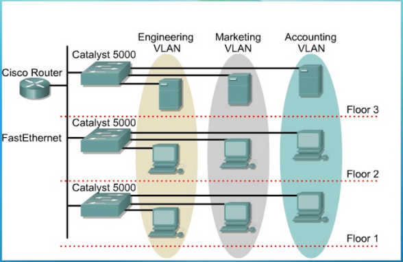
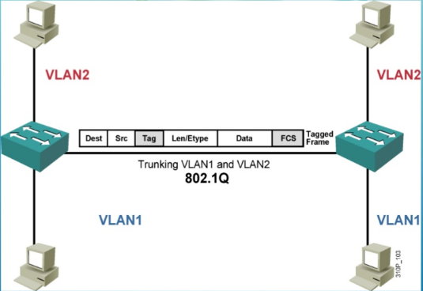
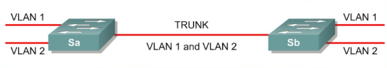
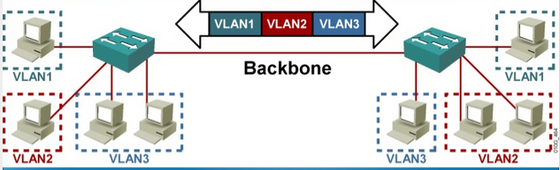

# Chương 1: VLAN 

## 1.1 Lịch sử ra đời
Với mạng LAN, do sự giới hạn về đường truyền vật lí ta chỉ có thể kết nối các máy tính trong cùng một địa điểm (cùng phòng...) lại với nhau để tạo thành mạng 1 mạng LAN với thiết bị trung tâm là hub hoặc switch. 

Tuy nhiên trong thực tế số lượng máy tính trong một mạng LAN thường không nhiều, ngoài ra các máy tính trong cùng một phòng có thể thuộc các mạng LAN khác nhau vì vậy tốn nhiều tài nguyên hub, switch trong khi lại chưa tận dụng hết số cổng trên các thiết bị này. Hơn nữa các máy tính thuộc các đơn vị khác nhau (ở các địa điểm khác nhau) của cùng một phòng ban sẽ có các nhu cầu trao đổi dữ liệu chủ yếu với nhau.

Để giải quyết những vấn đề này, giải pháp đưa ra là nhóm các máy tính thuộc các LAN khác nhau vào cùng một switch, các máy thuộc các switch khác nhau có thể nằm chung một LAN. Giải pháp này gọi là LAN ảo hay VLAN.

## 1.2 Khái niệm VLAN và lợi ích VLAN đem lại

**VLAN**

VLAN là tên viết tắt của Virtual Local Area Network hay còn được gọi là mạng LAN ảo. VLAN là một kỹ thuật cho phép tạo một mạng LAN độc lập một cách logic trên cùng một kiến trúc vật lí. Việc tạo ra các VLAN giúp giảm thiểu số broadcast domain (miền quảng bá) và tạo điều kiện thuận lợi cho quản lý một mạng cục bộ rộng lớn.

**Broadcast domain**
> Broadcast domain: Là một không gian logic mà các máy tính trong đó có thể trao đổi thông tin với nhau bằng các frame (mức data link layer). Trong một broadcast domain, khi một máy tính gửi một frame thì frame đó sẽ được gửi tới tất cả các máy khác trong cùng miền này. 
+ Khi chưa có VLAN: Thiết bị giới hạn miền quảng bá thường là các Router (do cơ chế chặn các bản tin quảng bá). Và cũng chính Router tạo ra các miền quảng bá bằng việc mỗi một giao diện của Router là một Broadcast domain.

+ Khi áp dụng VLAN: Mỗi một VLAN là một miền broadcast. Một switch không hỗ trợ VLAN thì toàn bộ các máy tính, thiết bị cắm vào switch đó nằm trong một miền broadcast.

Ví dụ: 
Hình 1.1

Xét mô hình 3 tầng trong một tòa nhà như Hình 1.1, ta thấy tại mỗi tầng đều có các máy tính (hoặc thiết bị) thuộc cả 3 phòng ban(Engineering, Marketing, Accounting). Như vậy nếu không sử dụng kĩ thuật VLAN, mà muốn cho các thiết bị trong cùng 1 phòng ban có thể trao đổi dữ liệu nội bộ với nhau ta cần 9 switch (3 switch cho mỗi tầng) và số miền quảng bá tương ứng sẽ là 9 miền. Mặt khác như hình trên, khi áp dụng VLAN ta thu được chỉ còn 3 miền broadcast mà các máy thuộc 3 tầng ở cùng một phòng ban vẫn có thể trao đổi dữ liệu với nhau.

**Ưu điểm của VLAN**
+ Tiết kiệm băng thông của mạng: Do VLAN có thể chia nhỏ LAN thành các miền broadcast. Một gói tin broadcast được gửi đi, nó sẽ chỉ được truyền trong một VLAN duy nhất, không truyền ở các VLAN khác nên giảm được lưu lượng quảng bá, tiết kiệm được băng thông đường truyền và giảm tắc nghẽn ở data link layer.
+ Tăng tính bảo mật: Các VLAN khác nhau không truy cập được vào nhau (trừ khi được khai báo và thiết lập định tuyến).
+ Dễ dàng thêm hay bớt các máy tính vào VLAN: Trên một switch nhiều cổng, có thể cấu hình VLAN khác nhau cho từng cổng, do đó dễ dàng kết nối thêm các máy tính với các VLAN.
+ Giúp mạng có tính linh động cao, dễ khoanh vùng xử lý khi xảy ra lỗi.

# 1.3 Phân loại VLAN

Có 3 loại VLAN, bao gồm:

+ VLAN dựa trên cổng (port based VLAN): Mỗi cổng (Ethernet hoặc Fast Ethernet) được gắn với một VLAN xác định. Do đó mỗi máy tính/thiết bị kết nối với một cổng của switch đều thuộc một VLAN nào đó. Cách cấu hình VLAN này đơn giản và phổ biến nhất.

Ví dụ:

port | vlan
---------|---------
 1 | 1 
 2 | 1 
 3 | 2
 4 | 1 

+ VLAN dựa trên địa chỉ vật lý MAC (MAC address based VLAN): Mỗi địa chỉ MAC được gán tới một VLAN nhất định. Cách cấu hình này rất phức tạp và khó khăn trong việc quản lý.
>Ví dụ:

MAC address | vlan | 
---------|----------|
12123434251518 | 1 |
22341515151521 | 2 | 
33154254415115 | 1 | 
54154789631153 | 1 |

+ VLAN dựa trên giao thức (protocol based VLAN): tương tự với VLAN dựa trên địa chỉ MAC nhưng sử dụng địa chỉ IP thay cho địa chỉ MAC. Cách cấu hình này không được thông dụng.

>Ví dụ
 

IP Subnet  | vlan | 
---------|----------|
 26.3.24 | 1 | 
 23.26.4 | 2 | 

# 1.4 Một số đặc điểm của VLAN
 
### 1.4.1 Cấu trúc khung Ethernet khi được gán VLAN Idea

## Cấu trúc khung ethernet khi có gán thêm vlan id

Ethernet frame được thêm 1 trường Tag (4 byte ~ 32 bit) so với chuẩn 802.1Q. Trường Tag nằm giữa hai trường: MAC address và Type. Cấu trúc của Tag gồm:

+ TPID(tag protocol identifier): 16 bit thường có giá trị mặc định là 0x8100 (ngoài ra cón có thể nhận giá trị 0x9100, 0x9200) cho biết gói tin theo chuẩn IEEE 802.1Q.
+ TCI(tag control information)gồm:
     + PCP(prority code point)- 3 bit:  Cho biết mức độ ưu tiên của frame. Có 8 mức ưu tiên từ 0->7 lần lượt tương ứng với (best effort, default), background, excellent effort, critical application, video, voice, internetwork control,  network control. Giá trị mặc định là 0.
     + CFI(Canonical Format indicator): 1 bit, luôn đặt giá trị 0 cho Ethernet Switch để tương thích với mạng Token Ring. Nếu CFI có giá trị là 1 thì frame sẽ không được chuyển đi port.
     + VLAN ID(VLAN identifier): 12 bit dùng để đặc tả VLAN mà frame đó thuộc vào. Tuy nhiên giá trị 0(trống) và 4095(dành riêng) không được sử dụng, nên VLAN ID dùng để gắn cho các frame là từ 1-4094.

## Trunk link
Khi nhu cầu lớn hơn, các máy trong các VLAN khác nhau muốn giao tiếp với nhau. Khi đó, giữa các switch phải hình thành một trunk link. Trunk link là một đường kết nối mà mỗi đầu được cấu hình port kiểu trunk. Trunk link cho phép vận chuyển frame giữa các VLAN khác nhau.

## Trunk port 
Được dùng để cho phép kết nối với một switch và hình thành trunk link. Frame trước khi đi qua trunk port sẽ được gán một nhãn (tagging) vlan id vào frame để switch ở đầu bên kia biết cần đẩy frame này đến các port thuộc vlan nào.

## Access port 
Access port chỉ thuộc về một vlan duy nhất. Access port thường dùng để nối với các thiết bị đầu cuối của người dùng hoặc các switch không hỗ trợ vlan. Trước khi đẩy frame đến một access port, vlan id trên frame sẽ bị gỡ bỏ.

## Ví dụ quá trình chuyển frame

Mỗi switch định nghĩa tất cả vlan mà switch đó có. Một nhóm port sẽ nằm trong một vlan, mỗi port là duy nhất với một vlan ngoại trừ trunk port.

Khi máy tính trong vlan2 gửi frame (broadcast hoặc unicast frame), frame sẽ được gửi tới trunk port. Tại đây frame được gán thêm một vlan id để nhận diện với các frame được gửi từ các vlan khác trong cùng 1 switch. Sau khi đi qua trunk link, frame đến switch đầu bên kia, dựa vào vlan id switch này biết frame được chuyển tới máy trong vlan2 của nó, tiếp đó nó gỡ vlan id và dựa vào MAC đích để chuyển frame đến access port tương ứng thuộc vlan2.

-------------------------------------------------

#  Chương 2: VXLAN

## 1. VXLAN(Virtual Extensible LAN)

### 1.1 Khái niệm

VXLAN cung cấp cơ chế kết hợp và tạo đường hầm cho nhiều mạng lớp 2 thông qua một cơ sở hạ tầng lớp 3. Cũng có thể gọi VXLAN là 1 sơ đồ đường hầm để phủ lớp 2 trên mạng lớp 3. Mỗi phủ được gọi là 1 VXLAN segment. Điều này cho phép các host (hoặc các virtual machines(máy ảo))trên cùng một VXLAN segment, thuộc hai mạng Layer2 Network khác nhau có thể giao tiếp với nhau

### 1.2 Lợi ích của VXLAN so với VLAN

+ Khả năng mở rộng số lượng segment cho 1 Layer2 network cao hơn: VLAN sử dụng VLAN ID 12-bit dẫn đến 1 Layer2 network chỉ có 4094 VLAN. Còn VXLAN sử dụng VXLAN network identifier(VNID) 24-bit để định danh cho các segment, cho phép hơn 16 triệu VXLAN segment cùng tồn tại trong một miền quản trị
+ Phân bố linh hoạt các mutil segment(các VXLAN segment giống nhau ở các Layer2 network khác nhau) trong toàn bộ trung tâm dữ liệu
+ Sử dụng tốt hơn cơ sở hạ tầng hiện tại: các gói tin VXLAN được truyền qua mạng thông qua các tiêu đề lớp 3 do đó tận dụng được các tính năng định tuyến của lớp và liên kết các giao thức chung lại để sử dụng các liên kết có sẵn

## 2. Cấu trúc gói tin VXLAN

VXLAN đóng gói gói tin gồm: gói tin gốc(dạng frame ở Layer 2), sau đó lần lượt thêm vào đầu gói tin này các tiêu đề VXLAN Header, UDP Header, Outer IP Header, Outer MAC Header.

Hình 2.1. Cấu trúc gói tin VXLAN

**Outer MAC Header**
+ Outer Src MAC Addr: có thể là địa chỉ MAC của VTEP, hoặc router chứa máy gửi thông điệp
+ Outer Dest MAC Addr: có thể là địa chỉ MAC của router, hoặc VTEP chứa máy nhận thông điệp
+ VLAN Type: là tùy chọn cho việc triển khai VXLAN, mặc định là 0x8100 theo chuẩn 802.1Q Tagged Prototocol Identifier (TPUD) 
+ VLAN ID
+ Ether Type: Được thiết lập để 0x0800 để biểu thị một gói tải trọng IPv4. 

**Outer IP Header**
+ IP Header Misc Data
+ Protocol: thiết lập là 0x11 để cho biết đó là gói tin UDP
+ Header Checksum
+ Outer Src IP: là IP của VTEP truyền thông cho host gửi thông điệp đến host khác
+ Outer Dest IP: có thể là 1 địa chỉ IP Unicast(đại diện cho một VTEP kết nối với host đích), hoặc IP multicast(đại diện cho 1 nhóm các VTEP của cùng 1 VXLAN segment)

**Outer UDP Header**
+ UDP Src port: sử dụng số cổng nguồn UDP được cung cấp bởi VTEP, bằng cách sử dụng một bảng băm của các trường gói tin bên trong
+ VXLAN port: thường sử dụng giá trị 4789 của IANA
+ UDP Checksum: được truyền giá trị 0x0000. Khi VTEP nhận được một gói tin có checksum = 0x0000 của UDP thì nó tiến hành đóng gói, nếu không gói tin bị loại bỏ

**VXLAN Header**
+ VXLAN Flag: ở bit thứ 3, cờ I được thiết lập(=1) cho 1 giá trị VNI, 7 bit khác là trường dành riêng và được đặt bằng 0 trên đường truyền và bỏ qua khi nhận
+ VXLAN Segment ID (VNID): là 1 giá trị 24 bit dùng để định danh một VXLAN segment(cho biết lớp phủ VXLAN). Các host thuộc các VXLAN segment khác nhau không thể giao tiếp với nhau
+ Reserved(các trường bảo lưu): được đặt bằng 0 trên đường truyền và bỏ qua khi nhận

## 3. VXLAN Tunnel End Point (VTEP)

VTEP là thiết bị đầu cuối đường hầm của VXLAN, nó có thể được cài đặt trên một switch vật lý hoặc máy chủ vật lý và có thể thực hiện trong phần mềm hoặc phần cứng.

VTEP dùng để ánh xạ đến các thiết bị dùng cuối (các host) trong 1 VXLAN segment, thực hiện việc encapsulation gói tin gốc(dạng frame) từ host gửi để tạo thành gói tin VXLAN, hoặc de-encapsulation gói tin VXLAN mà nó nhận được thành gói tin dạng frame rồi chuyển tới host đích tương ứng.

Một VTEP có 2 thành phần:
+ Local LAN Segment: giống như 1 switch interface, dùng để hỗ trợ việc truyền thông điệp từ các thiết bị cuối (các host)
+ IP interface: có 1 IP duy nhất để xác định VTEP trên Transport IP Network (mạng IP truyền tải). Sử dụng IP này để encapsulation từ host gửi thành gói tin VXLAN rồi chuyển lên mạng IP truyền tải để gửi tới IP interface đích. 

Một thiết bị VTEP cũng phát hiện các VTEPs ở xa thuộc cùng một VXLAN segment, và học địa chỉ thông qua ánh xạ MAC-to-VTEP.

Hình 2.2 VTEP

## 4. Cơ chế khám phá VTEP từ xa và học địa chỉ trong VXLAN

Nhóm multicast VXLAN trong mạng truyền tải: được sử dụng để truyền các gói tin VXLAN broadcast, gói multicast, gói unicast không rõ trong cùng một VXLAN segment. Khi 1 VTEP trong nhóm muốn gửi gói tin đến tất cả các VTEP khác, nó sẽ gửi gói tin chứa IP đích đến là điạ chỉ IP Multicast (đây là địa chỉ IP đại diện cho nhóm Multicast này).

Hình 2.3 Nhóm Multicast trong mạng truyền tải

Ví dụ, trong VXLAN segment có VNID là 10, sử dụng nhóm Multicast là 239.1.1.1 . Giả sử việc khám phá và học địa chỉ chưa được thực hiện. Bây giờ, Host A (với IP-A, MAC-A) muốn truyền thông điệp cho Host B (với IP-B, MAC-B), dựa trên IP-B đã biết, các bước học địa chỉ diễn ra như sau:

Hình 2.4 Cơ chế khám phá và học địa chỉ trong VXLAN

**Bước 1**: Host A gửi 1 gói tin ARP request với IP đích(IP-B) để yêu cầu MAC đích(MAC-B) tới VTEP-1

**Bước 2**: VTEP-1 nhận được ARP request, kiểm tra và thấy chưa có ánh xạ cho IP-B. Nó đóng gói ARP request thành 1 gói IP multicast. Gói tin VXLAN này có IP nguồn là IP của VTEP-1 (IP-1), IP đích là IP của nhóm Multicast (239.1.1.1), và được chuyển tới tất cả các VTEP khác trong nhóm Multicast 239.1.1.1 

**Bước 3**: Tất cả các VTEPs trong nhóm Multicast 239.1.1.1 (gồm VTEP-2, VTEP-3) nhận được gói tin multicast này. Các VTEPs này kiểm tra VNID trong tiêu đề VXLAN của gói tin, nếu VNID 10 này được cấu hình thì các VTEPs này sẽ thêm ánh xạ MAC-to-VTEP vào local table (bảng cục bộ) của nó. Local table lúc này có dạng:

MAC Address | VXLAN ID | Remote VTEP
---------|----------|---------
 MAC-A | 10 | IP-1

**Bước 4**: Các VTEPs, bỏ phần tiêu đề ngoài rồi gửi gói tin gốc ARP request (chứa IP đích B) cho các host liên kết với nó. Các host so sánh IP của mình với IP đích, nếu không trùng thì gói tin bị hủy bỏ. Host B nhận được ARP request, kiểm tra trùng với IP đích nó tiến hành đóng 1 gói ARP response chứa MAC-B gửi phản hồi tới VTEP-2, đồng thời nó cũng học ánh xạ IP-A-to-MAC-A

**Bước 5**: VTEP-2 nhận được gói ARP response với MAC đích là MAC-A. Lúc này nó kiểm tra local table của nó và biết là ánh xạ MAC-A-to-IP-1 đã được thiết lập. VTEP-2 đóng gói ARP response này thành 1 gói VXLAN unicast rồi chuyển tới VTEP-1. Gói unicast này có IP nguồn là IP-2, IP đích là IP-1.

**Bước 6**: VTEP-1 nhận được gói unicast từ VTEP-2. Nó de-encapsulation và chuyển ARP response đến Host A, đồng thời nó cũng lập 1 ánh xạ MAC-to-VTEP vào local table của mình với những thông tin sau:

MAC Address | VXLAN ID | Remote VTEP
---------|----------|---------
 MAC-B | 10 | IP-2

 **Bước 7**: Bây giờ việc học và ánh xạ địa chỉ giữa Host A và Host B, VTEP-1 và VTEP-2 hoàn thành, đường hầm VXLAN giữa chúng được thiết lập, các gói tin Unicast tiếp theo giữa Host A và Host B sẽ sử dụng đường hầm này để giao tiếp

## 5. Chuyển tiếp gói tin trong VXLAN

Các quy tắc chuyển tiếp của VTEP:

1. Nếu MAC nguồn và MAC đích đến đều nằm cùng 1 Server lưu trữ thì gói tin được chuyển tới Switch (có cài đặt VTEP), được switch chuyển đến máy đích luôn và không có VXLAN encapsulation/de-encapsulation được thực hiện
2. Nếu MAC đích không hoạt động cùng Server chứa host gửi gói tin, thì gói tin được đóng thành gói VXLAN bởi VTEP nguồn và được gửi tới VTEP tiếp theo dựa trên local table của nó. Tới VTEP có kết nối với host đích gói tin sẽ được loại bỏ các phần tiêu đề ngoài, và gói tin gốc sẽ được gửi tới host đích
3. Với các gói tin Unicast không rõ, hoặc multicast. VTEP sẽ đóng gói thành gói VXLAN multicast rồi gửi đến các VTEP khác thuộc cùng nhóm multicast của 1 VXLAN segment (lúc này Outer Dest IP là IP của nhóm multicast)

Ví dụ về chuyển tiếp gói tin Unicast trong VXLAN

Hinh 2.5. Chuyển tiếp gói tin Unicast trong VXLAN

Trong Hình 2.5, Host-A và Host-B trong VXLAN segment 10 giao tiếp với nhau qua đường hầm VXLAN giữa VTEP-1 và VTEP-2. Ví dụ này giả định rằng việc học địa chỉ đã được thực hiện ở cả hai bên và các ánh xạ MAC-to-VTEP tương ứng tồn tại trên cả hai VTEPs.

Các bước gói tin được gửi:

**Bước 1**: Host A gửi 1 frame đến VTEP-1, frame có dạng:

MAC nguồn | MAC đích | IP nguồn| IP đích| Port nguồn| Port đích| Dữ liệu
---------|----------|---------|----------|---------|-----------|---------
 MAC-A | MAC-B | IP-A | IP-B | 80 | 100 | Data
 
**Bước 2**: VTEP-1 kiểm tra bảng local table của mình, thấy có ánh xạ MAC-B-to-VTEP-2. Nó thực hiện encapsulation gói frame thành gói VXLAN Unicast bằng cách thêm vào đầu frame lần lượt VXLAN Header, UDP Header, Outer IP Header, Outer MAC Header. Tiếp đó gói tin được gửi tới Router-1 với dạng:

 MAC nguồn | MAC đích | IP nguồn| IP đích| UDP | VXLAN VNID| Dữ liệu
---------|----------|---------|----------|---------|-----------|---------
 MAC-1 | MAC-2 | IP-1 | IP-4 | UDP | 10 | frame

**Bước 3**: Router-1 nhận được gói Unicast VXLAN, Router-1 thực hiện định tuyến, và chuyển tiếp gói tin này đến Router-2 (chứa VTEP-2 có IP-4), gói tin có dạng: 

 MAC nguồn | MAC đích | IP nguồn| IP đích| UDP | VXLAN VNID| Dữ liệu
---------|----------|---------|----------|---------|-----------|---------
 MAC-2 | MAC-3 | IP-1 | IP-4 | UDP | 10 | frame

 **Bước 4**: Router-2 nhận được gói tin từ Router-1, nó kiểm tra IP đích của gói tin và chuyển tiếp gói tin này đến VTEP-2, gói tin đến VTEP-2 có dạng:

  MAC nguồn | MAC đích | IP nguồn| IP đích| UDP | VXLAN VNID| Dữ liệu
---------|----------|---------|----------|---------|-----------|---------
 MAC-3 | MAC-4 | IP-1 | IP-4 | UDP | 10 | frame

 **Bước 5**: VTEP-2 nhận được gói tin, tiến hành kiểm tra và loại bỏ các tiêu đề MAC, IP, UDP, VXLAN bên ngoài, sau đó chuyển frame đến Host B

-----------------------------------------------

### Tài liệu tham khảo:

[http://www.vnpro.vn/mien-quang-ba-thay-doi-nhu-the-nao-khi-co-vlan/](http://www.vnpro.vn/mien-quang-ba-thay-doi-nhu-the-nao-khi-co-vlan/)

[http://www.hocmangcoban.com/2014/04/khai-niem-vlan-cau-hinh-vlan-co-ban.html](http://www.hocmangcoban.com/2014/04/khai-niem-vlan-cau-hinh-vlan-co-ban.html)

[https://www.thongtincongnghe.com/article/14391](https://www.thongtincongnghe.com/article/14391)

[https://kipalog.com/posts/Ghi-chu-ve-mot-so-cong-nghe-switch](https://kipalog.com/posts/Ghi-chu-ve-mot-so-cong-nghe-switch)

[http://www.cisco.com/c/en/us/products/collateral/switches/nexus-9000-series-switches/white-paper-c11-729383.html](http://www.cisco.com/c/en/us/products/collateral/switches/nexus-9000-series-switches/white-paper-c11-729383.html)

[https://www.arista.com/assets/data/pdf/Whitepapers/Arista_Networks_VXLAN_White_Paper.pdf](https://www.arista.com/assets/data/pdf/Whitepapers/Arista_Networks_VXLAN_White_Paper.pdf)

[https://tools.ietf.org/html/rfc7348](https://tools.ietf.org/html/rfc7348)

---------------------------------------------------
