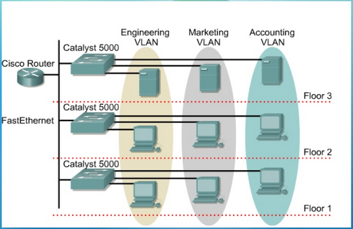
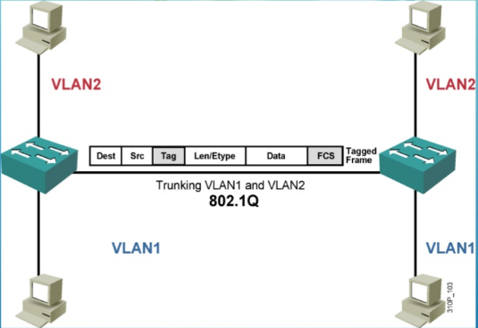
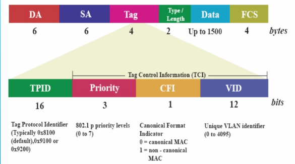
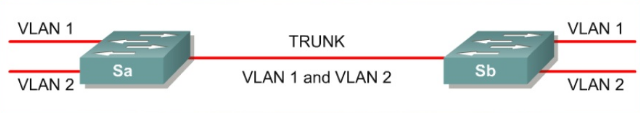
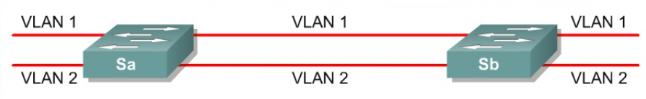
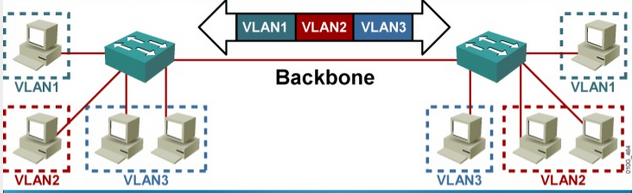

# Chương 1: VLAN 

## 1.1 Lịch sử ra đời
Với mạng LAN, do sự giới hạn về đường truyền vật lí ta chỉ có thể kết nối các máy tính trong cùng một địa điểm (cùng phòng...) lại với nhau để tạo thành mạng 1 mạng LAN với thiết bị trung tâm là hub hoặc switch. 

Tuy nhiên trong thực tế số lượng máy tính trong một mạng LAN thường không nhiều, ngoài ra các máy tính trong cùng một phòng có thể thuộc các mạng LAN khác nhau vì vậy tốn nhiều tài nguyên hub, switch trong khi lại chưa tận dụng hết số cổng trên các thiết bị này. Hơn nữa các máy tính thuộc các đơn vị khác nhau (ở các địa điểm khác nhau) của cùng một phòng ban sẽ có các nhu cầu trao đổi dữ liệu chủ yếu với nhau.

Để giải quyết những vấn đề này, giải pháp đưa ra là nhóm các máy tính thuộc các LAN khác nhau vào cùng một switch, các máy thuộc các switch khác nhau có thể nằm chung một LAN. Giải pháp này gọi là LAN ảo hay VLAN.

## 1.2 Khái niệm VLAN và lợi ích VLAN đem lại

**VLAN**

VLAN là tên viết tắt của Virtual Local Area Network hay còn được gọi là mạng LAN ảo. VLAN là một kỹ thuật cho phép tạo một mạng LAN độc lập một cách logic trên cùng một kiến trúc vật lí. Việc tạo ra các VLAN giúp giảm thiểu số broadcast domain (miền quảng bá) và tạo điều kiện thuận lợi cho quản lý một mạng cục bộ rộng lớn.

**Broadcast domain**
> Broadcast domain: Là một không gian logic mà các máy tính trong đó có thể trao đổi thông tin với nhau bằng các frame (mức data link layer). Trong một broadcast domain, khi một máy tính gửi một frame thì frame đó sẽ được gửi tới tất cả các máy khác trong cùng miền này. 
+ Khi chưa có VLAN: Thiết bị giới hạn miền quảng bá thường là các Router (do cơ chế chặn các bản tin quảng bá). Và cũng chính Router tạo ra các miền quảng bá bằng việc mỗi một giao diện của Router là một Broadcast domain.

+ Khi áp dụng VLAN: Mỗi một VLAN là một miền broadcast. Một switch không hỗ trợ VLAN thì toàn bộ các máy tính, thiết bị cắm vào switch đó nằm trong một miền broadcast.

Ví dụ: 
Hình 1.1

Xét mô hình 3 tầng trong một tòa nhà như Hình 1.1, ta thấy tại mỗi tầng đều có các máy tính (hoặc thiết bị) thuộc cả 3 phòng ban(Engineering, Marketing, Accounting). Như vậy nếu không sử dụng kĩ thuật VLAN, mà muốn cho các thiết bị trong cùng 1 phòng ban có thể trao đổi dữ liệu nội bộ với nhau ta cần 9 switch (3 switch cho mỗi tầng) và số miền quảng bá tương ứng sẽ là 9 miền. Mặt khác như hình trên, khi áp dụng VLAN ta thu được chỉ còn 3 miền broadcast mà các máy thuộc 3 tầng ở cùng một phòng ban vẫn có thể trao đổi dữ liệu với nhau.

**Ưu điểm của VLAN**
+ Tiết kiệm băng thông của mạng: Do VLAN có thể chia nhỏ LAN thành các miền broadcast. Một gói tin broadcast được gửi đi, nó sẽ chỉ được truyền trong một VLAN duy nhất, không truyền ở các VLAN khác nên giảm được lưu lượng quảng bá, tiết kiệm được băng thông đường truyền và giảm tắc nghẽn ở data link layer.
+ Tăng tính bảo mật: Các VLAN khác nhau không truy cập được vào nhau (trừ khi được khai báo và thiết lập định tuyến).
+ Dễ dàng thêm hay bớt các máy tính vào VLAN: Trên một switch nhiều cổng, có thể cấu hình VLAN khác nhau cho từng cổng, do đó dễ dàng kết nối thêm các máy tính với các VLAN.
+ Giúp mạng có tính linh động cao, dễ khoanh vùng xử lý khi xảy ra lỗi.

# 1.3 Phân loại VLAN

Có 3 loại VLAN, bao gồm:

+ VLAN dựa trên cổng (port based VLAN): Mỗi cổng (Ethernet hoặc Fast Ethernet) được gắn với một VLAN xác định. Do đó mỗi máy tính/thiết bị kết nối với một cổng của switch đều thuộc một VLAN nào đó. Cách cấu hình VLAN này đơn giản và phổ biến nhất.

Ví dụ:

port | vlan
---------|---------
 1 | 1 
 2 | 1 
 3 | 2
 4 | 1 

+ VLAN dựa trên địa chỉ vật lý MAC (MAC address based VLAN): Mỗi địa chỉ MAC được gán tới một VLAN nhất định. Cách cấu hình này rất phức tạp và khó khăn trong việc quản lý.
>Ví dụ:

MAC address | vlan | 
---------|----------|
12123434251518 | 1 |
22341515151521 | 2 | 
33154254415115 | 1 | 
54154789631153 | 1 |

+ VLAN dựa trên giao thức (protocol based VLAN): tương tự với VLAN dựa trên địa chỉ MAC nhưng sử dụng địa chỉ IP thay cho địa chỉ MAC. Cách cấu hình này không được thông dụng.

>Ví dụ
 

IP Subnet  | vlan | 
---------|----------|
 26.3.24 | 1 | 
 23.26.4 | 2 | 

# 1.4 Một số đặc điểm của VLAN
 
### 1.4.1 Cấu trúc khung Ethernet khi được gán VLAN Idea

## Cấu trúc khung ethernet khi có gán thêm vlan id

## Trunk link
Khi nhu cầu lớn hơn, các máy trong các VLAN khác nhau muốn giao tiếp với nhau. Khi đó, giữa các switch phải hình thành một trunk link. Trunk link là một đường kết nối mà mỗi đầu được cấu hình port kiểu trunk. Trunk link cho phép vận chuyển frame giữa các VLAN khác nhau.

## Trunk port 
Được dùng để cho phép kết nối với một switch và hình thành trunk link. Frame trước khi đi qua trunk port sẽ được gán một nhãn (tagging) vlan id vào frame để switch ở đầu bên kia biết cần đẩy frame này đến các port thuộc vlan nào.

## Access port 
Access port chỉ thuộc về một vlan duy nhât. Access port thường dùng để nối với các thiết bị đầu cuối của người dùng hoặc các switch không hỗ trợ vlan. Trước khi đẩy frame đến một access port, vlan id trên frame sẽ bị gỡ bỏ.

## Ví dụ quá trình chuyển frame

Mỗi switch định nghĩa tất cả vlan mà switch đó có. Một nhóm port sẽ nằm trong một vlan, mỗi port là duy nhất với một vlan ngoại trừ trunk port.

Khi máy tính trong vlan2 gửi frame (broadcast hoặc unicast frame), frame sẽ được gửi tới trunk port. Tại đây frame được gán thêm một vlan id để nhận diện với các frame được gửi từ các vlan khác trong cùng 1 switch. Sau khi đi qua trunk link, frame đến switch đầu bên kia, dựa vào vlan id switch này biết frame được chuyển tới máy trong vlan2 của nó, tiếp đó nó gỡ vlan id và dựa vào MAC đích để chuyển frame đến access port tương ứng thuộc vlan2.

-------------------------------------------------

-----------------------------------------------

### Tài liệu tham khảo:

http://www.vnpro.vn/mien-quang-ba-thay-doi-nhu-the-nao-khi-co-vlan/

http://www.hocmangcoban.com/2014/04/khai-niem-vlan-cau-hinh-vlan-co-ban.html

https://www.thongtincongnghe.com/article/14391

https://kipalog.com/posts/Ghi-chu-ve-mot-so-cong-nghe-switch

---------------------------------------------------
