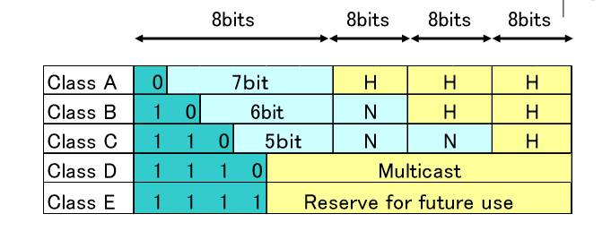
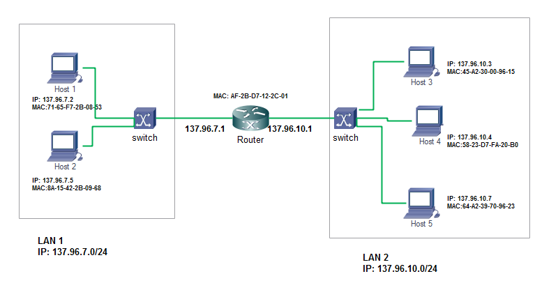
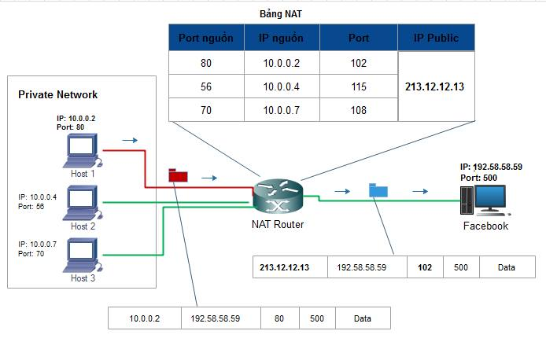

<!-- TOC -->

- [Mạng máy tính](#m-ng-m-y-t-nh)
- [Chương 1: Giới thiệu cơ bản về mạng máy tính](#ch-ng-1-gi-i-thi-u-c-b-n-v-m-ng-m-y-t-nh)
    - [1.1 Các khái niệm cơ bản](#1-1-c-c-kh-i-ni-m-c-b-n)
        - [Mạng máy tính](#m-ng-m-y-t-nh)
        - [Topology](#topology)
        - [Protocal](#protocal)
    - [1.2 Tầng](#1-2-t-ng)
        - [1.2.1  Mô hình OSI(7 tầng)](#1-2-1-m-h-nh-osi-7-t-ng)
        - [1.2.2 Mô hình TCP/IP](#1-2-2-m-h-nh-tcp-ip)
- [Chương 2: LAN](#ch-ng-2-lan)
    - [2.1 Nhiệm vụ của LAN](#2-1-nhi-m-v-c-a-lan)
    - [2.2 Đình dạng gói tin trong LAN](#2-2-nh-d-ng-g-i-tin-trong-lan)
    - [2.3 Phân biệt giữa Hub, Switch](#2-3-ph-n-bi-t-gi-a-hub-switch)
        - [Hub](#hub)
        - [Switch](#switch)
            - [Bài toán chuyển gói tin trong 1 mạng Lan](#b-i-to-n-chuy-n-g-i-tin-trong-1-m-ng-lan)
- [Chương 3: Internet Layer](#ch-ng-3-internet-layer)
    - [3.1 Internet Protocol](#3-1-internet-protocol)
    - [3.2 Địa chỉ IP](#3-2-a-ch-ip)
    - [3.3 Giao thức ARP](#3-3-giao-th-c-arp)
        - [Cơ chế hoạt động](#c-ch-ho-t-ng)
    - [3.4 Router](#3-4-router)
        - [Bài toán chuyển gói tin trong 2 mạng Lan khác nhau](#b-i-to-n-chuy-n-g-i-tin-trong-2-m-ng-lan-kh-c-nhau)
- [Chương 4: TCP,UDP](#ch-ng-4-tcp-udp)
    - [4.1 Phân biệt TCP và UDP](#4-1-ph-n-bi-t-tcp-v-udp)
        - [TCP](#tcp)
        - [UDP](#udp)
        - [Điểm giống nhau](#i-m-gi-ng-nhau)
        - [Điểm khác nhau](#i-m-kh-c-nhau)
    - [4.2 NAT](#4-2-nat)
        - [Tại sao lại cần NAT?](#t-i-sao-l-i-c-n-nat)
        - [NAT là gì?](#nat-l-g)
        - [Nhiệm vụ:](#nhi-m-v)
        - [Các loại NAT](#c-c-lo-i-nat)
            - [Bài toán chuyển gói tin sử dụng Overloading NAT](#b-i-to-n-chuy-n-g-i-tin-s-d-ng-overloading-nat)

<!-- /TOC -->

# Mạng máy tính

# Chương 1: Giới thiệu cơ bản về mạng máy tính
## 1.1 Các khái niệm cơ bản
###  Mạng máy tính 
Mạng máy tính là một tập hợp các máy tính kết nối với nhau bằng một đường truyền vật lí và dựa theo một kiến trúc mạng nào đó để có thể trao đổi dữ liệu cho nhau.

Có các thành phần chính sau:
+ Máy tính: máy chủ (chia sẻ tài nguyên của nó cho các máy tính khác trong mạng), các máy trạm (các máy tính cá nhân kết nối với máy chủ và sử dụng tài nguyên được chia sẻ từ máy chủ),thiết bị ngoại vi(máy in, ổ đĩa cứng ...), card mạng (điều khiển việc truyền chính xác dữ liệu tới các nút mạng, và chuyển đổi dữ liệu sang dạng điện hay quang),..
+ Kết nối các thiết bị với nhau bằng một phương tiện truyền (như cáp mạng,..) -> tạo ra đường truyền vật lí để liên kết các nút mạng, truyền dẫn các tín hiệu điện hay quang
+ Theo một kiến trúc mạng (topology + protocol)
###  Topology 
Là cẩu trúc hình học không gian của mạng (thực chất là cách bố trí các phần tử của mạng cũng như cách nối giữa chúng với nhau).

Có 3 dạng topology(hình trạng) cơ bản:
+ Mạng hình sao(star topology): các máy tính được nối vào cùng một thiết bị trung tâm (như hub, switch, ...).
+ Mạng dạng tuyến(bus topology): các máy tính được nối với nhau theo dạng đường thẳng.
+ Mạng hình vòng(ring topology): các máy tính được nối với nhau tạo thành một vòng kín.

Tuy nhiên trên thực tế luôn có sự kết hợp giữa các hình topology để tạo thành mạng phức tạp hơn như StarBus, StarRing ...

### Protocal 
Khi 2 máy khác nhau muốn giao tiếp với nhau thì chúng cần một protocol(giao thức). Có thể hiểu đơn giản protocol là sự thống nhất về cách thức trao đổi thông tin giữa các máy.

Để chuẩn hơn protocol được định nghĩa như sau:
+ Protocol là quy tắc, quy ước truyền thông bao gồm việc gửi và nhận các thông điệp: đó là Gửi một yêu cầu hoặc thông tin và  Nhận một thông tin hoặc yêu cầu hành động
+ Protocol xác định khuôn dạng dữ liệu, thông điệp; thứ tự truyền nhận thông điệp giữa các thực thể trên mạng; cũng như các hành động tương ứng khi nhận được thông điệp
+ Ví dụ một vài giao thức mạng: TCP, UDP, IP, HTTP, Telnet, Ethernet, ...

## 1.2 Tầng
**Tâng là gì?**
Tầng(layer) là cách tổ chức chương trình thành các thành phần chức năng riêng biệt theo một cách nhất định và theo thứ bậc. Mỗi tầng thường có một giao diện duy nhất cung cấp cho tầng bên trên và sử dụng giao thức do tầng bên dưới cung cấp, và nó sẽ độc lập với các tầng khác.

>Lí do cần phân tầng:
>+ Để chia hệ thống phức tạp thành nhiều phần đơn giản hơn
>+ Cho phép xác định rõ nhiệm vụ của mỗi bộ phận và quan hệ giữa chúng
>+ Cho phép dễ dàng bảo trì và nâng cấp hệ thống

Phân tầng tạo ra các mô hình mạng như: OSI, TCP/IP,...

### 1.2.1  Mô hình OSI(7 tầng)

**Tầng 1: Tầng vật lý (Physical Layer)**
Điều khiển việc truyền tải thật sự các bit trên đường truyền vật lý. Nó định nghĩa các tín hiệu điện, trạng thái đường truyền, phương pháp mã hóa dữ liệu vật lí, các loại đầu nối được sử dụng ...

**Tầng 2: Tầng liên kết dữ liệu (Data-Link Layer)**
Tầng này đảm bảo truyền tải các khung dữ liệu (Frame) giữa hai máy tính có đường truyền vật lý nối trực tiếp với nhau. Nó hỗ trợ cơ chế phát hiện và xử lý lỗi dữ liệu.

**Tầng 3: Tầng mạng (Network Layer)**
Tầng này đảm bảo cho việc truyền các gói tin dữ liệu (Packet) giữa 2 máy tính bất kỳ trong mạng máy tính(có thể có hoặc không có kết nối đường truyền vật lí trực tiếp). Nói cách khác, tầng mạng nhận nhiệm vụ tìm đường đi cho dữ liệu đến các đích khác nhau trong mạng.

**Tầng 4: Tầng giao vận (Transport Layer)**
Tầng này đảm bảo truyền tải dữ liệu giữa các quá trình. Dữ liệu gửi đi được đảm bảo không có lỗi, theo đúng trình tự, không bị mất mát, trùng lặp. Đối với các gói tin có kích thước lớn, tầng này sẽ phân chia chúng thành các phần nhỏ trước khi gửi đi, cũng như tập hợp lại chúng khi ở máy nhận.

**Tầng 5: Tầng phiên (Session Layer)**
Quản lý các phiên làm việc giữa các người sử dụng. Tầng phiên cung cấp cơ chế và chức năng bảo mật thông tin khi truyền qua mạng máy tính.

**Tầng 6: Tầng trình diễn (Presentation Layer)**
Tầng này đảm bảo các máy tính có kiểu định dạng dữ liệu khác nhau vẫn có thể trao đổi  thông tin cho nhau. Thông thường các mày tính sẽ thống nhất với nhau về một kiểu định dạng dữ liệu trung gian để trao đổi thông tin giữa các máy tính. Một dữ liệu cần gửi đi sẽ được tầng trình diễn chuyển sang định dạng trung gian trước khi nó được truyền lên mạng. Ngược lại, khi nhận dữ liệu từ mạng, tầng trình diễn sẽ chuyển dữ liệu sang định dạng riêng của nó.

**Tầng 7: Tầng ứng dụng (Application Layer)**
Đây là tầng trên cùng, nó cung cấp các ứng dụng truy xuất đến các dịch vụ mạng, bao gồm các ứng dụng của người dùng như Web Browser,Mail User Agent ... hoặc các chương trình làm server cung cấp các dịch vụ mạng như Web Server, FTP Server, Mailserver... Người dùng mạng giao tiếp trực tiếp với tầng này.

### 1.2.2 Mô hình TCP/IP

**Tầng 1: Tầng vật lý** 

**Tầng 2: Tầng liên kết dữ liệu**

**Tầng 3: Tầng mạng - sử dụng giao thức IP**

**Tầng 4: Tầng giao vận - sử dụng giao thức TCP, UDP**

**Tầng 5: Tầng ứng dụng - bao gồm chức năng của cả 3 tâng 5, 6, 7 trong mô hình OSI**

# Chương 2: LAN
## 2.1 Nhiệm vụ của LAN

**LAN**

 LAN(Local Address Network) là một hệ thống máy tính được kết nối với nhau để truyền tải dữ liệu và chia sẻ tập tin cho nhau.
## 2.2 Đình dạng gói tin trong LAN

## 2.3 Phân biệt giữa Hub, Switch 

Hai thiết bị thường được dùng trong mạng LAN là Hub và Switch. Ta sẽ tìm hiểu ở dưới đây.

### Hub

**Hub** thường là thiết bị được dùng để nối mạng, thông qua những đầu cắm của nó người ta liên kết với các máy tính dưới dạng hình sao. Vai trò  của Hub là khuyếch đại tín hiệu vật lí ở đầu vào và cung cấp năng lượng cho tín hiệu ở đầu ra.

>Câu hỏi: Tại sao cần có Hub? 
- Đó là do giới hạn của cáp mạng, và sự suy hao cuả tín hiệu trên đường ⇒ Hub ra đời để truyền tín hiệu đi xa hơn và đảm bảo độ ổn định của tín hiệu trên đường truyền (cũng như là tới các máy).

Đặc điểm của Hub: Khi một máy truyền tín hiệu đến Hub thì Hub sẽ chuyển tín hiệu đó cho tất cả các máy khác có kết nối với nó, hiểu đơn giản là nếu có máy truyền gói tin tới Hub thì hub sẽ gửi gói tin đó cho tất cả các máy khác có nối với nó.

### Switch

Switch là 1 thiết bị mạng Lan nhiều cổng, các máy trạm nối với switch thông qua các cổng của chúng (các switch cũng có thể nối với các switch khác để tạo thành mạng Lan lớn hơn) qua đó hình thành các các cặp liên kết giữa các máy với nhau.

Đặc điểm của Switch:
+ Switch quan sát các gói tin trên mạng đồng thời nó cũng học thông tin của mạng qua các gói tin mà nó nhận được, sử dụng thông tin này để xây dựng bảng địa chỉ MAC (gồm: địa chỉ MAC máy trạm, số hiệu cổng, TTL), qua đó cho biết máy nào ở cổng nào để từ đó chuyển tiếp gói tin đến đúng đích.
+ Điểm nổi bật của switch là nó có cơ chế tự học tức là nó sẽ tự nhận biết được địa chỉ MAC của các máy nối vào.

#### Bài toán chuyển gói tin trong 1 mạng Lan

Khi gói tin đi qua 1 port của Switch, tại đây Switch sẽ mở nó ra, đọc địa chỉ MAC nguồn và lưu vào bảng địa chỉ MAC của nó với số port tương ứng và khi đó máy tính sẽ kết nối trực tiếp với port đó của switch. Tiếp đó Switch đọc địa chỉ MAC đích của gói tin, tiến hành tìm kiếm trong bảng địa chỉ MAC của nó:
+ Nếu MAC đích tồn tại trong bảng địa chỉ MAC, switch sẽ gửi gói tin qua port tương ứng nối với máy có MAC đích, khi đó máy đích sẽ nhận được gói tin.
+ Nếu MAC đích không tồn tại trong bảng địa chỉ MAC, hoặc nó là 1 địa chỉ broadcast thì switch sẽ gửi gói tin đến tất cả các port còn lại trên nó, lúc này gói tin được chuyển đến tất cả các máy, được bóc ra và lấy địa chỉ MAC đích trên gói tin so sánh với địa chỉ MAC của các máy này, nếu máy nào có MAC trùng với MAC đích thì gói tin được giữ lại, ngược lại gói tin sẽ bị hủy.
+ Nếu MAC đích trùng MAC nguồn thì gói tin sẽ bị drop.

Ví dụ: Máy 1 gửi gói tin tới Máy 4

# Chương 3: Internet Layer

## 3.1 Internet Protocol 

Là một giao thức tầng mạng.
Có 2 chức năng cơ bản:
+ Chọn đường(Routing): Xác định đường đi của gói tin từ nguồn tới đích.
+ Chuyển tiếp(Forwarding): Chuyển tiếp dữ liệu từ đầu vào tới đầu ra của bộ định tuyến.

Đặc điểm của giao thức IP:
+ Là giao thức truyền tin nhanh: truyền dữ liệu theo phương thức "best effort"
+ Là giao thứctruyền tin không tin cậy: do không có cơ chế phục hồi lỗi. Khi cần sẽ sử dụng dịch vụ tầng trên để đảm bảo độ tin cậy
+ Là giao thức không liên kết: các gói tin được xử lý độc lập

## 3.2 Địa chỉ IP
**Địa chỉ IP**
Để gửi gói tin ta cần phải biết địa chỉ của máy đích, luôn phải có một loại địa chỉ để xác định vị trí, từ đó trao đổi thông ti chính xác từ máy nguồn tới máy đích. Địa chỉ này gọi là địa chỉ IP và trong Internet địa chỉ IP là duy nhất.

**Cấu trúc địa chỉ IP**

Địa chỉ IP là một dải nhị phân dài 32 bit, gồm 2 phần: Network ID dùng để xác định mạng mà thiết bị kết nối vào và phần Host ID để xác định thiết bị của mạng đó.

Để đơn giản địa chỉ IP thường được viết dưới dạng 4 số thập phân(tương ứng với 4 chuỗi con 8 bit nhị phân) và được cách nhau bởi dấu chấm.
>Ví dụ: 11001011 10110010 10001111 01100100 sẽ có dạng thập phân là  203.178.143.10

**Subnet mask**

Subnet mask cũng là một dải nhị phân 32 bit luôn đi kèm với mỗi địa chỉ IP. Nó dùng để xác định phần Network ID của địa chỉ đó. 

Subnet mask bao gồm phần các bit 1 và phần còn lại là các bit 0, subnet mask có bao nhiêu bit 1 thì địa chỉ IP tương ứng sẽ có bấy nhiêu bit ở phần Network ID.

>Ví dụ: với subnet mask như sau: 11111111 11111111 11111111 00000000 (255.255.255.0) bao gồm 24 bit 1, thì địa chỉ IP mang subnet mask này cũng sẽ có 24 bit phần Network ID.

Khi muốn viết subnet mask cho 1 IP ta có thể viết như ví dụ sau:
+ Cách 1: 192.168.1.3 - 255.255.255.0
+ Cách 2: 192.168.1.3/24 (/24 gọi là mặt nạ mạng, ở đâ nó cho biết địa chỉ IP này có 24 bit thuộc phần mạng)

Dựa vào subnet mask ta có thể biết được địa chỉ IP mà ta đang xét thuộc mạng nào bằng cách AND bit với subnet mask của nó (như vậy là ta giữ nguyên các bit phần mạng, và chuyển tất cả các bit phần host về 0)
>Ví dụ: IP 192.168.1.3/24 sẽ thuộc mạng 192.168.1.0/24

**Phân lớp địa chỉ IP**

Lớp A

- Địa chỉ lớp A sử dụng 8 bit đầu làm Network ID, 24 bit còn lại làm Host ID.
- Bit đầu của một địa chỉ lớp A luôn được giữ là 0. Do đó, các địa chỉ mạng lớp A gồm: 1.0.0.0 -> 127.0.0.0.Tuy nhiên, mạng 127.0.0.0 được sử dụng làm mạng loopback  nên địa chỉ mạng lớp A sử dụng được gồm 1.0.0.0 đến 126.0.0.0 (126 mạng).
- Phần host có 24 bit -> mỗi mạng lớp A có (2^24 – 2) host.
- Ví dụ: 10.0.0.1, 1.1.1.1, 2.3.4.5 là các địa chỉ lớp A.

Lớp B

- Địa chỉ lớp B sử dụng 16 bit đầu làm Network ID, 16 bit còn lại làm Host ID.
- Hai bit đầu của một địa chỉ lớp B luôn được giữ là 1 0. Do đó các địa chỉ mạng lớp B gồm: 128.0.0.0 -> 191.255.0.0.Có tất cả 2^14 mạng.
- Phần host: 16 bit -> một mạng lớp B có 2^16 – 2 host.
- Ví dụ: các địa chỉ 172.16.1.1, 158.0.2.1 là các địa chỉ lớp B.

Lớp C

- Địa chỉ lớp C sử dụng 24 bit đầu làm Network ID, 8 bit còn lại làm Host ID.
- Ba bit đầu của một địa chỉ lớp C luôn được giữ là 1 1 0. Do đó, các địa chỉ mạng lớp C gồm:
 192.0.0.0 -> 223.255.255.0 (2^21 mạng).
- Phần host: 8 bit -> một mạng lớp C có 2^8 – 2 = 254 host.
- Ví dụ: các địa chỉ 192.168.1.1, 203.162.4.191 là các địa chỉ lớp C. 

Lớp D

- Địa chỉ: 224.0.0.0 -> 239.255.255.255
- Dùng làm địa chỉ multicast. 

Lớp E

- Từ 240.0.0.0 trở đi.
- Được dùng cho mục đích nghiên cứu.

Các loại địa chỉ IP:

+ Địa chỉ Unicast: khi bạn muốn gửi gói tin đến một máy tính cụ thể, khi đó địa chỉ để bạn gửi tới sẽ là một địa chỉ unicast. Đây đơn giản là địa chỉ IP của một thiết bị nào đó trong cùng mạng cục bộ hoặc khác mạng cục bộ.

+ Địa chỉ Multicast: là địa chỉ mà trong trường hợp bạn muốn gửi gói tin đến nhiều máy tính, bạn sẽ dùng một địa chỉ multicast, địa chỉ này đại diện cho một nhóm các thiết bị trong mạng.
   >  Địa chỉ multicast này chính là các địa chỉ trong dải địa chỉ lớp D (224.x.x.x – 239.x.x.x)

+ Địa chỉ Broadcast: là địa chỉ dùng để gửi thông điệp đến tất cả các máy trong mạng nội bộ, địa chỉ Broadcast có toàn bộ các bits phần Host IP bằng 1 và dại diện cho toàn bộ các thiết bị trong mạng
   > Ví dụ: 192.168.1.255/24 là địa chỉ Broadcast của mạng 192.168.1.0/24.

+ Địa chỉ mạng: là địa chỉ dùng để xác định mạng này so với mạng khác. Địa chỉ mạng địa chỉ có tất cả các bits phần Host đều bằng 0
  > Ví dụ: 192.168.1.0/24 là địa chỉ mạng của mạng 192.168.1.0/24.

+ Default Gateway: là một địa chỉ (còn được gọi là cổng mặc định).Địa chỉ này được cấu hình cho máy tính và khi một gói tin được gửi đến một địa chỉ không cùng mạng, hoặc đơn giản là không biết gửi đi đâu thì gói tin sẽ được gửi đến địa chỉ này để tiếp tục đi đến nơi khác.Default Gateway thường là địa chỉ IP có thể sử dụng đầu tiên của mạng đó.

   >  Ví dụ: Default gateway của mạng 192.168.1.0/24 là 192.168.1.1/24

## 3.3 Giao thức ARP

Là giao thức phân giải địa chỉ: dùng để chuyển đổi từ địa chỉ IP sang địa chỉ MAC.

### Cơ chế hoạt động

Trong 1 mạng lan, máy A muốn gửi 1 gói tin cho máy B nhưng chỉ biết được IP của B, để làm được điều đó A cần phải biết được địa chỉ MAC của B, để A gắn địa chỉ này vào gói tin giúp gói tin chuyển đi đến đúng được B.

Các bước để A xác định MAC của B:

+ A sẽ kiểm tra cache của mình(APR table: <IP address, MAC address, TTL>),nếu tìm thấy MAC của B thì sẽ tiến hành thêm MAC đích vào gói tin rồi truyền đi
+ Nếu không tìm thấy, A sẽ gửi 1 gói tin broadcast (APR Request)đến các máy khác trong mạng( trong đó có MAC nguồn, IP nguồn của A, IP đích của B và MAC đích mặc định là: FF:FF:FF:FF:FF:FF)
+ Các máy còn lại trong mạng sẽ so sánh IP của mình với IP đích,B biết được máy A cần tìm là nó, khi đó B sẽ tạo gói tin APR Replay (chứa MAC của B) rồi gửi lại cho A, đồng thời nhập MAC, IP của A vào APR Table của mình.
+ Khi A nhận được gói tin do B gửi tới, nó sẽ cập nhật MAC, IP của B vào ARP Table (lần dùng sau nó sẽ không phải gửi gói tin request nữa)

## 3.4 Router

Router là một thiết bị hoạt động trên tầng mạng, nó có thể tìm được đường đi tốt nhất cho các gói tin qua nhiều kết nối để đi từ trạm gửi thuộc mạng đầu đến trạm nhận thuộc mạng cuối. Router có thể được sử dụng trong việc nối nhiều mạng với nhau và cho phép các gói tin có thể đi theo nhiều đường khác nhau để tới đích.

Router có địa chỉ riêng biệt và nó chỉ tiếp nhận và xử lý các gói tin gửi đến nó. Khi một trạm muốn gửi gói tin qua Router thì nó phải gửi gói tin với địa chỉ trực tiếp của Router (trong gói tin này phải chứa các thông tin về đích đến) và khi gói tin đến Router thì Router sẽ xử lý và gửi tiếp.

Khi xử lý một gói tin Router phải tìm được đường đi của gói tin qua mạng. Để làm được điều đó Router phải tìm được đường đi tốt nhất trong mạng dựa trên các thông tin nó có về mạng, thông thường trên mỗi Router có một bảng chỉ đường (Router table). Dựa trên dữ liệu về Router gần đó và các mạng trong liên mạng, Router tính được bảng chỉ đường (Router table) tối ưu dựa trên một thuật toán xác định trước.

### Bài toán chuyển gói tin trong 2 mạng Lan khác nhau

Trường hợp gói tin gửi đi mà máy nhận nằm khác mạng với máy gửi,thì gói tin tiếp tục được chuyến đến router để xử lý:
+ Router gỡ bỏ lớp Header của DataLink(gồm MAC nguồn, MAC cuối),sau đó đọc thông tin lớp Network(gồm IP nguồn, IP đích)
+ Router lấy IP đích, so sánh với IP trong Routing Table:

     >Nếu không tìm được đường đi ứng với IP đích ⇒ gói tin bị drop và router gửi thông báo không tìm thấy máy đích về cho máy gửi gói tin

     >Nếu tìm được đường đi ứng với IP đích thì router sẽ thêm lại header chứa: MAC nguồn mới - là địa chỉ MAC của router này, MAC đích mới - là địa chỉ MAC của router tiếp theo. Quá trình này lặp lại cho đến khi router phát hiện ra IP đích nằm chung mạng với interface của route(có cổng default gateway được thiết lập giữa router và mạng Lan có chứa IP đích) ⇒ Router sẽ gửi gói tin qua default gateway này, gói tin tiếp tục được switch quảng bá để tìm ra MAC đích, sau đó được chuyển tới náy đích.

Ví dụ: Host 1 ở mạng LAN 1 muốn chuyển một gói tin cho máy Host 4 ở mạng LAN 2.

Quá trình 2 host trên hình vẽ gửi gói tin cho nhau:
>Bước 1: Host 1 có IP của Host 4, nó tạo gói tin IP để chuẩn bị gửi cho Host 4, IP Packet có dạng:

IP nguồn | IP đích | Dữ liệu
---------|----------|---------
 137.96.7.2 | 137.96.10.4 | Data

>Bước 2: Host 1 gửi gói tin broadcast (ARP request) đến Switch, sau đó Switch gửi gói tin broadcast này đến tất cả các máy trong mạng LAN 1 và không nhận được phản hồi từ bất kì máy nào (không có máy nào trong mạng LAN 1 có địa chỉ MAC ứng với IP đích), khi đó Router nối với LAN 1 sẽ biết là IP đích là IP khác mạng, và trả lời cho Host 1 biết MAC đích bây giờ là MAC của router này (AF-2B-D7-12-2C-01). Host 1 tiến hành đưa gói IP Packet xuống tầng liên kết dữ liệu và đóng thành Frame, Frame này có dạng:

MAC nguồn| MAC đích| IP nguồn| IP đích| Dữ liệu
---------|----------|----------|---------|---------|
71-65-F7-2B-08-53| AF-2B-D7-12-2C-01| 137.96.7.2 | 137.96.10.4 | Data 

>Sau đó gói tin được chuyển qua switch, switch lại chuyển tiếp gói tin tới router thông qua default gateway (ở đây là 137.96.7.1).

>Bước 3: Router nhận được Frame, nó mở ra và bỏ Header của tầng liên kết giữ liệu(gồm MAC nguồn, MAC đích) thu được IP Packet:

IP nguồn | IP đích | Dữ liệu
---------|----------|---------
 137.96.7.2 | 137.96.10.4 | Data

>tiếp đó router sẽ tách lấy trường IP đích (137.96.10.4) và sử dụng định tuyến để biết gói tin đó cần gửi tới LAN 2, gói tin lại được đóng lại, được thêm Header chứa  MAC nguồn là MAC của router và MAC đích là mặc định (FF-FF-FF-FF-FF-FF) thu được Frame:

MAC nguồn| MAC đích| IP nguồn| IP đích| Dữ liệu
---------|----------|----------|---------|---------|
 AF-2B-D7-12-2C-01 | FF-FF-FF-FF-FF-FF | 137.96.7.2 | 137.96.10.4 | Data 
 
>Bước 4: Router chuyển tiếp gói tin đến switch trong mạng LAN 2 (qua default gateway 137.96.10.1), switch nhận được gói tin với MAC đích là mặc định nó tiến hành quảng bá trong mạng LAN 2 để tìm địa chỉ MAC (58-23-D7-FA-20-B0) ứng với IP đích (137.96.10.4) để chuyển gói tin tới Host 4 với định dạng:

MAC nguồn| MAC đích| IP nguồn| IP đích| Dữ liệu
---------|----------|----------|---------|---------|
 AF-2B-D7-12-2C-01 | 58-23-D7-FA-20-B0 | 137.96.7.2 | 137.96.10.4 | Data 

>Bước 5: Gói tin tới Host 4,Host 4 mở gói tin ra bỏ MAC Header, bỏ IP Header để lấy dữ liệu từ Host 1 gửi tới.
# Chương 4: TCP,UDP

## 4.1 Phân biệt TCP và UDP

### TCP
TCP (Transmission Control Protocol - "Giao thức điều khiển truyền vận") là một trong các giao thức cốt lõi của bộ giao thức TCP/IP. Sử dụng TCP, các ứng dụng trên các máy chủ được nối mạng có thể tạo các "kết nối" với nhau, mà qua đó chúng có thể trao đổi dữ liệu hoặc các gói tin. Giao thức này đảm bảo chuyển giao dữ liệu tới nơi nhận một cách đáng tin cậy và đúng thứ tự. TCP còn phân biệt giữa dữ liệu của nhiều ứng dụng (chẳng hạn, dịch vụ Web và dịch vụ thư điện tử) đồng thời chạy trên cùng một máy chủ.

### UDP
UDP (User Datagram Protocol) là một trong những giao thức cốt lõi của giao thức TCP/IP. Dùng UDP, chương trình trên mạng máy tính có thể gởi những dữ liệu ngắn được gọi là datagram tới máy khác. UDP không cung cấp sự tin cậy và thứ tự truyền nhận mà TCP làm; các gói dữ liệu có thể đến không đúng thứ tự hoặc bị mất mà không có thông báo. Tuy nhiên UDP nhanh và hiệu quả hơn đối với các mục tiêu như kích thước nhỏ và yêu cầu khắt khe về thời gian. Do bản chất không trạng thái của nó nên nó hữu dụng đối với việc trả lời các truy vấn nhỏ với số lượng lớn người yêu cầu.

### Điểm giống nhau
Đều là các giao thức mạng TCP/IP, đều có chức năng kết nối các máy lại với nhau, và có thể gửi dữ liệu cho nhau....

### Điểm khác nhau

Header của TCP và UDP khác nhau ở kích thước (20 và 8 byte) nguyên nhân chủ yếu là do TCP phải hộ trợ nhiều chức năng hữu ích hơn(như khả năng khôi phục lỗi). UDP dùng ít byte hơn cho phần header và yêu cầu xử lý từ host ít hơn

TCP :
+ Dùng cho mạng WAN 
+ Không cho phép mất gói tin 
+ Đảm bảo việc truyền dữ liệu 
+ Tốc độ truyền thấp hơn UDP

UDP: 
+ Dùng cho mạng LAN 
+ Cho phép mất dữ liệu 
+ Không đảm bảo.
+ Tốc độ truyền cao, VoIP truyền tốt qua UDP

## 4.2 NAT

### Tại sao lại cần NAT?

Số lượng địa chỉ IP là rất lớn, nhưng không phải là vô hạn. Vì vậy để bảo tồn địa chỉ IP, người ta chia địa chỉ IP ra làm 2 loại là địa chỉ public và địa chỉ private.

IP Public là các địa chỉ độc nhất, sử dụng được trong môi trường Internet.

IP Private chỉ sử dụng được trong mạng cục bộ, có thể tái sử dụng lại ở mạng cục bộ khác, nhưng trong một mạng thì vẫn phải mang giá trị duy nhất.
Với mỗi phân lớp địa chỉ IP, thì có một dải địa chỉ dùng để làm địa chỉ private cho lớp đó:

+ Lớp A: Từ 10.0.0.0 đến 10.255.255.255
+ Lớp B: Từ 172.16.0.0 đến 172.31.255.255
+ Lớp C: Từ 192.168.0.0 đến 192.168.255.255

Khi các thiết bị sử dụng địa chỉ IP private trong mạng cục bộ muốn truy cập được Internet – môi trường không sử dụng địa chỉ private, công nghệ NAT (Network Address Translation) được cài đặt trên các thiết bị router(đã được gán 1 địa chỉ IP Public) được sử dụng để chuyển IP private thành IP public và ngược lại, giúp cho các thiết bị trong mạng cục bộ vẫn có thể truy cập được Internet.

### NAT là gì?

+ Là một kỹ thuật để kết nối với Internet. Nó cho phép 1 (hay nhiều) địa chỉ IP nội miền được ánh xạ với 1 (hay nhiều) IP ngoại miền
+ Cho phép 1 thiết bị như Router hoạt động trung gian giữa Internet(Public Network) và Local(Private Network)

### Nhiệm vụ:

+ NAT duy trì 1 bảng thông tin về gói tin được gửi qua.
+ Khi 1 máy tính kết nối đến 1 website, địa chỉ IP nguồn của máy được NAT ánh xạ sang 1 địa chỉ IP Public đã được cấu hình sẵn trên NAT Server.
+ Khi gói tin được gửi từ website về máy, NAT dựa vào bảng NAT mà nó đã lưu ánh xạ ngược IP Public thành địa chỉ của máy tính trong mạng và chuyển tiếp 

### Các loại NAT

+ **Static NAT** (NAT tĩnh) là phương thức 1-1. Một địa chỉ IP Private sẽ được Router map với 1 địa chỉ IP Public. Được sử dụng khi thiết bị cần truy cập từ bên ngoài mạng.
+ **Dynamic NAT**: Một địa chỉ IP Private sẽ được Router map với 1 địa chỉ IP Public trong nhóm địa chỉ IP Public.
+ **Overloading NAT**: là 1 dạng thức của Dynamic NAT, nhiều địa chỉ IP Private sẽ được Router map đến 1 địa chỉ IP Public qua các cổng port khác nhau
+ **Overlapping NAT**: khi 1 địa chỉ IP trong mạng nội bộ là IP Public đang sử dụng trên một hệ thống mạng khác, Router phải duy trì 1 bảng tìm kiếm các địa chỉ này để ngăn và thay thế bằng 1 IP Public duy nhất

#### Bài toán chuyển gói tin sử dụng Overloading NAT

Ví dụ : Host 1 nằm trong Private Network có IP: 10.0.0.2, Ứng dụng của Host 1 gửi gói dữ liệu X (qua port 80) đến trang Facebook (có IP: 192.58.58.59, port 500). Dưới đây sẽ tóm tắt các bước của quá trình gói tin được truyền đi.

+ Bước 1: Dữ liệu X từ ứng dụng của Host 1 qua transport layer, qua network layer  -> IP Packet có dạng:

IP nguồn| IP đích| Port nguồn| Port đích| Dữ liệu
---------|----------|----------|---------|---------|
 10.0.0.2 | 192.58.58.59 | 80  | 500 | Data 

+ Bước 2: IP Packet sẽ chuyển xuống data link, physical và chuyển sang router
+ Bước 3: Router tiến hành bỏ header của data link. Tiếp đó, NAT router dựa trên IP nguồn(10.0.0.2) và số hiệu cổng nguồn(80) ánh xạ tới IP Public (213.12.12.13/24) với port ánh xạ là 102. Gói tin lại được đóng lại và có dạng:

IP nguồn| IP đích| Port nguồn| Port đích| Dữ liệu
---------|----------|----------|---------|---------|
 213.12.12.13 | 192.58.58.59 | 102  | 500 | Data 

+ Bước 4: Router chuyển tiếp gói tin đến trang Facebook (thông qua cơ chế định tuyến và chuyển tiếp).

---------------------------------------------

Tài liệu tham khảo :

Slide Mạng máy tính cô Trương diệu Linh

Computer Network tanenabun

https://www.stdio.vn/articles/read/127/hanh-trinh-cua-mot-goi-tin

https://www.stdio.vn/articles/read/122/so-luoc-ve-dia-chi-ip

http://dulieu.tailieuhoctap.vn/books/cong-nghe-thong-tin/quan-tri-mang/file_goc_775681.

https://quantrimang.com/network-address-translation-nat-hoat-dong-nhu-the-nao-phan-1-

https://quantrimang.com/tim-hieu-ve-cau-hinh-nat-phan-2-118501

https://quantrimang.com/dynamic-nat-nat-dong-va-overloading-nat-hoat-dong-nhu-the-nao-phan-3-118518

https://quantrimang.com/tim-hieu-ve-nat-phan-cuoi-118574

