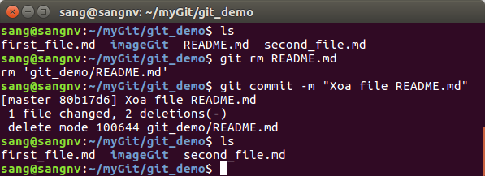

# Chương 1: Sơ lược về Git

Trước khi tìm hiểu để biết Git là gì, Git làm việc như thế nào... ta cần phải tìm hiểu về Version Control(VS) bởi vì VS là nền tảng, Git được xây dựng và phát triển lên từ VS.  
## 1. Version Control 

Version Control là một hệ thống lưu trữ các thay đổi của một file hoặc tập hợp các file theo thời gian mà bạn có thể gọi lại(quay lại) các phiên bản đã được lưu trữ trước đó.

Một VCS cho phép bạn: khôi phục lại phiên bản cũ của các file, khôi phục lại phiên bản cũ của toàn bộ dự án, xem lại các thay đổi đã được thực hiện theo thời gian, xem ai là người thực hiện thay đổi cuối cùng có thể gây ra sự cố, hay xem ai là người đã gây ra những sự phát sinh... Và còn nhiều hơn thế nữa, sử dụng VCS còn đồng nghĩa với việc khi bạn làm rối tung mọi thứ lên hay vô tình xoá mất các file bạn có thể dễ dàng khôi phục lại chúng một cách nhanh chóng và không tốn quá nhiều công sức.

Có ba hệ thống quản lý phiên bản là:

+ Hệ thống quản lý phiên bản cục bộ (Local Version Control System)
+ Hệ thống quản lý phiên bản tập trung (Central Version Control System)
+ Hệ thống quản lý phiên bản phân tán (Distributed Version Control System)

Và Git là một trong những hệ thống quản lý phiên bản phân tán phổ biến nhất hiện nay.

### 1.1 Local Version Control System
Để quản lý phiên bản của một file đa số mọi người thường copy nó vào một thư mục khác, phương pháp này phổ biến bởi vì nó đơn giản và dễ thực hiện. Tuy nhiên nó cũng rất dễ gặp lỗi, bạn sẽ dễ quên mất mình đang ở trong thư mục chứa phiên bản nào hay vô tình chỉnh sửa file dẫn đến những sai lầm, hoặc chép nhầm các file mà bạn không mong muốn. Để giải quyết vấn đề này các hệ thống Local VCS ra đời. Nó có một database để lưu lại tất cả những thay đổi của các file dưới sự kiểm soát thay đổi.

Ví dụ phổ biến của Local VCS là hệ thống RCS. RCS làm việc bằng cách nó lưu giữ một tập các bản vá (tương ứng với các thay đổi của file đó) trong một khuôn mẫu đặc biệt trên đĩa cứng. Và nó có thể tạo lại bất kỳ file nào ở bất kỳ thời điểm nào bằng cách thêm tất cả các bản vá trước đó.

### 1.2 Centralized Version Control System
Vấn đề nghiêm trọng tiếp theo mà mọi người thường gặp phải là họ cần cộng tác với các lập trình viên khác trong hệ thống. Để giải quyết vấn đề này, Centralized Version Control Systems(CVCSs) được phát triển. Một CVCSs bao gồm một máy chủ trung tâm (central server) có chứa tất cả các file đã được phiên bản hoá (versioned files) và danh sách các client có quyền thay đổi các tập tin này trên máy chủ trung tâm đó.

Trong nhiều năm, CVCS đã trở thành tiêu chuẩn cho việc quản lý phiên bản. Nó cung cấp rất nhiều lợi thế so với việc quản lý cục bộ. Ví dụ, tất cả người dùng đều biết một phần nào đó những việc mà những người khác trong dự án đang làm. Người quản lý có quyền quản lý ai có thể làm gì theo ý muốn, và việc này dễ hơn nhiều so với việc phải quản lý từng cơ sở dử liệu ở từng máy riêng biệt.

Tuy nhiên, CVCS cũng có bất cập nghiêm trọng. Đó là sự cố mà máy chủ trung tâm mắc phải, giả sử nếu máy chủ không hoạt động trong một giờ, thì trong khoảng thời gian này không ai có thể cộng tác với những người còn lại hoặc lưu trữ các thay đổi đã được phiên bản hoá của bất kỳ file nào mà người đó đang thao tác. Nếu ổ cứng lưu trữ cơ sở dữ liệu trung tâm bị hỏng, và các sao lưu dự phòng chưa được tạo ra tính đến thời điểm đó sẽ dẫn tới mất toàn bộ lịch sử của dự án đó, ngoại trừ những phiên bản cục bộ mà người dùng lưu được trên máy tính cá nhân.

### 1.3 Distributed Version Control System 

Một DVCS giúp mỗi máy tính có thể lưu trữ nhiều phiên bản khác nhau của một mã nguồn, nghĩa là bạn có thể sao chép toàn bộ kho chứa từ máy chủ chứ không chỉ là phiên bản mới nhất của các file. Chính vì vậy nếu như một máy chủ nào mà các hệ thống quản lý phiên bản này đang cộng tác xảy ra sự cố hoặc ngừng hoạt động, thì kho chứa từ bất kỳ máy khách nào cũng có thể dùng để sao chép ngược trở lại máy chủ để khôi phục lại toàn bộ hệ thống. Như vậy có thể coi mỗi máy khách là một hệ thống riêng biệt.

## 2. Git

### 2.1 Đặc điểm của Git
**Điểm khác biệt giữa Git và các VCS khác**
+ Các hệ thống VCS khác lưu trữ thông tin dưới dạng các file thay đổi theo thời gian tức là mỗi khi người sử dụng lưu lại phiên bản thì hệ thống sẽ lưu lại toàn bộ các file.(Hình 4)

   Hình 4. Các hệ thống khác lưu trữ file dưới dạng các thay đổi so với phiên bản trước của mỗi file.

   

+ Còn với Git dữ liệu giống như một tập hợp các snapshot của một hệ thống các file nhỏ. Mỗi lần bạn commit, hoặc lưu lại trạng thái hiện tại của dự án trong Git, Git sẽ tạo một  snapshot  ghi lại nội dung của tất cả các file tại thời điểm đó và tạo ra một tham chiếu tới snapshot đó.Với những file có sự thay đổi Git sẽ tạo một phiên bản mới còn với những file không có sự thay đổi nào, Git không lưu file đó lại một lần nữa mà chỉ tạo một liên kết để ánh xạ tới tập tin gốc đã tồn tại trước đó.(Hình 5)

   Hình 5.Git lưu trữ dữ liệu của dự án theo thời gian dưới dạng các snapshot.

  

**Phần lớn các thao tác diễn ra cục bộ**

Git lưu toàn bộ dự án trên ổ cứng của bạn, và phần lớn các thao tác trong Git chỉ cần yêu cầu các file hay tài nguyên cục bộ do đó bạn có thể thực hiện được các  thao tác này gần như ngay lập tức. Điều này có nghĩa là người dùng có thể thay đổi và commit thay đổi của mình ngay cả khi không có kết nối với internet. Sau khi người dùng kết nối với internet  git sẽ tự đồng bộ với hệ thống. Điều này giúp người dùng có thể làm việc trong điều kiện không có kết nối internet.

### 2.2 Ba trạng thái của một tập tin do Git quản lý

 Mỗi tập tin trong Git được quản lý dựa trên ba trạng thái: committed, modified, và staged. 
 + Committed có nghĩa là dữ liệu đã được lưu trữ một cách an toàn trong cơ sở dữ liệu.
 + Modified có nghĩa là bạn đã thay đổi file nhưng chưa commit vào cơ sở dữ liệu.
 + Staged là bạn đã đánh dấu sẽ commit phiên bản hiện tại của một file đã chỉnh sửa trong lần commit sắp tới.
 
 Điều này tạo ra ba phần riêng biệt của một dự án sử dụng Git: working directory, staging area, và .git directory.

  

Trong đó:
+ Working directory(thư mục làm việc): là bản sao một phiên bản của dự án, nó được kéo về (pulled) từ cơ sở dữ liệu được nén trong thư mục .git sau đó lưu trên ổ cứng của bạn để bạn sử dụng hoặc chỉnh sửa.
+ Staging area(khu staging): là khu vực chứa các file sẽ được commit trong lần commit sắp tới. 
+ .Git directory(thư mục .git): là nơi lưu trữ các metadata và cơ sở dữ liệu của một dự án, nó là phần được sao lưu về khi bạn tạo một bản sao(clone) của một kho chứa từ một máy tính khác.

Tiến trình công việc cơ bản của Git:

1. Bạn thay đổi, chỉnh sửa các file trong working directory(lúc này các file ở trạng thái modified).
2. Bạn đưa các file đó vào staging area(các file ở trạng thái staged).
3. Bạn commit, các file trong staging area sẽ được lưu trữ vĩnh viễn vào thư mục .git.

# Chương 2: Sử dụng git cơ bản

## 1. Cài đặt Git trên Unbuntu 
1. Cách 1: Cài đặt từ mã nguồn

+ Cài các thư viện cần thiết cho Git
  >$ apt-get install libcurl4-gnutls-dev libexpat1-dev gettext libz-dev libssl-dev

+ Tải phiên bản mới nhất của Git từ website:
  >http://git-scm.com/download

+ Dịch và cài đặt Git:
  >$ tar -zxf git-2.7.4.tar.gz

  >$ cd git-2.7.4

  >$ make prefix=/usr/local all

  >$ sudo make prefix=/usr/local install

+ Nếu bạn muốn tải về các bản cập nhật của Git thì dùng câu lệnh sau:
  >$ git clone git://git.kernel.org/pub/scm/git/git.git

2. Cách 2: Thông qua gói cái đặt trên hệ điều hành của bạn
   >$ apt-get install git 

  + Kiểm tra lại xem git đã cài đặt thành công hay chưa ta dùng lệnh:
    >git --version

## 2. Cấu hình Git lần đầu

Để tùy biến 1 số lựa chọn cho môi trường của Git bạn cần phải cấu hình Git lần đầu (chúng sẽ được ghi nhớ qua các lần cập nhật nghĩa là bạn chỉ cần cập nhật duy nhất 1 lần, tuy nhiên bạn cũng có thể thay đổi chúng bằng việc chạy lại các lệnh):

1. Cấu hình danh tính
   >git config --global user.name  "Tên tài khoản github của bạn"

   >git config --global user.email <Email bạn dùng để đăng ký github>
  
    Ví dụ: Tên tài khoản github của mình là Monlight, email sang11a1hbt@gmail.com thì mình gõ như sau: 
   - git config --global user.name "Monlight"
   - git config --global user.email sang11a1hbt@gmail.com

2. Kiểm tra lại cấu hình 
   >git config --list

3. Cấu hình tài khoản

-  Để sử dụng git bạn cần có 1 tài khoản, bạn truy cập vào trang chủ của git để đăng ký qua link sau:
   >http://github.com

   

## 3. Taọ một kho chứa Git 
- Tạo một kho chứa mới trên máy tính của bạn,sử dụng lệnh: 
  > $ git init <tên kho chứa>
  
  Ví dụ: Taọ một kho chứa có tên là mygit
  > $ git init mygit

  Nó sẽ tạo một kho chứa ngay thư mục chúng ta đang đứng.

- Sao chép một kho chứa Git đã có sẵn: Sử dụng lệnh git clone [đường dẫn tới kho chứa]

   Ví dụ: Khi bạn thực thi lệnh sau thì nó sẽ tạo ra kho chứa với tên thư mục là demo_git trên máy của bạn để chứa bản sao dữ liệu của kho Git đó:
   >$ git clone https://github.com/Monlight/demo_git

  

-   Khi bạn sao chép 1 kho chứa về máy và muốn đặt tên lại kho chứa thì bạn dùng câu lệnh: git clone [đường dẫn] <tên mới của thư mục>

    >Ví dụ: $ git clone https://github.com/Monlight/demo_git myGit

## 4. Ghi lại thay đổi vào kho chứa
Ta có một bản sao dữ liệu của dự án để làm việc. Các file trong working directory của ta có thể ở một trong hai trạng thái: tracked hoặc untracked.
+ File tracked là file được theo dõi, nó đã nằm ở staging area hoặc đã có mặt trong snapshot (đã được commit) ở lần trước. File tracked có thể ở dạng: unmodified, modified, hoặc staged.
+ File untracked là các file còn lại trong working directory  của bạn (không có mặt trong snapshot lần trước, hay chưa được nằm trong staging area).

Khi bạn tạo bản sao (clone) 1 kho chứa về máy thì tất cả các tập tin sẽ ở trạng thái tracked và unmodified, điều này là tất nhiên vì bạn chưa thực hiện bất kì thay đổi nào.

Khi bạn chỉnh sửa các file này, Git coi là chúng đã bị thay đổi so với lần commit trước đó(trạng thái của file là modified).

Để lưu lại file bị thay đổi này bạn sẽ thêm chúng vào staging area(bằng lệnh git add) và sau đó dùng git commit để commit tất cả file ở trạng thái staged đó, lưu chúng vào cơ sở dữ liệu(file này trở thành unmodified). 

Hoặc bạn cũng có thể tạo một file mới trong một thư mục của bản sao đã tải về, khi đó file này là file untracked. Để lưu lại nó bạn cũng sẽ thực thi 2 lệnh git add(đưa file vào staging area) và git commit để lưu file vào cơ sở dữ liệu.

Quá trình này cứ thế lặp đi lặp lại tạo ra một vòng đời trạng thái cho các file như hình sau:

## 5. Kiểm tra trạng thái của file
Để kiểm tra trạng thái của của file bạn có thể sử dụng lệnh `git status`:

- $ git status 

  
- Như vậy khi sử dụng lệnh git status bạn sẽ thấy được trạng thái của các file (file nào được chỉnh sửa, file nào được thêm mới hay bị xóa...) và các thư mục/khu vực chứa chúng. 

Tuy nhiên git status chỉ cho bạn biết các thay đổi một cách chung chung. Để xem các thay đổi một cách chi tiết, Git cung cấp cho bạn một câu lệnh khác là git diff:
- `git diff` không sử dụng tham số: Câu lệnh này so sánh những gì bạn đã thay đổi trong working directory với những gì đã được lưu ở staging area. Ví dụ sau cho thấy nội dung một dòng trong first_file.md được chỉnh sửa từ "1" thành "1 2 3":

  
- `git diff --staged` : để so sánh những thay đổi giữa file được lưu vào staged và file đã được commit.

## 6. Theo dõi file
Để có thể theo dõi các file mới tạo, hoặc các file bị chỉnh sửa, bạn dùng lệnh `git add`:
- $ git add README.md

  

- Khi đó README.md ở trạng thái staged và nó nằm trong danh sách các thay đổi chuẩn bị được commit, nếu bạn tiến hành commit thì Git sẽ tạo một snapshot mới để lưu lại phiên bản này. Khi đó READE.md ở dạng Unmodified.

## 7. Quản lý thay đổi của file

Khi bạn chỉnh sửa một file mà file đó nằm trong khu vực staging thì khi xem lại trạng thái của file đó bạn sẽ thấy file đó nằm trong cả 2 trạng thái là modified và staged. Ví dụ như thay đổi file README.md đã được thêm vào khu vực staging(ở mục 6), sau đó kiểm tra lại ta có:

- $ vim README.md
- $ git status

  
- Bạn có thể kiểm tra lại thay đổi của mình trong file README.md bằng `git diff`. Ví dụ như trường hợp này bạn thêm nội dung "789" vào README.md thì kết quả thông báo như sau:

  

Nếu bây giờ bạn tiến hành commit ngay, thì thay đổi vừa rồi trong file README.md sẽ không được lưu xuống cơ sở dữ liệu bởi vì những thay đổi đó chưa được nằm trong khu vực staging.
   - 

Để lưu lại những thay đổi trên file README.md khi file này thuộc cả 2 trạng thái là modified và staged bạn cần dùng `git add` để đưa những thay đổi này vào khu vực staging, sau đó mới tiến hành commit.

 

##  8. Commit
Để hiểu được một commit là gì, ta sẽ xem xét đến cách lưu trữ dữ liệu trong git.

Sau khi khởi tạo git bằng lệnh `git init` trong một thư mục, Git sẽ tạo ra một thư mục .git lưu trữ toàn bộ database và các thao tác đối với các dữ liệu này. Các thư mục con và các file trong .git:

HEAD, branches/, config, description, hooks/ index, info/, objects/, refs/

trong đó thư mục objects/ là thư mục lưu trữ tất cả nội dung của database bao gồm 4 object cơ bản:

+ tree : tương đương như một directory
+ blob: tương đương một file
+ commit
+ tag

Hình minh họa cách lưu trữ dữ liệu trong Git:

Như vậy mỗi một commit có 2 con trỏ, một con trỏ trỏ đến thư mục gốc tree, và một con trỏ trỏ đến commit trước của nó. Trong đó tree sẽ tham chiếu đến tất cả các thư mục con và các file con của nó, như vậy mỗi một commit trong Git lưu trữ toàn bộ dữ liệu của thư mục(snapshot) chứ không phải là chỉ lưu trữ những thay đổi giữa 2 commit.

**Các vấn đề khi commit:**
+ Bạn chỉ có thể commit đối với các file đã nằm ở trạng thái staged.

+ Những file chưa chưa nằm trong khu vực staging, bao gồm các file mới được tạo ra mà chưa được `git add` hoặc những file mà thuộc cả 2 khu vực staged và modified sẽ không được commit.

+ Bạn có thể commit trực tiếp thông điệp bằng cách thêm vào sau `git commit` cờ -m
  >$ git commit -m "Noi dung commit"

Nếu bạn có sửa đổi trên nhiều file  và muốn commit hết chúng. Khi đó việc đưa từng file vào khu vực staging sẽ tốn thời gian và công việc trở lên phức tạp. Để giải quyết vấn đề này Git cung cấp thêm cờ -a trong lệnh `git commit`. Khi đó, Git sẽ tự động thêm tất cả các file đã được theo dõi trước đó vào thư mục .git cho bạn bỏ qua bước `git add`
  >$ Ví dụ:

**Tùy chọn --amend trong lệnh `git commit`**

Khi bạn muốn chỉnh sửa commit trước mà không muốn tạo thêm 1 commit mới (thời gian trên commit vẫn là thời gian của lần commit trước) thường xảy ra 2 trường hợp sau:
+ Bạn chỉ muốn thay đổi thông điệp commit ở câu lệnh git commit trước bằng một thông điệp commit mới (thường dùng khi thông điệp commit của bạn bị viết nhầm và bạn muốn sửa lại, hoặc các thông điệp commit lộn xộn và bạn muốn sắp xếp lại). Ví dụ bạn thay đổi thông điệp "initial commit" thành "the first commit":

  

+ Hoặc bạn commit quá nhanh mà không kịp thêm một số file nào đó (ví dụ như file ảnh) vào dự án, bạn muốn thêm nó vào mà không muốn thêm 1 commit mới với một thông điệp mới (ví dụ như : git commit -m "Them anh" chẳng hạn), bạn có thể làm như sau:

  

### 9. Xem lịch sử commit

### 10. Loại bỏ file khỏi khu vực staging

Để kiểm tra trạng thái của các file trong dự án, xem chúng có nằm trong thư mục làm việc hay đã chuyển sang khu vực stage lệnh git status thường được dùng. Ví dụ:

Ở ví dụ này, bạn thấy có 2 file đang nằm trong khu vực staging nhưng 1 file ở dạng newfile còn file kia ở dạng renamed, và ngay bên dưới `Changes to be committed` nhắc nhở bạn rằng sử dụng lệnh `git reset HEAD < file > ...` để loại bỏ file khỏi khu vực stage. Tiếp đó bạn sử dụng lệnh này để loại bỏ file ảnh (imageGit/amend02.png) ra khỏi khu vực staging trước khi tiến hành commit. Lúc này file ảnh nằm ở dạng untracked và sẽ không được commit khi ta thực thi lệnh `git commit`.

Như vậy lệnh git reset HEAD được thực thi sẽ thay đổi trạng thái file từ stage sang untracked, nó ngược với lệnh git add.

### 11. Phục hồi file đã thay đổi
 
Điều gì xảy ra nếu bạn không muốn giữ những thay đổi mà mình đã thực hiện trên một file? Làm thế nào để dễ dàng khôi phục những thay đổi để trở về trạng thái trước khi thay đổi. Thật may mắn, git status sẽ nhắc nhở bạn ở ngay bên dưới `Changes not staged for commit` rằng nếu thực thi lệnh `git checkout -- < file >...` thì những thay đổi trên file đó sẽ bị hủy bỏ, như hình ví dụ bên dưới:

Bạn thấy rằng đây là một lệnh nguy hiểm bởi vì tất cả những thay đổi mà bạn đã thực hiện trên file sẽ bị mất vĩnh viễn và bạn không thể khôi phục lại được vì nó chưa được thực thi commit. Vì vậy, bạn đừng nên sử dụng lệnh này khi bạn không chắc chắn rằng mình không cần file đó nữa.

### 12. Xóa file

Khi một file đã nằm trong khu vực staging, bạn không thể xóa nó với lệnh `rm` (như cách bạn thường làm để xóa một file ra khỏi thư mục làm việc của mình), để xóa hoàn toàn file đó ra khỏi Git, bạn phải xóa nó khỏi khu vực staging - sử dụng lệnh  `git rm < file >` lệnh này cũng sẽ xóa tập tin đó ra khỏi thư mục làm việc luôn, và bạn sẽ không thấy nó trong Git ở phiên làm việc sau nữa.Ví dụ xóa file README.md:

   

Nếu bạn muốn giữ tập tin đó ở trong thư mục làm việc và bạn chỉ muốn xóa chúng khỏi khu vực tổ chức thì cần dùng thêm tùy chọn --cached:
  >$ git rm --cached README.md

### 13. Đổi tên file

Nếu bạn tiến hành đổi tên file bằng lệnh `mv` thông thường (hoặc bạn đổi tên file trên giao diện). Thì để lưu lại thay đổi này trong git bạn phải thực hiện `git add` và `git commit`. Để giúp việc đổi tên đơn giản hóa, Git cung cấp cho người dùng lệnh `git mv`. Ví dụ để đổi tên file từ README.md thành README bạn làm như sau:
 >$ git mv README.md README

