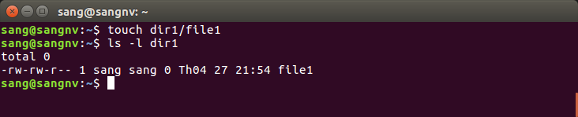

# LINUX

Thực hành các lệnh trên Terminal. Trước tiên để mở Terminal bạn vào "Search your computer" gõ "Terminal" và nhấn chuột vào biểu tượng của Terminal để mở nó. Tiếp theo bạn có thể thực hành một số câu lệnh cơ bản trong Linux bằng Terminal như ở phần trình bày dưới đây.

# I. Một số lệnh cơ bản trong Linux

1. Lệnh `pwd`: 
+ Cho biết thư mục làm việc hiện tại của bạn bằng việc hiển thị một đường dẫn từ thư mục gốc(root) đến thư mục bạn đang làm việc.

   

+ Đường dẫn bắt đầu bằng "`/`", được hệ thống xem  là một tên đường dẫn đầy đủ bắt đầu từ thư mục root. Ở ví dụ trên, nếu ta chỉ sử dụng `pwd` hệ thống mặc định sẽ trả về đường dẫn tới thư mục cá nhân của bạn(ví dụ như /home/sang)

2. Lệnh cd:
+ Dùng để thay đổi thư mục hiện hành:

   > `cd [directory]`

    + `directory` là thư mục muốn di chuyển đến.
+ Một số lưu ý: 
    > `cd ..`  hoặc `cd -` : quay trở lại thư mục cha

    > `cd ../..` : quay trở lại thư mục cha của thư mục cha đó

    > `cd` hoặc `cd ~` : quay trở về thư mục gốc
+ Ví dụ:
    

+ Note: Đối với các thư mục mà tên thư mục chứa dấu cách trong tên thì cần phải dùng thêm dấu `''` để bao ngoài tên, hoặc dùng dấu `\` trước chỗ cách. Ví dụ:

    

Một số lưu ý:

3. Lệnh ls
+ Xem thông tin về file và thư mục:
ục
   > `ls [option] [directory]`

+ Lệnh `ls` không `option`: Hiển thị danh sách các file, thư mục con (của `directory` cha) ở dạng đơn giản (nếu chỉ dùng `ls` thì kết quả hiển thị là các thư mục, file trong thư mục cá nhân của bạn).

+ Một số `option` của `ls`:

  + `-l` : hiển thị các file, thư mục ở dạng đầy đủ(gồm các quyền người sử dụng, số lượng hardlink, người sở hữu, nhóm sở hữu, kích thước, ngày thay đổi, tên file hoặc thư mục)

   + `-F` : gắn thêm ký tự sau tên file để cho biết loại file(* cho file thực thi, / cho thư mục, file bình thường không gắn thêm ký tự nào)

   + `-a` : liệt kê tất cả các file ở trong thư mục, bao gồm cả file ẩn (file ẩn là file có dấu chấm `.` ở trước tên file)
   + `-R` : liệt kê đệ quy các thư mục con, trong mỗi thư mục con lại liệt kê các file và thư mục con của nó.
   + Lưu ý: ta có thể kết hợp nhiều tham số, nghĩa là thay vì sử dụng lệnh `ls -l -F` ta có thể dùng lệnh tương đương là `ls -lF`.
+ Ví dụ:

    

+ Để xem các thư mục trong thư mục gốc, bạn có thể sử dụng 1 trong 2 lệnh sau: `ls ../../` hoặc `ls /`, ví dụ:

    

4. Lệnh man
+ Dùng để xem, tra cứu cách dùng, cú pháp của các câu lệnh, cũng như tra cứu cách dùng của các tùy chọn đối với 1 câu lệnh. 
+ Cú pháp: `man <command>`
+ Ví dụ: `$ man ls`

     

+ Để thoát khỏi câu lệnh này bạn nhấn `q`

5. Lệnh mkdir
+ Dùng để tạo thư mục mới, có thể tạo 1 lúc 1 hoặc nhiều thư mục
+ Cú pháp: `mkdir [option] <name directory>`
+ Ví dụ:

    
+ Một số `option`:

  + `-p`: tạo ra một thư mục con trong thư mục cha một cách đệ quy
  + `-v`: để hiển thị lên màn hình những gì mà mkdir làm cho người dùng biết
  + Ví dụ:
  
      

6. Lệnh rmdir
+ Dùng để xóa thư mục rỗng, có thể xóa đệ quy các thư mục nếu chúng đều rỗng
+ Cú pháp: `rmdir [option] <name directory>`
+ Ví dụ: 

     

7. Lệnh touch
+ Dùng để tạo một file mới
+ Cú pháp: `touch [option] <name file>`
+ Tùy chọn `-t`: dùng để sửa đổi thời gian của một file theo dạng  (YY MM DD hh mm)
+ Ví dụ:

    
8. Một số lệnh hiển thị nội dung văn bản
+ `cat <name file>`: hiển thị toàn bộ nội dung văn bản
+ `less <name file>`: hiển thị nội dung văn bản theo trang, muốn xem trang tiếp cần nhấn `enter`
+ `more <name file>`: hiển thị 1 phần nội dung văn bản nhất định (ví dụ như 65% nội dung văn bản), muốn xem tiếp phần còn lại cần nhấn `enter`
9. Lệnh echo 
+ Dùng để in 1 đoạn văn bản ra màn hình hoặc ghi một đoạn văn bản vào 1 file
+ Ví dụ:

    

10. Lệnh cp 
+ Dùng để sao chép tập tin, thư mục
+ Cú pháp: `cp [option] <source> <destination>`
+ Lệnh có 3 chế độ hoạt động tùy theo đối số truyền vào:
     + Sao chép một file sang file khác, ví dụ sao chép file 1 sang file2: `cp [option] file1 file2`
     + Sao chép nhiều file vào 1 thư mục:`cp [option] <name files> <directory>`
     + Sao chép toàn bộ nội dung 1 thư mục vào một thư mục khác:`cp [option] <source directory> <destination directory>`
+ Một số `option`:
    + `f`: Xóa tập tin đích nếu không thể mở file cho thao tác
    + `H`: nếu nguồn là liên kết động, không sao chép liên kết mà sao chép file tương ứng
    + `i`: nhắc nhở file sẽ bị ghi đè
    + `p`: giữ lại một số thuộc tính như thời gian thay đổi gần nhất...
11. Lệnh mv
+ Dùng để di chuyển file, thư mục từ nơi này đến nơi khác hoặc đổi tên một file:
    + Đổi tên file, ví dụ: `mv file1 newfile`
    + Di chuyển file đến thư mục, ví dụ:`mv newfile dir1`
    + Di chuyển file đến thư mục và đổi tên file đó, ví dụ:`mv file dir1/myfile`
    + Di chuyển nhiều file đến 1 thư mục:`mv file2 file3 file4 dir1`
+ Ví dụ:

    

12. Lệnh rm
+ Dùng để xóa file, thư mục
+ Cú pháp: `rm [option] <file or directory>`
+ Một số `option`:
    + `-f`: dùng để xóa file
    + `-r`: dùng để xóa thư mục