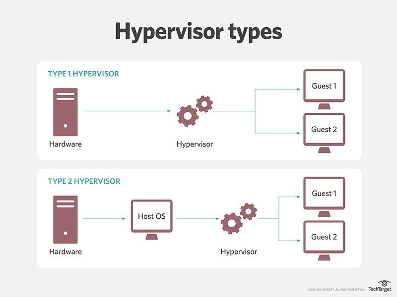
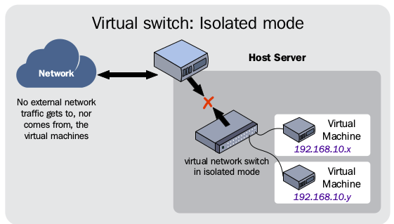
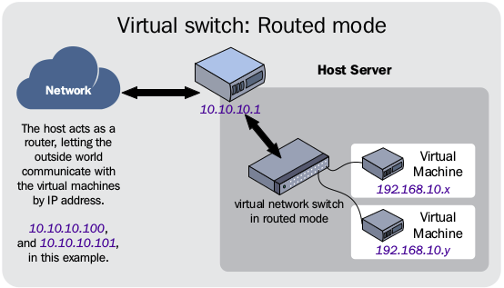
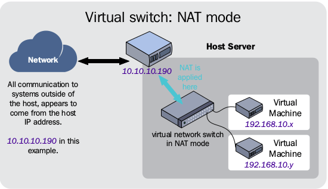

# KVM

- [Hypervisor](#hypervisor)
  - [Type of Hypervisor](#type-of-hypervisor)
- [What is KVM?](#what-is-kvm?)
  - [KVM Feautres](#kvm-feautres)
  - [Install](#install)
- [Libvirt Networking Management](#libvirt-networking-management)
  - [Create libvirt network](#create-libvirt-network)
  - [View libvirt network info](#view-libvirt-network-info)
  - [Edit a libvirt network](#edit-a-libvirt-network)
  - [Delete a libvirt network](#delete-a-libvirt-network)
- [Libvirt Volume Management](#libvirt-volume-management)
- [Libvirt Virtual Machine Management](#libvirt-virtual-machine-management)
  - [Create a new VM](#create-a-new-vm)
  - [Clone a VM](#clone-a-vm)
  - [Network XML format](#network-xml-format)
  - [Create VM with Network](#create-vm-with-network)
- [Type Virtual Networking usin libvirt](#type-virtual-networking-using-libvirt)
- [Example configuration](#example-configuration)
- [References](#references)

### Hypervisor

- Hypervisor hay Virtual Machine Monitor (VMM) chỉ các phần mềm, firmware hoặc phần cứng chuyên dụng dùng để tạo ra các máy ảo.

- Hypervisor là một chức năng trừu tượng tách biệt hệ điều hành với ứng dụng từ phần cứng máy tính. Sự trừu tượng hoá này cho phép phần cứng 
  máy chủ có thể độc lập vận hành một hoặc nhiều máy ảo như khách, cho phép nhiều guest VMs chia sẻ tài nguyên vật lý của hệ thống,như processor cycles, memory space, network bandwidth. Một hypervisor đôi khi gọi như virtual machine monitor.

- Hypervisors cung cấp lợi ích cho trung tâm dữ liệu doanh nghiệp. Đầu tiên khả năng của một hệ thống máy chủ vật lý để chạy nhiều guest VMs có thể cải thiện việc sử dụng phần cứng. Nơi máy chủ vật lý chỉ có thể lưu trữ một hệ điều hành và ứng dụng, một hypervisor ảo hoá máy chủ, cho phép hệ thống lưu trữ nhiều khởi tạo VM, mỗi VM có thể chạy độc lập một hệ điều hành và ứng dụng trên cùng hệ thống vật lý sử dụng nhiều hơn tài nguyên có sẵn của hệ thống.

- VMs có khả năng di dộng. Việc trừu tượng hoá cho diễn ra trong một hypervisor cũng làm cho VM độc lập với phần cứng cơ bản. Ứng dụng truyền thống có thể được kết hợp chặt với phần cứng máy chủ, nghĩa là việc di chuyển ứng dụng tới một máy chủ khác yêu cầu tốn thời gian và dễ bị lỗi trong khi cài đặt lại và cấu hình lại của ứng dụng. Bởi so sánh, một hypervisor làm phần cứng không liên quan tới VMs. Việc này cho phép bất kì VMs nào được di chuyển giữa bất kỳ máy chủ cục bộ hay từ xa nào với đủ tài nguyên máy tính có sẵn hầu hết có hiệu quả không bị gián đoạn tới VM; một tính năng gọi lạ live migration.

- Các VM cũng được phân tách một cách hợp lý với nhau, mặc dù chúng chạy trên cùng một máy vật lý. Thực tế, một VM không tự nhiên biết hay phụ thuộc vào bất kỳ VM nào khác. Một error, crash hay malware attack trên một VM không ảnh hưởng đến các máy ảo còn lại trên cùng một máy hoặc các máy khác. Điều này khiến hypervisor cực kỳ an toàn.

- VMs dễ dàng bảo vệ hơn các ứng dụng truyền thống. Một ứng dụng vật lý nói chung cần được quiesced(temporarily inactive) và sau đó backed up sử dụng tốn thời gian xử lý để giảm thời gian chết đáng kể cho ứng dụng. Một VM cơ bản nhỏ hơn mã hoạt động trong không gian bộ nhớ máy chủ. Công cụ **Snapshot** có thể nhanh chóng chụp ảnh nội dung của bố nhớ VM và lưu nó tới disk trong chốc lát, không bị quiescing ứng dụng. Mỗi snapshot chụp một image point-in-time của máy ảo để có thể nhanh chóng gọi lại để khôi phục VM theo yêu cầu.

#### Type of Hypervisor
- Bare metal
	- deployed trực tiếp trên phần cứng của hệ thống mà không qua bất kỳ hệ điều hành hay phần mềm nào, phổ biến cho enterprise data center.
- Host based
	- run as software layer trên môt hệ điều hành máy chủ được dùng trên các endpoints như PCs.


### What is KVM?
- KVM or Kernel-based Virtual Machine là giải pháp ảo hoá đầy đủ  cho Linux trên phần cứng Intel 64 và AMD 64, nó bên trong Linux kernel từ 
2.6.20 và trở nên ổn định và nhanh cho hầu hết mọi việc.

#### KVM Feautres
- Có nhiều tính năng hữu ích và lịch thế bạn sẽ đạt được khi sử dụng KVM để triển khai nền tảng ảo hoá. KVM hypervisor hỗ trợ các tính năng 
	- Over-committing: cho phép nhiều CPU và bộ nhớ ảo hơn tài nguyên có sẵn trên máy.
	- Thin provisioning: cho phép phân bố lưu trữ linh hoạt và tối ưu hoá không gian có sẵn cho mọi máy ảo khách.
 - Disk I/O throttling: cung cấp khả năng thiết lập giới hạn yêu cầu  disk I/O từ máy ảo tới máy chủ.
 - Automatic NUMA balancing: cải thiện hiệu suất của ứng dụng chạy trên hệ thống phần cứng NUMA.
 - Virtual CPU hot add capability: cung cấp khả năng tăng xử lý như chạy máy ảo không có thời gian chết.

#### Install
- Check CPU có hỗ trợ KVM hay không nếu số cpu trả về lớn hơn 0 là hỗ trợ
```bash 
egrep -c ‘(svm|vmx)’ /proc/cpuinfo
4
```
- Install các package cần thiết
```bash 
sudo apt-get install qume-kvm libvirt-bin bridge-utils virt-manager virtinst
```

### Libvirt Networking Management
#### Create libvirt network
- Liệt kê các mạng có trên host
```bash
root@manhvu-X550LD:~# virsh net-list --all
 Name                 State      Autostart     Persistent
----------------------------------------------------------
 192.168.160.0        inactive   no            yes
 default              active     yes           yes
```
- Tạo file xml để định nghĩa mạng mới cho libvirt file 192.168.10.0.xml
```bash
root@manhvu-X550LD:~/manh# cat 192.168.10.0.xml 
<network>
  <name>192.168.10.0</name>
  <forward mode='nat'/>
  <bridge name='bridge1' stp='on' delay='0'/>
  <domain name='8.8.8.8'/>
  <ip address='192.168.10.1' netmask='255.255.255.0'>
    <dhcp>
      <range start='192.168.10.2' end='192.168.10.254'/>
    </dhcp>
  </ip>
</network>
```
File 192.168.10.0.xml định nghĩa mạng tên 192.168.10.0, địa chỉ 192.168.10.0/24, địa chỉ gateway 192.168.10.1, loại mạng là NAT, địa chỉ DNS là 8.8.8.8, tên của bridge device virbr1, Spanning Tree Protocol on,bridge's forward delay 0.
- Định nghĩa mạng 192.168.10.0 cho libvirt với file input là 192.168.10.0.xml
```bash
root@manhvu-X550LD:~/manh# virsh net-define 192.168.10.0.xml 
Network 192.168.10.0 defined from 192.168.10.0.xml
```
- Mạng 192.168.10.0 đã được tạo và ở trạng thái inactive
```bash
root@manhvu-X550LD:~/manh# virsh net-list --all
 Name                 State      Autostart     Persistent
----------------------------------------------------------
 192.168.10.0         inactive   no            yes
 192.168.160.0        inactive   no            yes
 default              active     yes           yes
```
- Active/start mạng 192.168.10.0 
```bash
root@manhvu-X550LD:~/manh# virsh net-start 192.168.10.0
Network 192.168.10.0 started
```
- Thiết lập autostart 192.168.10.0 mỗi lần khởi động máy 
```bash
root@manhvu-X550LD:~/manh# virsh net-autostart 192.168.10.0
Network 192.168.10.0 marked as autostarted

root@manhvu-X550LD:~/manh# virsh net-list --all
 Name                 State      Autostart     Persistent
----------------------------------------------------------
 192.168.10.0         active     yes           yes
 192.168.160.0        inactive   no            yes
 default              active     yes           yes
```
#### View libvirt network info 
- Xem trạng thái của mạng đã tạo 
```bash
root@manhvu-X550LD:~/manh# virsh net-info 192.168.10.0
Name:           192.168.10.0
UUID:           c8e17ee9-cd3d-4ac6-a089-e38bc82f4e9a
Active:         yes
Persistent:     yes
Autostart:      yes
Bridge:         bridge1
```
- Xem chi tiết các thông số cấu hình mạng
```bash
root@manhvu-X550LD:~/manh# virsh net-dumpxml 192.168.10.0
<network>
  <name>192.168.10.0</name>
  <uuid>c8e17ee9-cd3d-4ac6-a089-e38bc82f4e9a</uuid>
  <forward mode='nat'>
    <nat>
      <port start='1024' end='65535'/>
    </nat>
  </forward>
  <bridge name='bridge1' stp='on' delay='0'/>
  <mac address='52:54:00:64:92:ca'/>
  <domain name='8.8.8.8'/>
  <ip address='192.168.10.1' netmask='255.255.255.0'>
    <dhcp>
      <range start='192.168.10.2' end='192.168.10.254'/>
    </dhcp>
  </ip>
</network>
```
*Bao gồm các thông số đã được cấu hình trong file 192.168.10.0.xml và các thông số khác được gán tự động*

#### Edit a libvirt network
- Thay đổi cấu hình mạng 192.168.10.0
```bash
root@manhvu-X550LD:~/manh# virsh net-edit 192.168.10.0
```
*Màn hình editor hiện ra,tiến hành sửa đổi và lưu lại* 
```nano 
<network>
  <name>192.168.10.0</name>
  <uuid>c8e17ee9-cd3d-4ac6-a089-e38bc82f4e9a</uuid>
  <forward mode='nat'/>
  <bridge name='bridge1' stp='on' delay='0'/>
  <mac address='52:54:00:64:92:ca'/>
  <domain name='8.8.8.8'/>
  <ip address='192.168.10.1' netmask='255.255.255.0'>
    <dhcp>
      <range start='192.168.10.2' end='192.168.10.254'/>
    </dhcp>
  </ip>
</network>
```
- Để thiết lập cấu hình mới cho mạng 192.168.10.0, ngừng hoạt động mạng rồi khởi động lại
```bash
root@manhvu-X550LD:~/manh# virsh net-destroy 192.168.10.0
Network 192.168.10.0 destroyed
```

```bash
root@manhvu-X550LD:~/manh# virsh net-start 192.168.10.0
Network 192.168.10.0 started
```

#### Delete a libvirt network
- Trước khi xoá mạng cần ngừng hoạt động mạng đó
```bash
root@manhvu-X550LD:~/manh# virsh net-destroy 192.168.10.0
Network 192.168.10.0 destroyed
```
- Xoá định nghĩa mạng 
```bash
root@manhvu-X550LD:~/manh# virsh net-undefine 192.168.10.0
Network 192.168.10.0 has been undefined

root@manhvu-X550LD:~/manh# virsh net-list --all
 Name                 State      Autostart     Persistent
----------------------------------------------------------
 192.168.160.0        inactive   no            yes
 default              active     yes           yes

root@manhvu-X550LD:~/manh# virsh net-info 192.168.10.0
error: failed to get network '192.168.10.0'
error: Network not found: no network with matching name '192.168.10.0'

```
### Libvirt Volume Management 
- Kiểm tra các storage pool hiện có trên host 
```bash
root@manhvu-X550LD:~/manh# virsh pool-list
 Name                 State      Autostart 
-------------------------------------------
 default              active     yes       
 Downloads            active     yes   
```
- Kiểm tra các volume có trên một pool 
```bash
root@manhvu-X550LD:~/manh# virsh vol-list default
 Name                 Path                                    
------------------------------------------------------------------------------
```
- Tạo volume mới trên một pool 
```bash
root@manhvu-X550LD:~# virsh vol-create-as default kvm1.qcow2 10G --format qcow2 
Vol kvm1.qcow2 created
```
- Xoá volume trên một pool
```bash
root@manhvu-X550LD:~# virsh vol-delete --pool default kvm.qcow2 
Vol kvm.qcow2 deleted
```
- Clone volume 
```bash
root@manhvu-X550LD:~# virsh vol-clone --pool default kvm1.qcow2 kvm2.qcow2
Vol kvm2.qcow2 cloned from kvm1.qcow2

root@manhvu-X550LD:~# virsh vol-list default
 Name                 Path                                    
------------------------------------------------------------------------------
 kvm1.qcow2           /var/lib/libvirt/images/kvm1.qcow2      
 kvm2.qcow2           /var/lib/libvirt/images/kvm2.qcow2 
```
### Libvirt Virtual Machine Management 
- Kiểm tra các máy ảo trên host
```bash
root@manhvu-X550LD:/var/lib/libvirt/images# virsh list --all
 Id    Name                           State
----------------------------------------------------
```
#### Create a new VM
Kiểm tra thông tin tình trạng host 
```bash
root@manhvu-X550LD:/var/lib/libvirt/images# egrep -c '(vmx|svm)' /proc/cpuinfo
4

root@manhvu-X550LD:/var/lib/libvirt/images# cat /proc/meminfo 
MemTotal:        3920764 kB
MemFree:          332976 kB
MemAvailable:    1174900 kB
Buffers:          189968 kB
Cached:          1181436 kB
SwapCached:          956 kB
Active:          2340788 kB
Inactive:         864400 kB
Active(anon):    1753664 kB
Inactive(anon):   485392 kB
Active(file):     587124 kB
Inactive(file):   379008 kB
Unevictable:         224 kB
Mlocked:             224 kB
SwapTotal:      15623160 kB
SwapFree:       15575288 kB
Dirty:              3620 kB
Writeback:             0 kB
AnonPages:       1833100 kB
Mapped:           508408 kB
Shmem:            405272 kB
Slab:             219940 kB
SReclaimable:     158548 kB
SUnreclaim:        61392 kB
KernelStack:       13648 kB
PageTables:        64548 kB
NFS_Unstable:          0 kB
Bounce:                0 kB
WritebackTmp:          0 kB
CommitLimit:    17583540 kB
Committed_AS:    9341900 kB
VmallocTotal:   34359738367 kB
VmallocUsed:           0 kB
VmallocChunk:          0 kB
HardwareCorrupted:     0 kB
AnonHugePages:         0 kB
ShmemHugePages:        0 kB
ShmemPmdMapped:        0 kB
CmaTotal:              0 kB
CmaFree:               0 kB
HugePages_Total:       0
HugePages_Free:        0
HugePages_Rsvd:        0
HugePages_Surp:        0
Hugepagesize:       2048 kB
DirectMap4k:      263980 kB
DirectMap2M:     3811328 kB
DirectMap1G:           0 kB

root@manhvu-X550LD:/var/lib/libvirt/images# virsh nodeinfo
CPU model:           x86_64
CPU(s):              4
CPU frequency:       1727 MHz
CPU socket(s):       1
Core(s) per socket:  2
Thread(s) per core:  2
NUMA cell(s):        1
Memory size:         3920764 KiB

root@manhvu-X550LD:/var/lib/libvirt/images# virsh net-list --all
 Name                 State      Autostart     Persistent
----------------------------------------------------------
 192.168.160.0        inactive   no            yes
 default              active     yes           yes

root@manhvu-X550LD:/var/lib/libvirt/images# virsh vol-list default 
 Name                 Path                                    
------------------------------------------------------------------------------
 kvm1.qcow2           /var/lib/libvirt/images/kvm1.qcow2      
 kvm2.qcow2           /var/lib/libvirt/images/kvm2.qcow2      
```
- Các tuỳ chọn thiết lập bắt buộc  VM 
	- --name(-n): tên của VM, là duy nhất trong tất cả các máy ảo hiện có trên host
	- --memory: dung lượng memory cho VM đơn vị MiB
	- --disk: chỉ định media sử dụng để lưu trữ cho VM với nhiều tuỳ chọn (có thể thay bởi --filesystem chỉ định một thư mục trên máy chủ)
	- một trong những tuỳ chọn cài đặt
		- --cdrom(-c): file hay device sử dụng như một virtual CD-ROM device: ISO image hoặc CDROM device
		- --location(-l): virt-install sẽ tải kernel/initrd tới máy local để cài đặt
		- --pxe: sử dụng giao thức PXE để nạp ramdisk và kernel để bắt đầu quá trình cài đăt
		- --import: bỏ qua quá trình cài đặt OS, tạo VM dựa trên disk image có sẵn ở tuỳ chọn --disk
Để tạo VM trước hết cần tạo volume 
- Để tạo máy ảo cần tạo một volume 
```bash
root@manhvu-X550LD:~# virsh vol-create-as default controller 10G --format qcow2
Vol controller created
```
- Tạo máy ảo 
```bash
root@manhvu-X550LD:~# virt-install -n controller --ram 2048 --disk path=/var/lib/libvirt/images/controller --cdrom=/var/lib/libvirt/boot/ubuntu-16.04.4-server-amd64.iso 

Starting install...
Domain installation still in progress. You can reconnect to 
the console to complete the installation process.
```
- Kiểm tra thông tin cấu hình của máy ảo
```bash
root@manhvu-X550LD:~# virsh dumpxml controller
```
- Mở cửa sổ hoạt động của VM
```bash
root@manhvu-X550LD:~# virt-viewer controller
```
#### Clone a VM 
Có ba cách thường dùng để clone một VM
- Cách 1:Clone volume của VM có sẵn sau đó tạo máy ảo mới trên volume được clone, thay option cdrom bằng ```--boot=hd``` set boot device first hard disk
```bash
root@manhvu-X550LD:~# virsh vol-clone --pool default kvm clone
Vol clone cloned from kvm

root@manhvu-X550LD:~# sudo virt-install --name VM_NAME --ram 1024 --disk path=/var/lib/libvirt/images/clone --boot hd 
```
- Cách 2: Clone một VM với virt-clone
```bash
root@manhvu-X550LD:~# virt-clone \
> --original VM_NAME \
> --name VM_NEW_NAME \
> --file DIR_IMAGE 
```
- Cách 3: Tạo VM với tên,vol được tạo tự động 
```bash
root@manhvu-X550LD:~# virt-clone \
> --original VM_NAME \
> --auto-clone 
```
#### Network XML format
File xml được tạo để định nghĩa mạng với ```virsh net-define file.xml```. Các element và attribute được chia làm ba nhóm
**General metadata**
```bash
<network ipv6='yes' trustGuestRxFilters='no'>
  <name>default</name>
  <uuid>3e3fce45-4f53-4fa7-bb32-11f34168b82b</uuid>
  <metadata>
    <app1:foo xmlns:app1="http://app1.org/app1/">..</app1:foo>
    <app2:bar xmlns:app2="http://app1.org/app2/">..</app2:bar>
  </metadata>
  ...
```
- name: tên của virtual network
- uuid: định danh của virtual network
- ipv6: set yes, cho phép enable ipv6 cho mạng 
- trustGuestFilters: set name cho mỗi domain interface khi connected tới mạng
**Connectivity**
```bash
...
<bridge name="virbr0" stp="on" delay="5" macTableManager="libvirt"/>
<mtu size="9000"/>
<domain name="example.com" localOnly="no"/>
<forward mode="nat" dev="eth0"/>
...
```
- bridge: birdge device, VMs sẽ kết nối tới bridge để giao tiếp với nhau, bridge cũng kết nối với LAN, danh sách các thuộc tính
	- name: tên của bridge được sử dụng khởi tạo virtual network
	- stp: set on để sử dụng giao thức Spanning Tree Protocol trong mạng
	- delay: thời gian trễ chuyển tiếp trên bridge theo giây, default=0 
	- macTableManager: thuộc tính cho biết cách quản lý  bảng MAC Address Table, mặc định cài đặt kernel;nếu được set libvirt libvirt sẽ quản lý và cải thiện hiệu suất
- mtu: với attribute size- kích thước lớn nhất gói tin, mặc định thường là 1500
- domain: DNS domain của DHCP server
	- name: tên domain được định nghĩa 
	- localOnly: default set "no", DNS unresolved được chuyển tiếp; set "yes",DNS request chỉ giải quyết bởi DNS server của virtual network
- forward: cách thức chuyển tiếp gói tin trong mạng
	- mode 
		- nat: tất cả máy khách kết nối tới mạng này và mạng vật lý sẽ được forward tới mạng vật lý, sau đó địa chỉ IP của máy khách được dịch như địa chỉ public IP theo cơ chết NAT, cho phép nhiều máy khách có thể truy cập mạng. Sử dụng địa chỉ IPv4 có thể cấu hình dải địa chỉ,dải port qua thẻ address, port
		```bash
		...
		  <forward mode='nat'>
		    <nat>
		      <address start='1.2.3.4' end='1.2.3.10'/>
		    </nat>
		  </forward>
		...
		```
		- route: các gói tin qua VM sẽ được chuyển tiếp tới mạng vật lý qua địa chỉ IP được chỉ định thông qua bảng định, tất cả phiên đến và đi không bị hạn chế.
		- open: tương tự routed nhưng không thể giới hạn bởi firewall
		- bridge: chỉ định host bridge đã được cấu hình bởi libvirt 
	- dev: firewall rule sẽ hạn chế chuyển tiếp tới các network device được set
	- <forward> element có thể chứa nhiều phần tử con <interface> mô tả tên interface vật lý được sử dụng
	```bash
	...
	  <forward mode='passthrough'>
	    <interface dev='eth10'/>
	    <interface dev='eth11'/>
	    <interface dev='eth12'/>
	    <interface dev='eth13'/>
	    <interface dev='eth14'/>
	  </forward>
	...
	```
**Addressing**
Định nghĩa địa chỉ(IPv4 or IPv6, MAC) chỉ định cho bridge device liên kết với virtual network, enable DHCP. Chỉ áp dụng cho mạng riêng (không có element forward được chỉ định) và với forward chế độ "route" hoặc "nat".
```bash
...
<mac address='00:16:3E:5D:C7:9E'/>
<domain name="example.com"/>
<dns>
  <txt name="example" value="example value"/>
  <forwarder addr="8.8.8.8"/>
  <forwarder domain='example.com' addr="8.8.4.4"/>
  <forwarder domain='www.example.com'/>
  <srv service='name' protocol='tcp' domain='test-domain-name' target='.'
    port='1024' priority='10' weight='10'/>
  <host ip='192.168.122.2'>
    <hostname>myhost</hostname>
    <hostname>myhostalias</hostname>
  </host>
</dns>
<ip address="192.168.122.1" netmask="255.255.255.0" localPtr="yes">
  <dhcp>
    <range start="192.168.122.100" end="192.168.122.254"/>
    <host mac="00:16:3e:77:e2:ed" name="foo.example.com" ip="192.168.122.10"/>
    <host mac="00:16:3e:3e:a9:1a" name="bar.example.com" ip="192.168.122.11"/>
  </dhcp>
</ip>
<ip family="ipv6" address="2001:db8:ca2:2::1" prefix="64" localPtr="yes"/>
<route family="ipv6" address="2001:db9:ca1:1::" prefix="64" gateway="2001:db8:ca2:2::2"/>
```
- mac: với thuộc tính address chỉ định địa chỉ MAC của bridge device, được tự động gán bởi libvirt hoặc thiết lập ở file cài đặt
- dns: chứa thông tin cấu hình của DNS server với các subelement 
	- forwarder: (0 or more) chỉ định DNS server thay thế, DNS request gửi tới mạng DNS server; <forwarder> chứa cả 2 thuộc tính ```addr``` và ```domain``` thì các request phù hợp sẽ sử dụng địa chỉ DNS server này; nếu chỉ có ```domain``` thì các domain phù hợp được giải quyết local 
	- txt: (0 or more) định nghĩa DNS TXT với 2 thuộc tính: name có thể được truy vấn qua dns và một value được trả về khi truy vấn 
	- host: địa chỉ IP được chỉ định bởi thuộc tính ```ip``` cho các host trong sub-ele ```hostname```
- ip: chỉ định địa chỉ IPv4 hoặc IPv6 được cấu hình trên bridge device kết hợp với virtual network, với địa chỉ IPv4 có các attr ```netmask``` hay ```prefix```. Attr ```localPtr``` cấu hình DNS server có hay không chuyển tiếp DNS request với địa chỉ IP trong mạng; chứa thẻ ```dhcp``` với các sub-element
	- range: chỉ định dải địa chỉ cung cấp DHCP client với attr ```start``` và ```end```
	- host: chỉ định các host được định IP và tên trước bởi máy chủ DHCP
#### Create VM with Network 
- Tạo network với ```virsh net-define```
- Thêm card mạng 
	- thiết lập tuỳ chọn ```--network=..``` khi chạy ```virt-install```
	- chỉnh sửa cấu hình VM với ```virsh edit VM_NAME``` nên sao lưu file XML với ```virsh dumpxml VM_NAME```, chỉnh sửa mạng ở thẻ ```<interface```

#### Type Virtual Networking using libvirt
Có 3 loại thường gặp Isolated virtual network, Routed virtual network, NATed virtual network
- Isolated mode: tạo network cho VM tách biệt với các mạng khác, chỉ các máy ảo được thêm trong mạng có thể giao tiép với nhau.

- Routed mode: virtual network kết nối với mạng vật lý sử  dụng địa chỉ IP được chỉ định bởi hypervisor,các VM nằm trong 1 subnet được định tuyến bởi switch, máy chủ không hề biết subnet này nên  cần set up đúng địa chỉ IP route cho router và gateway để VM có thể giao tiếp với host, hoạt động trên layer 3 mô hình OSI.

- NATed mode: chế độ mặc định cho virtual network switches, sử dụng IP ảo,cho phép VM giao tiếp với mạng bên ngoài mà không cần thêm cấu hình nào cũng cho phép giao tiếp giữa hypervisor và các VM nhưng các mạng bên ngoài không tiếp cận được, sử dụng *iptables* 

####Example configuration
- NAT mode network
```bash
<network>
  <name>default</name>
  <bridge name="virbr0"/>
  <forward mode="nat"/>
  <ip address="192.168.122.1" netmask="255.255.255.0">
    <dhcp>
      <range start="192.168.122.2" end="192.168.122.254"/>
    </dhcp>
  </ip>
  <ip family="ipv6" address="2001:db8:ca2:2::1" prefix="64"/>
</network>
```
- Routed network
*Virtual network chuyển tiếp tới LAN thông qua địa chỉ IP đã cấu hình trong bảng định tuyến. Có thể chỉ định để hạn chế  thiết bị mạng cho phép*```bash
<network>
  <name>local</name>
  <bridge name="virbr1"/>
  <forward mode="route" dev="eth1"/>
  <ip address="192.168.122.1" netmask="255.255.255.0">
    <dhcp>
      <range start="192.168.122.2" end="192.168.122.254"/>
    </dhcp>
  </ip>
  <ip family="ipv6" address="2001:db8:ca2:2::1" prefix="64"/>
</network>
```
- Isolated network
*Tạo private network cho các VM, các VM chỉ giao tiếp với nhau, không khai báo <forward>*
​```bash
<network>
  <name>private</name>
  <bridge name="virbr2"/>
  <ip address="192.168.152.1" netmask="255.255.255.0">
    <dhcp>
      <range start="192.168.152.2" end="192.168.152.254"/>
    </dhcp>
  </ip>
  <ip family="ipv6" address="2001:db8:ca2:3::1" prefix="64"/>
</network>
```
- Bridge network
*VM giao tiếp trực tiếp với LAN qua bridge*
```bash
<network>
  <name>host-bridge</name>
  <forward mode="bridge"/>
  <bridge name="br0"/>
</network>
```

### References

https://manpages.debian.org/testing/virtinst/virt-install.1.en.html#INSTALLATION_OPTIONS
https://www.cyberciti.biz/faq/how-to-clone-existing-kvm-virtual-machine-images-on-linux/
https://libvirt.org/formatnetwork.html
https://wiki.libvirt.org/page/VirtualNetworking#Other_virtual_network_switch_routing_types
