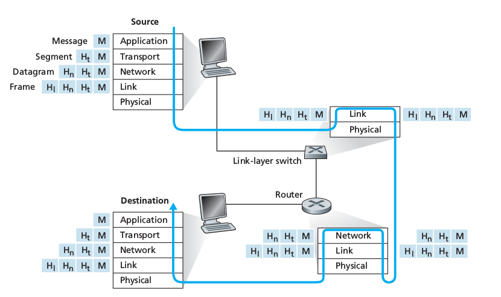
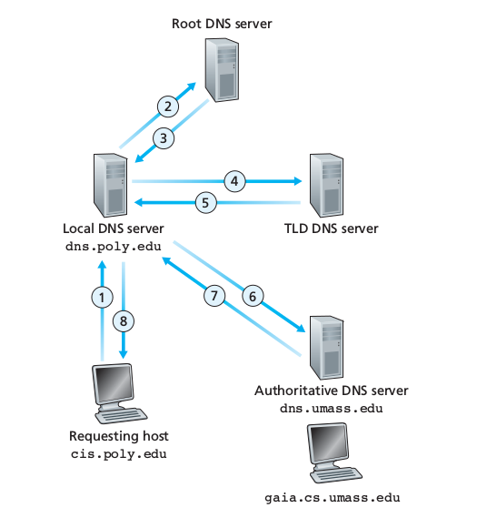
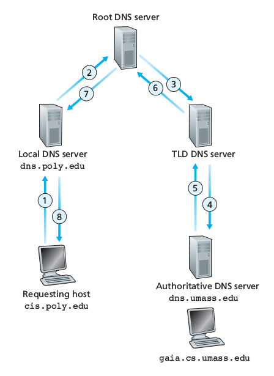
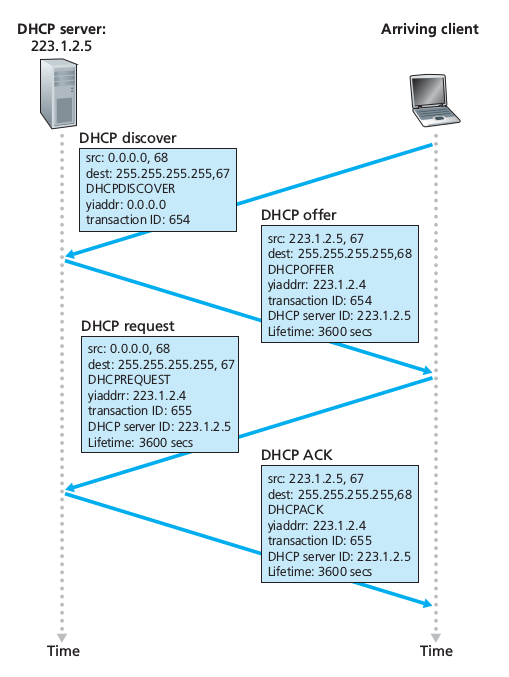
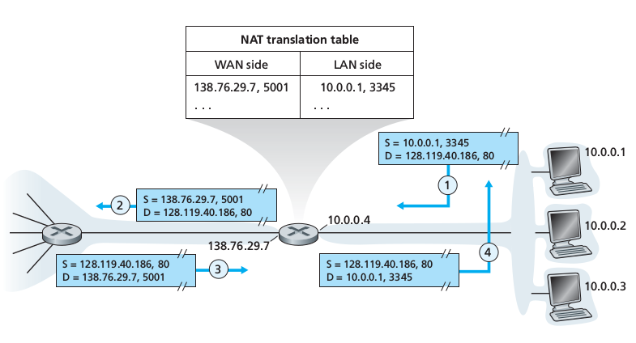
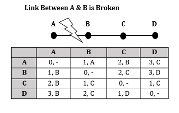
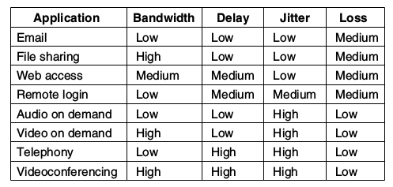
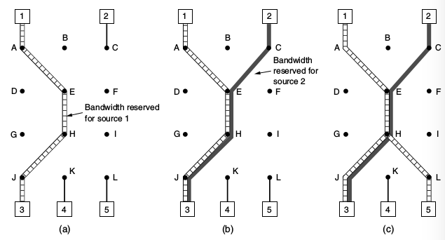
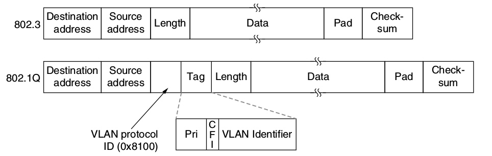
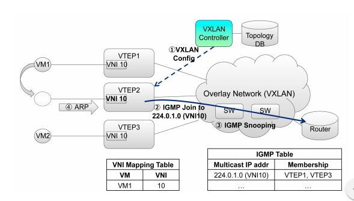

topdown - 4.3. what is in side a router?

# ÔN TẬP MẠNG MÁY TÍNH

## Table of Contents

1. [Network Terminologies](#network-terminologies) 
    1.  [Network Topologies](#network-topologies)
    1.  [Network Devices](#network-devices)
        1.  [Network Interface Controller (NIC)](#network-interface-controller-nic)
        1.  [Repeaters and Hubss](#repeaters-and-hubs)
        1.  [Bridges](#bridges)
        1.  [Switches](#switches)
        1.  [Routers](#routers)
    1.  [Gateways](#gateways)
    1.  [Firewalls](#firewalls)
    1.  [Proxies](#proxies)
    1.  [OSI model and TCP/IP model](#osi-model-and-tcpip-model)
1.  [Application Layer](#application-layer)
    1.  [Domain Name System (DNS)](#domain-name-system-dns)
1.  [Transport Layer](#transport-layer)
1.  [Internet Layer](#internet-layer)
    1.  [Internet Protocol (IP)](#internet-protocol-ip)
        1.  [IPv4 Address](#ipv4-address)
        1.  [Dynamic Host Configuration Protocol (DHCP)](#dynamic-host-configuration-protocol-dhcp)
        1.  [Network Address Translation Protocol (NAT)](#network-address-translation-protocol-nat)
    1.  [Internet Control Mesage Protocol (ICMP)](#internet-control-mesage-protocol-icmp)
    1.  [Routing Protocols](#routing-protocols)
        1.  [Shortest Path Finding Algorithms](#shortest-path-finding-algorithms)
        1.  [Intra AS Routing](#intra-as-routing)
        1.  [Inter AS Routing](#inter-as-routing)
    1.  [Forwarding](#forwarding)
    1.  [Quality of Service (QoS)](#quality-of-service-qos)
1.  [Data link layer](#data-link-layer)
    1.  [MAC Address](#mac-address)
        1.  [Address Resolution Protocol (ARP)](#address-resolution-protocol-arp)
    1.  [Error Detection](#error-detection)
        1.  [Parity Bit](#parity-bit)
        1.  [Checksum](#checksum)
        1.  [CRC Code](#crc-code)
        1.  [Hash Functions](#hash-functions)
    1.  [Multiple Access with Collision Avoidance (MACA)](#multiple-access-with-collision-avoidance-maca)
        1.  [Channel Partioning Protocols](#channel-partioning-protocols)
        1.  [Random Access Protocols](#random-access-protocols)
        1.  [Token Based Protocols](#token-based-protocols)
    1.  [LAN Switched Network Design](#lan-switched-network-design)
        1.  [LAN Segments](#lan-segments)
        1.  [Switched Network Components](#switched-network-components)
        1.  [Flat Network Topology](#flat-network-topology)
        1.  [Hierarchical Network Topology](#hierarchical-network-topology)
    1.  [Overlay Network](#overlay-network)
        1.  [Virtual Local Area Network (VLAN)](#virtual-local-area-network-vlan)
        1.  [Virtual eXtensible LAN (VXLAN)](#virtual-extensible-lan-vxlan)
        1.  [Generic Routing Encapsulation (GRE)](#generic-routing-encapsulation-gre)
1.  [Physical layer](#physical-layer)
1.  [References](#references)
## Network Terminologies

### Network Topologies

Hai khái niệm cơ bản nhất của topo mạng là topo vật lý và topo logic. Bố cục các thiết bị và cáp mạng vật lý nối giữa chúng hình thành một topo vật lý của mạng. Ngược lại, topo logic là cách mà dữ liệu truyền từ một thiết bị trong mạng tới thiết bị khác mà không quan tâm đến cách thức kết nối cứng giữa chúng. Hai dạng topo này có thể khác nhau tùy vào cách thức cài đặt và sử dụng.

Topo mạng có thể được phân thành một trong các dạng sau:

*   Kết nối điểm - điểm: Là dạng thức kết nối mà hai nút tham gia có kết nối đơn nhất và trực tiếp với nhau
*   Bus: Mỗi nút mạng đều kết nối với một đường cáp duy nhất, gọi là xương sống của mạng hay bus. Dữ liệu từ nút này qua nút khác đều được vận chuyển qua bus theo cả hai chiều. Dạng topo này dễ triển khai nhưng khó quản lý và hình thành điểm nút thắt cổ chai trên bus.
*   Star: Trong một mạng có topo hình sao, tất cả các nút đều được kết nối với một nút trung tâm duy nhất bằng kết nối điểm - điểm. Nút trung tâm này có thể là một hub, router hoặc switch và đóng vai trò như một trạm chuyển phát các gói tin trên toàn bộ mạng. Đây là dạng topo dễ nhất để cài đặt tuy nhiên giống như bus, nó hình thành một nút thắt cổ chai tại nút trung tâm.
*   Ring: Topo vòng là topo bus có hai đầu trùng nhau tạo thành một vòng khép kín
*   Fully-connected: Topo kết nối đầy đủ có hai nút mạng bất kỳ đều được kết nối với nhau bằng một kết nối điểm - điểm
*   Hybrid: Kết hợp các dạng topo trên

### Network Devices

#### Network Interface Controller (NIC)

Một card giao tiếp mạng (Network Interface Controller) là một thiết bị phần cứng giúp máy tính có khả năng truy cập quá trình truyền dữ liệu đa phương tiện và cung cấp khả năng xử lý thông tin ở mức thấp.

#### Repeaters and Hubs

Bộ chuyển tiếp (repeater) là một thiết bị điện tử có vai trò nhận tín hiệu mạng, làm sạch khỏi nhiễu và gửi lại tín hiệu đi (có thể đi kèm với khuếch đại năng lượng). Repeater là thiết bị của tầng vật lý trong mô hình OSI, nó cần một khoảng thời gian nhỏ để xử lý và truyền lại tín hiệu, bởi vậy số lượng repeater bị giới hạn trong hiều kiến trúc mạng.

Một repeater có nhiều cổng giao tiếp được gọi là hub. Hub và repeater trong mạng LAN hiện nay đã hầu như bị thay thế bởi switch.

#### Bridges

Bridge là thiết bị có chức năng kết nối và lọc dữ liệu truyền giữa hai phân mạng tại tầng liên kết dữ liệu để tạo thành một mạng duy nhất. Việc sử dụng bridge chia nhỏ miền đụng độ (collision domain - phân mạng chia sẻ chung thiết bị truyền dẫn hoặc repeater, nơi mà nguy cơ đụng độ có thể nảy sinh) tuy nhiên vẫn duy trì miền quảng bá (broadcast domain - một phân vùng logic của một mạng mà các nút có thể giao tiếp với nhau bằng một thông điệp quảng bá trên tầng liên kết dữ liệu) trong mạng.

Khi xây dựng kiến trúc mạng, có thể chia mạng thành các phân mảnh nhỏ và kết nối chúng bằng bridge tạo thành một cấu trúc phân cấp thuận tiện cho việc quản lý.

#### Switches

Switch là thiết bị lọc và chuyển tiếp các frame tin trên tầng liên kết dữ liệu giữa các cổng dựa trên địa chỉ MAC. Switch có thể được hiểu như là một bridge có nhiều cổng. 

Để chuyển tiếp dữ liệu ra cổng phù hợp dựa vào địa chỉ MAC, switch cần có cơ chế tự học như sau:
*   Khi switch nhận frame tin từ một địa chỉ MAC X đến cổng Y, nó sẽ lưu lại thông tin này để chuyển tin qua cổng Y nếu gói tin có địa chỉ MAC đích là X
*   Nếu nó không biết địa chỉ đích của frame tin cần chuyển tới, nó quảng bá khung tin qua tất cả các cổng, trừ cổng nhận khung tin

Cơ chế tự học như trên có điểm yếu ở chỗ switch sẽ phải broadcast một gói tin một cách không mong muốn. Tin tặc có thể lợi dụng điều này và thực hiện tấn công đầu độc switch bằng cách gửi hàng loạt gói tin với địa chỉ MAC nguồn giả, khiến switch phải lưu trữ toàn bộ các địa chỉ này mà không còn chỗ cho các gói tin bình thường khác. Lúc này, do switch không thể học được địa chỉ nguồn của hầu hết các giao dịch thông thường do quá tải, nó phải broadcast tất cả các khung tin và khiến cho tin tặc có thể nghe lén được toàn bộ giao dịch trong mạng.

#### Routers

Router (hay bộ định tuyến) là thiết bị thực thi các thao tác tính toán định tuyến và chuyển tiếp gói tin một cách phù hợp trên tầng mạng của chồng giao thứ OSI. Cách thức thực hiện các thao tác này được đề cập cụ thể trong nội dung phần Tầng Mạng của tài liệu này.

Có một điểm đặc biệt là routers không chuyển tiếp gói tin có địa chỉ đích là địa chỉ quảng bá "tuyệt đối" (255.255.255.255) và không mặc định chuyển tiếp các gói tin quảng bá của mạng (các gói tin có phần host ID gồm toàn bit 1). Điều này khiến router còn được gọi là biên của miền quảng bá. 

*Router v.s. Switch:*

*   Điểm khác biệt cơ bản nhất giữa router và switch đó là router chuyển tiếp dựa trên địa chỉ IP và cổng ứng dụng, trong khi switch sử dụng địa chỉ MAC
*   Ưu điểm của switch là nó được cài đặt gần với phần cứng hơn, các thao tác đóng gói và giải mã dữ liệu được thực hiện đơn giản và ít tốn thời gian hơn. Tuy nhiên, các cơ chế can thiệp vào quá trình truyền dữ liệu của switch bị hạn chế, ví dụ như nếu muốn hạn chế các thông điệp quảng bá đi lòng vòng trong mạng, mạng sử dụng switch phải có topology kiểu cây khung. Thêm vào đó, nếu như một host trong mạng bị hack chẳng hạn và gửi một số lượng lớn các gói tin quảng bá, các switches sẽ chuyển tiếp tất cả chúng và khiến mạng bị sụp đổ.
*   Xét đến ưu nhược điểm của router, bởi vì địa chỉ IP được tổ chức theo cấu trúc phân cấp nên ngay cả khi mạng có chứa chu trình, gói tin thường không đi lòng vòng giữa các routers, thậm chí ngay cả điều này xảy ra, gói tin IP cũng có những trường tiêu đề đặc biệt để hạn chế nó. Bên cạnh đó, giao thức IP còn hỗ trợ cơ chế tường lửa nhằm ngăn chặn hiện tượng bão quảng bá có thể xảy ra tại tầng dưới. Nhược điểm lớn nhất của router đó là thao tác cấu hình tốn kém thời gian, bởi các routers và hosts cần địa chỉ của nhau để cấu hình chứ không có cơ chế tự học như switch.

### Gateways

Gateway là một ứng dụng thường được cài đặt trên các router biên của mạng, đóng vai trò như là một trình chuyển đổi giao thức, giúp các nút mạng ở hai mạng sử dụng các giao thức khác nhau có thể liên lạc được với nhau.

### Firewalls

Tường lửa (firewall) là một sự kết hợp giữa phần cứng và phần mềm giúp cô lập hệ thống mạng nội bộ của một tổ chức với môi trường Internet bên ngoài. Tường lửa giúp cho nhà quản trị mạng quản lý truy cập giữa môi trường bên ngoài tới tài nguyên của mạng bằng cách kiểm soát giao dịch với các tài nguyên này.

Việc xây dựng tường lửa phải đạt được ba mục tiêu:

*   Tất cả các giao dịch từ bên ngoài và bên trong mạng và ngược lại phải đi qua tường lửa.
*   Chỉ các giao dịch được kiểm chứng bởi các quy chế nội bộ mới được phép đi qua tường lửa
*   Bản thân tường lửa là không thể bị xâm nhập hay thỏa hiệp từ bên ngoài

Tường lửa có thể thuộc một trong ba loại:

*   Traditional packet filters: Tại một gateway router kết nối giữa mạng nội bộ của tổ chức và nhà mạng có thể được cài đặt một bộ lọc gói tin. Thông tin ra vào mạng con đều được gửi qua router này và được quyết định là có cho phép truyền qua hay không dựa trên các điều luật quản trị cụ thể của mạng.
*   Stateful filters: Theo cơ chế này, firewall sẽ theo dõi tất cả các kết nối TCP với bên ngoài của mạng, sau đó, nó sẽ chỉ cho phép các gói tin từ một địa chỉ đang kết nối với các host trong mạng hoặc đã được cấp phép gửi dữ liệu vào trong mạng, từ chối tất cả các kết nối đáng ngờ từ bên ngoài vào.
*   Application gateways: Một gateway ứng dụng là một server đặc trưng của ứng dụng mà tất cả các dữ liệu của ứng dụng đều phải truyền qua. Firewall kết hợp packet filter với application gateway để kiểm soát dữ liệu vào ra mạng ở mức ứng dụng.

### Proxies

Proxy là một máy chủ đảm nhiệm vai trò chuyển tiếp dữ liệu từ client đến application server dưới danh nghĩa của client.

Proxy giúp đảm bảo một kết nối hoàn toàn riêng tư với các mục tiêu:

*   Không để lộ địa chỉ IP của người dùng cho website mà người dùng truy cập
*   Không cho nhà mạng phát hiện ra người dùng đang truy cập website này
*   Không để cho nhà mạng đọc được dữ liệu người dùng trao đổi với website

Ba mục tiêu này được thực hiện bằng cách:

*   Đầu tiên, client thiết lập một kết nối SSL tới proxy server.
*   Client gửi yêu cầu truy cập trang web đã được mã hóa, bởi vậy, nhà mạng sẽ không đọc được bất kỳ dữ liệu nào được trao đổi giữa người dùng và proxy server
*   Proxy server giải mã thông điệp yêu cầu client và chuyển thông điệp tới web server tương ứng.
*   Dữ liệu mà web server trả về cho proxy được mã hóa trước khi gửi lại cho client

Tuy vậy, tất cả các thông tin mà người dùng muốn che đậy trước nhà mạng và web server đều bị để lộ cho proxy server. Do vậy nên người dùng cũng cần phải chọn cho mình một proxy server uy tín, hoặc thận trọng hơn, có thể dùng nhiều proxy server trung gian kết nối tới web server (cơ chế TOR).

### OSI Model and TCP/IP Model

Chồng giao thức OSI bao gồm 7 tầng với các chức năng như sau

*   Tầng Ứng Dụng: Cung cấp các ứng dụng đầu cuối tương tác với người dùng (web, mail, truyền file, ...)
*   Tầng Trình Diễn: Biểu diễn dữ liệu ứng dụng (mã hóa, nén, chuyển đổi, ...)
*   Tầng Phiên: Quản lý phiên làm việc của ứng dụng, đồng bộ hóa phiên, khôi phục quá trình trao đổi dữ liệu, ...
*   Tầng Giao Vận: Xử lý việc truyền và nhận dữ liệu ứng dụng
*   Tầng Mạng: Định tuyến và chuyển tiếp gói tin
*   Tầng Liên Kết Dữ Liệu: Truyền dữ liệu trên liên kết vật lý giữa các nút mạng kề nhau
*   Tầng Vật Lý: Điều chế và truyền tín hiệu

 Hình 1.6.1: Mô hình chồng giao thức OSI 

Trong mô hình TCP/IP ba tầng trên cùng của OSI được gộp thành một tầng ứng dụng duy nhất.

Mô hình kiến trúc phân tầng có những đặc điểm:

*   Mỗi giao thức mạng thuộc một trong các tầng trong mô hình OSI
*   Các giao thức ở tầng trên thì sử dụng dịch vụ từ một trong số các giao thức ở tầng dưới
*   Các giao thức của một tầng đảm nhận các chức năng riêng biệt, độc lập và trong suốt với các hoạt động ở các tầng khác
*   Hai ứng dụng đầu cuối giao tiếp với nhau qua cùng một giao thức một cách trực tiếp thông qua một liên kết ảo giữa chúng, không quan tâm đến quá trình điều khiển và truyền dữ liệu ở phía dưới diễn ra thế nào

Để vận chuyển dữ liệu từ một ứng dụng trên máy này đến một ứng dụng trên máy khác, dữ liệu phải thông qua quá trình đóng gói và vận chuyển như sau:

 Hình 1.6.2: Quá trình đóng gói và vận chuyển dữ liệu 

Ở phía gửi, mỗi khi dữ liệu được chuyển tới tầng dưới, giao thức tầng phía trên sẽ thêm tiêu đề của mình vào gói tin. Ở phía nhận, mỗi khi gói tin được chuyển đến tầng trên, giao thức tầng dưới sẽ bóc tách lớp tiêu đề bên ngoài để xem giao thức tầng trên nó cần gửi đến là gì. Bằng cách này, nội dung giao tiếp giữa cùng một giao thức trên hai địa chỉ đầu cuối sẽ đến đích như mong muốn.

Quá trình đóng và mở gói cũng diễn ra trên các thiết bị trung gian, có điều các thiết bị này có thể chỉ hoạt động ở tầng hai hoặc tầng ba trong mô hình OSI nên các thao tác này cũng chỉ diễn ra đến tầng hai hoặc tầng ba.

Dưới đây xin đề cập đến những vấn đề cơ bản và quan trọng nhất của từng tầng theo mô hình TCP/IP.

## Application Layer

Tầng ứng dụng là không gian hoạt động của các ứng dụng đầu cuối như HTTP, DNS, SMTP, FTP, ...

### Domain Name System (DNS)

Tên miền là định danh của các nút mạng ở góc nhìn ứng dụng, sử dụng một quy tắc đặt tên có cấu trúc và dễ dàng ghi nhớ bởi người dùng. Tuy nhiên, hệ thống mạng lại làm việc chủ yếu với địa chỉ mạng IP, bởi vậy cần có cơ chế dịch từ tên miền sang địa chỉ IP tương ứng và ngược lại. Hệ thống đảm nhiệm vai trò này là hệ thống phân giải tên miền, hay DNS.

Những quy tắc bắt buộc đối với tên miền:

*   Độ dài tối đa là 255 ký tự
*   Bắt đầu bằng số hoặc chữ, chỉ chứa số, chữ và các dấu gạch ngang (-), dấu chấm (.)

Cấu trúc tổ chức hệ thống tên miền:

*   Hệ thống tên miền được tổ chức theo kiến trúc hình cây, bao gồm các máy chủ tên miền được phân thành các mức:
    *   Root DNS Servers: Gồm 13 cụm server gốc quản lý dịch vụ lõi của DNS
    *   Top-level DNS Servers: Quản lý tên miền cấp cao nhất như com, org, net, edu, gov và các tên miền quốc gia
    *   Authorative DNS Servers: Các tổ chức cung cấp các dịch vụ truy cập công cộng (như web và mail servers) sở hữu và quản lý các bản ghi DNS công khai và thuê các máy chủ được ủy quyền để lưu trữ thông tin này. Tuy nhiên các tổ chức lớn cũng có thể tự duy trì một authorative DNS server và các máy chủ backup cho mình
    *   Local DNS Servers: Không thuộc cấu trúc cây phân cấp của DNS mà thuộc quyền quản lý của nhà mạng. Nhà mạng có thể sử dụng các bản ghi DNS nội bộ của mình để trả lời cho các yêu cầu truy cập của người dùng.

Quá trình phân giải tên miền

*   Phân giải tuần tự: Client lần lượt hỏi các DNS server từ mức root trở xuống để yêu cầu phân giải một tên miền. Mỗi DNS server trả về thông tin về DNS server ở mức thấp hơn quản lý tên miền này và client lại tiếp tục hỏi DNS server phù hợp

 Hình 2.1.1: DNS phân giải tuần tự 

Ví dụ: Nếu truy vấn đến địa chỉ soict.edu.vn, root server sẽ gửi lại thông tin địa chỉ của DNS server dns.vn, dns.vn gửi lại thông tin về dns.edu.vn, dns.edu.vn lại gửi thông tin về dns.soict.edu.vn

*   Phân giải đệ quy: Client chỉ hỏi một lần tới DNS server gốc, DNS server gốc sẽ yêu cầu các DNS server mức dưới phân giải tên miền này một cách đệ quy và trả lại kết quả cho client.

 Hình 2.1.2: DNS phân giải đệ quy 

## Transport Layer

Hai giao thức phổ biến nhất trong vận chuyển dữ liệu ứng dụng ở tâng giao vận là UDP và TCP. Dưới đây là bảng so sánh hai giao thức:

--  |  TCP  |  UDP
--  |  --  |  --
Tên đầy đủ  |  Transmission Control Protocol  |  Universal Datagram Protocol
Kết nối  |  TCP là giao thức hướng kết nối (phiên kết nối được hình thành trước khi dữ liệu được chuyển đi và thứ tự gói tin gửi và nhận được bảo toàn)  |  UDP là giao thức hướng không kết nối
Trường hợp sử dụng  |  TCP phù hợp với các ứng dụng đòi hỏi tín tin cậy cao, thời gian truyền dữ liệu không phải vấn đề lớn  |  UDP phù hợp với các ứng dụng đòi hỏi cần truyền dữ liệu nhanh (gaming, livestream, ...) hoặc các server thực hiện các trao đổi nhỏ với rất nhiều client cùng lúc
Được sử dụng bởi  |  HTTP, HTTPs, FTP, SMTP, Telnet, ... |  DNS, DHCP, TFTP, SNMP, RIP, VOIP
Thứ tự của gói tin  |  TCP sử dụng cơ chế ACK# và buffer để sắp xếp dữ liệu cho đúng thứ tự trước khi gửi lên tầng ứng dụng  |  Không có cơ chế kiểm soát thứ tự gói tin
Tính tin cậy  |  Tin cậy tuyệt đối  |  Không tin cậy
Kích thước tiêu đề gói tin  |  20 bytes  |  8 bytes
Thủ tục  |  Sử dụng các thủ tục bắt tay ba bước trước khi truyền dữ liệu và bốn bước thủ tục hủy kết nối  |  Không có thủ tục mở và đóng kết nối an toàn
Kiểm soát luồng và phòng tránh tắc nghẽn  |  Có  |  Không
Kiểm tra lỗi  |  Có kiểm tra lỗi và yêu cầu gửi lại gói tin lỗi  |  Có kiểm tra lỗi nhưng hủy luôn gói tin lỗi và không có cơ chế phát lại
Các trường tiêu đề  |  	1. Sequence Number, 2. AcK number, 3. Data offset, 4. Reserved, 5. Control bit, 6. Window, 7. Urgent Pointer 8. Options, 9. Padding, 10. Check Sum, 11. Source port, 12. Destination port  |  1. Length, 2. Source port, 3. Destination port, 4. Check Sum

## Internet Layer

### Internet Protocol (IP)

#### IPv4 Address

*   Cấp phát địa chỉ IP cố định (manually) hoặc động (DHCP)
*   Địa chỉ gồm hai phần: m-bit network id đầu và 32-m bit host id kế sau, đi kèm một mặt nạ mạng chỉ ra giá trị của m.
*   Mỗi cụm máy được nhà mạng cấp phát một dải địa chỉ IP, có thể chia nó thành nhiều mạng con bằng cách sử dụng mặt nạ mạng lớn hơn mặt nạ cấp phát bởi nhà mạng.
*   Các địa chỉ IP trong một mạng:
    *   Địa chỉ mạng: Có các bit host ID đều bằng 0
    *   Địa chỉ quảng bá: Có các bit host ID đều bằng 1
    *   Địa chỉ máy trạm: Nằm trong khoảng giữa địa chỉ mạng và địa chỉ quảng bá
    *   Địa chỉ nhóm: Định danh cho nhóm 
*   Các địa chỉ IP đặc biệt:
    *   Private Address:
        *   10.0.0.0/8
        *   172.16.0.0/16 -> 172.31.0.0/16
        *   192.168.0.0/25 -> 192.168.255.0/24
    *   Loopback Address: Phục vụ mục đích test ứng dụng, gói tin gửi tới địa chỉ này sẽ được gửi trả lại địa chỉ nguồn mà không thay đổi gì cả
        *   127.0.0.0/8
    *   Multicast address:
        *   Bao gồm các địa chỉ IP từ 224.0.0.0 đến 239.0.0.0, chia thành nhiều phân lớp khác nhau, trong đó đáng chú ý là hai phân lớp:
            *   224.0.0.0 đến 224.0.0.255: Local subnet, gói tin đến địa chỉ này không được forward ra ngoài subnet
            *   224.0.1.0 đến 224.0.1.255: Internetwork control, gói tin đến địa chỉ này phải được đưa ra môi trường internet công cộng
        *   Các địa chỉ này được xây dựng trên khái niệm classful network nên không đi kèm mặt nạ mạng
        *   Các địa chỉ multicast đại diện cho một nhóm hosts nào đó theo mặc định hoặc theo chỉ định của từng dịch vụ mạng, ví dụ:
            *   224.0.0.1: Nhóm tất cả các hosts nằm trên cùng một network segment
            *   224.0.0.2: Nhóm tất cả các routers nằm trên cùng một network segment
            *   224.0.0.5: Nhóm tất cả các router OSPF, dùng để gửi gói tin Hello tới tất cả các router OSPF
            *   224.0.0.9: Nhóm các routers mà RIPv2 đã biết trong network segment
            *   224.0.0.22: IGMPv3
            *   224.0.1.1: Địa chỉ để các NTP clients lắng nghe trong chế độ multicast
            *   ...

#### Dynamic Host Configuration Protocol (DHCP)

DHCP cho phép cấp phát địa chỉ IP cho các các hosts trong một mạng TCP/IP. DHCP được cấu thành từ hai thành phần: một giao thức dùng để chuyển các tham số cấu hình cho host từ server tới một host nào đó và một cơ chế giúp cấp phát địa chỉ mạng một cách tạm thời hoặc lâu dài cho hosts.

DHCP sử dụng dịch vụ giao vận UDP với cổng ứng dụng là 67.

DHCP hỗ trợ cơ chế cấp phát địa chỉ IP thủ công (tĩnh), tự động (cấp phát tự động một địa chỉ IP lâu dài cho host), và động (gán địa chỉ IP cho host một cách ngắn hạn).

DHCP client có thể là bất kì host nào trong một mạng nội bộ, DHCP server là các router được cấu hình và cấp quyền cho việc quản lý việc thuê địa chỉ IP của clients. Quá trình cấp phát một địa chỉ IP cho host thông qua các bước sau:

1.  Client quảng bá một thông điệp DHCPDISCOVER trong mạng, yêu cầu được cấp phát địa chỉ IP mới
2.  DHCP Server nhận được thông điệp và chuẩn bị địa chỉ IP cho máy trạm, sau đó nó gửi một gói tin DHCPOFFER với địa chỉ này tới cho máy trạm. Các địa chỉ IP được chuẩn bị để offer với một client được lưu lại nhằm tránh cấp phát lại cho một yêu cầu khác trước khi quá trình cấp phát địa chỉ IP cho client hiện tại kết thúc
3.  Client chọn địa chỉ phù hợp và quảng bá thông điệp DHCPREQUEST xác nhận nó lựa chọn địa chỉ IP nào từ server nào
4.  Các server nhận được thông điệp DHCPREQUEST từ client. Server nào không được lựa chọn biết đây là dấu hiệu offer của mình bị từ chối, trả lại trạng thái free cho các địa chỉ IP nó đã offer. Server được lựa chọn sẽ gắn client với kho lưu trữ tương ứng và trả về thông điệp DHCPACK. Địa chỉ MAC + địa chỉ IP được cấp phát là định danh truy xuất đến hợp đồng cho thuê địa chỉ IP được sử dụng bởi cả client và server
5.  Client nhận được thông điệp DHCPACK với các tham số cấu hình tương ứng. Client thực hiện kiểm tra với các tham số này lần cuối, ví dụ như kiểm tra quá trình dịch địa chỉ với ARP, kiểm tra hạn thuê địa chỉ IP, ... Tại đây, nếu quá trình kiểm tra thành công thì client đã được hoàn tất cấu hình

 Hình 4.1.1: Các bước cấp phát địa chỉ IP theo giao thức DHCP 

#### Network Address Translation Protocol (NAT)

Network Address Translation (NAT) là giao thức cung cấp cơ chế mapping giữa các địa chỉ IP cục bộ và địa chỉ IP công cộng (địa chỉ dùng để giao tiếp với môi trường bên ngoài). Ban đầu, NAT là một giải pháp ngắn hạn cho vấn đề cạn kiệt địa chỉ IPv4, đồng thời giúp cho các hệ thống cũ vốn sử dụng địa chỉ IP cục bộ và biệt lập với môi trường Internet có thể tham gia vào Internet mà không phải thay đổi các quy chế hoạt động cũ.

Xuất phát từ thực tế trong một mạng riêng tư, chỉ có một số host nhất định thường xuyên giao tiếp với môi trường bên ngoài, nếu mỗi host chỉ được gán địa chỉ IP chính thức khi chúng cần giao tiếp với bên ngoài thì chỉ cần một số lượng nhỏ địa chỉ IP cần thiết cho một mạng cục bộ. Bên cạnh việc giúp cho các mạng có hệ thống địa chỉ cục bộ giao tiếp với bên ngoài, nếu trong mạng không được cài đặt các cơ chế như proxy server hay firewall, NAT có thể đảm nhiệm vai trò phụ là quản lý lưu lượng dữ liệu ra vào mạng mà không làm lộ thông tin địa chỉ cục bộ trong mạng.

NAT có thể map nhiều hosts nội bộ với một địa chỉ IP công khai. Một router nằm trên biên của mạng cục bộ có một địa chỉ IP cục bộ và một địa chỉ IP công khai được cấp bởi ISP. Router này được cài đặt NAT và đảm nhiệm vai trò dịch địa chỉ IP nguồn sang địa chỉ IP công cộng khi có gói tin gửi bên trong mạng ra bên ngoài và giám sát các thông tin về kết nối với địa chỉ đích (destination address/port) để khi gói có gói tin trả lời, thông tin này được dùng để xác định địa chỉ cục bộ nào cần được chuyển gói tin đến. Để đảm bảo giữ kín thông tin địa chỉ, các địa chỉ cổng ứng dụng sử dụng bởi giao thức TCP hay UDP cũng được dịch song song với địa chỉ IP, phương pháp này thường được gọi là NAPT - Network Address and Port Translation.

Thao tác dịch địa chỉ được thực hiện bằng cách sử dụng một bảng tra cứu. Trong đó, mỗi địa chỉ nguồn bao gồm cặp địa chỉ IP/cổng ứng dụng cục đi kèm với địa chỉ IP/cổng ứng dụng công khai tương ứng. Như vậy, ta có thể map nhiều địa chỉ IP cục bộ với một địa chỉ IP công cộng và vẫn có thể truy ngược lại bằng cách sử dụng các số hiệu cổng khác nhau.

 Hình 4.1.2: Network Address Translation 

Có nhiều chế độ NAT khác nhau, trong đó thường gặp là:

*   Full-cone NAT: Gói tin từ bên ngoài có thể gửi tới host bên trong mạng một cách tự do, chỉ cần gửi đúng địa chỉ NAT công khai của nó
*   Address restricted-cone NAT: Địa chỉ IP bên ngoài chỉ có thể gửi gói tin vào trong mạng nếu host đích đã từng gửi gói tin cho địa chỉ này
*   Port restricted-cone NAT: Địa chỉ IP/cổng ứng dụng bên ngoài chỉ có thể gửi gói tin vào trong mạng nếu host đích đã từng gửi gói tin đến địa chỉ/cổng này
*   Symetric NAT: Mapping địa chỉ được thực hiện với một kết nối duy nhất, nếu host cục bộ thực hiện giao tiếp với địa chỉ khác, quá trình này được thực hiện lại

### Internet Control Mesage Protocol (ICMP)

ICMP là một giao thức tầng mạng, có tác dụng báo cáo lỗi cho các thông điệp IP hay thực hiện các lệnh yêu cầu cơ bản với các nút mạng.

Chức năng báo lỗi được thực hiện bằng cách router hoặc host trung gian nơi xảy ra lỗi đặt mã lỗi phù hợp cho gói tin ICMP. Dưới đây là một số mã lỗi ICMP thường gặp:

Error type | Description
-- | --
3 | Destination Unreachable
4 | Source quench
5 | Redirection
11 | Time exceeded
12 | Parameter problem

Các lệnh yêu cầu của ICMP bao gồm:

Request type | Description
-- | --
8 or 0 | Echo request  or reply
13 or 14 | Time stamp request or reply
17 or 18 | Address mask request or reply
9 or 10 | Router advertisement or solicitation

Ta có thể dùng các dịch vụ ICMP bằng các lệnh như `ping` hay `traceroute` trên Linux.

### Routing Protocols

#### Shortest Path Finding Algorithms

*Bài toán:* Giả sử gói tin xuất phát tại điểm S và cần được chuyển đến đích V, quá trình chuyển gói tin thông qua nhiều nút trung gian. Cần xác định nút kế tiếp mà S cần chuyển gói tin đến sao cho chi phí truyền dữ liệu là thấp nhất.

Bài toán này có thể đưa về dạng bài toán tìm đường đi ngắn nhất từ S tới V và có thể được giải quyết với hai thuật toán điển hình là Bellman-Ford và Dijkstra với độ dài đường đi được hiểu là chi phí theo một độ đo xác định nào đó (băng thông, trễ, độ tin cậy của đường truyền,...).

**Giải thuật Bellman-Ford:**

Gọi d(i,j) là quãng đường ngắn nhất giữa hai hop i,j bất kì và e(i,j) là khoảng cách giữa hai hop i,j liền kề nhau. 

Với nút V bất kì: <code>d(S,V) = minx&isin;neighbor(S) {e(S,x) + d(x,V)}</code>

Giải phương trình quy hoạch động trên ta tìm được đỉnh x là hàng xóm của S thuộc đường đi ngắn nhất từ S tới V. Gói tin sau đó sẽ được chuyển đến cho hop này.

**Giải thuật Dijkstra:**

Gọi T là tập các nút v mà d(S,v) là xác định. Gọi d(x) là đường đi ngắn nhất từ S đến x ở thời điểm hiện tại và p(x) là nút kế trước nút x trong đường đi đó.

Bước khởi tạo: T = S, p(v) = NIL và d(v) = &infin; với mọi v khác S.

Bước lặp:

*   Gọi x là nút mới nhất được thêm vào T, với mọi đỉnh v là hàng xóm của x, nếu 
d(v) > d(x) + e(x,v) thì cập nhật d(v) = d(x) + e(x,v) và p(v) = x
*   Với mọi nút không thuộc T, chọn nút v có d(v) = min và thêm nút này vào T

Bước dừng: Giải thuật hội tụ khi T = V (với V là tập đỉnh của cả đồ thị)

Sau khi thực hiện xong thuật toán Dijkstra, ta thu được một cây đường đi ngắn nhất từ S tới mọi điểm trong đồ thị. Gói tin sẽ được chuyển đến cho nút tiếp theo trên đường đi ngắn nhất từ S đến V.

#### Intra AS Routing

Định tuyến nội vùng là thao tác định tuyến cho các nút trong cùng một hệ tự trị (bao gồm các nút có cùng chính sách và giao thức định tuyến). Bài toán định tuyến nội vùng phải đảm bảo được tốc độ xử lý nhanh và thao tác định tuyến là phân tán (mỗi nút mạng sẽ có tự định tuyến cho gói tin hiện tại). Nhằm tăng tốc tính toán, mỗi nút mạng sẽ lưu trữ một bảng tra cứu thông tin, các thông tin này có thể là:
*   Vector khoảng cách nếu giải thuật tìm đường là Bellman-Ford.
*   Liên kết trạng thái nếu giải thuật tìm đường là Dijkstra

**Vector Khoảng Cách - Distance Vector - DV**

Mỗi nút mạng sẽ tự tạo cho mình một DV là khoảng cách ngắn nhất đã biết giữa nó và tất cả các nút còn lại trong mạng. Ban đầu, khoảng cách giữa một nút mạng và các nút hàng xóm của nó được xác định, trong khi khoảng cách giữa hai nút mạng không kề nhau là vô cùng.

Các nút mạng gửi DV của mình cho các nút hàng xóm đồng thời nhận được DV từ hàng xóm gửi tới một cách định kỳ. Chúng cùng lúc cập nhật DV của mình dựa vào các DV nhận được theo phương trình Bellman-Ford.

Giá trị DV thay đổi lại tiếp tục được các nút chuyển tiếp tới các nút hàng xóm. Quá trình này kết thúc khi sau hai bước liên tục, các DV không thay đổi về giá trị.

Sau khi quá trình trao đổi kết thúc, tất cả các nút trong mạng đều lưu trữ một ma trận thống nhất chứa thông tin đường đi ngắn nhất giữa hai nút bất kì trong mạng. Nếu một nút nào đó cần thực hiện định tuyến cho một gói tin bất kì, nó có thể tra cứu trên ma trận này với chi phí thời gian là O(n).

*Vấn đề:* Count to infinity

Xét topo mạng như sau:

Sau khi quá trình cập nhật hội tụ, khoảng cách ngắn nhất giữa hai nút bất kỳ được cho bởi bảng trên.

Lúc này, kết nối từ A đến B bị ngắt, B sẽ chọn đường đi ngắn nhất tới A là qua C với khoảng cách 3 (vì nó không biết rằng đường đi từ C tới A đi qua chính nó). C sau khi biết sự thay đổi này cũng cập nhật khoảng cách tới A mà theo nó là đi qua B lên 4. Các bước này cứ lặp lại cho tới khi khoảng cách từ B và C tới A là vô cùng.

Về lý thuyết mà nói, quá trình cập nhật trên là thỏa đáng vì do A là không thể tiếp cận nên khoảng cách từ B hay C tới A nên là vô cùng, nhưng trong thực tiễn thì quá trình này làm lãng phí tài nguyên tính toán trong mạng. Bởi vậy cách giao thức định tuyến sử dụng DV đặt ngưỡng cho giá trị lớn nhất của đường đi (theo số hop trung gian), với RIP là 16 và RIPv2 là 31.

**Liên kết trạng thái - Link-State**

Mỗi nút mạng broadcast một thông điệp (LSA) chứa thông tin về khoảng cách tới các nút hàng xóm của nó cho toàn mạng.

Sau khi gửi và nhận các thông điệp LSAs, mỗi nút sẽ tự động dùng thông tin này để định hình ra topology của mạng và tự xây dựng một cây SPT cho chính nó theo thuật toán Dijkstra.

Cuối cùng, dựa vào cây SPT, mỗi nút sẽ lưu lại nút kế tiếp trên đường đi ngắn nhất từ nó đến một nút bất kỳ trong mạng trong bảng định tuyến. Dựa vào thông tin này, nút mạng sẽ tìm được đường ra cho gói tin tới một nút bất kì với chi phí O(1).

Mỗi khi có thay đổi nào đó trong mạng, các nút mạng có liên quan tới sự thay đổi đó broadcast gói tin LSA và toàn bộ mạng thực hiện tái định hình topology và cập nhật bảng định tuyến của mình.

#### Inter AS Routing

Định tuyến liên vùng là quá trình định tuyến xảy ra giữa nhiều hệ tự trị khác nhau với nhiều chính sách và giao thức định tuyến khác nhau. Mỗi hệ tự trị có quyền trả về các thông tin định tuyến tới các host trực thuộc tuân theo chính sách riêng của mình.

### Forwarding

Mỗi nút mạng duy trì một bảng chuyển tiếp, chứa thông tin đích đến = Địa chỉ mạng/Mặt nạ mạng và cổng ra tương ứng.

*   Nếu một gói tin đến địa chỉ nằm thuộc một trong số các mạng trong bảng chuyển tiếp thì nó sẽ được chuyển tới cổng tương ứng với mạng này.
*   Nếu không có mạng nào thỏa mãn, gói tin sẽ được chuyển tới cổng ra mặc định (nếu có)
*   Nếu có nhiều hơn một mạng thỏa mãn, gói tin được chuyển tới mạng có mặt nạ mạng lớn hơn

Số chặng chuyển tiếp tối đa với một gói tin được xác định bởi TTL, qua mỗi chặng, TTL giảm đi 1 đơn vị, nếu nó về 0, gói tin sẽ bị hủy. Thao tác này giúp gói tin tránh khỏi việc bị "lạc" trong mạng do đích tới không xác định được hoặc trên mạng có các tuyến tồn tại vòng lặp vô hạn.

### Quality of Service (QoS)

Chức năng quan trọng cuối cùng của tầng mạng được đề cập đến ở đây là chức năng đảm bảo chất lượng dịch vụ - QoS.

Các kĩ thuật đã đề cập đến ở những phần trên được đã được thiết kế nhằm giảm tắc nghẽn và tăng hiệu suất của mạng nói chung. Tuy nhiên, nhiều ứng dụng hoặc khác hàng đòi hỏi những sự đảm bảo cao hơn đối với hiệu suất của mạng, ví dụ như truyền thông đa phương tiện, nó cần những yêu cầu về thông lượng tối thiểu và trễ tối đa để có thể hoạt động. Cơ chế QoS giúp hệ thống mạng có dung lượng không quá lớn có thể đảm bảo được yêu cầu của ứng dụng một cách tốt nhất mà không cần phải tốn thêm chi phí cho việc tăng cường sức chứa của mạng.

Để đảm bảo chất lượng dịch vụ, cần giải quyết được bốn vấn đề cụ thể sau:

*   Biết được ứng dụng nào yêu cầu những điều gì từ hệ thống mạng (băng thông, độ trễ, tỉ lệ mất mát, độ biến động của độ trễ của các gói tin so với giá trị trung bình (jitter)

 Hình 4.5.1: Yêu cầu của một số dịch vụ đối với chất lượng mạng 

*   Regularize được lưu lượng vào mạng: Xung nhịp tín hiệu của dạng thức truyền tin khác nhau là không đồng nhất, cơ chế giúp đồng nhất chúng (ở một mức độ nào đó) mà vẫn đảm bảo được chất lượng dữ liệu gọi là traffic shaping
*   Dự trữ tài nguyên tại các routers để đảm bảo hiệu suất: Sử dụng các giải thuật lập lịch gói tin (packet scheduling algorithms) để phân bổ tài nguyên (băng thông, kích thước buffer, CPU) một cách hiệu quả
*   Phải chắc chắn rằng mạng có thể nhận thêm lưu lượng vào hay không: Các kĩ thuật phòng tránh tắc nghẽn tựa TCP được QoS sử dụng để kiểm soát tắc nghẽn trong mạng. Bên cạnh đó, QoS cũng cần có cơ chế để chọn những đường đi khác nhau nhằm giảm tải cho đường đi tốt nhất được chọn bởi các giao thức định tuyến thông thường đồng thời đảm bảo gói tin đến đích một cách không quá chậm trễ, cơ chế này gọi là QoS routing

Hai dạng dịch vụ QoS thường được sử dụng là Intergrated Services và Differentiated Services:

*   Intergrated Services: Được thiết kế ban đầu nhằm phục vụ streamming dữ liệu đa phương tiện, đáp ứng được việc truyền dữ liệu unicast và multicast. Ý tưởng chính của Intergrated Services là việc khi một kết nối được thực hiện giữa một địa chỉ cung ứng và một người theo dõi dữ liệu đa phương tiện được thực hiện, một lượng băng thông trên tuyến đường truyền dữ liệu được dự trữ, khi người này chuyển sang theo dõi kênh truyền của nhà cung cấp khác, lượng băng thông dự trữ này vẫn được giữ lại và cấp cho người khác sử dụng.

 Hình 4.5.2: (a) Host 3 requests a channel to host 1. (b) Host 3 then requests a second channel, to host 2. (c) Host 5 requests a channel to host 1. 

*   Differentiated Services: Một tập hợp các routers trung gian tạo thành một miền quản trị, chúng định ra các lớp khác nhau cho các dịch vụ khác nhau, mỗi lớp gắn với một quy tắc chuyển tiếp dữ liệu khác nhau. Nếu một người đăng kí một dịch vụ thuộc class nào thì các gói tin giao tiếp của người này đối với dịch vụ tương ứng sẽ được chuyển tiếp giữa các host trung gian theo các quy tắc chuyển tiếp của lớp tương ứng. Thao tác này này có vai trò phân tán lưu lượng gói tin trong mạng, giúp tránh tắc nghẽn và quá tải cho mạng.

## Data Link Layer

### MAC Address

Media Access Control Address (địa chỉ MAC) là một định danh duy nhất được gán cho một bộ giao tiếp mạng (NIC) phục vụ truyền thông tại tầng liên kết dữ liệu. Một nút mạng có thể có nhiệu NIC và một NIC phải được gán một địa chỉ MAC duy nhất. Địa chỉ MAC được chỉ định bởi nhà sản xuất card mạng và được lưu trữ cứng trong vùng nhớ chỉ đọc của thiết bị.

Một địa chỉ MAC có độ dài 48 bits, chia thành 6 octets. Ba octets phía trái cùng là định danh tổ chức (Organizationally Unique Identifier) của nhà sản xuất, ba octets còn lại là định danh riêng của thiết bị mạng.

Một địa chỉ MAC có thể là globally unique (địa chỉ được gán bởi nhà sản xuất) nếu bit thứ 2 từ phải sang trong octet trái cùng của phần OUI (bit thứ 7 từ trái sang trong địa chỉ MAC) bằng 0, ngược lại, nếu bit này bằng 1, địa chỉ MAC là locally administered (được gán bởi admin của mạng, overwrite địa chỉ cấp sẵn bởi nhà sản xuất).

Một địa chỉ MAC có thể là địa chỉ unicast nếu bit phải cùng trong octet trái cùng của phần OUI bằng 0, ngược lại, nó là multicast. Địa chỉ MAC quảng bá là địa chỉ FF:FF:FF:FF:FF:FF.

 Hình 5.1.1: Khuôn dạng địa chỉ MAC 

#### Address Resolution Protocol (ARP)

Trong một mạng vật lý, từng host riêng lẻ được định vị trong mạng bằng địa chỉ phần cứng của chúng (địa chỉ MAC). Địa chỉ dùng trong các giao thức bậc cao hơn lại ở dạng địa chỉ biểu tượng (cổng ứng dụng hay địa chỉ IP). Khi các giao thức này muốn gửi một gói tin đến địa chỉ đích (địa chỉ IP) thì driver phần cứng của thiết bị không hiểu được địa chỉ này, do đó cần có một giao thức giúp dịch dạng địa chỉ này sang địa chỉ vật lý, giao thức này là ARP.

ARP sử dụng môt bảng tra cứu (ARP lookup table hay *ARP cache*) để thực hiện việc dịch. Ban đầu, bảng tra cứu khởi tạo là rỗng, ARP chưa biết địa chỉ của các nút trong mạng. Một gói tin ARP request được quảng bá tới tất cả các nút mạng, nếu một nút nhận được gói tin request, nó sẽ gửi lại gói tin ARP reply chứa địa chỉ vật lý và thông tin đường đi tới nguồn (nếu gói tin được gửi qua bridge). Thông tin này được ARP lưu trữ trong bảng tra cứu phục vụ quá trình dịch địa chỉ sau này.

 Hình 5.1.2: Một ví dụ của ARP cache 

### Error Detectionđược chọn bởi các giao thức định tuyến thông thường

#### Parity Bit

Parity bit là bit được thêm vào một chuỗi bit nguồn chỉ ra số lượng bit 1 trong chuỗi này là chẵn hay lẻ. Sử dụng parity bit, ta có thể phát hiện ra 50% số lỗi xảy ra đối với dữ liệu khi truyền đi trên đường truyền.

#### Checksum

Checksum là một phương thức phát hiện lỗi bằng cách lấy tổng theo module n của các bit trong chuỗi bit cần gửi (có thể có những quy tắc khác nhau với các bit chẵn hoặc lẻ tùy theo tiêu chuẩn), sau đó gửi kèm thông tin này cùng với chuỗi bit. Phía nhận tính checksum trên chuỗi bit nhận được và so sánh với checksum gửi kèm để kiểm tra xem có xảy ra lỗi trên chuỗi bit hay không.

Số module n cần phải đủ nhỏ để xác suất lỗi trên checksum là nhỏ hơn rất nhiều so với lỗi trên chuỗi bit nguồn. Parity bit là trường hợp đặc biệt của checksum với n=2

#### CRC Code

Mã vòng CRC (Cyclic Redundancy Check) là mã phát hiện lỗi hay được sử dụng tại tầng liên kết dữ liệu, thao tác sinh và kiểm tra mã vòng được thực hiện như sau:

*   Phía gửi:
    *   Chọn một đa thức sinh bậc k
    *   Biểu diễn đa thức dưới dạng chuỗi bit P
    *   Thêm k bit 0 vào frame dữ liệu F được Fk
    *   Chia Fk cho P, lấy phần dư R
    *   Nối R với chuỗi dữ liệu được FR

*   Phía nhận: lấy FR chia cho P
    *   Nếu chia hết -> truyền đúng
    *   Nếu chia có dư, căn cứ vào số dư để sửa lỗi

#### Hash Functions

Sử dụng các hàm băm mật mã sinh ra một chuỗi bit MAC (message authentication code) để kiểm tra tính toàn vẹn của thông điệp.

### Multiple Access with Collision Avoidance (MACA)

Điều khiển truy nhập đường truyền là kỹ thuật điều phối thời điểm gửi gói tin trên đường truyền vật lý với mục đích hạn chế tối đa xảy ra đụng độ (hai gói tin bất kỳ không được gửi cùng một lúc trên đường truyền).

Các kỹ thuật điều khiển truy nhập được phân loại như sau:

*   Sử dụng kỹ thuật chia kênh
    *   Theo tần số: FDMA
    *   Theo thời gian: TDMA
    *   Theo mã: CDMA
*   Truy cập ngẫu nhiên: Chấp nhận có thể xảy ra xung đột, cần có giao thức kiểm soát xung đột
*   Lần lượt: Token based protocols

#### Channel Partioning Protocols

*   FDMA: Đường truyền được chia thành các kênh truyền khác nhau, mỗi kênh truyền tín hiệu trên một tần số xác định, khi quá trình truyền dữ liệu kết thúc, kênh sẽ được giải phóng và cấp phát cho quá trình truyền dữ liệu tiếp theo
*   TDMA: Các tiến trình cần truyền dữ liệu xếp hàng để sử dụng tài nguyên đường truyền, mỗi tiến trình được phép truyền dữ liệu trong một khoảng thời gian, hết khoảng thời gian này, quyền sử dụng đường truyền được thu hồi và cấp lại cho tiến trình khác. Nếu tiến trình hiện tại chưa truyền xong dữ liệu, nó lại xếp hàng để đợi đến lượt tiếp theo
*   CDMA: Tín hiệu dữ liệu của tiến trình gửi được trộn với code tương ứng rồi tất cả được XOR với nhau trước khi gửi đi cùng lúc trên đường truyền. Phía nhận sẽ tách dữ liệu của tiến trình gửi bằng cách sử dụng code tương ứng truyền vào một decoder

#### Random Access Protocols

##### Aloha vs Slotted Aloha

Aloha: Truyền các frame một cách ngẫu nhiên, nếu xảy ra đụng độ thì truyền lại với xác suất p.

Slotted Aloha: Thời điểm truyền tin đi được đồng bộ tại các trạm truyền tin theo từng khe thời gian, chỉ được truyền tin tại thời điểm bắt đầu của các khe thời gian.

=> Xác suất thành công không cao: 18.4% với Aloha và 36.8% với Slotted Aloha

##### CSMA 

*   Dữ liệu cũng được truyền theo khe thời gian như Slotted Aloha
*   Một nút cảm nhận sóng mang trên đường truyền để kiểm tra đường truyền có bận hay không trước khi gửi tin - nghe trước khi nói
*   Đụng độ có thể xảy ra do trễ đường truyền

##### CSMA/CD 

*   Tương tự như CSMA nhưng có biện pháp xử lý đụng độ *Binary Exponential Backoff Algorithm*
*   Khi đụng độ xảy ra, nút sẽ truyền tín hiệu JAM (tắc nghẽn) trên đường truyền để thông báo cho các nút mạng khác về sự đụng độ
*   Nút cần tính toán khoảng thời gian backoff t (khoảng thời gian chờ đợi để gửi lại) sao cho xác suất đụng độ ở lần kế sau là thấp nhất. Thao tác này được thực hiện bởi giải thuật *Binary Exponential Algorithm*
*   Sau khoảng thời gian backoff, nút sẽ thử gửi lại. Nếu vẫn xảy ra đụng độ và số lần gửi lại đạt quá tối đa, thông báo lại cho phía gửi rằng đường truyền không thể gửi được dữ liệu ở thời điểm hiện tại

*Binary Exponential Algorithm*

Tại lần đụng độ thứ c, phía gửi sẽ phải chờ một khoảng thời gian ngẫu nhiên từ 0 tới 2c-1 lần khe thời gian để gửi lại dữ liệu. Thời gian chờ để gửi lại sẽ tăng theo hàm mũ sau mỗi lần đụng độ và không vượt quá một giới hạn trên nào đó.

Hình 5.3.1: Sơ đồ khối giao thức CSMA/CD

#### Token Based Protocols

Các nút mạng tạo thành một vòng logic sắp thứ tự, một thẻ bài (là một frame kích thước 3 bytes) được sử dụng để cấp quyền sử dụng đường truyền cho các nút mạng. Quá trình điều khiển truy nhập diễn ra như sau:

*   Thẻ bài được luân chuyển liên tục trên vòng
*   Khi một nút cần gửi dữ liệu, nó sẽ chiếm dụng thẻ bài, đặt bit "busy" là 1, gắn thẻ bài vào frame tin cần gửi và chuyển tiếp tới nút tiếp theo trên vòng
*   Nút đích của gói tin nhận được frame thì copy thông điệp ra đồng thời gán thông tin báo nhận cho thông điệp và chuyển tiếp trên vòng
*   Nút gửi nhận lại được thông điệp mình gửi đi, biết được nút nhận đã nhận thành công, giải phóng nội dung trong thẻ và chuyển tiếp. Thẻ lúc này trở thành rỗi và có thể được sử dụng để gửi dữ liệu tiếp theo.

### LAN Switched Network Design

Mục này đề cập đến các khái niệm và kiến trúc thiết kế của một mạng LAN (Local-Area Network) sử dụng switch.

#### LAN Segments

Một LAN segment là một phân mảnh mạng mà trong đó các thiết bị chia sẻ chung băng thông mạng. Một mạng LAN có thể được chia thành nhiều phân mảnh nhỏ hoặc siêu nhỏ chứa một lượng thiết bị giới hạn, có thể là 1 thiết bị/segment. Mỗi segment gắn với một cổng trên switch giúp chia băng thông thành từng phần nhỏ với tốc độ có thể là 10 Mbps, 100 Mbps hoặc có thể lên đến hàng Gbps. Switch có chức năng điều khiển lưu lượng dữ liệu luân chuyển giữa các phân mảnh và xây dựng bảng địa chỉ giúp chuyển tiếp gói tin đến cổng ra phù hợp.

#### Switched Network Components

Các thành phần của một mạng LAN sử dụng switch bao gồm:

*   Switch: Một switch vật lý bao gồm nhiều cổng kết nối với các LAN segments, ví dụ như cổng 100- Mbps Ethernet, và một cổng tốc độ cao kết nối với các thiết bị khác trong mạng, ví dụ như Gigabit Ethernet.

 Hinhf 5.5.1: Small LAN Configuration

*   Routing Platform

Bên cạnh switches, các nhà thiết kế mạng thỉnh thoảng còn sử dụng routers như là một thành phần của hạ tầng switched network. Trong một mạng switched, routing platform giúp cung cấp cơ chế lọc đối với các thông điệp quảng bá và cơ chế tường lửa cho kết nối giữa mạng LAN và môi trường bên ngoài. Nhìn chung, nếu bạn cần những dịch vụ mạng nâng cao, ví dụ như tường lửa và giao tiếp giữa các LANs/VLANs sử dụng các bộ giao thức khác nhau, việc sử dụng router là cần thiết.

*   Hạ tầng phần mềm cơ bản: Bao gồm các cơ chế phần mềm như gateways, firewalls và filtering

*   Các công cụ và ứng dụng quản trị mạng

#### Flat Network Topology

Flat Topology là kiến trúc mạng thường gặp trong các mạng LAN nhỏ trong đó các thiết bị trong một trạm cùng được kết nối với một switch và các switch kết nối với nhau theo mối quan hệ ngang hàng. Các switch giao tiếp với nhau sử dụng địa chỉ MAC và sử dụng các giao thức điều khiển truy nhập đường truyền trên kết nối chung giữa chúng.

Các thiết bị trong một mạng flat đều thuộc chung một miền quảng bá. Miền quảng bá này được cô lập bởi một router.

 Hình 5.5.2: Flat Network Topology 

**Ưu điểm:**

*   Dễ dàng lắp đặt, quản lý và bảo trì
*   Số lượng switch được sử dụng hạn chế, giảm chi phí lắp đặt
*   Phù hợp với các hệ thống mạng quy mô nhỏ

**Nhược điểm:**

*   Bảo mật kém: Không có cơ chế cô lập từng phần của mạng do tất cả thiết bị đều kết nối chung với một switch
*   Không có cơ chế dự phòng: Khi switch mất kết nối, hệ thống mạng sẽ bị tê liệt
*   Tính mở rộng kém: Một switch chỉ có thể tải được số lượng thiết bị kết nối nhất định, không thể mở rộng với quy mô lớn

#### Hierarchical Network Topology

Hierarchical Network Topology là dạng topo mạng phân cấp với cấu trúc phức tạp, phù hợp với những hệ thống mạng quy mô lớn, đòi hỏi cao về tính biệt lập và bảo mật trong kết nối giữa các phân mảnh mạng. Mô hình mạng phân cấp được cấu thành từ nhiều lớp khác nhau, mỗi lớp tập trung vào mộ chức năng cụ thể, bao gồm:

*   Lớp nhân: Chứa các routers và switches trung gian đóng vai trò định tuyến và chuyển tiếp với tính tối ưu cao. Tại đây, các gói tin cần được chuyển đi với tốc độ cao mà không thông qua bất cứ thao tác thay đổi nào đối với gói tin.
*   Lớp chuyển tiếp: Giúp chuyển tiếp gói tin giữa các thiết bị tới hệ thống chuyển tiếp trung gian. Tại đây, các thao tác quản lý và lọc gói tin được thực hiện tại đây, đi kèm với việc định ra các miền quảng bá và định tuyến cho VLAN.
*   Lớp truy cập: Có thể là một Flat network, tuy nhiên lựa chọn cho thiết bị chuyển tiếp đa dạng hơn, có thể là routers, switches hay hubs

 Hình 5.5.3: Một thiết kế theo kiến trúc phân cấp 

Tính mô đun hóa của kiến trúc phân cấp giúp ta ước lượng một cách chính xác dung tích mạng, tận dụng tối đa băng thông và tiết kiệm chi phí. Đồng thời, hệ thống mạng phân cấp cũng dễ dàng, kiểm tra, bảo trì cũng như phát hiện và cô lập lỗi.

Lợi ích quan trọng nhất đối với một mạng phân cấp là khả năng mở rộng cao, việc thêm vào hoặc gỡ bỏ một phân vùng mạng được thực hiện một cách thuận tiện và cục bộ.

### Overlay Network

Mạng overlay là một phương pháp sử dụng phần mềm để tạo ra các lớp network abstraction mà có thể được dùng để vận hành nhiều tầng mạng ảo khác nhau phía trên hệ thống mạng vật lý truyền thống với mục đích cung cấp các ứng dụng mới hoặc các tiện ích bảo mật.

Các nút mạng trong một mạng overlay được kết nối với nhau thông qua các liên kết logic, các liên kết này lại được gắn với một hoặc nhiều kết nối khác nhau ở hệ thống mạng phía dưới. Ví dụ như, hệ thống mạng đồng đẳng hoặc các ứng dụng client - server hiện nay là các overlay network được xây dựng trên nền của Internet. Thậm chí chính Internet ban đầu cũng được xây dựng như là một overlay network trên hệ thống mạng điện thoại, tuy rằng ngày nay, với sự phát triển của VoIP, hệ thống mạng điện thoại dần được xây dựng overlay trên Internet.

Nói cách khác, overlay network bản chất là một hệ thống mạng có kiến trúc phân tầng tựa như kiến trúc OSI, đòng thời sử dụng các cơ chế đóng gói và mở gói dữ liệu để chuyển thông điệp tới địa chỉ đích tương ứng, hệt như cái cách mà các giao thức OSI sử dụng để kết nối với nhau.

Overlay networking sử dụng nhiều giao thức và tiêu chuẩn mạng khác nhau qua thời gian. Một vài giao thức được triển khai cho công nghệ overlay networking bao gồm IP, IP multicast, VLAN, VxLAN, VPN, ...

Dưới đây, xin đề cập đến ba mô hình mạng overlay: VLAN, VxLAN và GRE.

#### Virtual Local Area Network (VLAN)

Một mạng LAN ảo (VLAN) là một tập hợp của các hosts một hoặc nhiều mạng LAN được cấu hình sao cho chúng có thể giao tiếp với nhau như thể được kết nối trực tiếp nhưng trên thực tế chúng nằm trên các phân mảnh mạng khác nhau. Vì VLAN phân chia LAN một cách logic nên chúng có tính mềm dẻo và thuận tiện cao.

VLAN định ra một miền quảng bá trên tầng liên kết dữ liệu trong mô hình OSI. Ở tầng này, một miền quảng bá có thể được giới hạn bởi một bridge hoặc switch. Mỗi  VLAN là một miền quảng bá giới hạn bởi một virtual bridge (hoặc virtual switch), nhiều virtual bridges (switches) có thể được cấu hình trên bridge (hoặc switch) vật lý.

Xét một ví dụ sau: Có một topo mạng vật lý như hình, trong đó các host thuộc cùng một VLAN thì được tô cùng màu và cổng ra được gắn chung một kí hiệu (trong hình là G (gray) và W (white)). Các cổng ra của bridge (cổng mà kết nối với switches, hubs, và bridges khác) được gắn kí hiệu là tập hợp các màu của các hosts kết nối tới nó.

 Hình 5.6.1: Two VLANs, gray and white, on a bridged LAN 

*   Xét trường hợp một gói tin đi từ một host màu xám phía B1 gửi gói tin VLAN tới một địa chỉ không được lưu sẵn bởi B1, tương tự với switch vật lý, B1 phải broadcast gói tin này tới tất cả host thuộc VLAN xám mà nó biết. Ngoài việc gửi tới năm host xám còn lại ở phần bên trái, gói tin còn được gửi qua kết nối giữa B1 và B2 vì cổng ra của B1 cũng được đánh màu xám. Gói tin sau khi đến được với B2 sẽ được gửi tới cổng có đánh dấu G, bao gồm cổng kết nối tới một host và cổng kết nối tới Hub. Tại hub, gói tin được chuyển tới các host xám kết nối với nó.

*   Xét một trường hợp gói tin từ một host trắng bên phía B2 muốn gửi tới một địa chỉ cũng không được lưu sẵn bởi B2, gói tin này sẽ được chuyển tới Hub do cổng nối với hub cũng được đánh dấu màu trắng nhưng không được chuyển qua B1 vì cổng nối với B1 chỉ được đánh dấu màu xám.

Các cơ chế xác định màu và chuyển gói tin theo mỗi màu thể hiện các chức năng của một virtual bridge hoặc virtual switch, chúng được cài đặt trực tiếp trên các switch vật lý.

Còn về cơ chế đánh màu, hay nói chính xác là cơ chế xác định xem gói tin nào gửi từ host nào và thuộc VLAN nào, nó được định nghĩa bởi tiêu chuẩn IEEE 802.1Q. Cách giải quyết vấn đề rất đơn giản: ta chỉ việc gắn trường tiêu đề VLAN cho gói tin (tuy rằng tại thời điểm đề xuất giải pháp, mọi thứ không hề đơn giản như vậy vì Ethernet khi đó không có không gian tiêu đề dự phòng cho công việc này, một giải pháp tạm bợ nào đó được đưa ra cho đến khi tất cả các card mạng cũ được thay thế bởi những card mạng mới tương thích với tiêu chuẩn này). Dưới đây là khuôn dạng một frame tin ở tầng liên kết dữ liệu theo tiêu chuẩn IEEE 802.1Q, đối chiếu với tiêu chuẩn trước đó là 802.3:

 Hình 5.6.2: The 802.3 (legacy) and 802.1Q Ethernet frame formats 

Trong đó:

*   VLAN protocol ID: Mang giá trị không đổi: 0x8100
*   VLAN Identifier: Định danh 12-bit cho VLAN
*   Priority Field: 3-bit xác định quyền ưu tiên (no one ever uses it really ;) )
*   CFI (Canonical format indicator): 1 bit that has nothing to do with VLAN

Tóm lại, khi có một gói tin VLAN được chuyển đến một switch nào đó, nó sẽ sử dụng VLAN identifier để tra xem gói tin đến từ VLAN nào và chuyển ra cổng ra thỏa mãn. Bảng tra cứu này được switch lưu trữ và sử dụng giống như bảng tra cứu địa chỉ MAC, chúng có thể tự học địa chỉ VLAN/MAC hoặc được cấu hình bằng tay.

Để cấu hình VLAN trên một mạng Ethernet, các thông số cấu hình bắt buộc bao gồm:

*   VLAN number (1 - 4094)
*   VLAN name
*   VLAN type (ethernet, token ring, ...)
*   VLAN state (active or suspended)
*   Sercurity Association Identifier - SAID (1 - 4,294,967,294)
*   Maximum Transmission Unit size - MTU (1500 - 18190)
*   Translation Number (to traslate from one VLAN to another) (1 - 1005)

Mục đích sử dụng VLAN:

*   Bảo mật: Việc phân chia VLAN cho phép người quản trị có thể thiết lập cơ chế tường lửa giúp kiểm soát truy cập ra vào VLAN. Ví dụ một công ty có thể quản lý các máy trạm trên nhiều LANs khác nhau nhưng cùng thuộc một bộ phận vào một VLAN và cài đặt cơ chế tường lửa cho từng VLAN, như vậy, yêu cầu truy cập giữa các bộ phận khác nhau có thể được kiểm soát chặt chẽ bởi người quản trị mạng
*   Loại bỏ ràng buộc với topology vật lý: Như đã nói ở trên, topo mạng ở tầng liên kết dữ liệu bắt buộc phải là cây khung để tránh việc dữ liệu truyền đi theo vòng lặp trong mạng. Tuy nhiên, yêu cầu này có thể được loại bỏ khi ta chia mạng thành nhiều VLAN, mỗi VLAN đều có topology là cây khung nhưng topology của toàn bộ mạng có thể có chứa chu trình
*   Cô lập dịch vụ: Có thể tạo ra một VLAN subnet hoàn toàn độc lập với phần còn lại của mạng nếu không cung cấp thông tin định tuyến tới nó
*   Chia nhỏ mạng thành nhiều subnet dễ quản lý hơn

#### Virtual eXtensible LAN (VXLAN)

Các vấn đề với VLAN:

*   Sự gia tăng số lượng máy chủ ảo dẫn đến sự đòi hỏi tăng cường kiến trúc hạ tâng vật lý của mạng. Một máy chủ vật lý hiện nay có thể có nhiều máy ảo với các địa chỉ MAC riêng biệt, dẫn đến sự gia tăng số lượng bản ghi trong bảng địa chỉ MAC trong một mạng ethernet nhằm phục vụ yêu cầu kết nối của hàng trăm ngàn máy ảo. Kích thước hạn chế của bảng địa chỉ MAC của switch thực sự trở thành một vấn đề

*   Nếu như các máy ảo trong một trung tâm dữ liệu được nhóm với nhau bởi cơ chế VLAN, mỗi cụm cần hàng nghìn VLANs để phân chia lưu lượng dữ liệu luân chuyển trong cụm. Số lượng mạng LAN ảo tối đa theo VLAN là 4094 rõ ràng là quá hạn chế

*   Thường thì có nhiều dự án được tổ chức trên một trung tâm dữ liệu, mỗi dự án gắn với một network domain riêng biệt. Sự cô lập các network domain được thi hành dựa trên nền tảng phần cứng chung, bởi vậy, việc mỗi dự án tự động gán địa chỉ MAC và VLAN IDs một cách độc lập dễ dẫn tới trùng lặp trong việc giao tiếp ở tầng vật lý.

Nhìn chung VXLAN, hay VLAN mở rộng, ra đời nhằm khắc phục những hạn chế về tính mềm dẻo và khả năng mở rộng của VLAN trong môi trường tính toán đám mây quy mô lớn.

Một phân mảnh mạng VXLAN (VXLAN segment) là một overlay network giúp các giao tiếp tại tầng hai được thực hiện trên kiến trúc mạng tầng ba. Chỉ các máy ảo nằm trong một phân mảnh VXLAN mới có thể giao tiếp với nhau.

Mỗi phân mảnh VXLAN được định danh bởi một chuỗi 24-bit VXLAN Network Identifier (VNI), tức là một miền VXLAN có thể chứa được khoảng 16 triệu VXLAN, nhiều hơn rất nhiều so với số lượng 4094 VLAN tối đa cho phép. VNI cũng định ra không gian địa chỉ MAC cho từng VM, bởi vậy không xảy ra hiện tượng lẫn lộn địa chỉ MAC trong các phân mảnh VXLAN khác nhau.

Mỗi khung tin VXLAN được gắn một VNI header và sau đó được đóng gói trong một gói tin UDP. Thao tác này tạo ra một đường ngầm tầng 2 vận hành trên hệ thống mạng tầng ba. Điểm cuối của đường ngầm (VXLAN Tunnel End Point - VTEP) được đặt ngay trong hypervisor của server vận hành máy ảo và có thể được cài đặt cứng hoặc qua phần mềm. Do vậy, VXLAN trở nên trong suốt đối với máy ảo.

Giao tiếp trong mạng VXLAN:

*   Unicast VM-to-VM Communication:
    *   Một máy ảo (VM) muốn giao tiếp với một VM khác, nó gửi địa chỉ MAC nguồn của nó trong khung tin đến địa chỉ MAC đích như bình thường
    *   VTEP nằm trên host vật lý của VM gửi tra cứu xem VM này thuộc VXLAN nào, sau đó kiểm tra xem VM nhận có nằm trên cùng phân mảnh VXLAN với VM gửi không. Nếu có, một loạt các tiêu đề bên ngoài được gắn thêm vào frame tin, bao gồm tiêu đề outer MAC, tiêu đề outer IP và tiêu đề của VxLAN (khuôn dạng gói tin VxLAN được mô tả trực quan bởi hình bên dưới). Gói tin sau khi được đóng gói được gửi đến địa chỉ VTEP phía bên kia. 
    *   Sau khi nhận được gói tin này, VTEP nhận kiểm tra tính hợp lệ của VNI, loại bỏ các tiêu đề mà VTEP gửi thêm vào và gửi nó cho VM đích. VM đích không biết gì về sự tồn tại của các khâu trung gian.

 Hình 5.6.3: Khuôn dạng gói tin VxLAN 

*   Broadcast Communication: Xét trường hợp VM nguồn và đích cùng thuộc một subnet và chúng giao tiếp với nhau thông qua địa chỉ IP. Giả sử như VM nguồn muốn gửi đi một frame ARP quảng bá. Trong môi trường VLAN thông thường, gói tin sẽ được broadcast qua tất cả các switches nằm trong VLAN đó. Với VxLAN, các tiêu đề bao gồm tiêu đề của VxLAN, tiêu đề outer UDP và tiêu đề outer IP được thêm vào frame tin trước khi nó được truyền đi cho một nhóm IP multicast mà VxLAN biết (không phải là toàn bộ mạng VxLAN). Để làm được điều này, cần có một cơ chế mapping giữa VNI và nhóm IP multicast được lưu trong một bảng IGMP

Hình 5.6.4: Mapping VNI, IP multicast group và các VTEPs

Khuôn dạng gói tin VxLAN:

*   VxLAN Header: Tiêu đề VxLAN có độ dài 8 byte bao gồm:
    *   Các trường cờ (8 bits): Bit thứ 5 (I Flag) được gán bằng 1 để xác định VNI là hợp lệ, 7 bits còn lại để dự trữ
    *   VNI (24 bits)
    *   Các trường dự phòng (24 bits và 8 bits)
*   Outer UDP Header:
    *   Destination Port: Địa chỉ cổng đích VxLAN UDP mặc định là 4789
    *   Source Port: Địa chỉ cổng nguồn của gói tin VxLAN UDP nên là một giá trị băm của nội dung bên trong gói tin và nằm trong khoảng từ 49152 đến 65535
    *   UDP Checksum: Nên được đặt bằng 0 vì nếu gói tin có UDP checksum bằng 0, nó phải được chấp thuận để mở gói tin. Nếu UDP checksum được đặt khác 0, các thủ tục tính toán và kiểm tra checksum sẽ được thực hiện và thường chúng là dư thừa vì các thao tác này được thực hiện trong inner frame.
*   Outer IP Header: 
    *   Source IP address: Chỉ ra địa chỉ IP của VTEP phía dưới VM nguồn của gói tin
    *   Destination IP address: Địa chỉ IP của VTEP đích, có thể là unicast hoặc multicast như hai trường hợp đề cập đến ở trên
*   Outer Ethernet Header: 
    *   Source MAC address: Địa chỉ MAC của VTEP nguồn
    *   Destination MAC address: Địa chỉ MAC của VTEP đích

#### Generic Routing Encapsulation (GRE)

## Physical Layer

Các nhiệm vụ chính của tầng vật lý là điều chế tín hiệu và dồn kênh - phân kênh. Nội dung bài viết xin không đề cập chi tiết đến các vấn đề này.

## References

[1] Computer Networks - A Tanenbaum - 5th edition

[2] Computer Networking A Top-down Approach - James F. Kurose, Keith W. Ros - 6th edition

[3] TCP/IP Tutorial and Technical Overview - IBM - 8th edition
