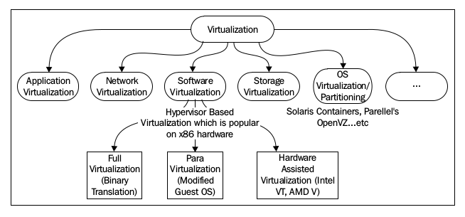

# KVM

## Table of Contents

1. [Table of Contents](#table-of-contents)
1. [Overview](#overview)
    1. [Types of Virtualization](#types-of-virtualization)
    1. [Introducing VMM/Hypervisor](#introducing-vmmhypervisor)
    1. [Introducing KVM](#introducing-kvm)
1. [KVM Internals](#kvm-internals)
    1. [libvirt](#libvirt)
    1. [QEMU](#qemu)
    1. [KVM](#kvm)
1. [Libvirt Networking Management](#libvirt-networking-management)
    1. [Create libvirt Network](#create-libvirt-network)
    1. [View libvirt Network Information](#view-libvirt-network-information)
    1. [Edit a libvirt network](#edit-a-libvirt-network)
    1. [Delete a libvirt Network](#delete-a-libvirt-network)
1. [Libvirt Volume Management](#libvirt-volume-management)
    1. [List All libvirt Storage Pools on Host](#list-all-libvirt-storage-pools-on-host)
    1. [List All Volumes on a Pool](#list-all-volumes-on-a-pool)
    1. [Create a Volume with Specified Size and Format](#create-a-volume-with-specified-size-and-format)
    1. [Clone a Volume](#clone-a-volume)
    1. [Delete a Volume](#delete-a-volume)
1. [Libvirt Virtual Machine Management](#libvirt-virtual-machine-management)
    1. [List All VMs Managed by libvirt](#list-all-vms-managed-by-libvirt)
    1. [Create Standalone VMs](#create-standalone-vms)
        1. [Create VMs with Minimum Arguments](#create-vms-with-minimum-arguments)
        1. [Clone An Existed VM](#clone-an-existed-vm)
    1. [Create VMs within a Network](#create-vms-within-a-network)
        1. [More about libvirt Network Definition](#more-about-libvirt-network-definition)
            1. [Network XML Definition File](#network-xml-definition-file)
            1. [Attach or Change Network Definition for a VM](#attach-or-change-network-definition-for-a-vm)
        1. [Types of Virtual Networking](#types-of-virtual-networking)
        1. [Isolated Virtual Network](#isolated-virtual-network)
        1. [Bridged Virtual Network](#bridged-virtual-network)
        1. [Routed Virtual Network](#routed-virtual-network)
        1. [NAT Based Virtual Network](#nat-based-virtual-network)
1. [References](#references)

## Overview

### Types of Virtualization

Có nhiều loại virtualization, ví dụ như:

*   Network virtualization: Software Defined Networking (SDN)
*   Storage virtualization: Software Defined Storage (SDS)
*   Application virtualization: Application streaming, remote desktop services, desktop virtualization, ...
*   ...



Lợi ích của virtualization:

*   Server consolidation
*   Service isolation
*   Faster server provisioning
*   Disaster recovery
*   Dynamic load balancing
*   Faster development and test environment
*   Improved system reliability and security
*   Os independence or a reduced hardware vendor lock-in 

OS virtualization:

*   Full virtualization: Guest OS giao tiếp với phần cứng thông qua hypervisor nhờ kĩ thuật dịch máy (lời gọi hệ thống được thông dịch và viết lại một cách tự động)
*   Para virtualization: Guest OS giao tiếp với một API cung cấp bởi hypervisor, việc làm đòi hỏi những sự thay đổi trong bản chất của OS

### Introducing VMM/Hypervisor

Hypervisor là phần mềm chịu trách nhiệm cho các thao tác điều khiển và quản lý virtual machines hay guest operating systems, bao gồm cung cấp phần cứng ảo, quản lý vòng đời máy ảo, nâng cấp máy ảo, định vị tài nguyên thời gian thực, định nghĩa các quy chế trong việc quản lý máy ảo. Bên cạnh đó, hypervisor còn chịu trách nhiệm trong việc quản lý tài nguyên platform phần cứng một cách hiệu quả, ví dụ như memory translation và I/O mapping. Một lợi thế chính của việc sử dụng virtualization đó là ta có thể chạy đồng thời nhiều guest OS trên cùng một hệ thống phần cứng. Các hệ thống khách có thể chạy trên một hoặc nhiều hệ điều hành khác nhau, các yêu cầu tài nguyên được cấp phát bởi hypervisor.

### Introducing KVM

Kernel-based Virtual Machine (KVM) đại diện cho thế hệ mới nhất của hệ thống virtualization mã nguồn mở. KVM biến nhân Linux thành một hypervisor khi bạn cài đặt KVM kernel module. Để phục vụ mô phỏng vào ra và mô phỏng phần cứng, KVM sử dụng phần mềm QEMU. Qemu mô phỏng vi xử lý và các thiết bị ngoại vi như ổ đĩa, mạng, VGA, USB, serial/parallel ports để xây dựng một hệ thống phần cứng ảo một cách hoàn thiện mà các guest OS có thể được cài đặt lên.

Một tiến trình `qemu-kvm` riêng biệt sẽ được khởi động với mỗi máy ảo bởi `libvirtd` mỗi khi có một yêu cầu từ các tiện ích quản lý hệ thống như `virsh` hay `virt-manager`. Các thông số của VM (số CPU, kích thước RAM, cấu hình I/O) được định nghĩa trong các file XML khác nhau và được lưu trữ trong thư mục `/etc/libvirt/qemu`. `libvirtd` sử dụng các thông tin từ những file XML này để lấy ra tham số để truyền vào tiến trình `qemu-kvm`.


**Openstack** là một hệ điều hành đám mây nguồn mở, bao gồm nhiều sub-projects là những công cụ đắc lực để xây dựng một nền tảng IaaS cloud. KVM là hypervisor được sử dụng nhiều nhất và hỗ trợ tốt nhất cho việc triển khai OpenStack.

## KVM Internals

### libvirt

libvirt là một API đóng vai trò là tầng quản lý trung gian có thể giao tiếp với nhiều loại hypervisor như (Qemu/KVM, LXC, XEN, OpenVZ,...) đồng thời theo dõi và quản lý chúng. `virt-manager` là một công cụ GUI giúp người dùng tương tác với libvirt, `virsh` giúp người dùng tương tác với libvirt qua giao diện dòng lệnh CLI.


Đối với Linux, `libvirt` là được chạy ngầm với cái tên `libvirtd`. Nó cung cấp dịch vụ cho client (virsh hoặc virt-manager) bằng cách sử dụng URI của kết nối truyền bởi client để mở một kết nối đến hypervisor, ở đây là KVM/QEMU.

*Connection URI:* Dưới đây là một số dạng URI thường được sử dụng đối với libvirt

Local connect:

*   `qemu: //xxxx/system`: Request connect locally as root
*   `qemu: //xxxx/session`: Request connect locally as normal user

Remote connect:

        qemu[+transport]: // [username@] [hostname] [:port] / [path] [?extras]

Trong đó: transport là phương thức kết nối tới remote host (ssh hay https)

Ví dụ: 

```shell
$ virsh --connect qemu+ssh://root@remoteserver.yourdomain.com/system list --all
```
### QEMU

Qemu là một phần mềm mã nguồn mở phục vụ mục đích giả lập hoặc ảo hóa.

Sử dụng kĩ thuật dịch nhị phân động, qemu có thể thực hiện giả lập một hệ điều hành hoặc một chương trình cho nền tảng này chạy trên một nền tảng khác với tốc độ tương đối cao (giả lập).

Tuy nhiên, vai trò chính của qemu là một virtualizer. Nó có khả năng chạy guest code trực tiếp trên CPU của host hoặc thông qua KVM, tạo và quản lý cpu, các thiết bị vào ra, các thiết bị mạng ảo, và kể cả là khởi tạo máy ảo khi làm việc cùng với KVM.

QEMU-KVM là một ứng dụng đa luồng và event-drivent. Các luồng quan trọng bao gồm:

*   Luồng chính
*   Các luồng backends cho ảo hóa I/O
*   Mỗi virtual CPU một luồng riêng biệt
guest
### KVM

KVM là một ứng dụng giúp biến nhân Linux thành một hypervisor. Khi KVM vận hành máy ảo, mỗi máy ảo là một tiến trình Linux bình thường và có thể được điều phối để chạy trên CPU bởi nhân của host như mọi tiến trình khác. Nói cách khác, KVM là một tính năng ảo hóa nhân Linux để các chương trình như QEMU có thể chạy guest code trực tiếp trên CPU của host một cách an toàn.

## Libvirt Networking Management

### Create libvirt Network

*   Kiểm tra các mạng của `libvirt` cài đặt trên host:

```bash
root@Tubuntu:/home/tupham# virsh net-list --all
 Name                 State      Autostart     Persistent
----------------------------------------------------------
 default              active     yes           yes

```

*   Tạo một file xml define một mạng ảo mới, đây là một mẫu cấu hình thường gặp:

```xml
<network>
    <name>192.168.160.0</name>
    <forward mode='nat'/>
    <bridge name='br140' stp='on' delay='0'/>
    <mac address='52:54:00:a9:34:5c'/>
    <domain name='8.8.8.8'/>
    <ip address='192.168.160.1' netmask='255.255.255.0'>
        <dhcp>
            <range start='192.168.160.2' end='192.168.160.254'/>
        </dhcp>
    </ip>
</network>
```

Lưu file này dưới dạng `<network-address>.xml, trong ví dụ trên là `192.168.160.0.xml` trong thư mục `/home/tupham/.kvm-xml/network`.

*Tra cứu các thẻ xml khác dùng để định nghĩa mạng tại [đây](https://libvirt.org/formatnetwork.html)*

*   Tạo một mạng mới với file xml định nghĩa  trên bằng cú pháp:

```bash
root@Tubuntu:/home/tupham# virsh net-define ./.kvm-xml/network/192.168.160.0.xml
Network 192.168.160.0 defined from ./.kvm-xml/network/192.168.160.0.xml

root@Tubuntu:/home/tupham# virsh net-list --all
 Name                 State      Autostart     Persistent
----------------------------------------------------------
 192.168.160.0        inactive   no            yes
 default              active     yes           yes

```

*   Mạng mới này chưa active ngay, dùng câu lệnh sau để kích hoạt:
```bash
root@Tubuntu:/home/tupham# virsh net-start 192.168.160.0
Network 192.168.160.0 started

root@Tubuntu:/home/tupham# virsh net-list --all
 Name                 State      Autostart     Persistent
----------------------------------------------------------
 192.168.160.0        active     no            yes
 default              active     yes           yes
```
*   Thiết lập autostart cho mạng này:
```bash
root@Tubuntu:/home/tupham# virsh net-autostart 192.168.160.0
Network 192.168.160.0 marked as autostarted

root@Tubuntu:/home/tupham# virsh net-list --all
 Name                 State      Autostart     Persistent
----------------------------------------------------------
 192.168.160.0        active     yes           yes
 default              active     yes           yes

```
### View libvirt Network Information

*   Xem trạng thái hiện tại của mạng:
```bash
root@Tubuntu:/home/tupham# virsh net-info 192.168.160.0
Name:           192.168.160.0
UUID:           588369df-02d6-45d8-9aec-1e869a1a8737
Active:         yes
Persistent:     yes
Autostart:      yes
Bridge:         br140

```

*   Xem thông số cấu hình mạng dưới dạng file xml:
```bash
root@Tubuntu:/home/tupham# virsh net-dumpxml 192.168.160.0
<network>
  <name>192.168.160.0</name>
  <uuid>588369df-02d6-45d8-9aec-1e869a1a8737</uuid>
  <forward mode='nat'>
    <nat>
      <port start='1024' end='65535'/>
    </nat>
  </forward>
  <bridge name='br140' stp='on' delay='0'/>
  <mac address='52:54:00:a9:34:5c'/>
  <domain name='8.8.8.8'/>
  <ip address='192.168.160.1' netmask='255.255.255.0'>
    <dhcp>
      <range start='192.168.160.2' end='192.168.160.254'/>
    </dhcp>
  </ip>
</network>

```
*Các thông số này bao gồm các thống số được định nghĩa bằng tay qua file xml trước đó và các thông số được cấp phát tự động hoặc mặc định*

### Edit a libvirt network

*   Mở file cấu hình và thay đổi cấu hình bằng lệnh:
```bash
root@Tubuntu:/home/tupham# virsh net-edit 192.168.160.0

  GNU nano 2.5.3                                 File: /tmp/virshDtRSsw.xml 

<network>
  <name>192.168.160.0</name>
  <uuid>588369df-02d6-45d8-9aec-1e869a1a8737</uuid>
  <forward mode='nat'/>
  <bridge name='br140' stp='on' delay='0'/>
  <mac address='52:54:00:a9:34:5c'/>
  <domain name='8.8.8.8'/>
  <ip address='192.168.160.1' netmask='255.255.255.0'>
    <dhcp>
      <range start='192.168.160.2' end='192.168.160.254'/>
    </dhcp>
  </ip>
</network>


File Name to Write: /tmp/virshDtRSsw.xml 

^G Get Help                  M-D DOS Format               M-A Append                   M-B Backup File
^C Cancel                    M-M Mac Format               M-P Prepend                  ^T To Files

```

*   Sau khi chỉnh sửa cấu hình, khởi động lại mạng:
```bash
root@Tubuntu:/home/tupham# virsh net-destroy 192.168.160.0
Network 192.168.160.0 destroyed

root@Tubuntu:/home/tupham# virsh net-start 192.168.160.0
Network 192.168.160.0 started

```
### Delete a libvirt Network

*   Ngừng hoạt động mạng cần xóa:
```bash
root@Tubuntu:/home/tupham# virsh net-destroy 192.168.160.0
Network 192.168.160.0 destroyed

root@Tubuntu:/home/tupham# virsh net-list --all
 Name                 State      Autostart     Persistent
----------------------------------------------------------
 192.168.160.0        inactive   yes           yes
 default              active     yes           yes
```

*   Gỡ bỏ (undefine) mạng:
```bash
root@Tubuntu:/home/tupham# virsh net-undefine 192.168.160.0
Network 192.168.160.0 has been undefined

root@Tubuntu:/home/tupham# virsh net-list --all
 Name                 State      Autostart     Persistent
----------------------------------------------------------
 default              active     yes           yes

```
## Libvirt Volume Management

A storage pool is a quantity of storage set aside by an administrator, often a dedicated storage administrator, for use by virtual machines. Storage pools are divided into storage volumes either by the storage administrator or the system administrator, and the volumes are assigned to VMs as block devices.

### List All libvirt Storage Pools on Host

```bash
root@Tubuntu:/home/tupham# virsh pool-list
 Name                 State      Autostart 
-------------------------------------------
 default              active     yes 
 root                 active     yes
```

### List All Volumes on a Pool

```bash
root@Tubuntu:/home/tupham# virsh vol-list default
 Name                 Path
------------------------------------------------------------------------------
 ubuntu-16.04.4-desktop-amd64.iso /var/lib/libvirt/images/ubuntu-16.04.4-desktop-amd64.iso

```

### Create a Volume with Specified Size and Format

```bash
root@Tubuntu:/home/tupham#  virsh vol-create-as default openvswitch-kvm.qcow2 10G --format qcow2
Vol openvswitch-kvm.qcow2 created

root@Tubuntu:/home/tupham# virsh vol-list default
 Name                 Path
------------------------------------------------------------------------------
 openvswitch-kvm.qcow2 /var/lib/libvirt/images/openvswitch-kvm.qcow2
 ubuntu-16.04.4-desktop-amd64.iso /var/lib/libvirt/images/ubuntu-16.04.4-desktop-amd64.iso

```

### Clone a Volume

```bash
root@Tubuntu:/home/tupham# virsh  vol-clone --pool default ubuntu-16.04.4-desktop-amd64.iso new-ubuntu-image
Vol new-ubuntu-image cloned from ubuntu-16.04.4-desktop-amd64.iso

root@Tubuntu:/home/tupham# virsh vol-list default
 Name                 Path
------------------------------------------------------------------------------
 new-ubuntu-image     /var/lib/libvirt/images/new-ubuntu-image
 ubuntu-16.04.4-desktop-amd64.iso /var/lib/libvirt/images/ubuntu-16.04.4-desktop-amd64.iso

```

### Delete a Volume

```bash
root@Tubuntu:/home/tupham#  virsh vol-delete --pool default new-ubuntu-image
Vol new-ubuntu-image deleted

root@Tubuntu:/home/tupham# virsh vol-list default
 Name                 Path
------------------------------------------------------------------------------
 openvswitch-kvm.qcow2 /var/lib/libvirt/images/openvswitch-kvm.qcow2
 ubuntu-16.04.4-desktop-amd64.iso /var/lib/libvirt/images/ubuntu-16.04.4-desktop-amd64.iso
```

## Libvirt Virtual Machine Management

### List All VMs Managed by libvirt

```bash
root@Tubuntu:/home/tupham# virsh list --all
 Id    Name                           State
----------------------------------------------------
 -     generic                        shut off

```

### Create Standalone VMs

Công cụ giúp khởi tạo VM của `libvirt` là `virt-install`. Để khởi tạo một VM riêng lẻ, ta chỉ cần kết hợp `virt-install` và các công cụ quản lý volume là đủ. Thao tác cấu hình VM tham gia các hệ thống mạng được đề cập ở phần sau.

#### Create VMs with Minimum Arguments

Các tham số tối thiểu để khởi tạo một VM với `virt-install` là:

*   `--name`: Tên của VM, là duy nhất trong số các VM quản lý bởi `libvirt`
*   `--ram`: Dung lượng theo MB của bộ nhớ cấp phát cho VM
*   `--disk`: Vùng nhớ ngoài được cấp cho VM
    *   `path=DISK_IMAGE_FILE`: Địa chỉ file disk image, giúp xác định địa chỉ và cấu trúc của disk
*   Một phương thức cài đặt hệ điều hành: `--location URL, --cdrom CD/ISO, --pxe, --import, --boot hd|cdrom|...`, trong đó các phương thức thường dùng là:
    *   `--location URL`: Thường là địa chỉ network URL của OS image file, `virt-install` sẽ tải file này về địa chỉ mặc định trên host trước khi dùng nó để cấu hình hệ điều hành cho VM
    *   `--cdrom OS_IMAGE`: File OS image trên máy trạm
    *   `--boot ARGS`: Xác định thứ tự boot, có thể bật menu lựa chọn hoặc không, ví dụ: `--boot cdrom,fd,hd,network,menu=on`
    *   `--import`: Bỏ qua quá trình cài đặt OS, quá trình này sẽ bắt đầu on-boot khi khởi động máy ảo bởi boot device chỉ định trong `--disk` option

Quá trình cài đặt được tiến hành theo hai bước:

*   Tạo volume cho VM:

```bash
root@Tubuntu:/home/tupham# virsh vol-create-as default tupham 10G --format qcow2
Vol tupham created

root@Tubuntu:/home/tupham# virsh vol-list --pool default
 Name                 Path
------------------------------------------------------------------------------
 tupham               /var/lib/libvirt/images/tupham 
```

*   Khởi tạo VM:

```bash
root@Tubuntu:/home/tupham# virt-install --name tupham --ram 1024 --disk path=/var/lib/libvirt/images/tupham --cdrom /var/lib/libvirt/boot/ubuntu-16.04.4-desktop-amd64.iso

Starting install...
Creating domain...
Domain installation still in progress. You can reconnect to the console to complete the installation process.
```

Bên cạnh các tham số tối thiểu được truyền vào, các tham số khác để vận hành VM cũng sẽ được tự động khởi tạo một cách phù hợp. Có thể xem toàn bộ chúng bằng lệnh:

        # virsh dumpxml tupham

Chuyển tới cửa sổ hoạt động của VM:

        # virt-viewer tupham

#### Clone An Existed VM

*   Trước hết cần phải ngưng hoạt động máy ảo cần clone:

```bash
root@Tubuntu:/home/tupham# virsh shutdown openvswitch-kvm
Domain openvswitch-kvm is being shutdown
```

Ba cách thường dùng để clone một VM là:

*   Cách 1: Clone volume của VM có sẵn, sau đó khởi tạo một máy ảo trên volume được clone ra đồng thời đặt boot device là hard disk (`--boot hd `)

        # virsh vol-clone --pool default old-vol new-vol
        # virt-install [...] --disk path=/var/lib/libvirt/images/new-vol --boot hd

*   Cách 2: Dùng lệnh `virt-clone`

        # virt-clone \
        --original ORIGINAL_VM_NAME \
        --name NEW_NAME \
        --file NEW_DISK_IMAGE

*   Cách 3: Dùng `virt-clone` với tên VM và disk được tạo tự động

        # virt-clone \
        --original demo \
        --auto-clone

### Create VMs within a Network

#### More about libvirt Network Definition

Mục đề cập chi tiết hơn đến các tham số cần thiết trong quá trình cài đặt một libvirt network.

##### Network XML Definition File

Như đã nhắc đến trong phần  [Libvirt Networking Management](#libvirt-networking-management), cần tạo một file XML để định nghĩa một mạng với lệnh `virsh net-define`. Các element trong file này được chia thành ba nhóm:

**General metadata**:

```xml
<network ipv6='yes' trustGuestRxFilters='no'>
  <name>default</name>
  <uuid>3e3fce45-4f53-4fa7-bb32-11f34168b82b</uuid>
  <metadata>
    <app1:foo xmlns:app1="http://app1.org/app1/">..</app1:foo>
    <app2:bar xmlns:app2="http://app1.org/app2/">..</app2:bar>
  </metadata>
  ...
```
*   `name`: Tên của virtual network
*   `uuid`: Định danh mạng
*   `ipv6='yes'`: Thuộc tính của thẻ `<network>`, dùng để enable ipv6 cho mạng

**Connectivity**:

```xml
...
<bridge name="virbr0" stp="on" delay="5" macTableManager="libvirt"/>
<mtu size="9000"/>
<domain name="example.com" localOnly="no"/>
<forward mode="nat" dev="eth0"/>
...
```

*   `bridge`: bridge device dùng để khởi tạo VMs, các VMs kết nối qua bridge này để giao tiếp với nhau, bao gồm danh sách các attribute sau:
    *   `name`: Tên của bridge device, nên bắt đầu bằng tiền tố `vibr`
    *   `stp={on(default), off}:` Sử dụng STP (Spanning Tree Protocol) cho giao tiếp trong mạng
    *   `delay (default=0)`: Trễ chuyển tiếp trên bridge
    *   `macTableManager`: Các thiết lập và sử dụng bảng MAC trên bridge, mặc định là `kernel` (bảng MAC được quản lý bởi nhân Linux). Nếu đặt lại giá trị này là `libvirt`, bảng MAC sẽ được quản lý bởi chính libvirt
*   `mtu`: Kích thước frame tin tối đa cho mạng, mặc địn là 1500
*   `domain`: DNS domain của DHCP server, gồm các attributes:
    *   `name`: Tên của DNS domain
    *   `localOnly={'yes', 'no'(default)}`: Nếu có, quá trình phân giải chỉ diễn ra trong mạng này, không forward ra ngoài
*   `forward` (quan trọng): Cách thức chuyển tiếp trong mạng, bao gồm các attribute:
    *   `mode={'nat', 'bridge', 'route', 'open', ...}`:
        *   `nat`: Tất cả giao tiếp giữa các guests kết nối với mạng này và mạng vật lý đều được forward tới mạng vật lý bằng cơ chế dịch địa chỉ của NAT. Cơ chế này giúp các host trong mạng có thể giao tiếp với bên ngoài thông qua IP đại diện của host. Dải địa chỉ IP và cổng được sử dụng bởi NAT có thể được xác định như sau:

        ```xml
        <forward mode='nat'>
            <nat>
                <address start='1.2.3.4' end='1.2.3.10'/>
                <port start='500' end='1000'/>    
            </nat>
        </forward>
        ```
        *   `bridge`: Khai báo rằng network sử dụng một bridge có sẵn trên host được chỉ ra trong thẻ `bridge`
        *   `route`:  Các VMs kết nối với mạng vật lý sử dụng thông tin định tuyến IP chỉ định bởi hypervisor. Theo mặc định, các phiên làm việc đi tới và đi ra từ mạng không bị ràng buộc
        *   `open`: Tương tự như route, tuy nhiên không thể áp đặt các ràng buộc với một open network
    *   `dev`: Tên các network device được áp dụng các ràng buộc của tường lửa
    *   Bên trong thẻ <forward> có thể có nhiều thẻ <interface> chứa danh sách các interface device có thể được dùng trong mạng này:
    ```xml
    <forward mode='passthrough'>
        <interface dev='eth10'/>
        <interface dev='eth11'/>
        <interface dev='eth12'/>
        <interface dev='eth13'/>
        <interface dev='eth14'/>
    </forward>
    ```
*   ...

**Addressing**:

```xml
...
<mac address='00:16:3E:5D:C7:9E'/>
<domain name="example.com"/>
<dns>
  <txt name="example" value="example value"/>
  <forwarder addr="8.8.8.8"/>
  <forwarder domain='example.com' addr="8.8.4.4"/>
  <forwarder domain='www.example.com'/>
  <srv service='name' protocol='tcp' domain='test-domain-name' target='.'
    port='1024' priority='10' weight='10'/>
  <host ip='192.168.122.2'>
    <hostname>myhost</hostname>
    <hostname>myhostalias</hostname>
  </host>
</dns>
<ip address="192.168.122.1" netmask="255.255.255.0" localPtr="yes">
  <dhcp>
    <range start="192.168.122.100" end="192.168.122.254"/>
    <host mac="00:16:3e:77:e2:ed" name="foo.example.com" ip="192.168.122.10"/>
    <host mac="00:16:3e:3e:a9:1a" name="bar.example.com" ip="192.168.122.11"/>
  </dhcp>
</ip>
<ip family="ipv6" address="2001:db8:ca2:2::1" prefix="64" localPtr="yes"/>
<route family="ipv6" address="2001:db9:ca1:1::" prefix="64" gateway="2001:db8:ca2:2::2"/>
```

*   `mac address='XX:XX:XX:XX:XX'`: Địa chỉ MAC được gán cho bridge
*   `dns`: Cài đặt DNS server cho mạng, bao gồm các sub element:
    *   `forwarder`: Mỗi forwarder là một DNS server của mạng
    *   `host`: Chứa attribute `ip` và sub element `hostname`, các tên miền trong `hostname` sẽ được gán cho địa chỉ trong attribute `ip`
*   `ip`: Chứa các thuộc tính `ip` - địa chỉ IP cấu hình trên bridge của mạng, `netmask` - mặt nạ mạng, `localPtr={'yes', 'no'}` - cho phép hoặc không cho phép truy vấn tên miền từ địa chỉ IP nằm trong mạng này. Thẻ `ip` thường chứa sub element là thẻ `dhcp`:
    *   `dhcp`: Bao gồm các sub element: `range` - Dải địa chỉ cấp phát cho DHCP clients trong mạng, `host` - Mỗi host (xác định bởi địa chỉ MAC) được cấp phát địa chỉ IP và tên miền cố định bởi DHCP

##### Attach or Change Network Definition for a VM

Quá trình cài đặt mạng cho VM thông qua hai bước:

*   Bước 1: Tạo network trên host với lệnh `# virsh net-define`
*   Bước 2: Gán network cho VM
    *   Khi chạy lệnh `# virt-install`: Sử dụng option `--network network=NETWORK_NAME`
    *   Sau khi đã cài đặt VM: Sửa file cấu hình của VM bằng lệnh `# virsh edit VM_NAME`, tìm đến thẻ `<interface>` và thêm thẻ `<source network='NETWORK_NAME'/>` và khởi động lại VM

#### Types of Virtual Networking

Những loại virtual networking thường gặp bao gồm:

*   Isolated virtual network: Các VMs tham gia cùng một mạng cô lập có thể giao tiếp với nhau nhưng không thể giao tiếp với bên ngoài


*   Bridged virtual network: Các VM sử dụng luôn một bridge có trên host và giao tiếp trực tiếp với mạng vật lý

*   Routed virtual network: Các VMs kết nối với mạng vật lý sử dụng thông tin định tuyến IP chỉ định bởi hypervisor. Hãy nhớ rằng cần phải thiết lập đúng IP route cho router hoặc các thiết bị gateways để các gói tin có thể được chuyển tới hypervisor một cách chính xác


*   NATed virtual network: Các VMs tham gia mạng NATed có thể giao tiếp với mạng ngoài và với hypervisor một cách dễ dàng nhưng các hệ thống ngoài không thể tiếp cận với các VMs bên trong mạng


Dưới đây xin đề cập đến cách cấu hình ba loại mạng trên cho VM

#### Isolated Virtual Network

Để network là isolated, không khai báo element <forward> và các sub element cho mạng, dưới đây là một ví dụ:

```xml
<network>
  <name>private</name>
  <bridge name="virbr2"/>
  <ip address="192.168.152.1" netmask="255.255.255.0">
    <dhcp>
      <range start="192.168.152.2" end="192.168.152.254"/>
    </dhcp>
  </ip>
  <ip family="ipv6" address="2001:db8:ca2:3::1" prefix="64"/>
</network>
```

#### Bridged Virtual Network

Sử dụng luôn một bridge trên host:

```xml
<network>
  <name>host-bridge</name>
  <forward mode="bridge"/>
  <bridge name="br0"/>
</network>
```

#### Routed Virtual Network

Các địa chỉ IP trong một mạng routed phải được cấu hình trước với host, dưới đây là một ví dụ:

```xml
<network>
  <name>local</name>
  <bridge name="virbr1"/>
  <forward mode="route" dev="eth1"/>
  <ip address="192.168.122.1" netmask="255.255.255.0">
    <dhcp>
      <range start="192.168.122.2" end="192.168.122.254"/>
    </dhcp>
  </ip>
  <ip family="ipv6" address="2001:db8:ca2:2::1" prefix="64"/>
</network>
```

#### NAT Based Virtual Network

Đây là cách cấu hình an toàn và phổ biến nhất cho mạng, ví dụ:

```xml
<network>
  <name>default</name>
  <bridge name="virbr0"/>
  <forward mode="nat"/>
  <ip address="192.168.122.1" netmask="255.255.255.0">
    <dhcp>
      <range start="192.168.122.2" end="192.168.122.254"/>
    </dhcp>
  </ip>
  <ip family="ipv6" address="2001:db8:ca2:2::1" prefix="64"/>
</network>
```

## References

[1] Mastering KVM Virtulization - Humble Devassy Chirammal, Prasad Mukhedkar, Anil Vettathu - 1st Edition

[2] https://libvirt.org/formatdomain.html

[3] https://libvirt.org/formatnetwork.html

[4] https://github.com/haminhcong/openstack-manual/blob/master/SDN/openvswitch-kvm-note.md
