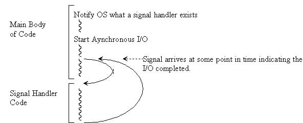

# Linux File Descriptor, Non Blocking I/O And Epoll

Trong thế giới Linux, thì file descriptor là tên gọi chung để chỉ các handle (handle là tên gọi chung chỉ các tham chiếu của các tài nguyên trong hệ thống) trong một process được sử dụng để truy cập tới các file và các tài nguyên Input/Output khác như [pipe](https://en.wikipedia.org/wiki/Pipeline_(Unix)) (thường dùng để chỉ luồng dữ liệu từ thiết bị ngoại vi như stdin/stdout) hoặc [network socket](https://en.wikipedia.org/wiki/Network_socket). File Descriptor là một trong các standard được định nghĩa trong POSIX.

Dưới góc nhìn chi tiết trong một process, thì File Descriptor là một số nguyên đại diện cho một record trên File Descriptor Table của process đó. Vì vậy, trên một File Descriptor Table thì File Descriptor được sử dụng để định danh cho các record , hay một File Descriptor chỉ đại diện cho duy nhất 1 record trên File Descriptor Table

Mỗi record File Descriptor Table của process chứa hai thông tin: File Descriptor và tham chiếu của record đó tới một open file description - "open file table entry" trên OS Global Open File Table.

Thông tin chi tiết về Open file Table và File Descriptor Table như sau:

       A call to open() creates a new open file description, an entry in the
       system-wide table of open files.  The open file description records
       the file offset and the file status flags (see below).  A file
       descriptor is a reference to an open file description; this reference
       is unaffected if pathname is subsequently removed or modified to
       refer to a different file.  For further details on open file
       descriptions, see NOTES.

       NOTES:

       The term open file description is the one used by POSIX to refer to
       the entries in the system-wide table of open files.  In other
       contexts, this object is variously also called an "open file object",
       a "file handle", an "open file table entry", or—in kernel-developer
       parlance—a struct file.

       When a file descriptor is duplicated (using dup(2) or similar), the
       duplicate refers to the same open file description as the original
       file descriptor, and the two file descriptors consequently share the
       file offset and file status flags.  Such sharing can also occur
       between processes: a child process created via fork(2) inherits
       duplicates of its parent's file descriptors, and those duplicates
       refer to the same open file descriptions.

       Each open() of a file creates a new open file description; thus,
       there may be multiple open file descriptions corresponding to a file
       inode.

       On Linux, one can use the kcmp(2) KCMP_FILE operation to test whether
       two file descriptors (in the same process or in two different
       processes) refer to the same open file description.

Một ví dụ minh họa về mối liên hệ giữa File Descriptor, Open File Table và I-node table


Khi làm việc với các tài nguyên I/O trong Linux như File, Socket, pipe,..., chúng ta sẽ sử dụng system call [open()](http://man7.org/linux/man-pages/man2/open.2.html) để tạo ra một File Descriptor cũng như tạo ra một open file description mới. Sau đó, chúng ta sẽ sử dụng File Descriptor vừa được tạo ra cùng với các system call sau để tương tác với I/O resource được File Descriptor này đại diện, mà chúng ta đã đăng ký khi gọi system call **open()**:

- [read()](http://man7.org/linux/man-pages/man2/read.2.html): Sử dụng để đọc dữ liệu từ I/O resource
- [write()](http://man7.org/linux/man-pages/man2/write.2.html): Sử dụng để ghi dữ liệu lên I/O resource

- [select()](http://man7.org/linux/man-pages/man2/select.2.html), [poll](http://man7.org/linux/man-pages/man2/poll.2.html), [epoll](http://man7.org/linux/man-pages/man7/epoll.7.html): Các phương thức này sử dụng để theo dõi một list các File Descriptor, khi một process thực thi systemcall này, nó sẽ chuyển sang trạng thái waiting, cho tới khi một trong các File Descriptor trong list ở trạng thái sẵn sàng có thể thực thi một thao tác nào đó (như **read/write non-blocking I/O**).

Một trong các ứng dụng quan trọng của File Descriptor trong lập trình trên Linux, đó là File Descriptor thường được sử dụng để lập trình socket, vì trong Linux thì socket là một loại I/O resource. Trước đây, một trong các phương thức xử lý socket thường được sử dụng là kết hợp multi-threading với blocking I/O. Tuy nhiên, đây là một phương thức xử lý không hiệu quả và cho hiệu năng không tốt, và cùng với việc yêu cầu về hiệu năng xử lý của phần mềm ngày càng tăng cao, thì phương pháp nói trên đã không còn phù hợp cho các ứng dụng thực tế nữa. Do vậy, một phương thức xử lý socket hiệu quả hơn đã được ra đời, đó là phương thức sử dụng Non Blocking I/O và sử dụng các File Descriptors Monitor System Call như select, poll, epoll. Bài viết náy sẽ giới thiệu về phương thức kết hợp giữa Non-Blocking I/O và epoll để tạo nên một chương trình xử lý socket hiệu quả.

## Blocking I/O và non-blocking I/O File Descriptor

### Blocking I/O

Hầu hết các system call xử lý dữ liệu I/O resource phổ biến như read(), write() đều tương tác với I/O resource thông qua mô hình blocking I/O: Nếu như File Descriptor của các I/O resource  truyền vào system call ở **Blocking I/O Mode**, thì các system call này sẽ block process cho tới khi dữ liệu được chuyển tới vị trí xác định trong system call đó.


Ví dụ:

```c
#include <cstdio>
#include <unistd.h>
#include <cstdlib>
#include <sys/types.h> //needed for open
#include <sys/stat.h>  //needed for open
#include <fcntl.h>     //needed for open

int inFile;
char buffer[10];

inFile=open("hello.txt",O_RDONLY);
if (inFile==-1){
    exit(1);
}

//Use the read system call to obtain 10 characters from inFile
n_char=read(inFile, buffer, 10))!=0
```

System call ```read()``` trong đoạn mã trên sẽ block process gọi nó, nếu như một process khác đang write lên file "hello.txt". Sự tranh chấp quyền sử dụng I/O resource giữa các process/thread chính là nguyên nhân block các process và tạo ra hiện tượng blocking I/O.

Một ví dụ khác, system call ```read``` trong đoạn mã dưới đây:

```c
char buffer[10];
read(STDIN_FILENO, buffer, 10);
```

Sẽ block process lại cho tới khi chúng ta nhập ký tự vào dòng nhập chuẩn (stdin) của process đó, vì lý do là tại thời điểm system call này được gọi, chưa có dữ liệu trong stdin - pipe I/O resource. Đây cũng chính là cơ chế làm việc đằng sau các câu lệnh nhập đầu vào quen thuộc trong C như scanf, fgets... Khi chúng ta chạy các chương trình chứa các system call này, chúng ta sẽ thấy rằng process sẽ block lại, cho tới khi chúng ta nhập xong giá trị vào stdin, thì các system call này mới hoàn thành và chương trình tiếp tục chạy.

Chúng ta có thể thấy, trong một số trường hợp, ví dụ như trong các chương trình cần chờ người dùng nhập dữ liệu như trên, thì mô hình Blocking I/O là cần thiết. Tuy nhiên trong các trường hợp còn lại, chúng ta dễ dàng nhận ra rằng, blocking I/O làm process bị dừng lại và tiêu tốn vô ích tài nguyên của hệ thống chỉ để chờ cho tới khi I/O resource sẵn sàng phục vụ cho system call. Sự tiêu tốn tài nguyên vô ích này làm giảm hiệu quả xử lý của chương trình.

### Non-Blocking I/O

Để loại bỏ sự chờ đợi vô ích này, một phương thức xử lý I/O resource mới đã được đưa ra, đó là non-blocking I/O. Non-blocking I/O thực hiện việc xử lý I/O resource như sau:

Process thực thi system call trên các File Descriptor ở **non-blocking I/O mode**. Khi system call này được thực thi, xảy ra hai trường hợp:

- Trường hợp 1: Tại thời điểm mà system call này được gọi, I/O resource mà system call này sử dụng đang ở trạng thái sẵn sàng - "available". Lúc này quá trình trao đổi dữ liệu với I/O resource sẽ được thực hiện và system call trả về return value thông báo thành công.
- Trường hợp 2: Tại thời điểm mà system call này được gọi, I/O resource mà system call này sử dụng đang ở trạng thái busy, có thể là do một process/thread khác đang sử dụng I/O resource đó. Lúc này, system call này sẽ không thực hiện trao đổi dữ liệu với I/O resource nữa, và trả về return value thông bao thất bại.

Ví dụ, như nếu chúng ta sử dụng system call ```read``` trên các File Descriptor ở mode Non-blocking I/O (bằng cách enable flag **O_NONBLOCK** khi tạo File Descriptor cho I/O resource), thì nếu ```read``` đọc được dữ liệu từ I/O resource, return value sẽ là số byte dữ liệu mà system call ```read``` đọc được từ I/O resource. Trong trường hợp I/O resource busy, ```read``` sẽ trả về **EAGAIN** hoặc **EWOULDBLOCK** để thông báo rằng I/O resource đang ở trạng thái busy, và thao tác ```read``` dữ liệu từ I/O resource thất bại. [2]


```man
RETURN VALUE

       On success, the number of bytes read is returned (zero indicates end
       of file), and the file position is advanced by this number.  It is
       not an error if this number is smaller than the number of bytes
       requested; this may happen for example because fewer bytes are
       actually available right now (maybe because we were close to end-of-
       file, or because we are reading from a pipe, or from a terminal), or
       because read() was interrupted by a signal.  See also NOTES.

       On error, -1 is returned, and errno is set appropriately.  In this
       case, it is left unspecified whether the file position (if any)
       changes.

ERRORS

       EAGAIN The file descriptor fd refers to a file other than a socket
              and has been marked nonblocking (O_NONBLOCK), and the read
              would block.  See open(2) for further details on the
              O_NONBLOCK flag.

       EAGAIN or EWOULDBLOCK
              The file descriptor fd refers to a socket and has been marked
              nonblocking (O_NONBLOCK), and the read would block.
              POSIX.1-2001 allows either error to be returned for this case,
              and does not require these constants to have the same value,
              so a portable application should check for both possibilities.

```

Khi đó, dựa vào return value của system call trả về mà chúng ta có thể quyết định xử lý từng trường hợp như thế nào.

Như vậy, chúng ta có thể thấy, trong cả hai trường hợp thì non-blocking I/O system call đều không block process lại. Điều này mang lại cho chúng ta nhiều lựa chọn hơn trong việc xử lý I/O resource, hơn là việc phải chờ đợi I/O resource available. Và như đã nói ở trên, một trong các cách sử dụng non-blocking I/O hiệu quả nhất, đó là kết hợp mô hình này này với File Descriptors Monitor System Call như ```poll```,```select``` và ```epoll```

## File Descriptors Monitor System Calls

Nguyên tắc hoạt động của các File Descriptors Monitor System Call (FDM system call) như sau:

- Trước khi gọi tới FDM system call, process đăng ký với system call này một danh sách các File Descriptor mà process đó muốn theo dõi, và loại trạng thái mà process đó muốn theo dõi đối với từng File Descriptor( ví dụ, process muốn theo dõi trạng thái ready-read ở FD1, nhưng ở FD2 process lại muốn theo dõi trạng thái ready-write).
- Process gọi tới system call và block ở đó cho tới khi ít nhất một trong số các File Descriptor mà process đã đăng ký theo dõi chuyển tới trạng thái mà process đã đăng ký trước đó cho File Descriptor đó.
- FDM system call hoàn thành và trả về cho process danh sách các File Descriptor của I/O resource đã ở trạng thái mà process mong muốn.

Như vậy, chúng ta có thể thấy rằng, mục đích cuối cùng của các FDM system call là theo dõi hàng loạt File Descriptor cùng một lúc (simultaneously) và chờ cho tới khi ít nhất một FD trong số các File Descriptor thông báo I/O resource mà FD đó đại diện ở trạng thái sẵn sàng để thực hiện I/O (nói một cách chính xác hơn là tại thời điểm đó, nếu như chúng ta thực hiện thao tác Blocking I/O thì thao tác của chúng ta có khả năng cao sẽ không bị block, còn nếu chúng ta thực hiện non-blocking I/O thì thao tác của chúng ta sẽ không trả về error như **EAGAIN** hoặc **EWOULDBLOCK**). Một I/O resouce chuyển sang trạng thái sẵn sàng để thực hiện I/O khi một số **I/O event** xảy ra, ví dụ như khi data input được chuyển tới I/O resouce, hoặc khi một socket connection vừa được thực hiện xong, hoặc khi một TCP transmit của một socket vừa thực hiện xong và giải phóng TCP buffer của socket đó...

Trước khi Epoll ra đời, FDM System call được xây dựng chủ yếu từ 2 phương pháp sau:

- I/O multiplexing: Định kỳ theo dõi và kiểm tra các File Descriptor đã được đăng ký trước khi gọi system call, cho tới khi phát hiện ra một trong các File Descriptor chuyển sang trạng thái READY thì I/O multiplexing trả về kết quả là trạng thái của các File Descriptor trong danh sách, cả các File Descriptor đã ready và các File Descriptor chưa ready. Trong quá trình này, process bị block cho tới khi I/O multiplexing trả về kết quả. Poll và epoll hoạt động theo phương pháp này


- Signal-driven I/O: Process đăng ký một handle variable tương ứng với File Descriptor với kernel và yêu cầu kernel thông báo cho process trạng thái của I/O resource khi I/O resource đã ready. Sau đó process có thể thực hiện các công việc khác. Sau đó một thời gian, khi I/O resource đã available, kernel sẽ signaling cho process, và lúc này process sẽ chuyển sang thực thi callback thực hiện việc trao đổi dữ liệu với I/O resource.



Cả 2 phương pháp trên đều có những nhược điểm. I/O multiplexing có điểm yếu là tốc độ chậm, độ phức tạp thuật toán cao, do phương pháp này phải thực hiện việc quét toàn bộ các File Descriptor đã được đăng ký, do đó nó có độ phức tạp là O(N). Signal-driven I/O có tốc độ thực thi tối ưu - O(1), tuy nhiên việc sử dụng callback để xử lý kernel signaling làm cho mất tính logic chương trình, làm mã nguồn của chương trình thiếu tính ổn định. Khi nào thì kernel signaling cho process ? Chúng ta không hề xác định được thời điểm này. Một phương thức xử lý I/O resource khác cũng có điểm yếu tương tự như signal driven I/O, đó là AIO: <http://stackoverflow.com/questions/5844955/whats-the-difference-between-event-driven-and-asynchronous-between-epoll-and-a>

Chính vì vậy, Linux OS đã phát triển một bộ FDM system call mới kế thừa các điểm mạnh của các system call trên, đó là **epoll**.

Epoll là một tập các system call được giới thiệu ở Linux 2.6 để thay thế cho ```select``` và ```poll```. So với ```select``` và ```poll``` thì Epoll có ưu điểm về tốc độ và tính scalable, vì độ phức tạp của các thao tác ```epoll``` tương đương với singal driven I/O - chỉ là O(1) (so với O(n)) của hai thao tác kia - [http://stackoverflow.com/questions/17355593/why-is-epoll-faster-than-select](http://stackoverflow.com/questions/17355593/why-is-epoll-faster-than-select). Hơn thế nữa, epoll kế thừa được ưu điểm từ poll(), đó là epoll không sử dụng call back mà nó cũng sử dụng phương pháp chờ cho tới khi ít nhất một trong các File Descriptor chuyển sang trạng thái READY thì trả về. Một ưu điểm nổi bật khác của epoll, đó là kết quả trả về của epoll chỉ chứa các File Descriptor đã chuyển trạng thái và không có các File Descriptor chưa chuyển trạng thái, một lần nữa cách thức trả về kết quả của epoll nâng cao tốc độ xử lý của process, khi mà process không phải kiểm tra trong kết quả trả về, File Descriptor nào đã chuyển sang trạng thái READY. Một ưu điểm khác của epoll, đó là phương thức này cho phép chúng ta lựa chọn một trong 2 phương thức kernel thông báo sự thay đổi trạng thái của File Descriptor: level-triggered hoặc edge-triggered notification.

Để sử dụng phương thức epoll, chúng ta cần sử dụng 3 system call sau:

- [epoll_create()](http://man7.org/linux/man-pages/man2/epoll_create.2.html): Tạo ra một **epoll** instance và trả về một File Descriptor tham chiếu tới **epoll** instance này (như vậy, chúng ta có thể nhìn nhận epoll instance như một I/O resource). File Descriptor trả về sẽ được sử dụng trong các epoll system call tiếp theo. Khi gọi tới system call này, chúng ta cũng sẽ lựa chọn phương thức kernel thông báo sự thay đổi trạng thái của File Descriptor là level-triggered hay edge-triggered notification.
- [epoll_ctl()](http://man7.org/linux/man-pages/man2/epoll_ctl.2.html): System call này cho phép chúng ta đăng ký một File Descriptor cần theo dõi tới epoll instance, với trạng thái tương ứng với File Descriptor này mà chúng ta muốn theo dõi, hoặc thay đổi đăng ký của một File Descriptor đang được đăng ký theo dõi, hoặc hủy đăng ký một File Descriptor.
- [epoll_wait()](http://man7.org/linux/man-pages/man2/epoll_wait.2.html): Thực hiện việc block process và chờ đợi cho tới khi ít nhất một File Descriptor được kernel thông báo đã chuyển sang trạng thái mà chúng ta đã đăng ký tương ứng với File Descriptor này.

### Level-Triggered và Edge-Triggered Notification

Có 2 chế độ để kernel thông báo cho một FDM system call rằng một I/O resource tương ứng với một File Descriptor đã ở trạng thái READY, đó là Level-Triggered và Edge-Triggered Notification mode.

- Level-Triggered Notification (LT) Notification là chế độ mà kernel thông báo File Descriptor event của một I/O resource ở trạng thái READY **bất cứ khi nào** I/O resource đó ở trạng thái READY - sẵn sàng thực hiện trao đổi dữ liệu mà không tạo ra blocking. LT Notification thuộc loại **State Notification**.
- Edge-Triggered (ET) Notification là chế độ mà kernel chỉ thông báo File Descriptor event của một I/O resource ở trạng thái READY duy nhất một lần trong một chu kỳ thay đổi, vào lúc có sự chuyển trạng thái của I/O resource từ NON-READY sang READY. ET Notification thuộc loại **Event Notification**.

Ví dụ, chúng ta có một quá trình xử lý tương tác I/O như sau:

1. The file descriptor that represents the read side of a pipe (rfd) is registered on the epoll instance.
1. A pipe writer writes 2 kB of data on the write side of the pipe.
1. A call to epoll\_wait() is done that will return rfd as a ready file descriptor.
1. The pipe reader reads 1 kB of data from rfd.
1. A call to epoll\_wait() is done. [3]

Trong quá trình trên, tại bước (1) chúng ta tạo ra một epoll instance ở bước một bằng system call epoll\_create(), và đăng ký một File Descriptor **rfd** tương ứng với một **read side pipe resource** vào epoll instance được tạo ra bằng system call epoll\_ctl(). Tiếp đó, tại bước (2) chúng ta thực hiện việc thay đổi trạng thái của I/O resource từ NON-READY sang READY bằng cách viết vào write side của pipe 2 kB dữ liệu (lưu ý là read side pipe và write side pipe là 2 I/O resource độc lập với nhau). Lúc này do dữ liệu được truyền từ write-side pipe sang read side pipe, nên read side pipe từ trạng thái NON-READY (không có dữ liệu phục vụ cho system call read) sẽ chuyển sang trạng thái READY ( đã có dữ liệu). Lúc này, khi chúng ta gọi system call epoll\_wait() ở bước (3), thì trong cả 2 mode Level-Triggered và Edge-Triggered, epoll\_wait() đều return về thông báo **rfd** đã ở trạng thái READY, sẵn sàng trao đổi dữ liệu. Lúc đó khi chúng ta thực hiện đọc 1 kB dữ liệu từ **read side pipe resource** thông qua **rfd** ở bước (4), thì thao tác đọc này sẽ không bị blocking.

Sự khác biệt giữa 2 chế độ Level-Triggered và Edge-Triggered được thể hiện ở bước (5), khi system call epoll\_wait() thứ 2 được thực hiện. Lúc này, nếu tại thời điểm chúng ta thực hiện epoll\_create() ở bước 1, chế độ notification mà chúng ta truyền vào epoll\_create() là Level-Triggered mode, thì epoll\_wait() ở bước (5) sẽ ngay lập tức trả về kết quả thông báo **rfd** File Descriptor ở trạng thái READY. Lý do là như đã nói ở trên, ở Level-Triggered mode thì bất cứ khi nào I/O resource ở trạng thái READY, kernel sẽ trả về thông báo, tại thời điểm  epoll\_wait() thứ 2 được gọi, chúng ta vẫn còn 2-1 = 1 kB dữ liệu trong read side pipe resource, do vậy I/O resource này vẫn đang ở trạng thái READY. Do đó epoll\_wait() thứ 2 lập tức trả về kết quả là File Descriptor rfd. Còn trong trường hợp tại thời điểm chúng ta thực hiện epoll\_create() ở bước 1, chế độ notification mà chúng ta truyền vào epoll\_create() là Edge-Triggered mode, thì gần như chắc chắn epoll\_wait() sẽ bị block lại. Lý do là như chúng ta đã nói ở trên, trong một chu kỳ thay đổi trạng thái READY, thì ở Edge-Triggered mode kernel chỉ trả về thông báo một lần. Mà ở trong trường hợp này, tại bước (3) kernel đã trả về thông báo một lần rồi, nên tại bước 5, khi chúng ta gọi epoll\_wait() một lần nữa, thì vẫn chưa có sự kiện thay đổi từ NON-READY sang READY thứ hai xảy ra (\*\*), do đó epoll\_wait() ở Edge-Triggered mode sẽ block process này lại cho tới khi xảy ra điều kiện (\*\*). Để điều này xảy ra, chúng ta cần có một process thứ 2 đọc nốt 1 kB dữ liệu trong **read side pipe resource** này để rfd trở về trạng thái NON-READY, sau đó process thứ 2 này thực hiện tiếp việc ghi dữ liệu vào write side of the pipe để đẩy dữ liệu vào **read side pipe resource**. Lúc này do **read side pipe resource** đã có dữ liệu, nên sự kiện event chuyển từ NON-READY sang READY thứ hai xảy ra, và điều này kích hoạt điều kiện (\*\*). Lúc này system call epoll\_wait() ở bước 5 sẽ trả về kết quả cho process thông báo rfd ở trạng thái READY.

Qua phân tích trên, chúng ta có thể thây chúng ta cần cẩn thận khi sử dụng Edge-Triggered mode, tránh tạo ra các dead lock blocking.

(to be continue)

## Tài liệu tham khảo

[1] Linux Programming Interface Book

[2] <http://man7.org/linux/man-pages/man2/read.2.html>

[3] <http://man7.org/linux/man-pages/man7/epoll.7.html>

[4] <https://eklitzke.org/blocking-io-nonblocking-io-and-epoll>