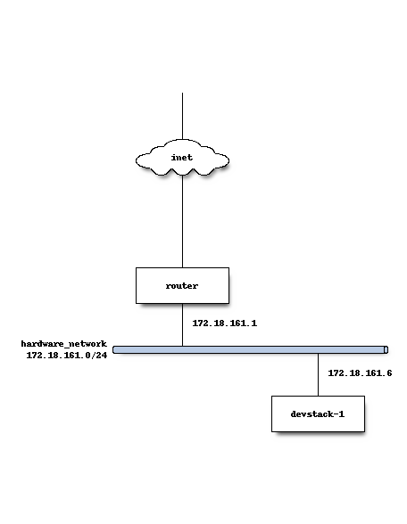
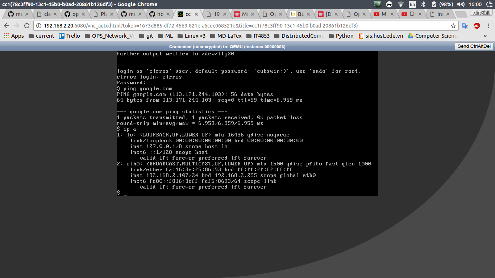
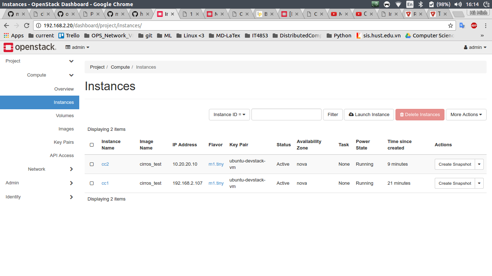
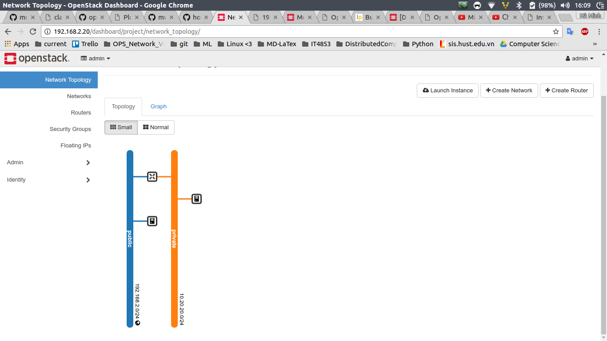
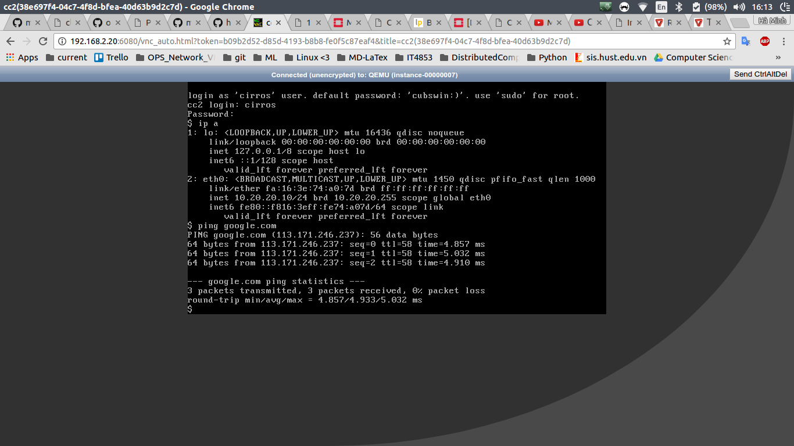

# Devstack deploy with neutron provider network configuration log

## [25/03/2017] - [PARTIAL SOLVED]

Use case: Triển khai môi trường Devstack trên một Máy ảo KVM với cấu hình có 1 provider network để có thể access vào máy ảo từ Server vật lý.

### Step1

Test thử lần 1: Môi trường thử nghiệm 1 Virtual Machine **Devstack** được cấu hình như sau:


Trong mô hình này, IP 192.168.100.20 được sử dụng để SSH vào máy ảo để cài đặt, card mạng ens8 được sử dụng để triển khai provider network. ens3 là mạng nội bộ(tạm thời chưa dùng tới). Loại switch ảo được deploy là openVSwitch.

Version của Devstack là ocata.

File cấu hình **local.conf** được sử dụng trong lần thử đầu tiên:

```b
[[local|localrc]]
HOST_IP=192.168.10.20
SERVICE_HOST=192.168.10.20
MYSQL_HOST=192.168.10.20
RABBIT_HOST=192.168.10.20
GLANCE_HOSTPORT=192.168.10.20:9292
ADMIN_PASSWORD=1111
DATABASE_PASSWORD=1111
RABBIT_PASSWORD=1111
SERVICE_PASSWORD=1111

LOGFILE=/opt/stack/logs/stack.sh.log

## Neutron options
Q_USE_SECGROUP=True
FLOATING_RANGE="192.168.10.0/24"
IPV4_ADDRS_SAFE_TO_USE="192.168.3.0/24"
Q_FLOATING_ALLOCATION_POOL=start=192.168.10.200,end=192.168.10.254
PUBLIC_NETWORK_GATEWAY="192.168.10.1"
PUBLIC_INTERFACE=ens8

# Open vSwitch provider networking configuration
Q_USE_PROVIDERNET_FOR_PUBLIC=True
OVS_PHYSICAL_BRIDGE=br-ex
PUBLIC_BRIDGE=br-ex
OVS_BRIDGE_MAPPINGS=public:br-ex

```

file local.conf được viết theo hướng dẫn của Devstack:
[https://docs.openstack.org/developer/devstack/guides/neutron.html#using-neutron-with-a-single-interface](https://docs.openstack.org/developer/devstack/guides/neutron.html#using-neutron-with-a-single-interface)


Kết quả thu được sau khi chạy: Lỗi :(

```bash
2017-03-25 19:32:51.266 | ERROR: invocation failed (exit code 28), logfile: /opt/stack/tempest/.tox/tempest/log/venv-tempest-1.log
2017-03-25 19:32:51.266 | ERROR: actionid: venv-tempest
2017-03-25 19:32:51.266 | msg: getenv
2017-03-25 19:32:51.266 | cmdargs: ['/opt/stack/tempest/tools/tox_install.sh', 'https://git.openstack.org/cgit/openstack/requirements/plain/upper-constraints.txt', '-r/opt/stack/tempest/requirements.txt']
2017-03-25 19:32:51.279 | env: {'LC_NUMERIC': 'km_KH', 'PYTHON': '/usr/bin/python', 'LESSOPEN': '| /usr/bin/lesspipe %s', 'SSH_CLIENT': '192.168.100.1 47900 22', 'LOGNAME': 'stack', 'USER': 'stack', 'BASH_FUNC_short_source%%': '() {  saveIFS=$IFS;\n IFS=" ";\n called=($(caller 0));\n IFS=$saveIFS;\n file=${called[2]};\n file=${file#$RC_DIR/};\n printf "%-40s " "$file:${called[1]}:${called[0]}"\n}', 'OS_REGION_NAME': 'RegionOne', 'LC_PAPER': 'km_KH', 'PATH': '/opt/stack/tempest/.tox/tempest/bin:/home/stack/bin:/home/stack/.local/bin:/usr/local/sbin:/usr/local/bin:/usr/sbin:/usr/bin:/sbin:/bin:/usr/games:/usr/local/games:/snap/bin:/usr/local/sbin:/usr/sbin:/sbin', 'PS4': '+\\[$(tput  setaf 242)\\]$(short_source)\\[$(tput  sgr0)\\] ', 'TERM': 'screen', 'SHELL': '/bin/bash', 'LC_MEASUREMENT': 'km_KH', 'CLIENT_NAME': 'tempest', 'NEUTRON_TEST_CONFIG_FILE': '/etc/neutron/debug.ini', 'USE_PYTHON3': 'False', 'PYTHON3_VERSION': '3.5', 'PYTHONHASHSEED': '2953949854', 'HOME': '/home/stack', 'OS_PROJECT_NAME': 'admin', 'LC_ALL': 'C', 'XDG_RUNTIME_DIR': '/run/user/1001', 'OS_USERNAME': 'admin', 'LC_ADDRESS': 'km_KH', 'SHLVL': '2', 'VIRTUAL_ENV': '/opt/stack/tempest/.tox/tempest', 'OS_USER_DOMAIN_ID': 'default', 'PWD': '/opt/stack/tempest', 'PYTHON2_VERSION': '2.7', 'OS_IDENTITY_API_VERSION': '3', 'OS_PASSWORD': '1111', 'XDG_SESSION_ID': '2', '_': '/usr/local/bin/tox', 'LC_IDENTIFICATION': 'km_KH', 'LS_COLORS': 'rs=0:di=01;34:ln=01;36:mh=00:pi=40;33:so=01;35:do=01;35:bd=40;33;01:cd=40;33;01:or=40;31;01:mi=00:su=37;41:sg=30;43:ca=30;41:tw=30;42:ow=34;42:st=37;44:ex=01;32:*.tar=01;31:*.tgz=01;31:*.arc=01;31:*.arj=01;31:*.taz=01;31:*.lha=01;31:*.lz4=01;31:*.lzh=01;31:*.lzma=01;31:*.tlz=01;31:*.txz=01;31:*.tzo=01;31:*.t7z=01;31:*.zip=01;31:*.z=01;31:*.Z=01;31:*.dz=01;31:*.gz=01;31:*.lrz=01;31:*.lz=01;31:*.lzo=01;31:*.xz=01;31:*.bz2=01;31:*.bz=01;31:*.tbz=01;31:*.tbz2=01;31:*.tz=01;31:*.deb=01;31:*.rpm=01;31:*.jar=01;31:*.war=01;31:*.ear=01;31:*.sar=01;31:*.rar=01;31:*.alz=01;31:*.ace=01;31:*.zoo=01;31:*.cpio=01;31:*.7z=01;31:*.rz=01;31:*.cab=01;31:*.jpg=01;35:*.jpeg=01;35:*.gif=01;35:*.bmp=01;35:*.pbm=01;35:*.pgm=01;35:*.ppm=01;35:*.tga=01;35:*.xbm=01;35:*.xpm=01;35:*.tif=01;35:*.tiff=01;35:*.png=01;35:*.svg=01;35:*.svgz=01;35:*.mng=01;35:*.pcx=01;35:*.mov=01;35:*.mpg=01;35:*.mpeg=01;35:*.m2v=01;35:*.mkv=01;35:*.webm=01;35:*.ogm=01;35:*.mp4=01;35:*.m4v=01;35:*.mp4v=01;35:*.vob=01;35:*.qt=01;35:*.nuv=01;35:*.wmv=01;35:*.asf=01;35:*.rm=01;35:*.rmvb=01;35:*.flc=01;35:*.avi=01;35:*.fli=01;35:*.flv=01;35:*.gl=01;35:*.dl=01;35:*.xcf=01;35:*.xwd=01;35:*.yuv=01;35:*.cgm=01;35:*.emf=01;35:*.ogv=01;35:*.ogx=01;35:*.aac=00;36:*.au=00;36:*.flac=00;36:*.m4a=00;36:*.mid=00;36:*.midi=00;36:*.mka=00;36:*.mp3=00;36:*.mpc=00;36:*.ogg=00;36:*.ra=00;36:*.wav=00;36:*.oga=00;36:*.opus=00;36:*.spx=00;36:*.xspf=00;36:', 'LESSCLOSE': '/usr/bin/lesspipe %s %s', 'OS_PROJECT_DOMAIN_ID': 'default', 'BRANCH_NAME': 'master', 'SSH_TTY': '/dev/pts/0', 'OLDPWD': '/home/stack/devstack', 'LC_TELEPHONE': 'km_KH', 'LC_MONETARY': 'km_KH', 'OS_AUTH_URL': 'http://192.168.10.20/identity_admin', 'OS_TEST_PATH': './tempest/test_discover', 'LC_NAME': 'km_KH', 'MAIL': '/var/mail/stack', 'LC_TIME': 'km_KH', 'SSH_CONNECTION': '192.168.100.1 47900 192.168.100.20 22'}
2017-03-25 19:32:51.279 | 
2017-03-25 19:32:51.280 | 
2017-03-25 19:32:51.280 | curl: (28) Operation timed out after 0 milliseconds with 0 out of 0 bytes received
2017-03-25 19:32:51.280 | 
2017-03-25 19:32:51.280 | ERROR: could not install deps [-r/opt/stack/tempest/requirements.txt]; v = InvocationError('/opt/stack/tempest/tools/tox_install.sh https://git.openstack.org/cgit/openstack/requirements/plain/upper-constraints.txt -r/opt/stack/tempest/requirements.txt (see /opt/stack/tempest/.tox/tempest/log/venv-tempest-1.log)', 28)
2017-03-25 19:32:51.280 | ___________________________________ summary ____________________________________
2017-03-25 19:32:51.280 | ERROR:   venv-tempest: could not install deps [-r/opt/stack/tempest/requirements.txt]; v = InvocationError('/opt/stack/tempest/tools/tox_install.sh https://git.openstack.org/cgit/openstack/requirements/plain/upper-constraints.txt -r/opt/stack/tempest/requirements.txt (see /opt/stack/tempest/.tox/tempest/log/venv-tempest-1.log)', 28)
2017-03-25 19:32:51.292 | +lib/tempest:configure_tempest:1           exit_trap
2017-03-25 19:32:51.303 | +./stack.sh:exit_trap:487                  local r=1
2017-03-25 19:32:51.315 | ++./stack.sh:exit_trap:488                  jobs -p
2017-03-25 19:32:51.323 | +./stack.sh:exit_trap:488                  jobs=
2017-03-25 19:32:51.330 | +./stack.sh:exit_trap:491                  [[ -n '' ]]
2017-03-25 19:32:51.338 | +./stack.sh:exit_trap:497                  kill_spinner
2017-03-25 19:32:51.347 | +./stack.sh:kill_spinner:383               '[' '!' -z '' ']'
2017-03-25 19:32:51.355 | +./stack.sh:exit_trap:499                  [[ 1 -ne 0 ]]
2017-03-25 19:32:51.363 | +./stack.sh:exit_trap:500                  echo 'Error on exit'
2017-03-25 19:32:51.363 | Error on exit
2017-03-25 19:32:51.371 | +./stack.sh:exit_trap:501                  generate-subunit 1490468795 1576 fail
2017-03-25 19:32:52.287 | +./stack.sh:exit_trap:502                  [[ -z /opt/stack/logs ]]
2017-03-25 19:32:52.295 | +./stack.sh:exit_trap:505                  /home/stack/devstack/tools/worlddump.py -d /opt/stack/logs
2017-03-25 19:32:56.619 | +./stack.sh:exit_trap:511                  exit 1

```

Check lại băng cách thử nghiệm một cấu hình khác

### Step2

Test thử lần 2: Môi trường thử nghiệm 1 Virtual Machine **Devstack2** được cấu hình tương tự như con VM ở step1:


Tương tự step 1, IP 192.168.100.30 được sử dụng để SSH vào máy ảo để cài đặt, card mạng ens8 được sử dụng để triển khai provider network. Loại switch ảo được deploy là openVSwitch.

file **local.conf** được sử dụng trong lần thử thứ 2:

```b
[[local|localrc]]
HOST_IP=192.168.10.30
SERVICE_HOST=192.168.10.30
MYSQL_HOST=192.168.10.30
RABBIT_HOST=192.168.10.30
GLANCE_HOSTPORT=192.168.10.30:9292
ADMIN_PASSWORD=1111
DATABASE_PASSWORD=1111
RABBIT_PASSWORD=1111
SERVICE_PASSWORD=1111
LOGFILE=/opt/stack/logs/stack.sh.log

## Neutron options
Q_USE_SECGROUP=True
PUBLIC_INTERFACE=ens8

# Open vSwitch provider networking configuration
Q_USE_PROVIDERNET_FOR_PUBLIC=True
OVS_PHYSICAL_BRIDGE=br-ex
PUBLIC_BRIDGE=br-ex
OVS_BRIDGE_MAPPINGS=public:br-ex

```

Ta có thể thấy, trong lần thử thứ 2, chỉ giữ lại đúng 2 cấu hình mạng cho neutron là 

```b
Q_USE_SECGROUP=True
PUBLIC_INTERFACE=ens8
```

Kết quả thử nghiệm với cấu hình file local.conf mới: Devstack được cài đặt thành công, không bị lỗi.

```bash
ost-attr,os-vol-image-meta,os-vol-mig-status-attr,os-vol-tenant-attr,os-volume-actions,os-volume-encryption-metadata,os-volume-manage,os-volume-transfer,os-volume-type-access,os-volume-unmanage,qos-specs,scheduler-stats
2017-03-25 19:29:48.621 | ++lib/tempest:configure_tempest:635         [[ ! -z '' ]]
2017-03-25 19:29:48.629 | ++lib/tempest:configure_tempest:641         iniset /opt/stack/tempest/etc/tempest.conf volume-feature-enabled api_extensions OS-SCH-HNT,backups,capabilities,cgsnapshots,consistencygroups,encryption,os-admin-actions,os-availability-zone,os-extended-services,os-extended-snapshot-attributes,os-hosts,os-image-create,os-quota-class-sets,os-quota-sets,os-services,os-snapshot-actions,os-snapshot-manage,os-snapshot-unmanage,os-types-extra-specs,os-types-manage,os-used-limits,os-vol-host-attr,os-vol-image-meta,os-vol-mig-status-attr,os-vol-tenant-attr,os-volume-actions,os-volume-encryption-metadata,os-volume-manage,os-volume-transfer,os-volume-type-access,os-volume-unmanage,qos-specs,scheduler-stats
2017-03-25 19:29:48.690 | ++lib/tempest:configure_tempest:644         IFS=' 
2017-03-25 19:29:48.690 | '
2017-03-25 19:29:48.699 | ++extras.d/80-tempest.sh:source:22          echo_summary 'Installing Tempest Plugins'
2017-03-25 19:29:48.707 | ++./stack.sh:echo_summary:392               [[ -t 3 ]]
2017-03-25 19:29:48.715 | ++./stack.sh:echo_summary:392               [[ True != \T\r\u\e ]]
2017-03-25 19:29:48.724 | ++./stack.sh:echo_summary:398               echo -e Installing Tempest Plugins
2017-03-25 19:29:48.731 | ++extras.d/80-tempest.sh:source:23          install_tempest_plugins
2017-03-25 19:29:48.741 | ++lib/tempest:install_tempest_plugins:663   pushd /opt/stack/tempest
2017-03-25 19:29:48.741 | /opt/stack/tempest /opt/stack/tempest
2017-03-25 19:29:48.748 | ++lib/tempest:install_tempest_plugins:664   [[ 0 != 0 ]]
2017-03-25 19:29:48.757 | ++lib/tempest:install_tempest_plugins:669   popd
2017-03-25 19:29:48.757 | /opt/stack/tempest
2017-03-25 19:29:48.764 | ++extras.d/80-tempest.sh:source:26          [[ stack == \u\n\s\t\a\c\k ]]
2017-03-25 19:29:48.772 | ++extras.d/80-tempest.sh:source:31          [[ stack == \c\l\e\a\n ]]
2017-03-25 19:29:48.779 | +functions-common:run_phase:1890           [[ stack == \s\o\u\r\c\e ]]
2017-03-25 19:29:48.786 | +functions-common:run_phase:1893           [[ stack == \o\v\e\r\r\i\d\e\_\d\e\f\a\u\l\t\s ]]
2017-03-25 19:29:48.793 | +functions-common:run_phase:1896           run_plugins stack test-config
2017-03-25 19:29:48.801 | +functions-common:run_plugins:1855         local mode=stack
2017-03-25 19:29:48.810 | +functions-common:run_plugins:1856         local phase=test-config
2017-03-25 19:29:48.818 | +functions-common:run_plugins:1858         local plugins=
2017-03-25 19:29:48.825 | +functions-common:run_plugins:1859         local plugin
2017-03-25 19:29:48.833 | +./stack.sh:main:1405                      merge_config_group /home/stack/devstack/local.conf test-config
2017-03-25 19:29:48.841 | +inc/meta-config:merge_config_group:171    local localfile=/home/stack/devstack/local.conf
2017-03-25 19:29:48.849 | +inc/meta-config:merge_config_group:171    shift
2017-03-25 19:29:48.856 | +inc/meta-config:merge_config_group:172    local matchgroups=test-config
2017-03-25 19:29:48.863 | +inc/meta-config:merge_config_group:174    [[ -r /home/stack/devstack/local.conf ]]
2017-03-25 19:29:48.870 | +inc/meta-config:merge_config_group:176    local configfile group
2017-03-25 19:29:48.877 | +inc/meta-config:merge_config_group:177    for group in '$matchgroups'
2017-03-25 19:29:48.887 | ++inc/meta-config:merge_config_group:178    get_meta_section_files /home/stack/devstack/local.conf test-config
2017-03-25 19:29:48.898 | ++inc/meta-config:get_meta_section_files:63  local file=/home/stack/devstack/local.conf
2017-03-25 19:29:48.908 | ++inc/meta-config:get_meta_section_files:64  local matchgroup=test-config
2017-03-25 19:29:48.917 | ++inc/meta-config:get_meta_section_files:66  [[ -r /home/stack/devstack/local.conf ]]
2017-03-25 19:29:48.928 | ++inc/meta-config:get_meta_section_files:68  awk -v matchgroup=test-config '
2017-03-25 19:29:48.928 |         /^\[\[.+\|.*\]\]/ {
2017-03-25 19:29:48.928 |             gsub("[][]", "", $1);
2017-03-25 19:29:48.928 |             split($1, a, "|");
2017-03-25 19:29:48.928 |             if (a[1] == matchgroup)
2017-03-25 19:29:48.928 |                 print a[2]
2017-03-25 19:29:48.928 |         }
2017-03-25 19:29:48.928 |     ' /home/stack/devstack/local.conf

=========================
DevStack Component Timing
=========================
Total runtime         1379

run_process            56
test_with_retry         6
apt-get-update         13
pip_install           170
restart_apache_server  19
wait_for_service       28
apt-get                 9
=========================


This is your host IP address: 192.168.10.30
This is your host IPv6 address: ::1
Horizon is now available at http://192.168.10.30/dashboard
Keystone is serving at http://192.168.10.30/identity/
The default users are: admin and demo
The password: 1111
```


### Phân tích nguyên nhân sự cố

#### Phân tích lần test đầu tiên

Để hiểu được tại sao sự cố xảy ra, tiến hành ping thử vào VM Devstack1 từ máy vật lý:

```bash
PING 192.168.10.20 (192.168.10.20) 56(84) bytes of data.
^C
--- 192.168.10.20 ping statistics ---
11 packets transmitted, 0 received, 100% packet loss, time 10078ms
```

Máy vật lý không ping vào được ens8 của Devstack1. Vào máy devstack 1 qua IP 192.168.100.10 và kiểm tra cấu hình mạng của VM Devstack1:

```bash
stack@ubuntu:~/devstack$ ip a
1: lo: <LOOPBACK,UP,LOWER_UP> mtu 65536 qdisc noqueue state UNKNOWN group default qlen 1
    link/loopback 00:00:00:00:00:00 brd 00:00:00:00:00:00
    inet 127.0.0.1/8 scope host lo
       valid_lft forever preferred_lft forever
    inet6 ::1/128 scope host 
       valid_lft forever preferred_lft forever
2: ens3: <BROADCAST,MULTICAST,UP,LOWER_UP> mtu 1500 qdisc pfifo_fast state UP group default qlen 1000
    link/ether 52:54:00:53:b4:21 brd ff:ff:ff:ff:ff:ff
    inet 10.10.10.10/24 brd 10.10.10.255 scope global ens3
       valid_lft forever preferred_lft forever
    inet6 fe80::5054:ff:fe53:b421/64 scope link 
       valid_lft forever preferred_lft forever
3: ens8: <BROADCAST,MULTICAST,UP,LOWER_UP> mtu 1500 qdisc pfifo_fast master ovs-system state UP group default qlen 1000
    link/ether 52:54:00:d8:e8:fb brd ff:ff:ff:ff:ff:ff
    inet6 fe80::5054:ff:fed8:e8fb/64 scope link 
       valid_lft forever preferred_lft forever
4: ens9: <BROADCAST,MULTICAST,UP,LOWER_UP> mtu 1500 qdisc pfifo_fast state UP group default qlen 1000
    link/ether 52:54:00:4e:c4:14 brd ff:ff:ff:ff:ff:ff
    inet 192.168.100.20/24 brd 192.168.100.255 scope global ens9
       valid_lft forever preferred_lft forever
    inet6 fe80::5054:ff:fe4e:c414/64 scope link 
       valid_lft forever preferred_lft forever
5: virbr0: <NO-CARRIER,BROADCAST,MULTICAST,UP> mtu 1500 qdisc noqueue state DOWN group default qlen 1000
    link/ether 52:54:00:78:8d:a7 brd ff:ff:ff:ff:ff:ff
    inet 192.168.122.1/24 brd 192.168.122.255 scope global virbr0
       valid_lft forever preferred_lft forever
6: virbr0-nic: <BROADCAST,MULTICAST> mtu 1500 qdisc pfifo_fast master virbr0 state DOWN group default qlen 1000
    link/ether 52:54:00:78:8d:a7 brd ff:ff:ff:ff:ff:ff
7: ovs-system: <BROADCAST,MULTICAST> mtu 1500 qdisc noop state DOWN group default qlen 1
    link/ether 3e:2b:73:77:de:41 brd ff:ff:ff:ff:ff:ff
22: br-int: <BROADCAST,MULTICAST> mtu 1500 qdisc noop state DOWN group default qlen 1
    link/ether fe:d4:45:73:c3:4a brd ff:ff:ff:ff:ff:ff
23: br-ex: <BROADCAST,MULTICAST,UP,LOWER_UP> mtu 1500 qdisc noqueue state UNKNOWN group default qlen 1
    link/ether 86:ee:59:22:4e:44 brd ff:ff:ff:ff:ff:ff
    inet 192.168.10.20/24 brd 192.168.10.255 scope global br-ex
       valid_lft forever preferred_lft forever
    inet 192.168.10.1/24 scope global secondary br-ex
       valid_lft forever preferred_lft forever
    inet6 2001:db8::2/64 scope global tentative dadfailed 
       valid_lft forever preferred_lft forever
    inet6 fe80::84ee:59ff:fe22:4e44/64 scope link 
       valid_lft forever preferred_lft forever
24: br-tun: <BROADCAST,MULTICAST> mtu 1500 qdisc noop state DOWN group default qlen 1
    link/ether 66:8f:6f:9f:95:4c brd ff:ff:ff:ff:ff:ff
```

Chúng ta thấy rằng br-ex có tới 2 IP: 192.168.10.20 và 192.168.10.1. Do đó Devstack không thể sử dụng được IP 192.168.10.20 để đi tới internet. Kết quả là đoạn script **./stack.sh** không kết nối được tới server [https://git.openstack.org](https://git.openstack.org) để tải về dữ liệu cần cho tempest, do đó tempest báo lỗi:

```bash
curl: (28) Operation timed out after 0 milliseconds with 0 out of 0 bytes received
```

(xem chi tiết trong file **/opt/stack/tempest/.tox/tempest/log/venv-tempest-1.log**)

Và cuối cùng là **./stack.sh** script báo quá trình cài đặt thất bại.

Như vậy, quá trình cài đặt bị lỗi là do br-ex bị đặt vào 2 IP cùng 1 lúc. Tại sao xảy ra hiện tượng này?

Nguyên nhân là do, ở lần test đầu tiên, cấu hình trong file **local.conf** có dòng sau:

```b
PUBLIC_NETWORK_GATEWAY="192.168.10.1"
```


Ở lần thứ 2, dòng trên đã được bỏ đi, và kết quả là cài đặt thành công, từ máy ảo có thể ping vào được IP 192.168.10.30 của máy devstack 2:

```bash
bkcloud12@bkcloud12:~⟫ ping 192.168.10.30
PING 192.168.10.30 (192.168.10.30) 56(84) bytes of data.
64 bytes from 192.168.10.30: icmp_seq=1 ttl=64 time=0.365 ms
64 bytes from 192.168.10.30: icmp_seq=2 ttl=64 time=0.594 ms
64 bytes from 192.168.10.30: icmp_seq=3 ttl=64 time=0.434 ms
64 bytes from 192.168.10.30: icmp_seq=4 ttl=64 time=0.587 ms
64 bytes from 192.168.10.30: icmp_seq=5 ttl=64 time=0.541 ms
^C
--- 192.168.10.30 ping statistics ---
5 packets transmitted, 5 received, 0% packet loss, time 3998ms
rtt min/avg/max/mdev = 0.365/0.504/0.594/0.091 ms
```

#### Phân tích lần test thứ hai

Ở lần test thứ hai, chúng ta cũng kiểm tra cấu hình mạng sau khi cài đặt của Node Devstack2. Trong lần thử thứ hai không có hiện tượng bất thường như ở lần thử 1:

```bash
stack@ubuntu:~/devstack$ ip a
1: lo: <LOOPBACK,UP,LOWER_UP> mtu 65536 qdisc noqueue state UNKNOWN group default qlen 1
    link/loopback 00:00:00:00:00:00 brd 00:00:00:00:00:00
    inet 127.0.0.1/8 scope host lo
       valid_lft forever preferred_lft forever
    inet6 ::1/128 scope host 
       valid_lft forever preferred_lft forever
2: ens3: <BROADCAST,MULTICAST,UP,LOWER_UP> mtu 1500 qdisc pfifo_fast state UP group default qlen 1000
    link/ether 52:54:00:a6:b4:3d brd ff:ff:ff:ff:ff:ff
    inet 10.10.10.10/24 brd 10.10.10.255 scope global ens3
       valid_lft forever preferred_lft forever
    inet6 fe80::5054:ff:fea6:b43d/64 scope link 
       valid_lft forever preferred_lft forever
3: ens8: <BROADCAST,MULTICAST,UP,LOWER_UP> mtu 1500 qdisc pfifo_fast master ovs-system state UP group default qlen 1000
    link/ether 52:54:00:87:db:d4 brd ff:ff:ff:ff:ff:ff
    inet6 fe80::5054:ff:fe87:dbd4/64 scope link 
       valid_lft forever preferred_lft forever
4: ens9: <BROADCAST,MULTICAST,UP,LOWER_UP> mtu 1500 qdisc pfifo_fast state UP group default qlen 1000
    link/ether 52:54:00:f0:cd:3e brd ff:ff:ff:ff:ff:ff
    inet 192.168.100.30/24 brd 192.168.100.255 scope global ens9
       valid_lft forever preferred_lft forever
    inet6 fe80::5054:ff:fef0:cd3e/64 scope link 
       valid_lft forever preferred_lft forever
5: virbr0: <NO-CARRIER,BROADCAST,MULTICAST,UP> mtu 1500 qdisc noqueue state DOWN group default qlen 1000
    link/ether 52:54:00:28:9b:27 brd ff:ff:ff:ff:ff:ff
    inet 192.168.122.1/24 brd 192.168.122.255 scope global virbr0
       valid_lft forever preferred_lft forever
6: virbr0-nic: <BROADCAST,MULTICAST> mtu 1500 qdisc pfifo_fast master virbr0 state DOWN group default qlen 1000
    link/ether 52:54:00:28:9b:27 brd ff:ff:ff:ff:ff:ff
7: ovs-system: <BROADCAST,MULTICAST> mtu 1500 qdisc noop state DOWN group default qlen 1
    link/ether 6e:48:4d:bd:91:cb brd ff:ff:ff:ff:ff:ff
15: br-int: <BROADCAST,MULTICAST> mtu 1500 qdisc noop state DOWN group default qlen 1
    link/ether 26:30:57:b2:e8:41 brd ff:ff:ff:ff:ff:ff
16: br-ex: <BROADCAST,MULTICAST,UP,LOWER_UP> mtu 1500 qdisc noqueue state UNKNOWN group default qlen 1
    link/ether 46:94:a5:bc:d0:4d brd ff:ff:ff:ff:ff:ff
    inet 192.168.10.30/24 brd 192.168.10.255 scope global br-ex
       valid_lft forever preferred_lft forever
    inet 172.24.4.1/24 scope global br-ex
       valid_lft forever preferred_lft forever
    inet6 2001:db8::2/64 scope global 
       valid_lft forever preferred_lft forever
    inet6 fe80::4494:a5ff:febc:d04d/64 scope link 
       valid_lft forever preferred_lft forever
17: br-tun: <BROADCAST,MULTICAST> mtu 1500 qdisc noop state DOWN group default qlen 1
    link/ether 3a:44:40:15:08:41 brd ff:ff:ff:ff:ff:ff

```

Chỉ có 1 IP là 192.168.10.30 được đặt lên br-ex

## Vấn đề chưa giải quyết được

- Tại sao câu lệnh ```PUBLIC_NETWORK_GATEWAY="192.168.10.1"``` ở lần thử đầu tiên lại làm lỗi hệ thống? Trong khi đây là câu lệnh follow theo doc của Devstack?
- Cấu hình mạng cho Devstack tuân theo các quy tắc nào ?

## [28/03/2017]

### Xử lý các vấn đề trước đó

#### Vấn đề PUBLIC\_NETWORK\_GATEWAY

Như đã nói, cấu hình của hệ thống gần như follow Devstack document. Tuy nhiên lỗi đã xảy ra. Sau khi kiểm tra lại, kết luận cuối cùng, hệ thống xảy ra lỗi là do:

Cấu hình thử nghiệm không giống với cấu hình trong Devstack document.

Cấu hình trong Devstack chỉ có một gateway là 172.18.161.1 đi qua card mạng eth0:



Trong khi đó, trong môi trường thử nghiệm lần 1, xuất hiện tới 2 gateway trong VM devstack1 (và cả trong devstack2):


file cấu hình network của VM devstack1:

```bash
stack@bkcloud:~$ cat /etc/network/interfaces
# This file describes the network interfaces available on your system
# and how to activate them. For more information, see interfaces(5).

source /etc/network/interfaces.d/*

# The loopback network interface
auto lo
iface lo inet loopback

# The primary network interface

auto ens3
iface ens3 inet static
address 10.10.10.20
netmask 255.255.255.0

auto ens8
iface ens8 inet static
address 192.168.10.20
netmask 255.255.255.0
gateway 192.168.10.1
dns-nameservers 8.8.8.8

auto ens9
iface ens9 inet static
address 192.168.100.20
netmask 255.255.255.0
gateway 192.168.100.1
dns-nameservers 8.8.8.8
```

trong file này, người cấu hình đã "lỡ tay" cấu hình tới 2 gateway. Do đó trong một số lần khởi động thì máy nhận default gateway là 192.168.10.1, một số lần khác (đa số) sẽ nhận default gateway là 192.168.100.1

Như vậy, hệ thống bị lỗi là do người cấu hình cấu hình sai hệ thống. Để có thể bật option ```PUBLIC_NETWORK_GATEWAY="192.168.10.1"``` thì hệ thống phải được cấu hình sao cho default gateway của hệ thống luôn luôn là 192.168.10.1. Do vậy, file cấu hình network của VM devstack1 cần chỉnh sửa lại để chỉ có 1 gateway duy nhất là 192.168.10.1 (xóa bỏ gateway 192.168.100.1 đi):

```bash
auto lo
iface lo inet loopback

# The primary network interface

auto ens3
iface ens3 inet static
address 10.10.10.20
netmask 255.255.255.0

auto ens8
iface ens8 inet static
address 192.168.10.20
netmask 255.255.255.0
gateway 192.168.10.1
dns-nameservers 8.8.8.8

auto ens9
iface ens9 inet static
address 192.168.100.20
netmask 255.255.255.0
```

Sau khi chỉnh sửa cấu hình, hệ thống hoạt động ổn định và cài đặt thành công devstack.

### Một vấn đề mới phát sinh

Với cấu hình sau:

```bash
stack@bkcloud:~/devstack$ cat local.conf 
[[local|localrc]]
HOST_IP=192.168.2.20
SERVICE_HOST=192.168.2.20
MYSQL_HOST=192.168.2.20
RABBIT_HOST=192.168.2.20
GLANCE_HOSTPORT=192.168.2.20:9292
ADMIN_PASSWORD=bkcloud
DATABASE_PASSWORD=bkcloud
RABBIT_PASSWORD=bkcloud
SERVICE_PASSWORD=bkcloud

## Neutron options
Q_USE_SECGROUP=True
PUBLIC_INTERFACE=ens6

# Open vSwitch provider networking configuration
Q_USE_PROVIDERNET_FOR_PUBLIC=True
OVS_PHYSICAL_BRIDGE=br-ex
PUBLIC_BRIDGE=br-ex
OVS_BRIDGE_MAPPINGS=public:br-ex

```

Sau khi devstack được cài đặt thành công, chúng ta tiến hành tạo máy ảo trên hệ thống devstack.

Vấn đề xảy ra là khi cắm trực tiếp máy ảo vào mạng flat 192.168.10.1 thì xảy ra lỗi, vm không liên lạc được với metadata, log của instance hiển thị như sau:

```log
no results found for mode=local. up 3.26. searched: nocloud configdrive ec2
Starting network...
udhcpc (v1.20.1) started
Sending discover...
Sending select for 192.168.2.107...
Lease of 192.168.2.107 obtained, lease time 86400
cirros-ds 'net' up at 3.36
checking http://169.254.169.254/2009-04-04/instance-id
failed 1/20: up 3.38. request failed
failed 2/20: up 15.47. request failed
failed 3/20: up 27.50. request failed
failed 4/20: up 39.54. request failed
failed 5/20: up 51.56. request failed
failed 6/20: up 63.59. request failed
failed 7/20: up 75.62. request failed
failed 8/20: up 87.65. request failed
failed 9/20: up 99.68. request failed
failed 10/20: up 111.71. request failed
failed 11/20: up 123.74. request failed
failed 12/20: up 135.77. request failed
failed 13/20: up 147.81. request failed
failed 14/20: up 159.84. request failed
failed 15/20: up 171.87. request failed
failed 16/20: up 183.90. request failed
failed 17/20: up 195.93. request failed
failed 18/20: up 207.96. request failed
failed 19/20: up 219.99. request failed
failed 20/20: up 232.02. request failed
failed to read iid from metadata. tried 20
no results found for mode=net. up 244.06. searched: nocloud configdrive ec2
failed to get instance-id of datasource
Top of dropbear init script
Starting dropbear sshd: failed to get instance-id of datasource
```

Topo mạng:


Thời gian khởi động instance quá lâu (244 giây). Tuy nhiên, instance vẫn kết nối ra bên ngoài bình thường.:




Tiến hành cài đặt thêm 1 instance khác, lần này cắm vào dải mạng private, không thấy vấn đề trên xuất hiện nữa

```log
info: initramfs: up at 1.79
modprobe: module virtio_blk not found in modules.dep
modprobe: module virtio_net not found in modules.dep
GROWROOT: CHANGED: partition=1 start=16065 old: size=64260 end=80325 new: size=2072385,end=2088450
info: initramfs loading root from /dev/vda1
info: /etc/init.d/rc.sysinit: up at 1.98
info: container: none
Starting logging: OK
modprobe: module virtio_blk not found in modules.dep
modprobe: module virtio_net not found in modules.dep
WARN: /etc/rc3.d/S10-load-modules failed
Initializing random number generator... done.
Starting acpid: OK
cirros-ds 'local' up at 2.07
no results found for mode=local. up 2.10. searched: nocloud configdrive ec2
Starting network...
udhcpc (v1.20.1) started
Sending discover...
Sending select for 10.20.20.10...
Lease of 10.20.20.10 obtained, lease time 86400
route: SIOCADDRT: File exists
WARN: failed: route add -net "0.0.0.0/0" gw "10.20.20.1"
cirros-ds 'net' up at 2.17
checking http://169.254.169.254/2009-04-04/instance-id
successful after 1/20 tries: up 2.18. iid=i-00000009
failed to get http://169.254.169.254/2009-04-04/user-data
warning: no ec2 metadata for user-data
found datasource (ec2, net)
Top of dropbear init script
Starting dropbear sshd: WARN: generating key of type ecdsa failed!
OK
/run/cirros/datasource/data/user-data was not '#!' or executable
=== system information ===
Platform: OpenStack Foundation OpenStack Nova
Container: none
Arch: x86_64
CPU(s): 1 @ 2494.186 MHz
Cores/Sockets/Threads: 1/1/1
Virt-type: VT-x
RAM Size: 491MB
Disks:
NAME MAJ:MIN       SIZE LABEL         MOUNTPOINT
vda  253:0   1073741824               
vda1 253:1   1061061120 cirros-rootfs /
=== sshd host keys ===
-----BEGIN SSH HOST KEY KEYS-----
ssh-rsa AAAAB3NzaC1yc2EAAAADAQABAAAAgwCiA+PwPfPoG0OlSmI2hMEJzTvgDuags4dOZ2mVVefv3NbER57t5jNrrUR10AogTDeCYyJ9On8RcZG8ZyvFeU8nk1iYa4eAf8tS7BZ+Yj6cAHq1ZcA9J8cW1Nn5H3Sw6/nhQ24JBZV7DdOcfKWzrXCM04Xu7RRk2PO1jPhuQyusA6wD root@cc2
ssh-dss AAAAB3NzaC1kc3MAAACBAOQeZPOTdDMmakm+BIa8pWNyakI9Z2GLRt9l4BlGtSKjPPnePbhqnQQ8qypGhBrmt/SwpxtyIB6Ldu47KsPmLwlJ9KCn7FU7r2TlmeLwrKQmXjrPtCRDQUWAcl4i9o94swiNgCFRz441CCEB4QxWOAf0jZm5fMRCMnlahidghT15AAAAFQDRQQbZqukdYljoa5Mb213nPcU9uwAAAIEAlnSywG9L8zspC5NHlJA2//K+g8ERBLCO6AVkiQN99NcaMY0q5V9fUMv3swRfcEnCSRBDEfBlr3xVA0AaJdXnVPRMxasMhdohAxqddYqOOYRkSMkszrEoS1cl4zC4N2EGC6EMQpC2udIWqyekj/uqDfC3yyPgWmGOlw4bkGlbHNsAAACATP0tByuzxVW9MXAI37665FOwUyrJADkKa03gIV8MCR2DHKr0BkXm/Fy1FVfsuCFF8yOW4OmbBNWO2UMlf/GPmWC/oeh1VS3zZy5ijSc+HZiMAF5+l+CC58nTU6u3dwhKiV18UENU5Ftw0+feoy3JVF+WFrSTvYHjMge2hYHV6lY= root@cc2
-----END SSH HOST KEY KEYS-----
=== network info ===
if-info: lo,up,127.0.0.1,8,::1
if-info: eth0,up,10.20.20.10,24,fe80::f816:3eff:fe74:a07d
ip-route:default via 10.20.20.1 dev eth0 
ip-route:10.20.20.0/24 dev eth0  src 10.20.20.10 
ip-route:169.254.169.254 via 10.20.20.1 dev eth0 
=== datasource: ec2 net ===
instance-id: i-00000009
name: N/A
availability-zone: nova
local-hostname: cc2.novalocal
launch-index: 0
=== cirros: current=0.3.5 uptime=3.59 ===
  ____               ____  ____
 / __/ __ ____ ____ / __ \/ __/
/ /__ / // __// __// /_/ /\ \ 
\___//_//_/  /_/   \____/___/ 
   http://cirros-cloud.net


login as 'cirros' user. default password: 'cubswin:)'. use 'sudo' for root.
cc2 login: 
```

Thời gian khởi động chỉ là 4 giây.







s

Tại sao khi cắm trực tiếp vm vào mạng provider thì instance lại không kết nối được vào  metadata agent - 169.254.169.254 ? khiến cho thời gian khởi động instance quá lâu - 4 phút??? Trong khi nếu cắm vào private network, với 1 router nối private network với provider net thì hệ thống hoạt động bình thường ?

Google search thử vấn đề này: [https://ask.openstack.org/en/question/27505/metadata-problem-in-neutron-flat-network/](https://ask.openstack.org/en/question/27505/metadata-problem-in-neutron-flat-network/)

Như vậy là họ kết luận rằng, vấn đề ở đây là trong hệ thống của chúng ta chưa kích hoạt tính năng cấp phát metadata của dhcp, do đó dhcp của flat network không cấp được metadata cho instance, trong khi router thì cấp được metadata cho instance.

Có vẻ như chúng ta chưa kích hoạt option sau trong file ```/etc/neutron/dhcp_agent.ini```:

```ini
vim /etc/neutron/dhcp_agent.ini
# The DHCP server can assist with providing metadata support on isolated
# networks. Setting this value to True will cause the DHCP server to append
# specific host routes to the DHCP request. The metadata service will only
# be activated when the subnet does not contain any router port. The guest
# instance must be configured to request host routes via DHCP (Option 121).
# This option doesn't have any effect when force_metadata is set to True.
enable_isolated_metadata = True
```

Nguồn: [http://kimizhang.com/metadata-service-in-dhcp-namespace/](http://kimizhang.com/metadata-service-in-dhcp-namespace/)

Trong blog trên cũng đã khẳng định dhcp namespace phục vụ metadata thông qua IP 169.254.169.254:
> dhcp namespace, there's metadata server IP 169.254.169.254 configured:

Vậy, vấn đề ở đây, là chúng ta cần cấu hình devstack như thế nào để kích hoạt **dhcp-metadata-service** ?

### Cái bug thứ 2 trong ngày [SOLVED]

Khi bật máy ảo và truy cập qua vnc, vnc không nhận keyboard, biểu hiện tương tự như case này:
[https://ask.openstack.org/en/question/96772/devstack-instance-console-keyboard-error/](https://ask.openstack.org/en/question/96772/devstack-instance-console-keyboard-error/)

Cách sửa: Thực hiện như trong link.