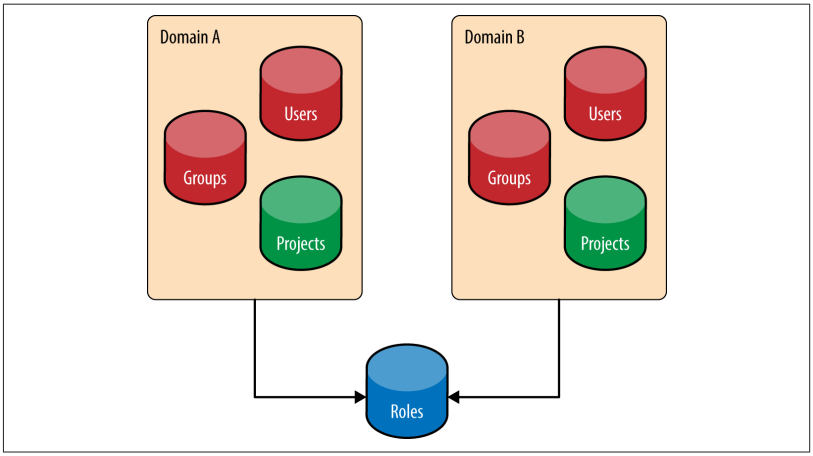
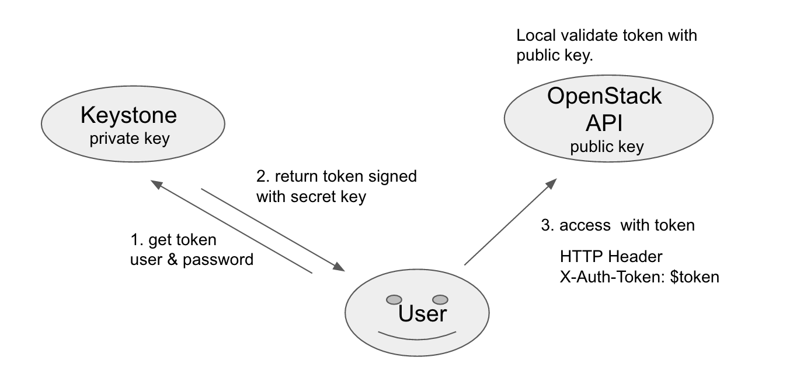

<h1>Identity Service</h1>
<h1>Mục lục</h1>

<h4><a href="#tong_quan">1.	Giới thiệu tổng quan</a></h4>

<a href="#tq_khaiNiem">1.1. Các khái niệm</a>
<ul>
  <li><a href="#khaiNiem_project">1.1.1.	Project</a></li>
  <li><a href="#khaiNiem_domain">1.1.2.	Domain</a></li>
  <li><a href="#khaiNiem_user_group">1.1.3.	User và User Group (Actor)</a></li>
  <li><a href="#khaiNiem_role">1.1.4.	Role</a></li>
  <li><a href="#khaiNiem_token">1.1.5.	Token</a></li>
  <li><a href="#khaiNiem_catalog">1.1.6.	Catalog</a></li>
</ul>

<a href="#tq_identity">1.2.	Identity</a>
<ul>
  <li><a href="#iden_sql">1.2.1.	SQL</a></li>
  <li><a href="#iden_ldap">1.2.2.	LDAP</a></li>
  <li><a href="#iden_backends">1.2.3.	Multiple Backend</a></li>
  <li><a href="#iden_provider">1.2.4.	Identity Provider</a></li>
  <li><a href="#iden_usecase_backend">1.2.5.	Các trường hợp sử dụng các Identity backend</a></li>
</ul>

<a href="#tq_Authentication">1.3.	Authentication</a>
<ul>
  <li><a href="#authen_pass">1.3.1.	Password</a></li>
  <li><a href="#authen_token">1.3.2.	Token</a></li>
</ul>

<a href="#tq_author">1.4.	Access Management và Authorization</a> 
<a href="#tq_format">1.5.	Các định dạng Token</a>
<ul>
  <li><a href="#format_uuid">1.5.1.	UUID	</a></li>
  <li><a href="#format_pki">1.5.2.	PKI – PKIZ</a></li>
  <li><a href="#format_fernet">1.5.3.	Fernet</a></li>
</ul>

<a href="#tq_activity">1.6.	Hoạt động của Keystone</a>
----

<h2><a name="tong_quan">1.	Giới thiệu tổng quan</a></h2>
&emsp;Keystone là dịch vụ xác thực của OpenStack – cung cấp quyền truy cập đảm bảo đã được kiểm soát đến tài nguyên của một cloud. Trong môi trường OpenStack, Keystone thực hiện nhiều chức năng quan trọng, như xác thực người dùng và xác định những tài liệu nào người dùng được quyền truy cập đến. 
&emsp;Để hiểu rõ cách Keystone cung cấp truy cập an toàn và được kiểm soát đến các tài nguyên, chúng ta cần xem xét các tính năng cơ bản của Keystone: 
<b>Indentity</b> 
&emsp;Identity là định danh của người đang truy cập các tài nguyên cloud. Trong OpenStack keystone, identity thường đại diện cho một người dùng (user). Trong triển khai đơn giản nhất, identity của user có thể được lưu trữ trong database của Keystone. Nhưng trong môi trường sản xuất hay trong môi trường doanh nghiệp, một Identity Provider bên ngoài thường được sử dụng. Ví dụ như Manager Identity Federated Tivoli của IBM. Keystone có thể lấy ra thông tin định danh của người dùng từ các Provider Identity bên ngoài này. 
<b>Authentication</b> 
&emsp;Authentication là quá trình của việc xác minh một thông tin định danh của người dùng. Một định danh người dùng đầu tiên sẽ được xác thực thông qua một password, sau đó các thông tin này sẽ được sử dụng để tạo ra một token để sử dụng các lần xác thực tiếp theo. Việc này sẽ làm giảm số lượng lần hiển thị và tiếp xúc với password (password được ẩn giấu và bảo vệ các nhiều càng tốt). Token cũng có giá trị trong một thời gian giới hạn (Việc này làm giảm khả năng sử dụng của nó trong trường hợp bị trộm). Trong OpenStack, Keystone là dịch vụ duy nhất có thể tạo ra token.  
&emsp;Hiện nay, Keystone sử dụng một dạng token được gọi là bearer token. Cụ thể, bất kỳ ai nắm quyền sở hữu token, cho dù là đúng hay là sai (vd: kẻ trộm,…) thì đều có khả năng sử dụng thẻ token để xác thực và truy cập đến các tài nguyên. Do đó, khi sử dung Keystone thì việc bảo vệ token là rất quan trọng. 
<b>Access Management (Authorication)</b> 
&emsp;Access Management hay Authorication là quá trình xác định những tài nguyên nào một người dùng có thể truy cập. 
<b>các tính năng của Keystone</b> 
&emsp;Trong khi Keystone tập trung hầu hết vào cung cấp các dịch vụ Identity, Authentication và Access Management, nó cũng hỗ trợ một số tính năng khác cho môi trường OpenStack: 
<ul>
<li>Xác thực đơn và cấp quyền cho các dịch vụ khác của OpenStack</li>
<li>Xử lý các hệ thống xác thực ngoài và cô lập tất cả các dịch vụ trong OpenStack</li>
<li>Keystone cung cấp các Project giúp các dịch vụ khác của OpenStack có thể sử dụng để phân biệt các tài nguyên (ví dụ như các máy chủ, các image,…).</li>
<li>Keystone cung cấp các Domain được sử dụng để định nghĩa name-space của các user, group và project để cho phép phân biệt giữa các người dùng</li>
<li>Cung cấp việc đăng ký các Roles được sử dụng cho việc cấp phép giữa Keystone và file policy của mỗi dịch vụ OpenStack</li>
<li>Cung cấp một catalog lưu trữ các dịch vụ OpenStack, endpoint và region, cho phép client có thể tìm kiếm các dịch vụ hoặc các endpoint mà họ cần.</li>
</ul>
<h3><a name="tq_khaiNiem">1.1.	Các khái niệm </a></h3> 
Để có thể tìm hiểu Keystone, trước tiên cần phải hiểu các khái niệm được sử dụng trong Keystone. 
<h3><a name="khaiNiem_project">1.1.1.	 Project </a></h3> 
&emsp;Trong Keystone, Project là khái niệm trừu tượng được sử dụng bởi các dịch vụ OpenStack để nhóm và phân biệt các tài nguyên (vd: các server, các image,…) 
&emsp;Trước đây, các Project Keystone sử dụng khái niệm “tenant”, nhưng do trực quan hơn nên đã đổi sang “Project”. Khái niệm này phù hợp hơn để nói về mục tiêu cơ bản nhất của Keystone là cung cấp các project và trình bày ai là được phép truy cập đến các project này. 
&emsp;Người dùng và nhóm người dùng nhận quyền truy cập đến một project sử dụng một khái niệm là Role Assignment (phân công). Một Role được gán cho một user hoặc user group trong một Project cho biết user hoặc user group có một số quyền truy cập đến các tài nguyên trong Project. 
&emsp;Ví dụ: 
-	Một người có thể thuộc nhiều project và có các quyền khác nhau. 
-	“Alice” có quyền admin trong project “abc” nhưng chỉ có quyền user trong project “xyz” 
<h3><a name="khaiNiem_domain">1.1.2.	 Domain</a></h3> 
&emsp; Trong giao đoạn đầu của OpenStack, không có cơ chế để hạn chế tầm nhìn của các project trong các tổ chức người dùng khác nhau. Điều này dẫn đến nhưng va chạm về tên Project của các tổ chức khác nhau. Tên user cũng có tầm nhìn tổng thể nên cũng có thể dẫn đến những va chạm không mong muốn khi 2 tổ chức đều có chung một tên user. Keystone đã đưa ra khái niệm là Domain. 
&emsp; Domain cung cấp khả năng để cô lập tầm nhìn của một tập các Project và user (và group) trong một tổ chức cụ thể. Một Domain được định nghĩa như là một tập hợp bao gồm các user, các group và các project. 
<h3><a name="khaiNiem_user_group">1.1.3.	 User và User Group (Actor)</a></h3> 
&emsp;Trong Keystone, user và user group là các thực thể được cấp quyền truy cập đến các tài nguyên trong các project. Group là một tập hợp của nhiều user. User là đại diện cho một người, hay một dịch vụ sử dụng các dịch vụ OpenStack và được chứa trong một Domain cụ thể. 
&emsp;Mối quan hệ của Domain, project, user và group được thể hiện trong hình sau: 
  
&emsp;Các user, group và project luôn luôn nằm trong phạm vi của Domain. Điều này dẫn đến, một tên của user hay groups hay project có thể được sử dụng trên các Domain khác nhau. Ví dụ như user “Alice” hoặc groups “Adminstrator” đều có ở cả IBM và Acme Inc. 
<h3><a name="khaiNiem_role">1.1.4.	 Role</a></h3> 
&emsp;Role được sử dụng trong Keystone để xác định những quyền mà môt user hay group có thể thực hiện với một tài nguyên OpenStack. 
&emsp;Ví dụ, Role admin được gán cho user “Alice” đối với project “Development”. Khi đó, user “Alice” sẽ thực hiện được các hành động của quyền admin đối với các tài nguyên của project “Development” 
<h3><a name="khaiNiem_token">1.1.5.	 Token</a></h3> 
&emsp;Khi người dùng gọi đến bất kỳ một API OpenStack thì họ phải chứng minh được rằng họ là ai và họ phải được cho phép để gọi đến các API. Thực hiện việc này bằng cách truyền một token OpenStack vào trong lời gọi API. Keystone là dịch vụ duy nhất chịu trách nhiệm tạo ra token. Người dùng nhận một token khi xác thực thành công với Keystone. Token chứa quyền của một user trong cloud. Nó bao gồm một ID và một payload. ID đảm bảo tính duy nhất của token trên mỗi cloud và payload chứa dữ liệu về người dùng. 
&emsp;Ví dụ: một token sẽ chứa nhiều trường thể hiện các thuộc tính Identity và Authorization về một user trong một project. 
   
&emsp;Token trên chứa những thông tin sau: Khi nào token được tạo ra; Khi nào token hết hạn, user nào đã được xác thực- do đó, được phép sử dụng token này; xác định project nào token này có giá trị; Và cuối cùng là Catalog chứa các dịch vụ trong OpenStack. 
<h3><a name="khaiNiem_catalog">1.1.6.	 Catalog</a></h3> 
&emsp;Catalog là danh mục chứa các URL và các endpoint của các dịch vụ OpenStack khác nhau. Nó rất cần thiết cho OpenStack, thiếu catalog thì các user, và các ứng dụng sẽ không biết địa chỉ để gửi request tạo một máy ảo hoặc là lưu trữ một đối tượng. 
&emsp;Catalog được chứa các endpoint và mỗi endpoints chứa một admin URL, enternal URL và public URL. 
&emsp;Ví dụ về một Catalog chỉ chứa hai dịch vụ Object Storage và Identity 
    
&emsp;Trên đây là các khái niệm trong OpenStack, tiếp theo sẽ đi vào chi tiết các tính năng của Keystone. 
<h3><a name="tq_identity">1.2.	Identity</a></h3> 
&emsp;Dịch vụ Identity trong Keystone cung cấp các Actor (user hay group). Identity trong Openstack có thể đến từ các vị trí khác nhau như SQL, LDAP hay Federated Identity Provider. 
<h3><a name="iden_sql">1.2.1. SQL</a></h3> 
&emsp;Keystone hỗ trợ các database để lưu trữ các actor như MySQL, PostgreSQL hay DB2. Keystone sẽ lưu trữ các thông tin của người dùng như tên, password và mô tả.  
&emsp;Về cơ bản, Keystone hoạt động như một Identity Provider như chắc chắn rằng sẽ không phải là một giải pháp tốt ưu trong một số trường hợp như trong môi trường doanh nghiệp. 
&emsp;Các ưu, nhược điểm khi sử dụng SQL: 
<ul>
    <li>Ưu điểm:
        <ul>
            <li>Dễ dàng cài đặt</li>
            <li>Quản lý user và group thông qua các API OpenStack</li>
        </ul>
    </li>
    <li>Nhược điểm:
        <ul>
            <li>Keystone không phải là một Identity Provider</li>
            <li>Hỗ trợ password yếu: Không luân chuyển password và không khôi phục password</li>
            <li>Hầu hết các doanh nghiệp sử dụng LDAP</li>
        </ul>
    </li>
</ul>
<h3><a name="iden_ldap">1.2.2.	 LDAP</a></h3> 	
&emsp;Keystone cũng có một tùy chọn để lưu trữ và lấy dữ liệu actor trong Lightweight Directory Access Protocol (LDAP). Keystone sẽ truy cập đến LDAP như các ứng dụng khác sử dụng LDAP (như Email, Web application,…). Thiết lập kết nối đến LDAP trong file cấu hình Keystone.  	
&emsp;LDAP thường chỉ thực hiện quyền đọc, chẳng hạn như tìm kiếm user (thông qua search) và xác thực (thông qua bind). 	
&emsp;Ưu, nhược điểm khi sử dụng LDAP: 	
<ul>
    <li>Ưu điểm:
        <ul>
            <li>Không duy trì bản sao của tài khoản user</li>
            <li>Keystone hoạt động như Identity Provider (nhà cung cấp nhận dạng).</li>
        </ul>
    </li>
    <li>Nhược điểm:
        <ul>
            <li>Các tài khoản của các dịch vụ khác trong OpenStack cũng cần được lưu trữ ở đâu đó, và admin LDAP không muốn lưu các tài khoản này trong LDAP</li>
            <li>Keystone vẫn thấy được password của user, khi password nằm trong một yêu cầu xác thực. Keystone đơn giản chỉ chuyển các yêu cầu, vì vậy không cần thiết phải biết password của user</li>
        </ul>
    </li>
</ul>
<h3><a name="iden_backends">1.2.3. Multiple Backend</a></h3> 
&emsp;Keystone hỗ trợ sử dụng multiple backend, nghĩa là mỗi domain có thể sử dụng một backend 
&emsp;Ví dụ: Trong ví dụ sau, Identity sử dụng LDAP cho Domain A và Domain B, một SQL để lưu trữ các service account và các Assignment 
  
&emsp;Ưu, nhược điểm khi sử dụng multiple backend: 
<ul>
    <li>Ưu điểm:
        <ul>
            <li>Hỗ trợ đồng thời nhiều backend</li>
            <li>Có thể sử dụng lại các LDAP đã có</li>
        </ul>
    </li>
    <li>Nhược điểm:
        <ul>
            <li>Cài đặt khá phức tạp</li>
            <li>Xác thực người dùng bắt buộc phải nằm trong phạm vi Domain</li>
        </ul>
    </li>
</ul>
<h3><a name="iden_provider">1.2.4. Identity Provider</a></h3> 
&emsp;Từ bản IceHouse, keystone hỗ trợ federate authentication thông qua Apache Module với nhiều Identity Provider. User không lưu trữ ở keystone. Identity Provider là các nguồn lưu trữ thông tin về Identity được lưu bởi các loại backend như Ldap, AD, MongoDB hoặc Social Login (FB, Twitter). 
&emsp;Ưu, nhược điểm khi sử dụng identity provider: 
<ul>
    <li>Ưu điểm:
        <ul>
            <li>Có thể tích hợp với các hệ thống có sẵn để xác thực người dùng và lấy các thông tin người dùng sẵn có</li>
            <li>Có sự tách biệt giữa keystone và xử lý thông tin định danh.</li>
            <li>Mở ra khả năng single sign-on và hibrid cloud.</li>
            <li>Keystone không thể xem được password của user (an toàn).</li>
            <li>Identity Provider xử lý tất cả các công việc xác thực, vì vậy, việc sử dụng kiểu xác thực nào (password, cert, two-factor,…) không liên quan đến keystone</li>
        </ul>
    </li>
    <li>Nhược điểm:
        <ul>
            <li>Phải cài đặt phức tạp</li>
        </ul>
    </li>
</ul>
<h3><a name="iden_usecase_backend">1.2.5.	Các trường hợp sử dụng các Identity backend</a></h3> 
&emsp;Tùy từng trường hợp cụ thể, có thể lựa chọn sử dụng các identity backend phù hợp.
<ul>
    <li>SQL:
        <ul>
            <li>Thử nghiệm hoặc phát triển OpenStack</li>
            <li>Với một tập hợp ít user</li>
            <li>Có các service account.</li>
        </ul>
    </li>
    <li>LDAP:
        <ul>
            <li>Trong môi trường doanh nghiệp</li>
            <li>Chỉ sử dụng nếu có khả năng tạo service account cần thiết trong LDAP</li>
        </ul>
    </li>
     <li>Multiple Backend:
        <ul>
            <li>Hầu hết được sử dụng trong các doanh nghiệp</li>
            <li>Sử dụng trong trường hợp LDAP không cho phép service account</li>
        </ul>
    </li>
     <li>Identity Provider:
        <ul>
            <li>Muốn tận dụng cơ chế mới Federated Identity</li>
            <li>Keystone không thể truy cập được LDAP</li>
        </ul>
    </li>
</ul>
<h3><a name="tq_Authentication">1.3.	Authentication </a></h3> 
&emsp;Keystone sử dụng hai cách để xác thực là cung cấp password hoặc sử dụng một token. 
<h3><a name="authen_pass">1.3.1.	Password</a></h3> 
&emsp;Cách phổ biến là các user hay service có thể xác thực là cung cấp một password. Ví dụ dưới đây là payload request đến keystone. Nó thể hiện tất cả thông tin cần thiết cho việc xác thực bao gồm thông tin user và scope của user đó 
    
&emsp;Phần scope là không bắt buộc,nhưng nó thường xuyên được dùng. Bởi vì, thiếu scope user sẽ không lấy được một catalog các service. Scope được sử dụng để chỉ ra những project mà người dùng muốn làm việc. Nếu người dùng không có role trong project này, thì yêu cầu bị hủy bỏ. Cũng giống như phần user, phần scope cũng phải có đầy đủ thông tin về project mà user muốn tìm. Việc này để tránh trương hợp va chạm tên Project. 
<h3><a name="authen_token">1.3.2.	Token</a></h3> 
&emsp;Tương tự như password, user yêu cầu một token mới bằng cách cung cấp token hiện tại. Dưới đây là một ví dụ về một request token mới  
   
 <h3><a name="tq_author">1.4.	Access Management và Authorization </a></h3> 
&emsp;KeyStone tạo ra một chính sách Role-Based Access Control (RBAC), thực thi tại mỗi public API endpoint. Các chính sách được lưu trong file policy.json, nó bao gồm mục tiêu và quy tắc. Mỗi luật bắt đầu với " identity:"  
  
<h3><a name="tq_format">1.5.	Các định dạng Token </a></h3> 
&emsp;Keystone cung cấp một số loại format keystone, và các người dùng có thể băn khoăn vì sao lại có nhiều loại như vậy. Để hiểu được tạo sao lại có nhiều format token, sau đây sẽ trình bày ngắn gọn các format token theo thứ tự xuất hiện 
<h4><a name="format_uuid">1.5.1. UUID</a></h4> 
&emsp;Đầu tiên, Keystone hỗ trợ UUID token. UUID token là một chuỗi 32 ký tự sinh ngẫu nhiên được sử dụng cho việc xác thực và ủy quyền. Ưu điểm của UUID token là kích thước nhỏ, dễ sử dụng và nó đơn giản để thêm vào trong cURL command. Nhưng nhược điểm của UUID token là nó không mang đầy đủ thông tin của người dùng cho việc xác thực cục bộ tại các OpenStack service. Token phải được lưu trong database của Keystone. Điều này dẫn đến bùng nổ database nếu số lượng user tăng lên. Bên cạnh đó, khi người dùng request kèm token UUID đến các OpenStack service thì các OpenStack service luôn phải gửi token lại cho server Keystone để xác thực nếu một hoạt động muốn xác thực. Điều này dẫn đến Keystone luôn phải làm việc trong mọi hoạt động OpenStack, và trở thành nút thắt cổ chai trong hệ thống OpenStack. 
<h4><a name="format_pki">1.5.2. PKI-PKIZ</a></h4> 
&emsp;Để giải quyết các vấn đề còn tồn tại của UUID token, Keystone đã tạo ra loại format token mới là PKI token. PKI token chứa đầy đủ thông tin có hoạt động xác thực cục bộ (có nghĩa là các OpenStack service không cần phải gửi token lại cho Keystone để thực hiện xác thực khi một hoạt động cần được xác thực) và danh mục các dịch vụ. Ngoài ra, token cần này còn được đăng ký và các service có thể cache lại token này và sử dụng nó cho đến khi hết hạn hoặc là bị hủy. Do chứa đầy đủ thông tin xác thực nên không cần database để lưu trữ token, nhưng việc này cũng tạo ra nhược điểm của PKI token là kích thước quá lớn. Kích thước của PKI token có thể lên tới 8K, điều này dẫn đến khó khăn trong việc tích hợp vào HTTP header (một số webserver không xử lý được HTTP header 8K). Ngoài ra, cũng vì kích thước mà các token này rất khó để sử dụng trong các câu lệnh cURL. 
  
&emsp;Để giảm bớt kích thước của PKI token, Keystone đã nén token này lại. Loại token được nén lại này là PKIz token. Nhưng dù có nén thì loại token này cũng có kích thước quá lớn (việc nén chỉ giảm được khoảng 10%) 
  
<h4><a name="format_fernet">1.5.3. Fernet</a></h4> 
&emsp;Loại token cải tiến hơn được tạo ra là Fernet token. Loại token này có kích thước nhỏ (tối đa 255 ký tự - lớn hơn kích thước của UUID và bé hơn rất nhiều so với PKI token) nhưng lại mang đầy đủ thông tin cho việc xác thực cục bộ và Keystone không cần phải lưu trữ token trong database – Việc này sẽ làm tăng hiệu năng của Keystone một cách đáng kể. Fernet token chứa một số thông tin như: Định danh người dùng, project, hạn sử dụng token,… 
<h3><a name="tq_activity">1.6.	Hoạt động của Keystone</a></h3> 
&emsp;Biểu đồ tuẩn tự dưới đây sẽ mô tả quá trình hoạt động của Keystone trong ví dụ cụ thể là tạo một máy ảo VM. 
  
&emsp;Cụ thể các bước như sau : 
<ol>
    <li>User gửi thông tin username và password đến keystone.</li>
    <li>Keystone kiểm tra thông tin. Nếu thông tin đúng (xác thực thành công), thì gửi một token lại cho user</li>
    <li>User gửi token và yêu cầu đến Nova.</li>
    <li>Nova gửi token (của user gửi đến) cho Keystone để yêu cầu xác thực có đúng không? Có những quyền hạn gì? Và Keystone sẽ đáp trả lại cho Nova</li>
    <li>Nếu đúng, Nova token (của nova) và yêu cầu image đến cho Glance.</li>
    <li>Glance gửi token (của Nova gửi đến) cho Keystone để xác thực và kiểm tra quyền đối với file image? Keystone đáp trả lại cho Glance.</li>
    <li>Glance gửi image lại cho Nova.</li>
    <li>Nova gửi token và yêu cầu cung cấp mạng đến Neutron.</li>
    <li>Neutron gửi token (của Nova gửi đến) cho Keystone để xác thực và kiểm tra quyền của Nova. Keystone đáp trả lại cho Neutron.</li>
    <li>Neutron phản hồi lại cho Nova.</li>
    <li>Nova thực hiện tiếp quá trình và gửi phản hồi lại cho user </li>
</ol>
