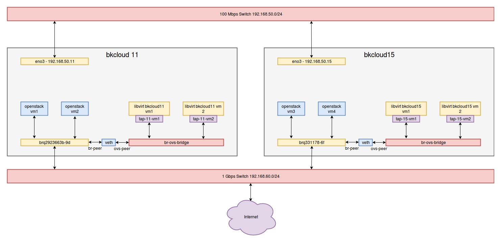

# Xây dựng hệ thống máy ảo và hệ thống mạng bridge network OpenVswitch ảo cho các máy ảo libvirt trên một hệ thống máy chủ đang cài đặt OpenStack sử dụng linuxbrige

Trong quá trình khai thác hệ thống máy chủ vật lý, mình gặp một vấn đề khó xử: mình cần xây dựng một hệ thống máy ảo phân bố trên các máy chủ vật lý sử dụng bridge network với bridge ảo được sử dụng là OpenVswitch, để cho phép mình có thể cấu hình được các thiết lập các thông số mạng giữa các máy ảo với nhau cũng như giữa máy ảo với bên ngoài (OpenVswitch làm được điều này vì đây là một SDN brige, cho phép điều khiển và cấu hình hệ thống mạng bằng SDN controller thông qua 2 giao thức là ovsdb và OpenFlow, còn linux bridge thì hiện thời chưa có 2 giao thức này). 

Nhưng có một vấn đề là, hệ thống máy chủ mà mình sẽ triển khai hệ thống máy ảo đã được triển khai và vận hành hệ thống cloud OpenStack sử dụng linux bridge như sau


Mỗi máy chủ trên mô hình có 2 card mạng, một card mạng cắm vào provider network cho OpenStack cloud, một card mạng cắm vào management network của OpenStack Cloud và được gắn ip của management network. Yêu cầu đặt ra là quá trình xây dựng hệ thống máy ảo sử dụng OpenVswitch bridge không được làm ảnh hưởng tới sự hoạt động của hệ thống Cloud cũng như không làm ảnh hưởng tới các kết nối của các máy ảo trên Cloud, đồng thời các hệ thống máy ảo sau khi được xây dựng phải kết nối được ra ngoài internet.

Sau khi suy nghĩ, giải pháp được đưa ra là nối bridge openvswitch với linux bridge bằng virtual device ```veth```. Sau khi xây dựng hệ thống máy ảo, sơ đồ hệ thống sẽ như sau



Các câu lệnh được sử dụng để xây dựng sơ đồ trên (một số tên của một số thiết bị sẽ hơi khác với mô hình, do trên hình vẽ hơi ít diện tích để đặt tên):

```bash

# host bkcloud11

# convention: ip for openvswitch libvirt vm in bkcloud11 host: 

bkcloud11-vm-1 192.168.60.31
bkcloud11-vm-2 192.168.60.32
bkcloud11-vm-3 192.168.60.33

#CONFIG COMMAND

cp /home/bkcloud11/ubuntu-16.04.2-server-amd64.iso  /mnt/libvirt_images/ubuntu-16.04.2-server-amd64.iso

ip link add br-storage-tap type veth peer name ovs-storage-tap
ip link set dev br-storage-tap up
ip link set dev ovs-storage-tap up

brctl addif brq2923663b-9d br-storage-tap

ovs-vsctl add-br br-ovs-bridge
ovs-vsctl add-port br-ovs-bridge ovs-storage-tap
ip link set dev br-ovs-bridge up

ip tuntap add mode tap tap-11-vm1
ip link set dev tap-11-vm1 up
ifconfig tap-11-vm1 up

ovs-vsctl add-port br-ovs-bridge tap-11-vm1

sudo virt-install \
--virt-type=kvm \
--name bkcloud11-vm-1 \
--ram 3072 \
--vcpus=3 \
--cpu host-model-only,force=vmx \
--os-variant ubuntu16.04 \
--virt-type=kvm \
--hvm \
--cdrom=/mnt/libvirt_images/ubuntu-16.04.2-server-amd64.iso \
--graphics vnc,listen=0.0.0.0 --noautoconsole \
--disk path=/mnt/libvirt_images/bkcloud11-vm-1.qcow2,size=80,bus=virtio,format=qcow2


virsh edit bkcloud11-vm-1

    <interface type='bridge'>
      <source bridge='br-ovs-bridge'/>
      <virtualport type='openvswitch'>
      </virtualport>
      <target dev='tap-11-vm1'/>
      <model type='virtio'/>
      <alias name='net0'/>
      <address type='pci' domain='0x0000' bus='0x00' slot='0x03' function='0x0'/>
    </interface>


ip tuntap add mode tap tap-11-vm2
ip link set dev tap-11-vm2 up
ifconfig tap-11-vm2 up
ovs-vsctl add-port br-ovs-bridge tap-11-vm2

virsh vol-clone --pool libvirt_images bkcloud11-vm-1.qcow2 bkcloud11-vm-2.qcow2

sudo virt-install \
--virt-type=kvm \
--name bkcloud11-vm-2 \
--ram 3072 \
--vcpus=4 \
--cpu host-model-only,force=vmx \
--os-variant ubuntu16.04 \
--virt-type=kvm \
--hvm \
--graphics vnc,listen=0.0.0.0 --noautoconsole \
--boot=hd \
--disk path=/mnt/libvirt_images/bkcloud11-vm-2.qcow2,bus=virtio,format=qcow2


virsh edit bkcloud11-vm-2

    <interface type='bridge'>
      <source bridge='br-ovs-bridge'/>
      <virtualport type='openvswitch'>
      </virtualport>
      <target dev='tap-11-vm2'/>
      <model type='virtio'/>
      <address type='pci' domain='0x0000' bus='0x00' slot='0x03' function='0x0'/>
    </interface>

    
# host bkcloud15

# convention: ip for openvswitch libvirt vm in bkcloud15 host: 

bkcloud15-vm-1 192.168.60.34
bkcloud15-vm-2 192.168.60.35
bkcloud15-vm-3 192.168.60.36

#CONFIG COMMAND


ip link add br-storage-tap type veth peer name ovs-storage-tap
ip link set dev br-storage-tap up
ip link set dev ovs-storage-tap up

brctl addif brq331178-6f br-storage-tap

ovs-vsctl add-br br-ovs-bridge
ovs-vsctl add-port br-ovs-bridge ovs-storage-tap
ip link set dev br-ovs-bridge up

ip tuntap add mode tap tap-15-vm1
ip link set dev tap-15-vm1 up
ifconfig tap-15-vm1 up
ovs-vsctl add-port br-ovs-bridge tap-15-vm1

sudo virt-install \
--virt-type=kvm \
--name bkcloud15-vm-1 \
--ram 3072 \
--vcpus=4 \
--cpu host-model-only,force=vmx \
--os-variant ubuntu16.04 \
--virt-type=kvm \
--hvm \
--cdrom=/var/lib/libvirt/boot/ubuntu-16.04.2-server-amd64.iso \
--graphics vnc,listen=0.0.0.0 --noautoconsole \
--disk path=/var/lib/libvirt/images/bkcloud15-vm-1.qcow2,size=80,bus=virtio,format=qcow2


virsh edit bkcloud15-vm-1

    <interface type='bridge'>
      <source bridge='br-ovs-bridge'/>
      <virtualport type='openvswitch'>
      </virtualport>
      <target dev='tap-15-vm1'/>
      <model type='virtio'/>
      <alias name='net0'/>
      <address type='pci' domain='0x0000' bus='0x00' slot='0x03' function='0x0'/>
    </interface>


ip tuntap add mode tap tap-15-vm2
ip link set dev tap-15-vm2 up
ifconfig tap-15-vm2 up
ovs-vsctl add-port br-ovs-bridge tap-15-vm2

virsh vol-clone --pool images bkcloud15-vm-1.qcow2 bkcloud15-vm-2.qcow2

sudo virt-install \
--virt-type=kvm \
--name bkcloud15-vm-2 \
--ram 3072 \
--vcpus=4 \
--cpu host-model-only,force=vmx \
--os-variant ubuntu16.04 \
--virt-type=kvm \
--hvm \
--graphics vnc,listen=0.0.0.0 --noautoconsole \
--boot=hd \
--disk path=/var/lib/libvirt/images/bkcloud15-vm-2.qcow2,bus=virtio,format=qcow2 

virsh edit bkcloud15-vm-2

    <interface type='bridge'>
      <source bridge='br-ovs-bridge'/>
      <virtualport type='openvswitch'>
      </virtualport>
      <target dev='tap-15-vm2'/>
      <model type='virtio'/>
      <address type='pci' domain='0x0000' bus='0x00' slot='0x03' function='0x0'/>
    </interface>

```

Để xây dựng được hệ thống như sơ đồ mà mình đã giới thiệu, mình đã sử dụng các câu lệnh mà đã được giới thiệu ở bài viết trước. Ngoài ra, trong bài viết này để kết nối linux bridge với openvswitch chúng ta sử dụng thêm virtual device veth với 2 đầu (peer) được đặt tên. Để mạng thông suốt, như các bạn đã thấy, chúng ta cần kích hoạt cả 2 đầu card mạng trên bằng các câu lệnh

```bash

ip link add br-storage-tap type veth peer name ovs-storage-tap
ip link set dev br-storage-tap up
ip link set dev ovs-storage-tap up

```

Sau khi thực hiện các câu lệnh trên, chúng ta tiến hành cấu hình địa chỉ IP mạng cho các mấy ảo vừa được tạo ra bằng libvirt rồi kích hoạt cấu hình mạng trên các máy ảo và kiểm tra lại kết quả.
