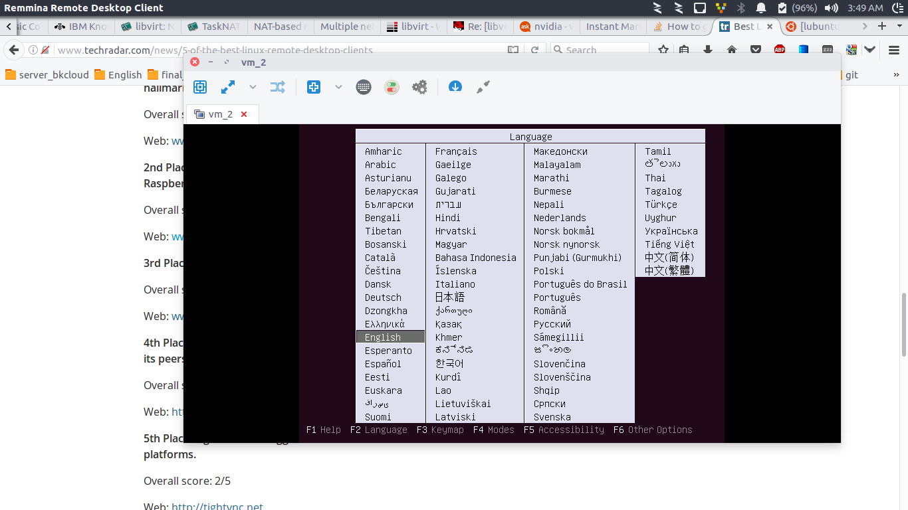
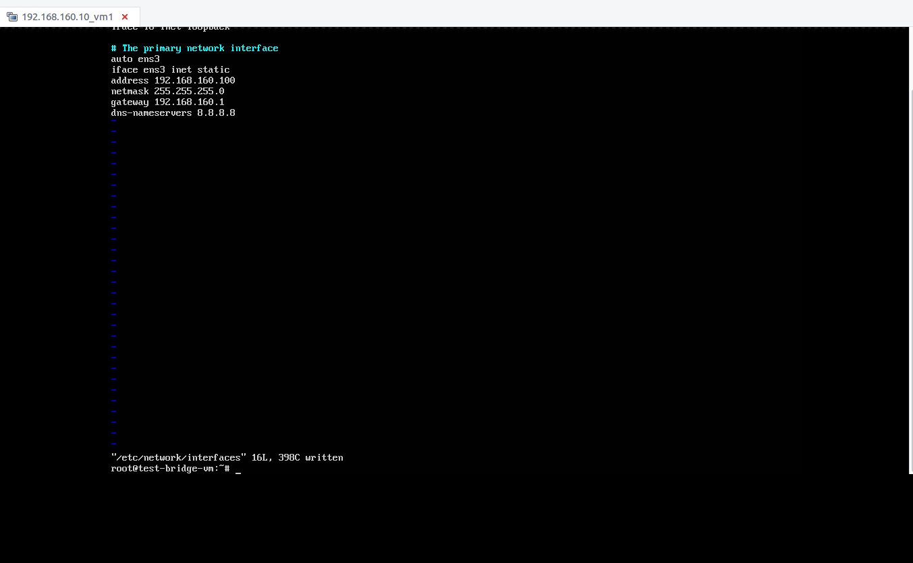
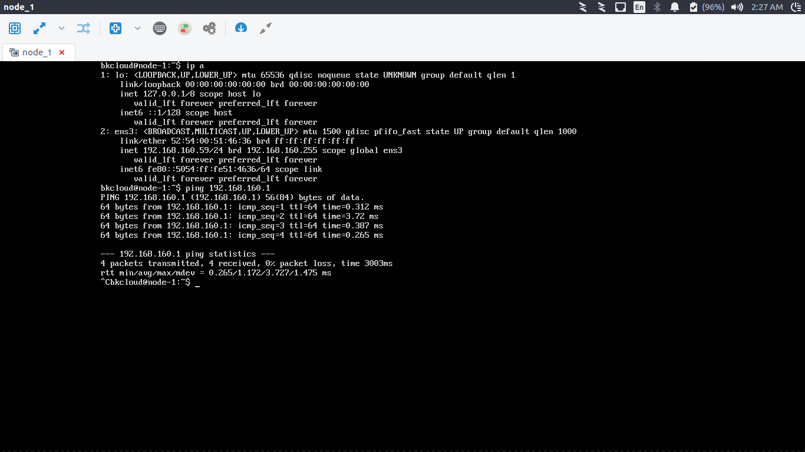
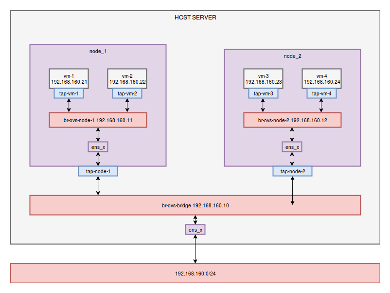

# OpenVSwitch and Libvirt Notes

<!-- TOC -->

- [OpenVSwitch and Libvirt Notes](#openvswitch-and-libvirt-notes)
    - [Libvirt Notes with linux bridge](#libvirt-notes-with-linux-bridge)
        - [Install libvirt and linux bridge package](#install-libvirt-and-linux-bridge-package)
        - [Libvirt Networking Management](#libvirt-networking-management)
    - [KVM Notes with OpenVSwitch](#kvm-notes-with-openvswitch)
        - [Create a new VM with OpenVswitch Bridge Networking](#create-a-new-vm-with-openvswitch-bridge-networking)
        - [Create OpenVswitch Network Management System](#create-openvswitch-network-management-system)
    - [References](#references)

<!-- /TOC -->

## Libvirt Notes with linux bridge

### Install libvirt and linux bridge package

- Cài đặt các package cần cài đặt để chạy máy ảo với kvm hypervisor và libvirt library

```bash
#apt-get install qemu-kvm libvirt-bin virtinst bridge-utils cpu-checker
```

- Verify kvm installation

```bash
$ kvm-ok
INFO: /dev/kvm exists
KVM acceleration can be used
```

Nếu như câu  lệnh này không hiển thị ra kết quả như trên, điều đó nghĩa là máy host không hỗ trợ kvm, lúc này bạn chỉ có thể chạy máy ảo với hypervisor là qemu (tốc độ chậm hơn rất nhiều so với kvm).

### Libvirt Networking Management

**Create libvirt network**

- Kiểm tra các mạng của libvirt có trên host

```bash

root@cong-HP-ProBook-450-G1:~# virsh net-list --all
 Name                 State      Autostart     Persistent
----------------------------------------------------------
 192.168.90.0         active     yes           yes
 default              active     yes           yes
 ext-net              active     yes           yes
 manage-net           active     yes           yes

```

- Kiểm tra danh sách các mạng libvirt đang có trên host

```bash
root@cong-HP-ProBook-450-G1:/home/cong# virsh net-list --all
 Name                 State      Autostart     Persistent
----------------------------------------------------------
 192.168.90.0         active     yes           yes
 default              active     yes           yes
 ext-net              active     yes           yes
 manage-net           active     yes           yes
 ```
- Tạo một file xml define mạng mới cho libvirt, ví dụ như file ```192.168.160.0.xml```

```xml

cong@cong-HP-ProBook-450-G1:~$ cat 192.168.160.0.xml 
<network>
  <name>192.168.160.0</name>
  <forward mode='nat'/>
  <bridge name='br140' stp='on' delay='0'/>
  <mac address='52:54:00:a9:34:5c'/>
  <domain name='8.8.8.8'/>
  <ip address='192.168.160.1' netmask='255.255.255.0'>
    <dhcp>
      <range start='192.168.160.2' end='192.168.160.254'/>
    </dhcp>
  </ip>
</network>

```

File ```192.168.160.0.xml``` định nghĩa một mạng có địa chỉ 192.168.160.0/24, gateway 192.168.160.1, loại mạng là NAT của libvirt networking, địa chỉ DNS là 8.8.8.8

- Định nghĩa một mạng mới cho libvirt với input là file ```192.168.160.0.xml```: 

```bash

root@cong-HP-ProBook-450-G1:/home/cong# virsh net-define 192.168.160.0.xml
Network 192.168.160.0 defined from 192.168.160.0.xml

```

- Mạng libvirt mới tạo sẽ chưa hoạt động - active/start.

```bash

root@cong-HP-ProBook-450-G1:/home/cong# virsh net-list --all
 Name                 State      Autostart     Persistent
----------------------------------------------------------
 192.168.160.0        inactive   no            yes
 192.168.90.0         active     yes           yes
 default              active     yes           yes
 ext-net              active     yes           yes
 manage-net           active     yes           yes

```

- Để active/start mạng mới:

```bash

root@cong-HP-ProBook-450-G1:/home/cong# virsh net-start 192.168.160.0
Network 192.168.160.0 started
root@cong-HP-ProBook-450-G1:/home/cong# virsh net-list --all
 Name                 State      Autostart     Persistent
----------------------------------------------------------
 192.168.160.0        active     no            yes
 192.168.90.0         active     yes           yes
 default              active     yes           yes
 ext-net              active     yes           yes
 manage-net           active     yes           yes

```

- Thiết lập một mạng tự động autostart mỗi lần khởi động host lên

```bash

root@cong-HP-ProBook-450-G1:/home/cong# virsh net-autostart 192.168.160.0
Network 192.168.160.0 marked as autostarted

root@cong-HP-ProBook-450-G1:/home/cong# virsh net-list --all
 Name                 State      Autostart     Persistent
----------------------------------------------------------
 192.168.160.0        active     yes           yes
 192.168.90.0         active     yes           yes
 default              active     yes           yes
 ext-net              active     yes           yes
 manage-net           active     yes           yes

```

**View libvirt network info**

- Xem trạng thái của mạng

```bash

root@cong-HP-ProBook-450-G1:/home/cong# virsh net-info 192.168.160.0
Name:           192.168.160.0
UUID:           d7987f46-2bf9-4a27-b02f-eba46821a4fe
Active:         yes
Persistent:     yes
Autostart:      yes
Bridge:         br140

```

- Xem thông số cấu hình của mạng

```bash

root@cong-HP-ProBook-450-G1:/home/cong# virsh net-dumpxml 192.168.160.0
<network>
  <name>192.168.160.0</name>
  <uuid>d7987f46-2bf9-4a27-b02f-eba46821a4fe</uuid>
  <forward mode='nat'>
    <nat>
      <port start='1024' end='65535'/>
    </nat>
  </forward>
  <bridge name='br140' stp='on' delay='0'/>
  <mac address='52:54:00:a9:34:5c'/>
  <domain name='8.8.8.8'/>
  <ip address='192.168.160.1' netmask='255.255.255.0'>
    <dhcp>
      <range start='192.168.160.2' end='192.168.160.254'/>
    </dhcp>
  </ip>
</network>

```

**Edit a libvirt network**

- Mở file cấu hình và thay đổi cấu hình một mạng libvirt bằng câu lệnh ```virsh net-edit```

```bash

root@cong-HP-ProBook-450-G1:/home/cong# virsh net-edit 192.168.160.0

```

Màn hình editor mở ra, bạn cần sửa đổi file cấu hình, sau đó lưu lại

```bash

<network>
  <name>192.168.160.0</name>
  <uuid>d7987f46-2bf9-4a27-b02f-eba46821a4fe</uuid>
  <forward mode='nat'/>
  <bridge name='br160' stp='on' delay='0'/>
  <mac address='52:54:00:dd:a2:cf'/>
  <domain name='8.8.8.8'/>
  <ip address='192.168.160.1' netmask='255.255.255.0'>
    <dhcp>
      <range start='192.168.160.2' end='192.168.160.200'/>
    </dhcp>
  </ip>
</network>

```

- Ngừng hoạt động mạng vừa sửa đổi, sau đó khởi động lại mạng đó để kích hoạt cấu hình mới

```bash

root@cong-HP-ProBook-450-G1:/home/cong# virsh net-destroy 192.168.160.0
Network 192.168.160.0 destroyed

root@cong-HP-ProBook-450-G1:/home/cong# virsh net-start 192.168.160.0
Network 192.168.160.0 started

```

- Kiểm tra thông tin cấu hình của mạng

```bash

root@cong-HP-ProBook-450-G1:/home/cong# virsh net-info 192.168.160.0
Name:           192.168.160.0
UUID:           d7987f46-2bf9-4a27-b02f-eba46821a4fe
Active:         yes
Persistent:     yes
Autostart:      yes
Bridge:         br160

root@cong-HP-ProBook-450-G1:/home/cong# virsh net-dumpxml 192.168.160.0
<network>
  <name>192.168.160.0</name>
  <uuid>d7987f46-2bf9-4a27-b02f-eba46821a4fe</uuid>
  <forward mode='nat'>
    <nat>
      <port start='1024' end='65535'/>
    </nat>
  </forward>
  <bridge name='br160' stp='on' delay='0'/>
  <mac address='52:54:00:dd:a2:cf'/>
  <domain name='8.8.8.8'/>
  <ip address='192.168.160.1' netmask='255.255.255.0'>
    <dhcp>
      <range start='192.168.160.2' end='192.168.160.200'/>
    </dhcp>
  </ip>
</network>

```

**Delete a libvirt network**

- Ngừng hoạt động mạng cần xóa

```bash

root@cong-HP-ProBook-450-G1:/home/cong# virsh net-destroy 192.168.160.0
Network 192.168.160.0 destroyed

root@cong-HP-ProBook-450-G1:/home/cong# virsh net-list --all
 Name                 State      Autostart     Persistent
----------------------------------------------------------
 192.168.160.0        inactive   yes           yes
 192.168.90.0         active     yes           yes
 default              active     yes           yes
 ext-net              active     yes           yes
 manage-net           active     yes           yes

root@cong-HP-ProBook-450-G1:/home/cong# virsh net-info 192.168.160.0
Name:           192.168.160.0
UUID:           d7987f46-2bf9-4a27-b02f-eba46821a4fe
Active:         no
Persistent:     yes
Autostart:      yes
Bridge:         br160

```

- Xóa bỏ định nghĩa của mạng

```bash

root@cong-HP-ProBook-450-G1:/home/cong# virsh net-undefine 192.168.160.0
Network 192.168.160.0 has been undefined

root@cong-HP-ProBook-450-G1:/home/cong# virsh net-list --all
 Name                 State      Autostart     Persistent
----------------------------------------------------------
 192.168.90.0         active     yes           yes
 default              active     yes           yes
 ext-net              active     yes           yes
 manage-net           active     yes           yes

root@cong-HP-ProBook-450-G1:/home/cong# virsh net-info 192.168.160.0
error: failed to get network '192.168.160.0'
error: Network not found: no network with matching name '192.168.160.0'

```


### Libvirt Volume Management

- Kiểm tra các volume đang có trên host

```bash

root@cong-HP-ProBook-450-G1:~# virsh pool-list
 Name                 State      Autostart 
-------------------------------------------
 default              active     no  

```

- Kiểm tra các volume đang có trên một pool

```bash

root@cong-HP-ProBook-450-G1:~# virsh vol-list default
 Name                 Path                                    
------------------------------------------------------------------------------
 devstack.qcow2       /var/lib/libvirt/images/devstack.qcow2  
 devstack_mitaka.qcow2 /var/lib/libvirt/images/devstack_mitaka.qcow2

```

- Tạo một volume mới trên một pool xác định với kích thước và format

```bash

root@cong-HP-ProBook-450-G1:~# virsh vol-create-as default openvswitch-kvm.qcow2 50G --format qcow2
Vol openvswitch-kvm created

```

- Xóa một volume khỏi host

```bash

root@cong-HP-ProBook-450-G1:~# virsh vol-delete --pool default openvswitch-kvm.qcow2
Vol openvswitch-kvm deleted

```

- Nhân bản (clone) một volume

```bash

root@cong-HP-ProBook-450-G1:/home/cong# virsh vol-list --pool default
 Name                 Path                                    
------------------------------------------------------------------------------
 devstack.qcow2       /var/lib/libvirt/images/devstack.qcow2  
 devstack_mitaka.qcow2 /var/lib/libvirt/images/devstack_mitaka.qcow2
 openvswitch-kvm.qcow2 /var/lib/libvirt/images/openvswitch-kvm.qcow2

root@cong-HP-ProBook-450-G1:/home/cong# virsh vol-clone --pool default openvswitch-kvm.qcow2 openvswitch-kvm-clone.qcow2
Vol openvswitch-kvm-clone.qcow2 cloned from openvswitch-kvm.qcow2

```

### Libvirt Virtual Machine Management

- Danh sách các máy ảo trên host

```bash

root@cong-HP-ProBook-450-G1:/home/cong# virsh list --all
 Id    Name                           State
----------------------------------------------------
-     swift-devstack                 shut off
-     ubuntu16.04_server             shut off

```

**Create a new VM with NAT Libvirt Network**

Kiểm tra lại tình trạng host

```bash

root@cong-HP-ProBook-450-G1:/home/cong#  egrep -c '(vmx|svm)' /proc/cpuinfo
4

root@cong-HP-ProBook-450-G1:/home/cong# cat /proc/meminfo 
MemTotal:       10115740 kB
MemFree:         2979288 kB
MemAvailable:    4838348 kB
Buffers:          223928 kB
Cached:          2067304 kB
SwapCached:        63888 kB
Active:          4906084 kB
Inactive:        1754808 kB
Active(anon):    3967080 kB
Inactive(anon):   709096 kB
Active(file):     939004 kB
Inactive(file):  1045712 kB
Unevictable:        9300 kB
Mlocked:            9300 kB
SwapTotal:      10361852 kB
SwapFree:        9819204 kB
Dirty:              7464 kB
Writeback:             0 kB
AnonPages:       3441836 kB
Mapped:           434924 kB
Shmem:            298804 kB
Slab:             292800 kB
SReclaimable:     191488 kB
SUnreclaim:       101312 kB
KernelStack:       12368 kB
PageTables:        55048 kB
NFS_Unstable:          0 kB
Bounce:                0 kB
WritebackTmp:          0 kB
CommitLimit:    15419720 kB
Committed_AS:   11063908 kB
VmallocTotal:   34359738367 kB
VmallocUsed:           0 kB
VmallocChunk:          0 kB
HardwareCorrupted:     0 kB
AnonHugePages:    837632 kB
ShmemHugePages:        0 kB
ShmemPmdMapped:        0 kB
CmaTotal:              0 kB
CmaFree:               0 kB
HugePages_Total:       0
HugePages_Free:        0
HugePages_Rsvd:        0
HugePages_Surp:        0
Hugepagesize:       2048 kB
DirectMap4k:      302592 kB
DirectMap2M:     9013248 kB
DirectMap1G:     1048576 kB

root@cong-HP-ProBook-450-G1:/home/cong# virsh nodeinfo
CPU model:           x86_64
CPU(s):              4
CPU frequency:       808 MHz
CPU socket(s):       1
Core(s) per socket:  2
Thread(s) per core:  2
NUMA cell(s):        1
Memory size:         10115740 KiB

root@cong-HP-ProBook-450-G1:/home/cong# virsh net-list --all
 Name                 State      Autostart     Persistent
----------------------------------------------------------
 192.168.160.0        active     yes           yes
 192.168.90.0         active     yes           yes
 default              active     yes           yes
 ext-net              active     yes           yes
 manage-net           active     yes           yes

root@cong-HP-ProBook-450-G1:/home/cong# virsh vol-list default
 Name                 Path                                    
------------------------------------------------------------------------------
 devstack.qcow2       /var/lib/libvirt/images/devstack.qcow2  
 devstack_mitaka.qcow2 /var/lib/libvirt/images/devstack_mitaka.qcow2
 openvswitch-kvm.qcow2 /var/lib/libvirt/images/openvswitch-kvm.qcow2

```


- Tạo mới một máy ảo với volume là ```openvswitch-kvm.qcow2``` và card mạng cắm vào mạng 192.168.160.0, đĩa cài đặt là Ubuntu Server 16.04 LTS với số lượng CPU là 3, 4096 MB RAM, 

```bash

sudo virt-install \
--virt-type=kvm \
--name openvswitch-kvm \
--ram 4096 \
--vcpus=3 \
--os-variant ubuntu16.04 \
--virt-type=kvm \
--hvm \
--cdrom=/var/lib/libvirt/boot/ubuntu-16.04.2-server-amd64.iso \
--network=network=192.168.160.0,model=virtio \
--graphics vnc,listen=0.0.0.0 --noautoconsole \
--disk path=/var/lib/libvirt/images/openvswitch-kvm.qcow2,bus=virtio,format=qcow2

Starting install...
Creating domain...                                                                                                            |    0 B  00:00:00     
Domain installation still in progress. You can reconnect to 
the console to complete the installation process.

```

- Tìm port VNC mà host mở cho máy ảo vừa tạo:

```bash

root@cong-HP-ProBook-450-G1:/home/cong# virsh vncdisplay openvswitch-kvm
:0

root@cong-HP-ProBook-450-G1:/home/cong# virsh dumpxml openvswitch-kvm |grep vnc
    <graphics type='vnc' port='5900' autoport='yes' listen='0.0.0.0'>

```

- Sử dụng vnc client để kết nối tới máy ảo thông qua port tìm được (ví dụ như Remmina), với ip là ip của máy host (nếu đang kết nối với máy host qua ssh) hoặc là localhost 127.0.0.1

 

Tiến hành cài đặt hệ điều hành lên volume của máy ảo và thiết lập ip cho máy ảo qua dhcp hoặc static ip

**Create a new VM with NAT Libvirt Network and enable feature support kvm - vmx - nested vms**
           
Để tạo một máy ảo có support feature vmx, thì khi thiết lập câu lệnh virt-install chúng ta truyền thêm option về cpu: ```

```bash

sudo virt-install \
--virt-type=kvm \
--name openvswitch-kvm \
--ram 4096 \
--vcpus=3 \
--cpu host-model-only,force=vmx \
--os-variant ubuntu16.04 \
--virt-type=kvm \
--hvm \
--cdrom=/var/lib/libvirt/boot/ubuntu-16.04.2-server-amd64.iso \
--network=network=192.168.160.0,model=virtio \
--graphics vnc,listen=0.0.0.0 --noautoconsole \
--disk path=/var/lib/libvirt/images/openvswitch-kvm.qcow2,bus=virtio,format=qcow2          

Starting install...
Creating domain...                                                                                                            |    0 B  00:00:00     
Domain installation still in progress. You can reconnect to 
the console to complete the installation process.
root@cong-HP-ProBook-450-G1:/home/cong# virsh dumpxml openvswitch-kvm | grep vnc
    <graphics type='vnc' port='5900' autoport='yes' listen='0.0.0.0'>

bkcloud@openvswitch-kvm:~$ cat /proc/cpuinfo | grep "vmx"
flags		: fpu vme de pse tsc msr pae mce cx8 apic sep mtrr pge mca cmov pat pse36 clflush mmx fxsr sse sse2 syscall nx lm constant_tsc rep_good nopl pni pclmulqdq vmx ssse3 cx16 sse4_1 sse4_2 x2apic popcnt aes hypervisor lahf_lm tpr_shadow vnmi flexpriority ept vpid arat
flags		: fpu vme de pse tsc msr pae mce cx8 apic sep mtrr pge mca cmov pat pse36 clflush mmx fxsr sse sse2 syscall nx lm constant_tsc rep_good nopl pni pclmulqdq vmx ssse3 cx16 sse4_1 sse4_2 x2apic popcnt aes hypervisor lahf_lm tpr_shadow vnmi flexpriority ept vpid arat
flags		: fpu vme de pse tsc msr pae mce cx8 apic sep mtrr pge mca cmov pat pse36 clflush mmx fxsr sse sse2 syscall nx lm constant_tsc rep_good nopl pni pclmulqdq vmx ssse3 cx16 sse4_1 sse4_2 x2apic popcnt aes hypervisor lahf_lm tpr_shadow vnmi flexpriority ept vpid arat

```

**Clone a VM**

Cách 1 - Clone ổ cứng của máy ảo rồi chạy một máy ảo mới từ ổ cứng vừa được clone

- Shutdown máy ảo cần clone


```bash

root@cong-HP-ProBook-450-G1:/home/cong# virsh shutdown openvswitch-kvm
Domain openvswitch-kvm is being shutdown

root@cong-HP-ProBook-450-G1:/home/cong# virsh list
 Id    Name                           State
----------------------------------------------------

root@cong-HP-ProBook-450-G1:/home/cong# virsh list --all
 Id    Name                           State
----------------------------------------------------
 -     openvswitch-kvm                shut off
 -     swift-devstack                 shut off
 -     ubuntu16.04_server             shut off

```

- Clone một volume mới từ volume cũ

```bash

root@cong-HP-ProBook-450-G1:/home/cong# virsh vol-clone --pool default openvswitch-kvm.qcow2 openvswitch-kvm-clone.qcow2
Vol openvswitch-kvm-clone.qcow2 cloned from openvswitch-kvm.qcow2

root@cong-HP-ProBook-450-G1:/home/cong# virsh vol-list default
 Name                 Path                                    
------------------------------------------------------------------------------
 devstack.qcow2       /var/lib/libvirt/images/devstack.qcow2  
 devstack_mitaka.qcow2 /var/lib/libvirt/images/devstack_mitaka.qcow2
 openvswitch-kvm-clone.qcow2 /var/lib/libvirt/images/openvswitch-kvm-clone.qcow2
 openvswitch-kvm.qcow2 /var/lib/libvirt/images/openvswitch-kvm.qcow2

```

- Tạo một máy ảo mới từ volume được clone, lần này chúng ta cần xóa bỏ option cdrom và thêm option ```--boot=hd \```

```bash

sudo virt-install \
--virt-type=kvm \
--name openvswitch-kvm-2 \
--ram 4096 \
--vcpus=3 \
--cpu host-model-only,force=vmx \
--os-variant ubuntu16.04 \
--virt-type=kvm \
--hvm \
--network=network=192.168.160.0,model=virtio \
--graphics vnc,listen=0.0.0.0 --noautoconsole \
--boot=hd \
--disk path=/var/lib/libvirt/images/openvswitch-kvm-clone.qcow2,bus=virtio,format=qcow2 

Starting install...
Creating domain...                                                                                                            |    0 B  00:00:00     
Domain creation completed.
root@cong-HP-ProBook-450-G1:/home/cong# virsh list --all
 Id    Name                           State
----------------------------------------------------
 26    openvswitch-kvm-2              running
 -     openvswitch-kvm                shut off
 -     swift-devstack                 shut off
 -     ubuntu16.04_server             shut off

root@cong-HP-ProBook-450-G1:/home/cong# virsh dumpxml openvswitch-kvm-2 | grep "vnc"
    <graphics type='vnc' port='5900' autoport='yes' listen='0.0.0.0'>

root@cong-HP-ProBook-450-G1:/home/cong# virsh start openvswitch-kvm
Domain openvswitch-kvm started

root@cong-HP-ProBook-450-G1:/home/cong# virsh list --all
 Id    Name                           State
----------------------------------------------------
 26    openvswitch-kvm-2              running
 27    openvswitch-kvm                running
 -     swift-devstack                 shut off
 -     ubuntu16.04_server             shut off

root@cong-HP-ProBook-450-G1:/home/cong# virsh dumpxml openvswitch-kvm | grep "vnc"
    <graphics type='vnc' port='5901' autoport='yes' listen='0.0.0.0'>

```

Cách 2 - Clone trực tiếp host đồng thời xác định volume mới cho máy ảo mới

- Shutdown máy ảo cần clone

```bash

root@cong-HP-ProBook-450-G1:/home/cong# virsh shutdown openvswitch-kvm
Domain openvswitch-kvm is being shutdown

```

```bash

root@cong-HP-ProBook-450-G1:/home/cong# virt-clone --original openvswitch-kvm --name openvswitch-kvm-3 --file /var/lib/libvirt/images/openvswitch-kvm-3.qcow2
Allocating 'openvswitch-kvm-3.qcow2'                                                                                          |  50 GB  00:00:07     

Clone 'openvswitch-kvm-3' created successfully.
root@cong-HP-ProBook-450-G1:/home/cong# virsh vol-list --pool default
 Name                 Path                                    
------------------------------------------------------------------------------
 devstack.qcow2       /var/lib/libvirt/images/devstack.qcow2  
 devstack_mitaka.qcow2 /var/lib/libvirt/images/devstack_mitaka.qcow2
 openvswitch-kvm-3.qcow2 /var/lib/libvirt/images/openvswitch-kvm-3.qcow2
 openvswitch-kvm-clone.qcow2 /var/lib/libvirt/images/openvswitch-kvm-clone.qcow2
 openvswitch-kvm.qcow2 /var/lib/libvirt/images/openvswitch-kvm.qcow2

root@cong-HP-ProBook-450-G1:/home/cong# virsh list --all
 Id    Name                           State
----------------------------------------------------
 26    openvswitch-kvm-2              running
 -     openvswitch-kvm                shut off
 -     openvswitch-kvm-3              shut off
 -     swift-devstack                 shut off
 -     ubuntu16.04_server             shut off

root@cong-HP-ProBook-450-G1:/home/cong# virsh start openvswitch-kvm-3
Domain openvswitch-kvm-3 started

root@cong-HP-ProBook-450-G1:/home/cong# virsh dumpxml openvswitch-kvm-3 | grep "vnc"
    <graphics type='vnc' port='5901' autoport='yes' listen='0.0.0.0'>
root@cong-HP-ProBook-450-G1:/home/cong# virsh list --all
 Id    Name                           State
----------------------------------------------------
 26    openvswitch-kvm-2              running
 29    openvswitch-kvm-3              running
 -     openvswitch-kvm                shut off
 -     swift-devstack                 shut off
 -     ubuntu16.04_server             shut off

 ```

**Create a new VM with bridge/route network**

Để tạo mới một máy ảo với option mạng bridge/route network, trước tiên chúng ta cần phải tạo ra một bridge và nối nó với card mạng vật lý. Trong phần này chúng ta sử dụng bridge của linux. 

Vì phần này cần phải tác động tới hệ thống mạng vật lý, do vậy chúng ta sẽ thử nghiệm với host là máy ảo **openvswitch-kvm-2** đã tạo ra phần trước và đã enable **vmx** option cho kvm hypervisor

- Tiến hành cài đặt các gói cần thiết

```bash

root@openvswitch-kvm-2:~#  apt-get install bridge-utils

```

- Thiết lập cấu hình mạng với bridge có ip và nối với card mạng interface của host

```conf

root@openvswitch-kvm-2:~# vim /etc/network/interfaces
root@openvswitch-kvm-2:~# cat /etc/network/interfaces
# This file describes the network interfaces available on your system
# and how to activate them. For more information, see interfaces(5).

source /etc/network/interfaces.d/*

# The loopback network interface
auto lo
iface lo inet loopback

# The primary network interface
#auto ens3
#iface ens3 inet dhcp

auto ens3
iface ens3 inet manual

auto br-vm
iface br-vm inet static
    # Use the MAC address identified above.
    address 192.168.160.10
    netmask 255.255.255.0
    gateway 192.168.160.1
    dns-nameservers 8.8.8.8

    bridge_ports ens3
    # If you want to turn on Spanning Tree Protocol, ask your hosting
    # provider first as it may conflict with their network.
    bridge_stp off
    # If STP is off, set to 0. If STP is on, set to 2 (or greater).
    bridge_fd 0

```

- Khởi động lại máy tính và kiểm tra cấu hình mạng của host

```bash

bkcloud@openvswitch-kvm-2:~$ ip a
1: lo: <LOOPBACK,UP,LOWER_UP> mtu 65536 qdisc noqueue state UNKNOWN group default qlen 1
    link/loopback 00:00:00:00:00:00 brd 00:00:00:00:00:00
    inet 127.0.0.1/8 scope host lo
       valid_lft forever preferred_lft forever
    inet6 ::1/128 scope host 
       valid_lft forever preferred_lft forever
2: ens3: <BROADCAST,MULTICAST,UP,LOWER_UP> mtu 1500 qdisc pfifo_fast master br-vm state UP group default qlen 1000
    link/ether 52:54:00:03:60:2c brd ff:ff:ff:ff:ff:ff
    inet6 fe80::5054:ff:fe03:602c/64 scope link 
       valid_lft forever preferred_lft forever
3: br-vm: <BROADCAST,MULTICAST,UP,LOWER_UP> mtu 1500 qdisc noqueue state UP group default qlen 1000
    link/ether 52:54:00:03:60:2c brd ff:ff:ff:ff:ff:ff
    inet 192.168.160.10/24 brd 192.168.160.255 scope global br-vm
       valid_lft forever preferred_lft forever
    inet6 fe80::5054:ff:fe03:602c/64 scope link 
       valid_lft forever preferred_lft forever
bkcloud@openvswitch-kvm-2:~$ brctl show
bridge name	bridge id		STP enabled	interfaces
br-vm		8000.52540003602c	no		ens3

```

- Tạo mới một máy ảo với option network là bridge br-vm, sau đó tiến hành cài đặt máy ảo bình thường

```bash

bkcloud@openvswitch-kvm-2:~$ 
sudo virt-install \
--virt-type=kvm \
--name ubuntu_vm_bridge_network \
--ram 2048 \
--vcpus=2 \
--cpu host-model-only,force=vmx \
--os-variant ubuntu16.04 \
--virt-type=kvm \
--hvm \
--cdrom=/var/lib/libvirt/boot/ubuntu-16.04.2-server-amd64.iso \
--network=bridge=br-vm,model=virtio \
--graphics vnc,listen=0.0.0.0 --noautoconsole \
--disk path=/var/lib/libvirt/images/ubuntu_vm_bridge_network.qcow2,size=10,bus=virtio,format=qcow2
sudo: unable to resolve host openvswitch-kvm-2

Starting install...
Creating domain...                                                                                                            |    0 B  00:00:00     
Domain installation still in progress. You can reconnect to 
the console to complete the installation process.
bkcloud@openvswitch-kvm-2:~$ virsh list
setlocale: No such file or directory
 Id    Name                           State
----------------------------------------------------
 2     ubuntu_vm_bridge_network       running

bkcloud@openvswitch-kvm-2:~$ virsh dumpxml ubuntu_vm_bridge_network | grep vnc
setlocale: No such file or directory
    <graphics type='vnc' port='5900' autoport='yes' listen='0.0.0.0'>

```

- Sau khi cài đặt máy ảo, vào máy ảo qua vnc client và sửa cấu hình network thành static ip

 

Cài đặt ssh, sau đó reboot lại máy để kiểm cấu hình ip tĩnh sau khi được kích hoạt

```bash

root@openvswitch-kvm-2:~# ssh bkcloud@192.168.160.100
The authenticity of host '192.168.160.100 (192.168.160.100)' can't be established.
ECDSA key fingerprint is SHA256:OkA/t0E4Dj/wKw3RiNunpvMuw1wICfuvV5NH7kyXBzE.
Are you sure you want to continue connecting (yes/no)? yes
Warning: Permanently added '192.168.160.100' (ECDSA) to the list of known hosts.
bkcloud@192.168.160.100's password: 
Welcome to Ubuntu 16.04.2 LTS (GNU/Linux 4.4.0-62-generic x86_64)

 * Documentation:  https://help.ubuntu.com
 * Management:     https://landscape.canonical.com
 * Support:        https://ubuntu.com/advantage

126 packages can be updated.
62 updates are security updates.


Last login: Wed Sep  6 14:15:46 2017
bkcloud@test-bridge-vm:~$ ip a
1: lo: <LOOPBACK,UP,LOWER_UP> mtu 65536 qdisc noqueue state UNKNOWN group default qlen 1
    link/loopback 00:00:00:00:00:00 brd 00:00:00:00:00:00
    inet 127.0.0.1/8 scope host lo
       valid_lft forever preferred_lft forever
    inet6 ::1/128 scope host 
       valid_lft forever preferred_lft forever
2: ens3: <BROADCAST,MULTICAST,UP,LOWER_UP> mtu 1500 qdisc pfifo_fast state UP group default qlen 1000
    link/ether 52:54:00:80:dc:b9 brd ff:ff:ff:ff:ff:ff
    inet 192.168.160.100/24 brd 192.168.160.255 scope global ens3
       valid_lft forever preferred_lft forever
    inet6 fe80::5054:ff:fe80:dcb9/64 scope link 
       valid_lft forever preferred_lft forever

```

**VM management with libvirt CLI tool**

- Xem danh sách các máy ảo có trên host

```bash
root@cong-HP-ProBook-450-G1:/home/cong# virsh list --all
 Id    Name                           State
----------------------------------------------------
 26    openvswitch-kvm-2              running
 -     openvswitch-kvm                shut off
 -     openvswitch-kvm-3              shut off
 -     swift-devstack                 shut off
 -     ubuntu16.04_server             shut off

```

- Tắt máy ảo (normal shutdown)

```bash

root@cong-HP-ProBook-450-G1:/home/cong# virsh list --all
 Id    Name                           State
----------------------------------------------------
 26    openvswitch-kvm-2              running
 30    openvswitch-kvm                running
 -     openvswitch-kvm-3              shut off
 -     swift-devstack                 shut off
 -     ubuntu16.04_server             shut off

root@cong-HP-ProBook-450-G1:/home/cong# virsh shutdown openvswitch-kvm
Domain openvswitch-kvm is being shutdown

root@cong-HP-ProBook-450-G1:/home/cong# virsh list --all
 Id    Name                           State
----------------------------------------------------
 26    openvswitch-kvm-2              running
 -     openvswitch-kvm                shut off
 -     openvswitch-kvm-3              shut off
 -     swift-devstack                 shut off
 -     ubuntu16.04_server             shut off

```

- Tắt máy ảo ngay lập tức (force shutdown)

```bash

root@cong-HP-ProBook-450-G1:/home/cong# virsh list --all
 Id    Name                           State
----------------------------------------------------
 26    openvswitch-kvm-2              running
 30    openvswitch-kvm                running
 -     openvswitch-kvm-3              shut off
 -     swift-devstack                 shut off
 -     ubuntu16.04_server             shut off

root@cong-HP-ProBook-450-G1:/home/cong# virsh destroy openvswitch-kvm
Domain openvswitch-kvm destroyed

root@cong-HP-ProBook-450-G1:/home/cong# virsh list --all
 Id    Name                           State
----------------------------------------------------
 26    openvswitch-kvm-2              running
 -     openvswitch-kvm                shut off
 -     openvswitch-kvm-3              shut off
 -     swift-devstack                 shut off
 -     ubuntu16.04_server             shut off

```

- Khởi động một máy ảo đang tắt

```bash

root@cong-HP-ProBook-450-G1:/home/cong# virsh list --all
 Id    Name                           State
----------------------------------------------------
 26    openvswitch-kvm-2              running
 -     openvswitch-kvm                shut off
 -     openvswitch-kvm-3              shut off
 -     swift-devstack                 shut off
 -     ubuntu16.04_server             shut off

root@cong-HP-ProBook-450-G1:/home/cong# virsh start openvswitch-kvm
Domain openvswitch-kvm started

root@cong-HP-ProBook-450-G1:/home/cong# virsh list --all
 Id    Name                           State
----------------------------------------------------
 26    openvswitch-kvm-2              running
 32    openvswitch-kvm                running
 -     openvswitch-kvm-3              shut off
 -     swift-devstack                 shut off
 -     ubuntu16.04_server             shut off

```

- Sửa đổi cấu hình máy ảo 

```bash

root@cong-HP-ProBook-450-G1:/home/cong# virsh edit openvswitch-kvm

```

Sau khi sửa đổi xong, chúng ta cần tắt máy ảo đi và bật lại để kích hoạt cấu hình mới

- Xem thông tin chi tiết về một máy ảo 

```xml

root@cong-HP-ProBook-450-G1:/home/cong# virsh dumpxml openvswitch-kvm
<domain type='kvm' id='32'>
  <name>openvswitch-kvm</name>
  <uuid>98570153-44c5-4d00-9ee2-f053f1b82306</uuid>
  <memory unit='KiB'>4194304</memory>
  <currentMemory unit='KiB'>4194304</currentMemory>
  <vcpu placement='static'>3</vcpu>
  <resource>
    <partition>/machine</partition>
  </resource>
  <os>
    <type arch='x86_64' machine='pc-i440fx-xenial'>hvm</type>
    <boot dev='hd'/>
  </os>
  <features>
    <acpi/>
    <apic/>
  </features>
  <cpu mode='custom' match='exact'>
    <model fallback='allow'>Westmere</model>
    <feature policy='force' name='vmx'/>
  </cpu>
  <clock offset='utc'>
    <timer name='rtc' tickpolicy='catchup'/>
    <timer name='pit' tickpolicy='delay'/>
    <timer name='hpet' present='no'/>
  </clock>
  <on_poweroff>destroy</on_poweroff>
  <on_reboot>restart</on_reboot>
  <on_crash>restart</on_crash>
  <pm>
    <suspend-to-mem enabled='no'/>
    <suspend-to-disk enabled='no'/>
  </pm>
  <devices>
    <emulator>/usr/bin/kvm-spice</emulator>
    <disk type='file' device='disk'>
      <driver name='qemu' type='qcow2'/>
      <source file='/var/lib/libvirt/images/openvswitch-kvm.qcow2'/>
      <backingStore/>
      <target dev='vda' bus='virtio'/>
      <alias name='virtio-disk0'/>
      <address type='pci' domain='0x0000' bus='0x00' slot='0x04' function='0x0'/>
    </disk>
    <disk type='file' device='cdrom'>
      <driver name='qemu' type='raw'/>
      <backingStore/>
      <target dev='hda' bus='ide'/>
      <readonly/>
      <alias name='ide0-0-0'/>
      <address type='drive' controller='0' bus='0' target='0' unit='0'/>
    </disk>
    <controller type='usb' index='0' model='ich9-ehci1'>
      <alias name='usb'/>
      <address type='pci' domain='0x0000' bus='0x00' slot='0x05' function='0x7'/>
    </controller>
    <controller type='usb' index='0' model='ich9-uhci1'>
      <alias name='usb'/>
      <master startport='0'/>
      <address type='pci' domain='0x0000' bus='0x00' slot='0x05' function='0x0' multifunction='on'/>
    </controller>
    <controller type='usb' index='0' model='ich9-uhci2'>
      <alias name='usb'/>
      <master startport='2'/>
      <address type='pci' domain='0x0000' bus='0x00' slot='0x05' function='0x1'/>
    </controller>
    <controller type='usb' index='0' model='ich9-uhci3'>
      <alias name='usb'/>
      <master startport='4'/>
      <address type='pci' domain='0x0000' bus='0x00' slot='0x05' function='0x2'/>
    </controller>
    <controller type='pci' index='0' model='pci-root'>
      <alias name='pci.0'/>
    </controller>
    <controller type='ide' index='0'>
      <alias name='ide'/>
      <address type='pci' domain='0x0000' bus='0x00' slot='0x01' function='0x1'/>
    </controller>
    <interface type='network'>
      <mac address='52:54:00:f7:1f:ce'/>
      <source network='192.168.160.0' bridge='br160'/>
      <target dev='vnet1'/>
      <model type='virtio'/>
      <alias name='net0'/>
      <address type='pci' domain='0x0000' bus='0x00' slot='0x03' function='0x0'/>
    </interface>
    <serial type='pty'>
      <source path='/dev/pts/22'/>
      <target port='0'/>
      <alias name='serial0'/>
    </serial>
    <console type='pty' tty='/dev/pts/22'>
      <source path='/dev/pts/22'/>
      <target type='serial' port='0'/>
      <alias name='serial0'/>
    </console>
    <input type='mouse' bus='ps2'/>
    <input type='keyboard' bus='ps2'/>
    <graphics type='vnc' port='5901' autoport='yes' listen='0.0.0.0'>
      <listen type='address' address='0.0.0.0'/>
    </graphics>
    <video>
      <model type='cirrus' vram='16384' heads='1'/>
      <alias name='video0'/>
      <address type='pci' domain='0x0000' bus='0x00' slot='0x02' function='0x0'/>
    </video>
    <memballoon model='virtio'>
      <alias name='balloon0'/>
      <address type='pci' domain='0x0000' bus='0x00' slot='0x06' function='0x0'/>
    </memballoon>
  </devices>
  <seclabel type='dynamic' model='apparmor' relabel='yes'>
    <label>libvirt-98570153-44c5-4d00-9ee2-f053f1b82306</label>
    <imagelabel>libvirt-98570153-44c5-4d00-9ee2-f053f1b82306</imagelabel>
  </seclabel>
</domain>

bkcloud@openvswitch-kvm-2:~$ sudo virsh dumpxml ubuntu_vm_bridge_network
sudo: unable to resolve host openvswitch-kvm-2
[sudo] password for bkcloud: 
setlocale: No such file or directory
<domain type='kvm' id='3'>
  <name>ubuntu_vm_bridge_network</name>
  <uuid>4e9857f7-968d-4ffb-87d0-e042d7e3a964</uuid>
  <memory unit='KiB'>2097152</memory>
  <currentMemory unit='KiB'>2097152</currentMemory>
  <vcpu placement='static'>2</vcpu>
  <resource>
    <partition>/machine</partition>
  </resource>
  <os>
    <type arch='x86_64' machine='pc-i440fx-xenial'>hvm</type>
    <boot dev='hd'/>
  </os>
  <features>
    <acpi/>
    <apic/>
  </features>
  <cpu mode='custom' match='exact'>
    <model fallback='allow'>Westmere</model>
    <feature policy='force' name='vmx'/>
  </cpu>
  <clock offset='utc'>
    <timer name='rtc' tickpolicy='catchup'/>
    <timer name='pit' tickpolicy='delay'/>
    <timer name='hpet' present='no'/>
  </clock>
  <on_poweroff>destroy</on_poweroff>
  <on_reboot>restart</on_reboot>
  <on_crash>restart</on_crash>
  <pm>
    <suspend-to-mem enabled='no'/>
    <suspend-to-disk enabled='no'/>
  </pm>
  <devices>
    <emulator>/usr/bin/kvm-spice</emulator>
    <disk type='file' device='disk'>
      <driver name='qemu' type='qcow2'/>
      <source file='/var/lib/libvirt/images/ubuntu_vm_bridge_network.qcow2'/>
      <backingStore/>
      <target dev='vda' bus='virtio'/>
      <alias name='virtio-disk0'/>
      <address type='pci' domain='0x0000' bus='0x00' slot='0x04' function='0x0'/>
    </disk>
    <disk type='file' device='cdrom'>
      <driver name='qemu' type='raw'/>
      <backingStore/>
      <target dev='hda' bus='ide'/>
      <readonly/>
      <alias name='ide0-0-0'/>
      <address type='drive' controller='0' bus='0' target='0' unit='0'/>
    </disk>
    <controller type='usb' index='0' model='ich9-ehci1'>
      <alias name='usb'/>
      <address type='pci' domain='0x0000' bus='0x00' slot='0x05' function='0x7'/>
    </controller>
    <controller type='usb' index='0' model='ich9-uhci1'>
      <alias name='usb'/>
      <master startport='0'/>
      <address type='pci' domain='0x0000' bus='0x00' slot='0x05' function='0x0' multifunction='on'/>
    </controller>
    <controller type='usb' index='0' model='ich9-uhci2'>
      <alias name='usb'/>
      <master startport='2'/>
      <address type='pci' domain='0x0000' bus='0x00' slot='0x05' function='0x1'/>
    </controller>
    <controller type='usb' index='0' model='ich9-uhci3'>
      <alias name='usb'/>
      <master startport='4'/>
      <address type='pci' domain='0x0000' bus='0x00' slot='0x05' function='0x2'/>
    </controller>
    <controller type='pci' index='0' model='pci-root'>
      <alias name='pci.0'/>
    </controller>
    <controller type='ide' index='0'>
      <alias name='ide'/>
      <address type='pci' domain='0x0000' bus='0x00' slot='0x01' function='0x1'/>
    </controller>
    <interface type='bridge'>
      <mac address='52:54:00:80:dc:b9'/>
      <source bridge='br-vm'/>
      <target dev='vnet0'/>
      <model type='virtio'/>
      <alias name='net0'/>
      <address type='pci' domain='0x0000' bus='0x00' slot='0x03' function='0x0'/>
    </interface>
    <serial type='pty'>
      <source path='/dev/pts/2'/>
      <target port='0'/>
      <alias name='serial0'/>
    </serial>
    <console type='pty' tty='/dev/pts/2'>
      <source path='/dev/pts/2'/>
      <target type='serial' port='0'/>
      <alias name='serial0'/>
    </console>
    <input type='mouse' bus='ps2'/>
    <input type='keyboard' bus='ps2'/>
    <graphics type='vnc' port='5900' autoport='yes' listen='0.0.0.0'>
      <listen type='address' address='0.0.0.0'/>
    </graphics>
    <video>
      <model type='cirrus' vram='16384' heads='1'/>
      <alias name='video0'/>
      <address type='pci' domain='0x0000' bus='0x00' slot='0x02' function='0x0'/>
    </video>
    <memballoon model='virtio'>
      <alias name='balloon0'/>
      <address type='pci' domain='0x0000' bus='0x00' slot='0x06' function='0x0'/>
    </memballoon>
  </devices>
  <seclabel type='dynamic' model='apparmor' relabel='yes'>
    <label>libvirt-4e9857f7-968d-4ffb-87d0-e042d7e3a964</label>
    <imagelabel>libvirt-4e9857f7-968d-4ffb-87d0-e042d7e3a964</imagelabel>
  </seclabel>
</domain>

```

Để xóa bỏ hoàn toàn một máy ảo, ta thực hiện

- Tắt máy ảo nếu, như máy ảo vẫn đang chạy

```bash

root@cong-HP-ProBook-450-G1:~# virsh list --all
 Id    Name                           State
----------------------------------------------------
 26    openvswitch-kvm-2              running
 32    openvswitch-kvm                running
 34    openvswitch-kvm-3              running
 -     swift-devstack                 shut off
 -     ubuntu16.04_server             shut off

root@cong-HP-ProBook-450-G1:~# virsh destroy openvswitch-kvm-3
Domain openvswitch-kvm-3 destroyed

root@cong-HP-ProBook-450-G1:~# virsh list --all
 Id    Name                           State
----------------------------------------------------
 26    openvswitch-kvm-2              running
 32    openvswitch-kvm                running
 -     openvswitch-kvm-3              shut off
 -     swift-devstack                 shut off
 -     ubuntu16.04_server             shut off

```

- Xóa máy ảo khỏi định nghĩa của libvirt

```bash

root@cong-HP-ProBook-450-G1:~# virsh undefine openvswitch-kvm-3
Domain openvswitch-kvm-3 has been undefined

root@cong-HP-ProBook-450-G1:~# virsh list --all
 Id    Name                           State
----------------------------------------------------
 26    openvswitch-kvm-2              running
 32    openvswitch-kvm                running
 -     swift-devstack                 shut off
 -     ubuntu16.04_server             shut off

```

- Xóa bỏ volume của máy ảo 

```bash

root@cong-HP-ProBook-450-G1:~# virsh pool-list
 Name                 State      Autostart 
-------------------------------------------
 boot                 active     yes       
 default              active     no        

root@cong-HP-ProBook-450-G1:~# virsh vol-list default
 Name                 Path                                    
------------------------------------------------------------------------------
 devstack.qcow2       /var/lib/libvirt/images/devstack.qcow2  
 devstack_mitaka.qcow2 /var/lib/libvirt/images/devstack_mitaka.qcow2
 openvswitch-kvm-3.qcow2 /var/lib/libvirt/images/openvswitch-kvm-3.qcow2
 openvswitch-kvm-clone.qcow2 /var/lib/libvirt/images/openvswitch-kvm-clone.qcow2
 openvswitch-kvm.qcow2 /var/lib/libvirt/images/openvswitch-kvm.qcow2

root@cong-HP-ProBook-450-G1:~# virsh vol-delete --pool default openvswitch-kvm-3.qcow2
Vol openvswitch-kvm-3.qcow2 deleted

root@cong-HP-ProBook-450-G1:~# virsh vol-list default
 Name                 Path                                    
------------------------------------------------------------------------------
 devstack.qcow2       /var/lib/libvirt/images/devstack.qcow2  
 devstack_mitaka.qcow2 /var/lib/libvirt/images/devstack_mitaka.qcow2
 openvswitch-kvm-clone.qcow2 /var/lib/libvirt/images/openvswitch-kvm-clone.qcow2
 openvswitch-kvm.qcow2 /var/lib/libvirt/images/openvswitch-kvm.qcow2

```

## KVM Notes with OpenVSwitch

### Create a new VM with OpenVswitch Bridge Networking

Để thiết lập máy ảo sử dụng OpenVswitch làm Bridge Networking, chúng ta tiến hành

- Cài đặt package cần thiết:

```bash

# sudo apt install openvswitch-switch

```

- Sau khi cài đặt package openswitch, tiến hành tạo bridge và gắn bridge vào interface của máy host (không nên làm bước này qua ssh mà nên làm trực tiếp hoặc thông qua vnc):

```bash

ovs-vsctl add-br br-ovs-bridge
ovs-vsctl add-port br-ovs-bridge ens3

```

- Cấu hình địa chỉ ip cho bridge

```bash

# This file describes the network interfaces available on your system
# and how to activate them. For more information, see interfaces(5).

source /etc/network/interfaces.d/*

# The loopback network interface
auto lo
iface lo inet loopback

# The primary network interface
#auto ens3
#iface ens3 inet static
#address 192.168.160.10
#netmask 255.255.255.0
#gateway 192.168.160.1
#dns-nameservers 8.8.8.8


auto ens3
allow-br-ovs-bridge ens3
iface ens3 inet manual
ovs_type OVSPort
ovs_bridge br-ovs-bridge
up ip link set dev $IFACE up
down ip link set dev $IFACE down


#The OVS bridge interface
auto br-ovs-bridge
allow-ovs br-ovs-bridge
iface br-ovs-bridge inet static
ovs_type OVSBridge
ovs_ports ens3
address 192.168.160.10
netmask 255.255.255.0
gateway 192.168.160.1
dns-nameservers 8.8.8.8

```

- Khởi động lại máy host. Sau đó tiến hành tạo máy ảo.

```bash

sudo virt-install \
--virt-type=kvm \
--name ubuntu_vm_1 \
--ram 2048 \
--vcpus=1 \
--cpu host-model-only,force=vmx \
--os-variant ubuntu16.04 \
--virt-type=kvm \
--hvm \
--cdrom=/var/lib/libvirt/boot/ubuntu-16.04.2-server-amd64.iso \
--graphics vnc,listen=0.0.0.0 --noautoconsole \
--disk path=/var/lib/libvirt/images/ubuntu_vm_1.qcow2,size=20,bus=virtio,format=qcow2


Starting install...
Allocating 'ubuntu_vm_1.qcow2'                                                                                                        |  20 GB  00:00:00     
Creating domain...                                                                                                                    |    0 B  00:00:00     
Domain installation still in progress. You can reconnect to 
the console to complete the installation process.
root@openvswitch-kvm-1:~# virsh dumpxml ubuntu_vm_1 | grep vnc
setlocale: No such file or directory
    <graphics type='vnc' port='5900' autoport='yes' listen='0.0.0.0'>

```

- Tiến hành cài đặt máy ảo thông qua vnc.

Ở bước kết nối máy ảo với ovs bridge br-ovs-bridge chúng ta có 2 cách:

Cách 1: Sử dụng tap của libvirt tạo ra - các **vnetx** chính là các tap device do libvirt tạo ra rồi gắn vào bridge, có thể kiểm tra bằng câu lệnh ```ethtool -i <vnet_x>```. Link <https://unix.stackexchange.com/questions/40560/how-to-know-if-a-network-interface-is-tap-tun-bridge-or-physical>

```bash

cong@cong-HP-ProBook-450-G1:~$ brctl show
bridge name	bridge id		STP enabled	interfaces
br160		8000.fe5400f71fce	yes		vnet0
docker0		8000.024292eeb67c	no		
virbr0		8000.000000000000	yes		
virbr1		8000.000000000000	yes		
virbr2		8000.000000000000	yes		
virbr3		8000.000000000000	yes		
cong@cong-HP-ProBook-450-G1:~$ ethtool -i vnet0
driver: tun
version: 1.6
firmware-version: 
expansion-rom-version: 
bus-info: tap
supports-statistics: no
supports-test: no
supports-eeprom-access: no
supports-register-dump: no
supports-priv-flags: no

```

- Sau khi cài đặt xong máy ảo, tiến hành tắt máy ảo, sau đó sửa cấu hình của máy ảo, phần network interface sang sử dụng bridge br-ovs-bridge của openvswitch thay cho inteface network dùng mạng default của libvirt. Sửa element ```<interface type="network">``` trong xml define của máy ảo.

```xml

root@openvswitch-kvm-1:~# virsh shutdown ubuntu_vm_1
setlocale: No such file or directory
Domain ubuntu_vm_1 is being shutdown

root@openvswitch-kvm-1:~# virsh edit ubuntu_vm_1
setlocale: No such file or directory

    <interface type='bridge'>
      <source bridge='br-ovs-bridge'/>
      <virtualport type='openvswitch'>
      </virtualport>
      <model type='virtio'/>
    </interface>
Domain ubuntu_vm_1 XML configuration edited.

```

- Sau đó khởi động máy ảo lên để apply cấu hình mới và sửa đổi ip máy ảo theo ip của mạng provider bên ngoài.

```bash

root@openvswitch-kvm-1:~# virsh start ubuntu_vm_1
Domain ubuntu_vm_1 is being start

```

Cách 2: Tự tạo ra tap device, kết nối tới ovs bridge, sau đó cấu hình để máy ảo nhận mạng ovs bridge cũng như sử dụng tap device mà chúng ta đã tạo ra làm card mạng để kết nối tới các máy khác.

- Tạo tap device và kết nối tap device mới tạo với ovs bridge

```bash

#ip tuntap add mode tap tap-node-1
#ip link set dev tap-node-1 up
#ifconfig tap-node-1 up
#ovs-vsctl add-port br-ovs-bridge tap-node-1

```

- Tạo máy ảo và cài đặt hệ điều hành cho máy ảo

```bash

sudo virt-install \
--virt-type=kvm \
--name node_1 \
--ram 3584 \
--vcpus=2 \
--cpu host-model-only,force=vmx \
--os-variant ubuntu16.04 \
--virt-type=kvm \
--hvm \
--cdrom=/var/lib/libvirt/boot/ubuntu-16.04.2-server-amd64.iso \
--graphics vnc,listen=0.0.0.0 --noautoconsole \
--disk path=/var/lib/libvirt/images/node_1.qcow2,size=20,bus=virtio,format=qcow2

root@openvswitch-kvm-1:~# virsh dumpxml node_1 | grep vnc
setlocale: No such file or directory
    <graphics type='vnc' port='5900' autoport='yes' listen='0.0.0.0'>

```

- Sau khi cài đặt xong hệ điều hành, tắt máy ảo và thực hiện thay đổi cấu hình interface mạng máy ảo

```xml

# virsh edit node_1
...
    <interface type='bridge'>
      <source bridge='br-ovs-bridge'/>
      <virtualport type='openvswitch'>
      </virtualport>
      <target dev='tap-node-1'/>
      <model type='virtio'/>
      <alias name='net0'/>
      <address type='pci' domain='0x0000' bus='0x00' slot='0x03' function='0x0'/>
    </interface>

setlocale: No such file or directory
Domain node_1 XML configuration edited.

```

- Khởi động máy ảo và kiểm tra xem cấu hình đã đáp ứng yêu cầu chưa

```bash

root@openvswitch-kvm-1:~# virsh start node_1
setlocale: No such file or directory
Domain node_1 started

```

 

### Create OpenVswitch Network Management System

Mô hình thử nghiệm:



**Node 1**

- Tạo tap device và kết nối tap device mới tạo với ovs bridge

```bash

ip tuntap add mode tap tap-node-1
ip link set dev tap-node-1 up
ifconfig tap-node-1 up
ovs-vsctl add-port br-ovs-bridge tap-node-1

```

- Tạo máy ảo và cài đặt hệ điều hành cho máy ảo

```bash

sudo virt-install \
--virt-type=kvm \
--name node_1 \
--ram 2560 \
--vcpus=4 \
--cpu host-model-only,force=vmx \
--os-variant ubuntu16.04 \
--virt-type=kvm \
--hvm \
--cdrom=/var/lib/libvirt/boot/ubuntu-16.04.2-server-amd64.iso \
--graphics vnc,listen=0.0.0.0 --noautoconsole \
--disk path=/var/lib/libvirt/images/node_1.qcow2,size=20,bus=virtio,format=qcow2

root@openvswitch-kvm-1:~# virsh dumpxml node_1 | grep vnc
setlocale: No such file or directory
    <graphics type='vnc' port='5900' autoport='yes' listen='0.0.0.0'>

```

- Sau khi cài đặt xong hệ điều hành, tắt máy ảo và thực hiện thay đổi cấu hình interface mạng máy ảo

```xml

# virsh edit node_1
...
    <interface type='bridge'>
      <source bridge='br-ovs-bridge'/>
      <virtualport type='openvswitch'>
      </virtualport>
      <target dev='tap-node-1'/>
      <model type='virtio'/>
      <alias name='net0'/>
      <address type='pci' domain='0x0000' bus='0x00' slot='0x03' function='0x0'/>
    </interface>

setlocale: No such file or directory
Domain node_1 XML configuration edited.

```

- Khởi động máy ảo và kiểm tra xem cấu hình đã đáp ứng yêu cầu chưa

```bash

root@openvswitch-kvm-1:~# virsh start node_1
setlocale: No such file or directory
Domain node_1 started

```

**Node 2**

```bash

ip tuntap add mode tap tap-node-2
ip link set dev tap-node-2 up
ifconfig tap-node-2 up
ovs-vsctl add-port br-ovs-bridge tap-node-2

root@openvswitch-kvm-1:~# virsh shutdown node_1
setlocale: No such file or directory
Domain node_1 is being shutdown

root@openvswitch-kvm-1:~# virsh vol-clone --pool images node_1.qcow2 node_2.qcow2
setlocale: No such file or directory
Vol node_2.qcow2 cloned from node_1.qcow2

root@openvswitch-kvm-1:~# virsh start node_1
setlocale: No such file or directory
Domain node_1 started

root@openvswitch-kvm-1:~# sudo virt-install \
--virt-type=kvm \
--name node_2 \
--ram 2560 \
--vcpus=4 \
--cpu host-model-only,force=vmx \
--os-variant ubuntu16.04 \
--virt-type=kvm \
--hvm \
--graphics vnc,listen=0.0.0.0 --noautoconsole \
--boot=hd \
--disk path=/var/lib/libvirt/images/node_2.qcow2,bus=virtio,format=qcow2 

Starting install...
Creating domain...                                                                                                            |    0 B  00:00:00     
Domain creation completed.

# virsh shutdown node_2
```

```xml

# virsh edit node_2
...
    <interface type='bridge'>
      <source bridge='br-ovs-bridge'/>
      <virtualport type='openvswitch'>
      </virtualport>
      <target dev='tap-node-2'/>
      <model type='virtio'/>
      <address type='pci' domain='0x0000' bus='0x00' slot='0x03' function='0x0'/>
    </interface>

setlocale: No such file or directory
Domain node_2 XML configuration edited.

```

```bash
root@openvswitch-kvm-1:~# virsh start node_2
setlocale: No such file or directory
Domain node_2 started

root@openvswitch-kvm-1:~# virsh dumpxml node_2 | grep vnc
setlocale: No such file or directory
    <graphics type='vnc' port='5901' autoport='yes' listen='0.0.0.0'>
root@openvswitch-kvm-1:~# virsh dumpxml node_1 | grep vnc
setlocale: No such file or directory
    <graphics type='vnc' port='5900' autoport='yes' listen='0.0.0.0'>

```

**Config nodes**

```bash

root@node-1:~# sudo apt install openvswitch-switch
root@node-1:~# cat /etc/network/interfaces
# This file describes the network interfaces available on your system
# and how to activate them. For more information, see interfaces(5).

source /etc/network/interfaces.d/*

# The loopback network interface
auto lo
iface lo inet loopback

# The primary network interface
#auto ens3
#iface ens3 inet dhcp

auto ens3
allow-br-ovs-node-1 ens3
iface ens3 inet manual
ovs_type OVSPort
ovs_bridge br-ovs-node-1
up ip link set dev $IFACE up
down ip link set dev $IFACE down


#The OVS bridge interface
auto br-ovs-node-1
allow-ovs br-ovs-bridge
iface br-ovs-node-1 inet static
ovs_type OVSBridge
ovs_ports ens3
address 192.168.160.11
netmask 255.255.255.0
gateway 192.168.160.1
dns-nameservers 8.8.8.8

root@node-1:~# ovs-vsctl add-br br-ovs-node-1
root@node-1:~# ovs-vsctl add-port br-ovs-node-1 ens3
root@node-1:~# sudo reboot


root@node-2:~# sudo apt install openvswitch-switch
root@node-2:~# cat /etc/network/interfaces
# This file describes the network interfaces available on your system
# and how to activate them. For more information, see interfaces(5).

source /etc/network/interfaces.d/*

# The loopback network interface
auto lo
iface lo inet loopback

# The primary network interface
#auto ens3
#iface ens3 inet dhcp

auto ens3
allow-br-ovs-node-2 ens3
iface ens3 inet manual
ovs_type OVSPort
ovs_bridge br-ovs-node-2
up ip link set dev $IFACE up
down ip link set dev $IFACE down


#The OVS bridge interface
auto br-ovs-node-2
allow-ovs br-ovs-bridge
iface br-ovs-node-2 inet static
ovs_type OVSBridge
ovs_ports ens3
address 192.168.160.12
netmask 255.255.255.0
gateway 192.168.160.1
dns-nameservers 8.8.8.8

root@node-2:~# ovs-vsctl add-br br-ovs-node-2
root@node-2:~# ovs-vsctl add-port br-ovs-node-2 ens3
root@node-2:~# sudo reboot
```

```bash

root@node-1:~# apt-get install qemu-kvm libvirt-bin virtinst bridge-utils cpu-checker
root@node-1:~# kvm-ok
INFO: /dev/kvm exists
KVM acceleration can be used

root@node-2:~# apt-get install qemu-kvm libvirt-bin virtinst bridge-utils cpu-checker
root@node-2:~# kvm-ok 
INFO: /dev/kvm exists
KVM acceleration can be used

```

**Config node 1**

```bash

ip tuntap add mode tap tap-vm-1
ip link set dev tap-vm-1 up
ifconfig tap-vm-1 up
ovs-vsctl add-port br-ovs-node-1 tap-vm-1

ip tuntap add mode tap tap-vm-2
ip link set dev tap-vm-2 up
ifconfig tap-vm-2 up
ovs-vsctl add-port br-ovs-node-1 tap-vm-2

```

```bash
sudo virt-install \
--virt-type=kvm \
--name vm-1 \
--ram 1024 \
--vcpus=2 \
--cpu host-model-only,force=vmx \
--os-variant ubuntu16.04 \
--virt-type=kvm \
--hvm \
--cdrom=/var/lib/libvirt/boot/ubuntu-16.04.2-server-amd64.iso \
--graphics vnc,listen=0.0.0.0 --noautoconsole \
--disk path=/var/lib/libvirt/images/vm-1.qcow2,size=6,bus=virtio,format=qcow2

root@node-1:~# virsh dumpxml vm-1 | grep vnc
setlocale: No such file or directory
    <graphics type='vnc' port='5900' autoport='yes' listen='0.0.0.0'>

```

```xml

# virsh shutdown vm-1

# virsh edit vm-1
...
    <interface type='bridge'>
      <source bridge='br-ovs-node-1'/>
      <virtualport type='openvswitch'>
      </virtualport>
      <target dev='tap-vm-1'/>
      <model type='virtio'/>
      <address type='pci' domain='0x0000' bus='0x00' slot='0x03' function='0x0'/>
    </interface>

setlocale: No such file or directory
Domain vm-1 XML configuration edited.
root@node-1:~# virsh start vm-1
setlocale: No such file or directory
Domain vm-1 started

```

```bash

root@node-1:~# virsh shutdown vm-1
setlocale: No such file or directory
Domain vm-1 is being shutdown

root@node-1:~# virsh vol-clone --pool images vm-1.qcow2 vm-2.qcow2


root@node-1:~# virsh start vm-1
setlocale: No such file or directory
Domain vm-1 started

root@node-1:~# 
sudo virt-install \
--virt-type=kvm \
--name vm-2 \
--ram 1024 \
--vcpus=2 \
--cpu host-model-only,force=vmx \
--os-variant ubuntu16.04 \
--virt-type=kvm \
--hvm \
--graphics vnc,listen=0.0.0.0 --noautoconsole \
--boot=hd \
--disk path=/var/lib/libvirt/images/vm-2.qcow2,bus=virtio,format=qcow2 

Starting install...
Creating domain...                                                                                                            |    0 B  00:00:00     
Domain creation completed.

```

```xml

# virsh shutdown vm-2

# virsh edit vm-2
...
    <interface type='bridge'>
      <source bridge='br-ovs-node-1'/>
      <virtualport type='openvswitch'>
      </virtualport>
      <target dev='tap-vm-2'/>
      <model type='virtio'/>
      <address type='pci' domain='0x0000' bus='0x00' slot='0x03' function='0x0'/>
    </interface>

setlocale: No such file or directory
Domain vm-2 XML configuration edited.
root@node-2:~# virsh start vm-2
setlocale: No such file or directory
Domain vm-2 started

```

**Config node 2**

```bash


ip tuntap add mode tap tap-vm-3
ip link set dev tap-vm-3 up
ifconfig tap-vm-3 up
ovs-vsctl add-port br-ovs-node-2 tap-vm-3

ip tuntap add mode tap tap-vm-4
ip link set dev tap-vm-4 up
ifconfig tap-vm-4 up
ovs-vsctl add-port br-ovs-node-2 tap-vm-4


sudo virt-install \
--virt-type=kvm \
--name vm-3 \
--ram 1024 \
--vcpus=2 \
--cpu host-model-only,force=vmx \
--os-variant ubuntu16.04 \
--virt-type=kvm \
--hvm \
--cdrom=/var/lib/libvirt/boot/ubuntu-16.04.2-server-amd64.iso \
--graphics vnc,listen=0.0.0.0 --noautoconsole \
--disk path=/var/lib/libvirt/images/vm-3.qcow2,size=6,bus=virtio,format=qcow2

root@node-2:~# virsh dumpxml vm-3 | grep vnc
setlocale: No such file or directory
    <graphics type='vnc' port='5900' autoport='yes' listen='0.0.0.0'>

```

```xml

# virsh shutdown vm-3

# virsh edit vm-3
...
    <interface type='bridge'>
      <source bridge='br-ovs-node-2'/>
      <virtualport type='openvswitch'>
      </virtualport>
      <target dev='tap-vm-3'/>
      <model type='virtio'/>
      <address type='pci' domain='0x0000' bus='0x00' slot='0x03' function='0x0'/>
    </interface>

setlocale: No such file or directory
Domain vm-3 XML configuration edited.
root@node-3:~# virsh start vm-3
setlocale: No such file or directory
Domain vm-3 started

```

- Kiểm tra xem cấu hình đã đáp ứng yêu cầu chưa

## References

- <https://www.cyberciti.biz/faq/installing-kvm-on-ubuntu-16-04-lts-server/>
- <https://www.ibm.com/support/knowledgecenter/en/linuxonibm/liabp/liabpcommonvirshstorage.htm>
- <https://www.ibm.com/support/knowledgecenter/en/linuxonibm/liabp/liabpcommonvirshnet.htm>
- <https://libvirt.org/formatdomain.html>
- <https://medium.com/@aaronorosen/open-vswitch-and-libvirt-5ee7d4fc941f>
- <https://unix.stackexchange.com/questions/40560/how-to-know-if-a-network-interface-is-tap-tun-bridge-or-physical>
